

     

<h3 align="center"> Universidad Peruana de Ciencias Aplicadas </h3>

<h3 align="center">Carrera de [Nombre de la Carrera] </h3>

<h3 align="center">[Código del Curso] </h3>
<h3 align="center">[Nombre del Curso] </h3>
<h3 align="center"> NRC </h3>
<h3 align="center"> [Número de NRC] </h3>

<h3 align="center"> [Título del Informe / Trabajo]</h3>

<h3 align="center"> Docente</h3>
<h3 align="center"> [Nombre del Docente] </h3>

<h3 align="center"> Equipo </h3>
<h3 align="center"> [Nombre del Equipo] </h3>

<h3 align="center"> Proyecto</h3>
<h3 align="center"> [Nombre del Proyecto] </h3>

<h3 align="center"> Integrantes </h3>

| Code | Member |
| :---: | :--- |
| [Código 1] | [Nombre del Integrante 1] |
| [Código 2] | [Nombre del Integrante 2] |
| [Código 3] | [Nombre del Integrante 3] |
| [Código 4] | [Nombre del Integrante 4] |
| [Código 5] | [Nombre del Integrante 5] |

<h3 align="center">Periodo [Año-Ciclo]</h3>
<h3 align="center">[Mes Año]</h3>

## Registro de Versiones del Informe

| Versión |   Fecha    |                Autor                |                                                  Descripción de modificación                                                   |
|:-------:|:----------:|:-----------------------------------:|:------------------------------------------------------------------------------------------------------------------------------:|
| [Versión] | [DD-MM-AAAA] | [Apellidos, Nombres] | [Descripción del cambio o aporte] |

## Project Report Collaboration Insights

| Integrante | Tareas Asignadas |
|---|---|
| [Nombre Completo 1] | [Lista de tareas realizadas] |
| [Nombre Completo 2] | [Lista de tareas realizadas] |
| [Nombre Completo 3] | [Lista de tareas realizadas] |
| [Nombre Completo 4] | [Lista de tareas realizadas] |
| [Nombre Completo 5] | [Lista de tareas realizadas] |

El proceso de colaboración en el informe se realizó mediante commits constantes al repositorio de la organización.

# Student Outcome

  <table style="width:100%; border-collapse: collapse; font-family: Arial, sans-serif; font-size: 14px;">
    <thead>
      <tr style="background-color: #f2f2f2; text-align: center;">
        <th style="border: 1px solid #dddddd; padding: 12px; width: 25%;">Criterio específico</th>
        <th style="border: 1px solid #dddddd; padding: 12px; width: 45%;">Acciones realizadas</th>
        <th style="border: 1px solid #dddddd; padding: 12px; width: 30%;">Conclusiones</th>
      </tr>
    </thead>
    <tbody>
      <tr>
        <td style="border: 1px solid #dddddd; padding: 10px; font-weight: bold; vertical-align: top;">
          Trabaja en equipo para proporcionar liderazgo en forma conjunta.
        </td>
        <td style="border: 1px solid #dddddd; padding: 10px; vertical-align: top;">
          <ul>
            <li><b>[Entrega] - [Nombre del Integrante]:</b> [Descripción de la acción realizada]</li>
          </ul>
        </td>
        <td style="border: 1px solid #dddddd; padding: 10px; vertical-align: top;">
          [Conclusión sobre el criterio]
        </td>
      </tr>
      <tr>
        <td style="border: 1px solid #dddddd; padding: 10px; font-weight: bold; vertical-align: top;">
          Crea un entorno colaborativo e inclusivo, establece metas, planifica tareas y cumple objetivos.
        </td>
        <td style="border: 1px solid #dddddd; padding: 10px; vertical-align: top;">
          <ul>
            <li><b>[Entrega] - [Nombre del Integrante]:</b> [Descripción de la acción realizada]</li>
          </ul>
        </td>
        <td style="border: 1px solid #dddddd; padding: 10px; vertical-align: top;">
          [Conclusión sobre el criterio]
        </td>
      </tr>
    </tbody>
  </table>

## Objetivos SMART

## Tabla de Contenidos

* [Capítulo I: Presentación](#capítulo-i-presentación)
  * [1.1. Startup Profile](#11-startup-profile)
    * [1.1.1. Descripción de la Startup](#111-descripción-de-la-startup)
    * [1.1.2. Perfiles de integrantes del equipo](#112-perfiles-de-integrantes-del-equipo)
  * [1.2. Solution Profile](#12-solution-profile)
    * [1.2.1. Antecedentes y problemática](#121-antecedentes-y-problemática)
    * [1.2.2. Lean UX Process](#122-lean-ux-process)
      * [1.2.2.1. Lean UX Problem Statements](#1221-lean-ux-problem-statements)
      * [1.2.2.2. Lean UX Assumptions](#1222-lean-ux-assumptions)
      * [1.2.2.3. Lean UX Hypothesis Statements](#1223-lean-ux-hypothesis-statements)
      * [1.2.2.4. Lean UX Canvas](#1224-lean-ux-canvas)
  * [1.3. Segmentos objetivo](#13-segmentos-objetivo)
* [Capítulo II: Requirements Development and Software Solution Design](#capítulo-ii-requirements-development-and-software-solution-design)
  * [2.1. Competidores](#21-competidores)
    * [2.1.1. Análisis competitivo](#211-análisis-competitivo)
    * [2.1.2. Estrategias y tácticas frente a competidores](#212-estrategias-y-tácticas-frente-a-competidores)
  * [2.2. Entrevistas](#22-entrevistas)
    * [2.2.1. Diseño de entrevistas](#221-diseño-de-entrevistas)
    * [2.2.2. Registro de entrevistas](#222-registro-de-entrevistas)
    * [2.2.3. Análisis de entrevistas](#223-análisis-de-entrevistas)
  * [2.3. Needfinding](#23-needfinding)
    * [2.3.1. User Personas](#231-user-personas)
    * [2.3.2. User Task Matrix](#232-user-task-matrix)
    * [2.3.3. User Journey Mapping](#233-user-journey-mapping)
    * [2.3.4. Empathy Mapping](#234-empathy-mapping)
    * [2.3.5. Big Picture EventStorming](#235-big-picture-eventstorming)
    * [2.3.6. Ubiquitous Language](#236-ubiquitous-language)
  * [2.4. Requirements specification](#24-requirements-specification)
    * [2.4.1. User Stories](#241-user-stories)
    * [2.4.2. Impact Mapping](#242-impact-mapping)
    * [2.4.3. Product Backlog](#243-product-backlog)
  * [2.5. Strategic-Level Domain-Driven Design](#25-strategic-level-domain-driven-design)
    * [2.5.1. EventStorming](#251-eventstorming)
      * [2.5.1.1. Candidate Context Discovery](#2511-candidate-context-discovery)
      * [2.5.1.2. Domain Message Flows Modeling](#2512-domain-message-flows-modeling)
      * [2.5.1.3. Bounded Context Canvases](#2513-bounded-context-canvases)
    * [2.5.2. Context Mapping](#252-context-mapping)
    * [2.5.3. Software Architecture](#253-software-architecture)
      * [2.5.3.1. Software Architecture Context Level Diagrams](#2531-software-architecture-context-level-diagrams)
      * [2.5.3.2. Software Architecture Container Level Diagrams](#2532-software-architecture-container-level-diagrams)
      * [2.5.3.3. Software Architecture Deployment Diagrams](#2533-software-architecture-deployment-diagrams)
  * [2.6. Tactical-Level Domain-Driven Design](#26-tactical-level-domain-driven-design)
    * [2.6.x. Bounded Context: <Bounded Context Name>](#26x-bounded-context-bounded-context-name)
      * [2.6.x.1. Domain Layer](#26x1-domain-layer)
      * [2.6.x.2. Interface Layer](#26x2-interface-layer)
      * [2.6.x.3. Application Layer](#26x3-application-layer)
      * [2.6.x.4. Infrastructure Layer](#26x4-infrastructure-layer)
      * [2.6.x.5. Bounded Context Software Architecture Component Level Diagrams](#26x5-bounded-context-software-architecture-component-level-diagrams)
      * [2.6.x.6. Bounded Context Software Architecture Code Level Diagrams](#26x6-bounded-context-software-architecture-code-level-diagrams)
        * [2.6.x.6.1. Bounded Context Domain Layer Class Diagrams](#26x61-bounded-context-domain-layer-class-diagrams)
        * [2.6.x.6.2. Bounded Context Database Design Diagram](#26x62-bounded-context-database-design-diagram)
* [Capítulo III: Solution UI/UX Design](#capítulo-iii-solution-uiux-design)
  * [3.1. Product design](#31-product-design)
    * [3.1.1. Style Guidelines](#311-style-guidelines)
      * [3.1.1.1. General Style Guidelines](#3111-general-style-guidelines)
    * [3.1.2. Information Architecture](#312-information-architecture)
      * [3.1.2.1. Organization Systems](#3121-organization-systems)
      * [3.1.2.2. Labelling Systems](#3122-labelling-systems)
      * [3.1.2.3. SEO Tags and Meta Tags](#3123-seo-tags-and-meta-tags)
      * [3.1.2.4. Searching Systems](#3124-searching-systems)
      * [3.1.2.5. Navigation Systems](#3125-navigation-systems)
    * [3.1.3. Landing Page UI Design](#313-landing-page-ui-design)
      * [3.1.3.1. Landing Page Wireframe](#3131-landing-page-wireframe)
      * [3.1.3.2. Landing Page Mock-up](#3132-landing-page-mock-up)
    * [3.1.4. Mobile Applications UX/UI Design](#314-mobile-applications-uxui-design)
      * [3.1.4.1. Mobile Applications Wireframes](#3141-mobile-applications-wireframes)
      * [3.1.4.2. Mobile Applications Wireflow Diagrams](#3142-mobile-applications-wireflow-diagrams)
      * [3.1.4.3. Mobile Applications Mock-ups](#3143-mobile-applications-mock-ups)
      * [3.1.4.4. Mobile Applications User Flow Diagrams](#3144-mobile-applications-user-flow-diagrams)
      * [3.1.4.5. Mobile Applications Prototyping](#3145-mobile-applications-prototyping)
* [Capítulo IV: Product Implementation & Validation](#capítulo-iv-product-implementation--validation)
  * [4.1. Software Configuration Management](#41-software-configuration-management)
    * [4.1.1. Software Development Environment Configuration](#411-software-development-environment-configuration)
    * [4.1.2. Source Code Management](#412-source-code-management)
    * [4.1.3. Source Code Style Guide & Conventions](#413-source-code-style-guide--conventions)
    * [4.1.4. Software Deployment Configuration](#414-software-deployment-configuration)
  * [4.2. Landing Page & Mobile Application Implementation](#42-landing-page--mobile-application-implementation)
    * [4.2.1. Sprint 1](#421-sprint-1)
      * [4.2.1.1. Sprint Planning 1](#4211-sprint-planning-1)
      * [4.2.1.2. Aspect Leaders and Collaborators](#4212-aspect-leaders-and-collaborators)
      * [4.2.1.3. Sprint Backlog 1](#4213-sprint-backlog-1)
      * [4.2.1.4. Development Evidence for Sprint Review](#4214-development-evidence-for-sprint-review)
      * [4.2.1.5. Testing Suite Evidence for Sprint Review](#4215-testing-suite-evidence-for-sprint-review)
      * [4.2.1.6. Execution Evidence for Sprint Review](#4216-execution-evidence-for-sprint-review)
      * [4.2.1.7. Services Documentation Evidence for Sprint Review](#4217-services-documentation-evidence-for-sprint-review)
      * [4.2.1.8. Software Deployment Evidence for Sprint Review](#4218-software-deployment-evidence-for-sprint-review)
      * [4.2.1.9. Team Collaboration Insights during Sprint](#4219-team-collaboration-insights-during-sprint)
    * [4.2.2. Sprint 2](#422-sprint-2)
      * [4.2.2.1. Sprint Planning 2](#4221-sprint-planning-2)
      * [4.2.2.2. Aspect Leaders and Collaborators](#4222-aspect-leaders-and-collaborators)
      * [4.2.2.3. Sprint Backlog 2](#4223-sprint-backlog-2)
      * [4.2.2.4. Development Evidence for Sprint Review](#4224-development-evidence-for-sprint-review)
      * [4.2.2.5. Testing Suite Evidence for Sprint Review](#4225-testing-suite-evidence-for-sprint-review)
      * [4.2.2.6. Execution Evidence for Sprint Review](#4226-execution-evidence-for-sprint-review)
      * [4.2.2.7. Services Documentation Evidence for Sprint Review](#4227-services-documentation-evidence-for-sprint-review)
      * [4.2.2.8. Software Deployment Evidence for Sprint Review](#4228-software-deployment-evidence-for-sprint-review)
      * [4.2.2.9. Team Collaboration Insights during Sprint](#4229-team-collaboration-insights-during-sprint)
    * [4.2.3. Sprint 3](#423-sprint-3)
      * [4.2.3.1. Sprint Planning 3](#4231-sprint-planning-3)
      * [4.2.3.2. Aspect Leaders and Collaborators](#4232-aspect-leaders-and-collaborators)
      * [4.2.3.3. Sprint Backlog 3](#4233-sprint-backlog-3)
      * [4.2.3.4. Development Evidence for Sprint Review](#4234-development-evidence-for-sprint-review)
      * [4.2.3.5. Testing Suite Evidence for Sprint Review](#4235-testing-suite-evidence-for-sprint-review)
      * [4.2.3.6. Execution Evidence for Sprint Review](#4236-execution-evidence-for-sprint-review)
      * [4.2.3.7. Services Documentation Evidence for Sprint Review](#4237-services-documentation-evidence-for-sprint-review)
      * [4.2.3.8. Software Deployment Evidence for Sprint Review](#4238-software-deployment-evidence-for-sprint-review)
      * [4.2.3.9. Team Collaboration Insights during Sprint](#4239-team-collaboration-insights-during-sprint)
  * [4.3. Validation Interviews](#43-validation-interviews)
    * [4.3.1. Diseño de Entrevistas](#431-diseño-de-entrevistas)
    * [4.3.2. Registro de Entrevistas](#432-registro-de-entrevistas)
    * [4.3.3. Evaluaciones según heurísticas](#433-evaluaciones-según-heurísticas)
* [Conclusiones y Recomendaciones](#conclusiones-y-recomendaciones)
* [Video App Validation](#video-app-validation)
* [Video About the product](#video-about-the-product)
* [Video About the team](#video-about-the-team)
* [Glosario](#glosario)
* [Bibliografía](#bibliografía)
* [Anexos](#anexos)

# Capítulo I: Presentación

## 1.1. Startup Profile
### 1.1.1. Descripción de la Startup
### 1.1.2. Perfiles de integrantes del equipo

## 1.2. Solution Profile
### 1.2.1. Antecedentes y problemática
### 1.2.2. Lean UX Process
#### 1.2.2.1. Lean UX Problem Statements
#### 1.2.2.2. Lean UX Assumptions
#### 1.2.2.3. Lean UX Hypothesis Statements
#### 1.2.2.4. Lean UX Canvas

## 1.3. Segmentos objetivo

# Capítulo II: Requirements Development and Software Solution Design

## 2.1. Competidores

| Tipo | Competidor | Descripción | Características | Website |
|---|---|---|---|---|
| Directo |    (India) | Permite alquilar una mini-parcela de 600 pies² dentro de una granja real por una cuota mensual; el agricultor cultiva el terreno y el usuario recibe la cosecha semanalmente o la recoge en visitas programadas. | App móvil de seguimiento de parcela (Android/iOS); hasta 6 visitas de campo al mes; entrega semanal a domicilio; sin verificación georreferenciada automática de evidencias. | [farmizen.com](https://www.farmizen.com) |
| Directo |   (Filipinas) | Plataforma de crowdfunding que conecta inversionistas con pequeños agricultores filipinos identificados individualmente; el inversionista financia el costo de siembra de una granja específica y recibe entre 3% y 30% de retorno tras la cosecha. | Selección de granja específica y nombrada; seguro agrícola incluido; verificación de campo mediante entrevista y visita presencial; retorno en 3 a 6 meses; sin app móvil. | [cropital.com](https://www.cropital.com) |
| Directo | 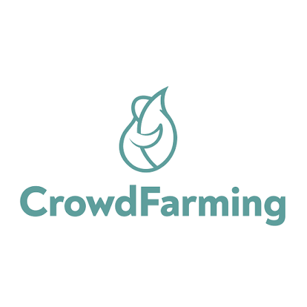 (España) | Marketplace B2C donde el consumidor "adopta" un árbol, animal o parcela de un agricultor aliado, pagando por adelantado la producción que recibirá directamente en su domicilio al momento de la cosecha. | Sin intermediarios de distribución; comunicación directa con el agricultor vía fotos/historias; logística propia de envío en Europa; orientado a consumidor final, no a comerciantes. | [crowdfarming.com](https://www.crowdfarming.com) |
| Indirecto |   (EE. UU.) | Plataforma fintech que fracciona la propiedad de terrenos agrícolas para que inversionistas financien tierra de cultivo a cambio de una renta anual pagada por el operador agrícola arrendatario. | Due diligence documental de tierras; retorno de renta anual fija; sin seguimiento operativo del cultivo ni app móvil; el retorno no depende de la cosecha. | [acretrader.com](https://www.acretrader.com) |
| Indirecto |  **Traive** (Brasil / EE. UU.) | Plataforma agrofintech B2B2C que usa inteligencia artificial para generar scoring crediticio y conectar a prestamistas/distribuidores de insumos con agricultores, agilizando la aprobación de crédito agrícola. | Modelo B2B2C (cliente es el prestamista, no el agricultor ni el comerciante); evaluación de riesgo con datos alternativos; sin evidencia de campo ni app móvil. | [traivefinance.com](https://traivefinance.com) |
| Indirecto | 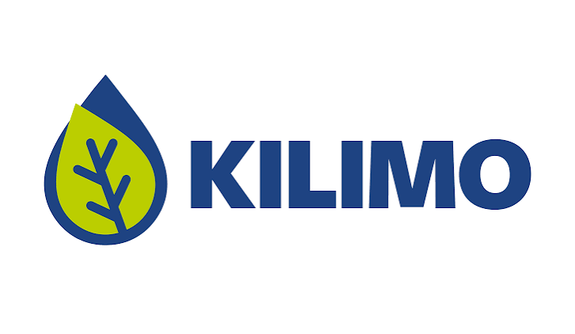 **Kilimo** (Argentina, con presencia en Perú) | Plataforma SaaS climática que usa IA, satélites y datos meteorológicos para optimizar el riego y monetizar el ahorro de agua como créditos ambientales vendidos a empresas. | Recomendaciones diarias de riego sin hardware; alianzas corporativas de sostenibilidad; no financia parcelas ni conecta al agricultor con un comprador. | [kilimo.com](https://www.kilimo.com) |

### 2.1.1. Análisis competitivo

**Análisis para competidores directos**
 
**Competitive Analysis Landscape**
 
**¿Por qué llevar a cabo este análisis?**
¿Cómo debe posicionarse Muyu frente a plataformas de alquiler de parcela y crowdfunding agrícola ya validadas (Farmizen, Cropital, CrowdFarming) para maximizar la confianza del comerciante comprador, y qué brechas de transparencia y trazabilidad debemos priorizar frente a ellas?
 
| | |   |   |   |   |
|---|---|---|---|---|---|
| **Perfil** | Overview | Marketplace Agro-as-a-Service que conecta agricultores con comerciantes/compradores mediante financiamiento de una parcela específica por ciclo de cultivo, con Escrow y evidencia georreferenciada. | App que permite alquilar una mini-parcela dentro de una granja real por una cuota mensual, con seguimiento del cultivo desde el celular. | Plataforma de crowdfunding que financia granjas específicas de pequeños agricultores filipinos a cambio de un porcentaje de la cosecha/ganancia. | Marketplace de "adopción" de árboles, animales o parcelas, con entrega directa de la cosecha al consumidor final. |
| | Ventaja competitiva / ¿Qué valor ofrece al cliente? | Escrow con liberación de fondos por hitos verificables (foto + GPS + fecha/hora) y alertas climáticas preventivas, únicos en este grupo de competidores. | Experiencia "gamificada" tipo Farmville; visitas físicas a la parcela alquilada. | Respaldo institucional internacional (EE. UU., Países Bajos, Malasia) y acceso a seguro agrícola para el productor financiado. | Comunidad de adopción consolidada y logística propia de distribución en Europa. |
| **Perfil de Marketing** | Mercado objetivo | Comerciantes, restaurantes y distribuidores que requieren abastecimiento estable de insumos agrícolas; agricultores con conectividad limitada. | Familias urbanas de clase media en India con interés en alimentos orgánicos "farm-to-table". | Inversionistas retail interesados en impacto social, desde montos bajos (~US$ 100). | Consumidores finales urbanos con interés en alimentación orgánica y sostenibilidad. |
| | Estrategias de marketing | Alianzas con cooperativas agrarias, acceso gratuito a alertas climáticas como gancho de entrada, y Landing Page de alta conversión enfocada en el ahorro de costos. | Marketing emocional ("cultiva tu propia comida"), referidos y comunidad de "Tribus" de granja. | Marketing de impacto social, cobertura de prensa (Forbes, BBC) y alianzas con incubadoras internacionales. | Storytelling del agricultor, marketing de sostenibilidad y economía circular. |
| **Perfil de Producto** | Productos & Servicios | Financiamiento/alquiler de parcela por ciclo, Escrow, evidencia georreferenciada, alertas climáticas push. | Alquiler de mini-parcela, entrega semanal de cosecha, visitas a la granja. | Financiamiento de granja específica, seguro agrícola, matching de mercado para la cosecha. | Cajas de producto por temporada, suscripción de "adopción". |
| | Precios & Costos | Pago por hitos (25% por etapa) retenido en Escrow hasta aprobación de evidencia. | Cuota mensual por mini-parcela alquilada. | Inversión desde ~US$ 100, retorno de 3%-30% en menos de 6 meses. | Pago único por adopción/temporada. |
| | Canales de distribución (Web y/o Móvil) | App móvil + Landing Page web. | App móvil (Android/iOS). | Plataforma web, sin app móvil dedicada. | Web + logística propia de envío. |
| | Tecnologías usadas | App nativa/multiplataforma offline-first, cámara y GPS nativos con georreferenciación automática, Escrow con motor de reglas por hitos, integración de OpenWeather vía n8n, notificaciones push (Firebase) y WhatsApp. | App móvil de seguimiento de parcela y pedidos; sin automatización de evidencia georreferenciada ni custodia de fondos por hitos. | Plataforma web de crowdfunding; verificación de campo mediante red de agentes y entrevistas presenciales, sin evidencia fotográfica automatizada. | Plataforma web + logística de última milla; actualizaciones del agricultor vía fotos e historias publicadas manualmente. |
| **Análisis SWOT** | Fortalezas | Escrow por hitos verificables (GPS + timestamp) y funcionamiento offline-first, exclusivos frente a este grupo. | App ya probada, con más de 10 000 descargas y comunidad activa de consumidores. | Modelo de crowdfunding validado con respaldo institucional internacional y seguro agrícola incluido. | Comunidad de adopción consolidada y logística propia de distribución en Europa. |
| | Debilidades | Marca nueva sin comunidad ni historial de transacciones que genere confianza inicial. | No ofrece custodia de fondos por hitos ni verificación georreferenciada automática; reseñas de usuarios señalan quejas de calidad del producto entregado. | Verificación de campo manual (visitas/entrevistas) sin evidencia fotográfica automatizada ni app móvil, lo que limita su velocidad de aprobación y escala geográfica. | No ofrece custodia de fondos por hitos ni verificación automatizada; modelo orientado al consumidor final, no al comerciante B2B. |
| | Oportunidades | Mercado local (Perú) sin un competidor directo consolidado; alianzas con cooperativas agrarias. | Incorporar verificación de evidencia tipo Escrow para recuperar confianza. | Digitalizar su proceso de verificación de campo con evidencia fotográfica automatizada. | Expansión a mercados latinoamericanos. |
| | Amenazas | Ingreso de un competidor internacional (como Cropital o CrowdFarming) al mercado local; resistencia tecnológica de agricultores de mayor edad. | Plataformas con mayor transparencia erosionando su ventaja de confianza. | Plataformas con verificación automatizada y app móvil nativa que ofrecen mayor trazabilidad al mismo costo operativo. | Plataformas locales con menor costo operativo y mejor conocimiento del mercado regional, como Muyu. |
 
**Análisis para competidores indirectos**
 
**Competitive Analysis Landscape**
 
**¿Por qué llevar a cabo este análisis?**

¿Qué alternativas de financiamiento agrícola indirectas? ¿Como la inversión fraccionada en tierra? ¿Podrían captar al mismo comerciante/inversionista objetivo de Muyu?, y ¿Cómo debemos diferenciarnos para no ser percibidos como un simple vehículo financiero pasivo?
 
| | |   |   |   |   |
|---|---|---|---|---|---|
| **Perfil** | Overview | Marketplace Agro-as-a-Service que conecta agricultores con comerciantes mediante financiamiento de una parcela específica por ciclo de cultivo. | Plataforma fintech que fracciona la propiedad de terrenos agrícolas para que inversionistas financien tierra a cambio de una renta anual. | Plataforma agrofintech B2B2C que usa IA para generar scoring crediticio y conectar prestamistas/distribuidores de insumos con agricultores. | Plataforma SaaS climática que usa IA, satélites y datos meteorológicos para optimizar el riego y monetizar el ahorro de agua como créditos ambientales. |
| | Ventaja competitiva / ¿Qué valor ofrece al cliente? | Trazabilidad operativa diaria del cultivo financiado, con evidencia verificable antes de liberar cada pago. | Solidez financiera y diversificación de portafolio para inversionistas institucionales. | Evaluación de riesgo crediticio en tiempo real con datos alternativos, acelerando la aprobación de crédito para insumos. | Recomendaciones diarias de riego sin instalar hardware, con ingreso adicional por ahorro de agua verificado. |
| **Perfil de Marketing** | Mercado objetivo | Comerciantes, restaurantes y distribuidores que requieren abastecimiento estable de insumos agrícolas. | Inversionistas individuales de alto patrimonio y family offices. | Prestamistas, distribuidores de insumos y cooperativas que otorgan crédito a agricultores. | Agricultores medianos/grandes y empresas con metas de sostenibilidad hídrica en Latinoamérica. |
| | Estrategias de marketing | Alianzas con cooperativas agrarias, acceso gratuito a alertas climáticas y Landing Page de alta conversión. | Marketing financiero educativo (webinars de inversión alternativa). | Alianzas con bancos y distribuidores de insumos; cobertura de prensa agtech especializada. | Alianzas corporativas (venta de créditos de agua) y Academia de Riego con webinars gratuitos. |
| **Perfil de Producto** | Productos & Servicios | Financiamiento de parcela por ciclo, Escrow, evidencia georreferenciada, alertas climáticas push. | Compra fraccionada de tierra, renta anual, reventa de participación. | Scoring crediticio con IA, gestión digital del ciclo de crédito, alertas de riesgo financiero. | Recomendaciones de riego basadas en IA/satélite, verificación y venta de créditos de agua. |
| | Precios & Costos | Pago por hitos (25% por etapa) retenido en Escrow. | Inversión mínima desde ~US$ 15 000 por participación. | Modelo B2B2C: cobra al prestamista/distribuidor, no directamente al agricultor. | Acceso gratuito o de bajo costo al agricultor; monetización principal por venta de créditos de agua a empresas. |
| | Canales de distribución (Web y/o Móvil) | App móvil + Landing Page web. | Web responsive, sin app móvil dedicada. | Plataforma web integrada a sistemas de prestamistas, sin app móvil para agricultores. | Plataforma web/SaaS, sin app móvil dedicada para el agricultor. |
| | Tecnologías usadas | App offline-first, GPS + cámara nativos, Escrow por reglas de hitos, alertas climáticas vía n8n/OpenWeather. | Plataforma web de inversión con due diligence documental de tierras; sin seguimiento operativo del cultivo. | Modelos de IA/machine learning para scoring de riesgo con datos alternativos; sin evidencia georreferenciada ni Escrow. | IA, big data, imágenes satelitales y datos meteorológicos; sin evidencia fotográfica georreferenciada ni Escrow. |
| **Análisis SWOT** | Fortalezas | Trazabilidad verificable y funcionamiento offline-first orientados a la operación diaria. | Respaldo financiero sólido y modelo probado de inversión fraccionada en tierra. | Modelo de riesgo crediticio validado con fondeo internacional (Serie A) y adopción por bancos/distribuidores. | Presencia validada en 7 países, +220 000 hectáreas monitoreadas y alianzas corporativas de sostenibilidad de alto perfil. |
| | Debilidades | Marca nueva sin comunidad ni historial de transacciones. | Enfocado en el inversionista de tierra; no resuelve la necesidad operativa diaria del agricultor ni el abastecimiento del comerciante. | No brinda visibilidad operativa del cultivo ni evidencia verificable; el agricultor no es su cliente directo. | No resuelve el financiamiento del ciclo de cultivo ni conecta al agricultor con un comprador; su alcance se limita al riego. |
| | Oportunidades | Mercado local sin competidor directo consolidado. | Integrar servicios de seguimiento de cultivo a su oferta actual. | Integrar evidencia de campo geolocalizada a su scoring de riesgo. | Integrar un módulo de financiamiento o marketplace de cosecha a su base ya instalada de agricultores. |
| | Amenazas | Ingreso de un competidor internacional al mercado local. | Modelos operativos como Muyu, orientados a la operación diaria y no solo al financiamiento de tierra, pueden captar al segmento de comerciantes que AcreTrader no atiende. | Plataformas como Muyu, que ofrecen visibilidad operativa y pago estructurado por hitos, podrían atraer comerciantes que buscan control directo sin depender de un prestamista intermediario. | Plataformas como Muyu podrían incorporar alertas de riego similares aprovechando su misma integración de datos climáticos, reduciendo la necesidad de un servicio separado. |

### 2.1.2. Estrategias y tácticas frente a competidores

| Competidor | Táctica diferenciadora | Fortaleza del rival que enfrentamos | Debilidad del rival que aprovechamos |
|---|---|---|---|
|   | Ofrecer evidencia georreferenciada automática (GPS + timestamp) y funcionamiento offline-first como estándar desde el primer lanzamiento, en vez de depender de fotos y reportes manuales dentro de la app. | App ya probada, con más de 10 000 descargas y comunidad activa de consumidores. | No custodia fondos por hitos ni verifica automáticamente el origen de las evidencias; usuarios han reportado quejas de calidad del producto entregado. |
|   | Digitalizar por completo el ciclo de verificación: reemplazar las visitas y entrevistas presenciales por evidencia fotográfica georreferenciada y aprobación remota desde el celular del comerciante. | Respaldo institucional internacional y acceso a seguro agrícola para los productores financiados. | Proceso de verificación de campo manual y sin app móvil, lo que limita la velocidad de aprobación de hitos y la escala geográfica. |
|   | Posicionar a Muyu como proveedor de insumo estable para negocios (restaurantes, distribuidores), en vez de competir por el consumidor final urbano orientado a sostenibilidad. | Comunidad de adopción consolidada y logística de distribución propia en Europa. | No ofrece custodia de fondos por hitos ni verificación automatizada; su logística de última milla no está adaptada a la operación de un comerciante comprador. |
|   | Diferenciarse de un vehículo de inversión pasiva incorporando herramientas de seguimiento diario del cultivo (evidencia, alertas climáticas) que ningún inversionista de tierra necesita, pero todo comerciante comprador sí. | Solidez financiera y modelo de inversión fraccionada ya validado en Estados Unidos. | No atiende la necesidad operativa de abastecimiento del comerciante ni brinda visibilidad del avance del cultivo; solo ofrece retorno financiero pasivo. |
|   | Ofrecer al comerciante control directo del pago y visibilidad del cultivo, sin depender de un tercero prestamista que evalúa el riesgo del agricultor a distancia y sin visibilidad de campo. | Modelo de riesgo crediticio con IA validado, con fondeo internacional (Serie A) y adopción por bancos y distribuidores de insumos. | No brinda visibilidad operativa del cultivo ni evidencia verificable del avance; el agricultor no es su cliente directo, sino el prestamista. |
|   | Posicionar las alertas climáticas de Muyu como parte de un servicio integral de financiamiento y trazabilidad, cubriendo la necesidad de pago y evidencia que Kilimo no atiende, en vez de competir solo en optimización de riego. | Presencia validada en 7 países y alianzas corporativas de sostenibilidad de alto perfil (Coca-Cola, Microsoft, Google). | No conecta al agricultor con un comprador ni resuelve el financiamiento del ciclo de cultivo; su alcance se limita a la gestión del riego. |

A partir del análisis competitivo desarrollado, se consolidan las Fortalezas, Oportunidades, Debilidades y Amenazas (FODA) propias de Muyu, y se cruzan para derivar cuatro grupos de estrategias (Corregir, Afrontar, Mantener, Explotar).

| | **Oportunidades (O)** | **Amenazas (A)** |
|---|---|---|
| Matriz F.O.D.A. y C.A.M.E.  | O1. Mercado peruano/LatAm sin un competidor directo consolidado que combine Escrow + evidencia georreferenciada. O2. Alianzas con cooperativas y asociaciones agrarias ya constituidas (AGRO RURAL, municipios). O3. Vacío dejado por competidores indirectos: Kilimo no financia, Traive no da visibilidad de campo. O4. Penetración creciente de smartphones en zonas rurales. | A1. Ingreso de un competidor internacional directo (Cropital, CrowdFarming o Farmizen) al mercado peruano. A2. Resistencia a la adopción tecnológica de agricultores de mayor edad. A3. Que un competidor indirecto (Kilimo o Traive) integre las funciones que hoy diferencian a Muyu. A4. Variabilidad de conectividad y dispositivos antiguos en zonas rurales. |
| **Fortalezas (F)** F1. Escrow con liberación de fondos por hitos verificables (foto + GPS + timestamp), único frente a los 6 competidores analizados. F2. Funcionamiento offline-first adaptado a la conectividad limitada del campo. F3. Resuelve simultáneamente financiamiento y trazabilidad operativa; ningún competidor lo hace a la vez. | **Estrategia Ofensiva (FO)** FO1. Usar el Escrow verificable (F1) como argumento central en alianzas con cooperativas (O2), ofreciendo garantía de pago transparente como gancho de adopción. FO2. Aprovechar el offline-first (F2) para posicionarse en zonas rurales de conectividad limitada (O4) antes que competidores internacionales dependientes de conexión constante. FO3. Capitalizar la propuesta única de financiamiento + trazabilidad (F3) para captar al comerciante que hoy usa soluciones parciales como Kilimo o Traive (O3). | **Estrategia Defensiva (FA)** FA1. Comunicar el Escrow verificable (F1) como sello de confianza ante la eventual llegada de un competidor internacional (A1), acelerando el efecto de red local antes de que aterricen. FA2. Diseñar la app para dispositivos de gama baja y modo offline robusto (F2), mitigando el riesgo de exclusión por conectividad o hardware antiguo (A4). FA3. Mantener el foco en un problema resuelto de punta a punta (F3) para que, si un competidor indirecto agrega una función aislada (A3), no logre igualar la propuesta integral de Muyu. |
| **Debilidades (D)** D1. Marca nueva sin comunidad de usuarios ni historial de transacciones. D2. Dependencia de un solo canal de captación inicial (alianzas con cooperativas) mientras se consolida un flujo propio de adquisición. D3. Sin integraciones con actores financieros externos (a diferencia de Traive) que amplíen el acceso a crédito de los agricultores. | **Estrategia de Reorientación (DO)** DO1. Usar las alianzas con cooperativas (O2) como fuente de validación social que compense la falta de historial de transacciones (D1). DO2. Explorar en una fase posterior una integración ligera con actores de crédito agrícola (O3) para cerrar la brecha de D3 sin construir un motor de scoring propio desde cero. DO3. Diversificar canales de adquisición más allá de cooperativas (mitigando D2), replicando el gancho de alertas climáticas gratuitas con promotores locales y municipios. | **Estrategia de Supervivencia (DA)** DA1. Priorizar el lanzamiento en un solo valle agrícola (foco de nicho) antes de expandirse, para no exponer la debilidad de marca nueva (D1) frente a un competidor internacional en múltiples frentes (A1). DA2. Mantener llamada telefónica como respaldo de las notificaciones push, para que la dependencia de un solo canal (D2) no se agrave si falla la conectividad (A4). DA3. Documentar y resguardar internamente el motor de reglas del Escrow para reducir el riesgo de réplica por un competidor indirecto (A3) mientras la marca aún no tiene defensa reputacional (D1). |

## 2.2. Entrevistas
### 2.2.1. Diseño de entrevistas
### 2.2.2. Registro de entrevistas
### 2.2.3. Análisis de entrevistas

## 2.3. Needfinding
### 2.3.1. User Personas
### 2.3.2. User Task Matrix
### 2.3.3. User Journey Mapping
### 2.3.4. Empathy Mapping
### 2.3.5. Big Picture EventStorming
### 2.3.6. Ubiquitous Language

## 2.4. Requirements specification
### 2.4.1. User Stories
<table width="100%">
  <thead>
    <tr align="center">
      <th width="20%">Story ID</th>
      <th width="30%">User</th>
      <th width="25%">Priority</th>
      <th width="25%">Epic</th>
    </tr>
  </thead>
  <tbody>
    <tr align="center">
      <td>US01</td>
      <td>Productor Agrícola</td>
      <td>Alta</td>
      <td>EP01</td>
    </tr>
    <tr>
      <th align="center">Title</th>
      <td colspan="3">Registro de perfil y verificación de identidad</td>
    </tr>
    <tr>
      <th colspan="4" align="center">Description</th>
    </tr>
    <tr>
      <td colspan="4">
        <b>Como</b> productor agrícola, 
        <b>quiero</b> registrar mi perfil y verificar mis datos de identidad, 
        <b>para</b> transmitir confianza a los compradores y ofrecer mis hectáreas de cultivo.
      </td>
    </tr>
    <tr>
      <th colspan="4" align="center">Acceptance Criteria</th>
    </tr>
    <tr>
      <td colspan="4">
        <b>Escenario 1: Registro exitoso con datos válidos</b> 
        - <b>Given</b> que el productor no cuenta con un registro previo en la plataforma. 
        - <b>When</b> proporciona nombres completos, documento de identidad y número telefónico válido. 
        - <b>Then</b> el sistema crea la cuenta en estado pendiente de verificación y genera un código de confirmación asociado al número telefónico.  
        <b>Escenario 2: Documento de identidad ya registrado</b> 
        - <b>Given</b> que existe un usuario registrado con el mismo número de documento. 
        - <b>When</b> el productor intenta registrar sus datos. 
        - <b>Then</b> el sistema rechaza el registro e informa que el documento de identidad ya está asociado a una cuenta existente.
      </td>
    </tr>
  </tbody>
  <tbody>
    <tr align="center">
      <td>TS01</td>
      <td>Developer</td>
      <td>Alta</td>
      <td>EP01</td>
    </tr>
    <tr>
      <th align="center">Title</th>
      <td colspan="3">API RESTful para autenticación y emisión de tokens JWT</td>
    </tr>
    <tr>
      <th colspan="4" align="center">Description</th>
    </tr>
    <tr>
      <td colspan="4">
        <b>Como</b> developer, 
        <b>quiero</b> implementar un servicio RESTful de autenticación, 
        <b>para</b> validar las credenciales de los usuarios y emitir tokens JWT seguros para los clientes de la plataforma.
      </td>
    </tr>
    <tr>
      <th colspan="4" align="center">Acceptance Criteria</th>
    </tr>
    <tr>
      <td colspan="4">
        <b>Escenario 1: Autenticación correcta</b> 
        - <b>Given</b> que el cliente envía un request POST /api/v1/auth/login con credenciales válidas. 
        - <b>When</b> el servicio valida las credenciales. 
        - <b>Then</b> responde con 200 OK y un cuerpo JSON que contiene el token JWT y su fecha de expiración.  
        <b>Escenario 2: Credenciales inválidas</b> 
        - <b>Given</b> que el cliente envía un request de autenticación con credenciales inválidas. 
        - <b>When</b> el servicio valida las credenciales. 
        - <b>Then</b> responde con 401 Unauthorized y un cuerpo JSON que identifica el error de autenticación.
      </td>
    </tr>
  </tbody>
    <tbody>
    <tr align="center">
      <td>US02</td>
      <td>Comprador</td>
      <td>Alta</td>
      <td>EP02</td>
    </tr>
    <tr>
      <th align="center">Title</th>
      <td colspan="3">Búsqueda y filtrado de parcelas disponibles</td>
    </tr>
    <tr>
      <th colspan="4" align="center">Description</th>
    </tr>
    <tr>
      <td colspan="4">
        <b>Como</b> comprador, 
        <b>quiero</b> filtrar parcelas agrícolas por tipo de cultivo, zona geográfica y extensión de hectáreas, 
        <b>para</b> seleccionar la opción que mejor se ajuste a mis necesidades de abastecimiento.
      </td>
    </tr>
    <tr>
      <th colspan="4" align="center">Acceptance Criteria</th>
    </tr>
    <tr>
      <td colspan="4">
        <b>Escenario 1: Filtrado con resultados</b> 
        - <b>Given</b> que existen parcelas activas que coinciden con los criterios de búsqueda. 
        - <b>When</b> el comprador consulta las parcelas utilizando región y tipo de cultivo. 
        - <b>Then</b> el sistema devuelve las parcelas activas que cumplen los criterios especificados.  
        <b>Escenario 2: Sin coincidencias</b> 
        - <b>Given</b> que no existen parcelas activas que coincidan con los criterios especificados. 
        - <b>When</b> el comprador ejecuta la consulta. 
        - <b>Then</b> el sistema devuelve un resultado vacío e informa que no existen coincidencias.
      </td>
    </tr>
  </tbody>
      <tbody>
    <tr align="center">
      <td>US03</td>
      <td>Comprador</td>
      <td>Alta</td>
      <td>EP03</td>
    </tr>
    <tr>
      <th align="center">Title</th>
      <td colspan="3">Aprobación de hito y orden de liberación de fondos</td>
    </tr>
    <tr>
      <th colspan="4" align="center">Description</th>
    </tr>
    <tr>
      <td colspan="4">
        <b>Como</b> comprador, 
        <b>quiero</b> revisar las evidencias de un hito cumplido y aprobar la liberación parcial de los fondos en custodia, 
        <b>para</b> que el productor disponga del capital correspondiente a la etapa completada.
      </td>
    </tr>
    <tr>
      <th colspan="4" align="center">Acceptance Criteria</th>
    </tr>
    <tr>
      <td colspan="4">
        <b>Escenario 1: Aprobación y liberación</b> 
        - <b>Given</b> que un hito se encuentra pendiente de validación y cuenta con las evidencias requeridas. 
        - <b>When</b> el comprador aprueba el cumplimiento del hito. 
        - <b>Then</b> el sistema cambia el estado del hito a aprobado y genera la orden de liberación de los fondos correspondientes.  
        <b>Escenario 2: Fondos insuficientes</b> 
        - <b>Given</b> que el saldo disponible en custodia es inferior al monto requerido para la liberación. 
        - <b>When</b> el comprador aprueba el hito. 
        - <b>Then</b> el sistema no ejecuta la liberación y registra que el saldo disponible es insuficiente.
      </td>
    </tr>
  </tbody>
      <tbody>
    <tr align="center">
      <td>TS02</td>
      <td>Developer</td>
      <td>Alta</td>
      <td>EP03</td>
    </tr>
    <tr>
      <th align="center">Title</th>
      <td colspan="3">API RESTful para consulta e integración del estado Escrow</td>
    </tr>
    <tr>
      <th colspan="4" align="center">Description</th>
    </tr>
    <tr>
      <td colspan="4">
        <b>Como</b> developer, 
        <b>quiero</b> implementar una API RESTful para consultar el saldo y estado de las cuentas Escrow asociadas a contratos, 
        <b>para</b> integrar la custodia de fondos con los servicios de pago y el historial de transacciones.
      </td>
    </tr>
    <tr>
      <th colspan="4" align="center">Acceptance Criteria</th>
    </tr>
    <tr>
      <td colspan="4">
        <b>Escenario 1: Consulta exitosa</b> 
        - <b>Given</b> que el cliente envía un request GET /api/v1/escrow/{contractId} con un contrato válido y credenciales autorizadas. 
        - <b>When</b> la API procesa la solicitud. 
        - <b>Then</b> responde con 200 OK y un JSON que contiene el saldo retenido, el saldo liberado y el detalle de los hitos.  
        <b>Escenario 2: Contrato inexistente</b> 
        - <b>Given</b> que el identificador de contrato no existe. 
        - <b>When</b> la API procesa la consulta. 
        - <b>Then</b> responde con 404 Not Found y un objeto JSON estructurado con el error correspondiente.
      </td>
    </tr>
  </tbody>
     <tbody>
    <tr align="center">
      <td>US04</td>
      <td>Productor Agrícola</td>
      <td>Alta</td>
      <td>EP04</td>
    </tr>
    <tr>
      <th align="center">Title</th>
      <td colspan="3">Registro y carga de evidencias fotográficas por hito</td>
    </tr>
    <tr>
      <th colspan="4" align="center">Description</th>
    </tr>
    <tr>
      <td colspan="4">
        <b>Como</b> productor agrícola, 
        <b>quiero</b> registrar evidencias fotográficas de mi cultivo con información de ubicación, 
        <b>para</b> demostrar el avance de cada hito y solicitar la liberación de fondos.
      </td>
    </tr>
    <tr>
      <th colspan="4" align="center">Acceptance Criteria</th>
    </tr>
    <tr>
      <td colspan="4">
        <b>Escenario 1: Registro exitoso de evidencia</b> 
        - <b>Given</b> que el productor se encuentra dentro de la ubicación autorizada de la parcela asociada al contrato. 
        - <b>When</b> registra una fotografía y la información correspondiente al hito. 
        - <b>Then</b> el sistema almacena la evidencia con las coordenadas GPS verificadas y cambia el estado del hito a "En Revisión".  
        <b>Escenario 2: Ubicación no válida</b> 
        - <b>Given</b> que las coordenadas registradas no coinciden con la ubicación autorizada de la parcela. 
        - <b>When</b> el productor intenta registrar la evidencia. 
        - <b>Then</b> el sistema rechaza la evidencia e informa la inconsistencia de geolocalización.
      </td>
    </tr>
  </tbody>
       <tbody>
    <tr align="center">
      <td>SP01</td>
      <td>Developer</td>
      <td>Media</td>
      <td>EP04</td>
    </tr>
    <tr>
      <th align="center">Title</th>
      <td colspan="3">Evaluación de almacenamiento y sincronización offline de fotografías</td>
    </tr>
    <tr>
      <th colspan="4" align="center">Description</th>
    </tr>
    <tr>
      <td colspan="4">
        <b>Como</b> developer, 
        <b>quiero</b> evaluar mecanismos de almacenamiento local y sincronización de fotografías sin conexión, 
        <b>para</b> garantizar el registro de evidencias en zonas con conectividad intermitente.
      </td>
    </tr>
    <tr>
      <th colspan="4" align="center">Acceptance Criteria</th>
    </tr>
    <tr>
      <td colspan="4">
        <b>Escenario 1: Almacenamiento sin conexión</b> 
        - <b>Given</b> que el dispositivo pierde temporalmente la conectividad. 
        - <b>When</b> se registran 20 fotografías localmente. 
        - <b>Then</b> las evidencias permanecen almacenadas hasta que se restablece la conexión.  
        <b>Escenario 2: Sincronización posterior</b> 
        - <b>Given</b> que existen evidencias pendientes de sincronización y se restablece la conectividad. 
        - <b>When</b> se ejecuta el proceso de sincronización. 
        - <b>Then</b> las evidencias se envían al servidor y se registra la tasa de sincronización exitosa.
      </td>
    </tr>
  </tbody>
         <tbody>
    <tr align="center">
      <td>US05</td>
      <td>Comprador</td>
      <td>Media</td>
      <td>EP05</td>
    </tr>
    <tr>
      <th align="center">Title</th>
      <td colspan="3">Recepción de alertas climáticas de riesgo</td>
    </tr>
    <tr>
      <th colspan="4" align="center">Description</th>
    </tr>
    <tr>
      <td colspan="4">
        <b>Como</b> comprador, 
        <b>quiero</b> recibir alertas ante eventos climáticos adversos en las parcelas contratadas, 
        <b>para</b> coordinar medidas preventivas con el productor.
      </td>
    </tr>
    <tr>
      <th colspan="4" align="center">Acceptance Criteria</th>
    </tr>
    <tr>
      <td colspan="4">
        <b>Escenario 1:Evento climático crítico</b> 
        - <b>Given</b> que una parcela contratada presenta una anomalía climática. 
        - <b>When</b> el evento supera el umbral de riesgo configurado. 
        - <b>Then</b> el sistema genera una alerta dirigida al comprador y al productor e incluye el nivel de riesgo identificado.  
        <b>Escenario 2: Evento de riesgo bajo no notificable</b> 
        - <b>Given</b> que el usuario tiene desactivadas las alertas de riesgo bajo. 
        - <b>When</b> se registra un evento climático clasificado como riesgo bajo. 
        - <b>Then</b> el sistema no genera una notificación para ese usuario.
      </td>
    </tr>
  </tbody>
   <tbody>
    <tr align="center">
      <td>US06</td>
      <td>Productor Agrícola</td>
      <td>Alta</td>
      <td>EP01</td>
    </tr>
    <tr>
      <th align="center">Title</th>
      <td colspan="3">Publicación y geolocalización de lote agrícola</td>
    </tr>
    <tr>
      <th colspan="4" align="center">Description</th>
    </tr>
    <tr>
      <td colspan="4">
        <b>Como</b> productor agrícola, 
        <b>quiero</b> registrar las dimensiones, características y ubicación de mi parcela, 
        <b>para</b> hacer visible mi oferta productiva a los compradores.
      </td>
    </tr>
    <tr>
      <th colspan="4" align="center">Acceptance Criteria</th>
    </tr>
    <tr>
      <td colspan="4">
        <b>Escenario 1:Publicación exitosa</b> 
        - <b>Given</b> que el productor tiene un perfil verificado. 
        - <b>When</b> registra las características de la parcela y una ubicación válida. 
        - <b>Then</b> el sistema valida la información y publica la parcela como oferta disponible.  
        <b>Escenario 2: Ubicación no válida</b> 
        - <b>Given</b> que la ubicación registrada no pertenece a una zona autorizada. 
        - <b>When</b> el productor intenta publicar la parcela. 
        - <b>Then</b> el sistema rechaza la publicación e informa que la ubicación no es válida.
      </td>
    </tr>
  </tbody>
    <tbody>
    <tr align="center">
      <td>US07</td>
      <td>Comprador</td>
      <td>Alta</td>
      <td>EP02</td>
    </tr>
    <tr>
      <th align="center">Title</th>
      <td colspan="3">Solicitud de cotización y negociación directa de volumen</td>
    </tr>
    <tr>
      <th colspan="4" align="center">Description</th>
    </tr>
    <tr>
      <td colspan="4">
        <b>Como</b> comprador, 
        <b>quiero</b> enviar una propuesta formal de compra indicando volumen, precio y fecha de entrega, 
        <b>para</b> iniciar una negociación directa con el productor agrícola.
      </td>
    </tr>
    <tr>
      <th colspan="4" align="center">Acceptance Criteria</th>
    </tr>
    <tr>
      <td colspan="4">
        <b>Escenario 1:Envío de propuesta válida</b> 
        - <b>Given</b> que existe una parcela activa con capacidad productiva disponible. 
        - <b>When</b> el comprador registra un volumen requerido, precio propuesto y fecha de entrega válidos. 
        - <b>Then</b> el sistema registra la propuesta y notifica al productor.  
        <b>Escenario 2: Volumen superior a la capacidad disponible</b> 
        - <b>Given</b> que el volumen solicitado supera la capacidad productiva disponible de la parcela, 
        - <b>When</b> el comprador intenta enviar la propuesta. 
        - <b>Then</b> el sistema rechaza la propuesta e informa que el volumen solicitado excede la capacidad disponible.
      </td>
    </tr>
  </tbody>
   <tbody>
    <tr align="center">
      <td>US08</td>
      <td>Productor Agrícola</td>
      <td>Alta</td>
      <td>EP03</td>
    </tr>
    <tr>
      <th align="center">Title</th>
      <td colspan="3">Aceptación de propuesta y firma de contrato digital Escrow</td>
    </tr>
    <tr>
      <th colspan="4" align="center">Description</th>
    </tr>
    <tr>
      <td colspan="4">
        <b>Como</b> productor agrícola, 
        <b>quiero</b> aceptar las condiciones acordadas y formalizar digitalmente el acuerdo de venta, 
        <b>para</b> establecer el compromiso comercial y activar el proceso de custodia de fondos.
      </td>
    </tr>
    <tr>
      <th colspan="4" align="center">Acceptance Criteria</th>
    </tr>
    <tr>
      <td colspan="4">
        <b>Escenario 1:Firma exitosa</b> 
        - <b>Given</b> que existe una propuesta con condiciones comerciales acordadas. 
        - <b>When</b> el productor confirma su aceptación mediante el mecanismo de verificación establecido, 
        - <b>Then</b> el sistema registra el contrato como pendiente de depósito Escrow y genera una copia del acuerdo para ambas partes.  
        <b>Escenario 2: Rechazo de condiciones</b> 
        - <b>Given</b> que el productor no está de acuerdo con las condiciones propuestas. 
        - <b>When</b> rechaza la propuesta y registra sus observaciones. 
        - <b>Then</b> el sistema devuelve la propuesta al comprador para su modificación.
      </td>
    </tr>
  </tbody>
    <tbody>
    <tr align="center">
      <td>US09</td>
      <td>Comprador B2B</td>
      <td>Alta</td>
      <td>EP03</td>
    </tr>
    <tr>
      <th align="center">Title</th>
      <td colspan="3">Depósito de fondos iniciales en custodia</td>
    </tr>
    <tr>
      <th colspan="4" align="center">Description</th>
    </tr>
    <tr>
      <td colspan="4">
        <b>Como</b> comprador, 
        <b>quiero</b> transferir el capital acordado a la cuenta de custodia, 
        <b>para</b> garantizar la disponibilidad de los fondos y habilitar el inicio del trabajo del productor.
      </td>
    </tr>
    <tr>
      <th colspan="4" align="center">Acceptance Criteria</th>
    </tr>
    <tr>
      <td colspan="4">
        <b>Escenario 1:Depósito confirmado</b> 
        - <b>Given</b> que existe un contrato pendiente de depósito. 
        - <b>When</b> el pago es validado por el sistema. 
        - <b>Then</b> los fondos pasan al estado "En Custodia" y el productor recibe la confirmación correspondiente.  
        <b>Escenario 2: Pago rechazado</b> 
        - <b>Given</b> que la entidad financiera rechaza la transacción. 
        - <b>When</b> el sistema recibe la confirmación del rechazo. 
        - <b>Then</b> los fondos no ingresan a custodia y el contrato permanece pendiente de depósito.
      </td>
    </tr>
  </tbody>
      <tbody>
    <tr align="center">
      <td>US010</td>
      <td>Productor Agrícola</td>
      <td>Media</td>
      <td>EP04</td>
    </tr>
    <tr>
      <th align="center">Title</th>
      <td colspan="3">Solicitud de prórroga por imprevisto técnico o ambiental</td>
    </tr>
    <tr>
      <th colspan="4" align="center">Description</th>
    </tr>
    <tr>
      <td colspan="4">
        <b>Como</b> productor agrícola, 
        <b>quiero</b> solicitar la reprogramación de la fecha límite de un hito cuando ocurre un imprevisto justificado, 
        <b>para</b> evitar penalizaciones cuando el retraso sea atribuible a causas válidas.
      </td>
    </tr>
    <tr>
      <th colspan="4" align="center">Acceptance Criteria</th>
    </tr>
    <tr>
      <td colspan="4">
        <b>Escenario 1:Solicitud de prórroga válida</b> 
        - <b>Given</b> que el productor identifica un retraso justificado en el cumplimiento de un hito. 
        - <b>When</b> registra una nueva fecha estimada y proporciona la justificación correspondiente. 
        - <b>Then</b> el sistema registra la solicitud y la envía al comprador para su revisión.  
        <b>Escenario 2:Solicitud fuera de plazo</b> 
        - <b>Given</b> que la fecha límite del hito ha vencido sin una solicitud previa. 
        - <b>When</b> el productor solicita una prórroga. 
        - <b>Then</b> el sistema rechaza la solicitud y registra que el plazo permitido ha expirado.
      </td>
    </tr>
  </tbody>
       <tbody>
    <tr align="center">
      <td>US011</td>
      <td>Comprador</td>
      <td>Media</td>
      <td>EP05</td>
    </tr>
    <tr>
      <th align="center">Title</th>
      <td colspan="3">Programación de visita presencial a la parcela</td>
    </tr>
    <tr>
      <th colspan="4" align="center">Description</th>
    </tr>
    <tr>
      <td colspan="4">
        <b>Como</b> comprador, 
        <b>quiero</b> programar una visita de inspección a la parcela en producción, 
        <b>para</b> verificar las condiciones de la cosecha antes del desembolso de la fase final.
      </td>
    </tr>
    <tr>
      <th colspan="4" align="center">Acceptance Criteria</th>
    </tr>
    <tr>
      <td colspan="4">
        <b>Escenario 1:Fecha disponible</b> 
        - <b>Given</b> que existe una fecha disponible para inspección y la parcela permite visitas. 
        - <b>When</b> el comprador solicita la visita para esa fecha. 
        - <b>Then</b> el sistema registra la visita y notifica al productor.  
        <b>Escenario 2: Fecha restringida</b> 
        - <b>Given</b> que la parcela se encuentra en un periodo en el que no se permiten visitas. 
        - <b>When</b> el comprador solicita una visita durante ese periodo. 
        - <b>Then</b> el sistema rechaza la solicitud y proporciona las fechas disponibles.
      </td>
    </tr>
  </tbody>
         <tbody>
    <tr align="center">
      <td>US012</td>
      <td>Productor Agrícola</td>
      <td>Alta</td>
      <td>EP01</td>
    </tr>
    <tr>
      <th align="center">Title</th>
      <td colspan="3">Gestión de disponibilidad y calendario de siembra</td>
    </tr>
    <tr>
      <th colspan="4" align="center">Description</th>
    </tr>
    <tr>
      <td colspan="4">
        <b>Como</b> productor agrícola. 
        <b>quiero</b> registrar las fechas estimadas de siembra y cosecha de mi parcela. 
        <b>para</b> informar a los compradores sobre los periodos de disponibilidad de mi producción.
      </td>
    </tr>
    <tr>
      <th colspan="4" align="center">Acceptance Criteria</th>
    </tr>
    <tr>
      <td colspan="4">
        <b>Escenario 1:Registro válido</b> 
        - <b>Given</b> que el productor tiene una parcela registrada. 
        - <b>When</b> registra una fecha de siembra y una fecha de cosecha posteriores a la fecha de siembra. 
        - <b>Then</b> el sistema almacena el periodo de disponibilidad asociado a la parcela.  
        <b>Escenario 2: Fechas inconsistentes</b> 
        - <b>Given</b> que la fecha de cosecha es anterior o igual a la fecha de siembra. 
        - <b>When</b> el productor registra las fechas. 
        - <b>Then</b> el sistema rechaza la solicitud y el sistema rechaza el registro e informa que el rango de fechas es inconsistentes.
      </td>
    </tr>
  </tbody>
    <tbody>
    <tr align="center">
      <td>US013</td>
      <td>Productor Agrícola</td>
      <td>Alta</td>
      <td>EP03</td>
    </tr>
    <tr>
      <th align="center">Title</th>
      <td colspan="3">Configuración de cuenta bancaria para recepción de desembolsos</td>
    </tr>
    <tr>
      <th colspan="4" align="center">Description</th>
    </tr>
    <tr>
      <td colspan="4">
        <b>Como</b> productor agrícola, 
        <b>quiero</b> vincular una cuenta bancaria a mi perfil, 
        <b>para</b> recibir los fondos liberados de la custodia Escrow.
      </td>
    </tr>
    <tr>
      <th colspan="4" align="center">Acceptance Criteria</th>
    </tr>
    <tr>
      <td colspan="4">
        <b>Escenario 1:Cuenta válida</b> 
        - <b>Given</b> que el productor no tiene una cuenta bancaria activa asociada. 
        - <b>When</b> proporciona datos bancarios válidos y la titularidad coincide con su identidad registrada. 
        - <b>Then</b> el sistema valida la información y asocia la cuenta al perfil.  
        <b>Escenario 2: Titularidad no coincidente</b> 
        - <b>Given</b> que la titularidad de la cuenta bancaria no coincide con la identidad del productor. 
        - <b>When</b> el sistema valida los datos. 
        - <b>Then</b> rechaza la asociación de la cuenta.
      </td>
    </tr>
  </tbody>
             <tbody>
    <tr align="center">
      <td>US014</td>
      <td>Comprador</td>
      <td>Alta</td>
      <td>EP04</td>
    </tr>
    <tr>
      <th align="center">Title</th>
      <td colspan="3">Revisión y observación técnica de evidencias de hito</td>
    </tr>
    <tr>
      <th colspan="4" align="center">Description</th>
    </tr>
    <tr>
      <td colspan="4">
        <b>Como</b> comprador, 
        <b>quiero</b> revisar las evidencias enviadas por el productor y solicitar correcciones cuando sean insuficientes, 
        <b>para</b> asegurar que el cultivo cumpla los estándares establecidos antes del desembolso.
      </td>
    </tr>
    <tr>
      <th colspan="4" align="center">Acceptance Criteria</th>
    </tr>
    <tr>
      <td colspan="4">
        <b>Escenario 1:Evidencia insuficiente</b> 
        - <b>Given</b> que las evidencias de un hito no cumplen los requisitos establecidos. 
        - <b>When</b> el comprador registra una observación y solicita una corrección. 
        - <b>Then</b> el sistema cambia el hito al estado "Requiere Corrección" y notifica al productor.  
        <b>Escenario 2: Hito previamente aprobado</b> 
        - <b>Given</b> que el hito ya fue aprobado y los fondos correspondientes fueron liberados. 
        - <b>When</b> el comprador intenta modificar el resultado de la validación. 
        - <b>Then</b> el sistema rechaza la modificación porque el resultado se encuentra cerrado.
      </td>
    </tr>
  </tbody>
    <tbody>
    <tr align="center">
      <td>US015</td>
      <td>Productor Agrícola</td>
      <td>Media</td>
      <td>EP05</td>
    </tr>
    <tr>
      <th align="center">Title</th>
      <td colspan="3">Calificación y reseña del comprador al finalizar contrato</td>
    </tr>
    <tr>
      <th colspan="4" align="center">Description</th>
    </tr>
    <tr>
      <td colspan="4">
        <b>Como</b> productor agrícola, 
        <b>quiero</b> calificar la puntualidad y comunicación del comprador después de completar un contrato, 
        <b>para</b> contribuir a una reputación transparente dentro de la plataforma.
      </td>
    </tr>
    <tr>
      <th colspan="4" align="center">Acceptance Criteria</th>
    </tr>
    <tr>
      <td colspan="4">
        <b>Escenario 1:Evaluación de contrato finalizado</b> 
        - <b>Given</b> que el contrato ha finalizado después del último desembolso. 
        - <b>When</b> l productor registra una puntuación y una reseña. 
        - <b>Then</b> el sistema registra la evaluación y la asocia al perfil del comprador.  
        <b>Escenario 2: Contrato en ejecución</b> 
        - <b>Given</b> que el contrato mantiene hitos pendientes. 
        - <b>When</b> el productor intenta registrar una evaluación. 
        - <b>Then</b> el sistema rechaza la evaluación hasta que el contrato finalice.
      </td>
    </tr>
  </tbody>
    <tbody>
    <tr align="center">
      <td>US016</td>
      <td>Comprador B2B</td>
      <td>Alta</td>
      <td>EP01</td>
    </tr>
    <tr>
      <th align="center">Title</th>
      <td colspan="3">Registro de perfil corporativo y validación fiscal</td>
    </tr>
    <tr>
      <th colspan="4" align="center">Description</th>
    </tr>
    <tr>
      <td colspan="4">
        <b>Como</b> comprador, 
        <b>quiero</b> registrar los datos de mi empresa y validar su identificación fiscal, 
        <b>para</b> acreditar la formalidad de mi negocio frente a los productores agrícolas.
      </td>
    </tr>
    <tr>
      <th colspan="4" align="center">Acceptance Criteria</th>
    </tr>
    <tr>
      <td colspan="4">
        <b>Escenario 1:Empresa válida</b> 
        - <b>Given</b> que el comprador proporciona un número de identificación fiscal válido. 
        - <b>When</b> el sistema consulta la fuente tributaria correspondiente. 
        - <b>Then</b> valida la existencia de la empresa y confirma que su estado permite operar.  
        <b>Escenario 2: Empresa no habilitada</b> 
        - <b>Given</b> que el número de identificación fiscal corresponde a una empresa suspendida o inactiva. 
        - <b>When</b> el sistema realiza la validación. 
        - <b>Then</b> rechaza el registro del perfil empresarial.
      </td>
    </tr>
  </tbody>
     <tbody>
    <tr align="center">
      <td>US017</td>
      <td>Comprador</td>
      <td>Media</td>
      <td>EP04</td>
    </tr>
    <tr>
      <th align="center">Title</th>
      <td colspan="3">Canal de mensajería para coordinación técnica</td>
    </tr>
    <tr>
      <th colspan="4" align="center">Description</th>
    </tr>
    <tr>
      <td colspan="4">
        <b>Como</b> comprador, 
        <b>quiero</b> intercambiar mensajes con el productor durante la ejecución de un contrato, 
        <b>para</b> resolver dudas técnicas y coordinar aspectos de la operación.
      </td>
    </tr>
    <tr>
      <th colspan="4" align="center">Acceptance Criteria</th>
    </tr>
    <tr>
      <td colspan="4">
        <b>Escenario 1:Mensaje durante contrato activo</b> 
        - <b>Given</b> que existe un contrato activo entre el comprador y el productor. 
        - <b>When</b> el comprador envía un mensaje, 
        - <b>Then</b> el sistema registra el mensaje y notifica al productor.  
        <b>Escenario 2: Ausencia de vínculo comercial</b> 
        - <b>Given</b> que no existe una negociación ni un contrato activo entre las partes. 
        - <b>When</b> el comprador intenta enviar un mensaje. 
        - <b>Then</b> el sistema rechaza el envío.
      </td>
    </tr>
  </tbody>
    <tbody>
    <tr align="center">
      <td>US018</td>
      <td>Comprador</td>
      <td>Media</td>
      <td>EP05</td>
    </tr>
    <tr>
      <th align="center">Title</th>
      <td colspan="3">Evaluación y reseña de calidad del productor agrícola</td>
    </tr>
    <tr>
      <th colspan="4" align="center">Description</th>
    </tr>
    <tr>
      <td colspan="4">
        <b>Como</b> comprador, 
        <b>quiero</b> evaluar el cumplimiento y la calidad del producto entregado por el productor, 
        <b>para</b> contribuir a su reputación y facilitar futuras decisiones de compra.
      </td>
    </tr>
    <tr>
      <th colspan="4" align="center">Acceptance Criteria</th>
    </tr>
    <tr>
      <td colspan="4">
        <b>Escenario 1:Evaluación de contrato finalizado</b> 
        - <b>Given</b> que un contrato ha finalizado con la liquidación total de los fondos. 
        - <b>When</b> el comprador registra una calificación y un comentario. 
        - <b>Then</b> el sistema registra la evaluación y actualiza la reputación del productor.  
        <b>Escenario 2: Evaluación duplicada</b> 
        - <b>Given</b> que el comprador ya registró una evaluación para un contrato. 
        - <b>When</b> intenta registrar una segunda evaluación para la misma operación. 
        - <b>Then</b> el sistema rechaza el nuevo registro y conserva la evaluación existente.
      </td>
    </tr>
  </tbody>
    <tbody>
    <tr align="center">
      <td>US019</td>
      <td>Productor Agrícola</td>
      <td>Baja</td>
      <td>EP05</td>
    </tr>
    <tr>
      <th align="center">Title</th>
      <td colspan="3">Reporte de incidencias y soporte técnico</td>
    </tr>
    <tr>
      <th colspan="4" align="center">Description</th>
    </tr>
    <tr>
      <td colspan="4">
        <b>Como</b> productor agrícola, 
        <b>quiero</b> reportar incidencias técnicas y solicitar soporte sobre el uso de la plataforma, 
        <b>para</b> recibir asistencia ante problemas relacionados con las operaciones realizadas.
      </td>
    </tr>
    <tr>
      <th colspan="4" align="center">Acceptance Criteria</th>
    </tr>
    <tr>
      <td colspan="4">
        <b>Escenario 1:Registro de incidencia</b> 
        - <b>Given</b> que el productor identifica una incidencia relacionada con la plataforma. 
        - <b>When</b> registra la descripción del problema y la evidencia disponible. 
        - <b>Then</b> el sistema crea un ticket de soporte y asigna un identificador de seguimiento.  
        <b>Escenario 2: Incidencia sin conectividad</b> 
        - <b>Given</b> que el productor registra una incidencia mientras no existe conectividad. 
        - <b>When</b> se recupera la conexión. 
        - <b>Then</b> el sistema envía automáticamente la incidencia pendiente al servicio de soporte.
      </td>
    </tr>
  </tbody>
    <tbody>
    <tr align="center">
      <td>US020</td>
      <td>Comprador</td>
      <td>Alta</td>
      <td>EP01</td>
    </tr>
    <tr>
      <th align="center">Title</th>
      <td colspan="3">Suscripción a alertas de disponibilidad de cosechas futuras</td>
    </tr>
    <tr>
      <th colspan="4" align="center">Description</th>
    </tr>
    <tr>
      <td colspan="4">
        <b>Como</b> comprador, 
        <b>quiero</b> suscribirme a alertas según cultivos, zonas y volúmenes de interés, 
        <b>para</b> recibir información sobre nuevas parcelas que coincidan con mis necesidades de abastecimiento.
      </td>
    </tr>
    <tr>
      <th colspan="4" align="center">Acceptance Criteria</th>
    </tr>
    <tr>
      <td colspan="4">
        <b>Escenario 1:Coincidencia con una nueva parcela</b> 
        - <b>Given</b> que el comprador tiene una suscripción activa con criterios definidos. 
        - <b>When</b> un productor publica una parcela que coincide con dichos criterios. 
        - <b>Then</b> el sistema genera una notificación para el comprador.  
        <b>Escenario 2: Actualización no relevante</b> 
        - <b>Given</b> que un productor modifica únicamente información descriptiva de una parcela existente. 
        - <b>When</b> se registra la modificación. 
        - <b>Then</b> el sistema no genera una alerta de nueva disponibilidad.
      </td>
    </tr>
  </tbody>
    <tbody>
    <tr align="center">
      <td>US021</td>
      <td>Productor Agrícola</td>
      <td>Alta</td>
      <td>EP02</td>
    </tr>
    <tr>
      <th align="center">Title</th>
      <td colspan="3">Envío de contraofertas durante la negociación</td>
    </tr>
    <tr>
      <th colspan="4" align="center">Description</th>
    </tr>
    <tr>
      <td colspan="4">
        <b>Como</b> productor agrícola, 
        <b>quiero</b> enviar una contrapropuesta modificando las condiciones económicas o de entrega, 
        <b>para</b> negociar los términos comerciales sin rechazar definitivamente la propuesta.
      </td>
    </tr>
    <tr>
      <th colspan="4" align="center">Acceptance Criteria</th>
    </tr>
    <tr>
      <td colspan="4">
        <b>Escenario 1:Contraoferta válida</b> 
        - <b>Given</b> que existe una propuesta de compra pendiente. 
        - <b>When</b> el productor modifica el precio, volumen o fecha de entrega dentro de los límites permitidos. 
        - <b>Then</b> el sistema registra la contraoferta y establece un plazo de respuesta de 48 horas.  
        <b>Escenario 2: Falta de respuesta</b> 
        - <b>Given</b> que el comprador no responde dentro del plazo establecido. 
        - <b>When</b> finaliza el periodo de 48 horas. 
        - <b>Then</b> el sistema cambia el estado de la negociación a "Vencido" y libera la capacidad comprometida.
      </td>
    </tr>
  </tbody>
    <tbody>
    <tr align="center">
      <td>US022</td>
      <td>Comprador</td>
      <td>Alta</td>
      <td>EP03</td>
    </tr>
    <tr>
      <th align="center">Title</th>
      <td colspan="3">Adendas y modificación de hitos de pago en custodia</td>
    </tr>
    <tr>
      <th colspan="4" align="center">Description</th>
    </tr>
    <tr>
      <td colspan="4">
        <b>Como</b> comprador, 
        <b>quiero</b> proponer modificaciones a los montos de los hitos de un contrato activo, 
        <b>para</b> adaptar el esquema de desembolsos ante variaciones justificadas del volumen de cosecha.
      </td>
    </tr>
    <tr>
      <th colspan="4" align="center">Acceptance Criteria</th>
    </tr>
    <tr>
      <td colspan="4">
        <b>Escenario 1:Aprobación de la adenda</b> 
        - <b>Given</b> que existe un contrato activo y una propuesta de modificación de los hitos. 
        - <b>When</b> el productor acepta la modificación mediante el mecanismo de confirmación establecido. 
        - <b>Then</b> el sistema actualiza los montos de los hitos y el cronograma de pagos.  
        <b>Escenario 2:  Rechazo de la adenda</b> 
        - <b>Given</b> que el productor rechaza la modificación propuesta. 
        - <b>When</b> finaliza el periodo de revisión. 
        - <b>Then</b> el sistema mantiene vigentes los términos y el cronograma originales.
      </td>
    </tr>
  </tbody>
    <tbody>
    <tr align="center">
      <td>US023</td>
      <td>Productor Agrícola</td>
      <td>Media</td>
      <td>EP04</td>
    </tr>
    <tr>
      <th align="center">Title</th>
      <td colspan="3">Registro de insumos agrícolas y trazabilidad técnica</td>
    </tr>
    <tr>
      <th colspan="4" align="center">Description</th>
    </tr>
    <tr>
      <td colspan="4">
        <b>Como</b> productor agrícola, 
        <b>quiero</b> registrar los insumos utilizados durante cada hito del cultivo, 
        <b>para</b> mantener la trazabilidad técnica y demostrar el cumplimiento de los requisitos fitosanitarios.
      </td>
    </tr>
    <tr>
      <th colspan="4" align="center">Acceptance Criteria</th>
    </tr>
    <tr>
      <td colspan="4">
        <b>Escenario 1:Registro de insumo autorizado</b> 
        - <b>Given</b> que el productor utiliza un insumo permitido. 
        - <b>When</b> registra el producto, fecha de aplicación y evidencia correspondiente. 
        - <b>Then</b> el sistema almacena el registro y lo asocia al hito correspondiente.  
        <b>Escenario 2:  Insumo no autorizado</b> 
        - <b>Given</b> que el insumo registrado no pertenece a la lista de productos autorizados. 
        - <b>When</b> el productor intenta registrar su aplicación. 
        - <b>Then</b> el sistema marca el registro como pendiente de validación y solicita la documentación técnica requerida.
      </td>
    </tr>
  </tbody>
</table>

### 2.4.2. Impact Mapping

### 2.4.3. Product Backlog

El Product Backlog de ALLPATEK reúne y prioriza todas las historias de usuario y tareas técnicas del proyecto. Siguiendo Scrum, los elementos se ordenan strictly por su valor de negocio para agricultores y comercializadores. Por ello, el Sprint 1 se enfoca en la Landing Page y en los módulos clave de búsqueda y negociación de parcelas, dejando la seguridad y autenticación para Sprints posteriores.

| Orden | User Story Id | Título | Story Points | Sprint |
| :---: | :--- | :--- | :---: | :---: |
| 1 | **US-LP01** | Landing Page estática e informativa de ALLPATEK | 5 | Sprint 1 |
| 2 | **US02** | Búsqueda y filtrado de parcelas disponibles | 5 | Sprint 1 |
| 3 | **US06** | Publicación y geolocalización de lote agrícola | 5 | Sprint 1 |
| 4 | **US07** | Solicitud de cotización y negociación de volumen | 3 | Sprint 1 |
| 5 | **US21** | Envío de contraofertas durante la negociación | 3 | Sprint 1 |
| 6 | **US08** | Aceptación y firma de contrato digital Escrow | 5 | Sprint 2 |
| 7 | **US09** | Depósito de fondos iniciales en custodia | 5 | Sprint 2 |
| 8 | **US04** | Registro y carga de evidencias fotográficas por hito | 5 | Sprint 2 |
| 9 | **US03** | Aprobación de hito y orden de liberación de fondos | 5 | Sprint 2 |
| 10 | **US14** | Revisión técnica de evidencias de hito | 3 | Sprint 2 |
| 12 | **US01** | Registro de perfil y verificación de identidad | 3 | Sprint 3 |
| 13 | **US16** | Registro de perfil corporativo y validación fiscal | 3 | Sprint 3 |
| 14 | **TS01** | API RESTful para autenticación y tokens JWT | 5 | Sprint 3 |
| 15 | **US13** | Configuración de cuenta bancaria para desembolsos | 3 | Sprint 3 |
| 16 | **TS02** | API RESTful para integración del estado Escrow | 5 | Sprint 3 |
| 18 | **US05** | Recepción de alertas climáticas de riesgo | 3 | Sprint 4 |
| 19 | **US10** | Solicitud de prórroga por imprevisto técnico/ambiental | 3 | Sprint 4 |
| 20 | **US17** | Canal de mensajería para coordinación técnica | 3 | Sprint 4 |
| 21 | **US23** | Registro de insumos agrícolas y trazabilidad | 3 | Sprint 4 |
| 22 | **SP01** | Evaluación de sincronización offline de fotografías | 5 | Sprint 4 |
| 23 | **US11** | Programación de visita presencial a la parcela | 2 | Sprint 4 |
| 24 | **US20** | Suscripción a alertas de cosechas futuras | 2 | Sprint 4 |
| 25 | **US15** | Calificación al comprador al finalizar contrato | 2 | Sprint 4 |
| 26 | **US18** | Evaluación de calidad del productor agrícola | 2 | Sprint 4 |
| 27 | **US19** | Reporte de incidencias y soporte técnico | 2 | Sprint 4 |

## 2.5. Strategic-Level Domain-Driven Design
### 2.5.1. EventStorming

En esta sección se documenta el EventStorming realizado por el equipo de TerraNova para modelar el dominio de la plataforma ALLPATEK. Esta dinámica permitió mapear los eventos clave del dominio, los comandos accionados por los actores (Productor Agrícola y Comerciante, los puntos de dolor operacionales y las integraciones con sistemas externos como la Bóveda Escrow, el motor n8n y la API de OpenWeather.

A continuación se presenta la evidencia gráfica dividida en la vista general del tablero y las secciones detalladas del flujo de negocio:

* **Vista General del Tablero:** Muestra la vista panorámica completa de la línea de tiempo del dominio, abarcando desde la fase de alta de parcelas hasta la conclusión de los contratos agrícolas.

  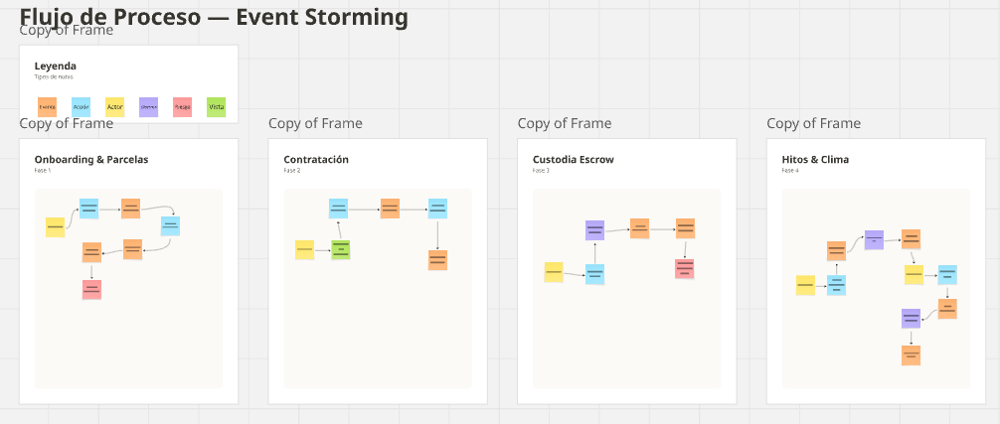

* **Fase de Onboarding, Registro y Negociación:** Detalla el flujo inicial de captura de coordenadas GPS, publicación de hectáreas en el catálogo y la generación y firma del contrato digital respaldado en PDF.

  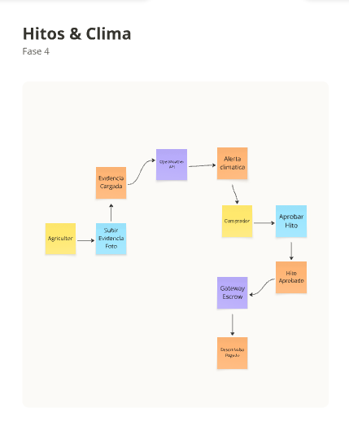

* **Fase de Custodia Escrow, Monitoreo Climático y Liberación de Pagos:** Modela la secuencia financiera de bloqueo de fondos en la bóveda, el envío de alertas meteorológicas y la validación de evidencias fotográficas para los desembolsos parciales por hitos cumplidos.

  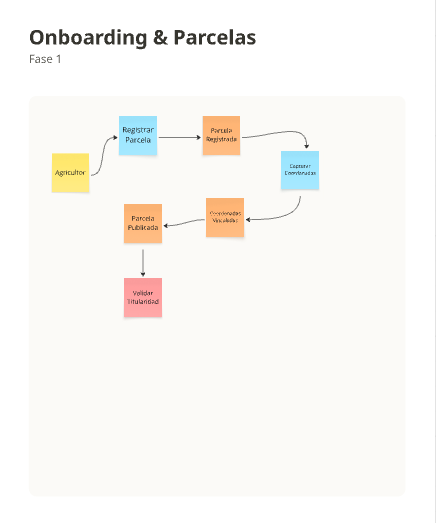

#### 2.5.1.1. Candidate Context Discovery
#### 2.5.1.2. Domain Message Flows Modeling
#### 2.5.1.3. Bounded Context Canvases

En primer lugar, el canvas del Contract & Escrow Service (Core Domain) detalla las reglas de negocio, los eventos de entrada y salida, y la terminología del lenguaje ubicuo necesarios para asegurar la custodia financiera y la liberación de pagos por hitos.

  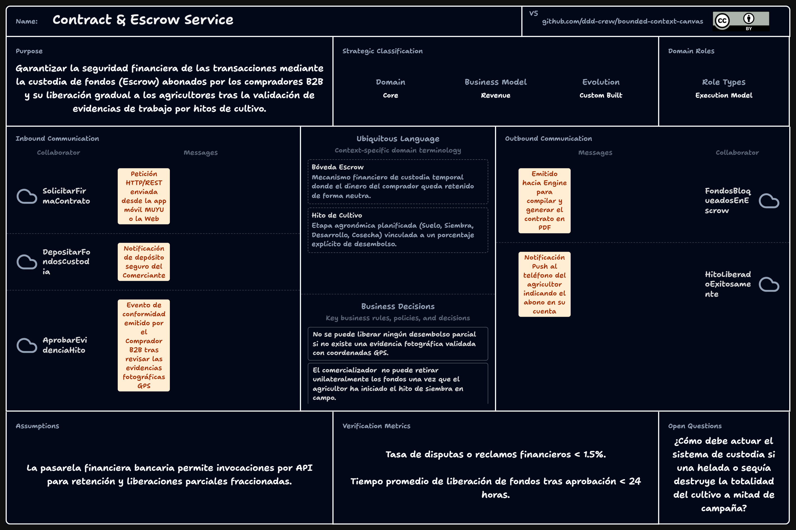

  En segundo lugar, el canvas del Parcel Management Service (Supporting Domain) especifica la gestión del catálogo de terrenos, las capacidades de delimitación por coordenadas GPS y los criterios de disponibilidad de las hectáreas agrícolas.

  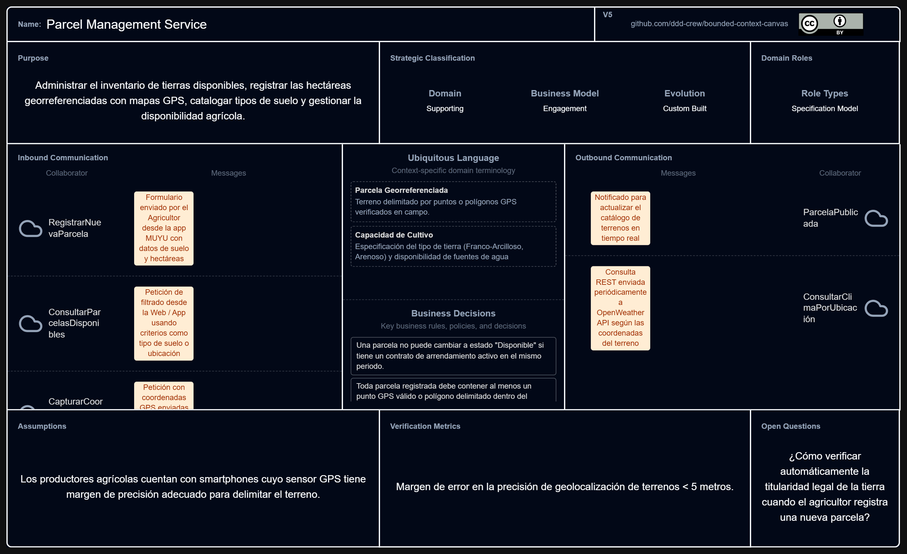  

### 2.5.2. Context Mapping
### 2.5.3. Software Architecture

Para entender cómo se relaciona la aplicación móvil MUYU con su entorno, el diagrama de contexto (Nivel 1 C4) ubica la app en el centro del flujo operacional. A su alrededor se muestran los usuarios principales el Productor Agrícola en campo y el Comercializador junto con los servicios externos que respaldan la operación: el pronóstico del clima en tiempo real, la automatización de notificaciones y la pasarela de custodia financiera.

#### 2.5.3.1. Software Architecture Context Level Diagrams

Este diagrama de contexto ilustra cómo la aplicación móvil MUYU interactúa de forma general con los usuarios en campo y los servicios externos del sistema.

  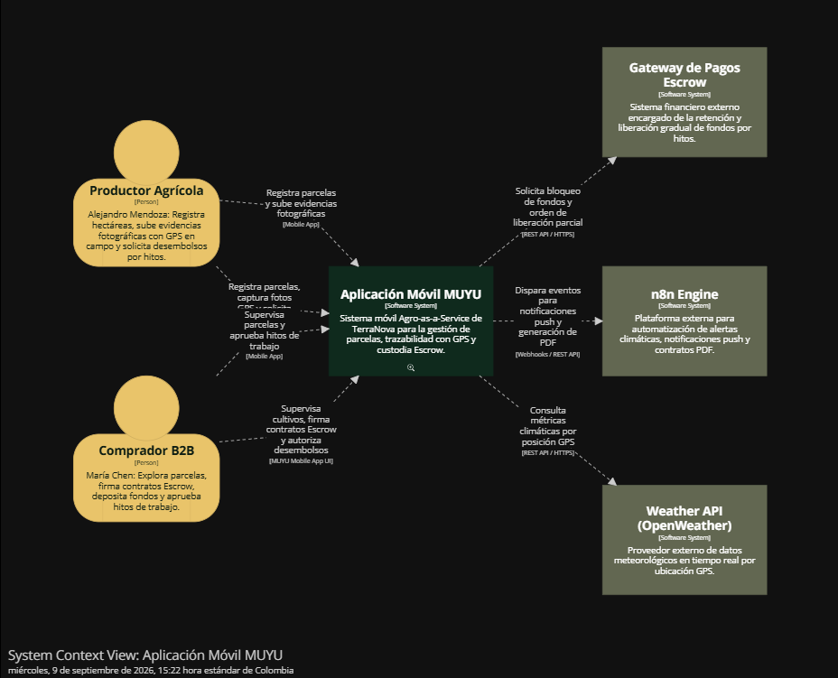  

#### 2.5.3.2. Software Architecture Container Level Diagrams

Este diagrama de contenedores muestra los bloques tecnológicos internos de MUYU, destacando la aplicación cliente, su base de datos local para modo offline y los microservicios backend.

 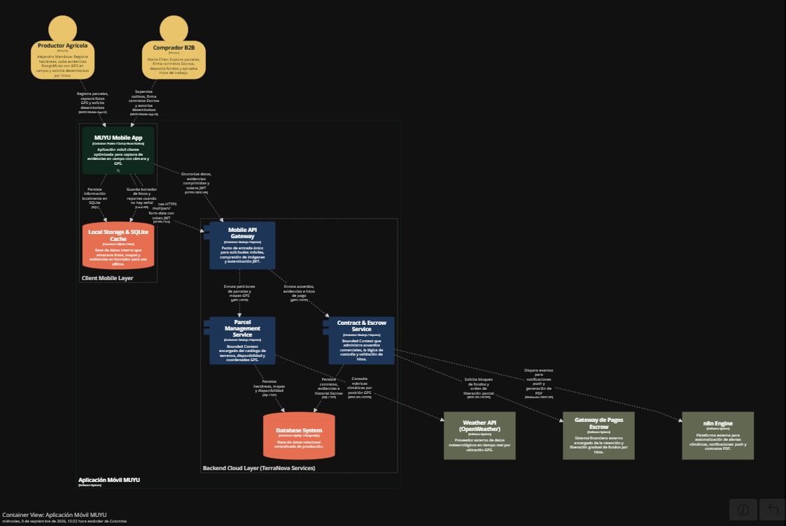  

#### 2.5.3.3. Software Architecture Deployment Diagrams

Este diagrama de despliegue representa la infraestructura física y en la nube donde se ejecuta la aplicación móvil y se conectan sus servidores.

 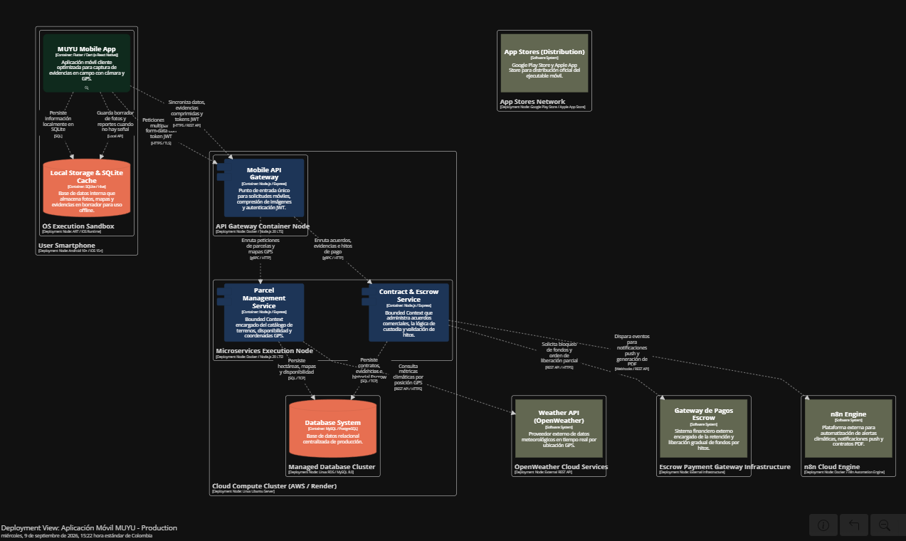  

## 2.6. Tactical-Level Domain-Driven Design
### 2.6.1. Bounded Context: Contract & Escrow Service

El Bounded Context Contract & Escrow Service representa la capacidad del sistema encargada de gestionar los
acuerdos de producción agrícola y garantizar la seguridad financiera mediante la custodia de fondos (Escrow).
Su propósito es crear contratos digitales, procesar pagos retenidos y liberar los fondos progresivamente 
conforme el comerciante apruebe los hitos y evidencias de campo del agricultor. La entidad principal 
es `Contract`, la cual concentra las reglas de negocio del acuerdo y el estado de la custodia. Este 
contexto actúa como proveedor (Upstream) para las notificaciones y se integra fuertemente con la pasarela de pagos externa.

#### 2.6.1.1. Domain Layer

La capa de dominio contiene el núcleo de las reglas comerciales y la lógica de custodia de fondos.

*   **Aggregate Root:** `Contract` (Atributos: id, farmerId, merchantId, totalAmount, status, createdAt).
*   **Entities:** `Milestone` (Hito de cultivo), `Evidence` (Fotografía georreferenciada).
*   **Value Objects:** `Money` (Monto y moneda), `GPSCoordinates` (Latitud y longitud), `ContractStatus` (Enum: PENDING_DEPOSIT, IN_PROGRESS, COMPLETED, DISPUTED), `MilestoneStatus` (Enum: PENDING, IN_REVIEW, APPROVED, REJECTED).
*   **Commands:** `CreateContractCommand`, `FundEscrowCommand`, `SubmitEvidenceCommand`, `ApproveMilestoneCommand`.
*   **Queries:** `GetContractByIdQuery`, `GetPendingMilestonesQuery`.
*   **Domain Events:** `ContractSignedEvent`, `EscrowFundedEvent`, `EvidenceSubmittedEvent`, `MilestoneApprovedEvent`.
*   **Reglas de negocio:** No se puede liberar un desembolso parcial si no existe una evidencia fotográfica validada con coordenadas GPS. El comerciante no puede retirar unilateralmente los fondos una vez que el agricultor ha iniciado el hito de siembra.

#### 2.6.1.2. Interface Layer

Contiene los controladores que exponen los servicios de gestión de contratos y pagos al frontend móvil de Muyu.

*   **REST Controllers:** `ContractsController`, `EscrowController`, `EvidencesController`.
*   **Endpoints:** `POST /api/v1/contracts`, `POST /api/v1/contracts/{id}/escrow/fund`, `POST /api/v1/milestones/{id}/evidences`, `PUT /api/v1/milestones/{id}/approve`.
*   **DTOs:** `CreateContractResource`, `SubmitEvidenceResource`, `ContractSummaryResource`.
*   **Assemblers:** Transforman los recursos HTTP en comandos del dominio (ej. `CreateContractCommandFromResourceAssembler`).

#### 2.6.1.3. Application Layer

Coordina los flujos de creación de acuerdos, carga de evidencias y liberación de fondos.

*   **Command Services:** `ContractCommandServiceImpl` (Valida la disponibilidad de la parcela, estructura los hitos y guarda el contrato), `EscrowCommandServiceImpl` (Interactúa con la pasarela para bloquear o liberar fondos), `EvidenceCommandServiceImpl`.
*   **Query Services:** `ContractQueryServiceImpl`.
*   **Flujo principal:** El agricultor sube una evidencia; el `EvidenceCommandService` valida las coordenadas GPS contra las de la parcela. Si es correcto, guarda la evidencia, cambia el estado del hito a "IN_REVIEW" y dispara un evento para notificar al comerciante.

#### 2.6.1.4. Infrastructure Layer

Gestiona la persistencia, el almacenamiento de archivos y la integración con pasarelas financieras.

*   **Repositories:** `ContractRepository` (extiende JpaRepository u ORM similar), `MilestoneRepository`.
*   **Adapters:** `EscrowPaymentGatewayAdapter` (comunicación REST con la pasarela de pagos), `CloudStorageAdapter` (AWS S3 / Firebase Cloud Storage para guardar las fotografías comprimidas).
*   **Persistencia:** Tablas `contracts`, `milestones` y `evidences` con llaves foráneas y restricciones de integridad.

#### 2.6.1.5. Bounded Context Software Architecture Component Level Diagrams

Este diagrama detalla la arquitectura interna a nivel de componentes para el contexto **Contract & Escrow**, aplicando el patrón CQRS (separación de operaciones de lectura y escritura)
y la inyección de dependencias a través de las capas de Interfaz, Aplicación, Dominio e Infraestructura.

  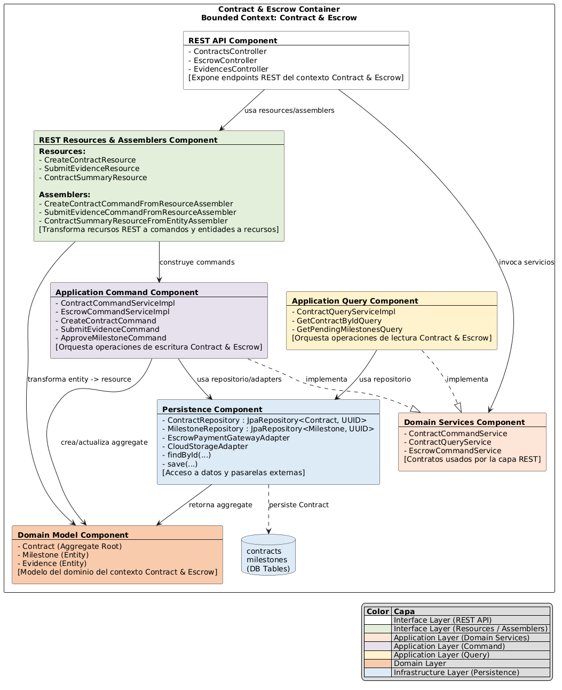

#### 2.6.1.6. Bounded Context Software Architecture Code Level Diagrams
##### 2.6.1.6.1. Bounded Context Domain Layer Class Diagrams

Este diagrama muestra el modelo de clases de la capa de dominio, destacando el Aggregate Root principal (`Contract`) y cómo interactúa con los servicios de comando y consulta (CQRS).

  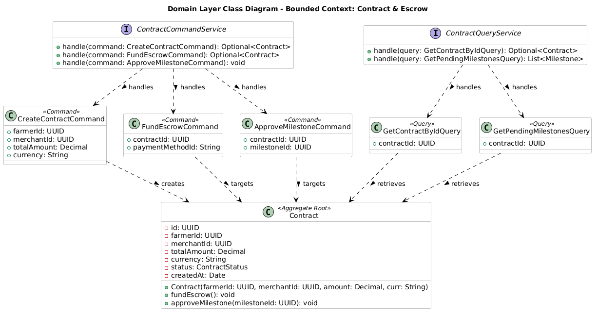

##### 2.6.1.6.2. Bounded Context Database Design Diagram

Este diagrama relacional conectando `contracts`, `milestones` y `evidences`, donde cada hito pertenece a un contrato y cada evidencia está vinculada a un hito específico, garantizando la trazabilidad de la custodia.

  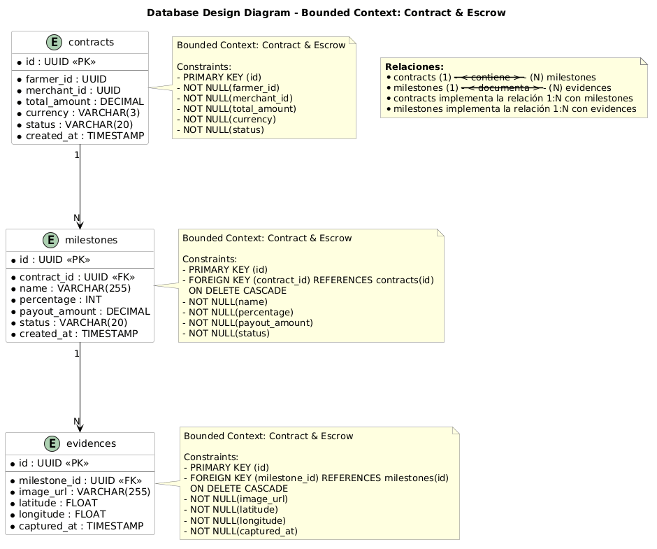

### 2.6.2. Bounded Context: Parcel Management Service

El Bounded Context Parcel Management Service (Supporting Domain) representa la capacidad del sistema encargada de administrar
el inventario de tierras. Su propósito es registrar las hectáreas georreferenciadas con mapas GPS, catalogar tipos de suelo y
gestionar la disponibilidad agrícola para que los comerciantes puedan descubrir ofertas productivas. La entidad principal es `Parcel`.

#### 2.6.2.1. Domain Layer

La capa de dominio contiene las reglas espaciales y de disponibilidad de los terrenos agrícolas.

*   **Aggregate Root:** `Parcel` (Atributos: id, farmerId, name, area, soilType, status).
*   **Entities:** `GPSBoundary` (Polígono georreferenciado).
*   **Value Objects:** `Hectare` (Valor numérico), `GPSCoordinate` (Latitud, longitud, orden), `ParcelStatus` (Enum: AVAILABLE, IN_USE, UNAVAILABLE), `SoilType` (Enum: CLAY, SANDY, LOAMY, SILTY).
*   **Commands:** `RegisterParcelCommand`, `UpdateParcelAvailabilityCommand`, `AssignCoordinatesCommand`.
*   **Queries:** `GetAvailableParcelsQuery`, `GetParcelByIdQuery`.
*   **Domain Events:** `ParcelRegisteredEvent`, `ParcelAvailabilityUpdatedEvent`.
*   **Reglas de negocio:** Una parcela no puede cambiar a estado "Disponible" si tiene un contrato activo en el mismo periodo. Toda parcela debe contener al menos tres puntos GPS válidos para formar un polígono delimitado.

#### 2.6.2.2. Interface Layer

Contiene los controladores que exponen el catálogo de parcelas a la aplicación móvil.

*   **REST Controllers:** `ParcelsController`.
*   **Endpoints:** `POST /api/v1/parcels`, `GET /api/v1/parcels/available`, `PATCH /api/v1/parcels/{id}/status`.
*   **DTOs:** `RegisterParcelResource`, `ParcelSummaryResource`.
*   **Assemblers:** Transforman recursos HTTP en comandos (ej. `RegisterParcelCommandFromResourceAssembler`).

#### 2.6.2.3. Application Layer

Coordina los flujos de alta de terrenos y consultas de catálogo.

*   **Command Services:** `ParcelCommandServiceImpl` (Valida polígonos GPS, asigna estado inicial y guarda la parcela).
*   **Query Services:** `ParcelQueryServiceImpl` (Aplica filtros por área y tipo de suelo).
*   **Flujo principal:** El agricultor envía los datos y coordenadas; el servicio verifica la geometría básica y persiste la parcela, emitiendo un evento para actualizar el catálogo.

#### 2.6.2.4. Infrastructure Layer

*   **Repositories:** `ParcelRepository` (extiende JpaRepository).
*   **Adapters:** `OpenWeatherAdapter` (Consulta el clima basándose en las coordenadas registradas).
*   **Persistencia:** Tablas `parcels` y `parcel_coordinates`.

#### 2.6.2.5. Bounded Context Software Architecture Component Level Diagrams

Este diagrama ilustra la arquitectura interna para gestionar el inventario de parcelas y sus coordenadas.

  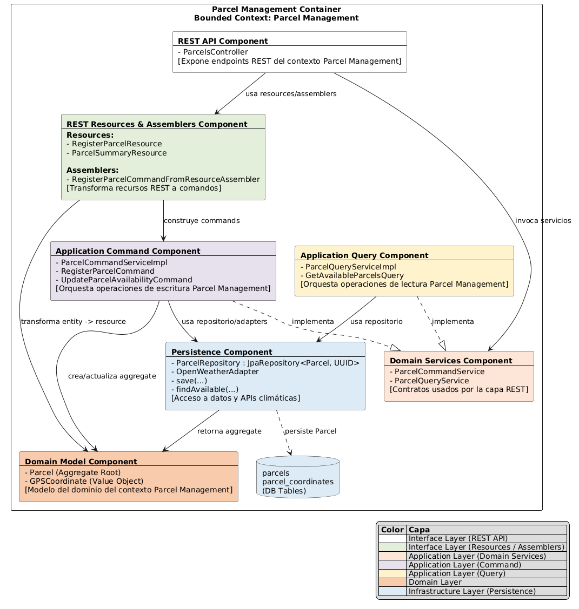

#### 2.6.2.6. Bounded Context Software Architecture Code Level Diagrams
##### 2.6.2.6.1. Bounded Context Domain Layer Class Diagrams

Este diagrama muestra el modelo de clases de la capa de dominio para el contexto de **Parcel Management**, detallando
la entidad principal (`Parcel`), sus Value Objects asociados (como `GPSCoordinate` y `Hectare`) y la interacción con los servicios de comando y consulta.

  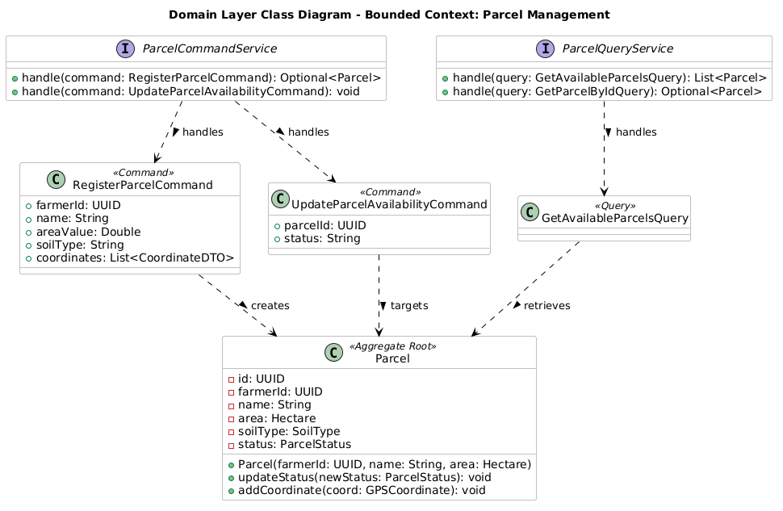

##### 2.6.2.6.2. Bounded Context Database Design Diagram

Este diagrama representa el esquema físico de la base de datos relacional para el contexto de **Parcel Management**, detallando las tablas principales
para el registro de parcelas y sus límites geográficos (coordenadas GPS).

  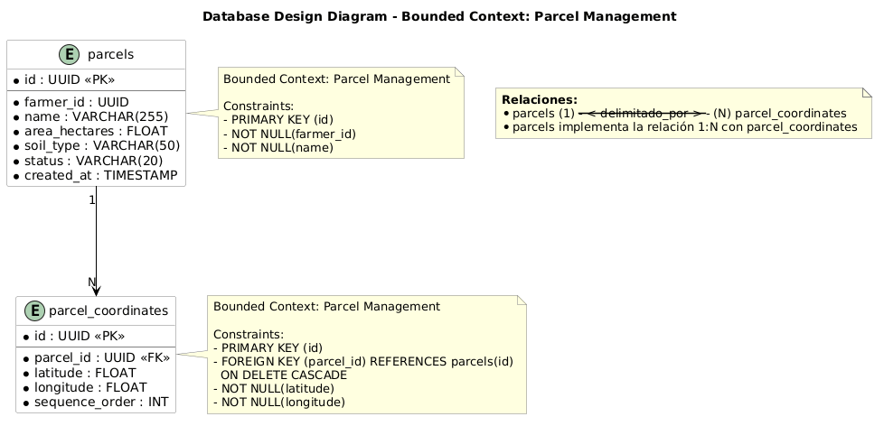

### 2.6.3. Bounded Context: <Bounded Context Name>

El Bounded Context **MUYU Mobile Offline Sync** (Generic / Utility Domain) reside principalmente en la aplicación cliente móvil (Flutter). 
Su propósito es garantizar la captura ininterrumpida de evidencias y reportes georreferenciados en zonas rurales donde no hay conexión a internet.
Este contexto gestiona el almacenamiento local de los datos y los sincroniza automáticamente con el backend una vez que detecta que la red ha sido restaurada.

#### 2.6.x.1. Domain Layer
#### 2.6.x.2. Interface Layer
#### 2.6.x.3. Application Layer
#### 2.6.x.4. Infrastructure Layer
#### 2.6.x.5. Bounded Context Software Architecture Component Level Diagrams
#### 2.6.x.6. Bounded Context Software Architecture Code Level Diagrams
##### 2.6.x.6.1. Bounded Context Domain Layer Class Diagrams
##### 2.6.x.6.2. Bounded Context Database Design Diagram

# Capítulo III: Solution UI/UX Design

## 3.1. Product design
### 3.1.1. Style Guidelines
#### 3.1.1.1. General Style Guidelines
### 3.1.2. Information Architecture
#### 3.1.2.1. Organization Systems
#### 3.1.2.2. Labelling Systems
#### 3.1.2.3. SEO Tags and Meta Tags
#### 3.1.2.4. Searching Systems
#### 3.1.2.5. Navigation Systems
### 3.1.3. Landing Page UI Design
#### 3.1.3.1. Landing Page Wireframe
#### 3.1.3.2. Landing Page Mock-up
### 3.1.4. Mobile Applications UX/UI Design
#### 3.1.4.1. Mobile Applications Wireframes
#### 3.1.4.2. Mobile Applications Wireflow Diagrams
#### 3.1.4.3. Mobile Applications Mock-ups
#### 3.1.4.4. Mobile Applications User Flow Diagrams
#### 3.1.4.5. Mobile Applications Prototyping

# Capítulo IV: Product Implementation & Validation

## 4.1. Software Configuration Management
### 4.1.1. Software Development Environment Configuration
### 4.1.2. Source Code Management
### 4.1.3. Source Code Style Guide & Conventions
### 4.1.4. Software Deployment Configuration

## 4.2. Landing Page & Mobile Application Implementation
### 4.2.1. Sprint 1
#### 4.2.1.1. Sprint Planning 1
#### 4.2.1.2. Aspect Leaders and Collaborators
#### 4.2.1.3. Sprint Backlog 1
#### 4.2.1.4. Development Evidence for Sprint Review
#### 4.2.1.5. Testing Suite Evidence for Sprint Review
#### 4.2.1.6. Execution Evidence for Sprint Review
#### 4.2.1.7. Services Documentation Evidence for Sprint Review
#### 4.2.1.8. Software Deployment Evidence for Sprint Review
#### 4.2.1.9. Team Collaboration Insights during Sprint
### 4.2.2. Sprint 2
#### 4.2.2.1. Sprint Planning 2
#### 4.2.2.2. Aspect Leaders and Collaborators
#### 4.2.2.3. Sprint Backlog 2
#### 4.2.2.4. Development Evidence for Sprint Review
#### 4.2.2.5. Testing Suite Evidence for Sprint Review
#### 4.2.2.6. Execution Evidence for Sprint Review
#### 4.2.2.7. Services Documentation Evidence for Sprint Review
#### 4.2.2.8. Software Deployment Evidence for Sprint Review
#### 4.2.2.9. Team Collaboration Insights during Sprint
### 4.2.3. Sprint 3
#### 4.2.3.1. Sprint Planning 3
#### 4.2.3.2. Aspect Leaders and Collaborators
#### 4.2.3.3. Sprint Backlog 3
#### 4.2.3.4. Development Evidence for Sprint Review
#### 4.2.3.5. Testing Suite Evidence for Sprint Review
#### 4.2.3.6. Execution Evidence for Sprint Review
#### 4.2.3.7. Services Documentation Evidence for Sprint Review
#### 4.2.3.8. Software Deployment Evidence for Sprint Review
#### 4.2.3.9. Team Collaboration Insights during Sprint

## 4.3. Validation Interviews
### 4.3.1. Diseño de Entrevistas
### 4.3.2. Registro de Entrevistas
### 4.3.3. Evaluaciones según heurísticas

# Conclusiones y Recomendaciones

# Video App Validation

# Video About the product

# Video About the team

# Glosario

# Bibliografía

# Anexos

