

     

<h3 align="center"> Universidad Peruana de Ciencias Aplicadas </h3>

<h3 align="center">Carrera de [Nombre de la Carrera] </h3>

<h3 align="center">[Código del Curso] </h3>
<h3 align="center">[Nombre del Curso] </h3>
<h3 align="center"> NRC </h3>
<h3 align="center"> [Número de NRC] </h3>

<h3 align="center"> [Título del Informe / Trabajo]</h3>

<h3 align="center"> Docente</h3>
<h3 align="center"> [Nombre del Docente] </h3>

<h3 align="center"> Equipo </h3>
<h3 align="center"> [Nombre del Equipo] </h3>

<h3 align="center"> Proyecto</h3>
<h3 align="center"> [Nombre del Proyecto] </h3>

<h3 align="center"> Integrantes </h3>

| Code | Member |
| :---: | :--- |
| [Código 1] | [Nombre del Integrante 1] |
| [Código 2] | [Nombre del Integrante 2] |
| [Código 3] | [Nombre del Integrante 3] |
| [Código 4] | [Nombre del Integrante 4] |
| [Código 5] | [Nombre del Integrante 5] |

<h3 align="center">Periodo [Año-Ciclo]</h3>
<h3 align="center">[Mes Año]</h3>

## Registro de Versiones del Informe

| Versión |   Fecha    |                Autor                |                                                  Descripción de modificación                                                   |
|:-------:|:----------:|:-----------------------------------:|:------------------------------------------------------------------------------------------------------------------------------:|
| [Versión] | [DD-MM-AAAA] | [Apellidos, Nombres] | [Descripción del cambio o aporte] |

## Project Report Collaboration Insights

| Integrante | Tareas Asignadas |
|---|---|
| [Nombre Completo 1] | [Lista de tareas realizadas] |
| [Nombre Completo 2] | [Lista de tareas realizadas] |
| [Nombre Completo 3] | [Lista de tareas realizadas] |
| [Nombre Completo 4] | [Lista de tareas realizadas] |
| [Nombre Completo 5] | [Lista de tareas realizadas] |

El proceso de colaboración en el informe se realizó mediante commits constantes al repositorio de la organización.

# Student Outcome

  <table style="width:100%; border-collapse: collapse; font-family: Arial, sans-serif; font-size: 14px;">
    <thead>
      <tr style="background-color: #f2f2f2; text-align: center;">
        <th style="border: 1px solid #dddddd; padding: 12px; width: 25%;">Criterio específico</th>
        <th style="border: 1px solid #dddddd; padding: 12px; width: 45%;">Acciones realizadas</th>
        <th style="border: 1px solid #dddddd; padding: 12px; width: 30%;">Conclusiones</th>
      </tr>
    </thead>
    <tbody>
      <tr>
        <td style="border: 1px solid #dddddd; padding: 10px; font-weight: bold; vertical-align: top;">
          Trabaja en equipo para proporcionar liderazgo en forma conjunta.
        </td>
        <td style="border: 1px solid #dddddd; padding: 10px; vertical-align: top;">
          <ul>
            <li><b>[Entrega] - [Nombre del Integrante]:</b> [Descripción de la acción realizada]</li>
          </ul>
        </td>
        <td style="border: 1px solid #dddddd; padding: 10px; vertical-align: top;">
          [Conclusión sobre el criterio]
        </td>
      </tr>
      <tr>
        <td style="border: 1px solid #dddddd; padding: 10px; font-weight: bold; vertical-align: top;">
          Crea un entorno colaborativo e inclusivo, establece metas, planifica tareas y cumple objetivos.
        </td>
        <td style="border: 1px solid #dddddd; padding: 10px; vertical-align: top;">
          <ul>
            <li><b>[Entrega] - [Nombre del Integrante]:</b> [Descripción de la acción realizada]</li>
          </ul>
        </td>
        <td style="border: 1px solid #dddddd; padding: 10px; vertical-align: top;">
          [Conclusión sobre el criterio]
        </td>
      </tr>
    </tbody>
  </table>

## Objetivos SMART

## Tabla de Contenidos

* [Capítulo I: Presentación](#capítulo-i-presentación)
  * [1.1. Startup Profile](#11-startup-profile)
    * [1.1.1. Descripción de la Startup](#111-descripción-de-la-startup)
    * [1.1.2. Perfiles de integrantes del equipo](#112-perfiles-de-integrantes-del-equipo)
  * [1.2. Solution Profile](#12-solution-profile)
    * [1.2.1. Antecedentes y problemática](#121-antecedentes-y-problemática)
    * [1.2.2. Lean UX Process](#122-lean-ux-process)
      * [1.2.2.1. Lean UX Problem Statements](#1221-lean-ux-problem-statements)
      * [1.2.2.2. Lean UX Assumptions](#1222-lean-ux-assumptions)
      * [1.2.2.3. Lean UX Hypothesis Statements](#1223-lean-ux-hypothesis-statements)
      * [1.2.2.4. Lean UX Canvas](#1224-lean-ux-canvas)
  * [1.3. Segmentos objetivo](#13-segmentos-objetivo)
* [Capítulo II: Requirements Development and Software Solution Design](#capítulo-ii-requirements-development-and-software-solution-design)
  * [2.1. Competidores](#21-competidores)
    * [2.1.1. Análisis competitivo](#211-análisis-competitivo)
    * [2.1.2. Estrategias y tácticas frente a competidores](#212-estrategias-y-tácticas-frente-a-competidores)
  * [2.2. Entrevistas](#22-entrevistas)
    * [2.2.1. Diseño de entrevistas](#221-diseño-de-entrevistas)
    * [2.2.2. Registro de entrevistas](#222-registro-de-entrevistas)
    * [2.2.3. Análisis de entrevistas](#223-análisis-de-entrevistas)
  * [2.3. Needfinding](#23-needfinding)
    * [2.3.1. User Personas](#231-user-personas)
    * [2.3.2. User Task Matrix](#232-user-task-matrix)
    * [2.3.3. User Journey Mapping](#233-user-journey-mapping)
    * [2.3.4. Empathy Mapping](#234-empathy-mapping)
    * [2.3.5. Big Picture EventStorming](#235-big-picture-eventstorming)
    * [2.3.6. Ubiquitous Language](#236-ubiquitous-language)
  * [2.4. Requirements specification](#24-requirements-specification)
    * [2.4.1. User Stories](#241-user-stories)
    * [2.4.2. Impact Mapping](#242-impact-mapping)
    * [2.4.3. Product Backlog](#243-product-backlog)
  * [2.5. Strategic-Level Domain-Driven Design](#25-strategic-level-domain-driven-design)
    * [2.5.1. EventStorming](#251-eventstorming)
      * [2.5.1.1. Candidate Context Discovery](#2511-candidate-context-discovery)
      * [2.5.1.2. Domain Message Flows Modeling](#2512-domain-message-flows-modeling)
      * [2.5.1.3. Bounded Context Canvases](#2513-bounded-context-canvases)
    * [2.5.2. Context Mapping](#252-context-mapping)
    * [2.5.3. Software Architecture](#253-software-architecture)
      * [2.5.3.1. Software Architecture Context Level Diagrams](#2531-software-architecture-context-level-diagrams)
      * [2.5.3.2. Software Architecture Container Level Diagrams](#2532-software-architecture-container-level-diagrams)
      * [2.5.3.3. Software Architecture Deployment Diagrams](#2533-software-architecture-deployment-diagrams)
  * [2.6. Tactical-Level Domain-Driven Design](#26-tactical-level-domain-driven-design)
    * [2.6.x. Bounded Context: <Bounded Context Name>](#26x-bounded-context-bounded-context-name)
      * [2.6.x.1. Domain Layer](#26x1-domain-layer)
      * [2.6.x.2. Interface Layer](#26x2-interface-layer)
      * [2.6.x.3. Application Layer](#26x3-application-layer)
      * [2.6.x.4. Infrastructure Layer](#26x4-infrastructure-layer)
      * [2.6.x.5. Bounded Context Software Architecture Component Level Diagrams](#26x5-bounded-context-software-architecture-component-level-diagrams)
      * [2.6.x.6. Bounded Context Software Architecture Code Level Diagrams](#26x6-bounded-context-software-architecture-code-level-diagrams)
        * [2.6.x.6.1. Bounded Context Domain Layer Class Diagrams](#26x61-bounded-context-domain-layer-class-diagrams)
        * [2.6.x.6.2. Bounded Context Database Design Diagram](#26x62-bounded-context-database-design-diagram)
* [Capítulo III: Solution UI/UX Design](#capítulo-iii-solution-uiux-design)
  * [3.1. Product design](#31-product-design)
    * [3.1.1. Style Guidelines](#311-style-guidelines)
      * [3.1.1.1. General Style Guidelines](#3111-general-style-guidelines)
    * [3.1.2. Information Architecture](#312-information-architecture)
      * [3.1.2.1. Organization Systems](#3121-organization-systems)
      * [3.1.2.2. Labelling Systems](#3122-labelling-systems)
      * [3.1.2.3. SEO Tags and Meta Tags](#3123-seo-tags-and-meta-tags)
      * [3.1.2.4. Searching Systems](#3124-searching-systems)
      * [3.1.2.5. Navigation Systems](#3125-navigation-systems)
    * [3.1.3. Landing Page UI Design](#313-landing-page-ui-design)
      * [3.1.3.1. Landing Page Wireframe](#3131-landing-page-wireframe)
      * [3.1.3.2. Landing Page Mock-up](#3132-landing-page-mock-up)
    * [3.1.4. Mobile Applications UX/UI Design](#314-mobile-applications-uxui-design)
      * [3.1.4.1. Mobile Applications Wireframes](#3141-mobile-applications-wireframes)
      * [3.1.4.2. Mobile Applications Wireflow Diagrams](#3142-mobile-applications-wireflow-diagrams)
      * [3.1.4.3. Mobile Applications Mock-ups](#3143-mobile-applications-mock-ups)
      * [3.1.4.4. Mobile Applications User Flow Diagrams](#3144-mobile-applications-user-flow-diagrams)
      * [3.1.4.5. Mobile Applications Prototyping](#3145-mobile-applications-prototyping)
* [Capítulo IV: Product Implementation & Validation](#capítulo-iv-product-implementation--validation)
  * [4.1. Software Configuration Management](#41-software-configuration-management)
    * [4.1.1. Software Development Environment Configuration](#411-software-development-environment-configuration)
    * [4.1.2. Source Code Management](#412-source-code-management)
    * [4.1.3. Source Code Style Guide & Conventions](#413-source-code-style-guide--conventions)
    * [4.1.4. Software Deployment Configuration](#414-software-deployment-configuration)
  * [4.2. Landing Page & Mobile Application Implementation](#42-landing-page--mobile-application-implementation)
    * [4.2.1. Sprint 1](#421-sprint-1)
      * [4.2.1.1. Sprint Planning 1](#4211-sprint-planning-1)
      * [4.2.1.2. Aspect Leaders and Collaborators](#4212-aspect-leaders-and-collaborators)
      * [4.2.1.3. Sprint Backlog 1](#4213-sprint-backlog-1)
      * [4.2.1.4. Development Evidence for Sprint Review](#4214-development-evidence-for-sprint-review)
      * [4.2.1.5. Testing Suite Evidence for Sprint Review](#4215-testing-suite-evidence-for-sprint-review)
      * [4.2.1.6. Execution Evidence for Sprint Review](#4216-execution-evidence-for-sprint-review)
      * [4.2.1.7. Services Documentation Evidence for Sprint Review](#4217-services-documentation-evidence-for-sprint-review)
      * [4.2.1.8. Software Deployment Evidence for Sprint Review](#4218-software-deployment-evidence-for-sprint-review)
      * [4.2.1.9. Team Collaboration Insights during Sprint](#4219-team-collaboration-insights-during-sprint)
    * [4.2.2. Sprint 2](#422-sprint-2)
      * [4.2.2.1. Sprint Planning 2](#4221-sprint-planning-2)
      * [4.2.2.2. Aspect Leaders and Collaborators](#4222-aspect-leaders-and-collaborators)
      * [4.2.2.3. Sprint Backlog 2](#4223-sprint-backlog-2)
      * [4.2.2.4. Development Evidence for Sprint Review](#4224-development-evidence-for-sprint-review)
      * [4.2.2.5. Testing Suite Evidence for Sprint Review](#4225-testing-suite-evidence-for-sprint-review)
      * [4.2.2.6. Execution Evidence for Sprint Review](#4226-execution-evidence-for-sprint-review)
      * [4.2.2.7. Services Documentation Evidence for Sprint Review](#4227-services-documentation-evidence-for-sprint-review)
      * [4.2.2.8. Software Deployment Evidence for Sprint Review](#4228-software-deployment-evidence-for-sprint-review)
      * [4.2.2.9. Team Collaboration Insights during Sprint](#4229-team-collaboration-insights-during-sprint)
    * [4.2.3. Sprint 3](#423-sprint-3)
      * [4.2.3.1. Sprint Planning 3](#4231-sprint-planning-3)
      * [4.2.3.2. Aspect Leaders and Collaborators](#4232-aspect-leaders-and-collaborators)
      * [4.2.3.3. Sprint Backlog 3](#4233-sprint-backlog-3)
      * [4.2.3.4. Development Evidence for Sprint Review](#4234-development-evidence-for-sprint-review)
      * [4.2.3.5. Testing Suite Evidence for Sprint Review](#4235-testing-suite-evidence-for-sprint-review)
      * [4.2.3.6. Execution Evidence for Sprint Review](#4236-execution-evidence-for-sprint-review)
      * [4.2.3.7. Services Documentation Evidence for Sprint Review](#4237-services-documentation-evidence-for-sprint-review)
      * [4.2.3.8. Software Deployment Evidence for Sprint Review](#4238-software-deployment-evidence-for-sprint-review)
      * [4.2.3.9. Team Collaboration Insights during Sprint](#4239-team-collaboration-insights-during-sprint)
  * [4.3. Validation Interviews](#43-validation-interviews)
    * [4.3.1. Diseño de Entrevistas](#431-diseño-de-entrevistas)
    * [4.3.2. Registro de Entrevistas](#432-registro-de-entrevistas)
    * [4.3.3. Evaluaciones según heurísticas](#433-evaluaciones-según-heurísticas)
* [Conclusiones y Recomendaciones](#conclusiones-y-recomendaciones)
* [Video App Validation](#video-app-validation)
* [Video About the product](#video-about-the-product)
* [Video About the team](#video-about-the-team)
* [Glosario](#glosario)
* [Bibliografía](#bibliografía)
* [Anexos](#anexos)

# Capítulo I: Presentación

## 1.1. Startup Profile
### 1.1.1. Descripción de la Startup
### 1.1.2. Perfiles de integrantes del equipo

## 1.2. Solution Profile
### 1.2.1. Antecedentes y problemática
### 1.2.2. Lean UX Process
#### 1.2.2.1. Lean UX Problem Statements
#### 1.2.2.2. Lean UX Assumptions
#### 1.2.2.3. Lean UX Hypothesis Statements
#### 1.2.2.4. Lean UX Canvas

## 1.3. Segmentos objetivo

# Capítulo II: Requirements Development and Software Solution Design

## 2.1. Competidores
### 2.1.1. Análisis competitivo
### 2.1.2. Estrategias y tácticas frente a competidores

## 2.2. Entrevistas
### 2.2.1. Diseño de entrevistas
### 2.2.2. Registro de entrevistas
### 2.2.3. Análisis de entrevistas

## 2.3. Needfinding
### 2.3.1. User Personas
### 2.3.2. User Task Matrix
### 2.3.3. User Journey Mapping
### 2.3.4. Empathy Mapping
### 2.3.5. Big Picture EventStorming
### 2.3.6. Ubiquitous Language

## 2.4. Requirements specification
### 2.4.1. User Stories
### 2.4.2. Impact Mapping
### 2.4.3. Product Backlog

## 2.5. Strategic-Level Domain-Driven Design
### 2.5.1. EventStorming
#### 2.5.1.1. Candidate Context Discovery
#### 2.5.1.2. Domain Message Flows Modeling
#### 2.5.1.3. Bounded Context Canvases
### 2.5.2. Context Mapping
### 2.5.3. Software Architecture
#### 2.5.3.1. Software Architecture Context Level Diagrams
#### 2.5.3.2. Software Architecture Container Level Diagrams
#### 2.5.3.3. Software Architecture Deployment Diagrams

## 2.6. Tactical-Level Domain-Driven Design
### 2.6.x. Bounded Context: <Bounded Context Name>
#### 2.6.x.1. Domain Layer
#### 2.6.x.2. Interface Layer
#### 2.6.x.3. Application Layer
#### 2.6.x.4. Infrastructure Layer
#### 2.6.x.5. Bounded Context Software Architecture Component Level Diagrams
#### 2.6.x.6. Bounded Context Software Architecture Code Level Diagrams
##### 2.6.x.6.1. Bounded Context Domain Layer Class Diagrams
##### 2.6.x.6.2. Bounded Context Database Design Diagram

# Capítulo III: Solution UI/UX Design

## 3.1. Product design
### 3.1.1. Style Guidelines

En esta sección se presentan los lineamientos visuales y de comunicación
adoptados para Muyu, con el objetivo de mantener una experiencia consistente
entre el Landing Page y la aplicación móvil.

#### 3.1.1.1. General Style Guidelines
Las decisiones visuales y de comunicación de Muyu parten de tres necesidades que surgieron en las entrevistas: la app se usa en el campo, a pleno sol y con las manos ocupadas, el usuario decide sobre dinero y necesita confianza, y la conectividad es limitada. Como referencia de sistema de diseño se adopta Material Design 3 con adaptaciones propias de color, tipografía y componentes.

**Branding**

La identidad visual de Muyu se compone de un isotipo inspirado en el crecimiento agrícola y del logotipo tipográfico **MUYU**. El isotipo se emplea de manera independiente como ícono de la aplicación, mientras que la composición horizontal se reserva para espacios donde se requiere mostrar la identidad completa de la marca.

#### Logo e isotipo

  

El logotipo horizontal combina el isotipo y el nombre **MUYU**. Para el ícono de la aplicación se emplea únicamente el isotipo, permitiendo mantener su reconocimiento y legibilidad en tamaños reducidos.

#### Asistente visual de la aplicación

  

El asistente visual se utiliza dentro de la aplicación para acompañar al usuario en mensajes, estados y acciones específicas. Sus distintas expresiones permiten comunicar confirmación, atención, ayuda, error o información sin depender únicamente de texto.

#### Asistente de autenticación y orientación

  

El segundo recurso ilustrativo cumple una función explicativa en procesos como inicio de sesión, registro, recuperación de cuenta y confirmaciones. El personaje acompaña visualmente los formularios y facilita la identificación de cada paso del proceso.

**Colors**

  

La paleta se organiza en tres grupos: marca (verdes), estados y neutros. Cada color se define como token con nombre por función, por ejemplo `color/primary` o `color/warning`, de modo que un cambio de verde de marca se propaga a todas las pantallas.
 
| Token | Valor | Uso |
|---|---|---|
| color/primary | #4A7C1E | Acciones y elemento seleccionado de la navegación |
| color/primary-dark | #213D09 | Texto fuerte y encabezados |
| color/brand-deep | #0F3F0D | Barra de navegación inferior |
| color/success | #B8DF98 con texto #213D09 | Estado Aprobado |
| color/warning | #FED2BD con texto #85490D | Estado Pendiente |
| color/danger | #B84444 | Rechazo y error de ubicación |
| color/financed | #C8DBFF con texto #2F4FB8 | Estado Financiada |
| Neutros | #FFFFFF, #F2F2F2, #D9D9D9, #757575, #000000 | Superficies, bordes, texto secundario y texto |
 
Sustento: los nombres semánticos separan el propósito de la apariencia. El estado nunca se comunica solo con color, cada badge incluye texto, lo que además ayuda a usuarios con dificultad para distinguir colores.

**Iconographies**

  

**Typography**

  

Urbanist es la familia de trabajo. Es geométrica, abierta y legible en tamaños pequeños a la intemperie. Fredoka SemiBold se reserva para el logotipo y las pantallas de autenticación, donde la mascota marca el tono. La escala tipográfica se limita a los tamaños 12, 16, 20, 24 y 32 px.
 
| Estilo | Especificación |
|---|---|
| Display / autenticación | Fredoka 600, 32/40 |
| Title | Urbanist 700, 24/32 |
| Subtitle | Urbanist 600, 20/28 |
| Body | Urbanist 400, 16/24 |
| Button | Urbanist 600, 16/20 |
| Label | Urbanist 500, 12/16 |
 
Sustento: una jerarquía corta facilita la exploración y la comprensión, y los estilos reutilizables evitan diferencias accidentales entre pantallas. El tamaño de 12 px se usa solo en etiquetas secundarias y requiere pruebas de legibilidad en campo.

**Spacing and shape**

  

El espaciado sigue una escala basada en 4 px: 4, 8, 12, 16, 20 y 24. Los radios de borde se limitan a 8, 12, 16 y 24 px. Las tarjetas usan 16 px de relleno interno.
 
Sustento: los principios de proximidad y región común de Gestalt agrupan la información relacionada. Una escala regular da ritmo visual y facilita que el equipo construya pantallas consistentes.

**Core components**

  

Los componentes base son los badges de estado, los botones (primario, secundario, de peligro y deshabilitado), la tarjeta de parcela y la navegación inferior. Se construyen una sola vez con variantes. Las etiquetas son cortas y orientadas a la tarea: "Approve & release payment" nombra la consecuencia de la acción mejor que un "Confirm" genérico, y "Correction requested" indica al agricultor qué debe hacer a continuación. La navegación del Agricultor usa Home, My plots, Sync, Payments y Profile. La del Comerciante usa Catalog, My plots, Alerts, Payments y Profile. Las diferencias responden a los objetivos de cada rol.

**Tone of Communication**

  

Muyu se ubica así en las cuatro dimensiones: serio con una envoltura amistosa, casual profesional, respetuoso y predominantemente sereno. Habla como un técnico de campo de confianza. La cercanía viene de la mascota y de palabras sencillas, y las instrucciones sobre evidencia y pagos se mantienen exactas. Se evitan las promesas absolutas, por ejemplo "Zero risk, maximum confidence", porque Escrow reduce el riesgo pero no lo elimina. El idioma por defecto de la interfaz es inglés, con español latinoamericano (es_419) como alternativa, y no se mezclan ambos en una misma pantalla.

**Accessibility: contrast**

  

El contraste se verifica contra WCAG AA: 4,5:1 para texto normal y 3:1 para texto grande. En los primeros borradores cinco combinaciones no cumplían y se corrigieron conservando el aspecto original:
 
| Elemento | Antes | Después |
|---|---|---|
| Badge Pendiente | #A65E12 sobre #FED2BD (3,58:1) | #85490D (5,13:1) |
| Badge Financiada | #3A5DD2 sobre #C8DBFF (4,09:1) | #2F4FB8 (5,13:1) |
| Texto de error de ubicación | #E05252 sobre blanco (3,82:1) | #B84444 (5,32:1) |
| Texto secundario | Negro al 50 % (3,95:1) | #757575 (4,61:1) |
| Elemento seleccionado de la navegación | Blanco sobre #618840 (4,11:1) | Blanco sobre #4A7C1E (5,01:1) |
 
El análisis no certifica el texto sobre fotografías ni sobre fondos variables, que requiere un velo oscuro o una revisión manual.
 
Sustento: la app se lee en exteriores y se usa para decisiones económicas, por lo que el contraste insuficiente es un riesgo real de error.

**Layout Grid**

Muyu emplea una cuadrícula responsive para mantener la alineación y la jerarquía visual entre la Landing Page y la aplicación móvil. La grilla permite distribuir títulos, imágenes, componentes y espacios de forma consistente, evitando posiciones arbitrarias entre pantallas.

Landing Page

La versión desktop utiliza una estructura de columnas que organiza el contenido principal, la navegación y las secciones informativas. Los textos e imágenes se alinean con estas columnas para mantener una lectura clara y una separación uniforme entre bloques.

  

Mobile Application

La aplicación móvil utiliza una grilla adaptada al ancho del dispositivo. Los componentes principales respetan los márgenes laterales y las columnas definidas, mientras que elementos como tarjetas, formularios y botones se expanden dentro del área disponible.

  

### 3.1.2. Information Architecture

La arquitectura de información de la aplicación móvil Muyu define cómo se organiza, etiqueta, busca y navega el contenido para que los dos tipos de usuario, Agricultor y Comerciante, puedan acceder de forma directa a las tareas relacionadas con sus objetivos.

Las decisiones responden a los hallazgos obtenidos durante las entrevistas. El Agricultor trabaja directamente en campo, en ocasiones con conectividad limitada y mientras realiza otras actividades, por lo que necesita una navegación con pocas opciones y acciones directas. El Comerciante toma decisiones relacionadas con financiamiento, revisión de evidencias y aprobación de hitos, por lo que necesita identificar rápidamente qué parcelas o actividades requieren su atención.

#### 3.1.2.1. Organization Systems

**Sistemas de organización visual**

| Sistema | Aplicación | Justificación |
|---|---|---|
| Jerárquico | La navegación parte de Inicio o Catálogo, continúa hacia una parcela y posteriormente hacia sus hitos, evidencias, financiamiento o información asociada. Las pantallas de detalle presentan primero el nombre y estado de la parcela, seguido de la información relacionada con su ciclo productivo. | Permite que el usuario comprenda en qué nivel se encuentra y cuál es el contexto de la información que está revisando. |
| Secuencial | Se aplica en procesos que requieren un orden definido, como publicación de parcelas, financiamiento, registro de evidencias, recuperación de contraseña y confirmaciones. | Divide tareas extensas en pasos breves y reduce errores en procesos que requieren ingresar información o confirmar operaciones. |
| Por estado | Las parcelas, evidencias, hitos, solicitudes y pagos se organizan mediante estados visibles como Available, Funded, Pending, Awaiting review, Approved y Correction needed. | Permite reconocer rápidamente qué elementos requieren atención o qué etapa del proceso se encuentra activa. |

**Esquemas de categorización del contenido**

| Esquema | Aplicación |
|---|---|
| Por audiencia o rol | Cada rol cuenta con navegación inferior, pantalla inicial y acciones principales diferentes. El Agricultor publica parcelas, registra evidencias y gestiona la sincronización. El Comerciante explora parcelas, financia planes de producción y revisa hitos. |
| Por estado | Las parcelas y los hitos se identifican mediante badges como Available, Funded, Pending, Awaiting review, Approved y Correction needed. |
| Cronológico | Se emplea en el historial de pagos, notificaciones, evidencias registradas y fechas asociadas a hitos o solicitudes de visita. |
| Por tema | El Perfil agrupa información de contacto, preferencias de notificaciones, pagos, seguridad, ayuda y documentos legales. |
| Geográfico | Se emplea en la ubicación de parcelas, verificación mediante GPS y búsqueda relacionada con ubicación. |
| Alfabético | No se utiliza como criterio principal, ya que las parcelas se consultan principalmente por cultivo, ubicación, estado o relación con el usuario. |

#### 3.1.2.2. Labeling Systems

El sistema de etiquetado utiliza términos breves, orientados a la tarea y consistentes entre pantallas. El idioma predeterminado de la interfaz es inglés y se considera español latinoamericano (`es_419`) como alternativa.

Las etiquetas buscan anticipar claramente el contenido o la acción asociada. Por ejemplo, Payments dirige al historial y estado de pagos, mientras que Sync identifica la sección donde el Agricultor puede revisar las evidencias pendientes de sincronización.

**Navegación inferior**

| Rol | Labels (en_US) | Equivalente es_419 |
|---|---|---|
| Agricultor | Home, Plots, Sync, Payments, Profile | Inicio, Parcelas, Sincronización, Pagos, Perfil |
| Comerciante | Catalog, My plots, Alerts, Payments, Profile | Catálogo, Mis parcelas, Alertas, Pagos, Perfil |

**Farmer**

  

**Merchant**

  

Las diferencias entre ambas barras de navegación responden a los objetivos de cada segmento. El Agricultor dispone de Sync para gestionar evidencias registradas con conectividad limitada. El Comerciante dispone de Catalog para explorar oportunidades de producción y Alerts` para revisar eventos relevantes relacionados con sus parcelas financiadas.

**Acciones principales**

| Label | Ubicación | Asociación esperada |
|---|---|---|
| Publish | Agricultor, Inicio o Parcelas | Inicia el registro de una nueva parcela. |
| Record evidence | Agricultor, detalle de parcela | Inicia el registro de evidencia para un hito. |
| Take photo | Agricultor, registro de evidencia | Abre la cámara para capturar una fotografía. |
| Open gallery | Agricultor, registro de evidencia | Permite seleccionar una fotografía existente. |
| Submit evidence | Agricultor, revisión de evidencia | Envía la evidencia registrada. Si no existe conexión, permanece pendiente de sincronización. |
| Fund plot | Comerciante, detalle de parcela | Inicia el proceso de financiamiento del plan de producción. |
| Approve and release payment | Comerciante, revisión de evidencia | Aprueba el hito y autoriza la liberación del pago correspondiente. |
| Reject and explain reason | Comerciante, revisión de evidencia | Rechaza la evidencia y solicita una corrección indicando el motivo. |
| Request visit | Comerciante, parcela | Inicia la coordinación de una visita presencial. |

El uso de etiquetas como Approve and release payment comunica directamente la consecuencia de la acción. Esto resulta más claro que utilizar términos genéricos como Confirm en operaciones relacionadas con dinero.

**Estados**

| Badge | Significado | Equivalencia funcional |
|---|---|---|
| Available | Parcela publicada y disponible para financiamiento. | Parcela disponible |
| Funded | Parcela con un acuerdo de financiamiento activo. | Parcela financiada |
| Pending | Hito que aún requiere completar una actividad o presentar evidencia. | Pendiente |
| Awaiting review | Evidencia enviada y pendiente de revisión por el Comerciante. | Evidencia presentada para revisión |
| Approved | Hito revisado y aprobado. | Hito aprobado |
| Correction needed | La evidencia requiere una nueva versión o corrección. | Corrección solicitada |
| Submitted | Evidencia enviada correctamente al servidor. | Evidencia presentada |

Los nombres extensos utilizados en la documentación se reducen en los badges para facilitar su lectura en una pantalla móvil. Las equivalencias se mantienen relacionadas con el Ubiquitous Language del proyecto para conservar consistencia entre diseño, documentación y desarrollo.

#### 3.1.2.3. SEO Tags and Meta Tags

Debido a que Muyu corresponde a una aplicación móvil, se consideran elementos de App Store Optimization (ASO) para describir y facilitar la identificación de la aplicación en una tienda de aplicaciones. Los elementos SEO correspondientes al sitio web público se documentan dentro de la Landing Page.

| Elemento | en_US (predeterminado) | es_419 |
|---|---|---|
| App Title | Muyu: Fund and Track Crops | Muyu: Financia tus Cultivos |
| App Subtitle | Escrow-protected farm funding | Financiamiento agrícola con Escrow |
| Short Description | Fund farm plots, verify progress with GPS photos and pay by milestone. | Financia parcelas, verifica avances con fotos GPS y gestiona pagos por hitos. |
| Keywords | farming, crops, agriculture, escrow, harvest, farmer, plots, weather alerts, offline, evidence, gps, peru | agricultura, cultivos, parcelas, escrow, cosecha, agricultor, alertas, sin conexion, evidencia, gps, peru |

**App description (en_US)**

Muyu connects farmers and merchants through agricultural production plans organized by milestones. Farmers publish their plots and register field progress using GPS and timestamped evidence, including situations with limited connectivity. Merchants can explore available plots, fund production plans, follow progress and review evidence before approving each milestone. Funds remain in Escrow and are released according to the approval of the corresponding milestone. Muyu also provides weather alerts related to conditions that may affect agricultural activities.

**App description (es_419)**

Muyu conecta a agricultores y comerciantes mediante planes de producción agrícola organizados por hitos. Los agricultores publican sus parcelas y registran el avance del trabajo mediante evidencias con GPS, fecha y hora, incluso en situaciones con conectividad limitada. Los comerciantes pueden explorar parcelas disponibles, financiar planes de producción, seguir su progreso y revisar las evidencias antes de aprobar cada hito. Los fondos permanecen en Escrow y se liberan de acuerdo con la aprobación del hito correspondiente. Muyu también proporciona alertas sobre condiciones climáticas que pueden afectar las actividades agrícolas.

#### 3.1.2.4. Searching Systems

Los sistemas de búsqueda de Muyu se adaptan al contexto de cada sección y evitan presentar una cantidad excesiva de filtros en pantallas móviles.

| Contexto | Opciones de búsqueda y filtros | Presentación de resultados |
|---|---|---|
| Catálogo, Comerciante | Búsqueda por cultivo o ubicación, opciones rápidas como All, Near me y Recommended, junto con filtros relacionados con las características de la parcela. | Tarjetas con fotografía, nombre de parcela, agricultor, monto solicitado, cultivo, área, ubicación e información relevante del productor. |
| Parcelas, Agricultor | Búsqueda por nombre de parcela o ubicación y filtrado por estado. | Tarjetas con nombre, cultivo, estado, hito actual, progreso y acceso al detalle de la parcela. |
| My plots, Comerciante | Visualización de parcelas financiadas y opción para priorizar aquellas que requieren revisión. | Tarjetas con estado, progreso, hito actual y acciones pendientes. |
| Payments, ambos roles | Organización cronológica y filtros relacionados con el estado del pago. | Lista de transacciones con parcela, hito, monto, fecha y estado. |
| Alerts, Comerciante | Consulta de alertas relacionadas con clima, evidencias, solicitudes y próximos eventos. | Lista de notificaciones que dirige directamente al contexto relacionado. |

Cuando una búsqueda no obtiene resultados, el sistema muestra un estado vacío e indica al usuario que puede modificar la búsqueda o los filtros. La cantidad de filtros se mantiene reducida para facilitar su uso en pantallas pequeñas.

#### 3.1.2.5. Navigation Systems

Muyu combina distintos sistemas de navegación para mantener disponibles las secciones principales y, al mismo tiempo, permitir acciones relacionadas con el contexto actual.

| Sistema | Elementos | Función |
|---|---|---|
| Global | Barra de navegación inferior con cinco opciones según el rol. | Mantiene acceso permanente a las principales áreas de la aplicación. Cada opción combina icono y texto. |
| Local | Flecha de regreso, título de pantalla y datos contextuales como parcela, cultivo o ciclo. | Permite identificar la ubicación actual dentro del flujo y regresar al nivel anterior. |
| Contextual | Botones como Record evidence, Fund plot, Approve and release payment, Request visit o Correct evidence. | Permiten iniciar acciones directamente desde el contenido que el usuario está revisando. |
| Secuencial | Indicadores de pasos y botones para continuar o regresar en procesos como publicación de parcelas y financiamiento. | Orientan al usuario en tareas que requieren un orden definido. |
| Basado en notificaciones | Alertas climáticas, solicitudes de extensión, evidencias pendientes de revisión, pagos y eventos relacionados con la cosecha. | Permiten acceder directamente al detalle relacionado con un evento. |

**Rutas principales**

- **Agricultor, registrar evidencia:**  
  

  
  

- **Agricultor, publicar una parcela:**  
  

  
  

- **Comerciante, financiar una parcela:**  
  

  
  

- **Comerciante, revisar un hito:**  
  

  
  

- **Comerciante, solicitar una visita:**  
  

  
  

**Criterios de diseño**

La navegación inferior se limita a cinco opciones por rol y combina iconos con etiquetas para reducir ambigüedad. Los controles táctiles principales mantienen un área mínima de interacción de 48 px. Las acciones relacionadas con una parcela se presentan dentro de su contexto, evitando que el usuario tenga que regresar al menú principal para continuar una tarea.

### 3.1.3. Landing Page UI Design
#### 3.1.3.1. Landing Page Wireframe

##### Hero
  
  

  
  

##### About Muyu

  

  
  

##### Core Features
 
  

  
  

##### Production Plans

  

  
  

##### How It Works

  

  
  

##### Payments

  

  
  

##### For Farmers and Merchants

  

  
  

##### Frequently Asked Questions

  

  
  

##### Testimonials

  

  
  

##### Call to Action

  

  
  

##### Contact

  

  
  

##### Footer

  

  
  

- Mobile Web Browser

  

  
  

    

  
  

    

  
  

    

  
  

    

  
  

    

  
  

    

  
  

    

  
  

    

  
  

  

  
  

  

  
  

#### 3.1.3.2. Landing Page Mock-up

El mock-up de la Landing Page de Muyu desarrolla visualmente la propuesta planteada durante el wireframing y aplica los lineamientos definidos en el sistema de diseño. La interfaz utiliza la identidad gráfica de Muyu, la tipografía Urbanist, la paleta de verdes de la marca, componentes con bordes redondeados y una estructura basada en una cuadrícula de columnas.

La página está orientada a los dos segmentos del producto: Agricultor y Comerciante / Comprador. Su contenido presenta primero la propuesta de valor de Muyu, luego muestra las funciones principales, los planes de producción y el funcionamiento del proceso por hitos. Finalmente, diferencia las capacidades disponibles para cada segmento, resuelve preguntas frecuentes y ofrece canales de contacto.

La navegación mantiene una estructura de desplazamiento vertical entre secciones, permitiendo al visitante comprender el producto de forma progresiva sin requerir autenticación.

##### Desktop Web Browser

La versión desktop distribuye el contenido mediante una cuadrícula de 12 columnas. Esta estructura permite mantener alineados títulos, textos, imágenes, tarjetas y llamadas a la acción a lo largo de la página.

  

##### Hero

El Hero constituye el primer punto de contacto con Muyu. Presenta el logotipo, la navegación principal y una propuesta de valor centrada en conectar el trabajo agrícola con un progreso verificable.

El mensaje introduce tres elementos del producto: acuerdos de producción organizados por hitos, fondos administrados mediante Escrow y evidencias de campo con ubicación y fecha. La llamada a la acción **See how it works** dirige al visitante hacia la explicación del funcionamiento de la plataforma.

Los términos Escrow, GPS Evidence, Offline Mode, Milestones, Climate Alerts y Field Progress funcionan como una síntesis visual de las capacidades principales.

  

##### About Muyu

Esta sección introduce el modelo de funcionamiento de Muyu antes de presentar sus funciones específicas. Se comunica la relación entre agricultores y comerciantes mediante hitos de producción, evidencias de campo y pagos asociados al progreso agrícola.

Las imágenes muestran el contexto de uso del producto y refuerzan su relación con actividades realizadas directamente en campo.

  

##### Core Features

La sección Core Features presenta las capacidades principales de la plataforma mediante un componente de tipo acordeón. Cada elemento permite concentrar la información y mantener una baja carga visual.

Las funciones consideradas son Escrow por hitos, evidencia con GPS y fecha, funcionamiento sin conexión, alertas climáticas y seguimiento de hitos. Al desplegar una función se muestra una descripción y un recurso visual asociado al contexto de uso.

  

##### Product Principles

La franja de atributos resume cuatro conceptos centrales del producto: protección de fondos mediante Escrow, evidencia contextual con GPS y fecha, registro de información con conectividad limitada y organización de la producción mediante hitos.

Este bloque funciona como transición entre las capacidades generales y los planes de producción.

  

##### Production Plans

La sección Production Plans muestra ejemplos de ciclos productivos disponibles en Muyu. Cada tarjeta presenta el cultivo, la duración estimada del ciclo y la cantidad de hitos que organizan su producción.

Los ejemplos representados corresponden a papa Huayro, maíz amarillo y quinua. La información permite comunicar que los planes se adaptan a diferentes cultivos y que cada uno puede contener una estructura distinta de actividades y evidencias.

  

##### How It Works

Esta sección representa de forma resumida el flujo principal de Muyu desde la publicación de una parcela hasta la revisión de un hito.

El proceso se presenta mediante cinco etapas:

1. El agricultor publica una parcela.
2. El comerciante financia el plan de producción.
3. El agricultor desarrolla las actividades correspondientes al hito.
4. Se registra y revisa la evidencia del trabajo.
5. El comerciante aprueba el hito o solicita una corrección.

La disposición numerada facilita comprender la relación entre ambos segmentos y el flujo general del producto antes de ingresar a la aplicación.

  

##### Payments

La sección Payments explica la relación entre el avance de la producción y la liberación de fondos. El proceso se resume en tres estados: fondos asegurados, evidencia aprobada y pago liberado.

Esta representación busca aclarar que el financiamiento no se entrega en una única operación, sino que se encuentra asociado al cumplimiento y revisión de los hitos definidos en el plan de producción.

  

##### For Farmers and Merchants

Esta sección diferencia las capacidades de Muyu según el segmento del usuario.

Para el Agricultor se destacan el registro de actividades de campo, captura de evidencias con GPS y fecha, almacenamiento temporal sin conexión, seguimiento de hitos y pagos, y recepción de alertas climáticas.

Para el Comerciante / Comprador se muestran la exploración de parcelas y planes de producción, consulta de información agrícola, seguimiento del avance financiado, revisión de evidencias y aprobación o solicitud de correcciones sobre los hitos.

La presentación en dos columnas permite comparar las responsabilidades y beneficios de ambos perfiles sin separarlos del mismo proceso productivo.

  

##### Frequently Asked Questions

La sección FAQ concentra preguntas relacionadas con el funcionamiento de Muyu, Escrow, evidencias, conectividad, planes de producción, liberación de pagos y alertas climáticas.

Las preguntas utilizan un componente de acordeón para mostrar una respuesta a la vez, reduciendo la cantidad de información visible y facilitando la exploración del contenido.

  

**FAQ**

  

##### Testimonials

La sección Testimonials plantea el espacio visual destinado a incorporar experiencias de usuarios durante etapas posteriores de validación. El componente utiliza una estructura de carrusel para alternar entre testimonios de los segmentos Agricultor y Comerciante / Comprador.

En esta etapa, el contenido presentado funciona como referencia visual del componente y no representa testimonios validados del producto.

  

##### Call to Action

La llamada a la acción final busca dirigir al visitante hacia la aplicación móvil después de haber presentado el funcionamiento y las capacidades principales de Muyu.

El bloque utiliza una imagen agrícola de fondo y un mensaje breve que conecta la aplicación con el trabajo realizado en campo.

  

##### Contact

La sección Contact ofrece un canal directo de comunicación con el equipo de AllpaTech. El formulario solicita información básica del visitante y permite enviar una consulta relacionada con Muyu.

El bloque complementa el formulario con una descripción breve y los datos de contacto del equipo.

  

##### Footer

El Footer cierra la experiencia mediante una síntesis de la propuesta de Muyu y enlaces hacia las principales secciones de la Landing Page.

También reúne los accesos legales a Terms and Conditions y Privacy Policy, junto con el selector de idioma EN / ES. La identidad de AllpaTech se mantiene como organización responsable del desarrollo de Muyu.

  

##### Mobile Web Browser

##### Hero
  
  

  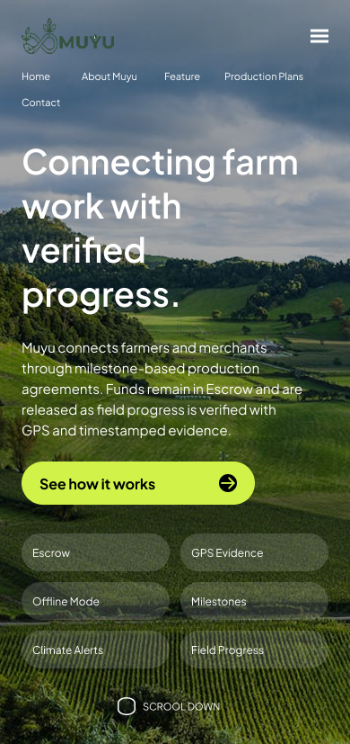
  

##### About Muyu

  

  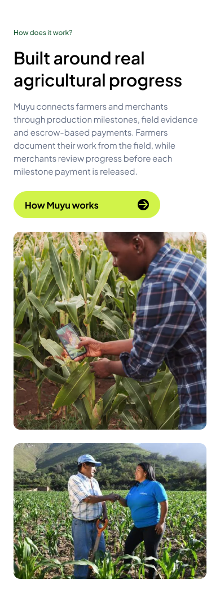
  

##### Core Features
 
  

  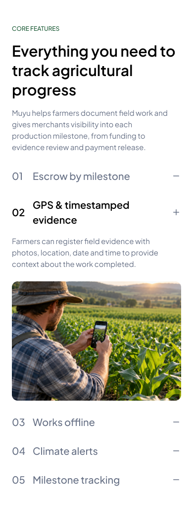
  

##### Production Plans

  

  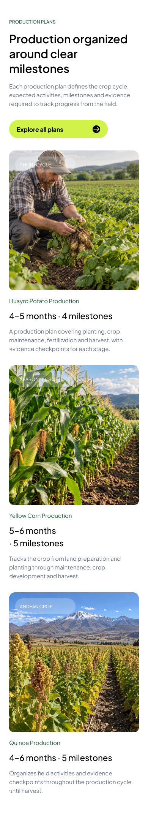
  

##### How It Works

  

  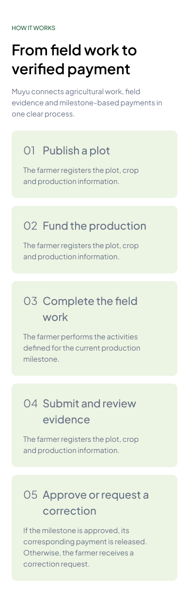
  

##### Payments

  

  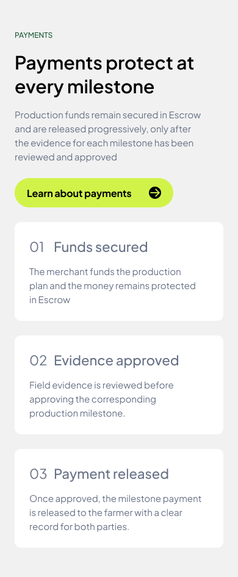
  

##### For Farmers and Merchants

  

  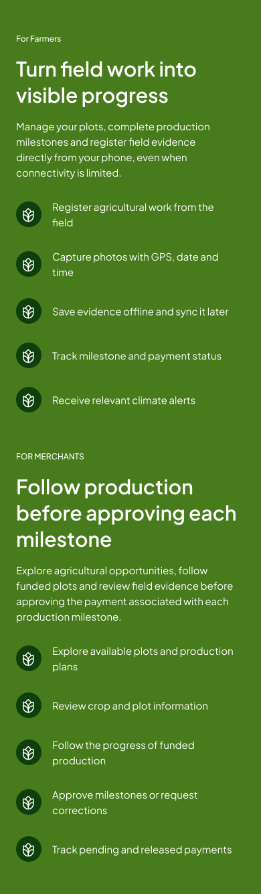
  

##### Frequently Asked Questions

  

  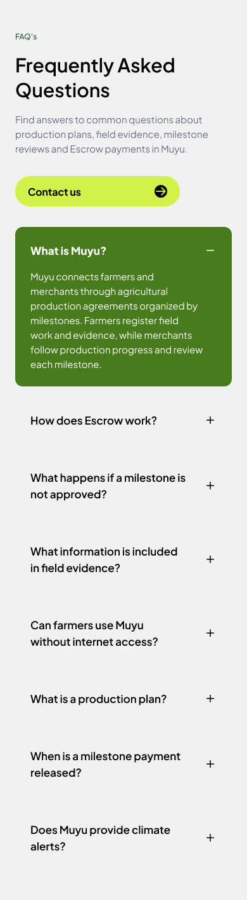
  

##### Testimonials

  

  
  

##### Call to Action

  

  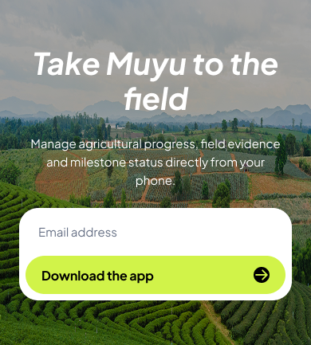
  

##### Contact

  

  
  

##### Footer

  

  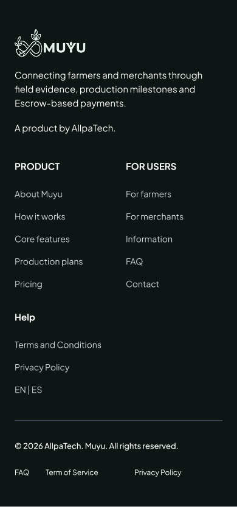
  

### 3.1.4. Mobile Applications UX/UI Design
#### 3.1.4.1. Mobile Applications Wireframes

En esta sección se presentan los wireframes diseñados para la aplicación móvil de Muyu. Estos esquemas definen la estructura visual, la distribución de los componentes y la jerarquía de la información antes de aplicar el diseño visual final (UI). Se han categorizado según los dos actores principales del sistema: **Agricultor** y **Comerciante**.

##### Perfil: Agricultor

**Pantalla Principal (Home)**
Vista central (Dashboard) donde el agricultor puede ver un resumen rápido de sus actividades, tareas pendientes y accesos directos a sus cultivos.

  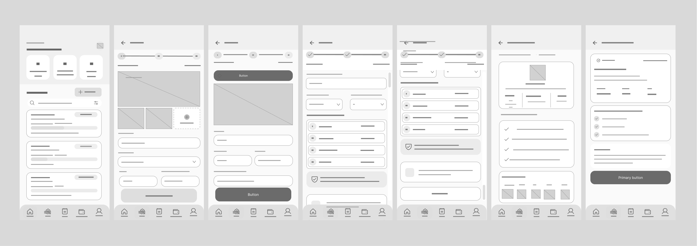

**Gestión de Parcelas (Plot)**
Interfaz para visualizar, registrar y administrar los detalles específicos de las parcelas agrícolas.

  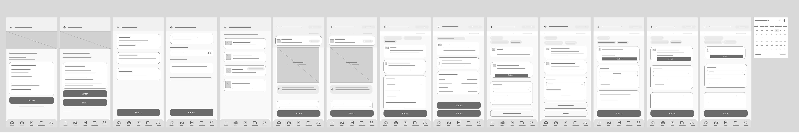

**Sincronización Offline (Sync)**
Pantalla fundamental para zonas rurales con baja conectividad, permitiendo al agricultor sincronizar sus datos de campo cuando recupere la conexión a internet.

  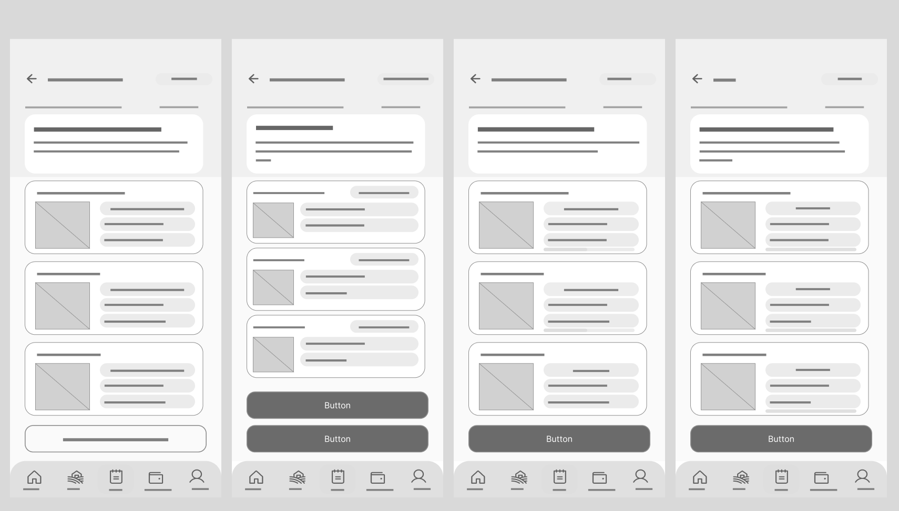

**Gestión de Pagos (Payment)**
Vista de la billetera o sección financiera para solicitar, recibir y gestionar los desembolsos por parte de los comerciantes.

  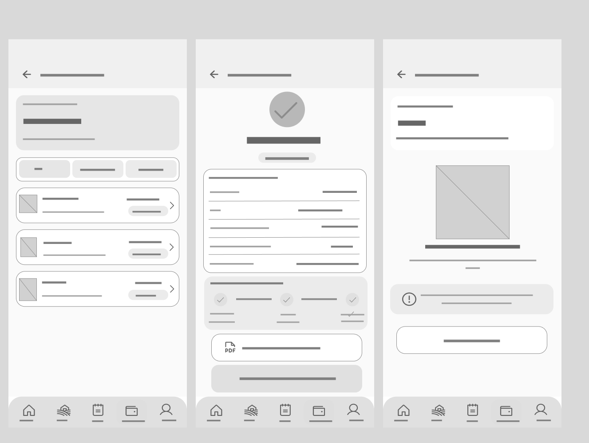

**Perfil de Usuario (Profile)**
Configuración de la cuenta del agricultor, datos personales y preferencias de la aplicación.

  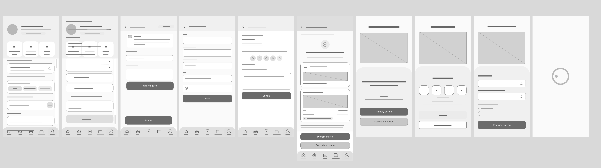

**Estado y Seguimiento (Estado)**
Pantalla dedicada al seguimiento del estado de los cultivos, avance de los hitos y condiciones actuales.

  

---

##### Perfil: Comerciante

**Exploración de Catálogo (Catálogo)**
Interfaz que permite al comerciante buscar, filtrar y explorar las diferentes parcelas y cultivos disponibles para financiamiento o compra.

  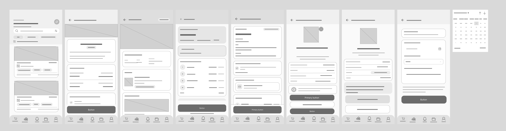

**Detalle de Parcela (Plot)**
Vista detallada de una parcela seleccionada desde el catálogo, mostrando información técnica y métricas para la toma de decisiones.

  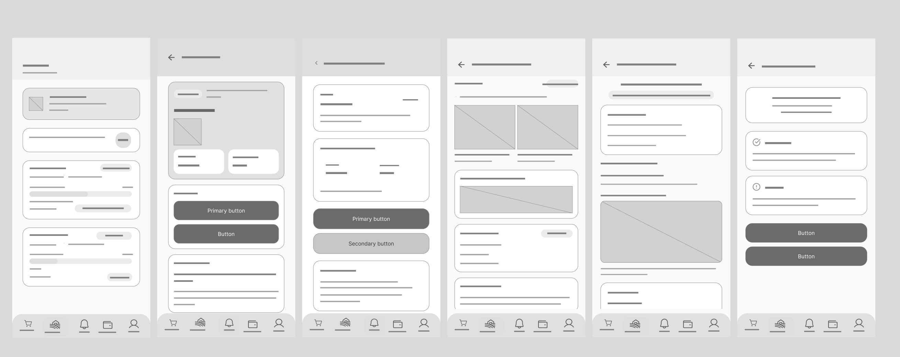

**Pagos y Financiamiento (Payment)**
Pasarela y gestión de transacciones para que el comerciante pueda realizar los pagos de las cuotas o desembolsos de los contratos de escrow.

  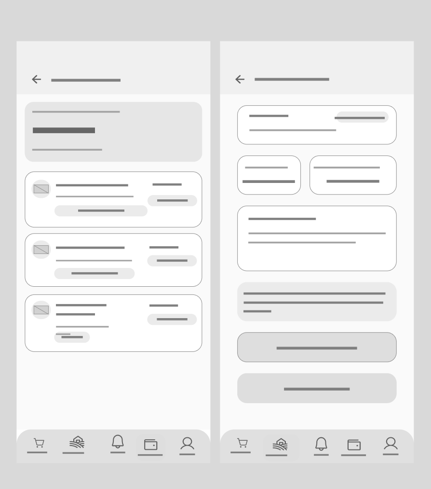

**Notificaciones (Notifications)**
Centro de alertas sobre actualizaciones de hitos, cambios climáticos severos o confirmaciones de transacciones.

  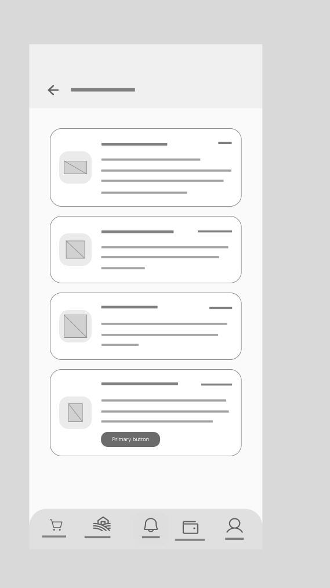

**Perfil de Usuario (Profile)**
Gestión del perfil del comerciante, historial de inversiones, reputación y ajustes de la cuenta.

  

**Estado de Inversión (Estado)**
Pantalla para el monitoreo de los contratos activos, permitiendo ver el progreso de las parcelas financiadas y la validación de sus hitos.

  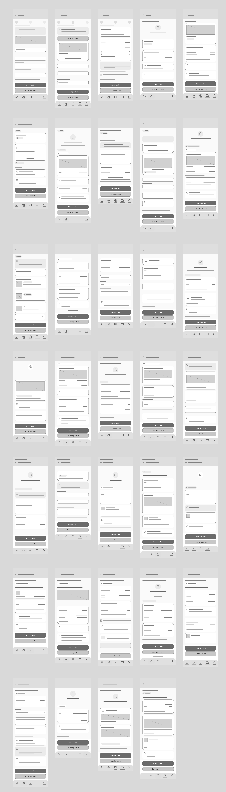

#### 3.1.4.2. Mobile Applications Wireflow Diagrams

- Perfil - Agricultor:

##### Publicar una parcela

<table>
  <tr>
    <td><strong>User Persona</strong></td>
    <td>Agricultor</td>
    <td><strong>Número</strong></td>
    <td>1</td>
  </tr>

  <tr>
    <td><strong>User Goal</strong></td>
    <td colspan="3">
      Como Agricultor, quiero registrar las dimensiones y ubicación de mi
      parcela, para hacer visible mi oferta a los compradores.
    </td>
  </tr>

  <tr>
    <td><strong>Happy path</strong></td>
    <td colspan="3">
      El agricultor accede a la sección de parcelas y selecciona la opción
      para publicar una nueva parcela. El sistema muestra el primer paso del
      formulario, donde se registran las fotografías, el nombre de la parcela,
      el tipo de cultivo, el área y la fecha estimada de cosecha.
        
      Después de completar los campos obligatorios, el agricultor continúa
      con el registro de la ubicación. En esta etapa puede utilizar su
      ubicación actual y completar la región, provincia, distrito y dirección
      de referencia. El sistema valida la información y las coordenadas GPS
      antes de habilitar el siguiente paso.
        
      A continuación, se presenta el plan de financiamiento con el monto
      solicitado, la duración del ciclo, la cantidad de hitos y la distribución
      de los desembolsos. El agricultor revisa la información y acepta las
      condiciones para habilitar la confirmación.
        
      Finalmente, el agricultor confirma la publicación. El sistema guarda la
      información, asigna a la parcela el estado “Publicada” y muestra una
      confirmación. La parcela aparece en la sección “My Plots” como disponible
      para ser consultada por los comerciantes.
    </td>
  </tr>
</table>

<strong>Wireflow Diagram - 1</strong>

##### Registrar evidencia de un hito

<table>
  <tr>
    <td><strong>User Persona</strong></td>
    <td>Agricultor</td>
    <td><strong>Número</strong></td>
    <td>2</td>
  </tr>

  <tr>
    <td><strong>User Goal</strong></td>
    <td colspan="3">
      Como Agricultor, quiero subir evidencias fotográficas con geolocalización
      de mi cultivo, para demostrar el avance de la tarea en el hito actual.
    </td>
  </tr>

  <tr>
    <td><strong>Happy path</strong></td>
    <td colspan="3">
      El agricultor abre una parcela financiada y selecciona el hito pendiente
      de Fertilización. Luego, elige la opción “Record evidence” para iniciar
      el registro.
        
      El sistema muestra la pantalla de registro de evidencia, donde el
      agricultor toma una fotografía o la selecciona desde la galería. La
      aplicación registra la fecha, la hora y la ubicación GPS. Además, el
      agricultor indica el insumo utilizado y la cantidad aplicada.
        
      Después de completar la información, el agricultor continúa a la
      revisión. El sistema presenta la fotografía y los datos capturados para
      comprobar que la ubicación se encuentre dentro de la parcela y que la
      información esté completa.
        
      Finalmente, el agricultor selecciona “Submit evidence”. El servidor
      recibe la evidencia y cambia su estado a “Submitted” o “Pendiente de
      revisión”. El desembolso de S/ 2 000 permanece retenido hasta que el
      comerciante revise y apruebe la evidencia.
    </td>
  </tr>
</table>

<strong>
 Wireflow Diagram - 2
</strong>

##### Corregir un hito rechazado

<table>
  <tr>
    <td><strong>User Persona</strong></td>
    <td>Agricultor</td>
    <td><strong>Número</strong></td>
    <td>3</td>
  </tr>

  <tr>
    <td><strong>User Goal</strong></td>
    <td colspan="3">
      Como Agricultor, quiero reenviar evidencias corregidas, para que el
      comerciante pueda aprobarlas.
    </td>
  </tr>

  <tr>
    <td><strong>Happy path</strong></td>
    <td colspan="3">
      El agricultor abre el detalle del hito rechazado. El sistema muestra el
      motivo del rechazo, la evidencia original y el monto que continúa
      retenido. Después de revisar la observación del comerciante, el
      agricultor selecciona “Correct evidence”.
        
      El sistema abre una nueva versión de la evidencia y conserva el registro
      original. El agricultor adjunta una fotografía corregida, indica el
      insumo utilizado y la cantidad aplicada, y escribe una nota explicando
      la corrección realizada.
        
      Antes del reenvío, el sistema valida la fotografía, la fecha, la
      ubicación GPS y los datos registrados. El agricultor comprueba que la
      nueva evidencia atienda el motivo del rechazo y selecciona “Resubmit
      evidence”.
        
      Finalmente, el sistema registra la corrección como una nueva versión,
      conserva la evidencia original en el historial y cambia su estado a
      “Submitted” o “Pendiente de revisión”. El desembolso de S/ 2 000
      permanece retenido hasta que el comerciante revise nuevamente la
      evidencia.
    </td>
  </tr>
</table>

<strong>
Wireflow Diagram - 3
</strong>

##### Consultar una alerta climática

<table>
  <tr>
    <td><strong>User Persona</strong></td>
    <td>Agricultor</td>
    <td><strong>Número</strong></td>
    <td>4</td>
  </tr>

  <tr>
    <td><strong>User Goal</strong></td>
    <td colspan="3">
      Como Agricultor, quiero consultar el riesgo climático y registrar las
      medidas preventivas realizadas, para proteger mi cultivo ante condiciones
      meteorológicas adversas.
    </td>
  </tr>

  <tr>
    <td><strong>Happy path</strong></td>
    <td colspan="3">
      El agricultor accede a la sección “My Plots”. El sistema muestra las
      parcelas registradas y señala que Esperanza Plot presenta un riesgo de
      lluvia intensa. El agricultor selecciona el indicador “Heavy rain risk”
      para consultar la alerta.
        
      El sistema presenta la información meteorológica correspondiente:
      precipitación estimada de 42 mm, duración de 24 horas y nivel de riesgo
      alto. También muestra las recomendaciones preventivas para proteger el
      cultivo.
        
      Después de realizar las medidas fuera de la aplicación, el agricultor
      registra que revisó el drenaje, protegió los insumos y postergó la
      fertilización durante la lluvia.
        
      Finalmente, el sistema guarda las medidas registradas y muestra la alerta
      con el estado “Addressed” o “Atendida”. El riesgo meteorológico permanece
      activo, debido a que registrar la atención no detiene la lluvia ni
      garantiza la protección del cultivo.
    </td>
  </tr>
</table>

 
 <strong>Wireflow Diagram - 4 
</strong>

##### Sincronizar evidencias sin conexión

<table>
  <tr>
    <td><strong>User Persona</strong></td>
    <td>Agricultor</td>
    <td><strong>Número</strong></td>
    <td>5</td>
  </tr>

  <tr>
    <td><strong>User Goal</strong></td>
    <td colspan="3">
      Como Agricultor, quiero enviar las evidencias guardadas al recuperar la
      conexión, para no perderlas ni duplicarlas.
    </td>
  </tr>

  <tr>
    <td><strong>Happy path</strong></td>
    <td colspan="3">
      El agricultor accede a la sección “Sync”. El sistema muestra tres
      evidencias pendientes, almacenadas localmente junto con sus fotografías,
      coordenadas GPS, fechas y demás metadatos.
        
      Cuando se recupera una conexión permitida, el sistema inicia la
      sincronización de la cola y muestra el progreso individual de cada
      evidencia. Cada registro se envía una sola vez para evitar duplicados.
        
      Dos evidencias se envían correctamente y cambian su estado a
      “Submitted”. Si una evidencia presenta un error, los registros enviados
      permanecen en el historial y únicamente la evidencia fallida continúa
      pendiente.
        
      El agricultor selecciona “Retry Molinos”. El sistema reintenta solamente
      el registro fallido y completa su envío sin volver a procesar las otras
      evidencias.
        
      Finalmente, el sistema muestra cero evidencias pendientes, tres nuevos
      registros enviados y un historial total de quince evidencias. Los
      registros sincronizados se conservan sin pérdidas ni duplicados.
    </td>
  </tr>
</table>

 
 <strong>Wireflow Diagram - 5 
</strong>

- Perfil - Comerciante:

##### Financiar una parcela

<table>
  <tr>
    <td><strong>User Persona</strong></td>
    <td>Comerciante</td>
    <td><strong>Número</strong></td>
    <td>6</td>
  </tr>

  <tr>
    <td><strong>User Goal</strong></td>
    <td colspan="3">
      Como Comerciante, quiero financiar de forma directa una parcela
      eligiendo entre los métodos de pago habilitados, para transferir los
      fondos a custodia y asegurar el ciclo productivo.
    </td>
  </tr>

  <tr>
    <td><strong>Happy path</strong></td>
    <td colspan="3">
      La comerciante accede al catálogo de parcelas disponibles y selecciona
      Esperanza Plot. El sistema muestra los detalles del cultivo, el área, la
      ubicación y la información del agricultor.
        
      Después de revisar la parcela, la comerciante selecciona la opción para
      financiarla. El sistema presenta el monto total de S/ 8 500 y el plan de
      desembolsos correspondiente a los hitos de Planting, Irrigation,
      Fertilization y Harvest.
        
      La comerciante selecciona un método de pago, revisa el funcionamiento de
      Escrow y acepta los términos y condiciones. El sistema habilita la
      continuación y muestra la revisión final del contrato con el monto,
      destinatario, parcela y distribución de las cuotas.
        
      La comerciante confirma el financiamiento y realiza el pago de S/ 8 500.
      El sistema procesa la transacción, cambia el estado de la parcela a
      “Financiada” y transfiere el monto a retención en Escrow.
        
      Finalmente, el sistema muestra la confirmación del financiamiento,
      notifica al agricultor y permite consultar la parcela financiada o
      descargar el comprobante. Los fondos permanecen retenidos hasta la
      aprobación de los hitos correspondientes.
    </td>
  </tr>
</table>

 
 <strong>Wireflow Diagram - 6 
</strong>

##### Revisar, aprobar o rechazar un hito

<table>
  <tr>
    <td><strong>User Persona</strong></td>
    <td>Comerciante</td>
    <td><strong>Número</strong></td>
    <td>7</td>
  </tr>

  <tr>
    <td><strong>User Goal</strong></td>
    <td colspan="3">
      Como Comerciante, quiero validar la evidencia de un hito y aprobarla o
      rechazarla con una justificación, para liberar únicamente la cuota
      correspondiente cuando el trabajo cumpla los criterios establecidos.
    </td>
  </tr>

  <tr>
    <td><strong>Happy path</strong></td>
    <td colspan="3">
      La comerciante accede a la sección “My Plots” y filtra las parcelas que
      tienen evidencias pendientes de revisión. Luego, selecciona Esperanza
      Plot y abre la evidencia correspondiente al hito de Fertilización.
        
      El sistema presenta la fotografía enviada, la fecha, la ubicación GPS,
      el insumo utilizado, la cantidad aplicada y la nota del agricultor. La
      comerciante revisa la información y comprueba que la evidencia se
      encuentre dentro de la parcela y cumpla los criterios del hito.
        
      La comerciante selecciona “Approve and release payment”. El sistema
      muestra una revisión final con la evidencia y la cuota de S/ 2 000 que
      será liberada. También informa que la aprobación no puede deshacerse y
      que únicamente se procesará el pago correspondiente a Fertilización.
        
      Después de verificar las consecuencias, la comerciante confirma la
      aprobación. El sistema cambia el estado del hito a “Aprobado” y procesa
      la liberación de S/ 2 000 al medio de cobro del agricultor.
        
      Finalmente, el sistema muestra tres de cuatro hitos aprobados, un total
      liberado de S/ 6 000 y un saldo de S/ 2 500 retenido en Escrow. También
      notifica al agricultor y permite consultar la parcela o el comprobante.
    </td>
  </tr>
</table>

 
 <strong>Wireflow Diagram - 7 
</strong>

##### Solicitar una visita presencial

<table>
  <tr>
    <td><strong>User Persona</strong></td>
    <td>Comerciante</td>
    <td><strong>Número</strong></td>
    <td>8</td>
  </tr>

  <tr>
    <td><strong>User Goal</strong></td>
    <td colspan="3">
      Como Comerciante, quiero agendar una fecha para visitar la parcela de
      forma presencial, para inspeccionar el estado del terreno y conversar
      con el agricultor antes de formalizar el financiamiento.
    </td>
  </tr>

  <tr>
    <td><strong>Happy path</strong></td>
    <td colspan="3">
      La comerciante accede al detalle de Esperanza Plot antes de iniciar el
      financiamiento y selecciona la opción para solicitar una visita
      presencial.
        
      El sistema muestra el formulario de coordinación. La comerciante
      selecciona una fecha disponible, establece la hora de preferencia y
      escribe un mensaje opcional indicando el aspecto de la parcela que desea
      inspeccionar.
        
      Después de completar la información, la comerciante selecciona “Send
      request”. El sistema registra la solicitud con el estado “Pendiente”,
      muestra la fecha y hora propuestas y notifica al agricultor.
        
      Cuando el agricultor acepta la solicitud, el sistema cambia su estado a
      “Confirmada”. La pantalla muestra la fecha y hora realmente acordadas,
      el punto de encuentro, las coordenadas y los datos de contacto del
      agricultor.
        
      Finalmente, la comerciante puede consultar nuevamente la parcela o
      regresar a sus alertas. La coordinación de la visita no reserva ni
      financia la parcela y tampoco genera cargos o depósitos en Escrow.
    </td>
  </tr>
</table>

 
 <strong>Wireflow Diagram - 8 
</strong>

##### Confirmar la recepción de la cosecha

<table>
  <tr>
    <td><strong>User Persona</strong></td>
    <td>Comerciante</td>
    <td><strong>Número</strong></td>
    <td>9</td>
  </tr>

  <tr>
    <td><strong>User Goal</strong></td>
    <td colspan="3">
      Como Comerciante, quiero confirmar una entrega conforme y autorizar el
      último desembolso, para cerrar el ciclo productivo después de recibir la
      cosecha acordada.
    </td>
  </tr>

  <tr>
    <td><strong>Happy path</strong></td>
    <td colspan="3">
      La comerciante accede al detalle de la entrega correspondiente al hito
      final de Harvest. El sistema muestra la fotografía de respaldo, la
      fecha, las coordenadas GPS y los datos registrados por el agricultor.
        
      La comerciante compara la cantidad acordada de 4 000 kg con la cantidad
      recibida y comprueba que la calidad de la cosecha sea aceptable. Después
      de verificar que la entrega esté completa y conforme, selecciona
      “Confirm receipt”.
        
      El sistema presenta la revisión final de la recepción, incluyendo la
      cantidad acordada, la cantidad recibida, la calidad, el agricultor y el
      pago contractual pendiente de S/ 2 500.
        
      La comerciante confirma expresamente la recepción física de los 4 000 kg
      y autoriza la liberación del último desembolso. El sistema habilita el
      botón de confirmación y procesa el pago final al agricultor.
        
      Finalmente, el sistema cambia el estado del hito Harvest a “Aprobado”,
      completa los cuatro hitos del contrato y muestra un total liberado de
      S/ 8 500. El saldo de Escrow queda en S/ 0 y se habilita la descarga del
      comprobante y la consulta del contrato finalizado.
    </td>
  </tr>
</table>

 
 <strong>Wireflow Diagram - 9 
</strong>

#### 3.1.4.3. Mobile Applications Mock-ups
#### 3.1.4.4. Mobile Applications User Flow Diagrams

##### Publicar una parcela

<table>
  <tr>
    <td><strong>User Persona</strong></td>
    <td>Agricultor</td>
    <td><strong>Número</strong></td>
    <td>1</td>
  </tr>

  <tr>
    <td><strong>User Goal</strong></td>
    <td colspan="3">
      Como Agricultor, quiero registrar las dimensiones y ubicación de mi
      parcela, para hacer visible mi oferta a los compradores.
    </td>
  </tr>

  <tr>
    <td><strong>Happy path</strong></td>
    <td colspan="3">
      El agricultor inicia el proceso desde la opción “Publish”. En la primera
      pantalla, registra las fotografías y los datos principales de la parcela;
      luego, presiona “Next: location”.
        
      En la pantalla de ubicación, registra o confirma las coordenadas y
      completa la región, provincia, distrito y dirección de referencia.
      Después, selecciona “Next: financing”.
        
      El sistema muestra el plan de financiamiento. El agricultor revisa el
      monto solicitado, la duración del ciclo, los hitos y la distribución de
      las cuotas. Luego, acepta el acuerdo y confirma la publicación.
        
      Finalmente, el sistema muestra la confirmación y permite acceder a “My
      Plots”, donde la nueva parcela aparece con el estado “Available”.
    </td>
  </tr>

  <tr>
    <td><strong>Unhappy Paths</strong></td>
    <td colspan="3">
      Si el agricultor omite el nombre, el área, las fotografías u otro dato
      obligatorio, el sistema resalta los campos incompletos y deshabilita el
      botón para continuar al paso de ubicación.
        
      Si la ubicación no fue registrada o la región, provincia o distrito son
      inválidos, el sistema muestra los mensajes de validación correspondientes
      e impide continuar al plan de financiamiento.
        
      Si la suma de las cuotas no coincide con el monto total solicitado de
      S/ 8 500, el sistema muestra la diferencia, deshabilita la publicación y
      solicita ajustar los importes del plan.
        
      Si el agricultor no acepta los términos del acuerdo de financiamiento, el
      sistema mantiene deshabilitado el botón “Publish plot”.
        
      Si el agricultor decide abandonar el proceso, puede guardar la
      información como borrador y continuar posteriormente.
        
      Consideraciones:
      <ul>
        <li>
          Los campos obligatorios deben completarse antes de avanzar.
        </li>
        <li>
          La ubicación debe corresponder a una región, provincia y distrito
          válidos.
        </li>
        <li>
          La suma de los desembolsos debe coincidir con el monto total
          solicitado.
        </li>
        <li>
          La publicación deja la parcela disponible, pero no deposita fondos ni
          confirma un financiamiento.
        </li>
      </ul>
    </td>
  </tr>
</table>

<strong>User Flow - 1</strong>

##### Registrar evidencia de un hito

<table>
  <tr>
    <td><strong>User Persona</strong></td>
    <td>Agricultor</td>
    <td><strong>Número</strong></td>
    <td>2</td>
  </tr>

  <tr>
    <td><strong>User Goal</strong></td>
    <td colspan="3">
      Como Agricultor, quiero subir evidencias fotográficas con geolocalización
      de mi cultivo, para demostrar el avance de la tarea en el hito actual.
    </td>
  </tr>

  <tr>
    <td><strong>Happy path</strong></td>
    <td colspan="3">
      El agricultor abre Esperanza Plot y selecciona “Record evidence” en el
      hito pendiente de Fertilización.
        
      En la pantalla de registro, toma una fotografía o selecciona una imagen
      desde la galería. La aplicación registra automáticamente la fecha, la
      hora y las coordenadas GPS. Luego, el agricultor indica el insumo
      utilizado, la cantidad aplicada y presiona “Continue”.
        
      El sistema muestra la pantalla de revisión con la fotografía, la
      ubicación registrada y los datos de la actividad. El agricultor verifica
      la información y selecciona “Submit evidence”.
        
      Finalmente, el sistema recibe la evidencia y muestra la confirmación del
      envío. El registro cambia al estado “Submitted” o “Pendiente de revisión”
      y queda disponible para la evaluación del comerciante.
    </td>
  </tr>

  <tr>
    <td><strong>Unhappy Paths</strong></td>
    <td colspan="3">
      Si la aplicación no tiene permiso para utilizar la cámara, el sistema
      informa que no puede capturar la fotografía y permite abrir la
      configuración del dispositivo o seleccionar una imagen desde la
      galería.
        
      Si la fotografía tiene un formato no admitido o supera el tamaño máximo
      permitido, el sistema rechaza el archivo y solicita seleccionar o
      capturar otra imagen.
        
      Si el agricultor omite el insumo utilizado, la cantidad aplicada u otro
      dato obligatorio, el sistema resalta los campos incompletos e impide
      continuar a la revisión.
        
      Si las coordenadas GPS no coinciden con la ubicación de la parcela, el
      sistema bloquea el envío, conserva el borrador y solicita corregir o
      capturar nuevamente la ubicación.
        
      Si no existe una conexión permitida al momento del envío, la aplicación
      guarda la fotografía y sus metadatos en la cola local. Cuando se recupera
      la conexión, el sistema sincroniza los registros pendientes.
        
      Si una evidencia falla durante la sincronización, el sistema conserva los
      registros enviados correctamente y permite reintentar únicamente el
      registro fallido, sin eliminar ni duplicar información.
        
      Consideraciones:
      <ul>
        <li>
          La fotografía debe cumplir el formato y tamaño máximo permitido.
        </li>
        <li>
          La evidencia debe incluir fecha, hora, GPS, insumo y cantidad
          aplicada.
        </li>
        <li>
          La ubicación registrada debe encontrarse dentro de la parcela.
        </li>
        <li>
          Las evidencias guardadas sin conexión deben conservar sus fotografías
          y metadatos hasta completar la sincronización.
        </li>
        <li>
          El estado “Submitted” o “Pendiente de revisión” no significa que la
          evidencia haya sido aprobada ni que el pago haya sido liberado.
        </li>
      </ul>
    </td>
  </tr>
</table>

<strong>User Flow - 2</strong>

##### Corregir un hito rechazado

<table>
  <tr>
    <td><strong>User Persona</strong></td>
    <td>Agricultor</td>
    <td><strong>Número</strong></td>
    <td>3</td>
  </tr>

  <tr>
    <td><strong>User Goal</strong></td>
    <td colspan="3">
      Como Agricultor, quiero reenviar evidencias corregidas, para que el
      comerciante pueda aprobarlas.
    </td>
  </tr>

  <tr>
    <td><strong>Happy path</strong></td>
    <td colspan="3">
      El agricultor abre el detalle del hito de Fertilización y consulta el
      motivo por el cual la evidencia fue rechazada. La pantalla también
      muestra la evidencia original y el monto que permanece retenido.
        
      El agricultor selecciona “Correct evidence”. El sistema abre una nueva
      versión de la evidencia y conserva la fotografía y los datos del envío
      anterior en el historial.
        
      En la pantalla de corrección, el agricultor adjunta una fotografía más
      clara, verifica el insumo utilizado, registra la cantidad aplicada y
      escribe una nota explicando la corrección. Luego, comprueba que la
      ubicación GPS sea válida.
        
      Después de revisar la nueva información, selecciona “Resubmit evidence”.
      El sistema registra la evidencia como una nueva versión y muestra la
      confirmación del reenvío.
        
      Finalmente, la corrección queda en estado “Submitted” o “Pendiente de
      revisión”. La evidencia original y el motivo del rechazo permanecen
      disponibles en el historial.
    </td>
  </tr>

  <tr>
    <td><strong>Unhappy Paths</strong></td>
    <td colspan="3">
      Si la nueva fotografía o los datos registrados no corrigen el motivo del
      rechazo, el sistema conserva la evidencia como borrador e impide
      reenviarla hasta que la observación sea atendida.
        
      Si el agricultor omite la fotografía, el insumo utilizado, la cantidad
      aplicada u otro dato obligatorio, el sistema resalta los campos
      incompletos y mantiene deshabilitado el reenvío.
        
      Si la fotografía tiene un formato no admitido o supera el tamaño
      permitido, el sistema rechaza el archivo y solicita seleccionar una nueva
      imagen.
        
      Si las coordenadas GPS no coinciden con la parcela, el sistema bloquea el
      reenvío, conserva el borrador y solicita corregir la ubicación.
        
      Si no existe una conexión permitida, la aplicación guarda la nueva
      versión en la cola local. Cuando se recupera la conexión, el sistema
      sincroniza únicamente el registro pendiente.
        
      Si la evidencia ya fue aprobada, el sistema bloquea cualquier intento de
      reemplazarla o crear una nueva corrección sobre la misma versión.
        
      Consideraciones:
      <ul>
        <li>
          La evidencia original y el motivo del rechazo deben conservarse en
          el historial.
        </li>
        <li>
          La corrección debe registrarse como una nueva versión y no debe
          sobrescribir la evidencia anterior.
        </li>
        <li>
          El agricultor puede guardar la corrección como borrador y continuar
          posteriormente.
        </li>
        <li>
          El estado “Pendiente de revisión” no significa que la evidencia haya
          sido aprobada.
        </li>
        <li>
          El reenvío de la corrección no libera automáticamente los S/ 2 000
          retenidos.
        </li>
      </ul>
    </td>
  </tr>
</table>

<strong>User Flow - 3</strong>

##### Consultar una alerta climática

<table>
  <tr>
    <td><strong>User Persona</strong></td>
    <td>Agricultor</td>
    <td><strong>Número</strong></td>
    <td>4</td>
  </tr>

  <tr>
    <td><strong>User Goal</strong></td>
    <td colspan="3">
      Como Agricultor, quiero consultar el riesgo climático y registrar las
      medidas preventivas realizadas, para proteger mi cultivo ante
      condiciones meteorológicas adversas.
    </td>
  </tr>

  <tr>
    <td><strong>Happy path</strong></td>
    <td colspan="3">
      El agricultor accede a “My Plots” y revisa el estado de sus parcelas. En
      Esperanza Plot identifica el indicador “Heavy rain risk”.
        
      El agricultor selecciona la alerta para consultar su información. El
      sistema muestra una precipitación estimada de 42 mm, una duración de
      24 horas y un nivel de riesgo alto.
        
      La pantalla también presenta las medidas preventivas registradas por el
      agricultor: revisión del drenaje, protección de los insumos y
      postergación de la fertilización durante la lluvia.
        
      Finalmente, el sistema muestra la alerta con el estado “Addressed” o
      “Atendida” y conserva visible la advertencia de que el riesgo
      meteorológico continúa activo.
    </td>
  </tr>

  <tr>
    <td><strong>Unhappy Paths</strong></td>
    <td colspan="3">
      Si el agricultor todavía no ha realizado o registrado las medidas
      preventivas, el sistema no cambia la alerta al estado “Addressed”. La
      alerta permanece pendiente y el usuario regresa a “My Plots” para
      continuar monitoreando el riesgo.
        
      Si una parcela no presenta riesgos meteorológicos activos, el sistema
      muestra el estado “No active alerts” y no habilita el acceso al detalle
      de una alerta.
        
      Si el agricultor solamente consulta la alerta, pero no registra las
      medidas realizadas, el sistema conserva el estado pendiente y no
      considera la alerta como atendida.
        
      Aunque las medidas preventivas hayan sido registradas, el sistema no
      elimina ni desactiva el riesgo meteorológico. La lluvia y el nivel de
      riesgo permanecen visibles mientras continúe la condición climática.
        
      Consideraciones:
      <ul>
        <li>
          Las medidas preventivas se realizan fuera de la aplicación.
        </li>
        <li>
          Consultar las recomendaciones no equivale a registrar su ejecución.
        </li>
        <li>
          El estado “Addressed” confirma el registro de la atención, pero no
          garantiza la protección del cultivo.
        </li>
        <li>
          Una alerta atendida puede continuar mostrando un nivel de riesgo
          alto.
        </li>
      </ul>
    </td>
  </tr>
</table>

<strong>User Flow - 4</strong>

##### Sincronizar evidencias sin conexión

<table>
  <tr>
    <td><strong>User Persona</strong></td>
    <td>Agricultor</td>
    <td><strong>Número</strong></td>
    <td>5</td>
  </tr>

  <tr>
    <td><strong>User Goal</strong></td>
    <td colspan="3">
      Como Agricultor, quiero sincronizar las evidencias guardadas al recuperar
      la conexión, para enviarlas sin perderlas ni duplicarlas.
    </td>
  </tr>

  <tr>
    <td><strong>Happy path</strong></td>
    <td colspan="3">
      El agricultor accede a la sección “Synchronization”. El sistema muestra
      tres evidencias pendientes almacenadas localmente, junto con sus
      fotografías, fechas y ubicaciones registradas.
        
      Cuando se recupera una conexión permitida, el sistema inicia la
      sincronización y muestra el progreso individual de cada evidencia. Dos
      registros se envían correctamente y uno presenta un error.
        
      El agricultor selecciona “Retry Molinos”. El sistema reintenta únicamente
      la evidencia que falló, sin volver a enviar los registros que ya fueron
      procesados.
        
      Finalmente, la sincronización termina correctamente. El sistema muestra
      cero evidencias pendientes, tres registros enviados y un historial total
      de quince evidencias.
    </td>
  </tr>

  <tr>
    <td><strong>Unhappy Paths</strong></td>
    <td colspan="3">
      Si existe conexión mediante datos móviles, pero la preferencia del
      agricultor permite sincronizar únicamente por Wi-Fi, el sistema no inicia
      la carga automáticamente. El agricultor puede esperar una conexión Wi-Fi
      o autorizar expresamente el uso de datos móviles.
        
      Si la señal todavía no se ha recuperado, el sistema mantiene las tres
      evidencias en la cola local con el estado “Waiting for connection” y
      conserva sus fotografías, fechas, coordenadas GPS y demás metadatos.
        
      Si la conexión se interrumpe durante la sincronización, el sistema
      conserva como enviados los registros que finalizaron correctamente y
      mantiene en la cola únicamente la evidencia incompleta.
        
      Si una evidencia falla durante el envío, el sistema muestra el estado
      “Error: Retry” y permite reintentar solamente ese registro. Las demás
      evidencias no se eliminan ni se vuelven a enviar.
        
      Si el nuevo intento vuelve a fallar, la evidencia permanece en la cola
      local y el agricultor puede seleccionar “Try again later” para continuar
      posteriormente.
        
      Consideraciones:
      <ul>
        <li>
          La aplicación debe comprobar la preferencia de conexión antes de
          iniciar o reanudar una carga.
        </li>
        <li>
          Los registros pendientes deben conservar sus fotografías y
          metadatos mientras no exista una conexión permitida.
        </li>
        <li>
          Una carga parcial no debe borrar las evidencias pendientes ni
          duplicar las que ya fueron enviadas.
        </li>
        <li>
          El historial debe aumentar únicamente cuando cada evidencia complete
          su envío.
        </li>
        <li>
          El estado “Sent” confirma la sincronización, pero no significa que la
          evidencia haya sido aprobada.
        </li>
      </ul>
    </td>
  </tr>
</table>

<strong>User Flow - 5</strong>

##### Financiar una parcela

<table>
  <tr>
    <td><strong>User Persona</strong></td>
    <td>Comerciante</td>
    <td><strong>Número</strong></td>
    <td>6</td>
  </tr>

  <tr>
    <td><strong>User Goal</strong></td>
    <td colspan="3">
      Como Comerciante, quiero financiar de forma directa una parcela eligiendo
      entre los métodos de pago habilitados, para transferir los fondos a
      custodia y asegurar el ciclo productivo.
    </td>
  </tr>

  <tr>
    <td><strong>Happy path</strong></td>
    <td colspan="3">
      La comerciante accede al catálogo de parcelas disponibles y selecciona la
      parcela “Esperanza Plot”. El sistema muestra sus características,
      ubicación exacta y la información del agricultor.
        
      La comerciante selecciona “Finance plot”. El sistema muestra el monto
      total de S/ 8 500 y el plan de desembolso dividido entre los hitos de
      Planting, Irrigation, Fertilization y Harvest.
        
      La comerciante revisa el funcionamiento de Escrow, acepta los términos del
      financiamiento y continúa a la revisión final.
        
      El sistema presenta el monto total, el destinatario, la parcela, el
      financista, el método de pago y el plan de desembolso. La comerciante
      verifica la información y selecciona “Confirm and pay S/ 8 500”.
        
      Finalmente, el sistema confirma el financiamiento y muestra que los
      S/ 8 500 permanecen retenidos en Escrow. Los fondos serán liberados al
      agricultor conforme se apruebe cada hito.
    </td>
  </tr>

  <tr>
    <td><strong>Unhappy Paths</strong></td>
    <td colspan="3">
      Si la parcela deja de estar disponible después de ser seleccionada, el
      sistema interrumpe el financiamiento e informa que otro comerciante inició
      el proceso. La comerciante puede consultar otras parcelas o regresar al
      catálogo.
        
      Si la comerciante no acepta los términos del financiamiento, el sistema
      mantiene deshabilitada la opción “Continue”. La información permanece en
      la pantalla para que pueda revisar las condiciones y aceptarlas.
        
      Si el pago no puede confirmarse, el sistema muestra el estado “Payment was
      not confirmed” y conserva la operación como no confirmada.
        
      Antes de realizar un nuevo intento, la comerciante debe revisar sus
      transacciones para comprobar que no exista un cargo confirmado. Después
      puede cambiar el método de pago o seleccionar “Retry after reviewing”.
        
      Consideraciones:
      <ul>
        <li>
          La aplicación debe comprobar que la parcela continúe disponible antes
          de avanzar con el financiamiento.
        </li>
        <li>
          La confirmación debe permanecer deshabilitada mientras la comerciante
          no acepte expresamente los términos.
        </li>
        <li>
          Una respuesta de pago inconclusa no debe considerarse un
          financiamiento confirmado.
        </li>
        <li>
          El sistema debe verificar la operación anterior antes de permitir un
          nuevo intento, para evitar pagos duplicados.
        </li>
        <li>
          Los fondos confirmados deben permanecer retenidos en Escrow y
          liberarse únicamente cuando se aprueben los hitos correspondientes.
        </li>
      </ul>
    </td>
  </tr>
</table>

<strong>User Flow - 6</strong>

##### Revisar y aprobar o rechazar un hito

<table>
  <tr>
    <td><strong>User Persona</strong></td>
    <td>Comerciante</td>
    <td><strong>Número</strong></td>
    <td>7</td>
  </tr>

  <tr>
    <td><strong>User Goal</strong></td>
    <td colspan="3">
      Como Comerciante, quiero revisar la evidencia de un hito y aprobarla o
      rechazarla con un motivo, para liberar únicamente la cuota correspondiente
      cuando el avance sea conforme.
    </td>
  </tr>

  <tr>
    <td><strong>Happy path</strong></td>
    <td colspan="3">
      La comerciante accede a “My plots” y selecciona la parcela Esperanza, que
      tiene una evidencia de Fertilización pendiente de revisión.
        
      El sistema muestra la evidencia enviada por el agricultor, incluyendo las
      fotografías, la fecha, las coordenadas GPS, la ubicación verificada, el
      insumo utilizado, la cantidad aplicada y la nota registrada.
        
      La comerciante selecciona “Approve”. El sistema informa que la aprobación
      liberará únicamente la cuota de S/ 2 000 correspondiente al hito de
      Fertilización y muestra el saldo que permanecerá retenido en Escrow.
        
      La comerciante continúa a “Confirm approval”, revisa nuevamente la
      evidencia y las consecuencias financieras, y selecciona “Approve and
      release S/ 2 000”.
        
      Finalmente, el sistema confirma la aprobación del hito, libera S/ 2 000 al
      agricultor y muestra tres de cuatro hitos aprobados, S/ 6 000 liberados y
      S/ 2 500 todavía retenidos en Escrow.
    </td>
  </tr>

  <tr>
    <td><strong>Unhappy Paths</strong></td>
    <td colspan="3">
      Si la evidencia no demuestra correctamente el cumplimiento del hito, la
      comerciante selecciona “Reject and explain why”. El sistema muestra un
      formulario para indicar el motivo y la corrección requerida.
        
      Si la comerciante intenta confirmar el rechazo sin escribir un motivo, el
      sistema muestra el mensaje “A rejection reason is required”, mantiene la
      evidencia pendiente de revisión y no libera ningún fondo.
        
      Si la comerciante registra un motivo válido, el sistema confirma el
      rechazo, notifica al agricultor y conserva retenidos los S/ 2 000 del hito.
      El estado financiero permanece con dos de cuatro hitos aprobados,
      S/ 4 000 liberados y S/ 4 500 retenidos en Escrow.
        
      Si el agricultor envía una versión corregida, la comerciante debe revisar
      la nueva evidencia junto con el motivo anterior y el historial de
      versiones. La evidencia inicial no debe utilizarse para tomar la nueva
      decisión.
        
      Si la comerciante cancela la confirmación de aprobación, el sistema vuelve
      a la revisión de la evidencia sin liberar la cuota ni modificar su estado.
        
      Consideraciones:
      <ul>
        <li>
          La aplicación debe mostrar la fotografía, fecha, GPS, insumo, cantidad
          y notas antes de permitir una decisión.
        </li>
        <li>
          El rechazo debe exigir un motivo escrito y una indicación clara de la
          corrección necesaria.
        </li>
        <li>
          Una evidencia rechazada debe permanecer en el historial y conservar
          los fondos correspondientes en Escrow.
        </li>
        <li>
          Una evidencia corregida debe revisarse como una nueva versión sin
          eliminar el registro original ni el motivo del rechazo.
        </li>
        <li>
          La aprobación debe liberar solamente la cuota del hito revisado y no
          el saldo completo del contrato.
        </li>
        <li>
          El sistema debe impedir la liberación duplicada de una cuota que ya
          fue aprobada.
        </li>
      </ul>
    </td>
  </tr>
</table>

<strong>User Flow - 7</strong>

##### Solicitar una visita presencial

<table>
  <tr>
    <td><strong>User Persona</strong></td>
    <td>Comerciante</td>
    <td><strong>Número</strong></td>
    <td>8</td>
  </tr>

  <tr>
    <td><strong>User Goal</strong></td>
    <td colspan="3">
      Como Comerciante, quiero agendar una fecha para visitar la parcela de
      forma presencial, para inspeccionar el estado del terreno y conversar con
      el agricultor antes de formalizar el financiamiento.
    </td>
  </tr>

  <tr>
    <td><strong>Happy path</strong></td>
    <td colspan="3">
      La comerciante accede a la parcela Esperanza y selecciona la opción
      “Request a visit”. El sistema muestra el formulario para coordinar la
      visita con el agricultor.
        
      La comerciante selecciona el 28 de agosto de 2026, elige las 10:00 como
      hora preferida y añade un mensaje indicando que desea revisar el sistema
      de irrigación.
        
      La comerciante selecciona “Send request”. El sistema registra la solicitud
      y muestra el estado “Awaiting confirmation” mientras espera la respuesta
      del agricultor.
        
      El agricultor revisa la fecha, la hora y el motivo de la visita. Luego
      acepta la solicitud y envía su respuesta.
        
      Finalmente, el sistema notifica a la comerciante y muestra la visita como
      confirmada para el 28 de agosto de 2026 a las 10:00, junto con el punto de
      encuentro y la información de contacto del agricultor.
    </td>
  </tr>

  <tr>
    <td><strong>Unhappy Paths</strong></td>
    <td colspan="3">
      Si la comerciante no completa la fecha o la hora, el sistema señala el
      campo faltante, conserva los datos ingresados y mantiene deshabilitada la
      opción “Send request” hasta que complete la información obligatoria.
        
      Si el agricultor no puede recibir a la comerciante en la fecha solicitada,
      puede rechazar la visita e indicar un motivo. El sistema notifica el
      rechazo y permite a la comerciante proponer otra fecha o regresar a la
      parcela.
        
      Si el agricultor propone una fecha alternativa, el sistema muestra la
      solicitud original y la nueva propuesta. La visita permanece sin confirmar
      hasta que la comerciante acepte expresamente la nueva fecha.
        
      Si la comerciante acepta la nueva propuesta, el sistema confirma la visita
      con la fecha y hora acordadas. Si la rechaza, la solicitud permanece sin
      confirmar y puede revisarse nuevamente o sustituirse por otra propuesta.
        
      Si el agricultor todavía no responde, el sistema mantiene la solicitud con
      el estado “Awaiting confirmation”. La fecha propuesta no debe mostrarse
      como una visita confirmada.
        
      Consideraciones:
      <ul>
        <li>
          La fecha y la hora son obligatorias para enviar una solicitud de
          visita.
        </li>
        <li>
          El mensaje para el agricultor es opcional y no debe bloquear el envío.
        </li>
        <li>
          El agricultor puede aceptar la solicitud, rechazarla con un motivo o
          proponer otra fecha.
        </li>
        <li>
          Una fecha alternativa debe ser aceptada por la comerciante antes de
          mostrarse como confirmada.
        </li>
        <li>
          El estado final debe conservar la fecha y la hora realmente acordadas
          por ambas partes.
        </li>
        <li>
          Solicitar o confirmar una visita no reserva ni financia la parcela y
          tampoco genera cargos o movimientos en Escrow.
        </li>
      </ul>
    </td>
  </tr>
</table>

<strong>User Flow - 8</strong>

##### Confirmar la recepción de la cosecha

<table>
  <tr>
    <td><strong>User Persona</strong></td>
    <td>Comerciante</td>
    <td><strong>Número</strong></td>
    <td>9</td>
  </tr>

  <tr>
    <td><strong>User Goal</strong></td>
    <td colspan="3">
      Como Comerciante, quiero confirmar la recepción conforme de la cosecha y
      autorizar el último desembolso, para cerrar el ciclo productivo únicamente
      después de verificar la entrega.
    </td>
  </tr>

  <tr>
    <td><strong>Happy path</strong></td>
    <td colspan="3">
      La comerciante accede al detalle de la entrega de la parcela Esperanza. El
      sistema muestra la fotografía, la ubicación GPS, la fecha de entrega, la
      cantidad acordada de 4 000 kg y la cantidad recibida de 4 000 kg.
        
      La comerciante verifica que la cosecha fue recibida, que la cantidad
      coincide con lo acordado y que la calidad cumple con los requisitos. Luego
      selecciona “Confirm receipt”.
        
      El sistema muestra la revisión final de la entrega y detalla que la última
      cuota corresponde a S/ 2 500. También informa que el saldo de Escrow
      pasará de S/ 2 500 a S/ 0.
        
      La comerciante confirma que recibió físicamente los 4 000 kg de papa
      Huayro y acepta expresamente la liberación de S/ 2 500 al agricultor.
      Después selecciona “Confirm receipt and release S/ 2 500”.
        
      Finalmente, el sistema registra la cosecha como recibida, libera la cuota
      final de S/ 2 500, muestra cuatro de cuatro hitos aprobados y deja el saldo
      de Escrow en S/ 0.
    </td>
  </tr>

  <tr>
    <td><strong>Unhappy Paths</strong></td>
    <td colspan="3">
      Si la cosecha todavía no fue recibida físicamente, el sistema muestra el
      estado “Harvest not yet received” y mantiene la cuota final de S/ 2 500
      retenida en Escrow. La comerciante puede contactar al agricultor, reportar
      un retraso o regresar a la parcela.
        
      Si la cantidad recibida no coincide con la cantidad acordada, la
      comerciante debe registrar una incidencia. Por ejemplo, si recibe
      3 600 kg de los 4 000 kg acordados, el sistema muestra una diferencia de
      400 kg y solicita una descripción del problema.
        
      Si la calidad de la cosecha no cumple con los requisitos, la comerciante
      puede seleccionar el tipo de incidencia, describir el problema y adjuntar
      fotografías como evidencia. El sistema conserva la entrega sin aprobar y
      mantiene retenida la cuota final.
        
      Si la comerciante confirma la recepción física, pero no autoriza
      expresamente la liberación del pago, el sistema mantiene deshabilitada la
      opción “Confirm receipt and release S/ 2 500”. La comerciante puede aceptar
      el consentimiento o cancelar y revisar nuevamente la entrega.
        
      Si se registra una incidencia, el hito de Cosecha permanece sin aprobar,
      el ciclo continúa con tres de cuatro hitos completados y los S/ 2 500
      permanecen en Escrow hasta que el problema sea resuelto.
        
      Consideraciones:
      <ul>
        <li>
          La recepción solo puede confirmarse después de verificar que la
          entrega ocurrió físicamente.
        </li>
        <li>
          La cantidad y la calidad recibidas deben compararse con las
          condiciones acordadas antes de aprobar la cosecha.
        </li>
        <li>
          Una entrega ausente, parcial o no conforme debe conservar la cuota
          final retenida en Escrow.
        </li>
        <li>
          La recepción física y la autorización para liberar fondos requieren
          confirmaciones explícitas.
        </li>
        <li>
          El sistema no debe cerrar el cuarto hito ni liberar S/ 2 500 sin el
          consentimiento de la comerciante.
        </li>
        <li>
          La liberación final debe dejar cuatro de cuatro hitos aprobados,
          S/ 8 500 liberados en total y un saldo de Escrow de S/ 0.
        </li>
      </ul>
    </td>
  </tr>
</table>

<strong>User Flow - 9</strong>

##### CIERRES COMPLEMENTARIOS / FORMULARIO → RESULTADO

#### 3.1.4.5. Mobile Applications Prototyping

#### AGRICULTOR 
###### AGRICULTOR / Gestión de parcelas, visitas, prórrogas y alertas

El agricultor comienza en el panel principal, donde consulta cuántas parcelas posee, los hitos aprobados y los cultivos activos. Desde allí puede ingresar al detalle de una parcela para revisar su estado de financiamiento, progreso e hitos.
También puede:
- Registrar el resultado de una visita presencial, indicando si se alcanzó o no un acuerdo.
- Consultar visitas anteriores o coordinar una nueva visita.
- Aceptar, rechazar o proponer otra fecha cuando recibe una solicitud del comerciante.
- Solicitar una prórroga para un hito, indicando una nueva fecha y el motivo del retraso.
- Consultar alertas climáticas, el nivel de riesgo, recomendaciones preventivas y el pronóstico.
El flujo termina dejando registrada la decisión correspondiente y notificando a la otra parte. Las visitas solo coordinan el encuentro: no reservan la parcela ni generan movimientos de dinero.

  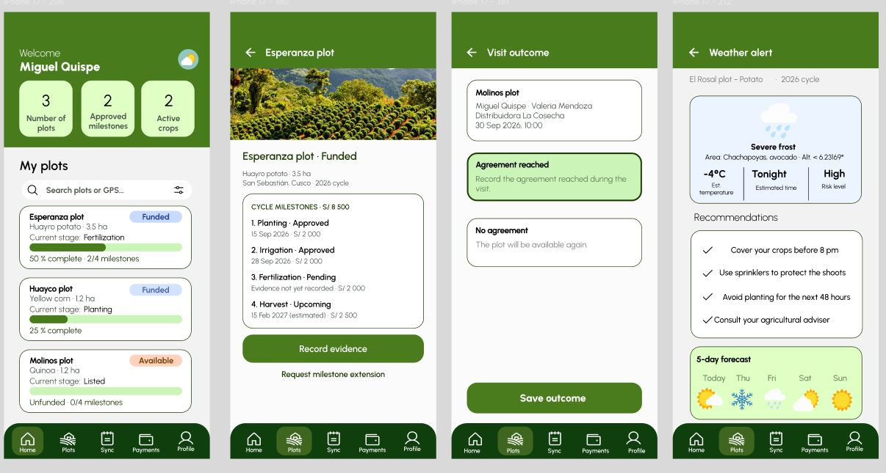

  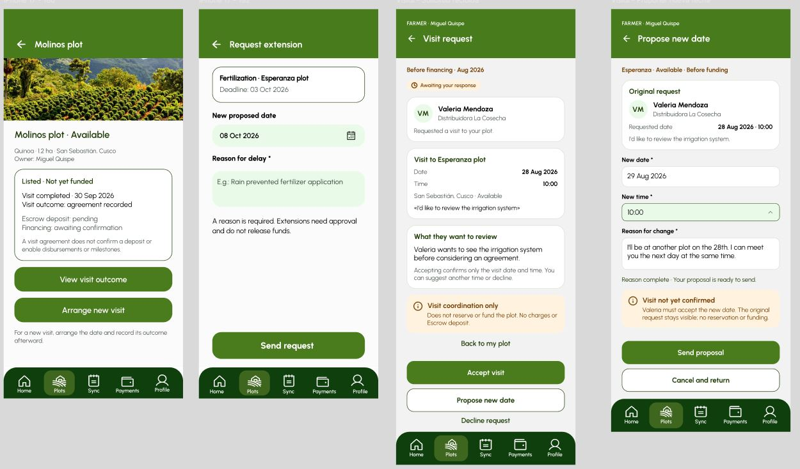

  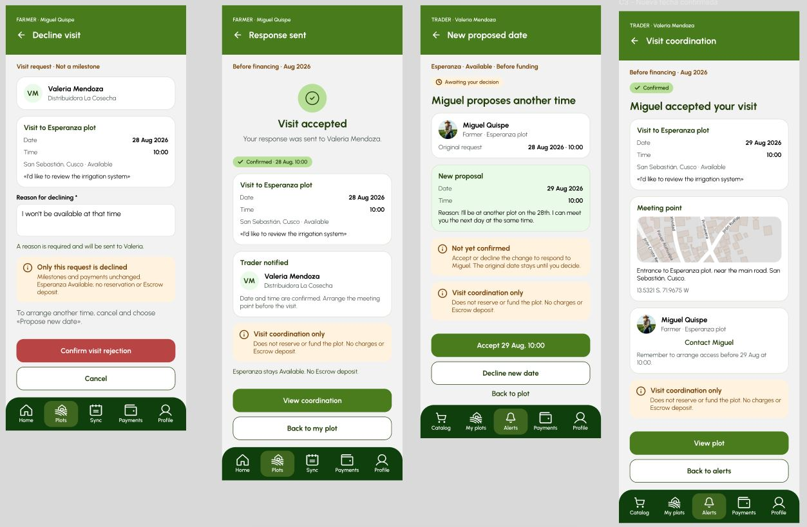

  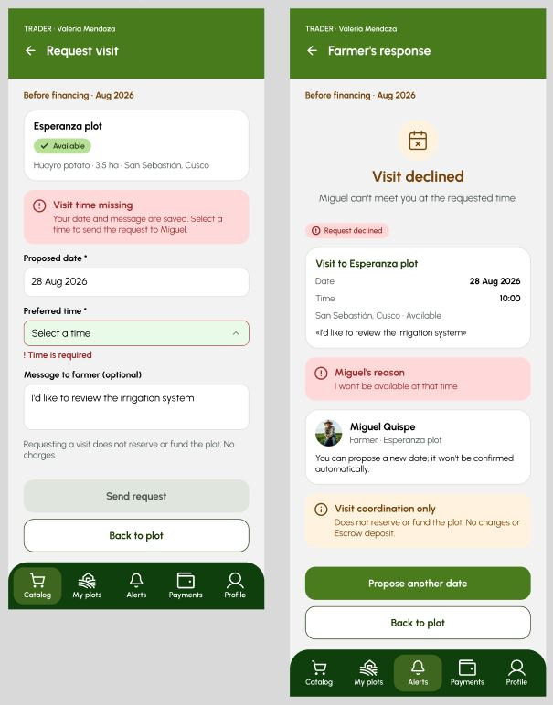

###### AGRICULTOR / Publicación de parcelas y registro de evidencias

El agricultor accede a “Mis parcelas”, donde puede buscar, filtrar, consultar alertas y crear una nueva publicación.
La publicación se realiza en tres pasos:
- Ingresa fotografías, nombre, cultivo, área y fecha estimada de cosecha.
- Registra la ubicación mediante GPS o selección manual, incluyendo región, provincia, distrito y referencias.
- Define el monto solicitado, duración del ciclo, cantidad de hitos y distribución de los desembolsos.
Antes de publicar, debe aceptar el acuerdo de financiamiento mediante Escrow. La aplicación valida campos obligatorios, ubicación y que la suma de los hitos coincida con el financiamiento solicitado.
Una vez financiada la parcela, el agricultor selecciona un hito, toma o carga fotografías, registra los insumos y cantidades utilizadas y valida el GPS. La evidencia puede guardarse sin conexión, corregirse si la ubicación es incorrecta y enviarse cuando haya Internet. Después del envío queda “en espera de revisión”; esto todavía no significa que el pago haya sido aprobado.

  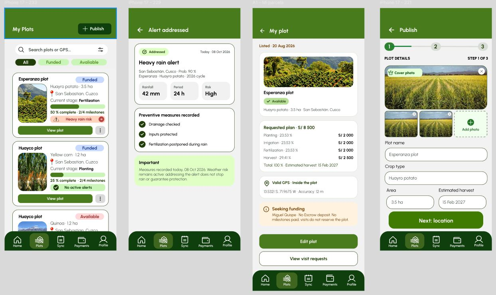

  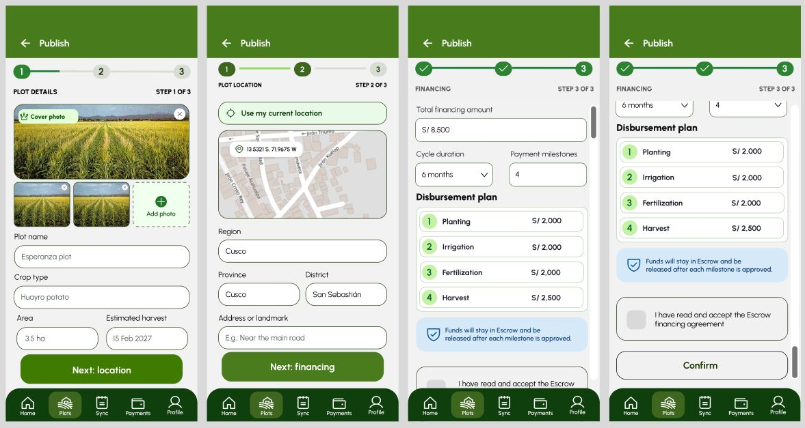

  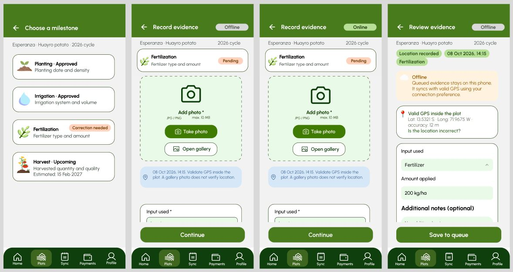

  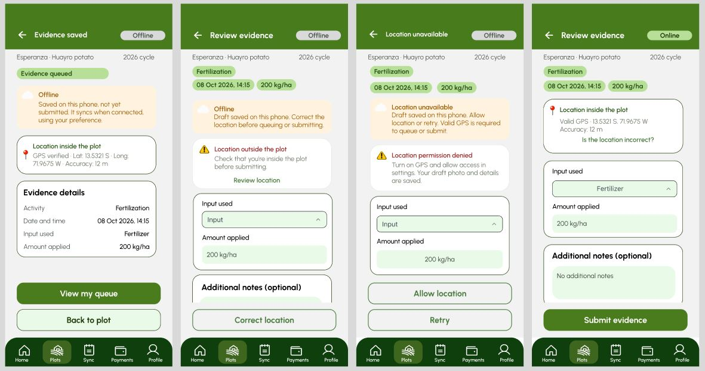

  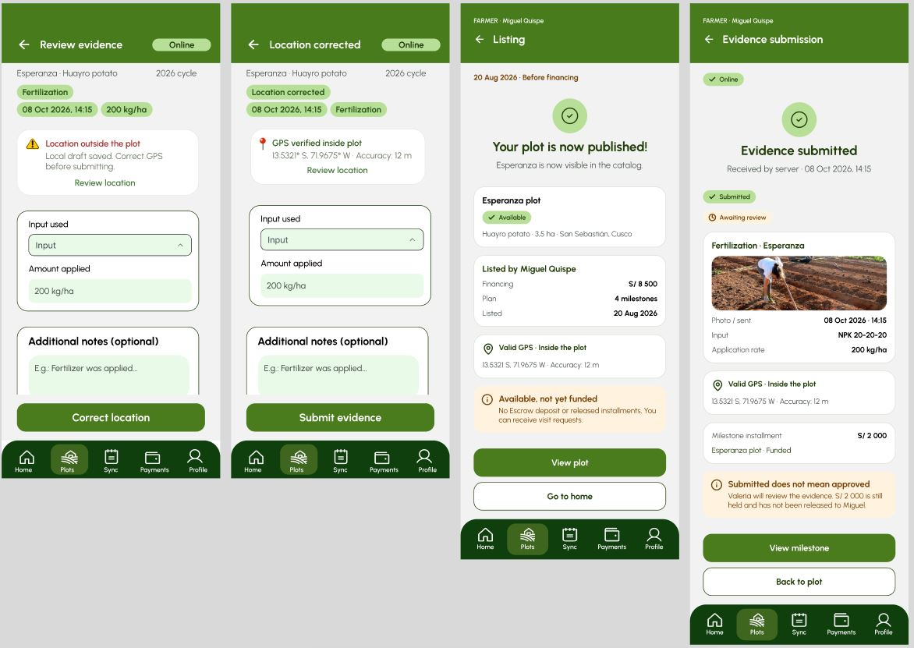

  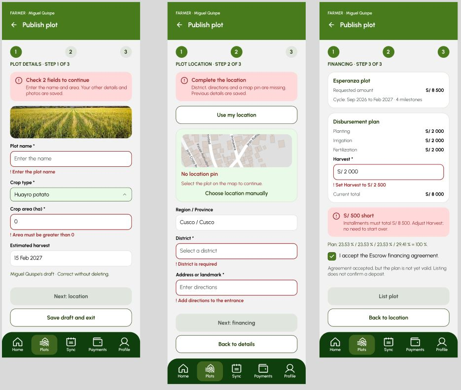

###### AGRICULTOR / Sincronización de evidencias sin conexión

El agricultor consulta una cola con todas las evidencias guardadas localmente. Cada elemento muestra parcela, hito, fotografía, fecha, ubicación y estado de sincronización.
El flujo contempla:
- Esperar una conexión disponible.
- Respetar la preferencia de “solo Wi-Fi”.
- Cargar varias evidencias cuando vuelve la conexión.
- Mostrar el porcentaje de avance.
- Distinguir entre elementos enviados y fallidos.
- Reintentar únicamente los elementos que presentaron error.
Al finalizar, la pantalla informa cuántas evidencias se enviaron y cuántas continúan pendientes. La sincronización no equivale a la aprobación del hito.

  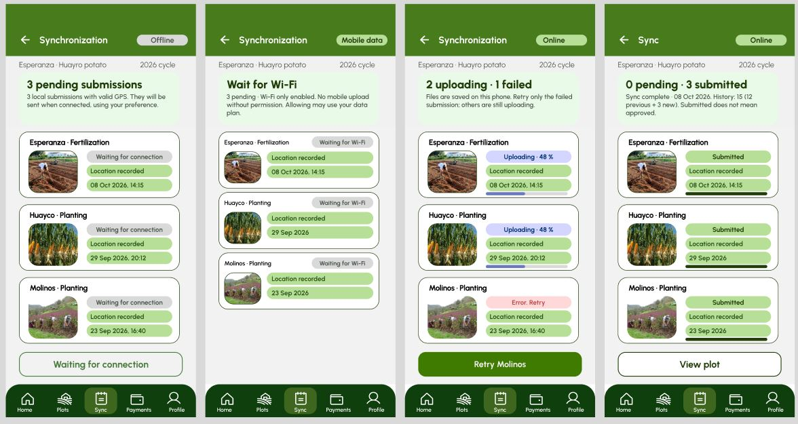

###### AGRICULTOR / Historial y detalle de pagos

El agricultor ingresa al módulo de pagos para consultar el total recibido y los desembolsos completados o pendientes. Puede filtrar el historial según su estado y abrir una transacción específica.
El detalle presenta:
- Importe recibido.
- Parcela e hito correspondiente.
- Fecha del desembolso.
- Cuenta bancaria de destino.
- Identificador de la transacción.
- Secuencia del proceso Escrow: evidencia aprobada, fondos liberados y pago recibido.
También puede descargar el comprobante en PDF. Si aún no tiene pagos, se muestra un estado vacío que explica que primero debe existir un financiamiento y una evidencia aprobada.

  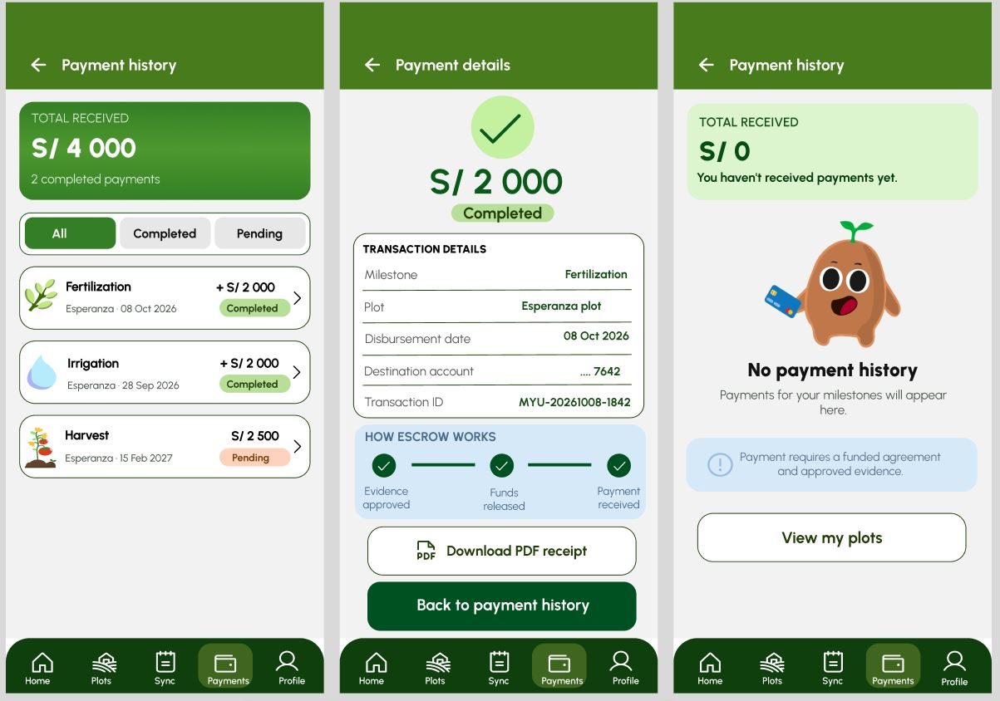

###### AGRICULTOR / Perfil, soporte, seguridad y cierre del contrato

Desde su perfil, el agricultor puede consultar y actualizar sus datos de contacto, canal de alertas climáticas, preferencia de sincronización y cuenta bancaria para recibir desembolsos.
Además, puede:
- Llamar al soporte.
- Reportar un problema, incluso sin conexión, para enviarlo posteriormente desde la cola.
- Cambiar la contraseña o el PIN.
- Recuperar la contraseña por correo.
- Confirmar su PIN de seguridad.
- Registrar una nueva contraseña cumpliendo sus reglas.
- Calificar al comerciante cuando termina el contrato.
El flujo de calificación permite seleccionar estrellas, escribir un comentario opcional y consultar la confirmación junto con el contrato finalizado.

  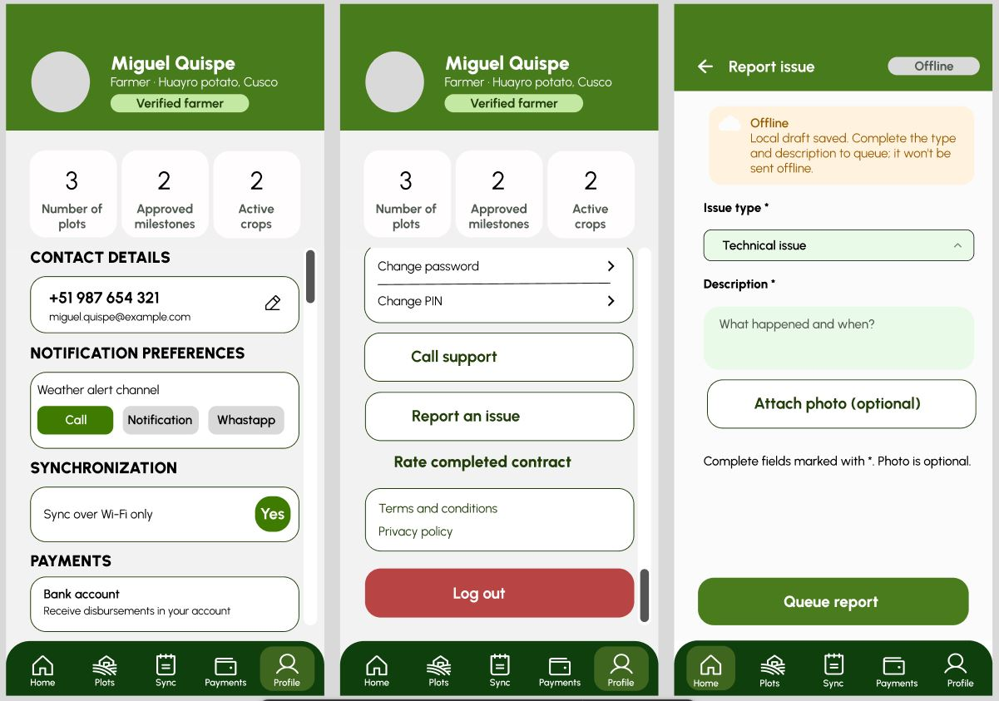

  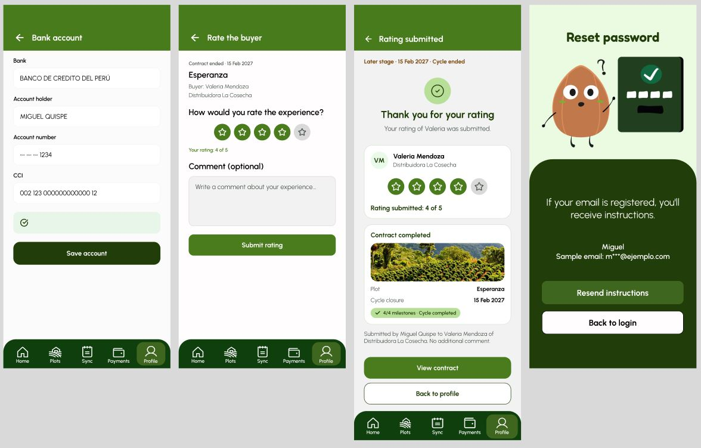

  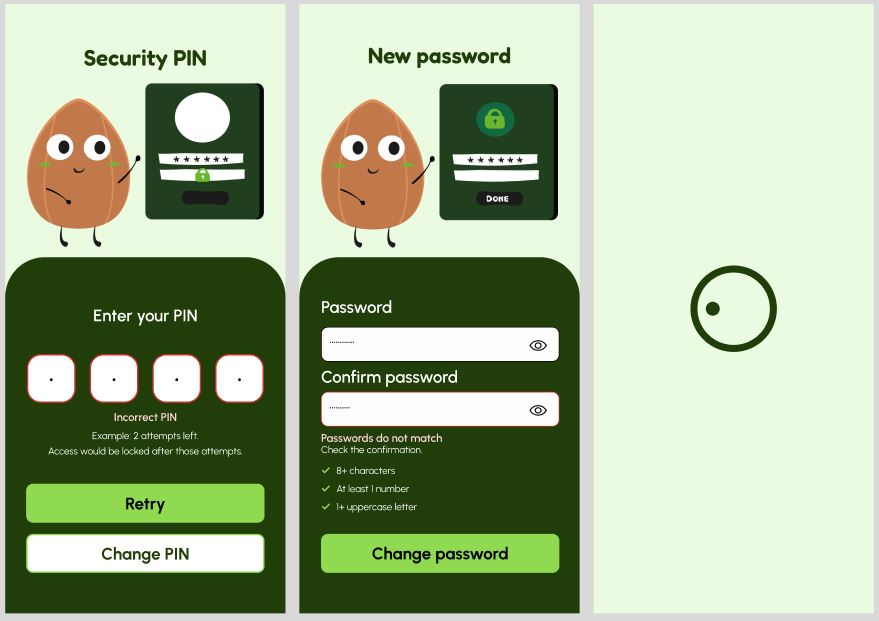

#### COMERCIANTE 
###### COMERCIANTE / Búsqueda, financiamiento y visita a parcelas

El comerciante comienza en el catálogo, donde busca cultivos o ubicaciones y utiliza filtros como cercanía o recomendaciones. Cada resultado presenta cultivo, superficie, ubicación, monto solicitado y datos del agricultor.
Al abrir una parcela puede revisar:
- Información del cultivo.
- Experiencia y reputación del agricultor.
- Ubicación verificada por GPS.
- Plan de hitos y desembolsos.
- Estado financiero cuando ya está financiada.
Para financiarla, revisa el monto, acepta las condiciones de Escrow, selecciona un medio de pago y confirma la operación. El sistema contempla financiamiento exitoso, pago no confirmado y parcela financiada previamente por otra persona, evitando duplicidades.
También puede solicitar una visita antes del financiamiento, indicando fecha, hora y mensaje. La solicitud queda pendiente hasta que el agricultor la acepte, rechace o proponga otra fecha. Cuando se confirma, aparecen el punto de encuentro y los datos de contacto.

  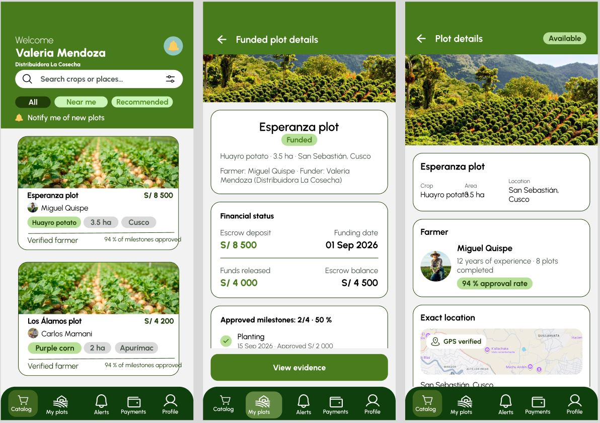

  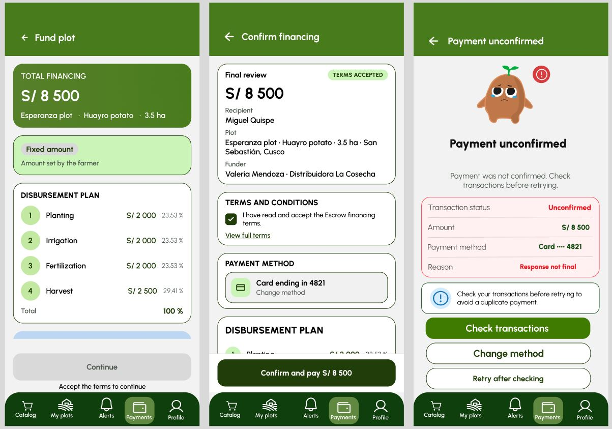

  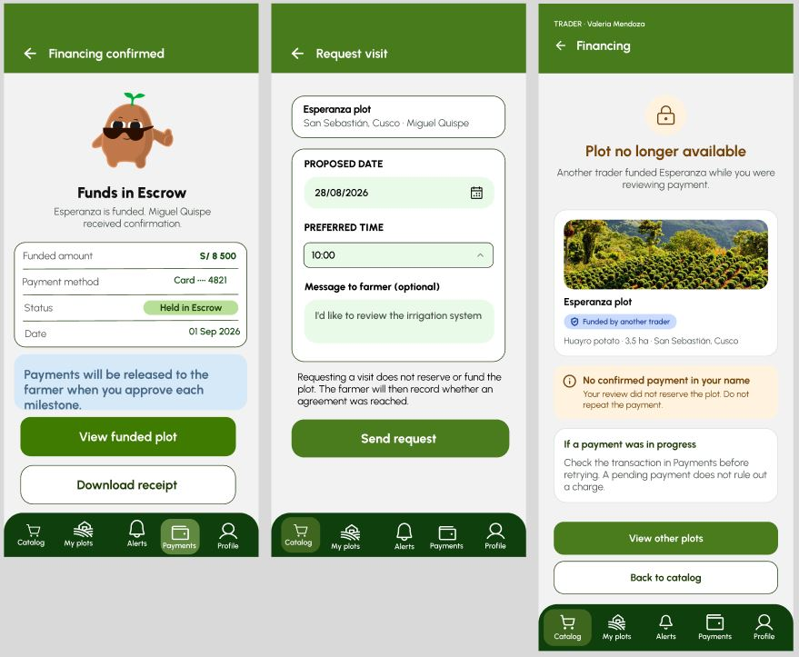

  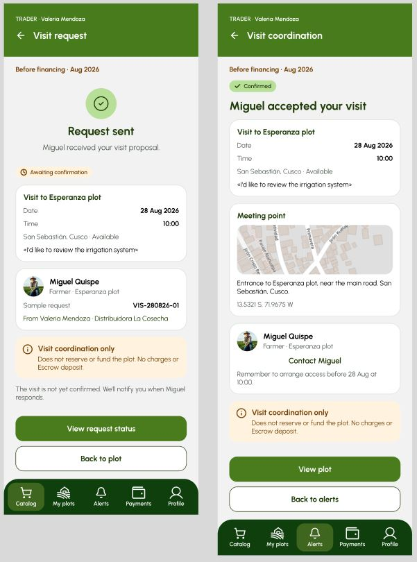

###### COMERCIANTE / Riesgo climático y revisión de evidencias

El comerciante consulta sus parcelas financiadas y las alertas meteorológicas asociadas. Cuando existe un riesgo elevado puede revisar el pronóstico, posible impacto en el cultivo, contactar al agricultor o evaluar una solicitud de prórroga.
Al recibir una evidencia de un hito, revisa:
- Fotografías.
- Fecha y hora.
- Ubicación GPS.
- Condiciones climáticas.
- Insumo y cantidad aplicada.
- Observaciones del agricultor.
- Historial de correcciones.
Después decide entre:
- Aprobar: libera exclusivamente el pago correspondiente al hito.
- Rechazar: mantiene el dinero retenido y exige seleccionar y explicar el motivo.
Si la evidencia es rechazada, el agricultor conserva el registro original, adjunta una nueva fotografía o corrige los datos y vuelve a enviarla. El comerciante recibe la nueva versión para repetir la evaluación.

  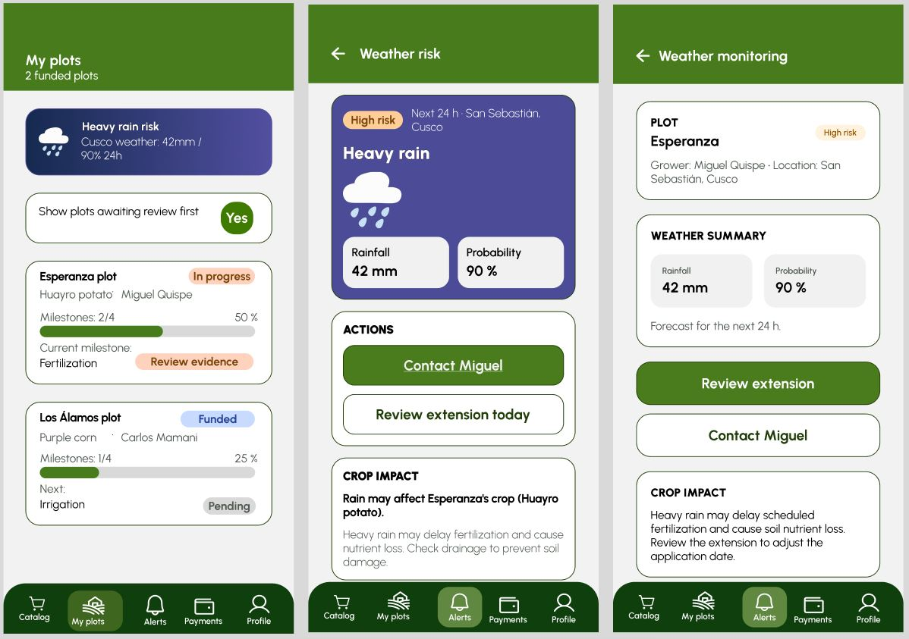

  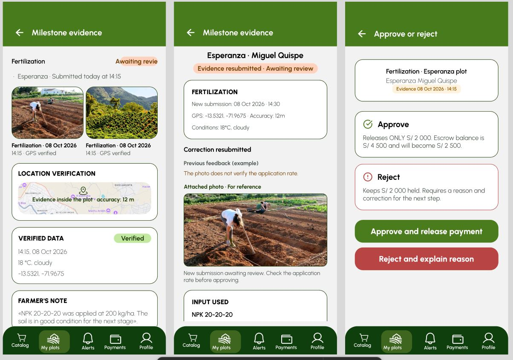

  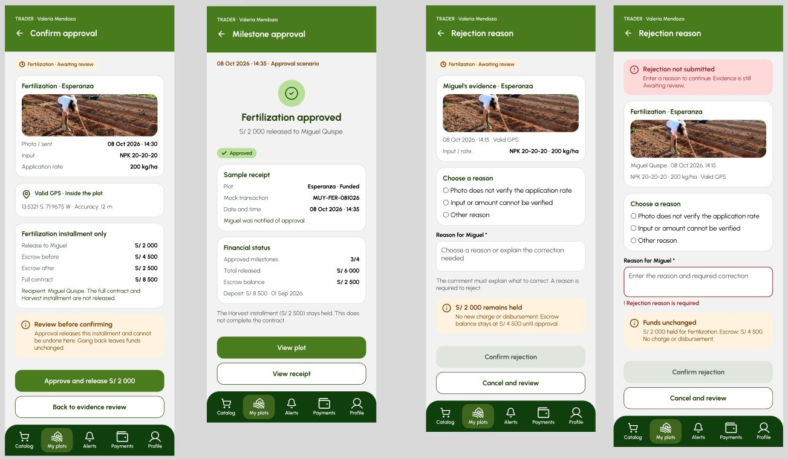

  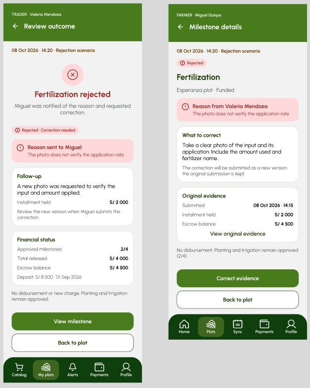

  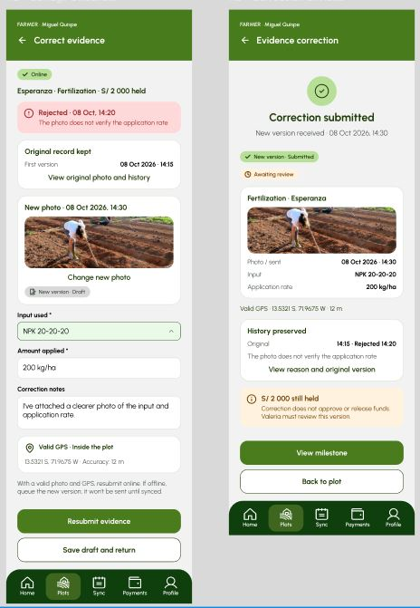

###### COMERCIANTE / Notificaciones, entrega de cosecha e incidencias

El centro de notificaciones reúne solicitudes de revisión, prórrogas, alertas climáticas y avisos de cosecha programada.
Cuando llega la fecha de entrega, el comerciante consulta:
- Producto y parcela.
- Cantidad acordada.
- Cantidad entregada.
- Calidad.
- Fecha, hora y ubicación.
- Pago final retenido en Escrow.
Si todo es correcto, confirma la recepción, aprueba el hito de cosecha y autoriza la liberación del último desembolso. Con ello se completan todos los hitos y se cierra el ciclo.
Si la cosecha no llegó o la cantidad es incompleta, puede contactar al agricultor o registrar una incidencia con tipo, descripción y fotografías. Mientras el problema no se resuelva, la aprobación final y el dinero permanecen bloqueados.

  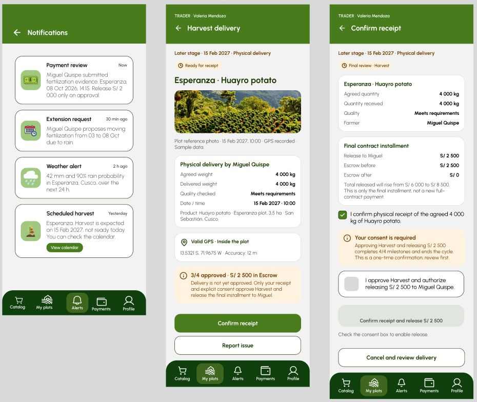

  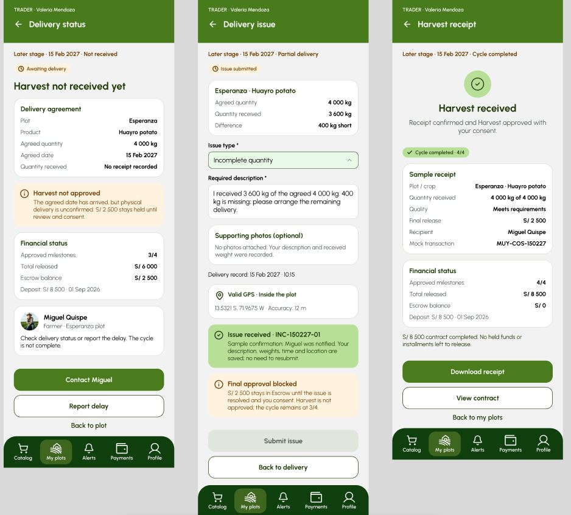

###### COMERCIANTE / Historial de desembolsos y solicitudes de prórroga

El comerciante consulta el total liberado durante el año y el historial de pagos realizados por parcela e hito. Cada registro muestra al agricultor, importe, fecha, método de transferencia y estado.
Desde una solicitud de prórroga puede comparar:
- Fecha original.
- Nueva fecha propuesta.
- Motivo indicado por el agricultor.
- Hito afectado.
El comerciante decide si aprueba o rechaza la nueva fecha. Aprobar modifica únicamente el plazo del hito: no libera dinero ni cambia el monto total del contrato.

  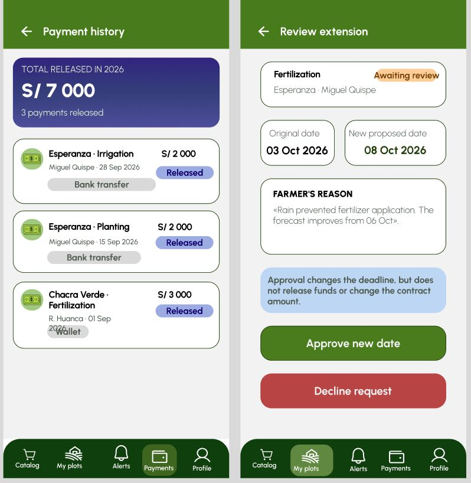

###### COMERCIANTE / Perfil, preferencias y recuperación de contraseña

Desde el perfil, el comerciante administra los datos de su empresa, contacto, preferencias de alertas meteorológicas y avisos sobre nuevas parcelas. También consulta sus métodos de pago guardados, términos legales y opciones de seguridad.
El flujo de recuperación de contraseña funciona así:
- El sistema informa que enviará instrucciones si el correo está registrado.
- El comerciante puede reenviar las instrucciones.
- Verifica su PIN de seguridad.
- Registra y confirma una nueva contraseña.
- Recibe la confirmación del cambio.
- Regresa al inicio de sesión con sus nuevas credenciales.

  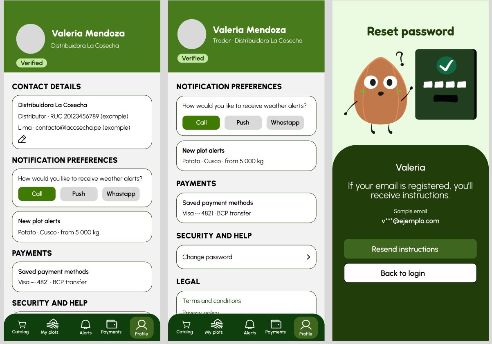

  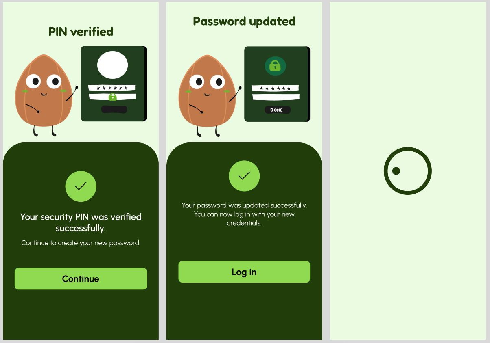

# Capítulo IV: Product Implementation & Validation

## 4.1. Software Configuration Management
### 4.1.1. Software Development Environment Configuration
### 4.1.2. Source Code Management
### 4.1.3. Source Code Style Guide & Conventions
### 4.1.4. Software Deployment Configuration

## 4.2. Landing Page & Mobile Application Implementation
### 4.2.1. Sprint 1
#### 4.2.1.1. Sprint Planning 1
#### 4.2.1.2. Aspect Leaders and Collaborators
#### 4.2.1.3. Sprint Backlog 1
#### 4.2.1.4. Development Evidence for Sprint Review
#### 4.2.1.5. Testing Suite Evidence for Sprint Review
#### 4.2.1.6. Execution Evidence for Sprint Review
#### 4.2.1.7. Services Documentation Evidence for Sprint Review
#### 4.2.1.8. Software Deployment Evidence for Sprint Review
#### 4.2.1.9. Team Collaboration Insights during Sprint
### 4.2.2. Sprint 2
#### 4.2.2.1. Sprint Planning 2
#### 4.2.2.2. Aspect Leaders and Collaborators
#### 4.2.2.3. Sprint Backlog 2
#### 4.2.2.4. Development Evidence for Sprint Review
#### 4.2.2.5. Testing Suite Evidence for Sprint Review
#### 4.2.2.6. Execution Evidence for Sprint Review
#### 4.2.2.7. Services Documentation Evidence for Sprint Review
#### 4.2.2.8. Software Deployment Evidence for Sprint Review
#### 4.2.2.9. Team Collaboration Insights during Sprint
### 4.2.3. Sprint 3
#### 4.2.3.1. Sprint Planning 3
#### 4.2.3.2. Aspect Leaders and Collaborators
#### 4.2.3.3. Sprint Backlog 3
#### 4.2.3.4. Development Evidence for Sprint Review
#### 4.2.3.5. Testing Suite Evidence for Sprint Review
#### 4.2.3.6. Execution Evidence for Sprint Review
#### 4.2.3.7. Services Documentation Evidence for Sprint Review
#### 4.2.3.8. Software Deployment Evidence for Sprint Review
#### 4.2.3.9. Team Collaboration Insights during Sprint

## 4.3. Validation Interviews
### 4.3.1. Diseño de Entrevistas
### 4.3.2. Registro de Entrevistas
### 4.3.3. Evaluaciones según heurísticas

# Conclusiones y Recomendaciones

# Video App Validation

# Video About the product

# Video About the team

# Glosario

# Bibliografía

# Anexos

