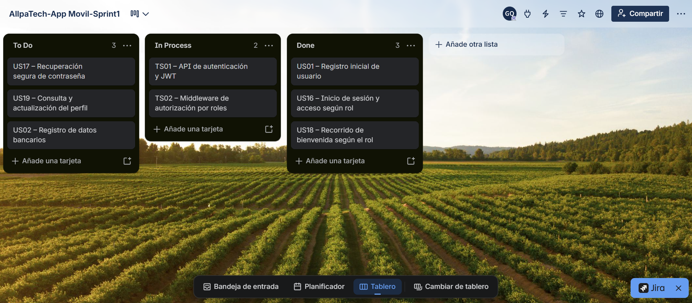
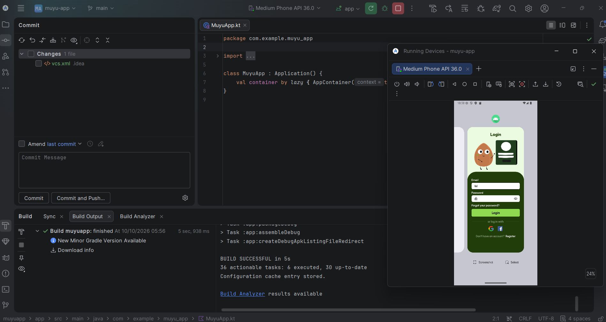
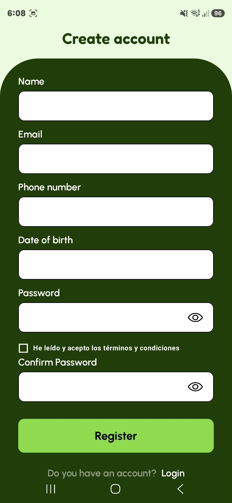
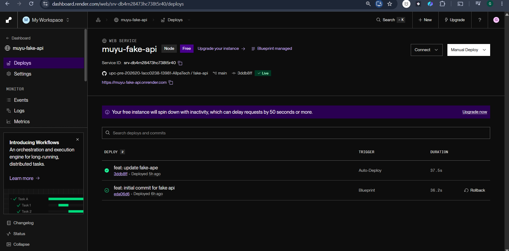
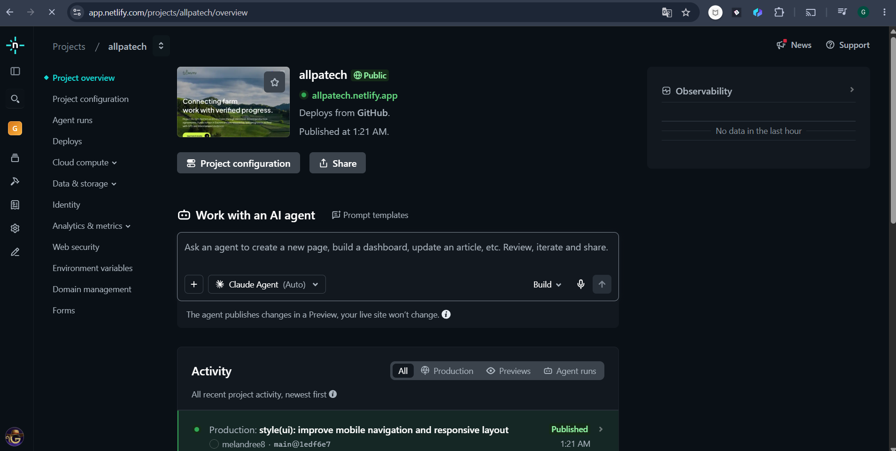

<div align="center">
    <br>
</div>
<h3 align="center"> Universidad Peruana de Ciencias Aplicadas </h3>

<h3 align="center">Carrera de [Nombre de la Carrera] </h3>

<h3 align="center">[Código del Curso] </h3>
<h3 align="center">[Nombre del Curso] </h3>
<h3 align="center"> NRC </h3>
<h3 align="center"> [Número de NRC] </h3>

<h3 align="center"> [Título del Informe / Trabajo]</h3>


<h3 align="center"> Docente</h3>
<h3 align="center"> [Nombre del Docente] </h3>


<h3 align="center"> Equipo </h3>
<h3 align="center"> [Nombre del Equipo] </h3>

<h3 align="center"> Proyecto</h3>
<h3 align="center"> [Nombre del Proyecto] </h3>

<h3 align="center"> Integrantes </h3>

<div align="center">

| Code | Member |
| :---: | :--- |
| [Código 1] | [Nombre del Integrante 1] |
| [Código 2] | [Nombre del Integrante 2] |
| [Código 3] | [Nombre del Integrante 3] |
| [Código 4] | [Nombre del Integrante 4] |
| [Código 5] | [Nombre del Integrante 5] |

</div>

<h3 align="center">Periodo [Año-Ciclo]</h3>
<h3 align="center">[Mes Año]</h3>


<div style="page-break-after: always;"></div>

## Registro de Versiones del Informe

<div align="center">

| Versión |   Fecha    |                Autor                |                                                  Descripción de modificación                                                   |
|:-------:|:----------:|:-----------------------------------:|:------------------------------------------------------------------------------------------------------------------------------:|
| [Versión] | [DD-MM-AAAA] | [Apellidos, Nombres] | [Descripción del cambio o aporte] |

</div>

## Project Report Collaboration Insights

<div align="center">

| Integrante | Tareas Asignadas |
|---|---|
| [Nombre Completo 1] | [Lista de tareas realizadas] |
| [Nombre Completo 2] | [Lista de tareas realizadas] |
| [Nombre Completo 3] | [Lista de tareas realizadas] |
| [Nombre Completo 4] | [Lista de tareas realizadas] |
| [Nombre Completo 5] | [Lista de tareas realizadas] |

</div>


El proceso de colaboración en el informe se realizó mediante commits constantes al repositorio de la organización.


# Student Outcome

<div align="center">
  <table style="width:100%; border-collapse: collapse; font-family: Arial, sans-serif; font-size: 14px;">
    <thead>
      <tr style="background-color: #f2f2f2; text-align: center;">
        <th style="border: 1px solid #dddddd; padding: 12px; width: 25%;">Criterio específico</th>
        <th style="border: 1px solid #dddddd; padding: 12px; width: 45%;">Acciones realizadas</th>
        <th style="border: 1px solid #dddddd; padding: 12px; width: 30%;">Conclusiones</th>
      </tr>
    </thead>
    <tbody>
      <tr>
        <td style="border: 1px solid #dddddd; padding: 10px; font-weight: bold; vertical-align: top;">
          Trabaja en equipo para proporcionar liderazgo en forma conjunta.
        </td>
        <td style="border: 1px solid #dddddd; padding: 10px; vertical-align: top;">
          <ul>
            <li><b>[Entrega] - [Nombre del Integrante]:</b> [Descripción de la acción realizada]</li>
          </ul>
        </td>
        <td style="border: 1px solid #dddddd; padding: 10px; vertical-align: top;">
          [Conclusión sobre el criterio]
        </td>
      </tr>
      <tr>
        <td style="border: 1px solid #dddddd; padding: 10px; font-weight: bold; vertical-align: top;">
          Crea un entorno colaborativo e inclusivo, establece metas, planifica tareas y cumple objetivos.
        </td>
        <td style="border: 1px solid #dddddd; padding: 10px; vertical-align: top;">
          <ul>
            <li><b>[Entrega] - [Nombre del Integrante]:</b> [Descripción de la acción realizada]</li>
          </ul>
        </td>
        <td style="border: 1px solid #dddddd; padding: 10px; vertical-align: top;">
          [Conclusión sobre el criterio]
        </td>
      </tr>
    </tbody>
  </table>
</div>


## Objetivos SMART


## Tabla de Contenidos

* [Capítulo I: Presentación](#capítulo-i-presentación)
  * [1.1. Startup Profile](#11-startup-profile)
    * [1.1.1. Descripción de la Startup](#111-descripción-de-la-startup)
    * [1.1.2. Perfiles de integrantes del equipo](#112-perfiles-de-integrantes-del-equipo)
  * [1.2. Solution Profile](#12-solution-profile)
    * [1.2.1. Antecedentes y problemática](#121-antecedentes-y-problemática)
    * [1.2.2. Lean UX Process](#122-lean-ux-process)
      * [1.2.2.1. Lean UX Problem Statements](#1221-lean-ux-problem-statements)
      * [1.2.2.2. Lean UX Assumptions](#1222-lean-ux-assumptions)
      * [1.2.2.3. Lean UX Hypothesis Statements](#1223-lean-ux-hypothesis-statements)
      * [1.2.2.4. Lean UX Canvas](#1224-lean-ux-canvas)
  * [1.3. Segmentos objetivo](#13-segmentos-objetivo)
* [Capítulo II: Requirements Development and Software Solution Design](#capítulo-ii-requirements-development-and-software-solution-design)
  * [2.1. Competidores](#21-competidores)
    * [2.1.1. Análisis competitivo](#211-análisis-competitivo)
    * [2.1.2. Estrategias y tácticas frente a competidores](#212-estrategias-y-tácticas-frente-a-competidores)
  * [2.2. Entrevistas](#22-entrevistas)
    * [2.2.1. Diseño de entrevistas](#221-diseño-de-entrevistas)
    * [2.2.2. Registro de entrevistas](#222-registro-de-entrevistas)
    * [2.2.3. Análisis de entrevistas](#223-análisis-de-entrevistas)
  * [2.3. Needfinding](#23-needfinding)
    * [2.3.1. User Personas](#231-user-personas)
    * [2.3.2. User Task Matrix](#232-user-task-matrix)
    * [2.3.3. User Journey Mapping](#233-user-journey-mapping)
    * [2.3.4. Empathy Mapping](#234-empathy-mapping)
    * [2.3.5. Big Picture EventStorming](#235-big-picture-eventstorming)
    * [2.3.6. Ubiquitous Language](#236-ubiquitous-language)
  * [2.4. Requirements specification](#24-requirements-specification)
    * [2.4.1. User Stories](#241-user-stories)
    * [2.4.2. Impact Mapping](#242-impact-mapping)
    * [2.4.3. Product Backlog](#243-product-backlog)
  * [2.5. Strategic-Level Domain-Driven Design](#25-strategic-level-domain-driven-design)
    * [2.5.1. EventStorming](#251-eventstorming)
      * [2.5.1.1. Candidate Context Discovery](#2511-candidate-context-discovery)
      * [2.5.1.2. Domain Message Flows Modeling](#2512-domain-message-flows-modeling)
      * [2.5.1.3. Bounded Context Canvases](#2513-bounded-context-canvases)
    * [2.5.2. Context Mapping](#252-context-mapping)
    * [2.5.3. Software Architecture](#253-software-architecture)
      * [2.5.3.1. Software Architecture Context Level Diagrams](#2531-software-architecture-context-level-diagrams)
      * [2.5.3.2. Software Architecture Container Level Diagrams](#2532-software-architecture-container-level-diagrams)
      * [2.5.3.3. Software Architecture Deployment Diagrams](#2533-software-architecture-deployment-diagrams)
  * [2.6. Tactical-Level Domain-Driven Design](#26-tactical-level-domain-driven-design)
    * [2.6.x. Bounded Context: <Bounded Context Name>](#26x-bounded-context-bounded-context-name)
      * [2.6.x.1. Domain Layer](#26x1-domain-layer)
      * [2.6.x.2. Interface Layer](#26x2-interface-layer)
      * [2.6.x.3. Application Layer](#26x3-application-layer)
      * [2.6.x.4. Infrastructure Layer](#26x4-infrastructure-layer)
      * [2.6.x.5. Bounded Context Software Architecture Component Level Diagrams](#26x5-bounded-context-software-architecture-component-level-diagrams)
      * [2.6.x.6. Bounded Context Software Architecture Code Level Diagrams](#26x6-bounded-context-software-architecture-code-level-diagrams)
        * [2.6.x.6.1. Bounded Context Domain Layer Class Diagrams](#26x61-bounded-context-domain-layer-class-diagrams)
        * [2.6.x.6.2. Bounded Context Database Design Diagram](#26x62-bounded-context-database-design-diagram)
* [Capítulo III: Solution UI/UX Design](#capítulo-iii-solution-uiux-design)
  * [3.1. Product design](#31-product-design)
    * [3.1.1. Style Guidelines](#311-style-guidelines)
      * [3.1.1.1. General Style Guidelines](#3111-general-style-guidelines)
    * [3.1.2. Information Architecture](#312-information-architecture)
      * [3.1.2.1. Organization Systems](#3121-organization-systems)
      * [3.1.2.2. Labelling Systems](#3122-labelling-systems)
      * [3.1.2.3. SEO Tags and Meta Tags](#3123-seo-tags-and-meta-tags)
      * [3.1.2.4. Searching Systems](#3124-searching-systems)
      * [3.1.2.5. Navigation Systems](#3125-navigation-systems)
    * [3.1.3. Landing Page UI Design](#313-landing-page-ui-design)
      * [3.1.3.1. Landing Page Wireframe](#3131-landing-page-wireframe)
      * [3.1.3.2. Landing Page Mock-up](#3132-landing-page-mock-up)
    * [3.1.4. Mobile Applications UX/UI Design](#314-mobile-applications-uxui-design)
      * [3.1.4.1. Mobile Applications Wireframes](#3141-mobile-applications-wireframes)
      * [3.1.4.2. Mobile Applications Wireflow Diagrams](#3142-mobile-applications-wireflow-diagrams)
      * [3.1.4.3. Mobile Applications Mock-ups](#3143-mobile-applications-mock-ups)
      * [3.1.4.4. Mobile Applications User Flow Diagrams](#3144-mobile-applications-user-flow-diagrams)
      * [3.1.4.5. Mobile Applications Prototyping](#3145-mobile-applications-prototyping)
* [Capítulo IV: Product Implementation & Validation](#capítulo-iv-product-implementation--validation)
  * [4.1. Software Configuration Management](#41-software-configuration-management)
    * [4.1.1. Software Development Environment Configuration](#411-software-development-environment-configuration)
    * [4.1.2. Source Code Management](#412-source-code-management)
    * [4.1.3. Source Code Style Guide & Conventions](#413-source-code-style-guide--conventions)
    * [4.1.4. Software Deployment Configuration](#414-software-deployment-configuration)
  * [4.2. Landing Page & Mobile Application Implementation](#42-landing-page--mobile-application-implementation)
    * [4.2.1. Sprint 1](#421-sprint-1)
      * [4.2.1.1. Sprint Planning 1](#4211-sprint-planning-1)
      * [4.2.1.2. Aspect Leaders and Collaborators](#4212-aspect-leaders-and-collaborators)
      * [4.2.1.3. Sprint Backlog 1](#4213-sprint-backlog-1)
      * [4.2.1.4. Development Evidence for Sprint Review](#4214-development-evidence-for-sprint-review)
      * [4.2.1.5. Testing Suite Evidence for Sprint Review](#4215-testing-suite-evidence-for-sprint-review)
      * [4.2.1.6. Execution Evidence for Sprint Review](#4216-execution-evidence-for-sprint-review)
      * [4.2.1.7. Services Documentation Evidence for Sprint Review](#4217-services-documentation-evidence-for-sprint-review)
      * [4.2.1.8. Software Deployment Evidence for Sprint Review](#4218-software-deployment-evidence-for-sprint-review)
      * [4.2.1.9. Team Collaboration Insights during Sprint](#4219-team-collaboration-insights-during-sprint)
    * [4.2.2. Sprint 2](#422-sprint-2)
      * [4.2.2.1. Sprint Planning 2](#4221-sprint-planning-2)
      * [4.2.2.2. Aspect Leaders and Collaborators](#4222-aspect-leaders-and-collaborators)
      * [4.2.2.3. Sprint Backlog 2](#4223-sprint-backlog-2)
      * [4.2.2.4. Development Evidence for Sprint Review](#4224-development-evidence-for-sprint-review)
      * [4.2.2.5. Testing Suite Evidence for Sprint Review](#4225-testing-suite-evidence-for-sprint-review)
      * [4.2.2.6. Execution Evidence for Sprint Review](#4226-execution-evidence-for-sprint-review)
      * [4.2.2.7. Services Documentation Evidence for Sprint Review](#4227-services-documentation-evidence-for-sprint-review)
      * [4.2.2.8. Software Deployment Evidence for Sprint Review](#4228-software-deployment-evidence-for-sprint-review)
      * [4.2.2.9. Team Collaboration Insights during Sprint](#4229-team-collaboration-insights-during-sprint)
    * [4.2.3. Sprint 3](#423-sprint-3)
      * [4.2.3.1. Sprint Planning 3](#4231-sprint-planning-3)
      * [4.2.3.2. Aspect Leaders and Collaborators](#4232-aspect-leaders-and-collaborators)
      * [4.2.3.3. Sprint Backlog 3](#4233-sprint-backlog-3)
      * [4.2.3.4. Development Evidence for Sprint Review](#4234-development-evidence-for-sprint-review)
      * [4.2.3.5. Testing Suite Evidence for Sprint Review](#4235-testing-suite-evidence-for-sprint-review)
      * [4.2.3.6. Execution Evidence for Sprint Review](#4236-execution-evidence-for-sprint-review)
      * [4.2.3.7. Services Documentation Evidence for Sprint Review](#4237-services-documentation-evidence-for-sprint-review)
      * [4.2.3.8. Software Deployment Evidence for Sprint Review](#4238-software-deployment-evidence-for-sprint-review)
      * [4.2.3.9. Team Collaboration Insights during Sprint](#4239-team-collaboration-insights-during-sprint)
  * [4.3. Validation Interviews](#43-validation-interviews)
    * [4.3.1. Diseño de Entrevistas](#431-diseño-de-entrevistas)
    * [4.3.2. Registro de Entrevistas](#432-registro-de-entrevistas)
    * [4.3.3. Evaluaciones según heurísticas](#433-evaluaciones-según-heurísticas)
* [Conclusiones y Recomendaciones](#conclusiones-y-recomendaciones)
* [Video App Validation](#video-app-validation)
* [Video About the product](#video-about-the-product)
* [Video About the team](#video-about-the-team)
* [Glosario](#glosario)
* [Bibliografía](#bibliografía)
* [Anexos](#anexos)


# Capítulo I: Presentación

## 1.1. Startup Profile
### 1.1.1. Descripción de la Startup
### 1.1.2. Perfiles de integrantes del equipo

## 1.2. Solution Profile
### 1.2.1. Antecedentes y problemática
### 1.2.2. Lean UX Process
#### 1.2.2.1. Lean UX Problem Statements
#### 1.2.2.2. Lean UX Assumptions
#### 1.2.2.3. Lean UX Hypothesis Statements
#### 1.2.2.4. Lean UX Canvas

## 1.3. Segmentos objetivo


# Capítulo II: Requirements Development and Software Solution Design

## 2.1. Competidores
### 2.1.1. Análisis competitivo
### 2.1.2. Estrategias y tácticas frente a competidores

## 2.2. Entrevistas
### 2.2.1. Diseño de entrevistas
### 2.2.2. Registro de entrevistas
### 2.2.3. Análisis de entrevistas

## 2.3. Needfinding
### 2.3.1. User Personas
### 2.3.2. User Task Matrix
### 2.3.3. User Journey Mapping
### 2.3.4. Empathy Mapping
### 2.3.5. Big Picture EventStorming
### 2.3.6. Ubiquitous Language

## 2.4. Requirements specification
### 2.4.1. User Stories
### 2.4.2. Impact Mapping
### 2.4.3. Product Backlog

## 2.5. Strategic-Level Domain-Driven Design
### 2.5.1. EventStorming
#### 2.5.1.1. Candidate Context Discovery
#### 2.5.1.2. Domain Message Flows Modeling
#### 2.5.1.3. Bounded Context Canvases
### 2.5.2. Context Mapping
### 2.5.3. Software Architecture
#### 2.5.3.1. Software Architecture Context Level Diagrams
#### 2.5.3.2. Software Architecture Container Level Diagrams
#### 2.5.3.3. Software Architecture Deployment Diagrams

## 2.6. Tactical-Level Domain-Driven Design
### 2.6.x. Bounded Context: <Bounded Context Name>
#### 2.6.x.1. Domain Layer
#### 2.6.x.2. Interface Layer
#### 2.6.x.3. Application Layer
#### 2.6.x.4. Infrastructure Layer
#### 2.6.x.5. Bounded Context Software Architecture Component Level Diagrams
#### 2.6.x.6. Bounded Context Software Architecture Code Level Diagrams
##### 2.6.x.6.1. Bounded Context Domain Layer Class Diagrams
##### 2.6.x.6.2. Bounded Context Database Design Diagram


# Capítulo III: Solution UI/UX Design

## 3.1. Product design
### 3.1.1. Style Guidelines
#### 3.1.1.1. General Style Guidelines
### 3.1.2. Information Architecture
#### 3.1.2.1. Organization Systems
#### 3.1.2.2. Labelling Systems
#### 3.1.2.3. SEO Tags and Meta Tags
#### 3.1.2.4. Searching Systems
#### 3.1.2.5. Navigation Systems
### 3.1.3. Landing Page UI Design
#### 3.1.3.1. Landing Page Wireframe
#### 3.1.3.2. Landing Page Mock-up
### 3.1.4. Mobile Applications UX/UI Design
#### 3.1.4.1. Mobile Applications Wireframes
#### 3.1.4.2. Mobile Applications Wireflow Diagrams
#### 3.1.4.3. Mobile Applications Mock-ups
#### 3.1.4.4. Mobile Applications User Flow Diagrams
#### 3.1.4.5. Mobile Applications Prototyping

# Capítulo IV: Product Implementation & Validation

## 4.1. Software Configuration Management

La gestión de configuración de software de Muyu comprende las herramientas, convenciones, repositorios y mecanismos de despliegue empleados durante el desarrollo de los tres componentes principales de la solución: la Landing Page, la aplicación móvil Android y el backend.
Esta gestión permite mantener la trazabilidad de los cambios, facilitar el trabajo colaborativo y asegurar que cada componente pueda construirse, probarse y desplegarse de manera controlada.

### 4.1.1. Software Development Environment Configuration

Para el desarrollo de Muyu se estableció un entorno compuesto por herramientas especializadas para la implementación de la Landing Page, la aplicación móvil Android y el backend. También se utilizaron plataformas de diseño, documentación, control de versiones y despliegue que apoyan las diferentes etapas del ciclo de vida del producto.

| Proceso | Recurso o plataforma | Finalidad dentro del proyecto | Medio de acceso |
|---|---|---|---|
| Gestión de requisitos | GitHub Markdown | Documentar las historias de usuario, criterios de aceptación, arquitectura y avances | [GitHub](https://github.com/) |
| Criterios de aceptación | Gherkin | Definir escenarios funcionales mediante la estructura `Given-When-Then` | [Gherkin](https://cucumber.io/docs/gherkin/) |
| Diseño UX/UI | Figma | Elaborar wireframes, wireflows, mock-ups, prototipos y recursos visuales | [Figma](https://www.figma.com/) |
| Desarrollo de la Landing Page | Visual Studio Code | Implementar la interfaz web mediante HTML5, CSS3 y JavaScript | [Visual Studio Code](https://code.visualstudio.com/) |
| Desarrollo móvil | Android Studio | Implementar, compilar, ejecutar y depurar la aplicación Android | [Android Studio](https://developer.android.com/studio) |
| Lenguaje de desarrollo móvil | Kotlin | Implementar la lógica, navegación y componentes de la aplicación | [Kotlin](https://kotlinlang.org/) |
| Interfaz móvil | Jetpack Compose | Construir interfaces declarativas y reutilizables | [Jetpack Compose](https://developer.android.com/compose) |
| Compilación móvil | Gradle | Administrar dependencias y compilar el proyecto Android | [Gradle](https://gradle.org/) |
| Pruebas móviles | Android Emulator | Ejecutar y validar la aplicación en dispositivos Android virtuales | [Android Emulator](https://developer.android.com/studio/run/emulator) |
| Desarrollo del backend | .NET SDK 8.0.302 | Compilar y ejecutar la API modular de Muyu | [.NET](https://dotnet.microsoft.com/) |
| Lenguaje del backend | C# | Implementar las reglas de negocio, casos de uso, endpoints y persistencia | [C#](https://learn.microsoft.com/dotnet/csharp/) |
| Framework del backend | ASP.NET Core 8 | Exponer los servicios REST utilizados por la aplicación móvil | [ASP.NET Core](https://learn.microsoft.com/aspnet/core/) |
| Persistencia | SQLite y Entity Framework Core | Almacenar usuarios, parcelas, acuerdos, fondos, hitos y evidencias | [Entity Framework Core](https://learn.microsoft.com/ef/core/) |
| Documentación de la API | Swagger/OpenAPI | Documentar y probar los endpoints REST del backend | [Swagger](https://swagger.io/) |
| Administración de versiones | Git | Registrar cambios y conservar el historial de cada componente | [Git](https://git-scm.com/) |
| Repositorios remotos | GitHub | Almacenar el código fuente y facilitar la colaboración | [GitHub](https://github.com/) |
| Contenedorización | Docker | Crear una imagen reproducible del backend | [Docker](https://www.docker.com/) |
| Despliegue del backend | Railway | Construir y publicar la API a partir de su repositorio | [Railway](https://railway.app/) |
| Despliegue web | Netlify | Publicar la Landing Page y actualizarla desde GitHub | [Netlify](https://www.netlify.com/) |
| Modelado | PlantUML | Representar la arquitectura, componentes y modelo del dominio | [PlantUML](https://plantuml.com/) |

#### Configuración de la Landing Page

La Landing Page está implementada como un sitio web estático mediante HTML5, CSS3 y JavaScript. Su estructura principal es:

```text
landing-muyu/
├── assets/
├── index.html
├── styles.css
└── script.js
```

El archivo `index.html` contiene la estructura semántica y las secciones informativas del producto. `styles.css` concentra la presentación visual, el diseño responsive y los estilos de los componentes. Finalmente, `script.js` implementa la navegación móvil, los acordeones, el cambio de idioma y las demás interacciones de la página.

#### Configuración de la aplicación móvil

La aplicación móvil se desarrolla en Android Studio mediante Kotlin y Jetpack Compose. El código se organiza por funcionalidades asociadas con las capacidades principales del dominio de Muyu.

```text
app/src/main/
├── assets/
├── java/com.example.muyu_app/
│   ├── core/
│   ├── features/
│   │   ├── climate_monitoring/
│   │   ├── escrow_custody/
│   │   ├── labor_execution/
│   │   ├── plot_approval/
│   │   ├── plot_financing/
│   │   └── user_management/
│   ├── navigation/
│   │   └── AppNavHost.kt
│   ├── ui/
│   ├── MainActivity.kt
│   └── MuyuApp.kt
├── res/
└── AndroidManifest.xml
```

`MainActivity.kt` funciona como punto de entrada de la aplicación, `MuyuApp.kt` contiene la composición general y `AppNavHost.kt` administra la navegación.

La aplicación presenta interfaces diferenciadas para los dos segmentos objetivo. Los agricultores pueden publicar parcelas, consultar tareas, registrar evidencias y revisar sus pagos. Los comerciantes pueden buscar parcelas, financiar acuerdos, revisar evidencias y aprobar o rechazar hitos.

Durante el desarrollo, la aplicación se ejecuta mediante Android Emulator para verificar la navegación, las pantallas de Jetpack Compose y su adaptación a dispositivos móviles.

#### Configuración del backend

El backend está desarrollado como un monolito modular con .NET 8, ASP.NET Core y C#. Su arquitectura aplica Domain-Driven Design, CQRS y separación por bounded contexts.

```text
Muyu/
├── src/
│   ├── Host/
│   │   └── Muyu.API/
│   ├── BoundedContexts/
│   │   ├── Agreements/
│   │   ├── ClimateAlerts/
│   │   ├── Escrow/
│   │   ├── IAM/
│   │   ├── ParcelManagement/
│   │   └── Tracking/
│   └── BuildingBlocks/
│       └── Muyu.Shared/
├── Dockerfile
├── Directory.Build.props
├── global.json
└── Muyu.sln
```

Cada bounded context se divide en:

```text
Domain/
Application/
Infrastructure/
Presentation/
```

La capa `Domain` contiene las entidades, agregados, objetos de valor y eventos del negocio. `Application` define comandos, consultas, handlers y puertos. `Infrastructure` implementa la persistencia y las integraciones externas. `Presentation` expone las operaciones mediante controladores REST.

Para ejecutar el backend localmente se utilizan los siguientes comandos:

```powershell
dotnet restore Muyu.sln
dotnet run --project src/Host/Muyu.API/Muyu.API.csproj
```

En el entorno de desarrollo, Swagger está disponible en la ruta `/swagger`.

---

### 4.1.2. Source Code Management

El código fuente de Muyu se administra mediante Git y GitHub. La Landing Page, la aplicación móvil y el backend se mantienen como proyectos independientes debido a que utilizan tecnologías y procesos de despliegue diferentes.

| Componente | Repositorio |
|---|---|
| Landing Page | [Landing-page](https://github.com/upc-pre-202620-1acc0238-13981-AllpaTech/Landing-page) |
| Backend | [muyu-backend](https://github.com/upc-pre-202620-1acc0238-13981-AllpaTech/muyu-backend) |
| Aplicación móvil | Repositorio del proyecto `muyu-app` |

La rama `main` contiene la versión estable de cada componente. Para organizar el trabajo se considera la siguiente estructura de ramas:

- `main`: versión estable y preparada para demostración o despliegue.
- `develop`: integración de los avances de la siguiente versión.
- `feature/<nombre>`: implementación de una nueva funcionalidad.
- `fix/<nombre>`: corrección de un defecto.
- `docs/<nombre>`: actualización de la documentación.
- `refactor/<nombre>`: reorganización interna del código.

El flujo general de trabajo es:

```text
Creación de una rama
        ↓
Implementación de la funcionalidad
        ↓
Validación local
        ↓
Registro de commits
        ↓
Publicación de la rama
        ↓
Creación y revisión de Pull Request
        ↓
Integración en develop o main
```

Los mensajes de commit siguen Conventional Commits:

```text
<tipo>(<alcance opcional>): <descripción breve>
```

Los tipos utilizados son:

- `feat`: incorporación de una funcionalidad.
- `fix`: corrección de un error.
- `docs`: actualización de documentación.
- `style`: cambios de formato.
- `refactor`: reorganización interna del código.
- `test`: creación o actualización de pruebas.
- `chore`: tareas de mantenimiento.
- `build`: cambios relacionados con la compilación.
- `ci`: cambios de integración o despliegue continuo.

Ejemplos:

```text
feat(mobile): add merchant milestone review screen
feat(api): add parcel approval endpoint
fix(landing): correct mobile navigation behavior
docs(report): document deployment configuration
refactor(iam): separate authentication command handler
```

Antes de integrar una rama se comprueba que:

- El componente compile o cargue correctamente.
- La funcionalidad cumpla sus criterios de aceptación.
- No se incluyan contraseñas, API keys ni secretos.
- Los cambios no interrumpan funcionalidades existentes.
- Los commits expliquen claramente los cambios.
- La Pull Request se relacione con una tarea o historia de usuario.


---

### 4.1.3. Source Code Style Guide & Conventions

Con la finalidad de mantener un código legible, consistente y escalable, se establecieron convenciones para HTML, CSS, JavaScript, Kotlin y C#. Los identificadores técnicos se redactan en inglés y deben expresar claramente su propósito.

#### HTML Conventions

- Utilizar HTML5 semántico.
- Emplear `<header>`, `<nav>`, `<main>`, `<section>` y `<footer>`.
- Escribir etiquetas y atributos en minúsculas.
- Mantener una indentación uniforme.
- Incluir el atributo `alt` en las imágenes.
- Utilizar botones para acciones y enlaces para navegación.
- Incorporar atributos ARIA para mejorar la accesibilidad.
- Evitar estilos y scripts inline.
- Declarar `lang`, `charset` y `viewport`.

```html
<section class="features" id="features">
  <h2>Verified agricultural progress</h2>
  <button
    class="accordion-trigger"
    type="button"
    aria-expanded="false">
    GPS evidence
  </button>
</section>
```

#### CSS Conventions

- Utilizar nombres de clases en `kebab-case`.
- Aplicar una estructura inspirada en BEM.
- Centralizar colores y medidas mediante variables CSS.
- Aplicar un diseño responsive y mobile-first.
- Evitar selectores excesivamente específicos.
- Organizar los estilos por componentes.
- Mantener separados el contenido y su presentación.

```css
:root {
  --color-primary: #12563e;
  --color-secondary: #64748b;
}

.accordion-item {
  border-bottom: 1px solid var(--color-secondary);
}

.accordion-item--active {
  color: var(--color-primary);
}
```

#### JavaScript Conventions

- Utilizar `camelCase` para variables y funciones.
- Utilizar `PascalCase` para clases.
- Priorizar `const` y utilizar `let` cuando el valor deba cambiar.
- Evitar el uso de `var`.
- Mantener activado el modo estricto.
- Registrar eventos mediante `addEventListener`.
- Comprobar la existencia de los elementos antes de manipularlos.
- Mantener sincronizados los estados visuales y de accesibilidad.

```javascript
const navToggle = document.querySelector(".nav-toggle");
const headerNav = document.querySelector(".header-nav");

navToggle?.addEventListener("click", () => {
  const isOpen = headerNav.classList.toggle("nav-open");
  navToggle.setAttribute("aria-expanded", String(isOpen));
});
```

#### Kotlin and Jetpack Compose Conventions

- Utilizar `PascalCase` para clases, interfaces y composables.
- Utilizar `camelCase` para variables, parámetros y funciones.
- Utilizar `UPPER_SNAKE_CASE` para constantes.
- Mantener los paquetes en minúsculas.
- Agrupar el código por funcionalidad.
- Utilizar los sufijos `Screen`, `ViewModel` y `Repository`.
- Mantener los composables pequeños y reutilizables.
- Separar las reglas de negocio de la interfaz.
- Pasar eventos mediante funciones lambda.
- Recibir `Modifier` como parámetro.
- Centralizar textos, colores y dimensiones.
- Administrar la navegación mediante `NavHost`.

```kotlin
@Composable
fun MerchantApproveRejectScreen(
    onApprove: () -> Unit,
    onReject: () -> Unit,
    modifier: Modifier = Modifier
) {
    Column(modifier = modifier.fillMaxSize()) {
        MerchantEvidenceContent(
            onApprove = onApprove,
            onReject = onReject
        )
    }
}
```

#### C# and .NET Conventions

- Utilizar `PascalCase` para clases, interfaces, métodos y propiedades.
- Utilizar `camelCase` para parámetros y variables locales.
- Anteponer `I` a las interfaces.
- Mantener habilitadas las referencias anulables.
- Utilizar `async` y `await`.
- Incorporar `CancellationToken`.
- Utilizar clases `sealed` cuando no se requiera herencia.
- Utilizar `record` para contratos y eventos inmutables.
- Aplicar inyección de dependencias.
- Evitar reglas de negocio dentro de los controladores.
- Mantener el dominio independiente de ASP.NET Core y Entity Framework Core.
- Separar comandos y consultas mediante CQRS.
- Relacionar bounded contexts mediante identificadores.

```csharp
public sealed class LoginCommandHandler(
    IUserRepository userRepository,
    IJwtProvider jwtProvider)
{
    public async Task<LoginResponse?> HandleAsync(
        LoginCommand command,
        CancellationToken cancellationToken = default)
    {
        var user = await userRepository.GetByEmailAsync(
            command.Email,
            cancellationToken);

        return user is null
            ? null
            : jwtProvider.CreateResponse(user);
    }
}
```

#### Gherkin Conventions

- Utilizar la estructura `Given-When-Then`.
- Describir un comportamiento verificable por escenario.
- Redactar desde la perspectiva del usuario.
- Evitar detalles técnicos innecesarios.
- Relacionar cada escenario con una historia de usuario.

```gherkin
Feature: Merchant milestone review

  Scenario: Approve valid milestone evidence
    Given the merchant has an active financed agreement
    And the farmer submitted evidence with date and GPS location
    When the merchant approves the milestone
    Then the corresponding milestone payment is released
    And the evidence status changes to approved
```

De manera transversal se aplican los siguientes principios:

- **Readability:** código fácil de comprender.
- **Consistency:** convenciones uniformes.
- **Single Responsibility:** una responsabilidad por componente.
- **Modularity:** funcionalidades separadas.
- **Maintainability:** facilidad para modificar el sistema.
- **Scalability:** capacidad para incorporar nuevas funcionalidades.
- **Accessibility:** interfaces comprensibles y accesibles.
- **Security:** secretos administrados fuera del repositorio.

---

### 4.1.4. Software Deployment Configuration

El despliegue de Muyu se gestiona independientemente para la Landing Page, el backend y la aplicación móvil, debido a que cada componente utiliza tecnologías y mecanismos de distribución diferentes.

#### Landing Page Deployment

La Landing Page de Muyu es un sitio web estático desarrollado con HTML5, CSS3 y JavaScript. Su despliegue se realiza mediante Netlify, plataforma que permite publicar el sitio y actualizarlo desde su repositorio de GitHub.

El código fuente se encuentra en:

[Landing Page de Muyu](https://github.com/upc-pre-202620-1acc0238-13981-AllpaTech/Landing-page)

La estructura utilizada para el despliegue es:

```text
landing-muyu/
├── assets/
├── index.html
├── styles.css
└── script.js
```

El proceso de despliegue mediante Netlify es:

1. Registrar los cambios mediante Git.
2. Enviar los commits a la rama `main` de GitHub.
3. Ingresar al panel de administración de Netlify.
4. Seleccionar la opción para importar un proyecto existente.
5. Conectar Netlify con GitHub.
6. Seleccionar el repositorio de la Landing Page.
7. Configurar `main` como rama de producción.
8. Establecer como directorio de publicación la ubicación de `index.html`.
9. Iniciar el despliegue.
10. Verificar el sitio mediante el dominio generado por Netlify.

Debido a que la Landing Page utiliza HTML, CSS y JavaScript sin un framework, no necesita un comando de construcción.

| Configuración | Valor |
|---|---|
| Plataforma | Netlify |
| Repositorio | GitHub |
| Rama de producción | `main` |
| Build command | No requerido |
| Publish directory | Directorio que contiene `index.html` |
| Tipo de despliegue | Sitio web estático |
| Actualización | Automática después de cambios en `main` |

El flujo de publicación es:

```text
Cambios en la Landing Page
        ↓
Commit mediante Git
        ↓
Push a la rama main
        ↓
Netlify detecta los cambios
        ↓
Publicación automática
        ↓
Landing Page actualizada
```

La dirección pública generada mantiene una estructura semejante a:

```text
https://<nombre-del-sitio>.netlify.app/
```

Antes de finalizar un despliegue se verifica:

- La carga de la página principal.
- La visualización de imágenes.
- Los enlaces de navegación.
- El menú móvil.
- Los acordeones.
- El cambio de idioma.
- El diseño responsive.
- La ausencia de errores en la consola.
- El funcionamiento mediante HTTPS.

#### Backend Deployment

El backend se encuentra preparado para desplegarse en Railway mediante Docker. El `Dockerfile` utiliza el SDK de .NET 8 para compilar la solución y ASP.NET Core Runtime 8 para ejecutar la API.

```text
Repositorio de GitHub
        ↓
Railway detecta el Dockerfile
        ↓
Restauración de dependencias
        ↓
Compilación en Release
        ↓
Creación de la imagen
        ↓
Ejecución de Muyu.API
        ↓
Verificación mediante /health
```

Railway proporciona dinámicamente la variable `PORT`. La API utiliza esta variable para escuchar en `0.0.0.0`.

Las principales variables de producción son:

```text
ConnectionStrings__MuyuDatabase=Data Source=/data/muyu.db
Storage__EvidencePath=/data/evidences
Storage__DataProtectionPath=/data/keys
Jwt__Issuer=Muyu.API
Jwt__Audience=Muyu.Client
Jwt__SigningKey=<SECRETO_SEGURO>
Jwt__ExpirationMinutes=60
OpenWeather__ApiKey=<API_KEY>
ASPNETCORE_ENVIRONMENT=Production
Cors__AllowedOrigins__0=<ORIGEN_PERMITIDO>
```

Las claves reales no deben almacenarse en el repositorio. Deben configurarse como variables protegidas en Railway.

Debido al uso de SQLite, se configura un volumen persistente en:

```text
/data
```

Este volumen conserva:

- La base de datos `muyu.db`.
- Las evidencias almacenadas.
- Las claves de protección de datos.

El servicio debe mantenerse en una sola réplica. La verificación se realiza mediante:

```http
GET https://<dominio-api>/health
```

Respuesta esperada:

```json
{
  "status": "healthy"
}
```

#### Mobile Application Deployment

Durante la implementación, la aplicación móvil se ejecuta desde Android Studio en un emulador o dispositivo físico.

El proceso de validación es:

1. Abrir `muyu-app` en Android Studio.
2. Sincronizar las dependencias de Gradle.
3. Seleccionar un emulador o dispositivo.
4. Compilar la variante de desarrollo.
5. Instalar y ejecutar la aplicación.
6. Verificar la comunicación con la API.
7. Validar los flujos de agricultor y comerciante.

Para generar un APK de prueba:

```text
Build > Build APK(s)
```

El archivo se genera normalmente en:

```text
app/build/outputs/apk/debug/app-debug.apk
```

Para una distribución formal se debe generar una versión `release` firmada. La clave de firma no debe incorporarse al repositorio. Una futura publicación en Google Play requerirá generar un Android App Bundle con extensión `.aab`.

La configuración móvil debe considerar:

- URL pública del backend.
- Comunicación mediante HTTPS.
- Almacenamiento seguro del token JWT.
- Permisos de cámara, ubicación y conectividad.
- Manejo de errores y tiempos de espera.
- Persistencia local de evidencias pendientes.
- Sincronización al recuperar la conexión.
- Configuraciones separadas para desarrollo y producción.

#### Deployment Verification

| Componente | Verificación |
|---|---|
| Landing Page en Netlify | Carga correcta, navegación, imágenes, HTTPS y diseño responsive |
| Backend en Railway | Respuesta de `/health`, autenticación JWT y disponibilidad de endpoints |
| Aplicación móvil | Instalación, navegación y comunicación con la API |
| Persistencia | Conservación de usuarios, parcelas, acuerdos, hitos y evidencias |
| Seguridad | Ausencia de secretos en los repositorios y comunicación mediante HTTPS |
| Integración | Funcionamiento de los flujos de agricultor y comerciante |

Esta configuración permite que los componentes de Muyu se construyan, validen y desplieguen de manera independiente, manteniendo una separación clara entre la presentación web, la experiencia móvil y los servicios de negocio.

## 4.2. Landing Page & Mobile Application Implementation
### 4.2.1. Sprint 1
#### 4.2.1.1. Sprint Planning 1

| Sprint #1 |  |
|---|---|
| **Sprint Planning Background** |  |
| **Date** | 2026-10-08 |
| **Time** | 10:00 AM |
| **Location** | Reunión virtual mediante Discord |
| **Prepared By** | Quintanilla Pozo, Gonzalo Samuel |
| **Attendees (to planning meeting)** | Orellana Rodriguez, Mel Andree / Berrospi Marin, Angel Guillermo / Arroyo Gonzales, Emily Juliette / Riveros Vera, Jennifer Yamilet / Quintanilla Pozo, Gonzalo Samuel |
| **Sprint 0 Review Summary** | Al ser la primera iteración de implementación del producto, no existe un Sprint anterior para revisar. El equipo se enfocó en organizar los repositorios, configurar las herramientas de desarrollo y definir las funcionalidades que serían implementadas durante el Sprint 1. |
| **Sprint 0 Retrospective Summary** | Al ser el primer Sprint, no se cuenta con una retrospectiva anterior. El equipo acordó utilizar GitHub para el control de versiones, mantener una comunicación constante y organizar el trabajo mediante ramas y commits descriptivos. |
| **Sprint Goal & User Stories** |  |
| **Sprint 1 Goal** | **Our focus is on** implementing the initial authentication, onboarding and user profile functionalities for the Muyu mobile application, together with the first version of the Landing Page and the services required by the application.<br><br>**We believe it delivers** an initial functional product that allows farmers and merchants to register, log in, select their role and access the main application interface.<br><br>**This will be confirmed when** users can register and log in according to their role, complete the onboarding process, manage their profile and access the published Landing Page. |
| **Sprint 1 Velocity** | 27 Story Points |
| **Sum of Story Points** | 27 Story Points (US01: 3, US16: 3, TS01: 5, TS02: 5, US17: 3, US18: 2, US19: 3, US02: 3). |

#### 4.2.1.2. Aspect Leaders and Collaborators

En el presente Sprint 1, el alcance funcional y técnico se ha dividido en tres aspectos principales para garantizar una entrega eficiente:

1. **Landing Page:** desarrollo de la interfaz web, identidad visual y publicación mediante Netlify.
2. **Mobile Application:** implementación de las interfaces y funcionalidades principales de la aplicación móvil en Android Studio.
3. **Services & Deployment:** implementación de los servicios utilizados por la aplicación móvil y despliegue de la Fake API mediante Render.

| Team Member (Last Name, First Name) | GitHub Username | Landing Page Leader (L) / Collaborator (C) | Mobile Application Leader (L) / Collaborator (C) | Services & Deployment Leader (L) / Collaborator (C) |
|---|---|--------------------------------------------|--------------------------------------------------|---|
| Orellana Rodriguez, Mel Andree | u202116018 | C                                          | L                                                | C |
| Berrospi Marin, Angel Guillermo | u202114701 | C                                          | C                                                | C |
| Arroyo Gonzales, Emily Juliette | u202311469 | C                                          | C                                                | C |
| Riveros Vera, Jennifer Yamilet | u20241c998 | L                                          | C                                                | C |
| Quintanilla Pozo, Gonzalo Samuel | u202315007 | L                                          | C                                                | L |

#### 4.2.1.3. Sprint Backlog 1

El presente Sprint Backlog detalla las historias de usuario y tareas técnicas seleccionadas para la primera iteración del proyecto Muyu. El objetivo principal del Sprint 1 fue implementar el registro e inicio de sesión de usuarios, el recorrido de bienvenida según el rol, la recuperación de contraseña, la gestión del perfil, el registro de datos bancarios y los servicios de autenticación y autorización necesarios para la aplicación móvil.

A continuación, se presenta la captura del tablero de Trello utilizado para organizar y controlar el estado de las actividades del Sprint.

<p align="center">
  
</p>

URL del tablero completo en Trello: [AllpaTech - App Móvil - Sprint 1](https://trello.com/b/0BQ2sVie/allpatech)

| Sprint # | 1 |  |  |  |  |  |  |
|---|---|---|---|---|---|---|---|
| **User Story** |  | **Work-Item / Task** |  |  |  |  |  |
| **Id** | **Title** | **Id** | **Title** | **Description** | **Estimation (Hours)** | **Assigned To** | **Status** |
| US01 | Registro inicial de usuario | WI-01 | Diseño del formulario de registro | Diseñar la interfaz para el registro de agricultores y comerciantes. | 3 | Riveros, Jennifer | Done |
| US01 | Registro inicial de usuario | WI-02 | Implementación del registro | Implementar el formulario y conectar el registro con la Fake API. | 5 | Quintanilla, Gonzalo | Done |
| US16 | Inicio de sesión y acceso según rol | WI-03 | Diseño del formulario de inicio de sesión | Diseñar la interfaz para el ingreso de correo electrónico y contraseña. | 3 | Arroyo, Emily | Done |
| US16 | Inicio de sesión y acceso según rol | WI-04 | Implementación del inicio de sesión | Conectar la aplicación móvil con el servicio de autenticación y redirigir al usuario según su rol. | 5 | Berrospi, Angel | Done |
| US18 | Recorrido de bienvenida según el rol | WI-05 | Diseño de las pantallas de bienvenida | Diseñar las pantallas del recorrido de bienvenida para la aplicación móvil. | 3 | Riveros, Jennifer | Done |
| US18 | Recorrido de bienvenida según el rol | WI-06 | Implementación del onboarding | Implementar las pantallas de bienvenida y la selección del rol del usuario. | 4 | Arroyo, Emily | Done |
| TS01 | API de autenticación y JWT | WI-07 | Servicio de autenticación | Implementar los endpoints necesarios para el registro e inicio de sesión de usuarios. | 5 | Orellana, Mel Andree | In Process |
| TS01 | API de autenticación y JWT | WI-08 | Integración de la aplicación con la API | Configurar Retrofit para consumir los servicios publicados en Render. | 4 | Quintanilla, Gonzalo | In Process |
| TS02 | Middleware de autorización por roles | WI-09 | Control de acceso por rol | Gestionar el acceso a las funcionalidades de agricultor y comerciante según el usuario autenticado. | 5 | Berrospi, Angel | In Process |
| US17 | Recuperación segura de contraseña | WI-10 | Recuperación de contraseña | Implementar la interfaz y el flujo para solicitar el restablecimiento de la contraseña. | 3 | Arroyo, Emily | To Do |
| US19 | Consulta y actualización del perfil | WI-11 | Gestión del perfil | Permitir que el agricultor y el comerciante consulten y actualicen sus datos personales. | 4 | Orellana, Mel Andree | To Do |
| US02 | Registro de datos bancarios | WI-12 | Formulario de datos bancarios | Implementar el formulario para registrar la información bancaria del usuario. | 3 | Riveros, Jennifer | To Do |

#### 4.2.1.4. Development Evidence for Sprint Review

Durante el Sprint 1, el equipo desarroll&oacute; la primera versi&oacute;n funcional de la Landing Page, la aplicaci&oacute;n m&oacute;vil, los servicios del backend y la documentaci&oacute;n t&eacute;cnica del proyecto Muyu. Los avances realizados se registraron mediante commits en los repositorios de GitHub de la organizaci&oacute;n AllpaTech.

En la siguiente tabla se presentan todos los commits registrados en las ramas utilizadas por el equipo:

| Repository | Branch | Commit Id | Commit Message | Commit Message Body | Committed on (Date) |
|---|---|---|---|-|---|
| `AllpaTech/muyu-report` | `develop` | [`331fc71`](https://github.com/upc-pre-202620-1acc0238-13981-AllpaTech/muyu-report/commit/331fc71793f3ff7f744e8122a66fda871ea1e5df) | `docs:` | update user persona images for chapter 02 | 10/10/2026 |
| `AllpaTech/muyu-report` | `develop` | [`376204f`](https://github.com/upc-pre-202620-1acc0238-13981-AllpaTech/muyu-report/commit/376204f3911e625ade94da1ef904ac3f8ea7da5d) | `docs:` | update section 2.5.2 context mapping | 10/10/2026 |
| `AllpaTech/muyu-report` | `develop` | [`79152b4`](https://github.com/upc-pre-202620-1acc0238-13981-AllpaTech/muyu-report/commit/79152b43dce5ebb184bf5e7c1ef16ccd9c62d967) | `docs:` | add context mapping diagram to documentation | 10/10/2026 |
| `AllpaTech/muyu-report` | `develop` | [`a7f8c0f`](https://github.com/upc-pre-202620-1acc0238-13981-AllpaTech/muyu-report/commit/a7f8c0f1fdbb138c78ad85e5c18839e1d569a889) | `docs:` | update section 2.5.1.3 bounded context canvases | 09/10/2026 |
| `AllpaTech/muyu-report` | `develop` | [`4d1812c`](https://github.com/upc-pre-202620-1acc0238-13981-AllpaTech/muyu-report/commit/4d1812c3eef109e6e8f371dd40a65529e1575815) | `docs:` | update section 2.5.1.1 candidate context discovery | 09/10/2026 |
| `AllpaTech/muyu-report` | `develop` | [`4c93cf6`](https://github.com/upc-pre-202620-1acc0238-13981-AllpaTech/muyu-report/commit/4c93cf6b0995c8d04f27269729af6185ae14490c) | `docs:` | update section 2.5.3 software architecture | 09/10/2026 |
| `AllpaTech/muyu-report` | `develop` | [`b5913f3`](https://github.com/upc-pre-202620-1acc0238-13981-AllpaTech/muyu-report/commit/b5913f39bd0328b57ef33c48e7814e7efc897b42) | `docs:` | add C4 models and bounded context diagrams | 09/10/2026 |
| `AllpaTech/muyu-report` | `develop` | [`cd1213f`](https://github.com/upc-pre-202620-1acc0238-13981-AllpaTech/muyu-report/commit/cd1213f43bf3315b4b2fb73e8cfd7fc9f7045fd5) | `docs(sprint 1):` | update version logs and contributions for TB1 | 09/10/2026 |
| `AllpaTech/muyu-report` | `develop` | [`f386934`](https://github.com/upc-pre-202620-1acc0238-13981-AllpaTech/muyu-report/commit/f3869349ddb24689302206117b4bbf2722c30d7c) | `docs(sprint 1):` | add image of trello and link | 09/10/2026 |
| `AllpaTech/muyu-report` | `develop` | [`4a4c4bb`](https://github.com/upc-pre-202620-1acc0238-13981-AllpaTech/muyu-report/commit/4a4c4bbc6af339543a0afa29d20cbcc6e421e353) | `docs(sprint 1):` | add pictures of impact mapping | 09/10/2026 |
| `AllpaTech/muyu-report` | `develop` | [`6e8df2c`](https://github.com/upc-pre-202620-1acc0238-13981-AllpaTech/muyu-report/commit/6e8df2cf92cd8fa37750d9ed7384164e953fdbd3) | `docs(sprint 1):` | add new product backlog. | 09/10/2026 |
| `AllpaTech/muyu-report` | `develop` | [`c954ebc`](https://github.com/upc-pre-202620-1acc0238-13981-AllpaTech/muyu-report/commit/c954ebcf7ef4813da9b509e660939edfac41f771) | `docs(sprint 1):` | add impact mapping. | 09/10/2026 |
| `AllpaTech/muyu-report` | `develop` | [`a8b9450`](https://github.com/upc-pre-202620-1acc0238-13981-AllpaTech/muyu-report/commit/a8b9450df461534b7b529de48815b229e9b44d3d) | `docs(sprint 1):` | update image of impact mapping. | 09/10/2026 |
| `AllpaTech/muyu-report` | `develop` | [`2857ae6`](https://github.com/upc-pre-202620-1acc0238-13981-AllpaTech/muyu-report/commit/2857ae6dcc4bb333e22dc3da8f202c3c681a7cd3) | `docs:` | add page break before Chapter I | 09/10/2026 |
| `AllpaTech/muyu-report` | `develop` | [`50a0f30`](https://github.com/upc-pre-202620-1acc0238-13981-AllpaTech/muyu-report/commit/50a0f3064a31f03127da764aac416f2f7a80bfce) | `docs:` | add new sections to report table of contents | 09/10/2026 |
| `AllpaTech/muyu-report` | `develop` | [`09aa177`](https://github.com/upc-pre-202620-1acc0238-13981-AllpaTech/muyu-report/commit/09aa177b36a3a64bc7a2bb5a60339936516ca547) | `docs(sprint 1):` | add user stories. | 08/10/2026 |
| `AllpaTech/muyu-report` | `develop` | [`71fe826`](https://github.com/upc-pre-202620-1acc0238-13981-AllpaTech/muyu-report/commit/71fe826e311b0280c8d3d91980113b3659e7cfa0) | `docs(chapter-02-sprint2):` | add Bounded Context section for Gestión de Usuarios (IAM) Service with domain, application, and infrastructure details | 08/10/2026 |
| `AllpaTech/muyu-report` | `develop` | [`c36c856`](https://github.com/upc-pre-202620-1acc0238-13981-AllpaTech/muyu-report/commit/c36c856ff7914a21f4d58f7b890ec8e89f8aa712) | `fix(chapter-01):` | restore missing chapter one content | 08/10/2026 |
| `AllpaTech/muyu-report` | `develop` | [`923f18c`](https://github.com/upc-pre-202620-1acc0238-13981-AllpaTech/muyu-report/commit/923f18ceb41b34efb83ec47b599f4fdbf14bc9e7) | `Merge pull request #11 from upc-pre-202620-1acc0238-13981-AllpaTech/feature/chapter-02` | | 08/10/2026 |
| `AllpaTech/muyu-report` | `develop` | [`31fc3fc`](https://github.com/upc-pre-202620-1acc0238-13981-AllpaTech/muyu-report/commit/31fc3fc66781d1fc9d134e80084d5690dfde1e6d) | `docs(chapter-02):` | remove redundant content from product design section | 08/10/2026 |
| `AllpaTech/muyu-report` | `develop` | [`e63ffe1`](https://github.com/upc-pre-202620-1acc0238-13981-AllpaTech/muyu-report/commit/e63ffe162c6286aeea70213285a9deb293462198) | `fix(chapter-02):` | restore tactical-level DDD content after merge | 08/10/2026 |
| `AllpaTech/muyu-report` | `develop` | [`1891dcb`](https://github.com/upc-pre-202620-1acc0238-13981-AllpaTech/muyu-report/commit/1891dcbd5cee087319a95e88b46e42eec8ee8cd2) | `docs:` | update version log and member task descriptions in README | 08/10/2026 |
| `AllpaTech/muyu-report` | `develop` | [`3ca8ec6`](https://github.com/upc-pre-202620-1acc0238-13981-AllpaTech/muyu-report/commit/3ca8ec6fe987e4f90b6733589e0ac1708802930b) | `Merge remote-tracking branch 'origin/feature/chapter-02' into feature/chapter-02` | | 08/10/2026 |
| `AllpaTech/muyu-report` | `develop` | [`c0bc842`](https://github.com/upc-pre-202620-1acc0238-13981-AllpaTech/muyu-report/commit/c0bc84203f55f09f58c3ec73e2bd476b861ad6db) | `docs:` | resolve conflicts and incorporate changes from the report | 08/10/2026 |
| `AllpaTech/muyu-report` | `develop` | [`da1b68f`](https://github.com/upc-pre-202620-1acc0238-13981-AllpaTech/muyu-report/commit/da1b68f10b0879aef156f83f128a24a3a5d34b33) | `docs(chapter-02):` | update event storming section | 08/10/2026 |
| `AllpaTech/muyu-report` | `develop` | [`cc66850`](https://github.com/upc-pre-202620-1acc0238-13981-AllpaTech/muyu-report/commit/cc6685076b5ed2016d77ad11056672227fe45ac8) | `docs(sprint 1):` | add user stories. | 07/10/2026 |
| `AllpaTech/muyu-report` | `develop` | [`22d8a15`](https://github.com/upc-pre-202620-1acc0238-13981-AllpaTech/muyu-report/commit/22d8a153a7476178661da30d4c6944c68456e317) | `docs:` | enhance Student Outcome 7 section and update team member profiles with images | 06/10/2026 |
| `AllpaTech/muyu-report` | `develop` | [`4d1b80b`](https://github.com/upc-pre-202620-1acc0238-13981-AllpaTech/muyu-report/commit/4d1b80b85cc346ca1cc52341ceed731a4457ec9e) | `docs(chapter-02-sprint1):` | add Bounded Context sections for Gestión y Aprobación de Parcelas, Financiamiento y Contratación, Custodia de Fondos en Escrow, Ejecución Agrícola y Evidencias, and Monitoreo Climático y Riesgos Services with domain, application, and infrastructure details | 04/10/2026 |
| `AllpaTech/muyu-report` | `develop` | [`a222735`](https://github.com/upc-pre-202620-1acc0238-13981-AllpaTech/muyu-report/commit/a22273562d9438c9ec6019c214b0d29f7d936ac7) | `docs(chapter-02-sprint1):` | add Bounded Context section for Monitoreo Climático y Riesgos Service with domain, application, and infrastructure details | 04/10/2026 |
| `AllpaTech/muyu-report` | `develop` | [`3c3512e`](https://github.com/upc-pre-202620-1acc0238-13981-AllpaTech/muyu-report/commit/3c3512ecec183d526a933f92fb51a988948365c0) | `docs(chapter-02-sprint1):` | add Bounded Context section for Ejecución Agrícola y Evidencias Service with domain, application, and infrastructure details | 04/10/2026 |
| `AllpaTech/muyu-report` | `develop` | [`c0a76d1`](https://github.com/upc-pre-202620-1acc0238-13981-AllpaTech/muyu-report/commit/c0a76d1d706f9f8d4dc244ca77b4913aa4518b3f) | `docs(chapter-02-sprint1):` | add Bounded Context section for Custodia de Fondos en Escrow Service with domain, application, and infrastructure details | 04/10/2026 |
| `AllpaTech/muyu-report` | `develop` | [`c9e4382`](https://github.com/upc-pre-202620-1acc0238-13981-AllpaTech/muyu-report/commit/c9e4382feb2e312d791861a57ccf29ef206684b4) | `docs(chapter-02-sprint2):` | add Bounded Context section for Financiamiento y Contratación Service with domain, application, and infrastructure details | 03/10/2026 |
| `AllpaTech/muyu-report` | `develop` | [`e1da858`](https://github.com/upc-pre-202620-1acc0238-13981-AllpaTech/muyu-report/commit/e1da858fbeabbc62f831dc5801ecea2ebcebecf6) | `docs(chapter-02-Sprint2):` | update Bounded Context section for Parcel Management with domain models, architecture, and diagrams | 03/10/2026 |
| `AllpaTech/muyu-report` | `develop` | [`d604178`](https://github.com/upc-pre-202620-1acc0238-13981-AllpaTech/muyu-report/commit/d6041789b808a7b4e7408a277d47ced460c85d92) | `docs(sprint 1):` | add user stories. | 01/10/2026 |
| `AllpaTech/muyu-report` | `develop` | [`d6a7af3`](https://github.com/upc-pre-202620-1acc0238-13981-AllpaTech/muyu-report/commit/d6a7af36899207e4027f6488bec556c8bd0a6555) | `Merge branch 'feature/chapter-02' of https:` | //github.com/upc-pre-202620-1acc0238-13981-AllpaTech/muyu-report into feature/chapter-02 | 01/10/2026 |
| `AllpaTech/muyu-report` | `develop` | [`051e96f`](https://github.com/upc-pre-202620-1acc0238-13981-AllpaTech/muyu-report/commit/051e96f3f2e492b4e71762194631e8a15eeeccdc) | `docs(sprint 1):` | add new user stories. | 01/10/2026 |
| `AllpaTech/muyu-report` | `develop` | [`46ec229`](https://github.com/upc-pre-202620-1acc0238-13981-AllpaTech/muyu-report/commit/46ec229a62bf91ac112481f91565be8d9f129c2e) | `docs:` | update bounded context canvases | 30/09/2026 |
| `AllpaTech/muyu-report` | `develop` | [`3e67d83`](https://github.com/upc-pre-202620-1acc0238-13981-AllpaTech/muyu-report/commit/3e67d83cbf79f1a4dfb0bb4cc7ff96571559b0b9) | `docs:` | update domain message flows modeling | 30/09/2026 |
| `AllpaTech/muyu-report` | `develop` | [`8948060`](https://github.com/upc-pre-202620-1acc0238-13981-AllpaTech/muyu-report/commit/8948060265b8d52c5bb51a8051eb26858b6cf6a2) | `docs:` | update candidate context discovery section | 30/09/2026 |
| `AllpaTech/muyu-report` | `develop` | [`f717438`](https://github.com/upc-pre-202620-1acc0238-13981-AllpaTech/muyu-report/commit/f717438453a4e5d5ab08f3723f6c6c4cb6ba0495) | `docs:` | add eventstorming & canvas assets | 30/09/2026 |
| `AllpaTech/muyu-report` | `develop` | [`e4c232a`](https://github.com/upc-pre-202620-1acc0238-13981-AllpaTech/muyu-report/commit/e4c232ae5c79ed6c6190997fcd3f369377d32261) | `docs(sprint 1):` | create new user stories  and add epic. | 29/09/2026 |
| `AllpaTech/muyu-report` | `develop` | [`d7c6d29`](https://github.com/upc-pre-202620-1acc0238-13981-AllpaTech/muyu-report/commit/d7c6d29ac04b9c90bf7162348b3887e2e09806b9) | `docs(chapter-02):` | update big picture event storming and ubiquitous language | 24/09/2026 |
| `AllpaTech/muyu-report` | `develop` | [`716927e`](https://github.com/upc-pre-202620-1acc0238-13981-AllpaTech/muyu-report/commit/716927ec7292cf639bddb736cf921076c1435de1) | `docs(chapter-02):` | add new images for event storming steps | 24/09/2026 |
| `AllpaTech/muyu-report` | `develop` | [`e47da83`](https://github.com/upc-pre-202620-1acc0238-13981-AllpaTech/muyu-report/commit/e47da83ad3dacdd4a28bcea3a7fe7499d042a229) | `docs(chapter-02):` | remove obsolete event storming images for domain event steps | 24/09/2026 |
| `AllpaTech/muyu-report` | `develop` | [`80f24fb`](https://github.com/upc-pre-202620-1acc0238-13981-AllpaTech/muyu-report/commit/80f24fb5f38ad66676e70004b197e0e0bf73bd15) | `docs:` | update version log and contributions for Chapter 2.6, refine project details for Muyu | 17/09/2026 |
| `AllpaTech/muyu-report` | `develop` | [`d0d4f9c`](https://github.com/upc-pre-202620-1acc0238-13981-AllpaTech/muyu-report/commit/d0d4f9c4363f6c2b5902d665577ee475f7f3ec13) | `Merge pull request #10 from upc-pre-202620-1acc0238-13981-AllpaTech/fix/chapter-02-needfinding` | | 17/09/2026 |
| `AllpaTech/muyu-report` | `develop` | [`976c08f`](https://github.com/upc-pre-202620-1acc0238-13981-AllpaTech/muyu-report/commit/976c08fb65f14c3e9722571c11a6120b88e96ddf) | `docs(chapter-02):` | add Ubiquitous Language section with definitions | 17/09/2026 |
| `AllpaTech/muyu-report` | `develop` | [`35eef67`](https://github.com/upc-pre-202620-1acc0238-13981-AllpaTech/muyu-report/commit/35eef676f58f4794a29514057e680be473e1ea19) | `docs(chapter-02):` | remove duplicate Big Picture EventStorming heading | 17/09/2026 |
| `AllpaTech/muyu-report` | `develop` | [`5c92a58`](https://github.com/upc-pre-202620-1acc0238-13981-AllpaTech/muyu-report/commit/5c92a583674cb51b7cac4a766c211638a45b1ad6) | `docs(chapter-02):` | add event storming images for domain event collection and refinement steps | 17/09/2026 |
| `AllpaTech/muyu-report` | `develop` | [`88bb63e`](https://github.com/upc-pre-202620-1acc0238-13981-AllpaTech/muyu-report/commit/88bb63e5913e8b9275b5a89d15975592e750052e) | `docs(chapter-02):` | refine Big Picture Event Storming section and add Miro link | 17/09/2026 |
| `AllpaTech/muyu-report` | `develop` | [`befde0f`](https://github.com/upc-pre-202620-1acc0238-13981-AllpaTech/muyu-report/commit/befde0fdd1b7706d4442314ea9ba9a523b76c324) | `Merge pull request #8 from upc-pre-202620-1acc0238-13981-AllpaTech/feature/chapter-01` | | 17/09/2026 |
| `AllpaTech/muyu-report` | `develop` | [`7cc6a8d`](https://github.com/upc-pre-202620-1acc0238-13981-AllpaTech/muyu-report/commit/7cc6a8dded857ae8d8906f5ad951246d867b8dcc) | `docs(chapter-01):` | update contributions and add member image for Jennifer Yamilet Riveros Vera | 17/09/2026 |
| `AllpaTech/muyu-report` | `develop` | [`85228e6`](https://github.com/upc-pre-202620-1acc0238-13981-AllpaTech/muyu-report/commit/85228e65ed6609fe8f1f3a38ba164cbae38c6656) | `docs(chapter-02):` | add Ubiquitous Language section with definitions | 17/09/2026 |
| `AllpaTech/muyu-report` | `develop` | [`26c7518`](https://github.com/upc-pre-202620-1acc0238-13981-AllpaTech/muyu-report/commit/26c7518dd98fb7f2a66c7a884a0f7db601bc2e18) | `docs(chapter-02):` | update team member tasks and add Big Picture Event Storming section with domain event collection steps | 17/09/2026 |
| `AllpaTech/muyu-report` | `develop` | [`96d6e57`](https://github.com/upc-pre-202620-1acc0238-13981-AllpaTech/muyu-report/commit/96d6e574e88dfb7a0f866ee8c680c9758698ffbc) | `docs(chapter-02):` | add event storming images for domain event collection and refinement steps | 17/09/2026 |
| `AllpaTech/muyu-report` | `develop` | [`1d12b3c`](https://github.com/upc-pre-202620-1acc0238-13981-AllpaTech/muyu-report/commit/1d12b3cb20959e7d142dd2f1f22763fe603a4783) | `docs:` | update the SMART goals | 17/09/2026 |
| `AllpaTech/muyu-report` | `develop` | [`2e9719f`](https://github.com/upc-pre-202620-1acc0238-13981-AllpaTech/muyu-report/commit/2e9719faa81ff5a4f4dccb34d6fcbb47b17978ad) | `docs:` | redo the student outcome 7 | 17/09/2026 |
| `AllpaTech/muyu-report` | `develop` | [`7811881`](https://github.com/upc-pre-202620-1acc0238-13981-AllpaTech/muyu-report/commit/7811881630c719ee5d223c84f5c02271099c5085) | `docs:` | redo the project report collaboration insights | 17/09/2026 |
| `AllpaTech/muyu-report` | `develop` | [`a258e7a`](https://github.com/upc-pre-202620-1acc0238-13981-AllpaTech/muyu-report/commit/a258e7a35efe63ed904318a531884d04b821914b) | `docs:` | add personal objectives smart | 17/09/2026 |
| `AllpaTech/muyu-report` | `develop` | [`b32fcfd`](https://github.com/upc-pre-202620-1acc0238-13981-AllpaTech/muyu-report/commit/b32fcfdaa284fa8b3567861c6ea8aad9f4e5ea4c) | `Merge remote-tracking branch 'origin/develop' into feature/chapter-02` | | 17/09/2026 |
| `AllpaTech/muyu-report` | `develop` | [`045b6ee`](https://github.com/upc-pre-202620-1acc0238-13981-AllpaTech/muyu-report/commit/045b6eeef21b950b5c471b7b68eef22f063846e2) | `Merge branch 'feature/chapter-01' of https:` | //github.com/upc-pre-202620-1acc0238-13981-AllpaTech/muyu-report into feature/chapter-01 | 17/09/2026 |
| `AllpaTech/muyu-report` | `develop` | [`43d45d4`](https://github.com/upc-pre-202620-1acc0238-13981-AllpaTech/muyu-report/commit/43d45d4efe27b97b0b13186fd70e2eb33382358e) | `docs:` | update the student outcome 7 | 17/09/2026 |
| `AllpaTech/muyu-report` | `develop` | [`66e2a7a`](https://github.com/upc-pre-202620-1acc0238-13981-AllpaTech/muyu-report/commit/66e2a7a318ae0c0e528902b4a4989dd857dbe408) | `docs:` | replace the word AV1 with TB1 in report tables | 17/09/2026 |
| `AllpaTech/muyu-report` | `develop` | [`c7e99c5`](https://github.com/upc-pre-202620-1acc0238-13981-AllpaTech/muyu-report/commit/c7e99c5dee3d87c22f4ea6a2247c826940986845) | `docs:` | update the Project Report Collaboration Insights | 17/09/2026 |
| `AllpaTech/muyu-report` | `develop` | [`b042fd3`](https://github.com/upc-pre-202620-1acc0238-13981-AllpaTech/muyu-report/commit/b042fd3552aff9720202016da1bbaf3ec60b29d8) | `docs:` | update the report versions. | 17/09/2026 |
| `AllpaTech/muyu-report` | `develop` | [`15cbed9`](https://github.com/upc-pre-202620-1acc0238-13981-AllpaTech/muyu-report/commit/15cbed9bae5a733f0dadfe5ae6e20e77fda630bf) | `docs:` | add professional SMART goals for team members | 17/09/2026 |
| `AllpaTech/muyu-report` | `develop` | [`a5207b1`](https://github.com/upc-pre-202620-1acc0238-13981-AllpaTech/muyu-report/commit/a5207b11aa97a0a237caf2674be714757027541d) | `docs:` | add context mapping and domain message flows modeling sections | 17/09/2026 |
| `AllpaTech/muyu-report` | `develop` | [`f4709c1`](https://github.com/upc-pre-202620-1acc0238-13981-AllpaTech/muyu-report/commit/f4709c19fb5a32322c136ca6da70106f667d1672) | `docs(chapter-02):` | add Bounded Context Contract & Escrow Service section with detailed architecture and domain models | 17/09/2026 |
| `AllpaTech/muyu-report` | `develop` | [`8011686`](https://github.com/upc-pre-202620-1acc0238-13981-AllpaTech/muyu-report/commit/801168614e69b02e07631913cf65da3d3e5a8b93) | `docs:` | update report versions | 17/09/2026 |
| `AllpaTech/muyu-report` | `develop` | [`6400313`](https://github.com/upc-pre-202620-1acc0238-13981-AllpaTech/muyu-report/commit/6400313f9e916f56a6211efa862672a2d7da6db7) | `Merge pull request #7 from upc-pre-202620-1acc0238-13981-AllpaTech/feature/chapter-02` | | 17/09/2026 |
| `AllpaTech/muyu-report` | `develop` | [`ba23ecd`](https://github.com/upc-pre-202620-1acc0238-13981-AllpaTech/muyu-report/commit/ba23ecd26377a5fe5de5495f81572a50fc1e6b4d) | `docs(chapter-02):` | add user persona change | 17/09/2026 |
| `AllpaTech/muyu-report` | `develop` | [`e937e7c`](https://github.com/upc-pre-202620-1acc0238-13981-AllpaTech/muyu-report/commit/e937e7c3eb614c8940d2d1c01b2e1029654950bb) | `Merge branch 'feature/chapter-02' of https:` | //github.com/upc-pre-202620-1acc0238-13981-AllpaTech/muyu-report into feature/chapter-02 | 17/09/2026 |
| `AllpaTech/muyu-report` | `develop` | [`837b8b3`](https://github.com/upc-pre-202620-1acc0238-13981-AllpaTech/muyu-report/commit/837b8b3bbddc0a6412aca1cd6195e949403692da) | `docs:` | add impact mapping images for agricultor and comerciante | 17/09/2026 |
| `AllpaTech/muyu-report` | `develop` | [`9b8da5a`](https://github.com/upc-pre-202620-1acc0238-13981-AllpaTech/muyu-report/commit/9b8da5aa6a8fdcfe1f946b0fbb5a8efa74755984) | `Merge pull request #6 from upc-pre-202620-1acc0238-13981-AllpaTech/feature/chapter-02` | | 17/09/2026 |
| `AllpaTech/muyu-report` | `develop` | [`5615843`](https://github.com/upc-pre-202620-1acc0238-13981-AllpaTech/muyu-report/commit/5615843b968b24ceb3e04c22ca1addcc263d6076) | `docs(chapter-02):` | update commercial user persona | 17/09/2026 |
| `AllpaTech/muyu-report` | `develop` | [`01090ae`](https://github.com/upc-pre-202620-1acc0238-13981-AllpaTech/muyu-report/commit/01090ae463cc36a11b5bb57512ce5af813991862) | `docs(chapter-02):` | add interview and mobile device analysis | 17/09/2026 |
| `AllpaTech/muyu-report` | `develop` | [`0668bff`](https://github.com/upc-pre-202620-1acc0238-13981-AllpaTech/muyu-report/commit/0668bfff764a3a33025d01119a622ab8d3e401ce) | `docs:` | complete candidate context discovery | 17/09/2026 |
| `AllpaTech/muyu-report` | `develop` | [`935ffac`](https://github.com/upc-pre-202620-1acc0238-13981-AllpaTech/muyu-report/commit/935ffac50a0451b10884d4c45eb6c61caf51353d) | `docs:` | update cover page details and author information | 17/09/2026 |
| `AllpaTech/muyu-report` | `develop` | [`3b291b9`](https://github.com/upc-pre-202620-1acc0238-13981-AllpaTech/muyu-report/commit/3b291b9b03f0db4be55c5c3d917e91940b622886) | `docs:` | update age of the target segments. | 17/09/2026 |
| `AllpaTech/muyu-report` | `develop` | [`f009f29`](https://github.com/upc-pre-202620-1acc0238-13981-AllpaTech/muyu-report/commit/f009f297d72bf9fd0ed7f3e5b19f4f28e5010eb2) | `Merge pull request #5 from upc-pre-202620-1acc0238-13981-AllpaTech/feature/chapter-02` | | 17/09/2026 |
| `AllpaTech/muyu-report` | `develop` | [`d421e1f`](https://github.com/upc-pre-202620-1acc0238-13981-AllpaTech/muyu-report/commit/d421e1ff769985316d118543f63222876997bf6c) | `docs(chapter-02):` | update user personas and journey maps to reflect target segments | 17/09/2026 |
| `AllpaTech/muyu-report` | `develop` | [`3d75962`](https://github.com/upc-pre-202620-1acc0238-13981-AllpaTech/muyu-report/commit/3d75962d109c9372c08d5c63e4d144c1c122670b) | `docs(chapter-02):` | add empathy maps for Miguel Quispe and Valeria Mendoza | 17/09/2026 |
| `AllpaTech/muyu-report` | `develop` | [`193b2d6`](https://github.com/upc-pre-202620-1acc0238-13981-AllpaTech/muyu-report/commit/193b2d60aafb305b434725e677d8989401a13945) | `docs(chapter-02):` | add user journey maps for Miguel Quispe and Valeria Mendoza | 17/09/2026 |
| `AllpaTech/muyu-report` | `develop` | [`a249f8a`](https://github.com/upc-pre-202620-1acc0238-13981-AllpaTech/muyu-report/commit/a249f8ab7fd44e7579c2bbbd17f936aa13e1fcbc) | `docs(chapter-02):` | add user journey images for Miguel Quispe and Valeria Mendoza | 17/09/2026 |
| `AllpaTech/muyu-report` | `develop` | [`51cce51`](https://github.com/upc-pre-202620-1acc0238-13981-AllpaTech/muyu-report/commit/51cce513255c78416735e3f137bda52ac8103a03) | `Merge pull request #4 from upc-pre-202620-1acc0238-13981-AllpaTech/feature/chapter-02` | | 17/09/2026 |
| `AllpaTech/muyu-report` | `develop` | [`08b1b0b`](https://github.com/upc-pre-202620-1acc0238-13981-AllpaTech/muyu-report/commit/08b1b0ba247f39b0869766ef97a885172fa97e8f) | `docs(chapter-02):` | add User Task Matrix for Valeria Mendoza and Miguel Quispe | 17/09/2026 |
| `AllpaTech/muyu-report` | `develop` | [`cfb8561`](https://github.com/upc-pre-202620-1acc0238-13981-AllpaTech/muyu-report/commit/cfb8561acddd737f6df9c50158a3734c825b2e6d) | `Merge pull request #3 from upc-pre-202620-1acc0238-13981-AllpaTech/feature/chapter-02` | | 17/09/2026 |
| `AllpaTech/muyu-report` | `develop` | [`53956c0`](https://github.com/upc-pre-202620-1acc0238-13981-AllpaTech/muyu-report/commit/53956c0c32944df09dfd2e31f9e239a96a64f0bc) | `docs(chapter-02):` | add user personas for target segments | 17/09/2026 |
| `AllpaTech/muyu-report` | `develop` | [`a02dc69`](https://github.com/upc-pre-202620-1acc0238-13981-AllpaTech/muyu-report/commit/a02dc694793f28ac6b41ee7bc88abd9edcb4d4c2) | `docs(chapter-02):` | add user persona images for Miguel Quispe and Valeria Mendoza | 17/09/2026 |
| `AllpaTech/muyu-report` | `develop` | [`4fd50cb`](https://github.com/upc-pre-202620-1acc0238-13981-AllpaTech/muyu-report/commit/4fd50cbacb811036ac8014757b28e89683814dc4) | `docs(chapter-02):` | add new logo images for chapter 02 | 17/09/2026 |
| `AllpaTech/muyu-report` | `develop` | [`7c5c29f`](https://github.com/upc-pre-202620-1acc0238-13981-AllpaTech/muyu-report/commit/7c5c29f552c74bcf1c1b157c5f6c7b2ca3534be0) | `docs(chapter-02):` | add new interview images for comerciantes | 17/09/2026 |
| `AllpaTech/muyu-report` | `develop` | [`f18b9b5`](https://github.com/upc-pre-202620-1acc0238-13981-AllpaTech/muyu-report/commit/f18b9b51001ebe801a70ceb3b4540fa7073e5bde) | `docs(chapter-02):` | add interview images for agricultural segment | 17/09/2026 |
| `AllpaTech/muyu-report` | `develop` | [`17fd39b`](https://github.com/upc-pre-202620-1acc0238-13981-AllpaTech/muyu-report/commit/17fd39b2121a8813a58167fd0ba43f186a79d97f) | `docs(chapter-02):` | remove unused interview and logo assets | 17/09/2026 |
| `AllpaTech/muyu-report` | `develop` | [`5e133f5`](https://github.com/upc-pre-202620-1acc0238-13981-AllpaTech/muyu-report/commit/5e133f534497bec8109a8a69275b8c4efd62183a) | `docs(chapter-02):` | remove unused assets from chapter 02 | 17/09/2026 |
| `AllpaTech/muyu-report` | `develop` | [`2e2eee6`](https://github.com/upc-pre-202620-1acc0238-13981-AllpaTech/muyu-report/commit/2e2eee62f68f40f443064d5a716336496129db79) | `docs(chapter-02):` | add interview evidence images | 17/09/2026 |
| `AllpaTech/muyu-report` | `develop` | [`5e0cbce`](https://github.com/upc-pre-202620-1acc0238-13981-AllpaTech/muyu-report/commit/5e0cbceca3bb4510d88387f30d5446aa397df994) | `docs(chapter-02):` | add interview design for target segments | 17/09/2026 |
| `AllpaTech/muyu-report` | `develop` | [`83cccd0`](https://github.com/upc-pre-202620-1acc0238-13981-AllpaTech/muyu-report/commit/83cccd0bac962c73ce2a8f73ebac2c1cdb66e34e) | `docs:` | add picture of impact mapping and complete that | 16/09/2026 |
| `AllpaTech/muyu-report` | `develop` | [`741558f`](https://github.com/upc-pre-202620-1acc0238-13981-AllpaTech/muyu-report/commit/741558f2bf75589fdf50d7820808253c83effd58) | `docs:` | add domain message flows modeling and context mapping sections | 16/09/2026 |
| `AllpaTech/muyu-report` | `develop` | [`6d15269`](https://github.com/upc-pre-202620-1acc0238-13981-AllpaTech/muyu-report/commit/6d15269609bc2b6f77e632649a665c84b99ea51d) | `docs:` | add domain storytelling | 16/09/2026 |
| `AllpaTech/muyu-report` | `develop` | [`2ca4b43`](https://github.com/upc-pre-202620-1acc0238-13981-AllpaTech/muyu-report/commit/2ca4b43e8ffe7292de6d64e9114a4f197ecaa8b5) | `docs(chapter-02):` | add Bounded Context Database Design Diagram for MUYU Mobile Offline Sync | 15/09/2026 |
| `AllpaTech/muyu-report` | `develop` | [`fa53e8f`](https://github.com/upc-pre-202620-1acc0238-13981-AllpaTech/muyu-report/commit/fa53e8f5d7ffda4d0609b910a00663af9bc468ca) | `docs(chapter-02):` | update Bounded Context Software Architecture section with domain layer class diagrams for MUYU Mobile Offline Sync | 14/09/2026 |
| `AllpaTech/muyu-report` | `develop` | [`230c784`](https://github.com/upc-pre-202620-1acc0238-13981-AllpaTech/muyu-report/commit/230c784506a15e04e97f2ba47e19aaf03d1b5da4) | `docs(chapter-02):` | update Bounded Context Software Architecture section with component level diagrams and internal architecture details | 14/09/2026 |
| `AllpaTech/muyu-report` | `develop` | [`535e267`](https://github.com/upc-pre-202620-1acc0238-13981-AllpaTech/muyu-report/commit/535e2677f3cc5657c0ac3e5f1d11a2e8dd1a2b7f) | `docs(chapter-02):` | update Infrastructure Layer section with local persistence and HTTP call details | 14/09/2026 |
| `AllpaTech/muyu-report` | `develop` | [`82c67f6`](https://github.com/upc-pre-202620-1acc0238-13981-AllpaTech/muyu-report/commit/82c67f6e881c5ff0629f11da43b9c361d1c2d2be) | `docs(chapter-02):` | update Application Layer section with task orchestration details and command services | 14/09/2026 |
| `AllpaTech/muyu-report` | `develop` | [`6937fb5`](https://github.com/upc-pre-202620-1acc0238-13981-AllpaTech/muyu-report/commit/6937fb53516026ff1e43c38d4c3933105a6326d6) | `docs(chapter-02):` | update Interface Layer section with mobile context details and device listeners | 14/09/2026 |
| `AllpaTech/muyu-report` | `develop` | [`260a202`](https://github.com/upc-pre-202620-1acc0238-13981-AllpaTech/muyu-report/commit/260a20294f073bbb6df91310cb58dde9e812e25a) | `docs(chapter-02):` | update MUYU Mobile Offline Sync context with domain layer details and task management rules | 14/09/2026 |
| `AllpaTech/muyu-report` | `develop` | [`c80338b`](https://github.com/upc-pre-202620-1acc0238-13981-AllpaTech/muyu-report/commit/c80338b68f98f511b045e49d3d6e48a28af8ac62) | `docs(chapter-02):` | add MUYU Mobile Offline Sync context description and update section number | 14/09/2026 |
| `AllpaTech/muyu-report` | `develop` | [`2a6901a`](https://github.com/upc-pre-202620-1acc0238-13981-AllpaTech/muyu-report/commit/2a6901ac7236f161d0cbfd5728ad46d65b0ef685) | `docs(chapter-02):` | add Bounded Context Database Design Diagram for Parcel Management with schema details | 14/09/2026 |
| `AllpaTech/muyu-report` | `develop` | [`cc4ba40`](https://github.com/upc-pre-202620-1acc0238-13981-AllpaTech/muyu-report/commit/cc4ba40a911617f5994aed19dcd9905893c6df7e) | `docs(chapter-02):` | update Bounded Context Software Architecture section with Domain Layer class diagram for Parcel Management | 14/09/2026 |
| `AllpaTech/muyu-report` | `develop` | [`57fcfe8`](https://github.com/upc-pre-202620-1acc0238-13981-AllpaTech/muyu-report/commit/57fcfe82f5ea42c0e9eec093ce85242f203bbf55) | `docs(chapter-02):` | update Bounded Context Software Architecture section with component level diagrams and inventory management details | 14/09/2026 |
| `AllpaTech/muyu-report` | `develop` | [`2253599`](https://github.com/upc-pre-202620-1acc0238-13981-AllpaTech/muyu-report/commit/225359959cb1b21156bb759d8366333787246eb0) | `docs(chapter-02):` | update Infrastructure Layer section with details on repositories, adapters, and persistence tables | 14/09/2026 |
| `AllpaTech/muyu-report` | `develop` | [`9a3e293`](https://github.com/upc-pre-202620-1acc0238-13981-AllpaTech/muyu-report/commit/9a3e29318ad4456aedaf6f0810ce86fef91be075) | `docs(chapter-02):` | update Application Layer section with details on command and query services, including main flow description | 14/09/2026 |
| `AllpaTech/muyu-report` | `develop` | [`5da226f`](https://github.com/upc-pre-202620-1acc0238-13981-AllpaTech/muyu-report/commit/5da226fb061fdd338ed938a1be54ac71159bb76f) | `docs(chapter-02):` | update Interface Layer section with details on REST controllers, endpoints, DTOs, and assemblers | 14/09/2026 |
| `AllpaTech/muyu-report` | `develop` | [`b6d1543`](https://github.com/upc-pre-202620-1acc0238-13981-AllpaTech/muyu-report/commit/b6d15434edce8872e80c64b72296a3190b1d28b1) | `docs(chapter-02):` | update Domain Layer section with details on Aggregate Root, Entities, Value Objects, Commands, Queries, and Business Rules | 14/09/2026 |
| `AllpaTech/muyu-report` | `develop` | [`16e61ba`](https://github.com/upc-pre-202620-1acc0238-13981-AllpaTech/muyu-report/commit/16e61ba52553d8668a86e385eedb3810a79a8f53) | `docs(chapter-02):` | add Parcel Management Service Bounded Context with description and purpose | 14/09/2026 |
| `AllpaTech/muyu-report` | `develop` | [`e344f77`](https://github.com/upc-pre-202620-1acc0238-13981-AllpaTech/muyu-report/commit/e344f77e5585993cefbfb5b0cf41dfd02ab6cfbc) | `docs(chapter-02):` | add Bounded Context Database Design Diagram and update section structure | 13/09/2026 |
| `AllpaTech/muyu-report` | `develop` | [`ef54d5d`](https://github.com/upc-pre-202620-1acc0238-13981-AllpaTech/muyu-report/commit/ef54d5d8c1d371e760da899d2734a958ae0fac10) | `docs(chapter-02):` | add class diagram for Bounded Context domain layer highlighting Aggregate Root and CQRS interactions | 13/09/2026 |
| `AllpaTech/muyu-report` | `develop` | [`176bd93`](https://github.com/upc-pre-202620-1acc0238-13981-AllpaTech/muyu-report/commit/176bd93cf2328406d27c383e34a53c7dfba4e66e) | `docs(chapter-02):` | update Bounded Context section with component level diagrams for Contract & Escrow | 13/09/2026 |
| `AllpaTech/muyu-report` | `develop` | [`81fa835`](https://github.com/upc-pre-202620-1acc0238-13981-AllpaTech/muyu-report/commit/81fa835c02b68c496f710f38b253885ba298b8ce) | `docs(chapter-02):` | update Infrastructure Layer section with details on repositories, adapters, and persistence | 13/09/2026 |
| `AllpaTech/muyu-report` | `develop` | [`21217f5`](https://github.com/upc-pre-202620-1acc0238-13981-AllpaTech/muyu-report/commit/21217f57cd4f0e121a4a580183bdce1448b9877a) | `docs(chapter-02):` | update Application Layer section with command and query services details | 13/09/2026 |
| `AllpaTech/muyu-report` | `develop` | [`cba69d3`](https://github.com/upc-pre-202620-1acc0238-13981-AllpaTech/muyu-report/commit/cba69d34d09a966a11d312b11a76fd16edf99e71) | `docs(chapter-02):` | update Interface Layer section with REST controllers and endpoints for contract management | 13/09/2026 |
| `AllpaTech/muyu-report` | `develop` | [`21b2c07`](https://github.com/upc-pre-202620-1acc0238-13981-AllpaTech/muyu-report/commit/21b2c071e1c68d2cbb9e86d7b7fb7205ecbfa661) | `docs(chapter-02):` | enhance Bounded Context section for Contract & Escrow Service with detailed domain layer information | 13/09/2026 |
| `AllpaTech/muyu-report` | `develop` | [`0aa8ab1`](https://github.com/upc-pre-202620-1acc0238-13981-AllpaTech/muyu-report/commit/0aa8ab17f373c704be667f7d3bc7879198b57f90) | `docs(chapter-02):` | update Bounded Context section for Contract & Escrow Service | 13/09/2026 |
| `AllpaTech/muyu-report` | `develop` | [`2dab75e`](https://github.com/upc-pre-202620-1acc0238-13981-AllpaTech/muyu-report/commit/2dab75e9e6a784349f2d09043f7c2323b95dddff) | `Merge pull request #2 from upc-pre-202620-1acc0238-13981-AllpaTech/feature/chapter-02` | | 12/09/2026 |
| `AllpaTech/muyu-report` | `develop` | [`99060a4`](https://github.com/upc-pre-202620-1acc0238-13981-AllpaTech/muyu-report/commit/99060a447e4d2ec17c7b31d3e04c55093aa879c3) | `fix(chapter-02):` | adjust image size. | 12/09/2026 |
| `AllpaTech/muyu-report` | `develop` | [`a9bea44`](https://github.com/upc-pre-202620-1acc0238-13981-AllpaTech/muyu-report/commit/a9bea44b0b67b9b9a69cb71bd0b190a318ef1b6f) | `Merge pull request #1 from upc-pre-202620-1acc0238-13981-AllpaTech/feature/chapter-02` | | 12/09/2026 |
| `AllpaTech/muyu-report` | `develop` | [`ee166b6`](https://github.com/upc-pre-202620-1acc0238-13981-AllpaTech/muyu-report/commit/ee166b665197d84ef388268332cef5ff7a0b1303) | `docs(chapter-02):` | add SWOT/FODA matrix and CAME strategies for Muyu | 12/09/2026 |
| `AllpaTech/muyu-report` | `develop` | [`c9a76af`](https://github.com/upc-pre-202620-1acc0238-13981-AllpaTech/muyu-report/commit/c9a76af30796820bf41ff66de13c58e5e46492ac) | `docs(chapter-02):` | add differentiation strategies and tactics against competitors | 12/09/2026 |
| `AllpaTech/muyu-report` | `develop` | [`b401905`](https://github.com/upc-pre-202620-1acc0238-13981-AllpaTech/muyu-report/commit/b401905e8fa1569e8a8cd0dd469728ff59227c7f) | `docs(chapter-02):` | add competitors identification and competitive landscape analysis (2.1, 2.1.1) with logos | 12/09/2026 |
| `AllpaTech/muyu-report` | `develop` | [`06a7bfa`](https://github.com/upc-pre-202620-1acc0238-13981-AllpaTech/muyu-report/commit/06a7bfa3267063ed983dd7730778a2c126eb0948) | `docs:` | add context map diagram image to assets | 11/09/2026 |
| `AllpaTech/muyu-report` | `develop` | [`b446605`](https://github.com/upc-pre-202620-1acc0238-13981-AllpaTech/muyu-report/commit/b4466056f4fb308b3c268d931548d1f8abc86986) | `docs:` | add personal information about project report collaboration insights. | 10/09/2026 |
| `AllpaTech/muyu-report` | `develop` | [`eeaf924`](https://github.com/upc-pre-202620-1acc0238-13981-AllpaTech/muyu-report/commit/eeaf924da38130e3c07a68070130865731fa1191) | `docs:` | add personal information about student outcome. | 10/09/2026 |
| `AllpaTech/muyu-report` | `develop` | [`0776ad1`](https://github.com/upc-pre-202620-1acc0238-13981-AllpaTech/muyu-report/commit/0776ad194a17e54f24b220f5ddcc0aee21f1d744) | `docs:` | upgrade product backlog. | 10/09/2026 |
| `AllpaTech/muyu-report` | `develop` | [`48b1d1a`](https://github.com/upc-pre-202620-1acc0238-13981-AllpaTech/muyu-report/commit/48b1d1acf6a30d444ae5ad09bd218dfc994871f7) | `Merge branch 'feature/chapter-02' of https:` | //github.com/upc-pre-202620-1acc0238-13981-AllpaTech/muyu-report into feature/chapter-02 | 10/09/2026 |
| `AllpaTech/muyu-report` | `develop` | [`5a31554`](https://github.com/upc-pre-202620-1acc0238-13981-AllpaTech/muyu-report/commit/5a31554f4e9ebf1f51f7d47414ff10838ec8c85d) | `docs:` | upgrade "orden" product backlog. | 10/09/2026 |
| `AllpaTech/muyu-report` | `develop` | [`ccc4b72`](https://github.com/upc-pre-202620-1acc0238-13981-AllpaTech/muyu-report/commit/ccc4b72b7f6495490d3ce77d849fe68f628dc5a5) | `docs:` | add section 2.5.1 eventstorming descriptions and centered layout | 09/09/2026 |
| `AllpaTech/muyu-report` | `develop` | [`343ffbf`](https://github.com/upc-pre-202620-1acc0238-13981-AllpaTech/muyu-report/commit/343ffbfe0ce95d2d1a48776b83e0c87a989c9339) | `docs:` | add big picture event storming diagram image | 09/09/2026 |
| `AllpaTech/muyu-report` | `develop` | [`96d56ec`](https://github.com/upc-pre-202620-1acc0238-13981-AllpaTech/muyu-report/commit/96d56ec0eac7f6be63eefb7b91da4eb17bd47115) | `docs:` | add bounded context canvases section with diagrams and intros | 09/09/2026 |
| `AllpaTech/muyu-report` | `develop` | [`5b601a7`](https://github.com/upc-pre-202620-1acc0238-13981-AllpaTech/muyu-report/commit/5b601a7c92c5c4720aa18768621525bf0df1f01e) | `docs:` | add software architecture diagram images | 09/09/2026 |
| `AllpaTech/muyu-report` | `develop` | [`c785efc`](https://github.com/upc-pre-202620-1acc0238-13981-AllpaTech/muyu-report/commit/c785efc00e3629156cee118cbccb5fddda694d03) | `docs:` | add section 2.5.3 software architecture with context, container and deployment diagrams | 09/09/2026 |
| `AllpaTech/muyu-report` | `develop` | [`7d80275`](https://github.com/upc-pre-202620-1acc0238-13981-AllpaTech/muyu-report/commit/7d80275a3011c4826b8b86b514262e0fd0365326) | `docs:` | add software architecture C4 diagram images | 09/09/2026 |
| `AllpaTech/muyu-report` | `develop` | [`6e064f4`](https://github.com/upc-pre-202620-1acc0238-13981-AllpaTech/muyu-report/commit/6e064f4be998d8f0d41ba3d499029e4dfe02ee39) | `docs:` | add chapter-02 file with competitors | 09/09/2026 |
| `AllpaTech/muyu-report` | `develop` | [`449f40e`](https://github.com/upc-pre-202620-1acc0238-13981-AllpaTech/muyu-report/commit/449f40edd19495cbbce491c4251c2f76572b449e) | `docs:` | create chapter 02 requirements elicitation section | 09/09/2026 |
| `AllpaTech/muyu-report` | `develop` | [`8d2b2c8`](https://github.com/upc-pre-202620-1acc0238-13981-AllpaTech/muyu-report/commit/8d2b2c8a9400cfff0e3c5623937906428fda951b) | `docs:` | add team member profiles section 1.1.2 | 09/09/2026 |
| `AllpaTech/muyu-report` | `develop` | [`9135a45`](https://github.com/upc-pre-202620-1acc0238-13981-AllpaTech/muyu-report/commit/9135a45b5d23933977f2ac466b2caacbf5e6e9a9) | `feat:` | add user profile photo | 09/09/2026 |
| `AllpaTech/muyu-report` | `develop` | [`1b6b15e`](https://github.com/upc-pre-202620-1acc0238-13981-AllpaTech/muyu-report/commit/1b6b15ede47fcdb1fa9d43c924b862bfb4b95675) | `Update Gonzalo's age in team member profile` | | 09/09/2026 |
| `AllpaTech/muyu-report` | `develop` | [`9237990`](https://github.com/upc-pre-202620-1acc0238-13981-AllpaTech/muyu-report/commit/9237990197da7dcfcb5aca242ad0f3a876d6ed41) | `docs:` | add picture for personal profile and information. | 09/09/2026 |
| `AllpaTech/muyu-report` | `develop` | [`b92cac0`](https://github.com/upc-pre-202620-1acc0238-13981-AllpaTech/muyu-report/commit/b92cac0092f715f5e30fd30378f0465c095edffe) | `docs:` | update title page | 08/09/2026 |
| `AllpaTech/muyu-report` | `develop` | [`f6f7268`](https://github.com/upc-pre-202620-1acc0238-13981-AllpaTech/muyu-report/commit/f6f72684094d46227afd46a4b267ca2c8b1aae74) | `docs:` | change the title page | 08/09/2026 |
| `AllpaTech/muyu-report` | `develop` | [`5649cb2`](https://github.com/upc-pre-202620-1acc0238-13981-AllpaTech/muyu-report/commit/5649cb2943ad9ab389521b154a5b322794c49dd1) | `docs:` | add lean ux canvas | 08/09/2026 |
| `AllpaTech/muyu-report` | `develop` | [`75f665c`](https://github.com/upc-pre-202620-1acc0238-13981-AllpaTech/muyu-report/commit/75f665c8261eb8f6e1b7bf39249d4ec35647c024) | `docs:` | add the target segments | 08/09/2026 |
| `AllpaTech/muyu-report` | `develop` | [`233f4e3`](https://github.com/upc-pre-202620-1acc0238-13981-AllpaTech/muyu-report/commit/233f4e3958c63f2a41960bbd3e39e899f448df36) | `docs:` | add product backlog and user story prioritization | 08/09/2026 |
| `AllpaTech/muyu-report` | `develop` | [`d78ecca`](https://github.com/upc-pre-202620-1acc0238-13981-AllpaTech/muyu-report/commit/d78eccae3189c482ecd3d2b3ebee1346b1e21072) | `docs:` | rewrite background and problem statement | 08/09/2026 |
| `AllpaTech/muyu-report` | `develop` | [`15d8a8b`](https://github.com/upc-pre-202620-1acc0238-13981-AllpaTech/muyu-report/commit/15d8a8bd0436fbca6e6d03cbd9ce9ea28d61c2ec) | `docs:` | add Lean UX Hypothesis Statements | 08/09/2026 |
| `AllpaTech/muyu-report` | `develop` | [`db300b5`](https://github.com/upc-pre-202620-1acc0238-13981-AllpaTech/muyu-report/commit/db300b502df5c981cba06261e5a19665eefce552) | `docs:` | add lean ux assumptions | 08/09/2026 |
| `AllpaTech/muyu-report` | `develop` | [`811ccb8`](https://github.com/upc-pre-202620-1acc0238-13981-AllpaTech/muyu-report/commit/811ccb813cc46913e24ea8a2833a3865d63f132d) | `docs:` | add lean ux problem statements | 08/09/2026 |
| `AllpaTech/muyu-report` | `develop` | [`7a41374`](https://github.com/upc-pre-202620-1acc0238-13981-AllpaTech/muyu-report/commit/7a413743fe658e12d046968ecaf7a201ad918f55) | `docs:` | add antecedents and problem statement | 08/09/2026 |
| `AllpaTech/muyu-report` | `develop` | [`50f60d8`](https://github.com/upc-pre-202620-1acc0238-13981-AllpaTech/muyu-report/commit/50f60d874663b4fe7c7a6c73d533808963f910e3) | `docs:` | add team member profiles | 08/09/2026 |
| `AllpaTech/muyu-report` | `develop` | [`fa70d96`](https://github.com/upc-pre-202620-1acc0238-13981-AllpaTech/muyu-report/commit/fa70d96c917c5e2fca8889647e8e4d21a2c08a78) | `docs:` | update startup profile description | 08/09/2026 |
| `AllpaTech/muyu-report` | `develop` | [`240a6e1`](https://github.com/upc-pre-202620-1acc0238-13981-AllpaTech/muyu-report/commit/240a6e14bb27ba8cdb2597b70b72de4d27f2cd92) | `docs:` | create the user stories for the section 2.4.2 user stories chapter 2 | 03/09/2026 |
| `AllpaTech/muyu-report` | `develop` | [`c7c895d`](https://github.com/upc-pre-202620-1acc0238-13981-AllpaTech/muyu-report/commit/c7c895dacd62fa1ef144c8fc3a031d6ad84cbefb) | `docs:` | add structure of user stories and product backlog. | 02/09/2026 |
| `AllpaTech/muyu-report` | `develop` | [`5483ff5`](https://github.com/upc-pre-202620-1acc0238-13981-AllpaTech/muyu-report/commit/5483ff5e9c3d89a4557bf32134e85f6d66d86872) | `docs(assets):` | add images for documentation | 30/08/2026 |
| `AllpaTech/muyu-report` | `develop` | [`51dea99`](https://github.com/upc-pre-202620-1acc0238-13981-AllpaTech/muyu-report/commit/51dea99fb1e4149bd0379cae12bb26da9fd8b64c) | `docs:` | add initial upc report template structure | 29/08/2026 |
| `AllpaTech/muyu-report` | `develop` | [`e564d02`](https://github.com/upc-pre-202620-1acc0238-13981-AllpaTech/muyu-report/commit/e564d022dd29e8fb0f09529029a61e65397f5ae5) | `Initial commit` | | 27/08/2026 |
| `AllpaTech/muyu-backend` | `main` | [`00b5063`](https://github.com/upc-pre-202620-1acc0238-13981-AllpaTech/muyu-backend/commit/00b506310a776d4485731c649551a8628d9d3c10) | `docs:` | explain document ef core alert repository implementation | 10/10/2026 |
| `AllpaTech/muyu-backend` | `main` | [`4df6170`](https://github.com/upc-pre-202620-1acc0238-13981-AllpaTech/muyu-backend/commit/4df61702761affbce14611b5e856d625abe48302) | `docs:` | explain document repository and weather provider port interfaces | 10/10/2026 |
| `AllpaTech/muyu-backend` | `main` | [`4f30b89`](https://github.com/upc-pre-202620-1acc0238-13981-AllpaTech/muyu-backend/commit/4f30b8988073ebe5a51c83a3e47532eeef3ef3b3) | `docs:` | explain document application contracts, dtos, and command models | 10/10/2026 |
| `AllpaTech/muyu-backend` | `main` | [`66fc655`](https://github.com/upc-pre-202620-1acc0238-13981-AllpaTech/muyu-backend/commit/66fc6557dd3e3e2f23298942b16eb4a344446d44) | `docs:` | explain to handlers and policy logic | 10/10/2026 |
| `AllpaTech/muyu-backend` | `main` | [`a0faa42`](https://github.com/upc-pre-202620-1acc0238-13981-AllpaTech/muyu-backend/commit/a0faa42562d648f3e8be60e2fd101c4073f7685d) | `docs:` | explain documentation to cqrs and domain event interfaces | 10/10/2026 |
| `AllpaTech/muyu-backend` | `main` | [`02d9682`](https://github.com/upc-pre-202620-1acc0238-13981-AllpaTech/muyu-backend/commit/02d96827c85501bef2e2ca5bdf7aa7bb3c1d1373) | `docs:` | explain shared domain base classes | 10/10/2026 |
| `AllpaTech/muyu-backend` | `main` | [`549e6ac`](https://github.com/upc-pre-202620-1acc0238-13981-AllpaTech/muyu-backend/commit/549e6acd47f6cb5065592d9e5acc2518590680b2) | `docs:` | explain BaseEntity identity and timestamp behavior | 10/10/2026 |
| `AllpaTech/muyu-backend` | `main` | [`0ed36d5`](https://github.com/upc-pre-202620-1acc0238-13981-AllpaTech/muyu-backend/commit/0ed36d59feb0b775a8f66c8e3e3c8ba5d2daa351) | `docs:` | explain AggregateRoot behavior | 10/10/2026 |
| `AllpaTech/muyu-backend` | `main` | [`e121c11`](https://github.com/upc-pre-202620-1acc0238-13981-AllpaTech/muyu-backend/commit/e121c1183ecb573c1ddb8088bd10c797bcd8d8fd) | `docs:` | explain AggregateRoot domain event handling | 10/10/2026 |
| `AllpaTech/muyu-backend` | `main` | [`08ff46c`](https://github.com/upc-pre-202620-1acc0238-13981-AllpaTech/muyu-backend/commit/08ff46c020f0af609802b99024d586126dcf670a) | `docs:` | document AggregateRoot with XML comments | 10/10/2026 |
| `AllpaTech/muyu-backend` | `main` | [`9fef03e`](https://github.com/upc-pre-202620-1acc0238-13981-AllpaTech/muyu-backend/commit/9fef03e9ac78a659bb4213e227e1f64e0d0b48eb) | `feat:` | align API workflows with architecture report | 08/10/2026 |
| `AllpaTech/muyu-backend` | `main` | [`5e49132`](https://github.com/upc-pre-202620-1acc0238-13981-AllpaTech/muyu-backend/commit/5e491321ae2fe11deff469cd1a53c6428f74af81) | `feat:` | complete user management bounded context | 08/10/2026 |
| `AllpaTech/muyu-backend` | `main` | [`d560631`](https://github.com/upc-pre-202620-1acc0238-13981-AllpaTech/muyu-backend/commit/d560631dc82f5499abbaf978ce76a5f8d4d81b47) | `feat:` | add .dockerignore and update .gitignore for improved file management | 08/10/2026 |
| `AllpaTech/muyu-backend` | `main` | [`1a6dae8`](https://github.com/upc-pre-202620-1acc0238-13981-AllpaTech/muyu-backend/commit/1a6dae8a510296686a16d9c4dd15309708bee428) | `feat:` | add initial project structure with Dockerfile, global.json, and Railway deployment guide | 08/10/2026 |
| `AllpaTech/muyu-backend` | `main` | [`be1b993`](https://github.com/upc-pre-202620-1acc0238-13981-AllpaTech/muyu-backend/commit/be1b993d4da83e87f8cd20fa4f9b7256562eff87) | `feat:` | add configuration files for application settings and JWT authentication | 08/10/2026 |
| `AllpaTech/muyu-backend` | `main` | [`271c074`](https://github.com/upc-pre-202620-1acc0238-13981-AllpaTech/muyu-backend/commit/271c074294f50b38aebb3631a3e12c561f359741) | `feat:` | add CQRS interfaces and domain event publisher for application architecture | 08/10/2026 |
| `AllpaTech/muyu-backend` | `main` | [`343e986`](https://github.com/upc-pre-202620-1acc0238-13981-AllpaTech/muyu-backend/commit/343e9864d9016c1d826caafefbd3cc3919676b46) | `feat:` | add parcel registration and tracking commands with entity configuration | 08/10/2026 |
| `AllpaTech/muyu-backend` | `main` | [`99f0401`](https://github.com/upc-pre-202620-1acc0238-13981-AllpaTech/muyu-backend/commit/99f04019bfb357b0efee5e9cd202ec851accc233) | `feat:` | implement Milestone and Evidence management with cloud storage integration | 08/10/2026 |
| `AllpaTech/muyu-backend` | `main` | [`81f0c63`](https://github.com/upc-pre-202620-1acc0238-13981-AllpaTech/muyu-backend/commit/81f0c63dd9169b13031e89c89113901374e383f0) | `feat:` | add User aggregate and UserRepository for account management | 08/10/2026 |
| `AllpaTech/muyu-backend` | `main` | [`1c5a539`](https://github.com/upc-pre-202620-1acc0238-13981-AllpaTech/muyu-backend/commit/1c5a53935e8c3f72c46a92ec9a492d41f6e7477a) | `feat:` | implement Escrow module with account management, payout processing, and command/query handlers | 08/10/2026 |
| `AllpaTech/muyu-backend` | `main` | [`8eee937`](https://github.com/upc-pre-202620-1acc0238-13981-AllpaTech/muyu-backend/commit/8eee937ba81d650f6639465712003da0ae5d162d) | `feat:` | add domain events for Agreements, Climate Alerts, Escrow, IAM, Parcel Management, and Tracking modules | 08/10/2026 |
| `AllpaTech/muyu-backend` | `main` | [`84bfaab`](https://github.com/upc-pre-202620-1acc0238-13981-AllpaTech/muyu-backend/commit/84bfaaba5dcb1cb69cbed5c96d888f47c8cca660) | `feat:` | add Dependency Injection setup for Agreements, Climate Alerts, Escrow, IAM, Parcel Management, and Tracking modules | 08/10/2026 |
| `AllpaTech/muyu-backend` | `main` | [`30d5833`](https://github.com/upc-pre-202620-1acc0238-13981-AllpaTech/muyu-backend/commit/30d58338a686d8117426cd618a288aeb99a5fc7c) | `feat:` | implement ClimateAlert domain model and command handlers for climate monitoring | 08/10/2026 |
| `AllpaTech/muyu-backend` | `main` | [`789b2f7`](https://github.com/upc-pre-202620-1acc0238-13981-AllpaTech/muyu-backend/commit/789b2f760b214460f8a3c12d2f54fd888e580df8) | `feat:` | add BaseEntity class for persistent entity management | 08/10/2026 |
| `AllpaTech/muyu-backend` | `main` | [`c57ae4c`](https://github.com/upc-pre-202620-1acc0238-13981-AllpaTech/muyu-backend/commit/c57ae4ce1803a676e450793b42aae6aa944fdab6) | `feat:` | implement LoginCommandHandler for user authentication and JWT token generation | 08/10/2026 |
| `AllpaTech/muyu-backend` | `main` | [`817f5cb`](https://github.com/upc-pre-202620-1acc0238-13981-AllpaTech/muyu-backend/commit/817f5cb09493cb93df228bdb4533509ba53c517a) | `feat:` | add AuthController for user authentication and JWT token issuance | 08/10/2026 |
| `AllpaTech/muyu-backend` | `main` | [`c346051`](https://github.com/upc-pre-202620-1acc0238-13981-AllpaTech/muyu-backend/commit/c3460519eaeb91e27412d7248e2935ba8a71dc38) | `feat:` | add AlertsController for managing climate alerts via API | 08/10/2026 |
| `AllpaTech/muyu-backend` | `main` | [`ef0c029`](https://github.com/upc-pre-202620-1acc0238-13981-AllpaTech/muyu-backend/commit/ef0c0294137628d7c4146e9193ede9731d231e7d) | `feat:` | implement AlertRepository for managing climate alerts data access | 08/10/2026 |
| `AllpaTech/muyu-backend` | `main` | [`ac1a188`](https://github.com/upc-pre-202620-1acc0238-13981-AllpaTech/muyu-backend/commit/ac1a188e4398005fab843d355f10f479091a90b9) | `feat:` | add AgreementsController for managing agreements via API | 08/10/2026 |
| `AllpaTech/muyu-backend` | `main` | [`c75065e`](https://github.com/upc-pre-202620-1acc0238-13981-AllpaTech/muyu-backend/commit/c75065e822571f088701e7684ca63b934255b922) | `feat:` | add AlertEntityConfiguration for climate alert entity mapping | 08/10/2026 |
| `AllpaTech/muyu-backend` | `main` | [`597eddf`](https://github.com/upc-pre-202620-1acc0238-13981-AllpaTech/muyu-backend/commit/597eddf36702e3e940668a9a6b86adb37008c9ec) | `feat:` | implement AgreementRepository for data access and management | 08/10/2026 |
| `AllpaTech/muyu-backend` | `main` | [`48c67cd`](https://github.com/upc-pre-202620-1acc0238-13981-AllpaTech/muyu-backend/commit/48c67cd5f454721131496451abfa5c2eb8797ccd) | `feat:` | add command and query handlers for agreement management | 08/10/2026 |
| `AllpaTech/muyu-backend` | `main` | [`2348ee5`](https://github.com/upc-pre-202620-1acc0238-13981-AllpaTech/muyu-backend/commit/2348ee5d0a1c6f2dc412cef70d2093479033cd5f) | `feat:` | add AgreementEntityConfiguration for entity mapping and configuration | 08/10/2026 |
| `AllpaTech/muyu-backend` | `main` | [`a3a1672`](https://github.com/upc-pre-202620-1acc0238-13981-AllpaTech/muyu-backend/commit/a3a167292226c8fabb8626695c0a59bc064101d4) | `feat:` | add AgreementContracts with command and query definitions for agreements | 08/10/2026 |
| `AllpaTech/muyu-backend` | `main` | [`acc7acd`](https://github.com/upc-pre-202620-1acc0238-13981-AllpaTech/muyu-backend/commit/acc7acd25d7d2c951de2dc550fde825ca11f7ddf) | `feat:` | implement Agreement class with domain event handling and validation | 08/10/2026 |
| `AllpaTech/muyu-backend` | `main` | [`c051fa4`](https://github.com/upc-pre-202620-1acc0238-13981-AllpaTech/muyu-backend/commit/c051fa4357df6e401fbd375362109832c8b8c8b3) | `feat:` | add AggregateRoot class for domain event management | 08/10/2026 |
| `AllpaTech/muyu-backend` | `main` | [`40be9d3`](https://github.com/upc-pre-202620-1acc0238-13981-AllpaTech/muyu-backend/commit/40be9d3de14a76854987c2c12ea943543ddf3155) | `chore:` | add project configuration files for Bounded Contexts | 08/10/2026 |
| `AllpaTech/muyu-backend` | `main` | [`1bd629d`](https://github.com/upc-pre-202620-1acc0238-13981-AllpaTech/muyu-backend/commit/1bd629dfe878253d3407cf5ce1d4ad7f15227960) | `Add initial Visual Studio solution file for Muyu project` | — | 08/10/2026 |
| `AllpaTech/muyu-app` | `main` | [`cb5b8fd`](https://github.com/upc-pre-202620-1acc0238-13981-AllpaTech/muyu-app/commit/cb5b8fd1d7fe28b025ac2d0cb33fccc32efd3b6d) | `feat:` | subida inicial del código de Android Studio | 10/10/2026 |
| `AllpaTech/Landing-page` | `main` | [`1edf6e7`](https://github.com/upc-pre-202620-1acc0238-13981-AllpaTech/Landing-page/commit/1edf6e7312dfe4f39cf10c3be3ffeea382ae1b1d) | `style(ui):` | improve mobile navigation and responsive layout | 10/10/2026 |
| `AllpaTech/Landing-page` | `main` | [`d358ed9`](https://github.com/upc-pre-202620-1acc0238-13981-AllpaTech/Landing-page/commit/d358ed946569bc2f87b34aef90e296e94c8aad07) | `feat(script):` | add landing page interactive features | 09/10/2026 |
| `AllpaTech/Landing-page` | `main` | [`f31e126`](https://github.com/upc-pre-202620-1acc0238-13981-AllpaTech/Landing-page/commit/f31e126006d79011283f50e4612e53de4ccc7102) | `feat(ui):` | update landing page structure and styling | 09/10/2026 |
| `AllpaTech/Landing-page` | `main` | [`a7a209f`](https://github.com/upc-pre-202620-1acc0238-13981-AllpaTech/Landing-page/commit/a7a209fde603c0b83b13c2c7753016e1959e248f) | `feat(assets):` | add country flags and vector assets | 09/10/2026 |
| `AllpaTech/Landing-page` | `main` | [`fb3a4b8`](https://github.com/upc-pre-202620-1acc0238-13981-AllpaTech/Landing-page/commit/fb3a4b87f3f0b50d8f25f635a795181b7cd8392a) | `feat:` | add local assets folder and update hero section | 09/10/2026 |
| `AllpaTech/Landing-page` | `main` | [`18cb3d2`](https://github.com/upc-pre-202620-1acc0238-13981-AllpaTech/Landing-page/commit/18cb3d2d3e17609067eeecbfa077e777113ee4fd) | `feat:` | update content and adjust image assets | 09/10/2026 |
| `AllpaTech/Landing-page` | `main` | [`10c2abb`](https://github.com/upc-pre-202620-1acc0238-13981-AllpaTech/Landing-page/commit/10c2abbbe2dffa83993e77f5e501cbffed284796) | `feat:` | add payment section | 09/10/2026 |
| `AllpaTech/Landing-page` | `main` | [`0f47a9a`](https://github.com/upc-pre-202620-1acc0238-13981-AllpaTech/Landing-page/commit/0f47a9ab96105c0ff04de6778a5b633f93e6da00) | `feat:` | replace landing page with new version | 09/10/2026 |
| `AllpaTech/Landing-page` | `main` | [`ebd27d0`](https://github.com/upc-pre-202620-1acc0238-13981-AllpaTech/Landing-page/commit/ebd27d0c9480179693aed1ee99a53a6151e47584) | `feat:` | replace landing page with new version | 09/10/2026 |

#### 4.2.1.5. Testing Suite Evidence for Sprint Review

Durante el Sprint 1 se realizaron pruebas unitarias, instrumentadas y funcionales para verificar el funcionamiento de la aplicación móvil, la Landing Page y la Fake API. Las pruebas se concentraron principalmente en el registro de usuarios, inicio de sesión, navegación según el rol, recorrido de bienvenida, cierre de sesión y comunicación con los servicios publicados.

La aplicación Android cuenta con una prueba unitaria local mediante JUnit y una prueba instrumentada mediante AndroidJUnit4. Debido a que el proyecto se encuentra en su primera iteración, la validación de las funcionalidades principales también se realizó mediante pruebas manuales ejecutadas desde un emulador y un dispositivo Android.

| Test ID | User Story / Technical Story | Test Type | Test Scenario | Expected Result | Obtained Result | Status |
|---|---|---|---|---|---|---|
| TC-01 | US01 – Registro inicial de usuario | Functional | Registrar un usuario completando los datos requeridos y seleccionando el rol de agricultor. | La cuenta debe registrarse correctamente y el usuario debe ser redirigido a la pantalla de inicio de sesión. | El usuario fue registrado en la Fake API y posteriormente fue dirigido al inicio de sesión. | Passed |
| TC-02 | US01 – Registro inicial de usuario | Functional | Intentar registrar una cuenta sin completar los campos obligatorios. | La aplicación debe impedir el registro y mostrar la validación correspondiente. | El formulario mantuvo deshabilitada la continuación hasta completar los campos requeridos. | Passed |
| TC-03 | US16 – Inicio de sesión y acceso según rol | Functional | Iniciar sesión con las credenciales de un agricultor registrado. | La aplicación debe autenticar al usuario y mostrar las funcionalidades correspondientes al agricultor. | El agricultor pudo iniciar sesión y acceder a la navegación correspondiente a su rol. | Passed |
| TC-04 | US16 – Inicio de sesión y acceso según rol | Functional | Iniciar sesión con las credenciales de un comerciante registrado. | La aplicación debe autenticar al usuario y mostrar las funcionalidades correspondientes al comerciante. | El comerciante pudo iniciar sesión y acceder a la interfaz asignada a su rol. | Passed |
| TC-05 | US16 – Inicio de sesión y acceso según rol | Functional | Ingresar credenciales incorrectas en el formulario de inicio de sesión. | La aplicación debe rechazar el acceso y mantener al usuario en la pantalla de inicio de sesión. | El servicio rechazó las credenciales inválidas y no permitió el acceso a la aplicación. | Passed |
| TC-06 | US18 – Recorrido de bienvenida según el rol | Functional | Abrir la aplicación por primera vez y avanzar por las pantallas de bienvenida. | La aplicación debe mostrar el recorrido inicial y permitir continuar hasta el inicio de sesión. | Las pantallas de onboarding se mostraron correctamente y permitieron avanzar al flujo de autenticación. | Passed |
| TC-07 | US19 – Consulta y actualización del perfil | Functional | Acceder al perfil del usuario autenticado. | La aplicación debe mostrar la información y las opciones disponibles para el usuario. | La información del perfil fue mostrada correctamente según el usuario autenticado. | Passed |
| TC-08 | US16 – Cierre de sesión | Functional | Seleccionar la opción “Cerrar sesión” desde el perfil. | La sesión debe eliminarse y la aplicación debe regresar a la pantalla de inicio de sesión. | La información de la sesión fue eliminada y el usuario fue redirigido al inicio de sesión. | Passed |
| TC-09 | TS01 – Servicio de autenticación | Integration | Enviar una solicitud de registro desde la aplicación móvil hacia la Fake API publicada en Render. | La API debe crear el usuario y responder con un resultado satisfactorio. | La Fake API recibió la solicitud y registró al usuario correctamente. | Passed |
| TC-10 | TS01 – Servicio de autenticación | Integration | Enviar una solicitud de inicio de sesión con credenciales registradas. | La API debe validar las credenciales y devolver la información del usuario autenticado. | El servicio validó las credenciales y permitió iniciar sesión desde la aplicación móvil. | Passed |
| TC-11 | Fake API – Health Check | Integration | Acceder al endpoint principal de la Fake API desplegada en Render. | El servicio debe responder indicando que se encuentra en ejecución. | El servicio respondió con el estado `running` y la ruta base `/api/`. | Passed |
| TC-12 | Mobile Application | Unit Test | Ejecutar la prueba `addition_isCorrect()` mediante JUnit. | La operación debe comprobar que `2 + 2` es igual a `4`. | La aserción se ejecutó con el resultado esperado. | Passed |
| TC-13 | Mobile Application | Instrumented Test | Ejecutar la prueba `useAppContext()` en un dispositivo o emulador Android. | El contexto debe utilizar el package name `com.example.muyu_app`. | El package name obtenido coincidió con el definido en el proyecto. | Passed |
| TC-14 | Mobile Application | Build Test | Compilar la aplicación desde Android Studio. | La compilación debe finalizar sin errores que impidan generar la aplicación. | Android Studio mostró el mensaje `BUILD SUCCESSFUL`. | Passed |
| TC-15 | Landing Page | Functional and Responsive | Abrir la Landing Page desde un navegador y revisar sus secciones principales. | El contenido, las imágenes, los botones y la navegación deben mostrarse correctamente. | Las secciones y los recursos locales se visualizaron correctamente en la versión publicada. | Passed |
| TC-16 | Landing Page | Responsive | Visualizar la Landing Page en resoluciones de escritorio y dispositivo móvil. | La interfaz debe adaptarse al ancho de la pantalla sin perder contenido. | La distribución del contenido se adaptó correctamente a ambas resoluciones. | Passed |

La siguiente imagen evidencia la compilación satisfactoria de la aplicación móvil desde Android Studio:

<p align="center">
  
</p>

La siguiente imagen evidencia la ejecución de la aplicación móvil y la validación del flujo de autenticación:

<p align="center">
  
</p>

La siguiente imagen evidencia que la Fake API se encuentra publicada y disponible mediante Render:

<p align="center">
  
</p>

La siguiente imagen evidencia la visualización y validación de la Landing Page publicada:

<p align="center">
  
</p>


#### 4.2.1.6. Execution Evidence for Sprint Review
#### 4.2.1.7. Services Documentation Evidence for Sprint Review
#### 4.2.1.8. Software Deployment Evidence for Sprint Review
#### 4.2.1.9. Team Collaboration Insights during Sprint


### 4.2.2. Sprint 2
#### 4.2.2.1. Sprint Planning 2
#### 4.2.2.2. Aspect Leaders and Collaborators
#### 4.2.2.3. Sprint Backlog 2
#### 4.2.2.4. Development Evidence for Sprint Review
#### 4.2.2.5. Testing Suite Evidence for Sprint Review
#### 4.2.2.6. Execution Evidence for Sprint Review
#### 4.2.2.7. Services Documentation Evidence for Sprint Review
#### 4.2.2.8. Software Deployment Evidence for Sprint Review
#### 4.2.2.9. Team Collaboration Insights during Sprint
### 4.2.3. Sprint 3
#### 4.2.3.1. Sprint Planning 3
#### 4.2.3.2. Aspect Leaders and Collaborators
#### 4.2.3.3. Sprint Backlog 3
#### 4.2.3.4. Development Evidence for Sprint Review
#### 4.2.3.5. Testing Suite Evidence for Sprint Review
#### 4.2.3.6. Execution Evidence for Sprint Review
#### 4.2.3.7. Services Documentation Evidence for Sprint Review
#### 4.2.3.8. Software Deployment Evidence for Sprint Review
#### 4.2.3.9. Team Collaboration Insights during Sprint

## 4.3. Validation Interviews
### 4.3.1. Diseño de Entrevistas
### 4.3.2. Registro de Entrevistas
### 4.3.3. Evaluaciones según heurísticas


# Conclusiones y Recomendaciones

# Video App Validation

# Video About the product

# Video About the team

# Glosario

# Bibliografía

# Anexos


