

     

<h3 align="center"> Universidad Peruana de Ciencias Aplicadas </h3>

<h3 align="center">Carrera de [Nombre de la Carrera] </h3>

<h3 align="center">[Código del Curso] </h3>
<h3 align="center">[Nombre del Curso] </h3>
<h3 align="center"> NRC </h3>
<h3 align="center"> [Número de NRC] </h3>

<h3 align="center"> [Título del Informe / Trabajo]</h3>

<h3 align="center"> Docente</h3>
<h3 align="center"> [Nombre del Docente] </h3>

<h3 align="center"> Equipo </h3>
<h3 align="center"> [Nombre del Equipo] </h3>

<h3 align="center"> Proyecto</h3>
<h3 align="center"> [Nombre del Proyecto] </h3>

<h3 align="center"> Integrantes </h3>

| Code | Member |
| :---: | :--- |
| [Código 1] | [Nombre del Integrante 1] |
| [Código 2] | [Nombre del Integrante 2] |
| [Código 3] | [Nombre del Integrante 3] |
| [Código 4] | [Nombre del Integrante 4] |
| [Código 5] | [Nombre del Integrante 5] |

<h3 align="center">Periodo [Año-Ciclo]</h3>
<h3 align="center">[Mes Año]</h3>

## Registro de Versiones del Informe

| Versión |   Fecha    |                Autor                |                                                  Descripción de modificación                                                   |
|:-------:|:----------:|:-----------------------------------:|:------------------------------------------------------------------------------------------------------------------------------:|
| [Versión] | [DD-MM-AAAA] | [Apellidos, Nombres] | [Descripción del cambio o aporte] |

## Project Report Collaboration Insights

| Integrante | Tareas Asignadas |
|---|---|
| [Nombre Completo 1] | [Lista de tareas realizadas] |
| [Nombre Completo 2] | [Lista de tareas realizadas] |
| [Nombre Completo 3] | [Lista de tareas realizadas] |
| [Nombre Completo 4] | [Lista de tareas realizadas] |
| [Nombre Completo 5] | [Lista de tareas realizadas] |

El proceso de colaboración en el informe se realizó mediante commits constantes al repositorio de la organización.

# Student Outcome

  <table style="width:100%; border-collapse: collapse; font-family: Arial, sans-serif; font-size: 14px;">
    <thead>
      <tr style="background-color: #f2f2f2; text-align: center;">
        <th style="border: 1px solid #dddddd; padding: 12px; width: 25%;">Criterio específico</th>
        <th style="border: 1px solid #dddddd; padding: 12px; width: 45%;">Acciones realizadas</th>
        <th style="border: 1px solid #dddddd; padding: 12px; width: 30%;">Conclusiones</th>
      </tr>
    </thead>
    <tbody>
      <tr>
        <td style="border: 1px solid #dddddd; padding: 10px; font-weight: bold; vertical-align: top;">
          Trabaja en equipo para proporcionar liderazgo en forma conjunta.
        </td>
        <td style="border: 1px solid #dddddd; padding: 10px; vertical-align: top;">
          <ul>
            <li><b>[Entrega] - [Nombre del Integrante]:</b> [Descripción de la acción realizada]</li>
          </ul>
        </td>
        <td style="border: 1px solid #dddddd; padding: 10px; vertical-align: top;">
          [Conclusión sobre el criterio]
        </td>
      </tr>
      <tr>
        <td style="border: 1px solid #dddddd; padding: 10px; font-weight: bold; vertical-align: top;">
          Crea un entorno colaborativo e inclusivo, establece metas, planifica tareas y cumple objetivos.
        </td>
        <td style="border: 1px solid #dddddd; padding: 10px; vertical-align: top;">
          <ul>
            <li><b>[Entrega] - [Nombre del Integrante]:</b> [Descripción de la acción realizada]</li>
          </ul>
        </td>
        <td style="border: 1px solid #dddddd; padding: 10px; vertical-align: top;">
          [Conclusión sobre el criterio]
        </td>
      </tr>
    </tbody>
  </table>

## Objetivos SMART

## Tabla de Contenidos

* [Capítulo I: Presentación](#capítulo-i-presentación)
  * [1.1. Startup Profile](#11-startup-profile)
    * [1.1.1. Descripción de la Startup](#111-descripción-de-la-startup)
    * [1.1.2. Perfiles de integrantes del equipo](#112-perfiles-de-integrantes-del-equipo)
  * [1.2. Solution Profile](#12-solution-profile)
    * [1.2.1. Antecedentes y problemática](#121-antecedentes-y-problemática)
    * [1.2.2. Lean UX Process](#122-lean-ux-process)
      * [1.2.2.1. Lean UX Problem Statements](#1221-lean-ux-problem-statements)
      * [1.2.2.2. Lean UX Assumptions](#1222-lean-ux-assumptions)
      * [1.2.2.3. Lean UX Hypothesis Statements](#1223-lean-ux-hypothesis-statements)
      * [1.2.2.4. Lean UX Canvas](#1224-lean-ux-canvas)
  * [1.3. Segmentos objetivo](#13-segmentos-objetivo)
* [Capítulo II: Requirements Development and Software Solution Design](#capítulo-ii-requirements-development-and-software-solution-design)
  * [2.1. Competidores](#21-competidores)
    * [2.1.1. Análisis competitivo](#211-análisis-competitivo)
    * [2.1.2. Estrategias y tácticas frente a competidores](#212-estrategias-y-tácticas-frente-a-competidores)
  * [2.2. Entrevistas](#22-entrevistas)
    * [2.2.1. Diseño de entrevistas](#221-diseño-de-entrevistas)
    * [2.2.2. Registro de entrevistas](#222-registro-de-entrevistas)
    * [2.2.3. Análisis de entrevistas](#223-análisis-de-entrevistas)
  * [2.3. Needfinding](#23-needfinding)
    * [2.3.1. User Personas](#231-user-personas)
    * [2.3.2. User Task Matrix](#232-user-task-matrix)
    * [2.3.3. User Journey Mapping](#233-user-journey-mapping)
    * [2.3.4. Empathy Mapping](#234-empathy-mapping)
    * [2.3.5. Big Picture EventStorming](#235-big-picture-eventstorming)
    * [2.3.6. Ubiquitous Language](#236-ubiquitous-language)
  * [2.4. Requirements specification](#24-requirements-specification)
    * [2.4.1. User Stories](#241-user-stories)
    * [2.4.2. Impact Mapping](#242-impact-mapping)
    * [2.4.3. Product Backlog](#243-product-backlog)
  * [2.5. Strategic-Level Domain-Driven Design](#25-strategic-level-domain-driven-design)
    * [2.5.1. EventStorming](#251-eventstorming)
      * [2.5.1.1. Candidate Context Discovery](#2511-candidate-context-discovery)
      * [2.5.1.2. Domain Message Flows Modeling](#2512-domain-message-flows-modeling)
      * [2.5.1.3. Bounded Context Canvases](#2513-bounded-context-canvases)
    * [2.5.2. Context Mapping](#252-context-mapping)
    * [2.5.3. Software Architecture](#253-software-architecture)
      * [2.5.3.1. Software Architecture Context Level Diagrams](#2531-software-architecture-context-level-diagrams)
      * [2.5.3.2. Software Architecture Container Level Diagrams](#2532-software-architecture-container-level-diagrams)
      * [2.5.3.3. Software Architecture Deployment Diagrams](#2533-software-architecture-deployment-diagrams)
  * [2.6. Tactical-Level Domain-Driven Design](#26-tactical-level-domain-driven-design)
    * [2.6.x. Bounded Context: <Bounded Context Name>](#26x-bounded-context-bounded-context-name)
      * [2.6.x.1. Domain Layer](#26x1-domain-layer)
      * [2.6.x.2. Interface Layer](#26x2-interface-layer)
      * [2.6.x.3. Application Layer](#26x3-application-layer)
      * [2.6.x.4. Infrastructure Layer](#26x4-infrastructure-layer)
      * [2.6.x.5. Bounded Context Software Architecture Component Level Diagrams](#26x5-bounded-context-software-architecture-component-level-diagrams)
      * [2.6.x.6. Bounded Context Software Architecture Code Level Diagrams](#26x6-bounded-context-software-architecture-code-level-diagrams)
        * [2.6.x.6.1. Bounded Context Domain Layer Class Diagrams](#26x61-bounded-context-domain-layer-class-diagrams)
        * [2.6.x.6.2. Bounded Context Database Design Diagram](#26x62-bounded-context-database-design-diagram)
* [Capítulo III: Solution UI/UX Design](#capítulo-iii-solution-uiux-design)
  * [3.1. Product design](#31-product-design)
    * [3.1.1. Style Guidelines](#311-style-guidelines)
      * [3.1.1.1. General Style Guidelines](#3111-general-style-guidelines)
    * [3.1.2. Information Architecture](#312-information-architecture)
      * [3.1.2.1. Organization Systems](#3121-organization-systems)
      * [3.1.2.2. Labelling Systems](#3122-labelling-systems)
      * [3.1.2.3. SEO Tags and Meta Tags](#3123-seo-tags-and-meta-tags)
      * [3.1.2.4. Searching Systems](#3124-searching-systems)
      * [3.1.2.5. Navigation Systems](#3125-navigation-systems)
    * [3.1.3. Landing Page UI Design](#313-landing-page-ui-design)
      * [3.1.3.1. Landing Page Wireframe](#3131-landing-page-wireframe)
      * [3.1.3.2. Landing Page Mock-up](#3132-landing-page-mock-up)
    * [3.1.4. Mobile Applications UX/UI Design](#314-mobile-applications-uxui-design)
      * [3.1.4.1. Mobile Applications Wireframes](#3141-mobile-applications-wireframes)
      * [3.1.4.2. Mobile Applications Wireflow Diagrams](#3142-mobile-applications-wireflow-diagrams)
      * [3.1.4.3. Mobile Applications Mock-ups](#3143-mobile-applications-mock-ups)
      * [3.1.4.4. Mobile Applications User Flow Diagrams](#3144-mobile-applications-user-flow-diagrams)
      * [3.1.4.5. Mobile Applications Prototyping](#3145-mobile-applications-prototyping)
* [Capítulo IV: Product Implementation & Validation](#capítulo-iv-product-implementation--validation)
  * [4.1. Software Configuration Management](#41-software-configuration-management)
    * [4.1.1. Software Development Environment Configuration](#411-software-development-environment-configuration)
    * [4.1.2. Source Code Management](#412-source-code-management)
    * [4.1.3. Source Code Style Guide & Conventions](#413-source-code-style-guide--conventions)
    * [4.1.4. Software Deployment Configuration](#414-software-deployment-configuration)
  * [4.2. Landing Page & Mobile Application Implementation](#42-landing-page--mobile-application-implementation)
    * [4.2.1. Sprint 1](#421-sprint-1)
      * [4.2.1.1. Sprint Planning 1](#4211-sprint-planning-1)
      * [4.2.1.2. Aspect Leaders and Collaborators](#4212-aspect-leaders-and-collaborators)
      * [4.2.1.3. Sprint Backlog 1](#4213-sprint-backlog-1)
      * [4.2.1.4. Development Evidence for Sprint Review](#4214-development-evidence-for-sprint-review)
      * [4.2.1.5. Testing Suite Evidence for Sprint Review](#4215-testing-suite-evidence-for-sprint-review)
      * [4.2.1.6. Execution Evidence for Sprint Review](#4216-execution-evidence-for-sprint-review)
      * [4.2.1.7. Services Documentation Evidence for Sprint Review](#4217-services-documentation-evidence-for-sprint-review)
      * [4.2.1.8. Software Deployment Evidence for Sprint Review](#4218-software-deployment-evidence-for-sprint-review)
      * [4.2.1.9. Team Collaboration Insights during Sprint](#4219-team-collaboration-insights-during-sprint)
    * [4.2.2. Sprint 2](#422-sprint-2)
      * [4.2.2.1. Sprint Planning 2](#4221-sprint-planning-2)
      * [4.2.2.2. Aspect Leaders and Collaborators](#4222-aspect-leaders-and-collaborators)
      * [4.2.2.3. Sprint Backlog 2](#4223-sprint-backlog-2)
      * [4.2.2.4. Development Evidence for Sprint Review](#4224-development-evidence-for-sprint-review)
      * [4.2.2.5. Testing Suite Evidence for Sprint Review](#4225-testing-suite-evidence-for-sprint-review)
      * [4.2.2.6. Execution Evidence for Sprint Review](#4226-execution-evidence-for-sprint-review)
      * [4.2.2.7. Services Documentation Evidence for Sprint Review](#4227-services-documentation-evidence-for-sprint-review)
      * [4.2.2.8. Software Deployment Evidence for Sprint Review](#4228-software-deployment-evidence-for-sprint-review)
      * [4.2.2.9. Team Collaboration Insights during Sprint](#4229-team-collaboration-insights-during-sprint)
    * [4.2.3. Sprint 3](#423-sprint-3)
      * [4.2.3.1. Sprint Planning 3](#4231-sprint-planning-3)
      * [4.2.3.2. Aspect Leaders and Collaborators](#4232-aspect-leaders-and-collaborators)
      * [4.2.3.3. Sprint Backlog 3](#4233-sprint-backlog-3)
      * [4.2.3.4. Development Evidence for Sprint Review](#4234-development-evidence-for-sprint-review)
      * [4.2.3.5. Testing Suite Evidence for Sprint Review](#4235-testing-suite-evidence-for-sprint-review)
      * [4.2.3.6. Execution Evidence for Sprint Review](#4236-execution-evidence-for-sprint-review)
      * [4.2.3.7. Services Documentation Evidence for Sprint Review](#4237-services-documentation-evidence-for-sprint-review)
      * [4.2.3.8. Software Deployment Evidence for Sprint Review](#4238-software-deployment-evidence-for-sprint-review)
      * [4.2.3.9. Team Collaboration Insights during Sprint](#4239-team-collaboration-insights-during-sprint)
  * [4.3. Validation Interviews](#43-validation-interviews)
    * [4.3.1. Diseño de Entrevistas](#431-diseño-de-entrevistas)
    * [4.3.2. Registro de Entrevistas](#432-registro-de-entrevistas)
    * [4.3.3. Evaluaciones según heurísticas](#433-evaluaciones-según-heurísticas)
* [Conclusiones y Recomendaciones](#conclusiones-y-recomendaciones)
* [Video App Validation](#video-app-validation)
* [Video About the product](#video-about-the-product)
* [Video About the team](#video-about-the-team)
* [Glosario](#glosario)
* [Bibliografía](#bibliografía)
* [Anexos](#anexos)

# Capítulo I: Presentación

## 1.1. Startup Profile
### 1.1.1. Descripción de la Startup
### 1.1.2. Perfiles de integrantes del equipo

## 1.2. Solution Profile
### 1.2.1. Antecedentes y problemática
### 1.2.2. Lean UX Process
#### 1.2.2.1. Lean UX Problem Statements
#### 1.2.2.2. Lean UX Assumptions
#### 1.2.2.3. Lean UX Hypothesis Statements
#### 1.2.2.4. Lean UX Canvas

## 1.3. Segmentos objetivo

# Capítulo II: Requirements Development and Software Solution Design

## 2.1. Competidores
### 2.1.1. Análisis competitivo
### 2.1.2. Estrategias y tácticas frente a competidores

## 2.2. Entrevistas
### 2.2.1. Diseño de entrevistas
### 2.2.2. Registro de entrevistas
### 2.2.3. Análisis de entrevistas

## 2.3. Needfinding
### 2.3.1. User Personas
### 2.3.2. User Task Matrix
### 2.3.3. User Journey Mapping
### 2.3.4. Empathy Mapping
### 2.3.5. Big Picture EventStorming
### 2.3.6. Ubiquitous Language

## 2.4. Requirements specification
### 2.4.1. User Stories
### 2.4.2. Impact Mapping
### 2.4.3. Product Backlog

## 2.5. Strategic-Level Domain-Driven Design
### 2.5.1. EventStorming
#### 2.5.1.1. Candidate Context Discovery
#### 2.5.1.2. Domain Message Flows Modeling
#### 2.5.1.3. Bounded Context Canvases
### 2.5.2. Context Mapping
### 2.5.3. Software Architecture
#### 2.5.3.1. Software Architecture Context Level Diagrams
#### 2.5.3.2. Software Architecture Container Level Diagrams
#### 2.5.3.3. Software Architecture Deployment Diagrams

## 2.6. Tactical-Level Domain-Driven Design
### 2.6.x. Bounded Context: <Bounded Context Name>
#### 2.6.x.1. Domain Layer
#### 2.6.x.2. Interface Layer
#### 2.6.x.3. Application Layer
#### 2.6.x.4. Infrastructure Layer
#### 2.6.x.5. Bounded Context Software Architecture Component Level Diagrams
#### 2.6.x.6. Bounded Context Software Architecture Code Level Diagrams
##### 2.6.x.6.1. Bounded Context Domain Layer Class Diagrams
##### 2.6.x.6.2. Bounded Context Database Design Diagram

# Capítulo III: Solution UI/UX Design

## 3.1. Product design
### 3.1.1. Style Guidelines

En esta sección se presentan los lineamientos visuales y de comunicación
adoptados para Muyu, con el objetivo de mantener una experiencia consistente
entre el Landing Page y la aplicación móvil.

#### 3.1.1.1. General Style Guidelines
Las decisiones visuales y de comunicación de Muyu parten de tres necesidades que surgieron en las entrevistas: la app se usa en el campo, a pleno sol y con las manos ocupadas, el usuario decide sobre dinero y necesita confianza, y la conectividad es limitada. Como referencia de sistema de diseño se adopta Material Design 3 con adaptaciones propias de color, tipografía y componentes.

**Branding**

La identidad visual de Muyu se compone de un isotipo inspirado en el crecimiento agrícola y del logotipo tipográfico **MUYU**. El isotipo se emplea de manera independiente como ícono de la aplicación, mientras que la composición horizontal se reserva para espacios donde se requiere mostrar la identidad completa de la marca.

#### Logo e isotipo

  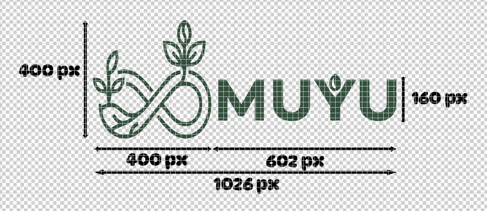

El logotipo horizontal combina el isotipo y el nombre **MUYU**. Para el ícono de la aplicación se emplea únicamente el isotipo, permitiendo mantener su reconocimiento y legibilidad en tamaños reducidos.

#### Asistente visual de la aplicación

  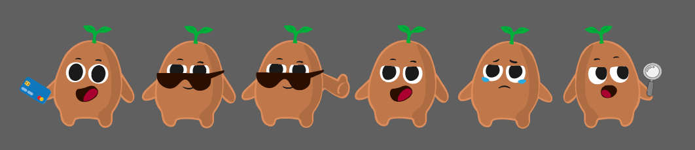

El asistente visual se utiliza dentro de la aplicación para acompañar al usuario en mensajes, estados y acciones específicas. Sus distintas expresiones permiten comunicar confirmación, atención, ayuda, error o información sin depender únicamente de texto.

#### Asistente de autenticación y orientación

  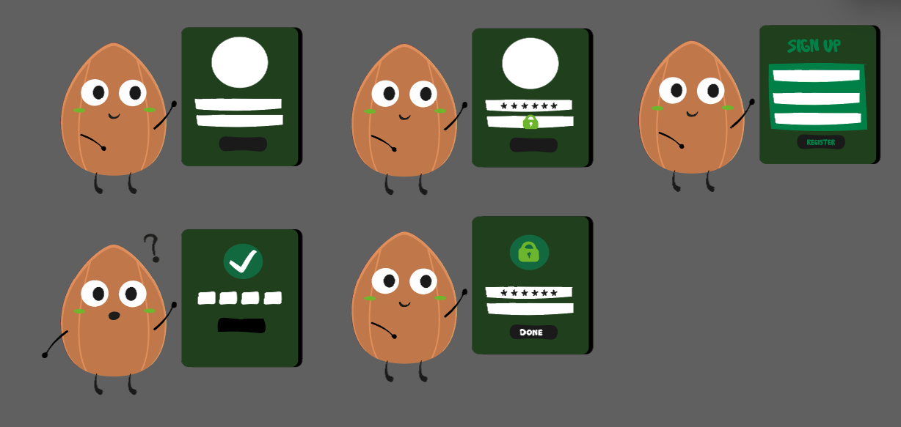

El segundo recurso ilustrativo cumple una función explicativa en procesos como inicio de sesión, registro, recuperación de cuenta y confirmaciones. El personaje acompaña visualmente los formularios y facilita la identificación de cada paso del proceso.

**Colors**

  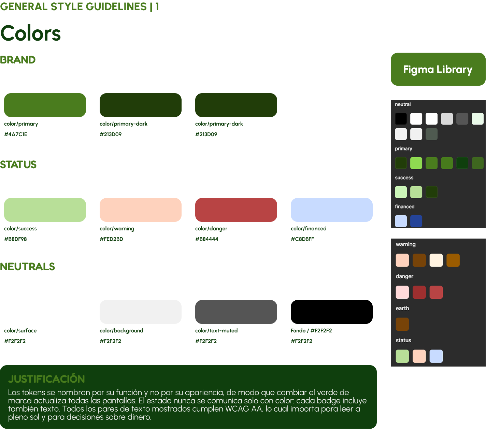

La paleta se organiza en tres grupos: marca (verdes), estados y neutros. Cada color se define como token con nombre por función, por ejemplo `color/primary` o `color/warning`, de modo que un cambio de verde de marca se propaga a todas las pantallas.
 
| Token | Valor | Uso |
|---|---|---|
| color/primary | #4A7C1E | Acciones y elemento seleccionado de la navegación |
| color/primary-dark | #213D09 | Texto fuerte y encabezados |
| color/brand-deep | #0F3F0D | Barra de navegación inferior |
| color/success | #B8DF98 con texto #213D09 | Estado Aprobado |
| color/warning | #FED2BD con texto #85490D | Estado Pendiente |
| color/danger | #B84444 | Rechazo y error de ubicación |
| color/financed | #C8DBFF con texto #2F4FB8 | Estado Financiada |
| Neutros | #FFFFFF, #F2F2F2, #D9D9D9, #757575, #000000 | Superficies, bordes, texto secundario y texto |
 
Sustento: los nombres semánticos separan el propósito de la apariencia. El estado nunca se comunica solo con color, cada badge incluye texto, lo que además ayuda a usuarios con dificultad para distinguir colores.

**Iconographies**

  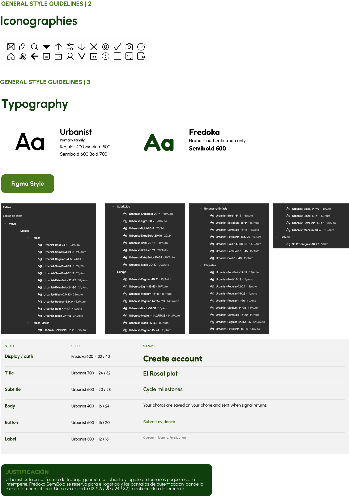

**Typography**

  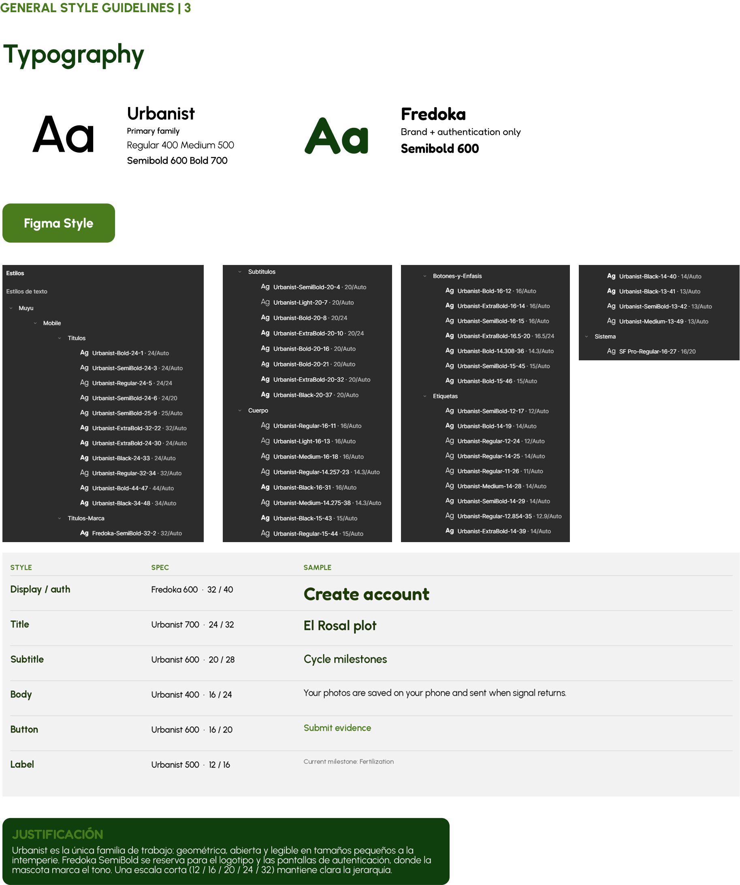

Urbanist es la familia de trabajo. Es geométrica, abierta y legible en tamaños pequeños a la intemperie. Fredoka SemiBold se reserva para el logotipo y las pantallas de autenticación, donde la mascota marca el tono. La escala tipográfica se limita a los tamaños 12, 16, 20, 24 y 32 px.
 
| Estilo | Especificación |
|---|---|
| Display / autenticación | Fredoka 600, 32/40 |
| Title | Urbanist 700, 24/32 |
| Subtitle | Urbanist 600, 20/28 |
| Body | Urbanist 400, 16/24 |
| Button | Urbanist 600, 16/20 |
| Label | Urbanist 500, 12/16 |
 
Sustento: una jerarquía corta facilita la exploración y la comprensión, y los estilos reutilizables evitan diferencias accidentales entre pantallas. El tamaño de 12 px se usa solo en etiquetas secundarias y requiere pruebas de legibilidad en campo.

**Spacing and shape**

  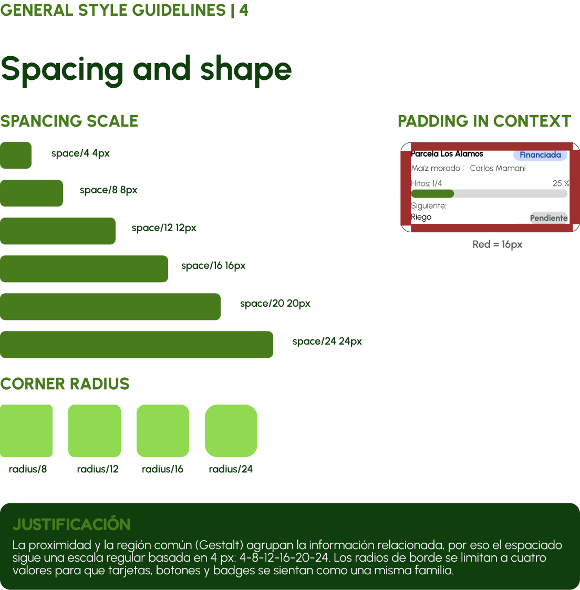

El espaciado sigue una escala basada en 4 px: 4, 8, 12, 16, 20 y 24. Los radios de borde se limitan a 8, 12, 16 y 24 px. Las tarjetas usan 16 px de relleno interno.
 
Sustento: los principios de proximidad y región común de Gestalt agrupan la información relacionada. Una escala regular da ritmo visual y facilita que el equipo construya pantallas consistentes.

**Core components**

  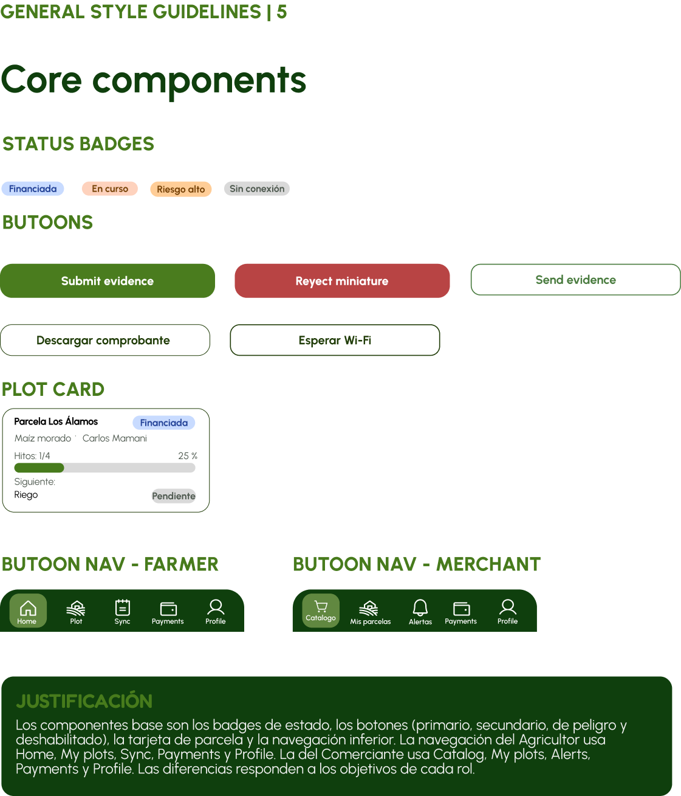

Los componentes base son los badges de estado, los botones (primario, secundario, de peligro y deshabilitado), la tarjeta de parcela y la navegación inferior. Se construyen una sola vez con variantes. Las etiquetas son cortas y orientadas a la tarea: "Approve & release payment" nombra la consecuencia de la acción mejor que un "Confirm" genérico, y "Correction requested" indica al agricultor qué debe hacer a continuación. La navegación del Agricultor usa Home, My plots, Sync, Payments y Profile. La del Comerciante usa Catalog, My plots, Alerts, Payments y Profile. Las diferencias responden a los objetivos de cada rol.

**Tone of Communication**

  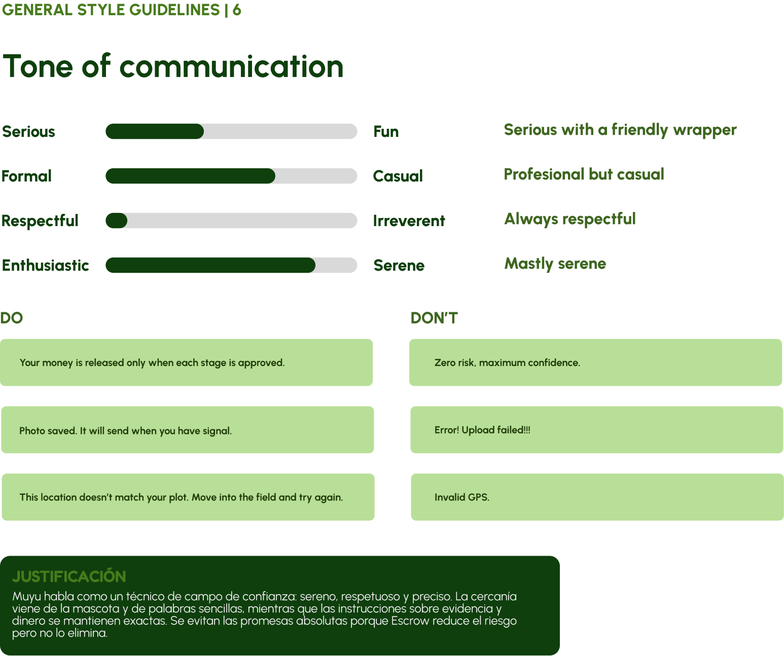

Muyu se ubica así en las cuatro dimensiones: serio con una envoltura amistosa, casual profesional, respetuoso y predominantemente sereno. Habla como un técnico de campo de confianza. La cercanía viene de la mascota y de palabras sencillas, y las instrucciones sobre evidencia y pagos se mantienen exactas. Se evitan las promesas absolutas, por ejemplo "Zero risk, maximum confidence", porque Escrow reduce el riesgo pero no lo elimina. El idioma por defecto de la interfaz es inglés, con español latinoamericano (es_419) como alternativa, y no se mezclan ambos en una misma pantalla.

**Accessibility: contrast**

  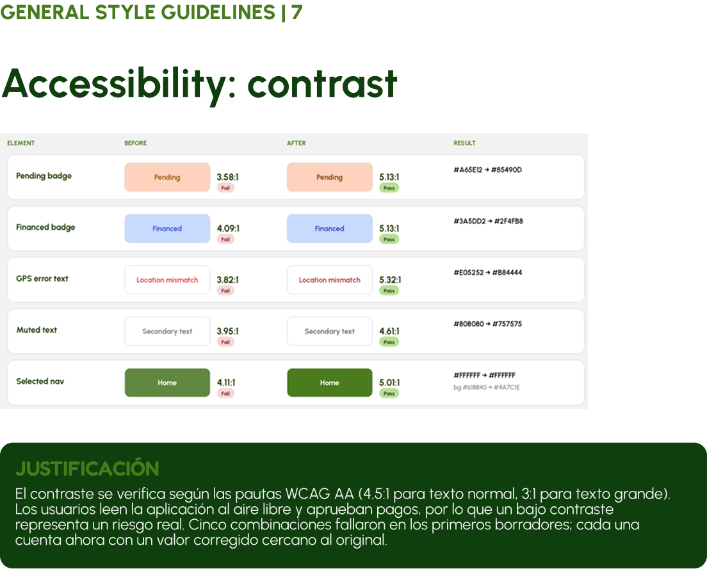

El contraste se verifica contra WCAG AA: 4,5:1 para texto normal y 3:1 para texto grande. En los primeros borradores cinco combinaciones no cumplían y se corrigieron conservando el aspecto original:
 
| Elemento | Antes | Después |
|---|---|---|
| Badge Pendiente | #A65E12 sobre #FED2BD (3,58:1) | #85490D (5,13:1) |
| Badge Financiada | #3A5DD2 sobre #C8DBFF (4,09:1) | #2F4FB8 (5,13:1) |
| Texto de error de ubicación | #E05252 sobre blanco (3,82:1) | #B84444 (5,32:1) |
| Texto secundario | Negro al 50 % (3,95:1) | #757575 (4,61:1) |
| Elemento seleccionado de la navegación | Blanco sobre #618840 (4,11:1) | Blanco sobre #4A7C1E (5,01:1) |
 
El análisis no certifica el texto sobre fotografías ni sobre fondos variables, que requiere un velo oscuro o una revisión manual.
 
Sustento: la app se lee en exteriores y se usa para decisiones económicas, por lo que el contraste insuficiente es un riesgo real de error.

**Layout Grid**

Muyu emplea una cuadrícula responsive para mantener la alineación y la jerarquía visual entre la Landing Page y la aplicación móvil. La grilla permite distribuir títulos, imágenes, componentes y espacios de forma consistente, evitando posiciones arbitrarias entre pantallas.

Landing Page

La versión desktop utiliza una estructura de columnas que organiza el contenido principal, la navegación y las secciones informativas. Los textos e imágenes se alinean con estas columnas para mantener una lectura clara y una separación uniforme entre bloques.

  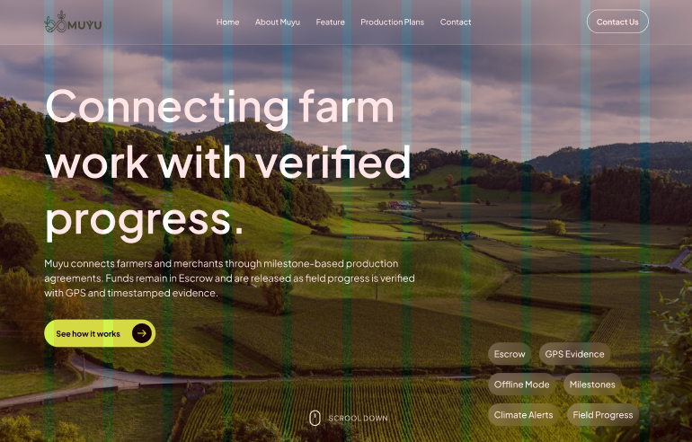

Mobile Application

La aplicación móvil utiliza una grilla adaptada al ancho del dispositivo. Los componentes principales respetan los márgenes laterales y las columnas definidas, mientras que elementos como tarjetas, formularios y botones se expanden dentro del área disponible.

  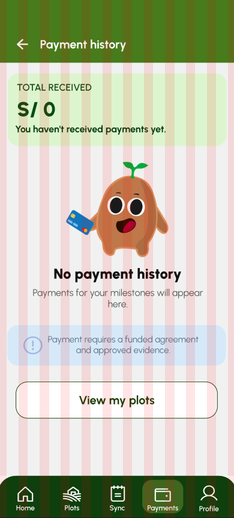

### 3.1.2. Information Architecture

La arquitectura de información de la aplicación móvil Muyu define cómo se organiza, etiqueta, busca y navega el contenido para que los dos tipos de usuario, Agricultor y Comerciante, puedan acceder de forma directa a las tareas relacionadas con sus objetivos.

Las decisiones responden a los hallazgos obtenidos durante las entrevistas. El Agricultor trabaja directamente en campo, en ocasiones con conectividad limitada y mientras realiza otras actividades, por lo que necesita una navegación con pocas opciones y acciones directas. El Comerciante toma decisiones relacionadas con financiamiento, revisión de evidencias y aprobación de hitos, por lo que necesita identificar rápidamente qué parcelas o actividades requieren su atención.

#### 3.1.2.1. Organization Systems

**Sistemas de organización visual**

| Sistema | Aplicación | Justificación |
|---|---|---|
| Jerárquico | La navegación parte de Inicio o Catálogo, continúa hacia una parcela y posteriormente hacia sus hitos, evidencias, financiamiento o información asociada. Las pantallas de detalle presentan primero el nombre y estado de la parcela, seguido de la información relacionada con su ciclo productivo. | Permite que el usuario comprenda en qué nivel se encuentra y cuál es el contexto de la información que está revisando. |
| Secuencial | Se aplica en procesos que requieren un orden definido, como publicación de parcelas, financiamiento, registro de evidencias, recuperación de contraseña y confirmaciones. | Divide tareas extensas en pasos breves y reduce errores en procesos que requieren ingresar información o confirmar operaciones. |
| Por estado | Las parcelas, evidencias, hitos, solicitudes y pagos se organizan mediante estados visibles como Available, Funded, Pending, Awaiting review, Approved y Correction needed. | Permite reconocer rápidamente qué elementos requieren atención o qué etapa del proceso se encuentra activa. |

**Esquemas de categorización del contenido**

| Esquema | Aplicación |
|---|---|
| Por audiencia o rol | Cada rol cuenta con navegación inferior, pantalla inicial y acciones principales diferentes. El Agricultor publica parcelas, registra evidencias y gestiona la sincronización. El Comerciante explora parcelas, financia planes de producción y revisa hitos. |
| Por estado | Las parcelas y los hitos se identifican mediante badges como Available, Funded, Pending, Awaiting review, Approved y Correction needed. |
| Cronológico | Se emplea en el historial de pagos, notificaciones, evidencias registradas y fechas asociadas a hitos o solicitudes de visita. |
| Por tema | El Perfil agrupa información de contacto, preferencias de notificaciones, pagos, seguridad, ayuda y documentos legales. |
| Geográfico | Se emplea en la ubicación de parcelas, verificación mediante GPS y búsqueda relacionada con ubicación. |
| Alfabético | No se utiliza como criterio principal, ya que las parcelas se consultan principalmente por cultivo, ubicación, estado o relación con el usuario. |

#### 3.1.2.2. Labeling Systems

El sistema de etiquetado utiliza términos breves, orientados a la tarea y consistentes entre pantallas. El idioma predeterminado de la interfaz es inglés y se considera español latinoamericano (`es_419`) como alternativa.

Las etiquetas buscan anticipar claramente el contenido o la acción asociada. Por ejemplo, Payments dirige al historial y estado de pagos, mientras que Sync identifica la sección donde el Agricultor puede revisar las evidencias pendientes de sincronización.

**Navegación inferior**

| Rol | Labels (en_US) | Equivalente es_419 |
|---|---|---|
| Agricultor | Home, Plots, Sync, Payments, Profile | Inicio, Parcelas, Sincronización, Pagos, Perfil |
| Comerciante | Catalog, My plots, Alerts, Payments, Profile | Catálogo, Mis parcelas, Alertas, Pagos, Perfil |

**Farmer**

  

**Merchant**

  

Las diferencias entre ambas barras de navegación responden a los objetivos de cada segmento. El Agricultor dispone de Sync para gestionar evidencias registradas con conectividad limitada. El Comerciante dispone de Catalog para explorar oportunidades de producción y Alerts` para revisar eventos relevantes relacionados con sus parcelas financiadas.

**Acciones principales**

| Label | Ubicación | Asociación esperada |
|---|---|---|
| Publish | Agricultor, Inicio o Parcelas | Inicia el registro de una nueva parcela. |
| Record evidence | Agricultor, detalle de parcela | Inicia el registro de evidencia para un hito. |
| Take photo | Agricultor, registro de evidencia | Abre la cámara para capturar una fotografía. |
| Open gallery | Agricultor, registro de evidencia | Permite seleccionar una fotografía existente. |
| Submit evidence | Agricultor, revisión de evidencia | Envía la evidencia registrada. Si no existe conexión, permanece pendiente de sincronización. |
| Fund plot | Comerciante, detalle de parcela | Inicia el proceso de financiamiento del plan de producción. |
| Approve and release payment | Comerciante, revisión de evidencia | Aprueba el hito y autoriza la liberación del pago correspondiente. |
| Reject and explain reason | Comerciante, revisión de evidencia | Rechaza la evidencia y solicita una corrección indicando el motivo. |
| Request visit | Comerciante, parcela | Inicia la coordinación de una visita presencial. |

El uso de etiquetas como Approve and release payment comunica directamente la consecuencia de la acción. Esto resulta más claro que utilizar términos genéricos como Confirm en operaciones relacionadas con dinero.

**Estados**

| Badge | Significado | Equivalencia funcional |
|---|---|---|
| Available | Parcela publicada y disponible para financiamiento. | Parcela disponible |
| Funded | Parcela con un acuerdo de financiamiento activo. | Parcela financiada |
| Pending | Hito que aún requiere completar una actividad o presentar evidencia. | Pendiente |
| Awaiting review | Evidencia enviada y pendiente de revisión por el Comerciante. | Evidencia presentada para revisión |
| Approved | Hito revisado y aprobado. | Hito aprobado |
| Correction needed | La evidencia requiere una nueva versión o corrección. | Corrección solicitada |
| Submitted | Evidencia enviada correctamente al servidor. | Evidencia presentada |

Los nombres extensos utilizados en la documentación se reducen en los badges para facilitar su lectura en una pantalla móvil. Las equivalencias se mantienen relacionadas con el Ubiquitous Language del proyecto para conservar consistencia entre diseño, documentación y desarrollo.

#### 3.1.2.3. SEO Tags and Meta Tags

Debido a que Muyu corresponde a una aplicación móvil, se consideran elementos de App Store Optimization (ASO) para describir y facilitar la identificación de la aplicación en una tienda de aplicaciones. Los elementos SEO correspondientes al sitio web público se documentan dentro de la Landing Page.

| Elemento | en_US (predeterminado) | es_419 |
|---|---|---|
| App Title | Muyu: Fund and Track Crops | Muyu: Financia tus Cultivos |
| App Subtitle | Escrow-protected farm funding | Financiamiento agrícola con Escrow |
| Short Description | Fund farm plots, verify progress with GPS photos and pay by milestone. | Financia parcelas, verifica avances con fotos GPS y gestiona pagos por hitos. |
| Keywords | farming, crops, agriculture, escrow, harvest, farmer, plots, weather alerts, offline, evidence, gps, peru | agricultura, cultivos, parcelas, escrow, cosecha, agricultor, alertas, sin conexion, evidencia, gps, peru |

**App description (en_US)**

Muyu connects farmers and merchants through agricultural production plans organized by milestones. Farmers publish their plots and register field progress using GPS and timestamped evidence, including situations with limited connectivity. Merchants can explore available plots, fund production plans, follow progress and review evidence before approving each milestone. Funds remain in Escrow and are released according to the approval of the corresponding milestone. Muyu also provides weather alerts related to conditions that may affect agricultural activities.

**App description (es_419)**

Muyu conecta a agricultores y comerciantes mediante planes de producción agrícola organizados por hitos. Los agricultores publican sus parcelas y registran el avance del trabajo mediante evidencias con GPS, fecha y hora, incluso en situaciones con conectividad limitada. Los comerciantes pueden explorar parcelas disponibles, financiar planes de producción, seguir su progreso y revisar las evidencias antes de aprobar cada hito. Los fondos permanecen en Escrow y se liberan de acuerdo con la aprobación del hito correspondiente. Muyu también proporciona alertas sobre condiciones climáticas que pueden afectar las actividades agrícolas.

#### 3.1.2.4. Searching Systems

Los sistemas de búsqueda de Muyu se adaptan al contexto de cada sección y evitan presentar una cantidad excesiva de filtros en pantallas móviles.

| Contexto | Opciones de búsqueda y filtros | Presentación de resultados |
|---|---|---|
| Catálogo, Comerciante | Búsqueda por cultivo o ubicación, opciones rápidas como All, Near me y Recommended, junto con filtros relacionados con las características de la parcela. | Tarjetas con fotografía, nombre de parcela, agricultor, monto solicitado, cultivo, área, ubicación e información relevante del productor. |
| Parcelas, Agricultor | Búsqueda por nombre de parcela o ubicación y filtrado por estado. | Tarjetas con nombre, cultivo, estado, hito actual, progreso y acceso al detalle de la parcela. |
| My plots, Comerciante | Visualización de parcelas financiadas y opción para priorizar aquellas que requieren revisión. | Tarjetas con estado, progreso, hito actual y acciones pendientes. |
| Payments, ambos roles | Organización cronológica y filtros relacionados con el estado del pago. | Lista de transacciones con parcela, hito, monto, fecha y estado. |
| Alerts, Comerciante | Consulta de alertas relacionadas con clima, evidencias, solicitudes y próximos eventos. | Lista de notificaciones que dirige directamente al contexto relacionado. |

Cuando una búsqueda no obtiene resultados, el sistema muestra un estado vacío e indica al usuario que puede modificar la búsqueda o los filtros. La cantidad de filtros se mantiene reducida para facilitar su uso en pantallas pequeñas.

#### 3.1.2.5. Navigation Systems

Muyu combina distintos sistemas de navegación para mantener disponibles las secciones principales y, al mismo tiempo, permitir acciones relacionadas con el contexto actual.

| Sistema | Elementos | Función |
|---|---|---|
| Global | Barra de navegación inferior con cinco opciones según el rol. | Mantiene acceso permanente a las principales áreas de la aplicación. Cada opción combina icono y texto. |
| Local | Flecha de regreso, título de pantalla y datos contextuales como parcela, cultivo o ciclo. | Permite identificar la ubicación actual dentro del flujo y regresar al nivel anterior. |
| Contextual | Botones como Record evidence, Fund plot, Approve and release payment, Request visit o Correct evidence. | Permiten iniciar acciones directamente desde el contenido que el usuario está revisando. |
| Secuencial | Indicadores de pasos y botones para continuar o regresar en procesos como publicación de parcelas y financiamiento. | Orientan al usuario en tareas que requieren un orden definido. |
| Basado en notificaciones | Alertas climáticas, solicitudes de extensión, evidencias pendientes de revisión, pagos y eventos relacionados con la cosecha. | Permiten acceder directamente al detalle relacionado con un evento. |

**Rutas principales**

- **Agricultor, registrar evidencia:**  
  

  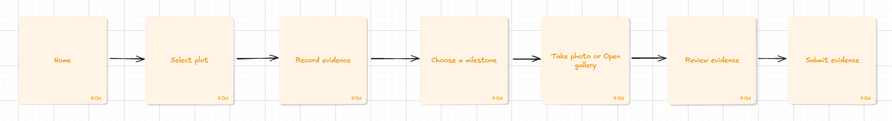
  

- **Agricultor, publicar una parcela:**  
  

  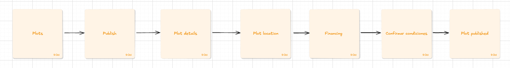
  

- **Comerciante, financiar una parcela:**  
  

  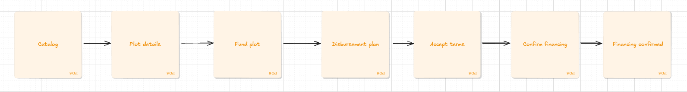
  

- **Comerciante, revisar un hito:**  
  

  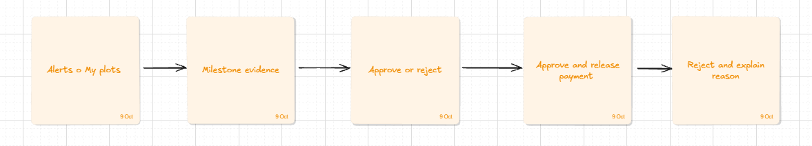
  

- **Comerciante, solicitar una visita:**  
  

  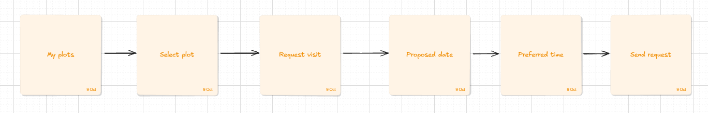
  

**Criterios de diseño**

La navegación inferior se limita a cinco opciones por rol y combina iconos con etiquetas para reducir ambigüedad. Los controles táctiles principales mantienen un área mínima de interacción de 48 px. Las acciones relacionadas con una parcela se presentan dentro de su contexto, evitando que el usuario tenga que regresar al menú principal para continuar una tarea.

### 3.1.3. Landing Page UI Design
#### 3.1.3.1. Landing Page Wireframe
#### 3.1.3.2. Landing Page Mock-up

El mock-up de la Landing Page de Muyu desarrolla visualmente la propuesta planteada durante el wireframing y aplica los lineamientos definidos en el sistema de diseño. La interfaz utiliza la identidad gráfica de Muyu, la tipografía Urbanist, la paleta de verdes de la marca, componentes con bordes redondeados y una estructura basada en una cuadrícula de columnas.

La página está orientada a los dos segmentos del producto: Agricultor y Comerciante / Comprador. Su contenido presenta primero la propuesta de valor de Muyu, luego muestra las funciones principales, los planes de producción y el funcionamiento del proceso por hitos. Finalmente, diferencia las capacidades disponibles para cada segmento, resuelve preguntas frecuentes y ofrece canales de contacto.

La navegación mantiene una estructura de desplazamiento vertical entre secciones, permitiendo al visitante comprender el producto de forma progresiva sin requerir autenticación.

#### 3.1.3.2. Landing Page Mock-up

El mock-up de la Landing Page de Muyu desarrolla visualmente la propuesta planteada durante el wireframing y aplica los lineamientos definidos en el sistema de diseño. La interfaz utiliza la identidad gráfica de Muyu, la tipografía Urbanist, la paleta de verdes de la marca, componentes con bordes redondeados y una estructura basada en una cuadrícula de columnas.

La página está orientada a los dos segmentos del producto: Agricultor y Comerciante / Comprador. Su contenido presenta primero la propuesta de valor de Muyu, luego muestra las funciones principales, los planes de producción y el funcionamiento del proceso por hitos. Finalmente, diferencia las capacidades disponibles para cada segmento, resuelve preguntas frecuentes y ofrece canales de contacto.

La navegación mantiene una estructura de desplazamiento vertical entre secciones, permitiendo al visitante comprender el producto de forma progresiva sin requerir autenticación.

##### Desktop Web Browser

La versión desktop distribuye el contenido mediante una cuadrícula de 12 columnas. Esta estructura permite mantener alineados títulos, textos, imágenes, tarjetas y llamadas a la acción a lo largo de la página.

  

##### Hero

El Hero constituye el primer punto de contacto con Muyu. Presenta el logotipo, la navegación principal y una propuesta de valor centrada en conectar el trabajo agrícola con un progreso verificable.

El mensaje introduce tres elementos del producto: acuerdos de producción organizados por hitos, fondos administrados mediante Escrow y evidencias de campo con ubicación y fecha. La llamada a la acción **See how it works** dirige al visitante hacia la explicación del funcionamiento de la plataforma.

Los términos Escrow, GPS Evidence, Offline Mode, Milestones, Climate Alerts y Field Progress funcionan como una síntesis visual de las capacidades principales.

  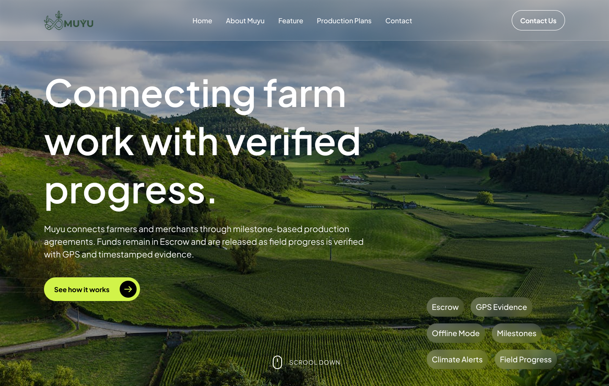

##### About Muyu

Esta sección introduce el modelo de funcionamiento de Muyu antes de presentar sus funciones específicas. Se comunica la relación entre agricultores y comerciantes mediante hitos de producción, evidencias de campo y pagos asociados al progreso agrícola.

Las imágenes muestran el contexto de uso del producto y refuerzan su relación con actividades realizadas directamente en campo.

  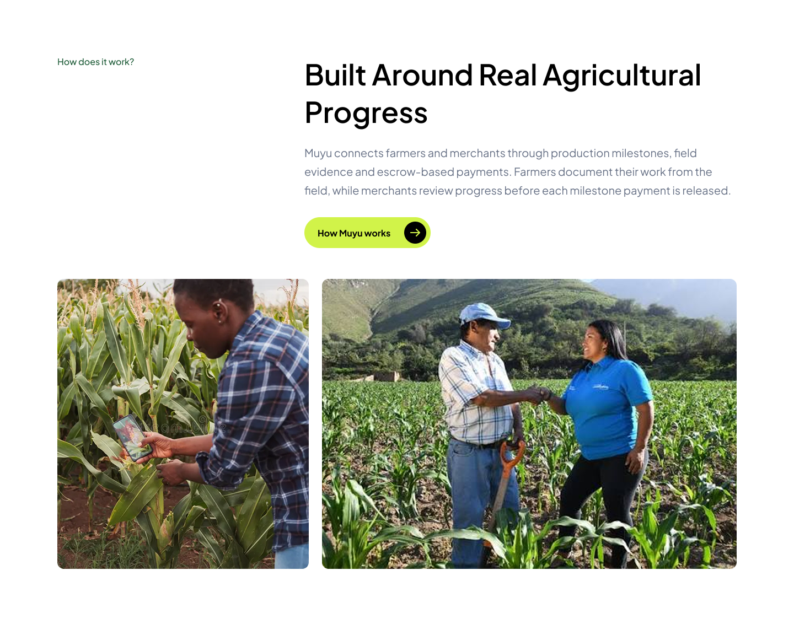

##### Core Features

La sección Core Features presenta las capacidades principales de la plataforma mediante un componente de tipo acordeón. Cada elemento permite concentrar la información y mantener una baja carga visual.

Las funciones consideradas son Escrow por hitos, evidencia con GPS y fecha, funcionamiento sin conexión, alertas climáticas y seguimiento de hitos. Al desplegar una función se muestra una descripción y un recurso visual asociado al contexto de uso.

  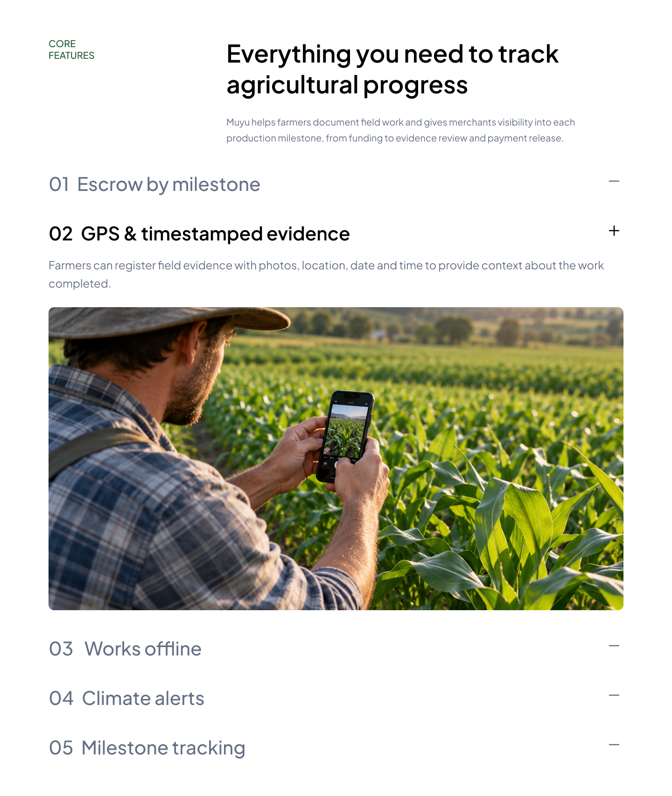

##### Product Principles

La franja de atributos resume cuatro conceptos centrales del producto: protección de fondos mediante Escrow, evidencia contextual con GPS y fecha, registro de información con conectividad limitada y organización de la producción mediante hitos.

Este bloque funciona como transición entre las capacidades generales y los planes de producción.

  

##### Production Plans

La sección Production Plans muestra ejemplos de ciclos productivos disponibles en Muyu. Cada tarjeta presenta el cultivo, la duración estimada del ciclo y la cantidad de hitos que organizan su producción.

Los ejemplos representados corresponden a papa Huayro, maíz amarillo y quinua. La información permite comunicar que los planes se adaptan a diferentes cultivos y que cada uno puede contener una estructura distinta de actividades y evidencias.

  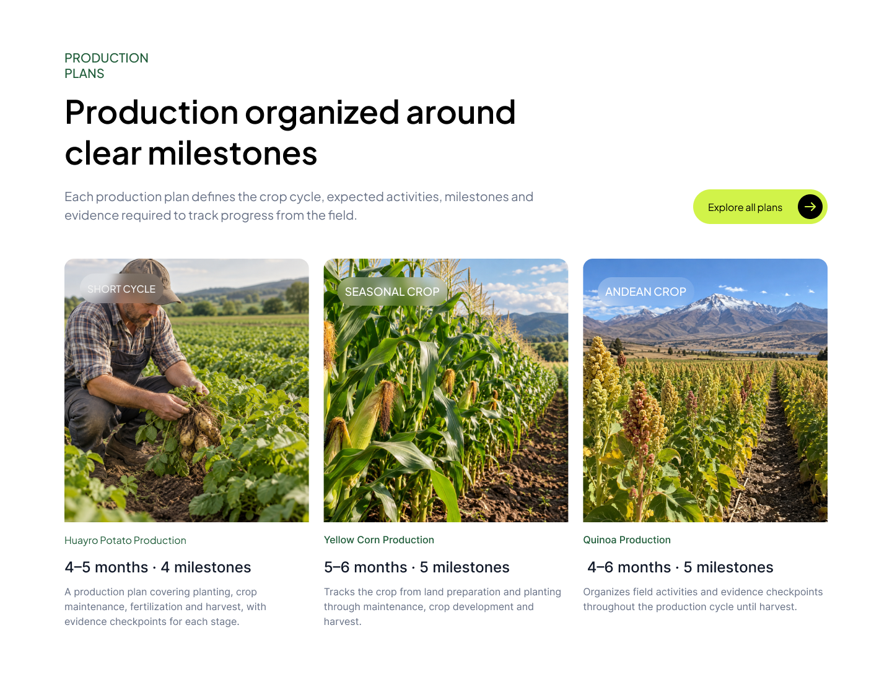

##### How It Works

Esta sección representa de forma resumida el flujo principal de Muyu desde la publicación de una parcela hasta la revisión de un hito.

El proceso se presenta mediante cinco etapas:

1. El agricultor publica una parcela.
2. El comerciante financia el plan de producción.
3. El agricultor desarrolla las actividades correspondientes al hito.
4. Se registra y revisa la evidencia del trabajo.
5. El comerciante aprueba el hito o solicita una corrección.

La disposición numerada facilita comprender la relación entre ambos segmentos y el flujo general del producto antes de ingresar a la aplicación.

  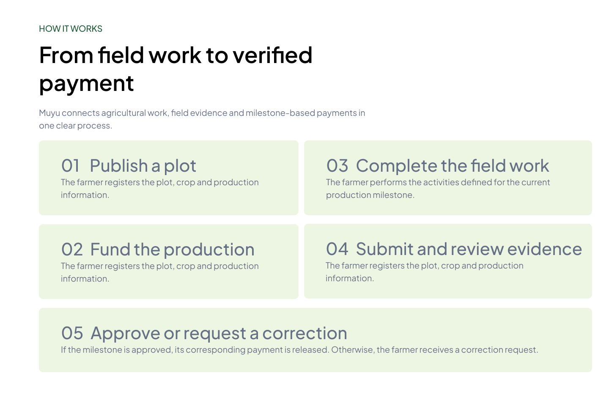

##### Payments

La sección Payments explica la relación entre el avance de la producción y la liberación de fondos. El proceso se resume en tres estados: fondos asegurados, evidencia aprobada y pago liberado.

Esta representación busca aclarar que el financiamiento no se entrega en una única operación, sino que se encuentra asociado al cumplimiento y revisión de los hitos definidos en el plan de producción.

  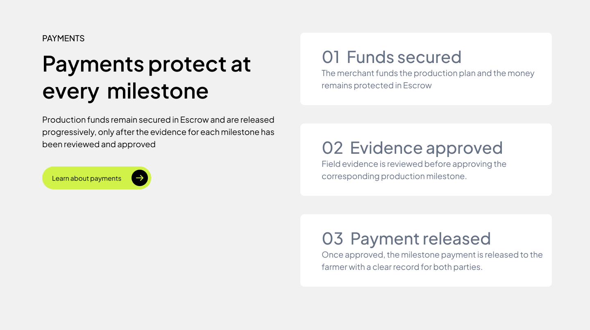

##### For Farmers and Merchants

Esta sección diferencia las capacidades de Muyu según el segmento del usuario.

Para el Agricultor se destacan el registro de actividades de campo, captura de evidencias con GPS y fecha, almacenamiento temporal sin conexión, seguimiento de hitos y pagos, y recepción de alertas climáticas.

Para el Comerciante / Comprador se muestran la exploración de parcelas y planes de producción, consulta de información agrícola, seguimiento del avance financiado, revisión de evidencias y aprobación o solicitud de correcciones sobre los hitos.

La presentación en dos columnas permite comparar las responsabilidades y beneficios de ambos perfiles sin separarlos del mismo proceso productivo.

  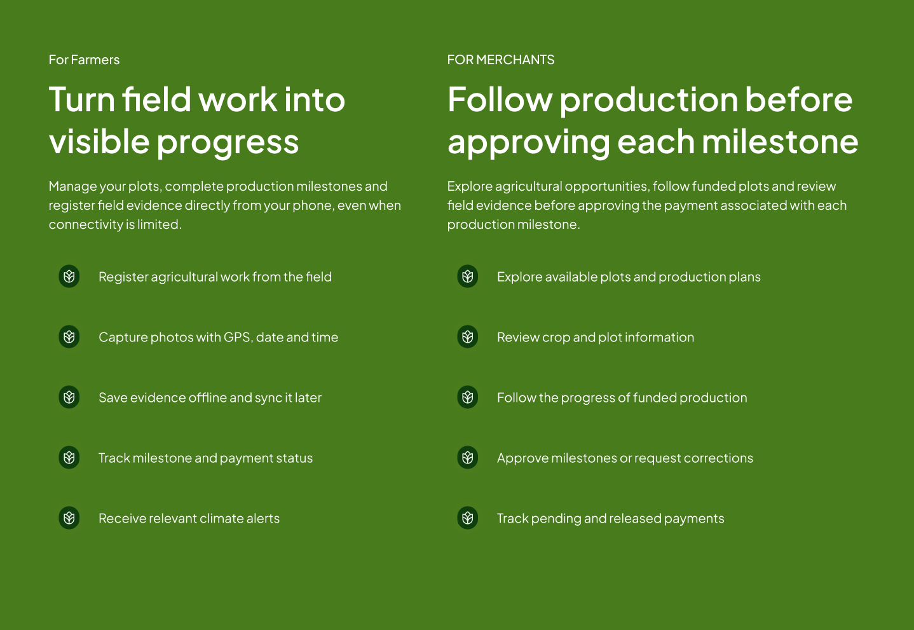

##### Frequently Asked Questions

La sección FAQ concentra preguntas relacionadas con el funcionamiento de Muyu, Escrow, evidencias, conectividad, planes de producción, liberación de pagos y alertas climáticas.

Las preguntas utilizan un componente de acordeón para mostrar una respuesta a la vez, reduciendo la cantidad de información visible y facilitando la exploración del contenido.

  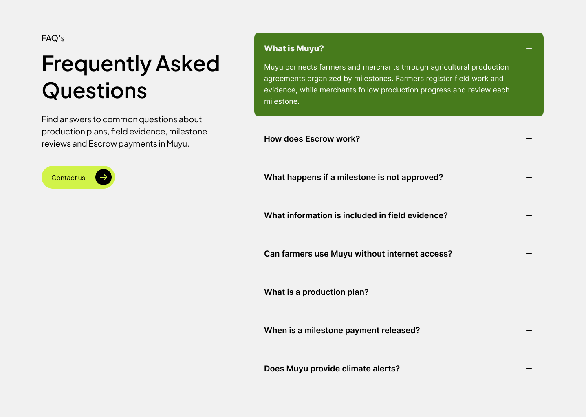

**FAQ**

  

##### Testimonials

La sección Testimonials plantea el espacio visual destinado a incorporar experiencias de usuarios durante etapas posteriores de validación. El componente utiliza una estructura de carrusel para alternar entre testimonios de los segmentos Agricultor y Comerciante / Comprador.

En esta etapa, el contenido presentado funciona como referencia visual del componente y no representa testimonios validados del producto.

  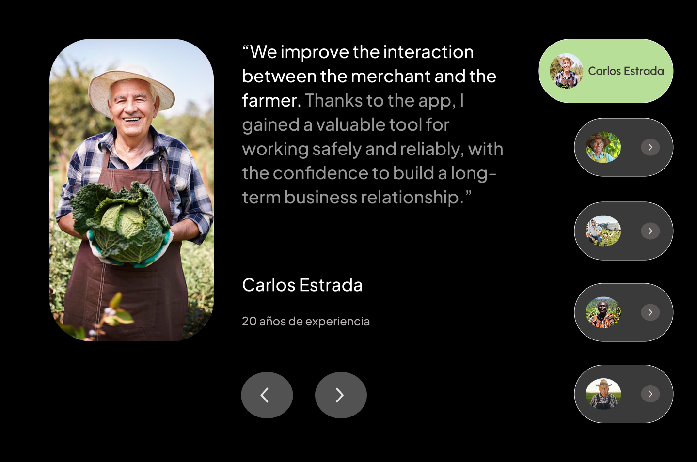

##### Call to Action

La llamada a la acción final busca dirigir al visitante hacia la aplicación móvil después de haber presentado el funcionamiento y las capacidades principales de Muyu.

El bloque utiliza una imagen agrícola de fondo y un mensaje breve que conecta la aplicación con el trabajo realizado en campo.

  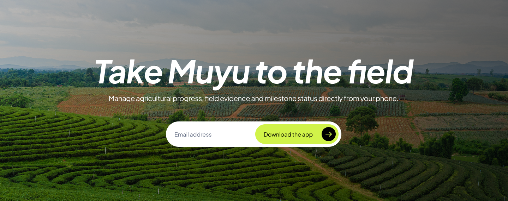

##### Contact

La sección Contact ofrece un canal directo de comunicación con el equipo de AllpaTech. El formulario solicita información básica del visitante y permite enviar una consulta relacionada con Muyu.

El bloque complementa el formulario con una descripción breve y los datos de contacto del equipo.

  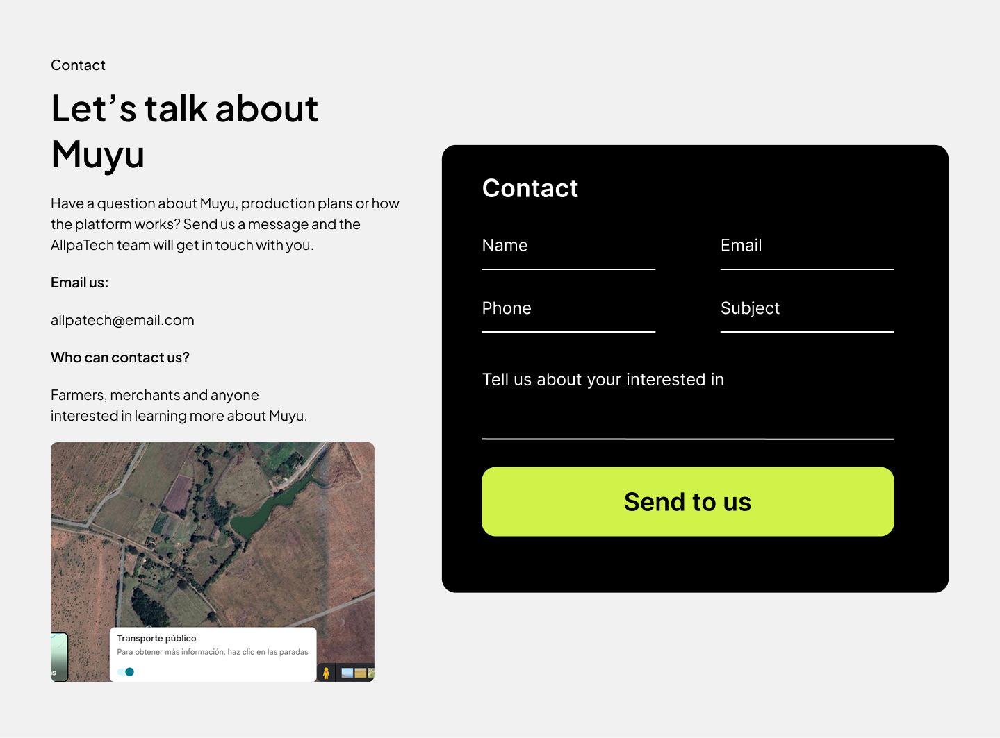

##### Footer

El Footer cierra la experiencia mediante una síntesis de la propuesta de Muyu y enlaces hacia las principales secciones de la Landing Page.

También reúne los accesos legales a Terms and Conditions y Privacy Policy, junto con el selector de idioma EN / ES. La identidad de AllpaTech se mantiene como organización responsable del desarrollo de Muyu.

  

##### Mobile Web Browser

### 3.1.4. Mobile Applications UX/UI Design
#### 3.1.4.1. Mobile Applications Wireframes
#### 3.1.4.2. Mobile Applications Wireflow Diagrams

##### Publicar una parcela

 Wireflow que muestra cómo el agricultor registra los datos y la ubicación de su parcela, define el plan de financiamiento y acepta sus condiciones. Al completar las validaciones, la parcela se publica como Disponible y queda visible para recibir solicitudes de financiamiento.

  

##### Registrar evidencia de un hito 

Wireflow que muestra el registro de una evidencia fotográfica, junto con la fecha, ubicación GPS e información del insumo utilizado. Tras validar y enviar los datos, la evidencia queda Pendiente de revisión; si no existe conexión, se almacena localmente para sincronizarse después.

  

##### Corregir un hito rechazado 

Wireflow que muestra la consulta del motivo de rechazo, la corrección de la evidencia y el envío de una nueva versión. El registro original se conserva para mantener la trazabilidad y la evidencia corregida queda Pendiente de revisión, sin liberar automáticamente el pago retenido.

  

##### Atender una alerta climática 

Wireflow que muestra la consulta del nivel de riesgo climático y las recomendaciones preventivas para proteger el cultivo. Después de registrar las medidas realizadas, la alerta queda como Atendida, aunque el riesgo continúa activo y debe mantenerse el monitoreo.

  

##### Sincronizar evidencias sin conexión 

Wireflow que muestra el almacenamiento local y la sincronización de evidencias registradas sin conexión. Al recuperar una conexión permitida, se envían los registros pendientes y solo se reintentan aquellos que presentan errores, evitando pérdidas o duplicados.

  

##### Financiar una parcela

Wireflow que muestra la selección de una parcela, la revisión del plan de desembolsos y la confirmación del financiamiento. Al aceptar las condiciones y completar el pago, los fondos quedan retenidos en custodia para liberarse conforme se aprueben los hitos.

  

##### Revisar y aprobar o rechazar un hito

Wireflow que muestra la revisión de la evidencia y la decisión de aprobarla o rechazarla. La aprobación libera únicamente el pago correspondiente al hito, mientras que el rechazo exige registrar un motivo y mantiene los fondos retenidos.

  

##### Solicitar una visita presencial

  Wireflow que muestra la propuesta de una fecha y hora para realizar una visita presencial antes del financiamiento. La solicitud queda pendiente hasta recibir una respuesta y, al ser aceptada, se confirma la coordinación sin reservar la parcela ni generar pagos.

  

##### Confirmar la recepción de la cosecha 

Wireflow que muestra la verificación de la cantidad y calidad de la cosecha recibida. Cuando la entrega es conforme y se autoriza expresamente, se libera el último desembolso y se completa el ciclo de financiamiento.

  

#### 3.1.4.3. Mobile Applications Mock-ups
#### 3.1.4.4. Mobile Applications User Flow Diagrams

###### AGRICULTOR / Publicar una parcela

 Este flujo representa el proceso mediante el cual el agricultor registra una parcela en tres etapas: datos generales, ubicación y plan de financiamiento. El sistema valida los campos obligatorios, las coordenadas y que las cuotas coincidan con el monto solicitado, permitiendo corregir errores sin perder la información ingresada. Al completar las validaciones y aceptar los términos, la parcela se publica con estado Disponible, sin realizar todavía movimientos de fondos.

  

  

  

###### AGRICULTOR / Registrar evidencia de un hito

Este flujo muestra cómo el agricultor registra y envía evidencia fotográfica de un hito, incluyendo fecha, ubicación GPS e información del insumo utilizado. El sistema contempla permisos de cámara, validación de ubicación y almacenamiento local cuando no existe conexión, permitiendo sincronizar o reintentar posteriormente. Al completarse el envío, la evidencia queda pendiente de revisión, sin implicar todavía su aprobación ni la liberación del pago. 

  

  

  

###### AGRICULTOR / Corregir un hito rechazado

Este flujo representa cómo el agricultor consulta el motivo del rechazo, corrige la información solicitada y envía una nueva versión de la evidencia. El sistema conserva el envío original para mantener la trazabilidad y permite guardar el nuevo registro como borrador cuando la corrección aún no es válida. Después del reenvío, la evidencia queda nuevamente pendiente de revisión, sin liberar automáticamente el pago retenido.

  

  

###### AGRICULTOR / Sincronizar evidencias sin conexión

Este flujo representa el almacenamiento y envío posterior de evidencias registradas sin conexión, conservando fotografías, ubicación y demás metadatos. El sistema respeta la preferencia de uso de Wi-Fi o datos móviles y muestra el estado individual de cada carga, permitiendo reintentar únicamente los registros fallidos. Al finalizar, la cola queda vacía y las evidencias enviadas se incorporan al historial sin duplicarse.

  

  

  

  

###### COMERCIANTE / Financiar una parcela 

Este flujo muestra cómo el comerciante selecciona una parcela disponible, revisa el monto, las cuotas y las condiciones antes de confirmar el pago. Una vez completada la transacción, los fondos quedan retenidos en custodia y la parcela cambia a Financiada, sin liberar todavía pagos al agricultor. También contempla la pérdida de disponibilidad, la falta de aceptación de términos y los pagos no confirmados, evitando reintentos que puedan generar cargos duplicados.

  

  

  

  

###### COMERCIANTE / Revisar y aprobar o rechazar un hito 

Este flujo muestra cómo el comerciante revisa la fotografía, fecha, ubicación GPS e información técnica de la evidencia presentada. Si la aprueba, se libera únicamente el pago correspondiente al hito; si la rechaza, debe registrar obligatoriamente un motivo y los fondos permanecen retenidos. Cuando existe una corrección, el sistema presenta la nueva versión junto con el historial anterior para mantener la trazabilidad y evitar liberaciones duplicadas.

  

  

  

  

###### COMERCIANTE / Solicitar una visita presencial

Este flujo muestra cómo el comerciante propone una fecha y hora para visitar una parcela antes de financiarla. El agricultor puede aceptar, rechazar indicando un motivo o sugerir una nueva fecha, que deberá ser confirmada por el comerciante. La coordinación de la visita no reserva la parcela ni genera pagos o movimientos de fondos.

  

  

  

  

  

###### COMERCIANTE / Confirmar la recepción de la cosecha 

Este flujo muestra cómo el comerciante verifica la recepción, cantidad y calidad de la cosecha según las condiciones acordadas. Si existe una entrega incompleta o alguna incidencia, el último pago permanece retenido hasta su resolución. Cuando la recepción es conforme y se autoriza expresamente, se libera la cuota final y se cierra el ciclo de financiamiento.

  

  

  

  

###### CIERRES COMPLEMENTARIOS / FORMULARIO → RESULTADO 

- **Flujo de registro de cuenta bancaria**
Este flujo muestra cómo el agricultor registra y guarda los datos de la cuenta donde recibirá sus desembolsos. Por seguridad, el sistema oculta parte del número de cuenta y permite modificar la información desde el perfil. El registro de los datos no implica su validación por parte del banco.

  

- **Flujo de calificación del comerciante**
Este flujo permite al agricultor calificar al comerciante al finalizar el ciclo de financiamiento, mediante una puntuación y un comentario opcional. Después del envío, el sistema muestra la calificación junto con los datos del contrato concluido. Así se conserva una valoración de la experiencia entre ambas partes.

  

#### 3.1.4.5. Mobile Applications Prototyping

# Capítulo IV: Product Implementation & Validation

## 4.1. Software Configuration Management
### 4.1.1. Software Development Environment Configuration
### 4.1.2. Source Code Management
### 4.1.3. Source Code Style Guide & Conventions
### 4.1.4. Software Deployment Configuration

## 4.2. Landing Page & Mobile Application Implementation
### 4.2.1. Sprint 1
#### 4.2.1.1. Sprint Planning 1
#### 4.2.1.2. Aspect Leaders and Collaborators
#### 4.2.1.3. Sprint Backlog 1
#### 4.2.1.4. Development Evidence for Sprint Review
#### 4.2.1.5. Testing Suite Evidence for Sprint Review
#### 4.2.1.6. Execution Evidence for Sprint Review
#### 4.2.1.7. Services Documentation Evidence for Sprint Review
#### 4.2.1.8. Software Deployment Evidence for Sprint Review
#### 4.2.1.9. Team Collaboration Insights during Sprint
### 4.2.2. Sprint 2
#### 4.2.2.1. Sprint Planning 2
#### 4.2.2.2. Aspect Leaders and Collaborators
#### 4.2.2.3. Sprint Backlog 2
#### 4.2.2.4. Development Evidence for Sprint Review
#### 4.2.2.5. Testing Suite Evidence for Sprint Review
#### 4.2.2.6. Execution Evidence for Sprint Review
#### 4.2.2.7. Services Documentation Evidence for Sprint Review
#### 4.2.2.8. Software Deployment Evidence for Sprint Review
#### 4.2.2.9. Team Collaboration Insights during Sprint
### 4.2.3. Sprint 3
#### 4.2.3.1. Sprint Planning 3
#### 4.2.3.2. Aspect Leaders and Collaborators
#### 4.2.3.3. Sprint Backlog 3
#### 4.2.3.4. Development Evidence for Sprint Review
#### 4.2.3.5. Testing Suite Evidence for Sprint Review
#### 4.2.3.6. Execution Evidence for Sprint Review
#### 4.2.3.7. Services Documentation Evidence for Sprint Review
#### 4.2.3.8. Software Deployment Evidence for Sprint Review
#### 4.2.3.9. Team Collaboration Insights during Sprint

## 4.3. Validation Interviews
### 4.3.1. Diseño de Entrevistas
### 4.3.2. Registro de Entrevistas
### 4.3.3. Evaluaciones según heurísticas

# Conclusiones y Recomendaciones

# Video App Validation

# Video About the product

# Video About the team

# Glosario

# Bibliografía

# Anexos

