

     

<h3 align="center">Carrera de Ingeniería de Software </h3>

<h3 align="center">1ACC0238 </h3>
<h3 align="center">Aplicaciones para Dispositivos Móviles </h3>
<h3 align="center"> NRC </h3>
<h3 align="center"> 13981 </h3>

<h3 align="center"> Informe Avance 1</h3>

<h3 align="center"> Docente</h3>
<h3 align="center"> Jorge Luis Mayta Guillermo </h3>

<h3 align="center"> Grupo 4 </h3>

<h3 align="center"> Proyecto</h3>
<h3 align="center"> Startup: AllpaTech </h3>
<h3 align="center"> Producto: Muyu </h3>

<h3 align="center"> Integrantes </h3>

| Code | Member |
| :---: | :--- |
| u202311469 | Emily Juliette Arroyo Gonzales |
| u20241c998 | Jennifer Yamilet Riveros Vera |
| u202116018 | Mel Andree Orellana Rodriguez |
| u202315007 | Gonzalo Samuel Quintanilla Pozo  |
| u202114701 | Angel Guillermo Berrospi Marin |

<h3 align="center">Periodo 2026-2</h3>
<h3 align="center">Septiembre 2026</h3>

## Registro de Versiones del Informe

    
| Versión |   Fecha    |                Autor                |                                                 Descripción de modificación                                                   |
|:-------:|:----------:|:-----------------------------------:|:------------------------------------------------------------------------------------------------------------------------------:|
|   AV1   | 27-08-2026 | Orellana Rodriguez, Mel Andree      | Creación e inicialización de la estructura técnica y plantilla base del reporte (UPC report template).                        |
|   AV1   | 30-08-2026 | Orellana Rodriguez, Mel Andree      | Adición de imágenes y recursos visuales (assets) para la documentación del proyecto.                                           |
|   AV1   | 08-09-2026 | Orellana Rodriguez, Mel Andree      | Elaboración de la sección de Product Backlog y priorización de Historias de Usuario.                                          |
|   AV1   | 09-09-2026 | Orellana Rodriguez, Mel Andree      | Creación de la sección 2.3 de Elicitaciones de Requerimientos y análisis de competidores para el Capítulo 2.                   |
|   AV1   | 09-09-2026 | Orellana Rodriguez, Mel Andree      | Desarrollo de la sección 2.5.3 de Arquitectura de Software e inclusión de diagramas C4 (Contexto, Contenedor y Despliegue).   |
|   AV1   | 09-09-2026 | Orellana Rodriguez, Mel Andree      | Elaboración de la sección de Bounded Context Canvases con sus diagramas e introducciones técnicas.                             |
|   AV1   | 09-09-2026 | Orellana Rodriguez, Mel Andree      | Desarrollo de la sección 2.5.1 de EventStorming (Big Picture) y alineación de diseño centrado.                               |
|   AV1   | 11-09-2026 | Orellana Rodriguez, Mel Andree      | Incorporación del diagrama de Context Map a la sección de arquitectura de software y assets del proyecto.                              |
|   AV1   | 13-09-2026| Quintanilla Pozo, Gonzalo Samuel      | Desarrollo del Capítulo 2.6 (Tactical-Level Domain-Driven Design), incluyendo la estructuración de capas (Dominio, Interfaz, Aplicación, Infraestructura) y la elaboración de diagramas de componentes, clases y bases de datos para los Bounded Contexts. |
|   AV1   | 17-09-2026 | Berrospi Marin, Angel Guillermo      | Desarrollo de entrevista para 2.2.2. Registro de entrevistas.                              |
|   AV1   | 17-09-2026 | Berrospi Marin, Angel Guillermo      | Desarrollo de User Stories para 2.4.1. User Stories.                              |  
|   AV1   | 17-09-2026 | Berrospi Marin, Angel Guillermo      | Desarrollo de Impact mapping agricultor y comerciante para 2.4.2. Impact Mapping.                              | 
|   AV1   | 17-09-2026 | Berrospi Marin, Angel Guillermo      | Desarrollo de 2.5.1.1. Candidate Context Discovery. |
|   AV1   | 17-09-2026 | Arroyo Gonzales, Emily Juliette     | Edición de portada del informe. |
|   AV1   | 17-09-2026 | Arroyo Gonzales, Emily Juliette       | Desarrollo del 1.1.1. Descripción de la Startup y 1.1.2. Perfiles de integrantes del equipo  |
|   AV1   | 17-09-2026 | Arroyo Gonzales, Emily Juliette       | Desarrollo del 1.2.1. Antecedentes y problemática y 1.2.2. Lean UX Process |
|   AV1   | 17-09-2026 | Arroyo Gonzales, Emily Juliette       | Desarrollo de los puntos 1.2.2.1. Lean UX Problem Statements, 1.2.2.2. Lean UX Assumptions, 1.2.2.3. Lean UXHypothesis Statements y 1.2.2.4. Lean UX Canvas |
|   AV1   | 17-09-2026 | Arroyo Gonzales, Emily Juliette       | Desarrollo del punto 1.3. Segmentos objetivo  |
| AV1 | 17-09-2026 | Riveros Vera, Jennifer Yamilet | Desarrollo del diseño y registro de entrevistas para los segmentos Agricultor y Comerciante / Comprador, incluyendo la incorporación y organización de evidencias visuales. |
| AV1 | 17-09-2026 | Riveros Vera, Jennifer Yamilet | Elaboración y actualización de User Personas, User Task Matrix, User Journey Maps y Empathy Maps para los segmentos objetivo. |
| AV1 | 17-09-2026 | Riveros Vera, Jennifer Yamilet | Desarrollo del análisis de entrevistas y dispositivos móviles. |
| AV1 | 17-09-2026 | Riveros Vera, Jennifer Yamilet | Desarrollo del Big Picture Event Storming y elaboración de la sección Ubiquitous Language. |
|   TB1   | 09-10-2026 | Berrospi Marin, Angel Guillermo      | Desarrollo de 2.4.1 User Stories. |
|   TB1   | 09-10-2026 | Berrospi Marin, Angel Guillermo      | Desarrollo de 2.4.2. Impact Mapping |
|   TB1   | 09-10-2026 | Berrospi Marin, Angel Guillermo      | Desarrollo de 2.4.3. Product Backlog |
|   TB1   | 10-10-2026 | Berrospi Marin, Angel Guillermo      | Desarrollo de 3.1.4.3.  Mobile Applications Mock-ups |
|   TB1   | 09-10-2026 | Berrospi Marin, Angel Guillermo      | Desarrollo de 2.4.3. Product Backlog |
|   TB1   | 09-10-2026 | Orellana Rodriguez, Mel Andree      | Desarrollo de la Estructura del Frontend |
|   TB1   | 09-10-2026 | Orellana Rodriguez, Mel Andree      | Implentación Responsive en el Landing Page |
|   TB1   | 09-10-2026 | Orellana Rodriguez, Mel Andree      | Correciones en el Backend |
|   TB1   | 09-10-2026 | Orellana Rodriguez, Mel Andree      | Corecciones del Impact Mapping |
|   TB1   | 09-10-2026 | Orellana Rodriguez, Mel Andree      | Implementación del Bounded Context Users |
|   TB1   | 09-10-2026 | Quintanilla Pozo, Gonzalo Samue    | Implementación del Backend |
|   TB1   | 09-10-2026 | Quintanilla Pozo, Gonzalo Samue    | Implementación de la Fake Api |
|   TB1   | 09-10-2026 | Quintanilla Pozo, Gonzalo Samue    | Correciones del Frontend en la parte de Evidencias |
|   TB1   | 09-10-2026 | Quintanilla Pozo, Gonzalo Samue    | Implementación de la Estructura de la Landing |
|   TB1   | 09-10-2026 | Quintanilla Pozo, Gonzalo Samue    | Despliegue de la Landing |
|   TB1   | 09-10-2026 | Quintanilla Pozo, Gonzalo Samue    | Despliegue del Frontend  |
|   TB1   | 09-10-2026 | Quintanilla Pozo, Gonzalo Samue    | Despliegue de la Fake Api  |
|   TB1   | 09-10-2026 | Quintanilla Pozo, Gonzalo Samue    | Despliegue del Backend  |

## Project Report Collaboration Insights

| Integrante | Tareas Asignadas |
|---|---|
| Angel Guillermo Berrospi Marin | Desarrollo de la actualización de las User stories y creación de su estructura, Desarrollo de la actualización del Impact Mapping, Desarrollo de Entrevistas, Desarrollo de la actualización del Porduct Backlog y su estructura, Desarrollo de Mobile Applications . |
| Mel Andree Orellana Rodriguez | Creación e inicialización de la estructura técnica del reporte, desarrollo de la sección de elicitación de requerimientos, priorización del Product Backlog, diseño y desarrollo de diagramas de EventStorming (Big Picture), Bounded Context Canvases, Context Map, Desarrollo de la Estructura del Frontend, Implementación Responsive en el Landing Page, Correcciones en el Backend, Correcciones del Impact Mapping, Implementación del Bounded Context Users y diagramas de arquitectura de software C4 (Contexto, Contenedor y Despliegue). |
|Emily Juliette Arroyo Gonzales| Desarrollo de la edición del informe y redacción del capítulo 1|
| Jennifer Yamilet Riveros Vera | Diseño y registro de entrevistas; incorporación de evidencias; elaboración y actualización de User Personas, User Task Matrix, User Journey Maps y Empathy Maps; análisis de entrevistas y dispositivos móviles; desarrollo del Big Picture Event Storming; elaboración del Ubiquitous Language|
|Gonzalo Samuel Quintanilla Pozo | Desarrollo del diseño táctico de la arquitectura de software mediante Domain-Driven Design (Capítulo 2.6). Lideré la estructuración de las capas de Dominio, Interfaz, Aplicación e Infraestructura, así como la elaboración de los diagramas de componentes, diagramas de clases de dominio y diseño de esquemas de base de datos para los Bounded Contexts: Contract & Escrow Service, Parcel Management Service, Implementación del Backend, Implementación de la Fake Api, Correcciones del Frontend en la parte de Evidencias, Implementación de la Estructura de la Landing, Despliegue de la Landing, Despliegue del Frontend, Despliegue de la Fake Api, Despliegue del Backend y MUYU Mobile Offline Sync Context.|

El proceso de colaboración en el informe se realizó mediante commits constantes al repositorio de la organización.

# Student Outcome 7

El Student Outcome 7 establece que el estudiante debe ser capaz de adquirir y aplicar nuevo conocimiento conforme sea necesario, utilizando estrategias de aprendizaje apropiadas. En este proyecto, cada integrante evidenció la actualización de conocimientos técnicos y profesionales para resolver problemas reales del contexto de software y fortalecer el desarrollo del producto Muyu.

  <table style="width:100%; border-collapse: collapse; font-family: Arial, sans-serif; font-size: 14px;">
    <thead>
      <tr style="background-color: #f2f2f2; text-align: center;">
        <th style="border: 1px solid #dddddd; padding: 12px; width: 25%;">Criterio específico</th>
        <th style="border: 1px solid #dddddd; padding: 12px; width: 45%;">Acciones realizadas</th>
        <th style="border: 1px solid #dddddd; padding: 12px; width: 30%;">Conclusiones</th>
      </tr>
    </thead>
    <tbody>
      <tr>
        <td style="border: 1px solid #dddddd; padding: 10px; font-weight: bold; vertical-align: top;">
          Actualiza conceptos y conocimientos necesarios para su desarrollo profesional y en especial para su proyecto en soluciones de software.
        </td>
        <td style="border: 1px solid #dddddd; padding: 10px; vertical-align: top;">
          <ul>
            <li><b> AV1 - Angel Guillermo Berrospi Marin:</b> Fomenté comunicación con el grupo para tener un buen entendimiento del proyecto realizado, asi mismo ayude en la realización de diferentes puntos del proyecto, por ejemplo el capítulo 2 con el impact mapping, user stories y entrevistas, de esa forma avance el trabajo. </li>
            <li><b> TB1 - Angel Guillermo Berrospi Marin:</b> Fomenté interacciones grupales para tener un buen entendimiento del proyecto realizado y progreso del mismo, asi mismo ayude en la realización de diferentes puntos del proyecto, por ejemplo en la corrección de el capítulo 2 con el impact mapping, user stories, product backlog entre otros, de esa forma avance el trabajo. </li>            
            <li><b> AV1 - Mel Andree Orellana Rodriguez:</b> Investigué e implementé conceptos clave de Domain-Driven Design (DDD) y arquitectura de software C4 para estructurar el informe del proyecto Muyu. Además, configuré la estructura inicial del reporte, redacté la sección de elicitación de requerimientos, prioricé el Product Backlog y desarrollé los diagramas de contexto, contenedores, despliegue y Bounded Context Canvases.</li>
              <li><b> TB1 - Mel Andree Orellana Rodriguez:</b> Profundicé en el desarrollo de aplicaciones web responsivas e investigación de arquitecturas frontend, así como en la estructuración de la interfaz en torno a Bounded Contexts. Apliqué estos conceptos en la construcción de la estructura del frontend, la adaptación responsive del Landing Page, la implementación del Bounded Context de Users y la realización de correcciones tácticas en el backend y en el Impact Mapping.</li>
            <li><b> AV1 - Emily Juliette Arroyo Gonzales:</b> Reconocí la importancia del aprendizaje permanente al investigar y aplicar técnicas como Lean UX, 5W y 2H en el desarrollo del proyecto Muyu. Este proceso me permitió ampliar mis conocimientos sobre análisis de problemas, formulación de supuestos e hipótesis y definición de usuarios, comprendiendo que la actualización constante es necesaria para proponer soluciones de software adecuadas a las necesidades reales.</li>
            <li><b>AV1 - Jennifer Yamilet Riveros Vera:</b> Investigué y apliqué técnicas de Needfinding y modelado de dominio durante el desarrollo del Capítulo II. Elaboré User Personas, User Task Matrix, User Journey Maps y Empathy Maps a partir de la información obtenida en las entrevistas. También desarrollé el análisis de entrevistas y dispositivos móviles, y apliqué Big Picture Event Storming y Ubiquitous Language para representar y definir conceptos relevantes del dominio.</li>
            <li><b>AV1 - Gonzalo Samuel Quintanilla Pozo:</b> Asumí el liderazgo técnico en el diseño táctico de la arquitectura (Domain-Driven Design) desde la sección 2.6. Me encargué de estructurar las capas de Dominio, Aplicación e Infraestructura, y elaboré los diagramas de componentes, clases y diseño de base de datos (relacional y local) para los Bounded Contexts del proyecto.</li>
              <li><b> TB1 - Gonzalo Samuel Quintanilla Pozo:</b> Investigué y apliqué conceptos avanzados de arquitectura de software en .NET 8 (CQRS, monolito modular) e integración continua para servicios web. Implementé la arquitectura base del backend, construí y desplegué la Fake API, realicé correcciones en el flujo de evidencias del frontend y gestioné el despliegue en entornos de producción para la Landing Page, la Fake API y el servicio Backend.</li>
          </ul>
        </td>
        <td style="border: 1px solid #dddddd; padding: 10px; vertical-align: top;">
          La aplicación práctica de conceptos modernos de arquitectura como DDD y el modelo C4, sumada al entendimiento colaborativo mediante la elaboración de historias de usuario e Impact Mapping, permitió estructurar una solución de software escalable y bien definida para el proyecto Muyu, demostrando la importancia de actualizar conocimientos técnicos y metodológicos ante estándares exigidos en el ámbito profesional.
        </td>
      </tr>
      <tr>
        <td style="border: 1px solid #dddddd; padding: 10px; font-weight: bold; vertical-align: top;">
          Reconoce la necesidad del aprendizaje permanente para el desempeño profesional y el desarrollo de proyectos en soluciones de software.
        </td>
        <td style="border: 1px solid #dddddd; padding: 10px; vertical-align: top;">
          <ul>
            <li><b> AV1 - Angel Guillermo Berrospi Marin:</b> Participé activamente en el desarrollo del proyecto, tanto en la realización de tareas cómo entrar a las reuniones programadas para la coordinación de diferentes puntos, establecí mi propia métrica con respecto a los puntos que me tocaron y de esa forma pude desempeñar un buen rendimiento tanto en ayuda para el grupo cómo para la finalización del proyecto. </li>
            <li><b> TB1 - Angel Guillermo Berrospi Marin:</b> Participé en el desarrollo del proyecto, en la realización de tareas cómo integrarme a las reuniones programadas para la coordinación de los puntos que necesitaban corrección, establecí una métrica con respecto a los puntos que me tocaron y que se me asignaron para su respectivo desarrollo, de esa forma pude desempeñar un buen rendimiento tanto en ayuda para el grupo cómo para la finalización del proyecto. </li>
            <li><b> AV1 - Mel Andree Orellana Rodriguez:</b> Asumí el rol de mantener la coherencia técnica de la documentación del proyecto, aprendiendo dinámicamente sobre la metodología EventStorming (Big Picture) para modelar adecuadamente el dominio, además de integrar continuamente mejoras en el backlog y en los assets visuales del repositorio dentro del flujo de trabajo del equipo.</li>
              <li><b> TB1 - Mel Andree Orellana Rodriguez:</b> Evalué de forma continua los requisitos visuales y funcionales planteados en el informe para asegurar su correcta traducción al código, identificando áreas de mejora en el Impact Mapping y en la gestión de usuarios que requirieron refactorizaciones en el backend y ajustes de maquetación en el frontend para lograr una plataforma completamente responsiva.</li>
             <li><b> AV1 - Emily Juliette Arroyo Gonzales:</b> Asumí el rol de mantener la coherencia del Capítulo I del proyecto, aprendiendo de manera continua sobre Lean UX y la técnica 5W y 2H para analizar correctamente la problemática, además de integrar mejoras en los supuestos, las hipótesis, el Lean UX Canvas y los segmentos objetivo dentro del flujo de trabajo del equipo.</li>
             <li><b>AV1 - Jennifer Yamilet Riveros Vera:</b> Durante la elaboración de los artefactos de Needfinding y modelado del dominio, revisé y adapté continuamente mis conocimientos para corregir User Personas, User Journey Maps y el Big Picture Event Storming conforme avanzaba la comprensión del proyecto.</li>
             <li><b>AV1 - Gonzalo Samuel Quintanilla Pozo:</b> Planifiqué el desarrollo de los esquemas tácticos asegurando su entrega en los plazos establecidos. Coordiné activamente con mis compañeros para garantizar que mis diagramas de bases de datos y clases estuvieran perfectamente alineados con el EventStorming y el Context Mapping general construido por el resto del equipo.</li>
              <li><b> TB1 - Gonzalo Samuel Quintanilla Pozo:</b> Reconocí la importancia de adaptar la infraestructura y los entornos de ejecución a las necesidades cambiantes del proyecto, gestionando el ciclo de vida de los despliegues y resolviendo problemas de integración entre la Fake API y los componentes de frontend para la captura de evidencias en campo.</li>
          </ul>
        </td>
        <td style="border: 1px solid #dddddd; padding: 10px; vertical-align: top;">
          El desarrollo del proyecto evidencia que la adquisición constante de nuevas herramientas de ingeniería, metodologías de diseño y el establecimiento de métricas de rendimiento individual dentro de reuniones continuas es esencial para responder eficazmente a la complejidad del software y garantizar un desempeño técnico competitivo.
        </td>
      </tr>
    </tbody>
  </table>

## Objetivos SMART

La siguiente sección presenta los objetivos profesionales y de especialización de cada integrante del equipo de forma clara, ordenada y consistente con el criterio SMART (específico, medible, alcanzable, relevante y temporal).

Cada plan plantea dos metas posteriores a la graduación: una para mantener la actualización técnica y otra para avanzar profesionalmente. El cumplimiento se verifica mediante productos concretos, dedicación definida y plazos.

### Mel Andree Orellana Rodriguez

- **Objetivo 1 (Aprendizaje continuo):** Durante los primeros 8 meses después de graduarme, completar una ruta de formación en arquitectura de microservicios y servicios en la nube, dedicando al menos 6 horas semanales y publicando dos proyectos funcionales que documenten decisiones de escalabilidad y rendimiento.
- **Objetivo 2 (Crecimiento profesional):** Obtener un puesto de Software Engineer en una empresa del sector tecnológico dentro de los 24 meses posteriores a la graduación, respaldado por un portafolio de al menos tres proyectos desplegados y un ritmo de postulación mínima de cinco vacantes pertinentes al mes.

### Angel Guillermo Berrospi Marin

- **Objetivo 1 (Aprendizaje continuo):** Durante los primeros 12 meses posteriores a la graduación, completar dos cursos certificados en desarrollo web frontend y backend (stack moderno), dedicando al menos 5 horas semanales y publicando dos aplicaciones web funcionales con pruebas unitarias y documentación de arquitectura en un repositorio público.
- **Objetivo 2 (Crecimiento profesional):** Conseguir un puesto de desarrollo de software junior dentro de los 18 meses posteriores a la graduación, habiendo optimizado el CV y portafolio durante el primer mes y postulando a un mínimo de cuatro vacantes alineadas al perfil por mes.

### Emily Juliette Arroyo Gonzales

- **Objetivo 1 (Aprendizaje continuo):** Durante los primeros 12 meses posteriores a la graduación, completar dos cursos certificados en desarrollo de aplicaciones web y móviles, dedicando al menos 5 horas semanales y publicando en un repositorio público dos proyectos funcionales que implementen autenticación segura y buenas prácticas de clean code.
- **Objetivo 2 (Crecimiento profesional):** Obtener un puesto inicial en desarrollo de software dentro de los 12 meses posteriores a la graduación, finalizando el CV y portafolio en el primer mes y enviando un mínimo de cuatro postulaciones pertinentes por mes hasta la contratación.

### Jennifer Yamilet Riveros Vera

- **Objetivo 1 (Aprendizaje continuo):** Durante los primeros 6 meses posteriores a la graduación, dedicar un mínimo de 6 horas semanales al análisis de datos para construir y publicar dos proyectos en portafolio que integren tableros interactivos en Power BI y consultas optimizadas en SQL Server, documentando métricas y hallazgos clave.
- **Objetivo 2 (Crecimiento profesional):** Obtener un puesto como Data Analyst o desarrolladora orientada a Business Intelligence dentro de los 12 meses posteriores a la graduación, respaldada por la publicación de dos casos prácticos en el portafolio y postulando a un mínimo de cinco vacantes pertinentes al mes.

### Quintanilla Pozo Gonzalo Samuel

- **Objetivo 1 (Aprendizaje continuo):** Durante los primeros 8 meses posteriores a la graduación, dedicar un mínimo de 6 horas semanales al diseño guiado por el dominio (DDD) y microservicios con Spring Boot y Node.js, publicando y desplegando dos proyectos funcionales que integren bases de datos relacionales y NoSQL con su respectiva documentación de arquitectura.
- **Objetivo 2 (Crecimiento profesional):** Dentro de los 12 meses posteriores a la graduación, incorporarme como Software Engineer Full-Stack o completar dos contratos freelance remunerados, manteniendo un portafolio con dos soluciones desplegadas y enviando al menos cinco postulaciones laborales o propuestas de servicio al mes.
## Tabla de Contenidos

* [Student Outcome 7](#student-outcome-7)
* [Objetivos SMART](#objetivos-smart)

* [Índice de figuras, tablas y anexos](#índice-de-figuras-tablas-y-anexos)
* [Capítulo I: Presentación](#capítulo-i-presentación)
  * [1.1. Startup Profile](#11-startup-profile)
    * [1.1.1. Descripción de la Startup](#111-descripción-de-la-startup)
    * [1.1.2. Perfiles de integrantes del equipo](#112-perfiles-de-integrantes-del-equipo)
  * [1.2. Solution Profile](#12-solution-profile)
    * [1.2.1. Antecedentes y problemática](#121-antecedentes-y-problemática)
    * [1.2.2. Lean UX Process](#122-lean-ux-process)
      * [1.2.2.1. Lean UX Problem Statements](#1221-lean-ux-problem-statements)
      * [1.2.2.2. Lean UX Assumptions](#1222-lean-ux-assumptions)
      * [1.2.2.3. Lean UX Hypothesis Statements](#1223-lean-ux-hypothesis-statements)
      * [1.2.2.4. Lean UX Canvas](#1224-lean-ux-canvas)
  * [1.3. Segmentos objetivo](#13-segmentos-objetivo)
* [Capítulo II: Requirements Development and Software Solution Design](#capítulo-ii-requirements-development-and-software-solution-design)
  * [2.1. Competidores](#21-competidores)
    * [2.1.1. Análisis competitivo](#211-análisis-competitivo)
    * [2.1.2. Estrategias y tácticas frente a competidores](#212-estrategias-y-tácticas-frente-a-competidores)
  * [2.2. Entrevistas](#22-entrevistas)
    * [2.2.1. Diseño de entrevistas](#221-diseño-de-entrevistas)
    * [2.2.2. Registro de entrevistas](#222-registro-de-entrevistas)
    * [2.2.3. Análisis de entrevistas](#223-análisis-de-entrevistas)
  * [2.3. Needfinding](#23-needfinding)
    * [2.3.1. User Personas](#231-user-personas)
    * [2.3.2. User Task Matrix](#232-user-task-matrix)
    * [2.3.3. User Journey Mapping](#233-user-journey-mapping)
    * [2.3.4. Empathy Mapping](#234-empathy-mapping)
    * [2.3.5. Big Picture EventStorming](#235-big-picture-eventstorming)
    * [2.3.6. Ubiquitous Language](#236-ubiquitous-language)
  * [2.4. Requirements specification](#24-requirements-specification)
    * [2.4.1. User Stories](#241-user-stories)
    * [2.4.2. Impact Mapping](#242-impact-mapping)
    * [2.4.3. Product Backlog](#243-product-backlog)
  * [2.5. Strategic-Level Domain-Driven Design](#25-strategic-level-domain-driven-design)
    * [2.5.1. EventStorming](#251-eventstorming)
      * [2.5.1.1. Candidate Context Discovery](#2511-candidate-context-discovery)
      * [2.5.1.2. Domain Message Flows Modeling](#2512-domain-message-flows-modeling)
      * [2.5.1.3. Bounded Context Canvases](#2513-bounded-context-canvases)
    * [2.5.2. Context Mapping](#252-context-mapping)
    * [2.5.3. Software Architecture](#253-software-architecture)
      * [2.5.3.1. Software Architecture Context Level Diagrams](#2531-software-architecture-context-level-diagrams)
      * [2.5.3.2. Software Architecture Container Level Diagrams](#2532-software-architecture-container-level-diagrams)
      * [2.5.3.3. Software Architecture Deployment Diagrams](#2533-software-architecture-deployment-diagrams)
  * [2.6. Tactical-Level Domain-Driven Design](#26-tactical-level-domain-driven-design)
  * [2.6.1. Bounded Context: Gestión y Aprobación de Parcelas Service](#261-bounded-context-gestión-y-aprobación-de-parcelas-service)
      * [2.6.1.1. Domain Layer](#2611-domain-layer)
      * [2.6.1.2. Interface Layer](#2612-interface-layer)
      * [2.6.1.3. Application Layer](#2613-application-layer)
      * [2.6.1.4. Infrastructure Layer](#2614-infrastructure-layer)
      * [2.6.1.5. Bounded Context Software Architecture Component Level Diagrams](#2615-bounded-context-software-architecture-component-level-diagrams)
      * [2.6.1.6. Bounded Context Software Architecture Code Level Diagrams](#2616-bounded-context-software-architecture-code-level-diagrams)
          * [2.6.1.6.1. Bounded Context Domain Layer Class Diagrams](#26161-bounded-context-domain-layer-class-diagrams)
          * [2.6.1.6.2. Bounded Context Database Design Diagram](#26162-bounded-context-database-design-diagram)
  * [2.6.2. Bounded Context: Financiamiento y Contratación Service](#262-bounded-context-financiamiento-y-contratación-service)
      * [2.6.2.1. Domain Layer](#2621-domain-layer)
      * [2.6.2.2. Interface Layer](#2622-interface-layer)
      * [2.6.2.3. Application Layer](#2623-application-layer)
      * [2.6.2.4. Infrastructure Layer](#2624-infrastructure-layer)
      * [2.6.2.5. Bounded Context Software Architecture Component Level Diagrams](#2625-bounded-context-software-architecture-component-level-diagrams)
      * [2.6.2.6. Bounded Context Software Architecture Code Level Diagrams](#2626-bounded-context-software-architecture-code-level-diagrams)
          * [2.6.2.6.1. Bounded Context Domain Layer Class Diagrams](#26261-bounded-context-domain-layer-class-diagrams)
          * [2.6.2.6.2. Bounded Context Database Design Diagram](#26262-bounded-context-database-design-diagram)
  * [2.6.3. Bounded Context: Custodia de Fondos en Escrow Service](#263-bounded-context-custodia-de-fondos-en-escrow-service)
      * [2.6.3.1. Domain Layer](#2631-domain-layer)
      * [2.6.3.2. Interface Layer](#2632-interface-layer)
      * [2.6.3.3. Application Layer](#2633-application-layer)
      * [2.6.3.4. Infrastructure Layer](#2634-infrastructure-layer)
      * [2.6.3.5. Bounded Context Software Architecture Component Level Diagrams](#2635-bounded-context-software-architecture-component-level-diagrams)
      * [2.6.3.6. Bounded Context Software Architecture Code Level Diagrams](#2636-bounded-context-software-architecture-code-level-diagrams)
          * [2.6.3.6.1. Bounded Context Domain Layer Class Diagrams](#26361-bounded-context-domain-layer-class-diagrams)
          * [2.6.3.6.2. Bounded Context Database Design Diagram](#26362-bounded-context-database-design-diagram)
  * [2.6.4. Bounded Context: Ejecución Agrícola y Evidencias Service](#264-bounded-context-ejecución-agrícola-y-evidencias-service)
      * [2.6.4.1. Domain Layer](#2641-domain-layer)
      * [2.6.4.2. Interface Layer](#2642-interface-layer)
      * [2.6.4.3. Application Layer](#2643-application-layer)
      * [2.6.4.4. Infrastructure Layer](#2644-infrastructure-layer)
      * [2.6.4.5. Bounded Context Software Architecture Component Level Diagrams](#2645-bounded-context-software-architecture-component-level-diagrams)
      * [2.6.4.6. Bounded Context Software Architecture Code Level Diagrams](#2646-bounded-context-software-architecture-code-level-diagrams)
          * [2.6.4.6.1. Bounded Context Domain Layer Class Diagrams](#26461-bounded-context-domain-layer-class-diagrams)
          * [2.6.4.6.2. Bounded Context Database Design Diagram](#26462-bounded-context-database-design-diagram)
  * [2.6.5. Bounded Context: Monitoreo Climático y Riesgos Service](#265-bounded-context-monitoreo-climático-y-riesgos-service)
      * [2.6.5.1. Domain Layer](#2651-domain-layer)
      * [2.6.5.2. Interface Layer](#2652-interface-layer)
      * [2.6.5.3. Application Layer](#2653-application-layer)
      * [2.6.5.4. Infrastructure Layer](#2654-infrastructure-layer)
      * [2.6.5.5. Bounded Context Software Architecture Component Level Diagrams](#2655-bounded-context-software-architecture-component-level-diagrams)
      * [2.6.5.6. Bounded Context Software Architecture Code Level Diagrams](#2656-bounded-context-software-architecture-code-level-diagrams)
          * [2.6.5.6.1. Bounded Context Domain Layer Class Diagrams](#26561-bounded-context-domain-layer-class-diagrams)
          * [2.6.5.6.2. Bounded Context Database Design Diagram](#26562-bounded-context-database-design-diagram)
* [Capítulo III: Solution UI/UX Design](#capítulo-iii-solution-uiux-design)
  * [3.1. Product design](#31-product-design)
    * [3.1.1. Style Guidelines](#311-style-guidelines)
      * [3.1.1.1. General Style Guidelines](#3111-general-style-guidelines)
    * [3.1.2. Information Architecture](#312-information-architecture)
      * [3.1.2.1. Organization Systems](#3121-organization-systems)
      * [3.1.2.2. Labelling Systems](#3122-labelling-systems)
      * [3.1.2.3. SEO Tags and Meta Tags](#3123-seo-tags-and-meta-tags)
      * [3.1.2.4. Searching Systems](#3124-searching-systems)
      * [3.1.2.5. Navigation Systems](#3125-navigation-systems)
    * [3.1.3. Landing Page UI Design](#313-landing-page-ui-design)
      * [3.1.3.1. Landing Page Wireframe](#3131-landing-page-wireframe)
      * [3.1.3.2. Landing Page Mock-up](#3132-landing-page-mock-up)
    * [3.1.4. Mobile Applications UX/UI Design](#314-mobile-applications-uxui-design)
      * [3.1.4.1. Mobile Applications Wireframes](#3141-mobile-applications-wireframes)
      * [3.1.4.2. Mobile Applications Wireflow Diagrams](#3142-mobile-applications-wireflow-diagrams)
      * [3.1.4.3. Mobile Applications Mock-ups](#3143-mobile-applications-mock-ups)
      * [3.1.4.4. Mobile Applications User Flow Diagrams](#3144-mobile-applications-user-flow-diagrams)
      * [3.1.4.5. Mobile Applications Prototyping](#3145-mobile-applications-prototyping)
* [Capítulo IV: Product Implementation & Validation](#capítulo-iv-product-implementation--validation)
  * [4.1. Software Configuration Management](#41-software-configuration-management)
    * [4.1.1. Software Development Environment Configuration](#411-software-development-environment-configuration)
    * [4.1.2. Source Code Management](#412-source-code-management)
    * [4.1.3. Source Code Style Guide & Conventions](#413-source-code-style-guide--conventions)
    * [4.1.4. Software Deployment Configuration](#414-software-deployment-configuration)
  * [4.2. Landing Page & Mobile Application Implementation](#42-landing-page--mobile-application-implementation)
    * [4.2.1. Sprint 1](#421-sprint-1)
      * [4.2.1.1. Sprint Planning 1](#4211-sprint-planning-1)
      * [4.2.1.2. Aspect Leaders and Collaborators](#4212-aspect-leaders-and-collaborators)
      * [4.2.1.3. Sprint Backlog 1](#4213-sprint-backlog-1)
      * [4.2.1.4. Development Evidence for Sprint Review](#4214-development-evidence-for-sprint-review)
      * [4.2.1.5. Testing Suite Evidence for Sprint Review](#4215-testing-suite-evidence-for-sprint-review)
      * [4.2.1.6. Execution Evidence for Sprint Review](#4216-execution-evidence-for-sprint-review)
      * [4.2.1.7. Services Documentation Evidence for Sprint Review](#4217-services-documentation-evidence-for-sprint-review)
      * [4.2.1.8. Software Deployment Evidence for Sprint Review](#4218-software-deployment-evidence-for-sprint-review)
      * [4.2.1.9. Team Collaboration Insights during Sprint](#4219-team-collaboration-insights-during-sprint)
    * [4.2.2. Sprint 2](#422-sprint-2)
      * [4.2.2.1. Sprint Planning 2](#4221-sprint-planning-2)
      * [4.2.2.2. Aspect Leaders and Collaborators](#4222-aspect-leaders-and-collaborators)
      * [4.2.2.3. Sprint Backlog 2](#4223-sprint-backlog-2)
      * [4.2.2.4. Development Evidence for Sprint Review](#4224-development-evidence-for-sprint-review)
      * [4.2.2.5. Testing Suite Evidence for Sprint Review](#4225-testing-suite-evidence-for-sprint-review)
      * [4.2.2.6. Execution Evidence for Sprint Review](#4226-execution-evidence-for-sprint-review)
      * [4.2.2.7. Services Documentation Evidence for Sprint Review](#4227-services-documentation-evidence-for-sprint-review)
      * [4.2.2.8. Software Deployment Evidence for Sprint Review](#4228-software-deployment-evidence-for-sprint-review)
      * [4.2.2.9. Team Collaboration Insights during Sprint](#4229-team-collaboration-insights-during-sprint)
    * [4.2.3. Sprint 3](#423-sprint-3)
      * [4.2.3.1. Sprint Planning 3](#4231-sprint-planning-3)
      * [4.2.3.2. Aspect Leaders and Collaborators](#4232-aspect-leaders-and-collaborators)
      * [4.2.3.3. Sprint Backlog 3](#4233-sprint-backlog-3)
      * [4.2.3.4. Development Evidence for Sprint Review](#4234-development-evidence-for-sprint-review)
      * [4.2.3.5. Testing Suite Evidence for Sprint Review](#4235-testing-suite-evidence-for-sprint-review)
      * [4.2.3.6. Execution Evidence for Sprint Review](#4236-execution-evidence-for-sprint-review)
      * [4.2.3.7. Services Documentation Evidence for Sprint Review](#4237-services-documentation-evidence-for-sprint-review)
      * [4.2.3.8. Software Deployment Evidence for Sprint Review](#4238-software-deployment-evidence-for-sprint-review)
      * [4.2.3.9. Team Collaboration Insights during Sprint](#4239-team-collaboration-insights-during-sprint)
  * [4.3. Validation Interviews](#43-validation-interviews)
    * [4.3.1. Diseño de Entrevistas](#431-diseño-de-entrevistas)
    * [4.3.2. Registro de Entrevistas](#432-registro-de-entrevistas)
    * [4.3.3. Evaluaciones según heurísticas](#433-evaluaciones-según-heurísticas)
* [Conclusiones y Recomendaciones](#conclusiones-y-recomendaciones)
* [Video App Validation](#video-app-validation)
* [Video About the product](#video-about-the-product)
* [Video About the team](#video-about-the-team)
* [Glosario](#glosario)
* [Bibliografía](#bibliografía)
* [Anexos](#anexos)

## Índice de figuras, tablas y anexos
La numeración de figuras y tablas inicia en el Capítulo I y abarca el contenido de los capítulos, no la portada ni las secciones preliminares. Cada entrada enlaza con su ubicación en el informe; los anexos se referencian desde esta lista y en la sección correspondiente.

### Figuras
- [Figura 1](#figura-1) — Lean UX Canvas de Muyu
- [Figura 2](#figura-2) — Distribución de entrevistas por segmento
- [Figura 3](#figura-3) — Distribución de entrevistados por entorno de trabajo
- [Figura 4](#figura-4) — Hallazgos del segmento Comerciante / Comprador
- [Figura 5](#figura-5) — Hallazgos del segmento Agricultor
- [Figura 6](#figura-6) — Análisis de dispositivos móviles y sistemas operativos
- [Figura 7](#figura-7) — User Persona del segmento Agricultor
- [Figura 8](#figura-8) — User Persona del segmento Comerciante / Comprador
- [Figura 9](#figura-9) — User Journey Map - Segmento Agricultor
- [Figura 10](#figura-10) — User Journey Map - Segmento Comerciante / Comprador
- [Figura 11](#figura-11) — Mapa de empatía del segmento Agricultor (Miguel Quispe)
- [Figura 12](#figura-12) — Mapa de empatía del segmento Comerciante / Comprador (Valeria Mendoza)
- [Figura 13](#figura-13) — Step 1 - Collect Domain Events
- [Figura 14](#figura-14) — Step 2 - Refine Domain Events
- [Figura 15](#figura-15) — Step 3 - Track Causes
- [Figura 16](#figura-16) — Impact Mapping agricultor
- [Figura 17](#figura-17) — Impact map comerciante
- [Figura 18](#figura-18) — EventStorming — EventStormingGeneral
- [Figura 19](#figura-19) — EventStorming — EventStorming01
- [Figura 20](#figura-20) — EventStorming — EventStorming02
- [Figura 21](#figura-21) — Mapeo y Descomposición del Timeline de Procesos
- [Figura 22](#figura-22) — Delimitación Preliminar e Identificación de Eventos Pivote
- [Figura 23](#figura-23) — Consolidación e Interconexión de Bounded Contexts
- [Figura 24](#figura-24) — Vista 1: Registro, Catálogo y Contratación — flows 01
- [Figura 25](#figura-25) — Vista 2: Custodia Escrow y Trabajo de Campo — flows 02
- [Figura 26](#figura-26) — Vista 3: Auditoría, Desembolso y Clima — flows 03
- [Figura 27](#figura-27) — Custodia de Fondos en Escrow (*Core Domain*) — bounded 03
- [Figura 28](#figura-28) — Ejecución Agrícola y Evidencias (*Core Domain*) — bounded 04
- [Figura 29](#figura-29) — Financiamiento y Contratación (*Supporting Domain*) — bounded 02
- [Figura 30](#figura-30) — Gestión y Aprobación de Parcelas (*Supporting Domain*) — bounded 01
- [Figura 31](#figura-31) — Monitoreo Climático y Riesgos (*Generic Domain*) — bounded 05
- [Figura 32](#figura-32) — Context Mapping — context
- [Figura 33](#figura-33) — Software Architecture Context Level Diagrams — context level
- [Figura 34](#figura-34) — Software Architecture Container Level Diagrams — container level
- [Figura 35](#figura-35) — Software Architecture Deployment Diagrams — deployment level
- [Figura 36](#figura-36) — Bounded Context Software Architecture Component Level Diagrams — level diagrams contract parcel
- [Figura 37](#figura-37) — Bounded Context Domain Layer Class Diagrams — class diagram contract parcel
- [Figura 38](#figura-38) — Bounded Context Database Design Diagram — db diagram contract parcel
- [Figura 39](#figura-39) — Bounded Context Software Architecture Component Level Diagrams — level diagrams contract financiamiento
- [Figura 40](#figura-40) — Bounded Context Domain Layer Class Diagrams — class diagram contract financiamiento
- [Figura 41](#figura-41) — Bounded Context Database Design Diagram — db diagram contract financiamiento
- [Figura 42](#figura-42) — Bounded Context Software Architecture Component Level Diagrams — level diagrams contract escrow
- [Figura 43](#figura-43) — Bounded Context Domain Layer Class Diagrams — class diagram contract escrow
- [Figura 44](#figura-44) — Bounded Context Database Design Diagram — db diagram contract escrow
- [Figura 45](#figura-45) — Bounded Context Software Architecture Component Level Diagrams — level diagrams contract milestones
- [Figura 46](#figura-46) — Bounded Context Domain Layer Class Diagrams
- [Figura 47](#figura-47) — Bounded Context Database Design Diagram
- [Figura 48](#figura-48) — Bounded Context Software Architecture Component Level Diagrams — level diagrams contract climate
- [Figura 49](#figura-49) — Bounded Context Domain Layer Class Diagrams
- [Figura 50](#figura-50) — Bounded Context Database Design Diagram — db diagram contract climate
- [Figura 51](#figura-51) — Bounded Context Software Architecture Component Level Diagrams — level diagrams iam
- [Figura 52](#figura-52) — Bounded Context Domain Layer Class Diagrams
- [Figura 53](#figura-53) — Bounded Context Database Design Diagram

### Tablas
- [Tabla 1](#tabla-1) — Perfiles de los integrantes del equipo
- [Tabla 2](#tabla-2) — Competidores — Tipo, Competidor, Descripción
- [Tabla 3](#tabla-3) — Matriz de análisis competitivo entre Muyu y competidores directos
- [Tabla 4](#tabla-4) — Matriz de análisis competitivo entre Muyu y competidores indirectos
- [Tabla 5](#tabla-5) — Estrategias y tácticas frente a competidores — Competidor, Táctica diferenciadora, Fortaleza del rival que enfrentamos
- [Tabla 6](#tabla-6) — Estrategias y tácticas frente a competidores — Oportunidades (O), Amenazas (A)
- [Tabla 7](#tabla-7) — Segmento: Comerciante / Comprador — Entrevista 1 a comerciante comprador
- [Tabla 8](#tabla-8) — Segmento: Comerciante / Comprador — Entrevista 2 a comerciante comprador
- [Tabla 9](#tabla-9) — Segmento: Agricultor — Entrevista 3 a agricultora
- [Tabla 10](#tabla-10) — Segmento: Agricultor — Entrevista 4 a trabajador agrícola
- [Tabla 11](#tabla-11) — Dispositivo móvil de la Entrevista 1 (segmento Agricultor)
- [Tabla 12](#tabla-12) — Dispositivo móvil de la Entrevista 2 (segmento Comerciante / Comprador)
- [Tabla 13](#tabla-13) — Dispositivo móvil de la Entrevista 3 (segmento Agricultor)
- [Tabla 14](#tabla-14) — Dispositivo móvil de la Entrevista 4 (segmento Comerciante / Comprador)
- [Tabla 15](#tabla-15) — Matriz de tareas de usuario para los segmentos Agricultor y Comerciante / Comprador
- [Tabla 16](#tabla-16) — 2.3.6. Ubiquitous Language — Term, Spanish equivalent, Definition
- [Tabla 17](#tabla-17) — User Stories — Epic ID, Título de la Epic, Descripción
- [Tabla 18](#tabla-18) — User Stories — US01 — Registro inicial de usuario
- [Tabla 19](#tabla-19) — User Stories — US02 — Registro de datos bancarios
- [Tabla 20](#tabla-20) — User Stories — US03 — Publicación de nueva parcela
- [Tabla 21](#tabla-21) — User Stories — US04 — Búsqueda y filtrado de parcelas
- [Tabla 22](#tabla-22) — User Stories — US05 — Financiamiento directo de parcela
- [Tabla 23](#tabla-23) — User Stories — US06 — Solicitud de visita presencial a la parcela
- [Tabla 24](#tabla-24) — User Stories — US07 — Confirmación de acuerdo y fijación de precio tras visita presencial
- [Tabla 25](#tabla-25) — User Stories — US08 — Registro fotográfico de evidencia
- [Tabla 26](#tabla-26) — User Stories — US09 — Reenvío de evidencia corregida
- [Tabla 27](#tabla-27) — User Stories — US10 — Aprobación de evidencia y orden de liberación de pago
- [Tabla 28](#tabla-28) — User Stories — US11 — Solicitud de corrección técnica
- [Tabla 29](#tabla-29) — User Stories — US12 — Visualización de historial de pagos
- [Tabla 30](#tabla-30) — User Stories — US13 — Solicitud de prórroga por contingencia agrícola
- [Tabla 31](#tabla-31) — User Stories — US14 — Recepción de alertas climáticas de riesgo
- [Tabla 32](#tabla-32) — User Stories — US15 — Seguimiento de cronograma y avance de hitos en parcelas activas
- [Tabla 33](#tabla-33) — User Stories — US16 — Inicio de sesión y acceso según rol
- [Tabla 34](#tabla-34) — User Stories — US17 — Recuperación segura de contraseña
- [Tabla 35](#tabla-35) — User Stories — US18 — Recorrido de bienvenida según el rol
- [Tabla 36](#tabla-36) — User Stories — US19 — Consulta y actualización del perfil y preferencias
- [Tabla 37](#tabla-37) — User Stories — US20 — Panel resumen de parcelas del agricultor
- [Tabla 38](#tabla-38) — User Stories — US21 — Definición de financiamiento y plan de desembolsos de una parcela
- [Tabla 39](#tabla-39) — User Stories — US22 — Consulta detallada y contacto con el agricultor
- [Tabla 40](#tabla-40) — User Stories — US23 — Recuperación de un pago de financiamiento rechazado
- [Tabla 41](#tabla-41) — User Stories — US24 — Registro de datos técnicos y validación de ubicación de la labor
- [Tabla 42](#tabla-42) — User Stories — US25 — Gestión de la cola de sincronización de evidencias
- [Tabla 43](#tabla-43) — User Stories — US26 — Recepción de alertas climáticas y recomendaciones para el agricultor
- [Tabla 44](#tabla-44) — User Stories — US27 — Consulta del detalle y comprobante de un pago recibido
- [Tabla 45](#tabla-45) — User Stories — US28 — Historial de financiamientos del comerciante
- [Tabla 46](#tabla-46) — User Stories — US29 — Centro de notificaciones del comerciante
- [Tabla 47](#tabla-47) — User Stories — US30 — Confirmación de recepción de la cosecha
- [Tabla 48](#tabla-48) — User Stories — US31 — Registro de una incidencia en la entrega de cosecha
- [Tabla 49](#tabla-49) — User Stories — US32 — Respuesta del agricultor a una solicitud de visita
- [Tabla 50](#tabla-50) — User Stories — US33 — Registro de medidas tomadas ante una alerta climática
- [Tabla 51](#tabla-51) — User Stories — US34 — Calificación del comerciante al finalizar el acuerdo
- [Tabla 52](#tabla-52) — User Stories — US35 — Seguimiento de un pago de financiamiento en verificación
- [Tabla 53](#tabla-53) — User Stories — TS01 — API de Autenticación y JWT
- [Tabla 54](#tabla-54) — User Stories — TS02 — Middleware de autorización (RBAC)
- [Tabla 55](#tabla-55) — User Stories — TS03 — Servicio de retención en Escrow
- [Tabla 56](#tabla-56) — User Stories — TS04 — API de almacenamiento de archivos
- [Tabla 57](#tabla-57) — User Stories — TS05 — Motor de liberación de pagos
- [Tabla 58](#tabla-58) — User Stories — TS06 — Generador de comprobantes PDF
- [Tabla 59](#tabla-59) — User Stories — TS07 — Webhook de riesgos climáticos
- [Tabla 60](#tabla-60) — User Stories — TS08 — Motor de alertas meteorológicas
- [Tabla 61](#tabla-61) — User Stories — SP01 — Evaluación de almacenamiento y sincronización offline de fotografías
- [Tabla 62](#tabla-62) — Product Backlog — Orden, User Story Id, Título

### Anexos
- [Anexo A](#anexo-a-reporte-de-análisis-de-entrevistas-en-power-bi) — Reporte de análisis de entrevistas en Power BI
- [Anexo B](#anexo-b-needfinding) — Materiales de Needfinding

# Capítulo I: Presentación

## 1.1. Startup Profile
### 1.1.1. Descripción de la Startup
Nuestra startup AllpaTech nace con el propósito de facilitar la coordinación entre agricultores y comerciantes mediante Muyu una aplicación móvil que facilita el registro de actividades y el seguimiento de los acuerdos agrícolas.

La propuesta permitirá que los agricultores guarden reportes y fotografías sin conexión para poder sincronizarlos cuando no haya acceso a internet y que los comerciantes puedsan consultar los avances y aprobar los hitos acordados desde su teléfono.

Con Muyu buscamos simplificar la coordinación del trabajo agrícola y fortalecer la confianza entre ambas partes mediante información organizada, evidencias de campo y avisos previos.

---

### 1.1.2. Perfiles de integrantes del equipo

<table style="width: 100%; border-collapse: collapse;">
  <tr>
    <td style="padding: 10px; text-align: center; width: 18%; vertical-align: top;">
      
    </td>
    <td style="padding: 12px; vertical-align: top;">
      <strong>Gonzalo Samuel Quintanilla Pozo - U202315007</strong> 
      Soy estudiante de la carrera de Ingeniería de Software en la UPC y tengo 21 años. Como compañero me gusta apoyar y tomar iniciativa en trabajos grupales. Me especializo en los lenguajes CSS, Java y Python. Tengo experiencia desarrollando páginas web.
    </td>
  </tr>
  <tr>
    <td style="padding: 10px; text-align: center; width: 18%; vertical-align: top;">
      
    </td>
    <td style="padding: 12px; vertical-align: top;">
      <strong>Mel Andree Orellana Rodriguez - U202116018</strong> 
      Soy estudiante de Ingeniería de Software, actualmente cursando el séptimo ciclo. Me interesa desarrollar e implementar soluciones tecnológicas innovadoras que generen un impacto positivo y ayuden a resolver necesidades reales. Cuento con conocimientos en desarrollo web utilizando HTML, CSS y JavaScript, así como en Python para análisis y procesamiento de datos. También tengo conocimientos en bases de datos y Supabase. Además, manejo herramientas de automatización como n8n y soluciones Low-Code como Power BI, Power Automate y Power Apps. Tengo especial interés en desarrollarme profesionalmente en las áreas de análisis de datos, automatización e Inteligencia Artificial Generativa, particularmente dentro del ecosistema de Microsoft.
    </td>
  </tr>
  <tr>
    <td style="padding: 10px; text-align: center; width: 18%; vertical-align: top;">
      
    </td>
    <td style="padding: 12px; vertical-align: top;">
      <strong>Jennifer Yamilet Riveros Vera - u20241c998</strong> 
      Soy estudiante de la carrera de Ingeniería de Software en la UPC y tengo 19 años. Soy colaborativa y enfocada en entregar un trabajo bien estructurado a mi equipo. Cuento con experiencia y conocimientos en desarrollo web frontend utilizando HTML5, CSS3, JavaScript y Vue.js, After Effects, Adobe Illustrator y Photoshop, manejo de bases de datos como SQL Server, así como Python y diseño de interfaces en Figma. Asimismo, tengo interés en el análisis de datos mediante Excel y Power BI.
    </td>
  </tr>
  <tr>
    <td style="padding: 10px; text-align: center; width: 18%; vertical-align: top;">
      
    </td>
    <td style="padding: 12px; vertical-align: top;">
      <strong>Angel Guillermo Berrospi Marin - u202114701</strong> 
      Soy estudiante de la carrera de Ingeniería de Software. Tengo el compromiso con mi equipo de ser proactivo, productivo y siempre apoyar en lo que se necesite, manteniendo una comunicación fluida. Cuento con conocimientos en HTML, CSS, JavaScript, Java y SQL, lo cual puede ser de ayuda en el desarrollo del proyecto.
    </td>
  </tr>
  <tr>
    <td style="padding: 10px; text-align: center; width: 18%; vertical-align: top;">
      
    </td>
    <td style="padding: 12px; vertical-align: top;">
      <strong>Emily Juliette Arroyo Gonzales - U202311469</strong> 
      Soy estudiante de la carrera de Ingeniería de Software, tengo 20 años, tengo experiencia en lenguajes como C++, MongoDB, en trabajos grupales me gusta aportar ideas que contribuyan a mi grupo y avanzar según lo asignado.
    </td>
  </tr>
</table>

<strong>Tabla 1.</strong> Perfiles de los integrantes del equipo

---

## 1.2. Solution Profile
### 1.2.1. Antecedentes y problemática

##### What? (¿Qué?)

##### ¿Cuál es el problema?

Los agricultores tienen dificultades para registrar sus labores y presentar evidencias de manera ordenada, mientras que los comerciantes no siempre cuentan con información oportuna para comprobar los avances. Esta situación puede retrasar la aprobación de los hitos y la autorización de los fondos acordados.

##### When? (¿Cuándo?)

##### ¿En qué momento se presenta el problema?

Ocurre cuando el agricultor necesita consultar sus tareas, fotografiar el trabajo realizado o enviar un reporte. También se presenta cuando el comerciante revisa las evidencias, comunica una observación o decide si una etapa ha sido cumplida.

##### Where? (¿Dónde?)

##### ¿Dónde surge la problemática?

Surge principalmente durante las actividades agrícolas desarrolladas en zonas rurales del Perú y en el seguimiento que los comerciantes realizan desde otras ubicaciones.

##### ¿En qué contexto se presenta?

Se presenta en acuerdos de producción donde el avance se verifica mediante tareas, evidencias e hitos antes de autorizar la liberación de los fondos correspondientes.

##### Who? (¿Quién?)

##### ¿Quiénes son los principales afectados?

Los agricultores que realizan y documentan las labores, así como los comerciantes responsables de supervisar el cumplimiento de los acuerdos.

##### ¿Quiénes utilizarán Muyu?

La aplicación será utilizada por agricultores para consultar tareas y registrar evidencias, y por comerciantes para revisar avances, responder observaciones y aprobar hitos.

##### Why? (¿Por qué?)

##### ¿Cuál es la causa del problema?

La causa principal es la falta de un medio móvil que concentre las actividades, evidencias y decisiones del acuerdo. A esto se suman las limitaciones de acceso digital que existen en el entorno rural y que dificultan el intercambio oportuno de información.

##### How? (¿Cómo?)

##### ¿En qué condiciones se utilizará la aplicación?

Los agricultores usarán Muyu durante su jornada, desde un teléfono con cámara y bajo condiciones variables de conectividad. Los comerciantes accederán desde sus dispositivos para supervisar los acuerdos y atender las solicitudes pendientes.

##### ¿Cómo necesitan acceder los usuarios?

Los usuarios necesitan una aplicación móvil sencilla, con información clara y funciones que permitan conservar los reportes hasta que puedan enviarse correctamente.

##### How much? (¿Cuánto?)

##### ¿Cómo afecta este problema a los acuerdos agrícolas?

La falta de información organizada puede generar consultas adicionales, demoras en la revisión y mayor tiempo de espera para autorizar los fondos. Su impacto exacto deberá medirse mediante entrevistas y pruebas con agricultores y comerciantes.

Según el INEI (2025), durante el segundo trimestre de ese año, solo el 23,6 % de los hogares rurales tenía acceso a Internet. Este dato evidencia una diferencia de acceso digital que debe considerarse al diseñar una aplicación dirigida al entorno rural.

Asimismo, el SENAMHI señala que las heladas pueden afectar los cultivos de acuerdo con su intensidad, duración y etapa de desarrollo. Por esta razón, una advertencia recibida fuera de tiempo reduce la posibilidad de evaluar medidas oportunas.

---
### 1.2.2. Lean UX Process
#### 1.2.2.1. Lean UX Problem Statements

Muyu busca apoyar a agricultores y comerciantes que participan en acuerdos de producción y necesitan compartir información sobre las actividades realizadas, las evidencias presentadas y los hitos cumplidos.

Las herramientas actuales no siempre permiten organizar este seguimiento desde el lugar donde se desarrolla el trabajo. Muyu atenderá esta necesidad mediante una aplicación móvil que reúna las tareas, reportes, observaciones y aprobaciones de ambas partes.

Nuestro enfoque inicial estará en agricultores que ofrecen sus terrenos y comerciantes que financian la producción para asegurar su abastecimiento. Consideraremos que la propuesta funciona cuando aumenten los reportes entregados a tiempo y disminuyan las consultas adicionales y el tiempo de aprobación de los hitos.

---
#### 1.2.2.2. Lean UX Assumptions

##### a. Business Assumptions

- Creemos que existe interés por una herramienta móvil que facilite la coordinación de acuerdos agrícolas.

- Creemos que los comerciantes estarán dispuestos a pagar por un servicio que les permita supervisar sus acuerdos y el uso de sus fondos.

- Creemos que ofrecer acceso sin costo a los agricultores favorecerá la adopción de Muyu.

##### b. Business Outcomes Assumptions

- Creemos que simplificar el registro aumentará la cantidad de actividades reportadas a tiempo.

- Creemos que brindar información organizada motivará a los comerciantes a utilizar el servicio de manera frecuente.

- Creemos que presentar evidencias más completas reducirá las consultas adicionales entre ambas partes.

- Creemos que agilizar la revisión de los hitos disminuirá el tiempo necesario para autorizar los fondos.

##### c. User Assumptions

- Creemos que nuestros usuarios principales serán agricultores y comerciantes vinculados mediante acuerdos de producción.

- Creemos que los agricultores disponen de un teléfono con cámara para documentar sus actividades.

- Creemos que los agricultores necesitan una experiencia sencilla que se adapte a su jornada de trabajo.

- Creemos que los comerciantes requieren consultar el progreso de sus acuerdos desde cualquier lugar.

##### d. User Outcomes and Benefits Assumptions

- Creemos que los agricultores desean registrar sus labores de forma rápida y con pocos pasos.

- Creemos que los agricultores necesitan conocer cuáles son sus tareas pendientes y si sus reportes fueron enviados correctamente.

- Creemos que los comerciantes valorarán contar con una visión clara de los avances y evidencias recibidas.

- Creemos que ambas partes tendrán mayor confianza al disponer de un historial de actividades, observaciones y aprobaciones.

##### e. Feature Assumptions

- Creemos que guardar los reportes en el dispositivo y sincronizarlos posteriormente facilitará el registro de las actividades de campo.

- Creemos que incluir fotografías con fecha y ubicación permitirá reconocer mejor las evidencias presentadas.

- Creemos que una agenda con actividades pendientes ayudará al agricultor a organizar sus labores.

- Creemos que un panel con avances e información actualizada permitirá al comerciante supervisar sus acuerdos.

- Creemos que un proceso de aprobación desde el teléfono agilizará la revisión de los hitos y la autorización de los fondos.

- Creemos que las notificaciones sobre tareas, aprobaciones y condiciones meteorológicas ayudarán a atender situaciones importantes a tiempo.

---
#### 1.2.2.3. Lean UX Hypothesis Statements

#### Hipótesis 1: Registro y sincronización de actividades

Creemos que aumentaremos los reportes entregados a tiempo si los agricultores pueden conservar sus avances durante las fallas de conexión mediante el almacenamiento local y la sincronización automática.

---

#### Hipótesis 2: Evidencias con datos de captura

Creemos que reduciremos las solicitudes de aclaración si los comerciantes pueden reconocer el contexto de cada actividad mediante fotografías asociadas con su fecha, ubicación y tarea correspondiente.

---

#### Hipótesis 3: Organización de tareas agrícolas

Creemos que disminuirán las labores pendientes si los agricultores pueden identificar sus próximas responsabilidades mediante una agenda con actividades programadas y estados visibles.

---

#### Hipótesis 4: Seguimiento de acuerdos

Creemos que aumentará el uso frecuente de Muyu si los comerciantes pueden conocer el progreso de sus acuerdos mediante un panel que reúna los avances y las evidencias recibidas.

---

#### Hipótesis 5: Aprobación de hitos

Creemos que reduciremos el tiempo entre la revisión y la autorización de fondos si los comerciantes pueden confirmar el cumplimiento de cada etapa mediante un proceso de aprobación desde el teléfono.

---

#### Hipótesis 6: Avisos

Creemos que mejoraremos la atención de eventos importantes si agricultores y comerciantes pueden conocerlos en el momento adecuado mediante notificaciones sobre tareas, decisiones y condiciones meteorológicas.

---
#### 1.2.2.4. Lean UX Canvas

La siguiente figura presenta el Lean UX Canvas elaborado para Muyu.

<strong>Figura 1.</strong> Lean UX Canvas de Muyu

[Ver en Miro](https://miro.com/app/board/uXjVHpAR0XE=/?share_link_id=138737583873)

---

## 1.3. Segmentos objetivo

##### **1. Agricultor (Proveedor del Servicio / Agro-Service Provider)**

Este segmento está conformado inicialmente por jóvenes agricultores que poseen, gestionan o trabajan terrenos agrícolas y participan en las diferentes etapas del cultivo. En Muyu podrán ofrecer sus parcelas, consultar sus tareas, presentar evidencias y conocer el estado de sus pagos.

**Características demográficas:**

- **Edad:** Entre 20 y 30 años.
- **Nivel educativo:** Distintos niveles de formación, desde educación secundaria hasta estudios técnicos o universitarios.
- **Ocupación:** Agricultores dedicados a la siembra, el cuidado y la cosecha de productos agrícolas.
- **Ubicación:** Zonas rurales y agrícolas del Perú.
- **Acceso tecnológico:** Utilizan teléfonos móviles con cámara y poseen conocimientos básicos sobre aplicaciones digitales.

**Necesidades:**

- Organizar las tareas y compromisos de cada etapa.
- Registrar evidencias rápidamente desde el campo.
- Consultar el estado de sus reportes y pagos.
- Recibir avisos sobre condiciones meteorológicas que podrían afectar la producción.

---

#### **2. Comerciante / Comprador (Arrendatario / Subscriber)**

Este segmento comprende comerciantes, distribuidores, propietarios de restaurantes y responsables de supermercados que necesitan adquirir productos agrícolas de manera constante. En Muyu podrán elegir una parcela, financiar el cultivo, revisar las evidencias y aprobar el cumplimiento de cada hito.

**Características demográficas y comerciales:**

- **Edad:** Entre 20 y 60 años.
- **Ocupación:** Dueños, administradores, distribuidores o responsables de compras.
- **Tipo de negocio:** Comercios de alimentos, restaurantes, empresas distribuidoras y supermercados.
- **Tamaño empresarial:** Se priorizarán micro y pequeñas empresas con decisiones de compra directas.
- **Acceso tecnológico:** Utilizan teléfonos móviles para comunicarse, revisar operaciones y administrar sus compras.

**Necesidades:**

- Asegurar el abastecimiento de productos agrícolas.
- Mantener costos de compra más previsibles.
- Conocer el progreso del cultivo financiado.
- Revisar evidencias antes de aprobar cada etapa.
- Recibir la cosecha en las condiciones y fechas establecidas.

---

# Capítulo II: Requirements Development and Software Solution Design

## 2.1. Competidores

| Tipo | Competidor | Descripción | Características | Website |
|---|---|---|---|---|
| Directo |    (India) | Permite alquilar una mini-parcela de 600 pies² dentro de una granja real por una cuota mensual; el agricultor cultiva el terreno y el usuario recibe la cosecha semanalmente o la recoge en visitas programadas. | App móvil de seguimiento de parcela (Android/iOS); hasta 6 visitas de campo al mes; entrega semanal a domicilio; sin verificación georreferenciada automática de evidencias. | [farmizen.com](https://www.farmizen.com) |
| Directo |   (Filipinas) | Plataforma de crowdfunding que conecta inversionistas con pequeños agricultores filipinos identificados individualmente; el inversionista financia el costo de siembra de una granja específica y recibe entre 3% y 30% de retorno tras la cosecha. | Selección de granja específica y nombrada; seguro agrícola incluido; verificación de campo mediante entrevista y visita presencial; retorno en 3 a 6 meses; sin app móvil. | [cropital.com](https://www.cropital.com) |
| Directo |  (España) | Marketplace B2C donde el consumidor "adopta" un árbol, animal o parcela de un agricultor aliado, pagando por adelantado la producción que recibirá directamente en su domicilio al momento de la cosecha. | Sin intermediarios de distribución; comunicación directa con el agricultor vía fotos/historias; logística propia de envío en Europa; orientado a consumidor final, no a comerciantes. | [crowdfarming.com](https://www.crowdfarming.com) |
| Indirecto |   (EE. UU.) | Plataforma fintech que fracciona la propiedad de terrenos agrícolas para que inversionistas financien tierra de cultivo a cambio de una renta anual pagada por el operador agrícola arrendatario. | Due diligence documental de tierras; retorno de renta anual fija; sin seguimiento operativo del cultivo ni app móvil; el retorno no depende de la cosecha. | [acretrader.com](https://www.acretrader.com) |
| Indirecto |  **Traive** (Brasil / EE. UU.) | Plataforma agrofintech B2B2C que usa inteligencia artificial para generar scoring crediticio y conectar a prestamistas/distribuidores de insumos con agricultores, agilizando la aprobación de crédito agrícola. | Modelo B2B2C (cliente es el prestamista, no el agricultor ni el comerciante); evaluación de riesgo con datos alternativos; sin evidencia de campo ni app móvil. | [traivefinance.com](https://traivefinance.com) |
| Indirecto |  **Kilimo** (Argentina, con presencia en Perú) | Plataforma SaaS climática que usa IA, satélites y datos meteorológicos para optimizar el riego y monetizar el ahorro de agua como créditos ambientales vendidos a empresas. | Recomendaciones diarias de riego sin hardware; alianzas corporativas de sostenibilidad; no financia parcelas ni conecta al agricultor con un comprador. | [kilimo.com](https://www.kilimo.com) |

<strong>Tabla 2.</strong> Competidores — Tipo, Competidor, Descripción

### 2.1.1. Análisis competitivo

**Análisis para competidores directos**
 
**Competitive Analysis Landscape**
 
**¿Por qué llevar a cabo este análisis?**
¿Cómo debe posicionarse Muyu frente a plataformas de alquiler de parcela y crowdfunding agrícola ya validadas (Farmizen, Cropital, CrowdFarming) para maximizar la confianza del comerciante comprador, y qué brechas de transparencia y trazabilidad debemos priorizar frente a ellas?
 
| | |   |   |   |   |
|---|---|---|---|---|---|
| **Perfil** | Overview | Marketplace Agro-as-a-Service que conecta agricultores con comerciantes/compradores mediante financiamiento de una parcela específica por ciclo de cultivo, con Escrow y evidencia georreferenciada. | App que permite alquilar una mini-parcela dentro de una granja real por una cuota mensual, con seguimiento del cultivo desde el celular. | Plataforma de crowdfunding que financia granjas específicas de pequeños agricultores filipinos a cambio de un porcentaje de la cosecha/ganancia. | Marketplace de "adopción" de árboles, animales o parcelas, con entrega directa de la cosecha al consumidor final. |
| | Ventaja competitiva / ¿Qué valor ofrece al cliente? | Escrow con liberación de fondos por hitos verificables (foto + GPS + fecha/hora) y alertas climáticas preventivas, únicos en este grupo de competidores. | Experiencia "gamificada" tipo Farmville; visitas físicas a la parcela alquilada. | Respaldo institucional internacional (EE. UU., Países Bajos, Malasia) y acceso a seguro agrícola para el productor financiado. | Comunidad de adopción consolidada y logística propia de distribución en Europa. |
| **Perfil de Marketing** | Mercado objetivo | Comerciantes, restaurantes y distribuidores que requieren abastecimiento estable de insumos agrícolas; agricultores con conectividad limitada. | Familias urbanas de clase media en India con interés en alimentos orgánicos "farm-to-table". | Inversionistas retail interesados en impacto social, desde montos bajos (~US$ 100). | Consumidores finales urbanos con interés en alimentación orgánica y sostenibilidad. |
| | Estrategias de marketing | Alianzas con cooperativas agrarias, acceso gratuito a alertas climáticas como gancho de entrada, y Landing Page de alta conversión enfocada en el ahorro de costos. | Marketing emocional ("cultiva tu propia comida"), referidos y comunidad de "Tribus" de granja. | Marketing de impacto social, cobertura de prensa (Forbes, BBC) y alianzas con incubadoras internacionales. | Storytelling del agricultor, marketing de sostenibilidad y economía circular. |
| **Perfil de Producto** | Productos & Servicios | Financiamiento/alquiler de parcela por ciclo, Escrow, evidencia georreferenciada, alertas climáticas push. | Alquiler de mini-parcela, entrega semanal de cosecha, visitas a la granja. | Financiamiento de granja específica, seguro agrícola, matching de mercado para la cosecha. | Cajas de producto por temporada, suscripción de "adopción". |
| | Precios & Costos | Pago por hitos (25% por etapa) retenido en Escrow hasta aprobación de evidencia. | Cuota mensual por mini-parcela alquilada. | Inversión desde ~US$ 100, retorno de 3%-30% en menos de 6 meses. | Pago único por adopción/temporada. |
| | Canales de distribución (Web y/o Móvil) | App móvil + Landing Page web. | App móvil (Android/iOS). | Plataforma web, sin app móvil dedicada. | Web + logística propia de envío. |
| | Tecnologías usadas | App nativa/multiplataforma offline-first, cámara y GPS nativos con georreferenciación automática, Escrow con motor de reglas por hitos, integración de OpenWeather vía n8n, notificaciones push (Firebase) y WhatsApp. | App móvil de seguimiento de parcela y pedidos; sin automatización de evidencia georreferenciada ni custodia de fondos por hitos. | Plataforma web de crowdfunding; verificación de campo mediante red de agentes y entrevistas presenciales, sin evidencia fotográfica automatizada. | Plataforma web + logística de última milla; actualizaciones del agricultor vía fotos e historias publicadas manualmente. |
| **Análisis SWOT** | Fortalezas | Escrow por hitos verificables (GPS + timestamp) y funcionamiento offline-first, exclusivos frente a este grupo. | App ya probada, con más de 10 000 descargas y comunidad activa de consumidores. | Modelo de crowdfunding validado con respaldo institucional internacional y seguro agrícola incluido. | Comunidad de adopción consolidada y logística propia de distribución en Europa. |
| | Debilidades | Marca nueva sin comunidad ni historial de transacciones que genere confianza inicial. | No ofrece custodia de fondos por hitos ni verificación georreferenciada automática; reseñas de usuarios señalan quejas de calidad del producto entregado. | Verificación de campo manual (visitas/entrevistas) sin evidencia fotográfica automatizada ni app móvil, lo que limita su velocidad de aprobación y escala geográfica. | No ofrece custodia de fondos por hitos ni verificación automatizada; modelo orientado al consumidor final, no al comerciante B2B. |
| | Oportunidades | Mercado local (Perú) sin un competidor directo consolidado; alianzas con cooperativas agrarias. | Incorporar verificación de evidencia tipo Escrow para recuperar confianza. | Digitalizar su proceso de verificación de campo con evidencia fotográfica automatizada. | Expansión a mercados latinoamericanos. |
| | Amenazas | Ingreso de un competidor internacional (como Cropital o CrowdFarming) al mercado local; resistencia tecnológica de agricultores de mayor edad. | Plataformas con mayor transparencia erosionando su ventaja de confianza. | Plataformas con verificación automatizada y app móvil nativa que ofrecen mayor trazabilidad al mismo costo operativo. | Plataformas locales con menor costo operativo y mejor conocimiento del mercado regional, como Muyu. |

<strong>Tabla 3.</strong> Matriz de análisis competitivo entre Muyu y competidores directos

 
**Análisis para competidores indirectos**
 
**Competitive Analysis Landscape**
 
**¿Por qué llevar a cabo este análisis?**

¿Qué alternativas de financiamiento agrícola indirectas? ¿Como la inversión fraccionada en tierra? ¿Podrían captar al mismo comerciante/inversionista objetivo de Muyu?, y ¿Cómo debemos diferenciarnos para no ser percibidos como un simple vehículo financiero pasivo?
 
| | |   |   |   |   |
|---|---|---|---|---|---|
| **Perfil** | Overview | Marketplace Agro-as-a-Service que conecta agricultores con comerciantes mediante financiamiento de una parcela específica por ciclo de cultivo. | Plataforma fintech que fracciona la propiedad de terrenos agrícolas para que inversionistas financien tierra a cambio de una renta anual. | Plataforma agrofintech B2B2C que usa IA para generar scoring crediticio y conectar prestamistas/distribuidores de insumos con agricultores. | Plataforma SaaS climática que usa IA, satélites y datos meteorológicos para optimizar el riego y monetizar el ahorro de agua como créditos ambientales. |
| | Ventaja competitiva / ¿Qué valor ofrece al cliente? | Trazabilidad operativa diaria del cultivo financiado, con evidencia verificable antes de liberar cada pago. | Solidez financiera y diversificación de portafolio para inversionistas institucionales. | Evaluación de riesgo crediticio en tiempo real con datos alternativos, acelerando la aprobación de crédito para insumos. | Recomendaciones diarias de riego sin instalar hardware, con ingreso adicional por ahorro de agua verificado. |
| **Perfil de Marketing** | Mercado objetivo | Comerciantes, restaurantes y distribuidores que requieren abastecimiento estable de insumos agrícolas. | Inversionistas individuales de alto patrimonio y family offices. | Prestamistas, distribuidores de insumos y cooperativas que otorgan crédito a agricultores. | Agricultores medianos/grandes y empresas con metas de sostenibilidad hídrica en Latinoamérica. |
| | Estrategias de marketing | Alianzas con cooperativas agrarias, acceso gratuito a alertas climáticas y Landing Page de alta conversión. | Marketing financiero educativo (webinars de inversión alternativa). | Alianzas con bancos y distribuidores de insumos; cobertura de prensa agtech especializada. | Alianzas corporativas (venta de créditos de agua) y Academia de Riego con webinars gratuitos. |
| **Perfil de Producto** | Productos & Servicios | Financiamiento de parcela por ciclo, Escrow, evidencia georreferenciada, alertas climáticas push. | Compra fraccionada de tierra, renta anual, reventa de participación. | Scoring crediticio con IA, gestión digital del ciclo de crédito, alertas de riesgo financiero. | Recomendaciones de riego basadas en IA/satélite, verificación y venta de créditos de agua. |
| | Precios & Costos | Pago por hitos (25% por etapa) retenido en Escrow. | Inversión mínima desde ~US$ 15 000 por participación. | Modelo B2B2C: cobra al prestamista/distribuidor, no directamente al agricultor. | Acceso gratuito o de bajo costo al agricultor; monetización principal por venta de créditos de agua a empresas. |
| | Canales de distribución (Web y/o Móvil) | App móvil + Landing Page web. | Web responsive, sin app móvil dedicada. | Plataforma web integrada a sistemas de prestamistas, sin app móvil para agricultores. | Plataforma web/SaaS, sin app móvil dedicada para el agricultor. |
| | Tecnologías usadas | App offline-first, GPS + cámara nativos, Escrow por reglas de hitos, alertas climáticas vía n8n/OpenWeather. | Plataforma web de inversión con due diligence documental de tierras; sin seguimiento operativo del cultivo. | Modelos de IA/machine learning para scoring de riesgo con datos alternativos; sin evidencia georreferenciada ni Escrow. | IA, big data, imágenes satelitales y datos meteorológicos; sin evidencia fotográfica georreferenciada ni Escrow. |
| **Análisis SWOT** | Fortalezas | Trazabilidad verificable y funcionamiento offline-first orientados a la operación diaria. | Respaldo financiero sólido y modelo probado de inversión fraccionada en tierra. | Modelo de riesgo crediticio validado con fondeo internacional (Serie A) y adopción por bancos/distribuidores. | Presencia validada en 7 países, +220 000 hectáreas monitoreadas y alianzas corporativas de sostenibilidad de alto perfil. |
| | Debilidades | Marca nueva sin comunidad ni historial de transacciones. | Enfocado en el inversionista de tierra; no resuelve la necesidad operativa diaria del agricultor ni el abastecimiento del comerciante. | No brinda visibilidad operativa del cultivo ni evidencia verificable; el agricultor no es su cliente directo. | No resuelve el financiamiento del ciclo de cultivo ni conecta al agricultor con un comprador; su alcance se limita al riego. |
| | Oportunidades | Mercado local sin competidor directo consolidado. | Integrar servicios de seguimiento de cultivo a su oferta actual. | Integrar evidencia de campo geolocalizada a su scoring de riesgo. | Integrar un módulo de financiamiento o marketplace de cosecha a su base ya instalada de agricultores. |
| | Amenazas | Ingreso de un competidor internacional al mercado local. | Modelos operativos como Muyu, orientados a la operación diaria y no solo al financiamiento de tierra, pueden captar al segmento de comerciantes que AcreTrader no atiende. | Plataformas como Muyu, que ofrecen visibilidad operativa y pago estructurado por hitos, podrían atraer comerciantes que buscan control directo sin depender de un prestamista intermediario. | Plataformas como Muyu podrían incorporar alertas de riego similares aprovechando su misma integración de datos climáticos, reduciendo la necesidad de un servicio separado. |

<strong>Tabla 4.</strong> Matriz de análisis competitivo entre Muyu y competidores indirectos

### 2.1.2. Estrategias y tácticas frente a competidores

| Competidor | Táctica diferenciadora | Fortaleza del rival que enfrentamos | Debilidad del rival que aprovechamos |
|---|---|---|---|
|   | Ofrecer evidencia georreferenciada automática (GPS + timestamp) y funcionamiento offline-first como estándar desde el primer lanzamiento, en vez de depender de fotos y reportes manuales dentro de la app. | App ya probada, con más de 10 000 descargas y comunidad activa de consumidores. | No custodia fondos por hitos ni verifica automáticamente el origen de las evidencias; usuarios han reportado quejas de calidad del producto entregado. |
|   | Digitalizar por completo el ciclo de verificación: reemplazar las visitas y entrevistas presenciales por evidencia fotográfica georreferenciada y aprobación remota desde el celular del comerciante. | Respaldo institucional internacional y acceso a seguro agrícola para los productores financiados. | Proceso de verificación de campo manual y sin app móvil, lo que limita la velocidad de aprobación de hitos y la escala geográfica. |
|   | Posicionar a Muyu como proveedor de insumo estable para negocios (restaurantes, distribuidores), en vez de competir por el consumidor final urbano orientado a sostenibilidad. | Comunidad de adopción consolidada y logística de distribución propia en Europa. | No ofrece custodia de fondos por hitos ni verificación automatizada; su logística de última milla no está adaptada a la operación de un comerciante comprador. |
|   | Diferenciarse de un vehículo de inversión pasiva incorporando herramientas de seguimiento diario del cultivo (evidencia, alertas climáticas) que ningún inversionista de tierra necesita, pero todo comerciante comprador sí. | Solidez financiera y modelo de inversión fraccionada ya validado en Estados Unidos. | No atiende la necesidad operativa de abastecimiento del comerciante ni brinda visibilidad del avance del cultivo; solo ofrece retorno financiero pasivo. |
|   | Ofrecer al comerciante control directo del pago y visibilidad del cultivo, sin depender de un tercero prestamista que evalúa el riesgo del agricultor a distancia y sin visibilidad de campo. | Modelo de riesgo crediticio con IA validado, con fondeo internacional (Serie A) y adopción por bancos y distribuidores de insumos. | No brinda visibilidad operativa del cultivo ni evidencia verificable del avance; el agricultor no es su cliente directo, sino el prestamista. |
|   | Posicionar las alertas climáticas de Muyu como parte de un servicio integral de financiamiento y trazabilidad, cubriendo la necesidad de pago y evidencia que Kilimo no atiende, en vez de competir solo en optimización de riego. | Presencia validada en 7 países y alianzas corporativas de sostenibilidad de alto perfil (Coca-Cola, Microsoft, Google). | No conecta al agricultor con un comprador ni resuelve el financiamiento del ciclo de cultivo; su alcance se limita a la gestión del riego. |

<strong>Tabla 5.</strong> Estrategias y tácticas frente a competidores — Competidor, Táctica diferenciadora, Fortaleza del rival que enfrentamos

A partir del análisis competitivo desarrollado, se consolidan las Fortalezas, Oportunidades, Debilidades y Amenazas (FODA) propias de Muyu, y se cruzan para derivar cuatro grupos de estrategias (Corregir, Afrontar, Mantener, Explotar).

| | **Oportunidades (O)** | **Amenazas (A)** |
|---|---|---|
| Matriz F.O.D.A. y C.A.M.E.  | O1. Mercado peruano/LatAm sin un competidor directo consolidado que combine Escrow + evidencia georreferenciada. O2. Alianzas con cooperativas y asociaciones agrarias ya constituidas (AGRO RURAL, municipios). O3. Vacío dejado por competidores indirectos: Kilimo no financia, Traive no da visibilidad de campo. O4. Penetración creciente de celulares en zonas rurales. | A1. Ingreso de un competidor internacional directo (Cropital, CrowdFarming o Farmizen) al mercado peruano. A2. Resistencia a la adopción tecnológica de agricultores de mayor edad. A3. Que un competidor indirecto (Kilimo o Traive) integre las funciones que hoy diferencian a Muyu. A4. Variabilidad de conectividad y dispositivos antiguos en zonas rurales. |
| **Fortalezas (F)** F1. Escrow con liberación de fondos por hitos verificables (foto + GPS + timestamp), único frente a los 6 competidores analizados. F2. Funcionamiento offline-first adaptado a la conectividad limitada del campo. F3. Resuelve simultáneamente financiamiento y trazabilidad operativa; ningún competidor lo hace a la vez. | **Estrategia Ofensiva (FO)** FO1. Usar el Escrow verificable (F1) como argumento central en alianzas con cooperativas (O2), ofreciendo garantía de pago transparente como gancho de adopción. FO2. Aprovechar el offline-first (F2) para posicionarse en zonas rurales de conectividad limitada (O4) antes que competidores internacionales dependientes de conexión constante. FO3. Capitalizar la propuesta única de financiamiento + trazabilidad (F3) para captar al comerciante que hoy usa soluciones parciales como Kilimo o Traive (O3). | **Estrategia Defensiva (FA)** FA1. Comunicar el Escrow verificable (F1) como sello de confianza ante la eventual llegada de un competidor internacional (A1), acelerando el efecto de red local antes de que aterricen. FA2. Diseñar la app para dispositivos de gama baja y modo offline robusto (F2), mitigando el riesgo de exclusión por conectividad o hardware antiguo (A4). FA3. Mantener el foco en un problema resuelto de punta a punta (F3) para que, si un competidor indirecto agrega una función aislada (A3), no logre igualar la propuesta integral de Muyu. |
| **Debilidades (D)** D1. Marca nueva sin comunidad de usuarios ni historial de transacciones. D2. Dependencia de un solo canal de captación inicial (alianzas con cooperativas) mientras se consolida un flujo propio de adquisición. D3. Sin integraciones con actores financieros externos (a diferencia de Traive) que amplíen el acceso a crédito de los agricultores. | **Estrategia de Reorientación (DO)** DO1. Usar las alianzas con cooperativas (O2) como fuente de validación social que compense la falta de historial de transacciones (D1). DO2. Explorar en una fase posterior una integración ligera con actores de crédito agrícola (O3) para cerrar la brecha de D3 sin construir un motor de scoring propio desde cero. DO3. Diversificar canales de adquisición más allá de cooperativas (mitigando D2), replicando el gancho de alertas climáticas gratuitas con promotores locales y municipios. | **Estrategia de Supervivencia (DA)** DA1. Priorizar el lanzamiento en un solo valle agrícola (foco de nicho) antes de expandirse, para no exponer la debilidad de marca nueva (D1) frente a un competidor internacional en múltiples frentes (A1). DA2. Mantener llamada telefónica como respaldo de las notificaciones push, para que la dependencia de un solo canal (D2) no se agrave si falla la conectividad (A4). DA3. Documentar y resguardar internamente el motor de reglas del Escrow para reducir el riesgo de réplica por un competidor indirecto (A3) mientras la marca aún no tiene defensa reputacional (D1). |

<strong>Tabla 6.</strong> Estrategias y tácticas frente a competidores — Oportunidades (O), Amenazas (A)

## 2.2. Entrevistas
### 2.2.1. Diseño de entrevistas

**Comerciante**
 
Se busca comprender los desafíos actuales del comerciante o comprador al abastecerse de productos agrícolas de forma confiable y con precios estables y validar la propuesta de valor 
 
- Contexto:
    - ¿Me podría contar un poco sobre usted y el negocio al que se dedica?
- Comportamiento de compra actual:
    - ¿Qué productos agrícolas compra normalmente para su negocio?
    - ¿Cada cuánto tiempo necesita comprar estos productos?
    - ¿A quién le compra actualmente sus productos agrícolas?
    - Cuando necesita comprar, ¿cómo decide a qué proveedor comprarle?
    - ¿Los precios que paga por los productos agrícolas suelen variar mucho?
    - ¿Alguna vez ha tenido problemas para conseguir la cantidad de producto que necesitaba?
    - ¿Alguna vez ha comprado o separado productos directamente con un agricultor antes de la cosecha?
- Percepción de riesgo y confianza:
    - Si tuviera que pagar una parte del dinero antes de que el producto esté cosechado, ¿qué le preocuparía?
    - ¿Qué necesitaría para confiar en que el agricultor está realizando correctamente el trabajo del cultivo?
    - Cuando recibe una fotografía de un cultivo, ¿cómo comprobaría que fue tomada en ese terreno y en esa fecha?
    - ¿Qué medio de comunicación revisa primero cuando un proveedor necesita contactarlo?
- Validación de la propuesta, financiamiento de parcela y Escrow:
    - Si hubiera pagado por adelantado una parte de una producción, ¿cada cuánto tiempo le gustaría conocer su avance?
    - ¿Cómo preferiría recibir información sobre el avance del cultivo?
    - Imagine que tiene la opción de elegir una parcela y acordar desde el inicio cuánto producto recibirá al finalizar la cosecha. ¿Le interesaría una forma de compra como esta? ¿Por qué?
    - ¿Qué información necesitaría conocer sobre una parcela antes de aceptar trabajar con el agricultor?
    - Imagine que el dinero entregado no llega de inmediato al agricultor. El dinero queda retenido y se libera por partes conforme termina cada etapa del cultivo. ¿Esto le daría mayor seguridad? ¿Qué necesitaría comprobar antes de aprobar cada pago?
    - Si recibe fotografías y videos que demuestran que una etapa del cultivo terminó, ¿le gustaría aprobarla o rechazarla desde su celular?
    - ¿Qué información tendría que aparecer junto con esas fotografías o videos para confiar en ellas?
    - Si revisara desde su celular el avance completo del cultivo que está financiando, ¿qué información consideraría más importante?
    - ¿Le gustaría recibir avisos sobre situaciones importantes relacionadas con el cultivo? ¿Qué avisos?
    - ¿qué aspecto le daría mayor confianza para trabajar directamente con un agricultor?
    - ¿Qué aspecto le generaría mayor preocupación en una forma de compra como esta?
    - Si pudiera cambiar una sola cosa de la forma en que actualmente compra productos agrícolas, ¿qué cambiaría?
 
**Agricultor**
 
Se busca comprender los desafíos actuales del agricultor en el campo relacionados con la conectividad, el registro de evidencias del cultivo , los riesgos climáticos y validar la propuesta de valor 
 
- Contexto:
    - ¿Me podría contar un poco sobre usted y su trabajo en la agricultura?
    - ¿Cómo es normalmente un día de trabajo suyo en el campo?
    - ¿Cómo sabe qué trabajos debe realizar cada día o durante la semana?
    - ¿Suele usar su celular mientras trabaja en el campo?
    - ¿Qué cosas le resultan fáciles y cuáles le resultan difíciles cuando usa el celular durante su trabajo?
    - ¿Cómo es la señal de internet o celular en el lugar donde trabaja?
    - Cuando no tiene señal, ¿qué hace si necesita enviar un mensaje, una fotografía o algún tipo de información?
    - ¿Alguna vez ha tenido que tomar fotografías del cultivo para mostrárselas a otra persona?
    - Cuando envía una fotografía del cultivo, ¿cómo demuestra cuándo y dónde fue tomada?
- Clima:
    - ¿Cómo se informa normalmente sobre lluvias, cuando hace mucho frío u otros cambios del clima?
    - ¿Alguna vez recibió demasiado tarde información sobre una lluvia fuerte, helada u otro cambio climático que afectara su cultivo?
- Comunicación de avance:
    - Cuando otra persona necesita conocer cómo está avanzando su cultivo, ¿cómo se comunica con ella?
- Validación de la propuesta, offline-first, georreferenciación y alertas:
    - Imagine que toma una fotografía en el campo cuando no tiene internet. ¿Le serviría que el celular guarde esa fotografía y la envíe automáticamente cuando regrese la señal? ¿Por qué?
    - ¿Le serviría que, al tomar una fotografía, el celular registre automáticamente el lugar, la fecha y la hora?
    - ¿Le gustaría recibir un aviso en su celular cuando exista riesgo de lluvia fuerte, helada u otro evento climático que afecte su cultivo? ¿Cómo preferiría recibir ese aviso?
    - ¿Qué tipo de aviso revisaría con mayor rapidez?
    - Si existiera una aplicación para ayudarlo con estas tareas, ¿qué sería lo más importante para que le resulte fácil de usar?
    - ¿Hay alguna tarea de su trabajo que le gustaría realizar de forma más rápida o sencilla desde su celular?

### 2.2.2. Registro de entrevistas

### Segmento: Comerciante / Comprador

<table>

<tr><th colspan="4">Entrevista #1</th></tr>

<tr>
  <td><strong>Nombre completo</strong></td>
  <td colspan="3">Estefanía </td>
</tr>

<tr>
  <td><strong>Edad</strong></td>
  <td>25 años</td>
  <td><strong>Distrito</strong></td>
  <td>San Juan de Lurigancho</td>
</tr>

<tr>
  <td><strong>Ocupación</strong></td>
  <td>Comerciante mayorista de productos agrícolas</td>
  <td><strong>Inicio y duración</strong></td>
  <td>00:00 - 11:50</td>
</tr>

<tr>
  <td><strong>Enlace</strong></td>
  <td colspan="3">
    <a href="https://upcedupe-my.sharepoint.com/:v:/g/personal/u202114701_upc_edu_pe/IQAqMqcQjia8RqBywags0-u8AUjZ33x0Dn8me5iLn0ckPPE">
      upc-pre-202620-1acc0238-13981-allpatech-needfinding-av1.mp4
    </a>
  </td>
</tr>

<tr>
  <td colspan="2" valign="top">
    <strong>Resumen</strong> 
    Estefanía tiene 25 años y hace cinco años que se dedica a la venta al por mayor de productos agrícolas. Empezó ayudando en el negocio de su padre, y hoy a minoristas, bodegas y restaurantes.Todos los días, entre compras, compra tomate, limón, palta, cebolla, porque necesita que la mercadería esté fresca. Sus proveedores principales son acopiadores, otros mayoristas y, en algunos casos, agricultores con los que tiene contacto directo. Busca un proveedor que ofrezca buena calidad, precios transparentes y una respuesta ágil por WhatsApp. Entre sus principales problemas menciona la fluctuación de los precios, los bloqueos en las carreteras, los eventos climáticos y el riesgo de adelantar dinero sin tener la certeza de que el agricultor va a pagar. Para tener seguridad de una compra anticipada necesita ver el progreso del cultivo a través de fotos, videos e informes breves. Es importante que las evidencias porten GPS, fecha, hora y etapa productiva. También admite un sistema donde el dinero sea retenido y entregado por partes una vez comprobado el trabajo realizado. Le gusta que le avisen directamente al celular cuando hay que pagar, el clima, las plagas o cuando está cerca la cosecha.
  </td>

  <td colspan="2" valign="top">
    <strong>Foto</strong> 
    
  </td>
</tr>

</table>

<strong>Tabla 7.</strong> Segmento: Comerciante / Comprador — Entrevista 1 a comerciante comprador

<table>

<tr><th colspan="4">Entrevista #2</th></tr>

<tr>
  <td><strong>Nombre completo</strong></td>
  <td colspan="3">Sebastian Velgara Arturo Chavez</td>
</tr>

<tr>
  <td><strong>Edad</strong></td>
  <td>22 años</td>
  <td><strong>Distrito</strong></td>
  <td>San Juan de Lurigancho</td>
</tr>

<tr>
  <td><strong>Ocupación</strong></td>
  <td>Trabaja en el rubro de gastronomia y ayuda en produccion</td>
  <td><strong>Inicio y duración</strong></td>
  <td>00:00 - 16:42</td>
</tr>

<tr>
  <td><strong>Enlace</strong></td>
  <td colspan="3">
    <a href="https://1drv.ms/v/c/edf8af4855503e79/IQCw8y4bkdRSSpB8bc3-p4GKAQmIVxfnMViD72ykSOST93o?e=7qphgm">
      upc-pre-202620-1acc0238-13981-allpatech-needfinding-av1.mp4
    </a>
  </td>
</tr>

<tr>
  <td colspan="2" valign="top">
    <strong>Resumen</strong> 
    el entrevistado trabaja en un restaurante en Larcomar y se encarga del abastecimiento de productos agrícolas como tomate, limón y ajíes. Por el alto volumen de ventas, realizan pedidos grandes cada semana, aunque algunos productos se reponen cada tres o cuatro días según el consumo. Para elegir un proveedor, valora que pueda cumplir con las cantidades y pesos y que el producto llegue a tiempo, ya que no puede quedarse sin insumos que ya están en la carta. Quiere trazabilidad del proceso, información sobre el suelo, insumos usados y etapas del cultivo, todo con evidencia visual confiable. También le preocupa la inocuidad, los químicos utilizados y su impacto en el suelo

  <td colspan="2" valign="top">
    <strong>Foto</strong> 
    
  </td>
</tr>

</table>

<strong>Tabla 8.</strong> Segmento: Comerciante / Comprador — Entrevista 2 a comerciante comprador

---

### Segmento: Agricultor

<table>

<tr><th colspan="4">Entrevista #3</th></tr>

<tr>
  <td><strong>Nombre completo</strong></td>
  <td colspan="3">Lili Vera Vela</td>
</tr>

<tr>
  <td><strong>Edad</strong></td>
  <td>52 años</td>
  <td><strong>Distrito</strong></td>
  <td>Chachapoyas</td>
</tr>

<tr>
  <td><strong>Ocupación</strong></td>
  <td>Agricultora de café</td>
  <td><strong>Inicio y duración</strong></td>
  <td>00:04-10:28</td>
</tr>

<tr>
  <td><strong>Enlace</strong></td>
  <td colspan="3">
    <a href="https://1drv.ms/v/c/083af2ec73c53b69/IQBkx-apSHa6R6Vm-K3aQe9DAYW7JrU9WlRYV9jap_T4aQE?e=b94ZJw">
      upc-pre-202620-1acc0238-13981-allpatech-needfinding-av1.mp4
    </a>
  </td>
</tr>
<tr>
  <td colspan="2" valign="top">
    <strong>Resumen</strong> 
    Lili Vera Vela tiene 52 años y se dedica a la producción de café desde hace cerca de veinte años . Su trabajo diario consiste en revisar las plantas, aplicarles abono y agua, y vigilar el estado del cultivo. Si se encuentra con algún problema que no pueda resolver, busque el apoyo de los técnicos o de las personas de su entorno. El móvil le sirve sobre todo para llamar, porque mientras trabaja le resulta incómodo escribir mensajes, ya que sus manos suelen estar ocupadas o sucias. La conexión a Internet varía según la zona de la parcela, en algunos lugares debe buscar señal o pedirle a otra persona que envíe información. Envíe fotos, videos o audios cuando requiera asesoría para mostrar el estado del cultivo. Creo que es bueno sacar fotos aunque no pueda compartirlas y mandárlas cuando tenga señal. También aprecia que las fotos registren de forma automática la fecha, hora y lugar en el que fueron tomadas. En la entrevista contó que en una ocasión llovió sobre café que estaba secándose y por esto cree que es importante recibir avisos sobre los cambios climáticos. Para ella, las funciones principales deben seguir estando disponibles cuando se encuentra trabajando en áreas con conexión limitada.
  </td>

  <td colspan="2" valign="top">
    <strong>Foto</strong> 
    
  </td>
</tr>

</table>

<strong>Tabla 9.</strong> Segmento: Agricultor — Entrevista 3 a agricultora

<table>

<tr><th colspan="4">Entrevista #4</th></tr>

<tr>
  <td><strong>Nombre completo</strong></td>
  <td colspan="3">Jorge Manuel Nitales Negro</td>
</tr>

<tr>
  <td><strong>Edad</strong></td>
  <td>22 años</td>
  <td><strong>Distrito</strong></td>
  <td>Huaral</td>
</tr>

<tr>
  <td><strong>Ocupación</strong></td>
  <td>Trabajador agrícola</td>
  <td><strong>Inicio y duración</strong></td>
  <td>00:00 - 10:30</td>
</tr>

<tr>
  <td><strong>Enlace</strong></td>
  <td colspan="3">
    <a href="https://1drv.ms/v/c/edf8af4855503e79/IQCefFPQgLWIQKkhU0grteUiAdIKof5Ox_TjYF4enJms1-E?e=LqwgCu">
      upc-pre-202620-1acc0238-13981-allpatech-needfinding-av1.mp4
    </a>
  </td>
</tr>

<tr>
  <td colspan="2" valign="top">
    <strong>Resumen</strong> 
    Jorge Manuel Nitales Negro tiene 22 años y realiza labores agrícolas en zonas rurales de Huaral. Entre sus principales actividades se encuentran gestionar el riego de los cultivos, revisar su crecimiento y determinar cuándo necesitan más fertilizantes. Su trabajo exige desplazarse dentro de las zonas de cultivo y revisar de forma constante el estado de las plantas.

  <td colspan="2" valign="top">
    <strong>Foto</strong> 
    
  </td>
</tr>

</table>

<strong>Tabla 10.</strong> Segmento: Agricultor — Entrevista 4 a trabajador agrícola

### 2.2.3. Análisis de entrevistas

A continuación les mostraremos detalles de las entrevistas:

#### Distribución de entrevistas por segmento

<strong>Figura 2.</strong> Distribución de entrevistas por segmento

*Nota: El 50% de los entrevistados pertenece al segmento Agricultor y el otro 50% al segmento Comerciante / Comprador. Esta distribución permite analizar las necesidades de quienes trabajan directamente con los cultivos y de quienes dependen del abastecimiento agrícola para desarrollar sus actividades comerciales.*

*Elaboración propia.*

#### Distribución de entrevistados por entorno de trabajo

<strong>Figura 3.</strong> Distribución de entrevistados por entorno de trabajo

*Nota: El 50% de los entrevistados desarrolla sus actividades principalmente en un entorno rural, mientras que el otro 50% trabaja en un entorno urbano y comercial.*

*Elaboración propia.*

#### Hallazgos del segmento Comerciante / Comprador

<strong>Figura 4.</strong> Hallazgos del segmento Comerciante / Comprador

*Nota: El abastecimiento oportuno, la calidad e inocuidad, las evidencias visuales, el riesgo en pagos anticipados, el seguimiento y trazabilidad, y la variación de precios estuvieron presentes en el 100% de las entrevistas del segmento. Los avisos desde el celular y la información del suelo aparecieron en el 50%.*
*Elaboración propia.*

El riesgo asociado a los pagos anticipados también estuvo presente en ambas entrevistas expresó preocupación por entregar dinero sin tener certeza de que el agricultor cumplirá con el acuerdo, tambien se consideró interesante realizar pagos progresivos según el avance del cultivo, aunque reconoce el riesgo de trabajar bajo un esquema distinto al pago tradicional. Estos resultados muestran que el segmento necesita información clara y verificable antes de tomar decisiones relacionadas con compras y pagos.

#### Hallazgos del segmento Agricultor

<strong>Figura 5.</strong> Hallazgos del segmento Agricultor

*Nota: La supervisión del cultivo, el riego y fertilización, y el uso del celular estuvieron presentes en el 100% de las entrevistas del segmento Agricultor. El apoyo técnico, la conectividad limitada, el uso de fotografías, videos y audios, la información climática y el trabajo sin conexión aparecieron en el 50%.*
*Elaboración propia.*

Asimismo, es vital tomar en consideración que para todos los entrevistados sería muy importante contar con una aplicación que les brinde recomendaciones personalizadas tomando en cuenta los diversos factores que albergan la realidad de cada usuario, siempre y cuando estas recomendaciones cuenten con información precisa, detallada en los puntos importantes, verificada y adaptada al contexto de la persona que la está usando; en este sentido, se identificó que todos los entrevistados valoran mucho un enfoque visual de la información (ej, fotos, gráficos y videos); aquello nos brinda la oportunidad de conocer nuestro punto de partida hacia cómo nos presentaremos a las personas 

[Ver archivos del análisis de entrevistas](https://drive.google.com/drive/folders/1oKjyxYU3_nnoHlnLRSSLgNb32xE3QeD8?usp=sharing)

Para consultar los materiales complementarios de entrevistas y Needfinding, véanse el [Anexo A](#anexo-a-reporte-de-análisis-de-entrevistas-en-power-bi) y el [Anexo B](#anexo-b-needfinding).

### Análisis de Dispositivos Móviles y Sistemas Operativos

A partir de las entrevistas realizadas se identificaron los dispositivos móviles empleados por los participantes de ambos segmentos.

| Entrevista #1 |  |  |  |
| :--- | :--- | :--- | :--- |
| **Nombre completo** | Lili Vera Vela | **Segmento** | Agricultor |
| **Entorno** | Rural | **Modelo de celular** | **iPhone 17** |
| **Sistema operativo** | iOS | **Dispositivo** |  |

<strong>Tabla 11.</strong> Dispositivo móvil de la Entrevista 1 (segmento Agricultor)

---

| Entrevista #2 |  |  |  |
| :--- | :--- | :--- | :--- |
| **Nombre completo** | Estefanía | **Segmento** | Comerciante / Comprador |
| **Entorno** | Urbano | **Modelo de celular** | **iPhone 15** |
| **Sistema operativo** | iOS | **Dispositivo** |  |

<strong>Tabla 12.</strong> Dispositivo móvil de la Entrevista 2 (segmento Comerciante / Comprador)

---

| Entrevista #3 |  |  |  |
| :--- | :--- | :--- | :--- |
| **Nombre completo** | Jorge Manuel Nitales Negro | **Segmento** | Agricultor |
| **Entorno** | Rural | **Modelo de celular** | **Motorola Fusion H50** |
| **Sistema operativo** | Android | **Dispositivo** |  |

<strong>Tabla 13.</strong> Dispositivo móvil de la Entrevista 3 (segmento Agricultor)

---

| Entrevista #4 |  |  |  |
| :--- | :--- | :--- | :--- |
| **Nombre completo** | Sebastian Velgara Arturo Chavez | **Segmento** | Comerciante / Comprador |
| **Entorno** | Urbano | **Modelo de celular** | **iPhone 17** |
| **Sistema operativo** | iOS | **Imagen** |   |

<strong>Tabla 14.</strong> Dispositivo móvil de la Entrevista 4 (segmento Comerciante / Comprador)

**Estadística de Sistemas Operativos:**

El análisis realizado en Power BI muestra la distribución de los sistemas operativos y dispositivos identificados durante las entrevistas.

<strong>Figura 6.</strong> Análisis de dispositivos móviles y sistemas operativos

## 2.3. Needfinding
### 2.3.1. User Personas

A partir de la información obtenida durante las entrevistas y del análisis de los segmentos objetivo, se elaboraron dos User Personas.

#### User Persona: Segmento Agricultor

  

<strong>Figura 7.</strong> User Persona del segmento Agricultor

#### User Persona: Segmento Comerciante / Comprador

  

<strong>Figura 8.</strong> User Persona del segmento Comerciante / Comprador

### 2.3.2. User Task Matrix

Para la elaboración de la User Task Matrix se consideran las tareas relacionadas a los usuarios y que fueron planteadas durante el proceso de entrevista de los dos segmentos (Comerciante/Comprador y Agricultor).
 
<table>
<tr>
  <th rowspan="2">Tarea de usuario</th>
  <th colspan="2">Valeria Mendoza (Comerciante mayorista)</th>
  <th colspan="2">Miguel Quispe (Agricultor y responsable del cuidado de cultivos)</th>
</tr>
<tr>
  <th>Importancia</th>
  <th>Frecuencia</th>
  <th>Importancia</th>
  <th>Frecuencia</th>
</tr>
<tr>
  <td><strong>Verificar el estado o avance del cultivo</strong></td>
  <td>Alta</td>
  <td>A menudo</td>
  <td>Alta</td>
  <td>A menudo</td>
</tr>
<tr>
  <td><strong>Comunicarse sobre el avance del cultivo</strong></td>
  <td>Alta</td>
  <td>A menudo</td>
  <td>Alta</td>
  <td>A menudo</td>
</tr>
<tr>
  <td><strong>Tomar o revisar evidencia fotográfica del cultivo</strong></td>
  <td>Alta</td>
  <td>A menudo</td>
  <td>Alta</td>
  <td>A veces</td>
</tr>
<tr>
  <td><strong>Gestionar el pago o dinero del ciclo de cultivo</strong></td>
  <td>Alta</td>
  <td>A veces</td>
  <td>Baja</td>
  <td>Rara vez</td>
</tr>
<tr>
  <td><strong>Buscar información para resolver un problema</strong></td>
  <td>Media</td>
  <td>A veces</td>
  <td>Alta</td>
  <td>A veces</td>
</tr>
<tr>
  <td><strong>Informarse sobre el clima</strong></td>
  <td>Media</td>
  <td>Rara vez</td>
  <td>Alta</td>
  <td>A menudo</td>
</tr>
<tr>
  <td><strong>Registrar o consultar el historial de actividades</strong></td>
  <td>Alta</td>
  <td>A veces</td>
  <td>Media</td>
  <td>A veces</td>
</tr>
<tr>
  <td><strong>Elegir con quién trabajar (proveedor / parcela)</strong></td>
  <td>Alta</td>
  <td>A veces</td>
  <td>Baja</td>
  <td>Rara vez</td>
</tr>
</table>

<strong>Tabla 15.</strong> Matriz de tareas de usuario para los segmentos Agricultor y Comerciante / Comprador

### 2.3.3. User Journey Mapping
El recorrido que se describe es un viaje de cinco fases que generalmente va de la esperanza a la frustración: inicia con el descubrimiento (Aware), pasa por una implementación incierta (Join) y alcanza un punto crítico de confusión al enfrentar un problema (Use). Este ciclo de aprendizaje por prueba y error (Develop) y que al final desemboca en (Leave).
#### User Journey Map: Segmento Agricultor

<strong>Figura 9.</strong> User Journey Map - Segmento Agricultor

#### User Journey Map: Segmento Comerciante / Comprador

<strong>Figura 10.</strong> User Journey Map - Segmento Comerciante / Comprador

### 2.3.4. Empathy Mapping

#### Empathy Map: Segmento Agricultor

  

<strong>Figura 11.</strong> Mapa de empatía del segmento Agricultor (Miguel Quispe)

#### Empathy Map: Segmento Comerciante / Comprador

  

<strong>Figura 12.</strong> Mapa de empatía del segmento Comerciante / Comprador (Valeria Mendoza)

### 2.3.5. Big Picture EventStorming

El equipo realizó una sesión de Big Picture Event Storming con el objetivo de comprender el dominio general de AgroFlow e identificar los principales eventos del negocio, sus relaciones y los actores involucrados. Esta actividad permitió obtener una visión de alto nivel sobre el proceso de publicación de parcelas, financiamiento, ejecución de labores, registro de evidencias y validación de hitos.

#### Step 1: Collect Domain Events

En esta etapa se identificaron los eventos principales del dominio, expresados en pasado, sin enfocarse aún en su orden definitivo. El objetivo fue recopilar los hechos más relevantes que ocurren dentro del negocio.

<strong>Figura 13.</strong> Step 1 - Collect Domain Events

#### Step 2: Refine Domain Events

<strong>Figura 14.</strong> Step 2 - Refine Domain Events

#### Step 3: Track Causes

<strong>Figura 15.</strong> Step 3 - Track Causes

En conjunto, el Big Picture Event Storming permitió al equipo comprender de manera general el funcionamiento del negocio, identificar el flujo principal del proceso y reconocer escenarios alternativos que deben ser considerados en el diseño de la solución.

[Ver en Miro](https://miro.com/app/board/uXjVHl-6uS8=/?share_link_id=348732565706)

### 2.3.6. Ubiquitous Language

El Ubiquitous Language de AgroFlow establece un vocabulario común para los conceptos principales del dominio agrícola y de financiamiento manejados por agricultores, comerciantes y el equipo de desarrollo.

El lenguaje se mantendrá actualizado conforme el equipo obtenga un mayor conocimiento del dominio y valide los conceptos con los stakeholders.

| Term | Spanish equivalent | Definition |
|---|---|---|
| **Farmer** | Agricultor | Persona responsable de gestionar una parcela agrícola, realizar labores de cultivo y registrar evidencias relacionadas con el avance de los hitos. |
| **Merchant** | Comerciante | Persona interesada en financiar la producción agrícola y realizar seguimiento al cumplimiento de los hitos asociados a la parcela financiada. |
| **Parcel** | Parcela | Unidad de terreno agrícola registrada dentro del proceso de producción y financiamiento. |
| **Parcel Approval** | Aprobación de parcela | Validación mediante la cual se determina que una parcela cumple las condiciones necesarias para continuar con el proceso de financiamiento. |
| **Financing** | Financiamiento | Acuerdo mediante el cual un comerciante asigna fondos para apoyar la producción correspondiente a una parcela. |
| **Funded Parcel** | Parcela financiada | Parcela que cuenta con un financiamiento aceptado por un comerciante. |
| **Escrow** | Escrow / depósito en garantía | Mecanismo mediante el cual los fondos asociados al financiamiento permanecen retenidos hasta que se cumplen las condiciones establecidas para su liberación. |
| **Crop Work** | Labor de cultivo | Actividad agrícola realizada sobre la parcela como parte del proceso productivo. |
| **Milestone** | Hito | Etapa verificable del proceso agrícola utilizada para evaluar el avance del trabajo realizado en una parcela financiada. |
| **Evidence** | Evidencia | Registro que permite demostrar la realización o avance de una labor agrícola asociada a un hito. |
| **Milestone Evidence** | Evidencia de hito | Evidencia presentada por el agricultor para sustentar el cumplimiento de un hito específico. |
| **Evidence Review** | Revisión de evidencia | Evaluación realizada sobre la evidencia presentada para determinar si el hito cumple con las condiciones acordadas. |
| **Milestone Approval** | Aprobación de hito | Decisión mediante la cual el comerciante acepta la evidencia presentada y reconoce el cumplimiento del hito. |
| **Milestone Rejection** | Rechazo de hito | Decisión mediante la cual la evidencia presentada no es aceptada y el hito permanece pendiente de cumplimiento. |
| **Correction Request** | Solicitud de corrección | Solicitud realizada después del rechazo de un hito para que el agricultor corrija o complete la evidencia requerida. |
| **Payment Release** | Liberación de pago | Liberación de los fondos correspondientes después de que un hito cumple las condiciones establecidas. |
| **Climate Alert** | Alerta climática | Aviso relacionado con una condición climática que puede afectar las labores agrícolas o el estado del cultivo. |

<strong>Tabla 16.</strong> 2.3.6. Ubiquitous Language — Term, Spanish equivalent, Definition

## 2.4. Requirements specification
### 2.4.1. User Stories

| Epic ID | Título de la Epic | Descripción |
| :--- | :--- | :--- |
| **EPIC-01** | Identity and Access Management (IAM) | Gestión de registro, autenticación, perfiles y seguridad basada en roles (Agricultor/Comerciante) para la plataforma. |
| **EPIC-02** | Gestión de Parcelas y Financiamiento | Ciclo de negocio desde la publicación y búsqueda de parcelas, hasta la negociación y retención de fondos en Escrow. |
| **EPIC-03** | Ejecución Agrícola y Evidencias | Registro de las labores de cultivo en el campo, presentación de reportes y almacenamiento de evidencias fotográficas. |
| **EPIC-04** | Revisión y Flujo de Pagos | Motor de decisiones del comerciante para aprobar hitos o solicitar correcciones, y la consecuente liberación de pagos. |
| **EPIC-05** | Proceso Climático | Recepción de datos meteorológicos externos y emisión de alertas de riesgo para proteger las labores agrícolas. |

<strong>Tabla 17.</strong> User Stories — Epic ID, Título de la Epic, Descripción

<table width="100%">
  <thead>
    <tr align="center">
      <th width="20%">Story ID</th>
      <th width="30%">User</th>
      <th width="25%">Priority</th>
      <th width="25%">Epic</th>
    </tr>
  </thead>
  <tbody>
    <tr align="center">
      <td>US01</td>
      <td>Agricultor / Comerciante</td>
      <td>Alta</td>
      <td>EPIC-01</td>
    </tr>
    <tr>
      <th align="center">Title</th>
      <td colspan="3">Registro inicial de usuario</td>
    </tr>
    <tr>
      <th colspan="4" align="center">Description</th>
    </tr>
    <tr>
      <td colspan="4">
        <b>Como</b> Agricultor o Comerciante, 
        <b>quiero</b> registrarme en el sistema definiendo mi rol, 
        <b>para</b> acceder a un entorno personalizado.
      </td>
    </tr>
    <tr>
      <th colspan="4" align="center">Acceptance Criteria</th>
    </tr>
    <tr>
      <td colspan="4">
        <b>Escenario 1: Creación de cuenta exitosa</b> 
        - <b>Given</b> que un usuario no registrado proporciona datos válidos y selecciona un rol. 
        - <b>When</b> se procesa la solicitud de creación de cuenta. 
        - <b>Then</b> el sistema almacena el usuario y asigna el rol correspondiente.  
        <b>Escenario 2: Correo electrónico duplicado</b> 
        - <b>Given</b> que un usuario intenta registrarse con un correo electrónico existente. 
        - <b>When</b> se procesa la solicitud de registro. 
        - <b>Then</b> el sistema detiene la creación y notifica la duplicidad del correo.
      </td>
    </tr>
  </tbody>
</table>

<strong>Tabla 18.</strong> User Stories — US01 — Registro inicial de usuario

 

<table width="100%">
  <thead>
    <tr align="center">
      <th width="20%">Story ID</th>
      <th width="30%">User</th>
      <th width="25%">Priority</th>
      <th width="25%">Epic</th>
    </tr>
  </thead>
  <tbody>
    <tr align="center">
      <td>US02</td>
      <td>Agricultor</td>
      <td>Media</td>
      <td>EPIC-01</td>
    </tr>
    <tr>
      <th align="center">Title</th>
      <td colspan="3">Registro de datos bancarios</td>
    </tr>
    <tr>
      <th colspan="4" align="center">Description</th>
    </tr>
    <tr>
      <td colspan="4">
        <b>Como</b> Agricultor, 
        <b>quiero</b> registrar mi información de cuenta bancaria, 
        <b>para</b> poder recibir los pagos liberados por el sistema.
      </td>
    </tr>
    <tr>
      <th colspan="4" align="center">Acceptance Criteria</th>
    </tr>
    <tr>
      <td colspan="4">
        <b>Escenario 1: Actualización de datos bancarios exitosa</b> 
        - <b>Given</b> que el agricultor envía una cuenta interbancaria válida. 
        - <b>When</b> el sistema recibe la solicitud de actualización de perfil. 
        - <b>Then</b> los datos financieros se asocian a la cuenta del usuario de forma cifrada.  
        <b>Escenario 2: Formato de cuenta inválido</b> 
        - <b>Given</b> que el agricultor envía un número de cuenta con formato incorrecto. 
        - <b>When</b> el sistema valida la entrada del formulario. 
        - <b>Then</b> se rechaza la actualización y se requiere ingresar un formato bancario válido.
      </td>
    </tr>
  </tbody>
</table>

<strong>Tabla 19.</strong> User Stories — US02 — Registro de datos bancarios

 

<table width="100%">
  <thead>
    <tr align="center">
      <th width="20%">Story ID</th>
      <th width="30%">User</th>
      <th width="25%">Priority</th>
      <th width="25%">Epic</th>
    </tr>
  </thead>
  <tbody>
    <tr align="center">
      <td>US03</td>
      <td>Agricultor</td>
      <td>Alta</td>
      <td>EPIC-02</td>
    </tr>
    <tr>
      <th align="center">Title</th>
      <td colspan="3">Publicación de nueva parcela</td>
    </tr>
    <tr>
      <th colspan="4" align="center">Description</th>
    </tr>
    <tr>
      <td colspan="4">
        <b>Como</b> Agricultor, 
        <b>quiero</b> registrar las dimensiones y ubicación de mi parcela, 
        <b>para</b> hacer visible mi oferta a los compradores.
      </td>
    </tr>
    <tr>
      <th colspan="4" align="center">Acceptance Criteria</th>
    </tr>
    <tr>
      <td colspan="4">
        <b>Escenario 1: Publicación de parcela exitosa</b> 
        - <b>Given</b> que los datos de la parcela cumplen con los campos obligatorios y coordenadas GPS. 
        - <b>When</b> se envía la solicitud de publicación. 
        - <b>Then</b> el sistema guarda la parcela asignando el estado "Publicada".  
        <b>Escenario 2: Datos incompletos en el registro</b> 
        - <b>Given</b> que la solicitud carece del área total de la parcela. 
        - <b>When</b> se intenta procesar el registro. 
        - <b>Then</b> el sistema rechaza la acción por información obligatoria incompleta.
      </td>
    </tr>
  </tbody>
</table>

<strong>Tabla 20.</strong> User Stories — US03 — Publicación de nueva parcela

 

<table width="100%">
  <thead>
    <tr align="center">
      <th width="20%">Story ID</th>
      <th width="30%">User</th>
      <th width="25%">Priority</th>
      <th width="25%">Epic</th>
    </tr>
  </thead>
  <tbody>
    <tr align="center">
      <td>US04</td>
      <td>Comerciante</td>
      <td>Alta</td>
      <td>EPIC-02</td>
    </tr>
    <tr>
      <th align="center">Title</th>
      <td colspan="3">Búsqueda y filtrado de parcelas</td>
    </tr>
    <tr>
      <th colspan="4" align="center">Description</th>
    </tr>
    <tr>
      <td colspan="4">
        <b>Como</b> Comerciante, 
        <b>quiero</b> filtrar parcelas agrícolas por tipo de cultivo y extensión, 
        <b>para</b> seleccionar la que mejor se ajuste a mi demanda.
      </td>
    </tr>
    <tr>
      <th colspan="4" align="center">Acceptance Criteria</th>
    </tr>
    <tr>
      <td colspan="4">
        <b>Escenario 1: Filtrado con coincidencias exactas</b> 
        - <b>Given</b> que el comerciante aplica filtros de tipo de cultivo específicos. 
        - <b>When</b> el sistema procesa la consulta de búsqueda. 
        - <b>Then</b> retorna una lista de parcelas que coinciden exactamente con el cultivo requerido.  
        <b>Escenario 2: Búsqueda sin resultados</b> 
        - <b>Given</b> que el comerciante aplica filtros restrictivos que ninguna parcela cumple. 
        - <b>When</b> el sistema procesa la consulta de búsqueda. 
        - <b>Then</b> el sistema retorna una lista vacía y un mensaje de no coincidencia.
      </td>
    </tr>
  </tbody>
</table>

<strong>Tabla 21.</strong> User Stories — US04 — Búsqueda y filtrado de parcelas

 

<table width="100%">
  <thead>
    <tr align="center">
      <th width="20%">Story ID</th>
      <th width="30%">User</th>
      <th width="25%">Priority</th>
      <th width="25%">Epic</th>
    </tr>
  </thead>
  <tbody>
    <tr align="center">
      <td>US05</td>
      <td>Comerciante</td>
      <td>Alta</td>
      <td>EPIC-02</td>
    </tr>
    <tr>
      <th align="center">Title</th>
      <td colspan="3">Financiamiento directo de parcela</td>
    </tr>
    <tr>
      <th colspan="4" align="center">Description</th>
    </tr>
    <tr>
      <td colspan="4">
        <b>Como</b> Comerciante, 
        <b>quiero</b> financiar de forma directa una parcela eligiendo entre los métodos de pago habilitados, 
        <b>para</b> transferir los fondos a custodia y asegurar el ciclo productivo.
      </td>
    </tr>
    <tr>
      <th colspan="4" align="center">Acceptance Criteria</th>
    </tr>
    <tr>
      <td colspan="4">
        <b>Escenario 1: Financiamiento exitoso y retención en Escrow</b> 
        - <b>Given</b> que la parcela se encuentra disponible para financiamiento. 
        - <b>When</b> el comerciante genera la orden de pago y confirma la transacción. 
        - <b>Then</b> el sistema cambia el estado de la parcela a "Financiada", transfiere el monto a retención en Escrow y envía una notificación de confirmación al agricultor.  
        <b>Escenario 2: Intento de financiamiento sobre parcela activa</b> 
        - <b>Given</b> que la parcela ya cuenta con un financiamiento activo en proceso. 
        - <b>When</b> un comerciante intenta iniciar o registrar una orden de financiamiento. 
        - <b>Then</b> el sistema bloquea la operación e informa que la parcela ya no admite nuevas ofertas.
      </td>
    </tr>
  </tbody>
</table>

<strong>Tabla 22.</strong> User Stories — US05 — Financiamiento directo de parcela

 

<table width="100%">
  <thead>
    <tr align="center">
      <th width="20%">Story ID</th>
      <th width="30%">User</th>
      <th width="25%">Priority</th>
      <th width="25%">Epic</th>
    </tr>
  </thead>
  <tbody>
    <tr align="center">
      <td>US06</td>
      <td>Comerciante</td>
      <td>Alta</td>
      <td>EPIC-02</td>
    </tr>
    <tr>
      <th align="center">Title</th>
      <td colspan="3">Solicitud de visita presencial a la parcela</td>
    </tr>
    <tr>
      <th colspan="4" align="center">Description</th>
    </tr>
    <tr>
      <td colspan="4">
        <b>Como</b> Comerciante, 
        <b>quiero</b> agendar una fecha para visitar la parcela de forma presencial, 
        <b>para</b> inspeccionar el estado del terreno y conversar con el agricultor antes de formalizar el financiamiento.
      </td>
    </tr>
    <tr>
      <th colspan="4" align="center">Acceptance Criteria</th>
    </tr>
    <tr>
      <td colspan="4">
        <b>Escenario 1: Agendamiento de visita confirmado</b> 
        - <b>Given</b> que el comerciante selecciona una parcela disponible y una fecha hábil. 
        - <b>When</b> envía la solicitud de visita presencial. 
        - <b>Then</b> el sistema agenda la inspección en estado pendiente y notifica al agricultor con los detalles de fecha y hora.  
        <b>Escenario 2: Fecha no disponible</b> 
        - <b>Given</b> que la fecha seleccionada coincide con un día no habilitado por el agricultor. 
        - <b>When</b> el comerciante intenta registrar la solicitud. 
        - <b>Then</b> el sistema rechaza la solicitud e indica el rango de fechas disponibles.
      </td>
    </tr>
  </tbody>
</table>

<strong>Tabla 23.</strong> User Stories — US06 — Solicitud de visita presencial a la parcela

 

<table width="100%">
  <thead>
    <tr align="center">
      <th width="20%">Story ID</th>
      <th width="30%">User</th>
      <th width="25%">Priority</th>
      <th width="25%">Epic</th>
    </tr>
  </thead>
  <tbody>
    <tr align="center">
      <td>US07</td>
      <td>Agricultor</td>
      <td>Alta</td>
      <td>EPIC-02</td>
    </tr>
    <tr>
      <th align="center">Title</th>
      <td colspan="3">Confirmación de acuerdo y fijación de precio tras visita presencial</td>
    </tr>
    <tr>
      <th colspan="4" align="center">Description</th>
    </tr>
    <tr>
      <td colspan="4">
        <b>Como</b> Agricultor, 
        <b>quiero</b> confirmar el acuerdo comercial e ingresar el nuevo monto pactado tras la visita presencial, 
        <b>para</b> actualizar el precio oficial de la parcela y evitar que el comerciante registre un valor distinto al coordinado.
      </td>
    </tr>
    <tr>
      <th colspan="4" align="center">Acceptance Criteria</th>
    </tr>
    <tr>
      <td colspan="4">
        <b>Escenario 1: Actualización de precio tras visita con acuerdo</b> 
        - <b>Given</b> que la visita presencial figura concluida y registrada con su fecha de ejecución. 
        - <b>When</b> el agricultor confirma el acuerdo e ingresa el nuevo precio coordinado de palabra. 
        - <b>Then</b> el sistema actualiza el precio de la parcela con dicho monto y la deja disponible para que el comerciante complete la financiación con el valor pactado.  
        <b>Escenario 2: Registro de visita sin acuerdo comercial</b> 
        - <b>Given</b> que la visita presencial concluyó y se encuentra registrada con su fecha. 
        - <b>When</b> el agricultor registra que no se llegó a un acuerdo en la negociación. 
        - <b>Then</b> el sistema finaliza el trámite de la visita conservando las condiciones originales de la parcela.
      </td>
    </tr>
  </tbody>
</table>

<strong>Tabla 24.</strong> User Stories — US07 — Confirmación de acuerdo y fijación de precio tras visita presencial

 

<table width="100%">
  <thead>
    <tr align="center">
      <th width="20%">Story ID</th>
      <th width="30%">User</th>
      <th width="25%">Priority</th>
      <th width="25%">Epic</th>
    </tr>
  </thead>
  <tbody>
    <tr align="center">
      <td>US08</td>
      <td>Agricultor</td>
      <td>Alta</td>
      <td>EPIC-03</td>
    </tr>
    <tr>
      <th align="center">Title</th>
      <td colspan="3">Registro fotográfico de evidencia</td>
    </tr>
    <tr>
      <th colspan="4" align="center">Description</th>
    </tr>
    <tr>
      <td colspan="4">
        <b>Como</b> Agricultor, 
        <b>quiero</b> subir evidencias fotográficas con geolocalización de mi cultivo, 
        <b>para</b> demostrar el avance de la tarea en el hito actual.
      </td>
    </tr>
    <tr>
      <th colspan="4" align="center">Acceptance Criteria</th>
    </tr>
    <tr>
      <td colspan="4">
        <b>Escenario 1: Carga de imagen con metadatos validada</b> 
        - <b>Given</b> que el agricultor adjunta un archivo de imagen válido con metadata GPS. 
        - <b>When</b> confirma el envío de la evidencia al sistema. 
        - <b>Then</b> el estado del hito cambia a "Evidencia presentada para revisión".  
        <b>Escenario 2: Restricción por tamaño de archivo</b> 
        - <b>Given</b> que el archivo adjunto excede el límite de tamaño permitido por el sistema. 
        - <b>When</b> el agricultor intenta procesar la subida. 
        - <b>Then</b> el sistema detiene la carga solicitando un archivo comprimido más ligero.
      </td>
    </tr>
  </tbody>
</table>

<strong>Tabla 25.</strong> User Stories — US08 — Registro fotográfico de evidencia

 

<table width="100%">
  <thead>
    <tr align="center">
      <th width="20%">Story ID</th>
      <th width="30%">User</th>
      <th width="25%">Priority</th>
      <th width="25%">Epic</th>
    </tr>
  </thead>
  <tbody>
    <tr align="center">
      <td>US09</td>
      <td>Agricultor</td>
      <td>Media</td>
      <td>EPIC-03</td>
    </tr>
    <tr>
      <th align="center">Title</th>
      <td colspan="3">Reenvío de evidencia corregida</td>
    </tr>
    <tr>
      <th colspan="4" align="center">Description</th>
    </tr>
    <tr>
      <td colspan="4">
        <b>Como</b> Agricultor, 
        <b>quiero</b> enviar nueva evidencia fotográfica tras un rechazo, 
        <b>para</b> cumplir con las exigencias del comerciante evaluador.
      </td>
    </tr>
    <tr>
      <th colspan="4" align="center">Acceptance Criteria</th>
    </tr>
    <tr>
      <td colspan="4">
        <b>Escenario 1: Sustitución de evidencia de hito rechazado</b> 
        - <b>Given</b> que el hito se encuentra en estado "Corrección solicitada". 
        - <b>When</b> el agricultor sube y envía un reemplazo fotográfico válido. 
        - <b>Then</b> el sistema actualiza el estado del hito a "Evidencia presentada para revisión".  
        <b>Escenario 2: Bloqueo de reemplazo en hito aprobado</b> 
        - <b>Given</b> que el hito ya se encuentra en estado "Aprobado". 
        - <b>When</b> el agricultor intenta reemplazar o subir evidencia adicional. 
        - <b>Then</b> el sistema deniega la acción ya que la etapa de validación cerró.
      </td>
    </tr>
  </tbody>
</table>

<strong>Tabla 26.</strong> User Stories — US09 — Reenvío de evidencia corregida

 

<table width="100%">
  <thead>
    <tr align="center">
      <th width="20%">Story ID</th>
      <th width="30%">User</th>
      <th width="25%">Priority</th>
      <th width="25%">Epic</th>
    </tr>
  </thead>
  <tbody>
    <tr align="center">
      <td>US10</td>
      <td>Comerciante</td>
      <td>Alta</td>
      <td>EPIC-04</td>
    </tr>
    <tr>
      <th align="center">Title</th>
      <td colspan="3">Aprobación de evidencia y orden de liberación de pago</td>
    </tr>
    <tr>
      <th colspan="4" align="center">Description</th>
    </tr>
    <tr>
      <td colspan="4">
        <b>Como</b> Comerciante, 
        <b>quiero</b> validar la evidencia del hito y autorizar la liberación del pago, 
        <b>para</b> que el agricultor reciba sus fondos a través de la modalidad acordada sin importar el método utilizado.
      </td>
    </tr>
    <tr>
      <th colspan="4" align="center">Acceptance Criteria</th>
    </tr>
    <tr>
      <td colspan="4">
        <b>Escenario 1: Aprobación y orden de liberación de pago</b> 
        - <b>Given</b> que un hito cuenta con evidencias presentadas y pendientes de revisión. 
        - <b>When</b> el comerciante emite la aprobación de la evidencia. 
        - <b>Then</b> el hito cambia al estado "Aprobado" y el sistema procesa la liberación del monto pactado al medio de cobro del agricultor.  
        <b>Escenario 2: Prevención de doble liberación de pago</b> 
        - <b>Given</b> que un hito ya cuenta con estado "Aprobado" y pago en proceso o completado. 
        - <b>When</b> se intenta emitir una nueva aprobación sobre el mismo registro. 
        - <b>Then</b> el sistema rechaza la instrucción evitando transacciones duplicadas.
      </td>
    </tr>
  </tbody>
</table>

<strong>Tabla 27.</strong> User Stories — US10 — Aprobación de evidencia y orden de liberación de pago

 

<table width="100%">
  <thead>
    <tr align="center">
      <th width="20%">Story ID</th>
      <th width="30%">User</th>
      <th width="25%">Priority</th>
      <th width="25%">Epic</th>
    </tr>
  </thead>
  <tbody>
    <tr align="center">
      <td>US11</td>
      <td>Comerciante</td>
      <td>Alta</td>
      <td>EPIC-04</td>
    </tr>
    <tr>
      <th align="center">Title</th>
      <td colspan="3">Solicitud de corrección técnica</td>
    </tr>
    <tr>
      <th colspan="4" align="center">Description</th>
    </tr>
    <tr>
      <td colspan="4">
        <b>Como</b> Comerciante, 
        <b>quiero</b> rechazar una evidencia que no cumple los estándares, 
        <b>para</b> que el agricultor subsane la labor antes del pago.
      </td>
    </tr>
    <tr>
      <th colspan="4" align="center">Acceptance Criteria</th>
    </tr>
    <tr>
      <td colspan="4">
        <b>Escenario 1: Rechazo con justificación obligatoria</b> 
        - <b>Given</b> que el comerciante rechaza la evidencia adjuntando un motivo escrito válido. 
        - <b>When</b> se procesa la decisión de rechazo. 
        - <b>Then</b> el sistema cambia el estado del hito a "Corrección solicitada".  
        <b>Escenario 2: Omisión del motivo de rechazo</b> 
        - <b>Given</b> que el comerciante intenta rechazar la evidencia pero deja el motivo en blanco. 
        - <b>When</b> procesa la decisión enviando la solicitud al sistema. 
        - <b>Then</b> el sistema interrumpe el flujo y exige la redacción del motivo para continuar.
      </td>
    </tr>
  </tbody>
</table>

<strong>Tabla 28.</strong> User Stories — US11 — Solicitud de corrección técnica

 

<table width="100%">
  <thead>
    <tr align="center">
      <th width="20%">Story ID</th>
      <th width="30%">User</th>
      <th width="25%">Priority</th>
      <th width="25%">Epic</th>
    </tr>
  </thead>
  <tbody>
    <tr align="center">
      <td>US12</td>
      <td>Agricultor</td>
      <td>Baja</td>
      <td>EPIC-04</td>
    </tr>
    <tr>
      <th align="center">Title</th>
      <td colspan="3">Visualización de historial de pagos</td>
    </tr>
    <tr>
      <th colspan="4" align="center">Description</th>
    </tr>
    <tr>
      <td colspan="4">
        <b>Como</b> Agricultor, 
        <b>quiero</b> consultar el historial de fondos liberados, 
        <b>para</b> llevar un control financiero preciso de mis ingresos.
      </td>
    </tr>
    <tr>
      <th colspan="4" align="center">Acceptance Criteria</th>
    </tr>
    <tr>
      <td colspan="4">
        <b>Escenario 1: Carga de registro de transacciones</b> 
        - <b>Given</b> que el usuario posee transferencias completadas de diferentes hitos. 
        - <b>When</b> solicita ingresar a su reporte financiero. 
        - <b>Then</b> el sistema retorna un arreglo listando cronológicamente los abonos, montos y fechas.  
        <b>Escenario 2: Consulta sin historial previo</b> 
        - <b>Given</b> que el agricultor es un usuario reciente sin aprobaciones previas. 
        - <b>When</b> solicita su reporte de historial de pagos. 
        - <b>Then</b> el sistema muestra el balance en cero acompañado de un registro vacío.
      </td>
    </tr>
  </tbody>
</table>

<strong>Tabla 29.</strong> User Stories — US12 — Visualización de historial de pagos

 

<table width="100%">
  <thead>
    <tr align="center">
      <th width="20%">Story ID</th>
      <th width="30%">User</th>
      <th width="25%">Priority</th>
      <th width="25%">Epic</th>
    </tr>
  </thead>
  <tbody>
    <tr align="center">
      <td>US13</td>
      <td>Agricultor</td>
      <td>Media</td>
      <td>EPIC-03</td>
    </tr>
    <tr>
      <th align="center">Title</th>
      <td colspan="3">Solicitud de prórroga por contingencia agrícola</td>
    </tr>
    <tr>
      <th colspan="4" align="center">Description</th>
    </tr>
    <tr>
      <td colspan="4">
        <b>Como</b> Agricultor, 
        <b>quiero</b> solicitar una prórroga para un hito indicando los motivos del retraso y proponiendo una nueva fecha límite, 
        <b>para</b> evitar penalizaciones cuando imprevistos climáticos, plagas u otros problemas retrasen la cosecha.
      </td>
    </tr>
    <tr>
      <th colspan="4" align="center">Acceptance Criteria</th>
    </tr>
    <tr>
      <td colspan="4">
        <b>Escenario 1: Envío oportuno de solicitud de prórroga</b> 
        - <b>Given</b> que un hito se encuentra en progreso antes de alcanzar su fecha límite de entrega. 
        - <b>When</b> el agricultor registra una justificación del imprevisto y define una nueva fecha propuesta posterior a la actual. 
        - <b>Then</b> el sistema cambia el estado del hito a "Prórroga solicitada" y notifica al comerciante para su evaluación.  
        <b>Escenario 2: Solicitud extemporánea de prórroga</b> 
        - <b>Given</b> que la fecha límite de cumplimiento del hito ya venció sin justificación previa. 
        - <b>When</b> el agricultor intenta registrar la prórroga. 
        - <b>Then</b> el sistema deniega el registro e indica que el plazo establecido ha caducado.
      </td>
    </tr>
  </tbody>
</table>

<strong>Tabla 30.</strong> User Stories — US13 — Solicitud de prórroga por contingencia agrícola

 

<table width="100%">
  <thead>
    <tr align="center">
      <th width="20%">Story ID</th>
      <th width="30%">User</th>
      <th width="25%">Priority</th>
      <th width="25%">Epic</th>
    </tr>
  </thead>
  <tbody>
    <tr align="center">
      <td>US14</td>
      <td>Comerciante</td>
      <td>Media</td>
      <td>EPIC-05</td>
    </tr>
    <tr>
      <th align="center">Title</th>
      <td colspan="3">Recepción de alertas climáticas de riesgo</td>
    </tr>
    <tr>
      <th colspan="4" align="center">Description</th>
    </tr>
    <tr>
      <td colspan="4">
        <b>Como</b> Comerciante, 
        <b>quiero</b> recibir notificaciones automáticas ante eventos meteorológicos de riesgo en las parcelas que financio, 
        <b>para</b> estar prevenido ante posibles demoras o afectaciones en la producción.
      </td>
    </tr>
    <tr>
      <th colspan="4" align="center">Acceptance Criteria</th>
    </tr>
    <tr>
      <td colspan="4">
        <b>Escenario 1: Alerta meteorológica crítica emitida</b> 
        - <b>Given</b> que una estación o servicio meteorológico registra un fenómeno adverso en la zona de una parcela contratada. 
        - <b>When</b> el nivel de severidad supera el umbral de advertencia configurado. 
        - <b>Then</b> el sistema emite una notificación al comerciante vinculada a la parcela comprometida.  
        <b>Escenario 2: Anomalía de bajo impacto</b> 
        - <b>Given</b> que el evento climático detectado no representa una amenaza para el tipo de cultivo financiado. 
        - <b>When</b> el sistema procesa los datos del clima. 
        - <b>Then</b> se omite la emisión de alertas prioritarias para no generar falsos avisos.
      </td>
    </tr>
  </tbody>
</table>

<strong>Tabla 31.</strong> User Stories — US14 — Recepción de alertas climáticas de riesgo

 

<table width="100%">
  <thead>
    <tr align="center">
      <th width="20%">Story ID</th>
      <th width="30%">User</th>
      <th width="25%">Priority</th>
      <th width="25%">Epic</th>
    </tr>
  </thead>
  <tbody>
    <tr align="center">
      <td>US15</td>
      <td>Comerciante</td>
      <td>Alta</td>
      <td>EPIC-03</td>
    </tr>
    <tr>
      <th align="center">Title</th>
      <td colspan="3">Seguimiento de cronograma y avance de hitos en parcelas activas</td>
    </tr>
    <tr>
      <th colspan="4" align="center">Description</th>
    </tr>
    <tr>
      <td colspan="4">
        <b>Como</b> Comerciante, 
        <b>quiero</b> consultar el cronograma de hitos, el porcentaje de avance y las fechas de las próximas labores de mis parcelas financiadas, 
        <b>para</b> monitorear el cumplimiento del ciclo productivo e identificar oportunamente las etapas que requieren mi revisión.
      </td>
    </tr>
    <tr>
      <th colspan="4" align="center">Acceptance Criteria</th>
    </tr>
    <tr>
      <td colspan="4">
        <b>Escenario 1: Visualización del estado del cronograma y avance</b> 
        - <b>Given</b> que el comerciante mantiene acuerdos de financiamiento activos con parcelas en producción. 
        - <b>When</b> consulta el listado de sus parcelas financiadas. 
        - <b>Then</b> el sistema presenta el progreso porcentual del cultivo, el número de hitos completados sobre el total y la fecha programada para la siguiente labor.  
        <b>Escenario 2: Filtrado por hitos con revisión pendiente</b> 
        - <b>Given</b> que existen parcelas donde el agricultor ya cargó evidencias para un hito en curso. 
        - <b>When</b> el comerciante activa el filtro de priorización de revisiones. 
        - <b>Then</b> el sistema reorganiza la lista mostrando primero las parcelas cuyo hito actual se encuentra en estado pendiente de evaluación.
      </td>
    </tr>
  </tbody>
</table>

<strong>Tabla 32.</strong> User Stories — US15 — Seguimiento de cronograma y avance de hitos en parcelas activas

 

<table width="100%">
  <thead>
    <tr align="center">
      <th width="20%">Story ID</th>
      <th width="30%">User</th>
      <th width="25%">Priority</th>
      <th width="25%">Epic</th>
    </tr>
  </thead>
  <tbody>
    <tr align="center">
      <td>US16</td>
      <td>Agricultor / Comerciante</td>
      <td>Alta</td>
      <td>EPIC-01</td>
    </tr>
    <tr>
      <th align="center">Title</th>
      <td colspan="3">Inicio de sesión y acceso según rol</td>
    </tr>
    <tr>
      <th colspan="4" align="center">Description</th>
    </tr>
    <tr>
      <td colspan="4">
        <b>Como</b> Agricultor o Comerciante, 
        <b>quiero</b> iniciar sesión con mis credenciales, 
        <b>para</b> acceder al entorno y a las funciones correspondientes a mi rol.
      </td>
    </tr>
    <tr>
      <th colspan="4" align="center">Acceptance Criteria</th>
    </tr>
    <tr>
      <td colspan="4">
        <b>Escenario 1: Inicio de sesión exitoso</b> 
        - <b>Given</b> que el usuario posee una cuenta activa e ingresa un correo y contraseña válidos. 
        - <b>When</b> confirma el inicio de sesión. 
        - <b>Then</b> el sistema autentica al usuario y muestra la pantalla principal correspondiente a su rol.  
        <b>Escenario 2: Credenciales inválidas</b> 
        - <b>Given</b> que el correo no existe o la contraseña ingresada es incorrecta. 
        - <b>When</b> el usuario intenta iniciar sesión. 
        - <b>Then</b> el sistema deniega el acceso y muestra un mensaje sin revelar cuál credencial es incorrecta.
      </td>
    </tr>
  </tbody>
</table>

<strong>Tabla 33.</strong> User Stories — US16 — Inicio de sesión y acceso según rol

 

<table width="100%">
  <thead>
    <tr align="center">
      <th width="20%">Story ID</th>
      <th width="30%">User</th>
      <th width="25%">Priority</th>
      <th width="25%">Epic</th>
    </tr>
  </thead>
  <tbody>
    <tr align="center">
      <td>US17</td>
      <td>Agricultor / Comerciante</td>
      <td>Alta</td>
      <td>EPIC-01</td>
    </tr>
    <tr>
      <th align="center">Title</th>
      <td colspan="3">Recuperación segura de contraseña</td>
    </tr>
    <tr>
      <th colspan="4" align="center">Description</th>
    </tr>
    <tr>
      <td colspan="4">
        <b>Como</b> Agricultor o Comerciante, 
        <b>quiero</b> recuperar mi contraseña mediante mi correo y un PIN de verificación, 
        <b>para</b> volver a ingresar cuando olvide mis credenciales.
      </td>
    </tr>
    <tr>
      <th colspan="4" align="center">Acceptance Criteria</th>
    </tr>
    <tr>
      <td colspan="4">
        <b>Escenario 1: Restablecimiento exitoso</b> 
        - <b>Given</b> que el usuario solicita recuperar la contraseña con un correo registrado. 
        - <b>When</b> ingresa el PIN vigente y confirma una nueva contraseña válida. 
        - <b>Then</b> el sistema actualiza la contraseña e informa que ya puede iniciar sesión.  
        <b>Escenario 2: PIN inválido o vencido</b> 
        - <b>Given</b> que el usuario ingresa un PIN incorrecto o fuera de vigencia. 
        - <b>When</b> intenta continuar con el cambio de contraseña. 
        - <b>Then</b> el sistema rechaza la operación y permite solicitar un nuevo PIN.
      </td>
    </tr>
  </tbody>
</table>

<strong>Tabla 34.</strong> User Stories — US17 — Recuperación segura de contraseña

 

<table width="100%">
  <thead>
    <tr align="center">
      <th width="20%">Story ID</th>
      <th width="30%">User</th>
      <th width="25%">Priority</th>
      <th width="25%">Epic</th>
    </tr>
  </thead>
  <tbody>
    <tr align="center">
      <td>US18</td>
      <td>Agricultor / Comerciante</td>
      <td>Baja</td>
      <td>EPIC-01</td>
    </tr>
    <tr>
      <th align="center">Title</th>
      <td colspan="3">Recorrido de bienvenida según el rol</td>
    </tr>
    <tr>
      <th colspan="4" align="center">Description</th>
    </tr>
    <tr>
      <td colspan="4">
        <b>Como</b> usuario recién registrado, 
        <b>quiero</b> visualizar una introducción adaptada a mi rol, 
        <b>para</b> comprender las funciones principales y la protección de fondos mediante Escrow.
      </td>
    </tr>
    <tr>
      <th colspan="4" align="center">Acceptance Criteria</th>
    </tr>
    <tr>
      <td colspan="4">
        <b>Escenario 1: Onboarding personalizado</b> 
        - <b>Given</b> que el usuario completa su registro y selecciona un rol. 
        - <b>When</b> accede por primera vez a la aplicación. 
        - <b>Then</b> el sistema presenta las pantallas de bienvenida correspondientes a Agricultor o Comerciante.  
        <b>Escenario 2: Omisión del recorrido</b> 
        - <b>Given</b> que el usuario se encuentra en el recorrido de bienvenida. 
        - <b>When</b> selecciona la opción de omitir. 
        - <b>Then</b> el sistema finaliza el recorrido y abre la pantalla principal sin bloquear futuras sesiones.
      </td>
    </tr>
  </tbody>
</table>

<strong>Tabla 35.</strong> User Stories — US18 — Recorrido de bienvenida según el rol

 

<table width="100%">
  <thead>
    <tr align="center">
      <th width="20%">Story ID</th>
      <th width="30%">User</th>
      <th width="25%">Priority</th>
      <th width="25%">Epic</th>
    </tr>
  </thead>
  <tbody>
    <tr align="center">
      <td>US19</td>
      <td>Agricultor / Comerciante</td>
      <td>Media</td>
      <td>EPIC-01</td>
    </tr>
    <tr>
      <th align="center">Title</th>
      <td colspan="3">Consulta y actualización del perfil y preferencias</td>
    </tr>
    <tr>
      <th colspan="4" align="center">Description</th>
    </tr>
    <tr>
      <td colspan="4">
        <b>Como</b> Agricultor o Comerciante, 
        <b>quiero</b> consultar y actualizar mis datos de contacto y preferencias de notificación, 
        <b>para</b> mantener mi información vigente y elegir cómo recibir avisos.
      </td>
    </tr>
    <tr>
      <th colspan="4" align="center">Acceptance Criteria</th>
    </tr>
    <tr>
      <td colspan="4">
        <b>Escenario 1: Actualización exitosa</b> 
        - <b>Given</b> que el usuario se encuentra en su perfil e ingresa datos válidos. 
        - <b>When</b> guarda los cambios de contacto o preferencias. 
        - <b>Then</b> el sistema actualiza la información y muestra una confirmación.  
        <b>Escenario 2: Datos de contacto inválidos</b> 
        - <b>Given</b> que el usuario ingresa un correo o teléfono con formato inválido. 
        - <b>When</b> intenta guardar el perfil. 
        - <b>Then</b> el sistema conserva los datos anteriores e identifica los campos que deben corregirse.
      </td>
    </tr>
  </tbody>
</table>

<strong>Tabla 36.</strong> User Stories — US19 — Consulta y actualización del perfil y preferencias

 

<table width="100%">
  <thead>
    <tr align="center">
      <th width="20%">Story ID</th>
      <th width="30%">User</th>
      <th width="25%">Priority</th>
      <th width="25%">Epic</th>
    </tr>
  </thead>
  <tbody>
    <tr align="center">
      <td>US20</td>
      <td>Agricultor</td>
      <td>Media</td>
      <td>EPIC-02</td>
    </tr>
    <tr>
      <th align="center">Title</th>
      <td colspan="3">Panel resumen de parcelas del agricultor</td>
    </tr>
    <tr>
      <th colspan="4" align="center">Description</th>
    </tr>
    <tr>
      <td colspan="4">
        <b>Como</b> Agricultor, 
        <b>quiero</b> consultar en el inicio un resumen de mis parcelas y sus estados, 
        <b>para</b> identificar rápidamente avances, tareas pendientes y parcelas que requieren atención.
      </td>
    </tr>
    <tr>
      <th colspan="4" align="center">Acceptance Criteria</th>
    </tr>
    <tr>
      <td colspan="4">
        <b>Escenario 1: Resumen con parcelas activas</b> 
        - <b>Given</b> que el agricultor posee una o más parcelas registradas. 
        - <b>When</b> abre la pantalla de inicio. 
        - <b>Then</b> el sistema muestra indicadores generales y tarjetas con el estado y avance de cada parcela.  
        <b>Escenario 2: Acceso al detalle</b> 
        - <b>Given</b> que una parcela aparece en el panel resumen. 
        - <b>When</b> el agricultor selecciona su tarjeta. 
        - <b>Then</b> el sistema abre el detalle de la parcela y sus hitos.
      </td>
    </tr>
  </tbody>
</table>

<strong>Tabla 37.</strong> User Stories — US20 — Panel resumen de parcelas del agricultor

 

<table width="100%">
  <thead>
    <tr align="center">
      <th width="20%">Story ID</th>
      <th width="30%">User</th>
      <th width="25%">Priority</th>
      <th width="25%">Epic</th>
    </tr>
  </thead>
  <tbody>
    <tr align="center">
      <td>US21</td>
      <td>Agricultor</td>
      <td>Alta</td>
      <td>EPIC-02</td>
    </tr>
    <tr>
      <th align="center">Title</th>
      <td colspan="3">Definición de financiamiento y plan de desembolsos de una parcela</td>
    </tr>
    <tr>
      <th colspan="4" align="center">Description</th>
    </tr>
    <tr>
      <td colspan="4">
        <b>Como</b> Agricultor, 
        <b>quiero</b> indicar el monto de financiamiento requerido y distribuirlo entre los hitos del cultivo, 
        <b>para</b> publicar una propuesta con un plan de desembolsos claro para el comerciante.
      </td>
    </tr>
    <tr>
      <th colspan="4" align="center">Acceptance Criteria</th>
    </tr>
    <tr>
      <td colspan="4">
        <b>Escenario 1: Plan de desembolsos válido</b> 
        - <b>Given</b> que el agricultor registró los datos generales y la ubicación de la parcela. 
        - <b>When</b> define el monto total, los hitos y el importe asignado a cada uno. 
        - <b>Then</b> el sistema valida que la suma de los hitos coincida con el financiamiento solicitado y permite confirmar la publicación.  
        <b>Escenario 2: Distribución inconsistente</b> 
        - <b>Given</b> que la suma de los desembolsos es distinta del monto total solicitado. 
        - <b>When</b> el agricultor intenta confirmar el plan. 
        - <b>Then</b> el sistema bloquea la publicación e informa la diferencia que debe corregirse.
      </td>
    </tr>
  </tbody>
</table>

<strong>Tabla 38.</strong> User Stories — US21 — Definición de financiamiento y plan de desembolsos de una parcela

 

<table width="100%">
  <thead>
    <tr align="center">
      <th width="20%">Story ID</th>
      <th width="30%">User</th>
      <th width="25%">Priority</th>
      <th width="25%">Epic</th>
    </tr>
  </thead>
  <tbody>
    <tr align="center">
      <td>US22</td>
      <td>Comerciante</td>
      <td>Media</td>
      <td>EPIC-02</td>
    </tr>
    <tr>
      <th align="center">Title</th>
      <td colspan="3">Consulta detallada y contacto con el agricultor</td>
    </tr>
    <tr>
      <th colspan="4" align="center">Description</th>
    </tr>
    <tr>
      <td colspan="4">
        <b>Como</b> Comerciante, 
        <b>quiero</b> revisar el detalle de una parcela y contactar a su agricultor, 
        <b>para</b> resolver dudas antes de solicitar una visita o financiarla.
      </td>
    </tr>
    <tr>
      <th colspan="4" align="center">Acceptance Criteria</th>
    </tr>
    <tr>
      <td colspan="4">
        <b>Escenario 1: Consulta del detalle</b> 
        - <b>Given</b> que el comerciante selecciona una parcela del catálogo. 
        - <b>When</b> abre su ficha. 
        - <b>Then</b> el sistema muestra cultivo, ubicación, extensión, monto solicitado, plan de hitos y datos públicos relevantes del agricultor.  
        <b>Escenario 2: Contacto mediante canal habilitado</b> 
        - <b>Given</b> que la ficha posee un canal de contacto disponible. 
        - <b>When</b> el comerciante selecciona la opción de contactar, por ejemplo WhatsApp. 
        - <b>Then</b> el sistema abre el canal con el destinatario asociado a la parcela sin exponer información adicional no autorizada.
      </td>
    </tr>
  </tbody>
</table>

<strong>Tabla 39.</strong> User Stories — US22 — Consulta detallada y contacto con el agricultor

 

<table width="100%">
  <thead>
    <tr align="center">
      <th width="20%">Story ID</th>
      <th width="30%">User</th>
      <th width="25%">Priority</th>
      <th width="25%">Epic</th>
    </tr>
  </thead>
  <tbody>
    <tr align="center">
      <td>US23</td>
      <td>Comerciante</td>
      <td>Alta</td>
      <td>EPIC-02</td>
    </tr>
    <tr>
      <th align="center">Title</th>
      <td colspan="3">Recuperación de un pago de financiamiento rechazado</td>
    </tr>
    <tr>
      <th colspan="4" align="center">Description</th>
    </tr>
    <tr>
      <td colspan="4">
        <b>Como</b> Comerciante, 
        <b>quiero</b> reintentar un financiamiento rechazado o elegir otro método de pago, 
        <b>para</b> completar la retención de fondos sin reiniciar toda la operación.
      </td>
    </tr>
    <tr>
      <th colspan="4" align="center">Acceptance Criteria</th>
    </tr>
    <tr>
      <td colspan="4">
        <b>Escenario 1: Reintento con el mismo método</b> 
        - <b>Given</b> que la transacción fue rechazada y la parcela continúa disponible. 
        - <b>When</b> el comerciante selecciona reintentar. 
        - <b>Then</b> el sistema vuelve a procesar la orden sin duplicar cargos ni reservas de fondos.  
        <b>Escenario 2: Cambio de método de pago</b> 
        - <b>Given</b> que la transacción anterior no se completó. 
        - <b>When</b> el comerciante elige otro método y confirma el pago. 
        - <b>Then</b> el sistema procesa una nueva orden asociada al mismo financiamiento y conserva el registro del intento fallido.
      </td>
    </tr>
  </tbody>
</table>

<strong>Tabla 40.</strong> User Stories — US23 — Recuperación de un pago de financiamiento rechazado

 

<table width="100%">
  <thead>
    <tr align="center">
      <th width="20%">Story ID</th>
      <th width="30%">User</th>
      <th width="25%">Priority</th>
      <th width="25%">Epic</th>
    </tr>
  </thead>
  <tbody>
    <tr align="center">
      <td>US24</td>
      <td>Agricultor</td>
      <td>Alta</td>
      <td>EPIC-03</td>
    </tr>
    <tr>
      <th align="center">Title</th>
      <td colspan="3">Registro de datos técnicos y validación de ubicación de la labor</td>
    </tr>
    <tr>
      <th colspan="4" align="center">Description</th>
    </tr>
    <tr>
      <td colspan="4">
        <b>Como</b> Agricultor, 
        <b>quiero</b> registrar insumos, cantidades, notas y ubicación de la labor realizada, 
        <b>para</b> acompañar la evidencia fotográfica con información técnica verificable.
      </td>
    </tr>
    <tr>
      <th colspan="4" align="center">Acceptance Criteria</th>
    </tr>
    <tr>
      <td colspan="4">
        <b>Escenario 1: Labor registrada dentro de la parcela</b> 
        - <b>Given</b> que el agricultor seleccionó un hito activo y su ubicación coincide con el área de la parcela. 
        - <b>When</b> completa los datos técnicos y guarda la evidencia. 
        - <b>Then</b> el sistema asocia la información, fecha, hora y ubicación al hito correspondiente.  
        <b>Escenario 2: Ubicación fuera de la parcela</b> 
        - <b>Given</b> que la ubicación capturada no coincide con el perímetro de la parcela. 
        - <b>When</b> el agricultor intenta guardar la evidencia. 
        - <b>Then</b> el sistema muestra la advertencia, permite volver a comprobar la ubicación y evita presentar la evidencia como validada mientras no se resuelva.
      </td>
    </tr>
  </tbody>
</table>

<strong>Tabla 41.</strong> User Stories — US24 — Registro de datos técnicos y validación de ubicación de la labor

 

<table width="100%">
  <thead>
    <tr align="center">
      <th width="20%">Story ID</th>
      <th width="30%">User</th>
      <th width="25%">Priority</th>
      <th width="25%">Epic</th>
    </tr>
  </thead>
  <tbody>
    <tr align="center">
      <td>US25</td>
      <td>Agricultor</td>
      <td>Alta</td>
      <td>EPIC-03</td>
    </tr>
    <tr>
      <th align="center">Title</th>
      <td colspan="3">Gestión de la cola de sincronización de evidencias</td>
    </tr>
    <tr>
      <th colspan="4" align="center">Description</th>
    </tr>
    <tr>
      <td colspan="4">
        <b>Como</b> Agricultor, 
        <b>quiero</b> consultar y sincronizar las evidencias guardadas sin conexión, 
        <b>para</b> asegurar que todas sean enviadas cuando vuelva a tener Internet.
      </td>
    </tr>
    <tr>
      <th colspan="4" align="center">Acceptance Criteria</th>
    </tr>
    <tr>
      <td colspan="4">
        <b>Escenario 1: Visualización y sincronización de pendientes</b> 
        - <b>Given</b> que existen evidencias almacenadas localmente y el dispositivo recuperó conexión. 
        - <b>When</b> el agricultor abre la sección de sincronización o selecciona “Sincronizar ahora”. 
        - <b>Then</b> el sistema muestra el número y estado de los elementos pendientes, inicia la carga y confirma cada envío completado.  
        <b>Escenario 2: Interrupción durante la sincronización</b> 
        - <b>Given</b> que una evidencia se está sincronizando. 
        - <b>When</b> la conexión vuelve a interrumpirse. 
        - <b>Then</b> el sistema conserva el elemento en la cola, informa su estado pendiente y permite reintentar sin duplicarlo.
      </td>
    </tr>
  </tbody>
</table>

<strong>Tabla 42.</strong> User Stories — US25 — Gestión de la cola de sincronización de evidencias

 

<table width="100%">
  <thead>
    <tr align="center">
      <th width="20%">Story ID</th>
      <th width="30%">User</th>
      <th width="25%">Priority</th>
      <th width="25%">Epic</th>
    </tr>
  </thead>
  <tbody>
    <tr align="center">
      <td>US26</td>
      <td>Agricultor</td>
      <td>Alta</td>
      <td>EPIC-05</td>
    </tr>
    <tr>
      <th align="center">Title</th>
      <td colspan="3">Recepción de alertas climáticas y recomendaciones para el agricultor</td>
    </tr>
    <tr>
      <th colspan="4" align="center">Description</th>
    </tr>
    <tr>
      <td colspan="4">
        <b>Como</b> Agricultor, 
        <b>quiero</b> recibir alertas climáticas con recomendaciones para mis parcelas, 
        <b>para</b> proteger el cultivo y adaptar oportunamente mis labores.
      </td>
    </tr>
    <tr>
      <th colspan="4" align="center">Acceptance Criteria</th>
    </tr>
    <tr>
      <td colspan="4">
        <b>Escenario 1: Riesgo climático relevante</b> 
        - <b>Given</b> que se detecta un evento meteorológico severo que afecta a una parcela del agricultor. 
        - <b>When</b> el sistema genera la alerta. 
        - <b>Then</b> muestra el tipo y nivel de riesgo, la parcela afectada, el pronóstico y las acciones recomendadas.  
        <b>Escenario 2: Consulta posterior de la alerta</b> 
        - <b>Given</b> que existe una alerta vigente para una parcela. 
        - <b>When</b> el agricultor vuelve a ingresar a la aplicación. 
        - <b>Then</b> el sistema mantiene accesible el detalle mientras el riesgo continúe activo.
      </td>
    </tr>
  </tbody>
</table>

<strong>Tabla 43.</strong> User Stories — US26 — Recepción de alertas climáticas y recomendaciones para el agricultor

 

<table width="100%">
  <thead>
    <tr align="center">
      <th width="20%">Story ID</th>
      <th width="30%">User</th>
      <th width="25%">Priority</th>
      <th width="25%">Epic</th>
    </tr>
  </thead>
  <tbody>
    <tr align="center">
      <td>US27</td>
      <td>Agricultor</td>
      <td>Media</td>
      <td>EPIC-04</td>
    </tr>
    <tr>
      <th align="center">Title</th>
      <td colspan="3">Consulta del detalle y comprobante de un pago recibido</td>
    </tr>
    <tr>
      <th colspan="4" align="center">Description</th>
    </tr>
    <tr>
      <td colspan="4">
        <b>Como</b> Agricultor, 
        <b>quiero</b> consultar el detalle de un pago recibido y descargar su comprobante, 
        <b>para</b> respaldar mis ingresos y relacionarlos con el hito correspondiente.
      </td>
    </tr>
    <tr>
      <th colspan="4" align="center">Acceptance Criteria</th>
    </tr>
    <tr>
      <td colspan="4">
        <b>Escenario 1: Consulta del detalle</b> 
        - <b>Given</b> que existe un pago registrado en el historial del agricultor. 
        - <b>When</b> selecciona la transacción. 
        - <b>Then</b> el sistema muestra monto, estado, fecha, parcela, hito y referencia de la operación.  
        <b>Escenario 2: Descarga del comprobante</b> 
        - <b>Given</b> que el pago fue completado y su comprobante está disponible. 
        - <b>When</b> el agricultor selecciona “Descargar comprobante”. 
        - <b>Then</b> el sistema entrega el archivo PDF asociado a la transacción.
      </td>
    </tr>
  </tbody>
</table>

<strong>Tabla 44.</strong> User Stories — US27 — Consulta del detalle y comprobante de un pago recibido

 

<table width="100%">
  <thead>
    <tr align="center">
      <th width="20%">Story ID</th>
      <th width="30%">User</th>
      <th width="25%">Priority</th>
      <th width="25%">Epic</th>
    </tr>
  </thead>
  <tbody>
    <tr align="center">
      <td>US28</td>
      <td>Comerciante</td>
      <td>Media</td>
      <td>EPIC-04</td>
    </tr>
    <tr>
      <th align="center">Title</th>
      <td colspan="3">Historial de financiamientos del comerciante</td>
    </tr>
    <tr>
      <th colspan="4" align="center">Description</th>
    </tr>
    <tr>
      <td colspan="4">
        <b>Como</b> Comerciante, 
        <b>quiero</b> consultar el historial y total de mis financiamientos, 
        <b>para</b> controlar el capital invertido y el estado de cada operación.
      </td>
    </tr>
    <tr>
      <th colspan="4" align="center">Acceptance Criteria</th>
    </tr>
    <tr>
      <td colspan="4">
        <b>Escenario 1: Consulta con operaciones registradas</b> 
        - <b>Given</b> que el comerciante financió una o más parcelas. 
        - <b>When</b> abre la sección de pagos. 
        - <b>Then</b> el sistema muestra el total invertido y una lista con parcela, agricultor, monto, fecha y estado de cada financiamiento.  
        <b>Escenario 2: Historial vacío</b> 
        - <b>Given</b> que el comerciante aún no realizó financiamientos. 
        - <b>When</b> abre la sección de pagos. 
        - <b>Then</b> el sistema muestra un estado vacío y ofrece acceso al catálogo de parcelas.
      </td>
    </tr>
  </tbody>
</table>

<strong>Tabla 45.</strong> User Stories — US28 — Historial de financiamientos del comerciante

 

<table width="100%">
  <thead>
    <tr align="center">
      <th width="20%">Story ID</th>
      <th width="30%">User</th>
      <th width="25%">Priority</th>
      <th width="25%">Epic</th>
    </tr>
  </thead>
  <tbody>
    <tr align="center">
      <td>US29</td>
      <td>Comerciante</td>
      <td>Media</td>
      <td>EPIC-04</td>
    </tr>
    <tr>
      <th align="center">Title</th>
      <td colspan="3">Centro de notificaciones del comerciante</td>
    </tr>
    <tr>
      <th colspan="4" align="center">Description</th>
    </tr>
    <tr>
      <td colspan="4">
        <b>Como</b> Comerciante, 
        <b>quiero</b> consultar en un solo lugar las notificaciones de pagos, evidencias, clima y próximos hitos, 
        <b>para</b> atender oportunamente los eventos de las parcelas que financio.
      </td>
    </tr>
    <tr>
      <th colspan="4" align="center">Acceptance Criteria</th>
    </tr>
    <tr>
      <td colspan="4">
        <b>Escenario 1: Listado de notificaciones</b> 
        - <b>Given</b> que existen eventos asociados a las parcelas financiadas. 
        - <b>When</b> el comerciante abre el centro de notificaciones. 
        - <b>Then</b> el sistema ordena los avisos por fecha e identifica su tipo, parcela relacionada y estado de lectura.  
        <b>Escenario 2: Acceso al evento relacionado</b> 
        - <b>Given</b> que una notificación está vinculada a un pago, evidencia, alerta climática o hito. 
        - <b>When</b> el comerciante selecciona la notificación. 
        - <b>Then</b> el sistema abre el detalle correspondiente y marca el aviso como leído.
      </td>
    </tr>
  </tbody>
</table>

<strong>Tabla 46.</strong> User Stories — US29 — Centro de notificaciones del comerciante

 

<table width="100%">
  <thead>
    <tr align="center">
      <th width="20%">Story ID</th>
      <th width="30%">User</th>
      <th width="25%">Priority</th>
      <th width="25%">Epic</th>
    </tr>
  </thead>
  <tbody>
    <tr align="center">
      <td>US30</td>
      <td>Comerciante</td>
      <td>Alta</td>
      <td>EPIC-04</td>
    </tr>
    <tr>
      <th align="center">Title</th>
      <td colspan="3">Confirmación de recepción de la cosecha</td>
    </tr>
    <tr>
      <th colspan="4" align="center">Description</th>
    </tr>
    <tr>
      <td colspan="4">
        <b>Como</b> Comerciante, 
        <b>quiero</b> consultar los datos de la entrega y confirmar que recibí la cosecha, 
        <b>para</b> cerrar formalmente el acuerdo productivo y dejar constancia de la recepción.
      </td>
    </tr>
    <tr>
      <th colspan="4" align="center">Acceptance Criteria</th>
    </tr>
    <tr>
      <td colspan="4">
        <b>Escenario 1: Recepción confirmada</b> 
        - <b>Given</b> que una cosecha vinculada a una parcela financiada figura como pendiente de entrega. 
        - <b>When</b> el comerciante revisa los datos, expresa su conformidad y confirma la recepción. 
        - <b>Then</b> el sistema cambia el estado a “Cosecha recibida”, registra la fecha y hora y notifica al agricultor.  
        <b>Escenario 2: Confirmación duplicada</b> 
        - <b>Given</b> que la cosecha ya figura como recibida. 
        - <b>When</b> el comerciante intenta confirmar nuevamente la misma entrega. 
        - <b>Then</b> el sistema evita el registro duplicado y muestra el cierre ya existente.
      </td>
    </tr>
  </tbody>
</table>

<strong>Tabla 47.</strong> User Stories — US30 — Confirmación de recepción de la cosecha

 

<table width="100%">
  <thead>
    <tr align="center">
      <th width="20%">Story ID</th>
      <th width="30%">User</th>
      <th width="25%">Priority</th>
      <th width="25%">Epic</th>
    </tr>
  </thead>
  <tbody>
    <tr align="center">
      <td>US31</td>
      <td>Comerciante</td>
      <td>Alta</td>
      <td>EPIC-04</td>
    </tr>
    <tr>
      <th align="center">Title</th>
      <td colspan="3">Registro de una incidencia en la entrega de cosecha</td>
    </tr>
    <tr>
      <th colspan="4" align="center">Description</th>
    </tr>
    <tr>
      <td colspan="4">
        <b>Como</b> Comerciante, 
        <b>quiero</b> reportar una incidencia cuando la cosecha no llegue o presente problemas en la entrega, 
        <b>para</b> evitar cerrar el acuerdo como recibido hasta que la situación sea resuelta.
      </td>
    </tr>
    <tr>
      <th colspan="4" align="center">Acceptance Criteria</th>
    </tr>
    <tr>
      <td colspan="4">
        <b>Escenario 1: Incidencia registrada con motivo</b> 
        - <b>Given</b> que la entrega se encuentra pendiente y el comerciante detecta un problema. 
        - <b>When</b> selecciona reportar una incidencia e ingresa un motivo válido. 
        - <b>Then</b> el sistema registra la incidencia, mantiene la recepción pendiente y notifica al agricultor.  
        <b>Escenario 2: Incidencia sin descripción</b> 
        - <b>Given</b> que el comerciante intenta reportar un problema sin detallar el motivo. 
        - <b>When</b> confirma el formulario. 
        - <b>Then</b> el sistema impide el envío y solicita una descripción de la incidencia.
      </td>
    </tr>
  </tbody>
</table>

<strong>Tabla 48.</strong> User Stories — US31 — Registro de una incidencia en la entrega de cosecha

 

<table width="100%">
  <thead>
    <tr align="center">
      <th width="20%">Story ID</th>
      <th width="30%">User</th>
      <th width="25%">Priority</th>
      <th width="25%">Epic</th>
    </tr>
  </thead>
  <tbody>
    <tr align="center">
      <td>US32</td>
      <td>Agricultor</td>
      <td>Alta</td>
      <td>EPIC-02</td>
    </tr>
    <tr>
      <th align="center">Title</th>
      <td colspan="3">Respuesta del agricultor a una solicitud de visita</td>
    </tr>
    <tr>
      <th colspan="4" align="center">Description</th>
    </tr>
    <tr>
      <td colspan="4">
        <b>Como</b> Agricultor, 
        <b>quiero</b> aceptar, proponer otra fecha o rechazar una solicitud de visita presencial, 
        <b>para</b> coordinar con el comerciante de acuerdo con mi disponibilidad.
      </td>
    </tr>
    <tr>
      <th colspan="4" align="center">Acceptance Criteria</th>
    </tr>
    <tr>
      <td colspan="4">
        <b>Escenario 1: Aceptación de la fecha propuesta</b> 
        - <b>Given</b> que el agricultor recibió una solicitud de visita con datos completos. 
        - <b>When</b> acepta la fecha y hora propuestas. 
        - <b>Then</b> el sistema cambia la visita a “Confirmada” y notifica al comerciante.  
        <b>Escenario 2: Propuesta de una nueva fecha</b> 
        - <b>Given</b> que el agricultor no está disponible en la fecha solicitada. 
        - <b>When</b> propone una fecha y hora alternativas válidas. 
        - <b>Then</b> el sistema registra la reprogramación como pendiente de respuesta y notifica al comerciante.  
        <b>Escenario 3: Rechazo con motivo</b> 
        - <b>Given</b> que el agricultor decide no recibir la visita. 
        - <b>When</b> registra el motivo y confirma el rechazo. 
        - <b>Then</b> el sistema cambia el estado a “Visita rechazada” y comunica la decisión al comerciante.
      </td>
    </tr>
  </tbody>
</table>

<strong>Tabla 49.</strong> User Stories — US32 — Respuesta del agricultor a una solicitud de visita

 

<table width="100%">
  <thead>
    <tr align="center">
      <th width="20%">Story ID</th>
      <th width="30%">User</th>
      <th width="25%">Priority</th>
      <th width="25%">Epic</th>
    </tr>
  </thead>
  <tbody>
    <tr align="center">
      <td>US33</td>
      <td>Agricultor</td>
      <td>Media</td>
      <td>EPIC-05</td>
    </tr>
    <tr>
      <th align="center">Title</th>
      <td colspan="3">Registro de medidas tomadas ante una alerta climática</td>
    </tr>
    <tr>
      <th colspan="4" align="center">Description</th>
    </tr>
    <tr>
      <td colspan="4">
        <b>Como</b> Agricultor, 
        <b>quiero</b> marcar las recomendaciones aplicadas ante una alerta climática, 
        <b>para</b> dejar constancia de las acciones realizadas para proteger el cultivo.
      </td>
    </tr>
    <tr>
      <th colspan="4" align="center">Acceptance Criteria</th>
    </tr>
    <tr>
      <td colspan="4">
        <b>Escenario 1: Medidas registradas</b> 
        - <b>Given</b> que existe una alerta activa con recomendaciones para una parcela. 
        - <b>When</b> el agricultor selecciona las medidas ejecutadas y confirma la atención. 
        - <b>Then</b> el sistema registra las acciones, la fecha y el usuario, y muestra la alerta como atendida.  
        <b>Escenario 2: Alerta consultada sin medidas realizadas</b> 
        - <b>Given</b> que el agricultor revisa una alerta pero todavía no ejecuta ninguna recomendación. 
        - <b>When</b> sale del detalle sin confirmar medidas. 
        - <b>Then</b> el sistema conserva la alerta como pendiente de atención.
      </td>
    </tr>
  </tbody>
</table>

<strong>Tabla 50.</strong> User Stories — US33 — Registro de medidas tomadas ante una alerta climática

 

<table width="100%">
  <thead>
    <tr align="center">
      <th width="20%">Story ID</th>
      <th width="30%">User</th>
      <th width="25%">Priority</th>
      <th width="25%">Epic</th>
    </tr>
  </thead>
  <tbody>
    <tr align="center">
      <td>US34</td>
      <td>Agricultor</td>
      <td>Baja</td>
      <td>EPIC-04</td>
    </tr>
    <tr>
      <th align="center">Title</th>
      <td colspan="3">Calificación del comerciante al finalizar el acuerdo</td>
    </tr>
    <tr>
      <th colspan="4" align="center">Description</th>
    </tr>
    <tr>
      <td colspan="4">
        <b>Como</b> Agricultor, 
        <b>quiero</b> calificar al comerciante después de cerrar la entrega, 
        <b>para</b> registrar mi experiencia y contribuir a la confianza entre participantes.
      </td>
    </tr>
    <tr>
      <th colspan="4" align="center">Acceptance Criteria</th>
    </tr>
    <tr>
      <td colspan="4">
        <b>Escenario 1: Calificación enviada</b> 
        - <b>Given</b> que la cosecha fue recibida y el acuerdo se encuentra cerrado. 
        - <b>When</b> el agricultor selecciona una valoración válida y envía la calificación. 
        - <b>Then</b> el sistema guarda la valoración, muestra una confirmación y la asocia al acuerdo correspondiente.  
        <b>Escenario 2: Segundo intento sobre el mismo acuerdo</b> 
        - <b>Given</b> que el agricultor ya calificó al comerciante por ese acuerdo. 
        - <b>When</b> intenta enviar otra calificación. 
        - <b>Then</b> el sistema evita el duplicado y muestra la calificación registrada.
      </td>
    </tr>
  </tbody>
</table>

<strong>Tabla 51.</strong> User Stories — US34 — Calificación del comerciante al finalizar el acuerdo

 

<table width="100%">
  <thead>
    <tr align="center">
      <th width="20%">Story ID</th>
      <th width="30%">User</th>
      <th width="25%">Priority</th>
      <th width="25%">Epic</th>
    </tr>
  </thead>
  <tbody>
    <tr align="center">
      <td>US35</td>
      <td>Comerciante</td>
      <td>Alta</td>
      <td>EPIC-02</td>
    </tr>
    <tr>
      <th align="center">Title</th>
      <td colspan="3">Seguimiento de un pago de financiamiento en verificación</td>
    </tr>
    <tr>
      <th colspan="4" align="center">Description</th>
    </tr>
    <tr>
      <td colspan="4">
        <b>Como</b> Comerciante, 
        <b>quiero</b> conocer cuando el resultado de un pago aún está en verificación, 
        <b>para</b> no repetir la operación ni asumir que los fondos ya fueron retenidos en Escrow.
      </td>
    </tr>
    <tr>
      <th colspan="4" align="center">Acceptance Criteria</th>
    </tr>
    <tr>
      <td colspan="4">
        <b>Escenario 1: Resultado incierto del procesador</b> 
        - <b>Given</b> que el comerciante confirmó un pago pero el proveedor no devolvió un resultado definitivo. 
        - <b>When</b> el sistema agota el tiempo normal de espera. 
        - <b>Then</b> muestra el financiamiento como “Pago en verificación”, bloquea nuevos intentos sobre la misma orden y no lo presenta como financiado.  
        <b>Escenario 2: Resolución posterior exitosa</b> 
        - <b>Given</b> que una orden se encuentra en verificación. 
        - <b>When</b> el procesador confirma posteriormente la transacción. 
        - <b>Then</b> el sistema actualiza el estado a “Fondos retenidos en Escrow” y notifica al comerciante y al agricultor.  
        <b>Escenario 3: Resolución posterior fallida</b> 
        - <b>Given</b> que una orden se encuentra en verificación. 
        - <b>When</b> el procesador confirma que el pago no se realizó. 
        - <b>Then</b> el sistema cambia el estado a “Pago rechazado” y habilita las opciones para reintentar o cambiar de método.
      </td>
    </tr>
  </tbody>
</table>

<strong>Tabla 52.</strong> User Stories — US35 — Seguimiento de un pago de financiamiento en verificación

 

<table width="100%">
  <thead>
    <tr align="center">
      <th width="20%">Story ID</th>
      <th width="30%">User</th>
      <th width="25%">Priority</th>
      <th width="25%">Epic</th>
    </tr>
  </thead>
  <tbody>
    <tr align="center">
      <td>TS01</td>
      <td>Developer</td>
      <td>Alta</td>
      <td>EPIC-01</td>
    </tr>
    <tr>
      <th align="center">Title</th>
      <td colspan="3">API de Autenticación y JWT</td>
    </tr>
    <tr>
      <th colspan="4" align="center">Description</th>
    </tr>
    <tr>
      <td colspan="4">
        <b>Como</b> Developer, 
        <b>quiero</b> implementar el servicio de login, 
        <b>para</b> generar un token JWT que proteja las transacciones del usuario.
      </td>
    </tr>
    <tr>
      <th colspan="4" align="center">Acceptance Criteria</th>
    </tr>
    <tr>
      <td colspan="4">
        <b>Escenario 1: Autenticación correcta</b> 
        - <b>Given</b> que el cliente envía credenciales correctas al endpoint de autenticación. 
        - <b>When</b> el servicio evalúa los datos recibidos. 
        - <b>Then</b> el sistema genera un token JWT firmado y retorna código HTTP 200.  
        <b>Escenario 2: Credenciales incorrectas</b> 
        - <b>Given</b> que el cliente envía una contraseña incorrecta para un correo existente. 
        - <b>When</b> el servicio evalúa los datos de acceso. 
        - <b>Then</b> el sistema deniega el acceso y retorna código HTTP 401.
      </td>
    </tr>
  </tbody>
</table>

<strong>Tabla 53.</strong> User Stories — TS01 — API de Autenticación y JWT

 

<table width="100%">
  <thead>
    <tr align="center">
      <th width="20%">Story ID</th>
      <th width="30%">User</th>
      <th width="25%">Priority</th>
      <th width="25%">Epic</th>
    </tr>
  </thead>
  <tbody>
    <tr align="center">
      <td>TS02</td>
      <td>Developer</td>
      <td>Alta</td>
      <td>EPIC-01</td>
    </tr>
    <tr>
      <th align="center">Title</th>
      <td colspan="3">Middleware de autorización (RBAC)</td>
    </tr>
    <tr>
      <th colspan="4" align="center">Description</th>
    </tr>
    <tr>
      <td colspan="4">
        <b>Como</b> Developer, 
        <b>quiero</b> implementar un middleware de control de acceso, 
        <b>para</b> restringir los endpoints según el rol del usuario.
      </td>
    </tr>
    <tr>
      <th colspan="4" align="center">Acceptance Criteria</th>
    </tr>
    <tr>
      <td colspan="4">
        <b>Escenario 1: Acceso permitido al recurso</b> 
        - <b>Given</b> que un usuario autenticado intenta acceder a un recurso permitido para su rol. 
        - <b>When</b> el middleware evalúa los claims del token. 
        - <b>Then</b> el sistema permite la ejecución del endpoint.  
        <b>Escenario 2: Acceso bloqueado por falta de permisos</b> 
        - <b>Given</b> que un usuario autenticado intenta acceder a un recurso restringido para su rol. 
        - <b>When</b> el middleware evalúa los claims del token. 
        - <b>Then</b> el sistema bloquea la petición y devuelve código HTTP 403.
      </td>
    </tr>
  </tbody>
</table>

<strong>Tabla 54.</strong> User Stories — TS02 — Middleware de autorización (RBAC)

 

<table width="100%">
  <thead>
    <tr align="center">
      <th width="20%">Story ID</th>
      <th width="30%">User</th>
      <th width="25%">Priority</th>
      <th width="25%">Epic</th>
    </tr>
  </thead>
  <tbody>
    <tr align="center">
      <td>TS03</td>
      <td>Developer</td>
      <td>Alta</td>
      <td>EPIC-02</td>
    </tr>
    <tr>
      <th align="center">Title</th>
      <td colspan="3">Servicio de retención en Escrow</td>
    </tr>
    <tr>
      <th colspan="4" align="center">Description</th>
    </tr>
    <tr>
      <td colspan="4">
        <b>Como</b> Developer, 
        <b>quiero</b> implementar un servicio que procese y retenga los fondos del financiamiento en custodia (Escrow), 
        <b>para</b> asegurar el capital acordado independientemente del método de pago utilizado.
      </td>
    </tr>
    <tr>
      <th colspan="4" align="center">Acceptance Criteria</th>
    </tr>
    <tr>
      <td colspan="4">
        <b>Escenario 1: Retención de fondos exitosa en Escrow</b> 
        - <b>Given</b> que se recibe una orden de financiamiento confirmada por el medio de pago seleccionado. 
        - <b>When</b> el servicio procesa la transacción de ingreso. 
        - <b>Then</b> el sistema bloquea los fondos en la cuenta de custodia, actualiza el estado a "Fondos retenidos en Escrow" y retorna código HTTP 200.  
        <b>Escenario 2: Falla o rechazo en la transacción de financiamiento</b> 
        - <b>Given</b> que el procesador del método de pago elegido rechaza la operación o reporta error en la transacción. 
        - <b>When</b> el servicio detecta la respuesta de rechazo. 
        - <b>Then</b> el sistema marca la orden como "Transacción fallida", no afecta el saldo de custodia y retorna código HTTP 400.
      </td>
    </tr>
  </tbody>
</table>

<strong>Tabla 55.</strong> User Stories — TS03 — Servicio de retención en Escrow

 

<table width="100%">
  <thead>
    <tr align="center">
      <th width="20%">Story ID</th>
      <th width="30%">User</th>
      <th width="25%">Priority</th>
      <th width="25%">Epic</th>
    </tr>
  </thead>
  <tbody>
    <tr align="center">
      <td>TS04</td>
      <td>Developer</td>
      <td>Alta</td>
      <td>EPIC-03</td>
    </tr>
    <tr>
      <th align="center">Title</th>
      <td colspan="3">API de almacenamiento de archivos</td>
    </tr>
    <tr>
      <th colspan="4" align="center">Description</th>
    </tr>
    <tr>
      <td colspan="4">
        <b>Como</b> Developer, 
        <b>quiero</b> implementar un servicio de carga de imágenes en storage, 
        <b>para</b> almacenar de forma persistente y segura las evidencias del cultivo.
      </td>
    </tr>
    <tr>
      <th colspan="4" align="center">Acceptance Criteria</th>
    </tr>
    <tr>
      <td colspan="4">
        <b>Escenario 1: Almacenamiento exitoso</b> 
        - <b>Given</b> que se recibe un payload multipart con formato de imagen admitido (JPG, PNG). 
        - <b>When</b> el servicio procesa y traslada el archivo al proveedor externo. 
        - <b>Then</b> la imagen se guarda y el sistema persiste la URL generada en la base de datos.  
        <b>Escenario 2: Archivo no soportado</b> 
        - <b>Given</b> que el payload contiene un archivo ejecutable u otro formato no admitido. 
        - <b>When</b> el servicio evalúa la extensión y firma del archivo. 
        - <b>Then</b> la carga es abortada retornando un error HTTP 415.
      </td>
    </tr>
  </tbody>
</table>

<strong>Tabla 56.</strong> User Stories — TS04 — API de almacenamiento de archivos

 

<table width="100%">
  <thead>
    <tr align="center">
      <th width="20%">Story ID</th>
      <th width="30%">User</th>
      <th width="25%">Priority</th>
      <th width="25%">Epic</th>
    </tr>
  </thead>
  <tbody>
    <tr align="center">
      <td>TS05</td>
      <td>Developer</td>
      <td>Alta</td>
      <td>EPIC-04</td>
    </tr>
    <tr>
      <th align="center">Title</th>
      <td colspan="3">Motor de liberación de pagos</td>
    </tr>
    <tr>
      <th colspan="4" align="center">Description</th>
    </tr>
    <tr>
      <td colspan="4">
        <b>Como</b> Developer, 
        <b>quiero</b> implementar la lógica que transfiera el dinero del Escrow al agricultor, 
        <b>para</b> completar de forma automática el ciclo financiero tras el hito.
      </td>
    </tr>
    <tr>
      <th colspan="4" align="center">Acceptance Criteria</th>
    </tr>
    <tr>
      <td colspan="4">
        <b>Escenario 1: Ejecución de transferencia desde Escrow</b> 
        - <b>Given</b> que un hito de cultivo transita a estado "Hito aprobado". 
        - <b>When</b> el proceso de pagos detecta la actualización de estado. 
        - <b>Then</b> el sistema emite la orden bancaria de transferencia y retorna código HTTP 200.  
        <b>Escenario 2: Caída del servicio bancario externo</b> 
        - <b>Given</b> que la solicitud de transferencia falla por desconexión en el banco. 
        - <b>When</b> el motor de pagos identifica el timeout en la conexión. 
        - <b>Then</b> el sistema encola la orden transaccional y agenda un reintento automático.
      </td>
    </tr>
  </tbody>
</table>

<strong>Tabla 57.</strong> User Stories — TS05 — Motor de liberación de pagos

 

<table width="100%">
  <thead>
    <tr align="center">
      <th width="20%">Story ID</th>
      <th width="30%">User</th>
      <th width="25%">Priority</th>
      <th width="25%">Epic</th>
    </tr>
  </thead>
  <tbody>
    <tr align="center">
      <td>TS06</td>
      <td>Developer</td>
      <td>Baja</td>
      <td>EPIC-04</td>
    </tr>
    <tr>
      <th align="center">Title</th>
      <td colspan="3">Generador de comprobantes PDF</td>
    </tr>
    <tr>
      <th colspan="4" align="center">Description</th>
    </tr>
    <tr>
      <td colspan="4">
        <b>Como</b> Developer, 
        <b>quiero</b> construir un servicio que exporte comprobantes transaccionales, 
        <b>para</b> documentar y certificar cada liberación de pago al agricultor.
      </td>
    </tr>
    <tr>
      <th colspan="4" align="center">Acceptance Criteria</th>
    </tr>
    <tr>
      <td colspan="4">
        <b>Escenario 1: Generación exitosa de documento fiscal</b> 
        - <b>Given</b> que se completa de forma satisfactoria la transferencia desde el Escrow. 
        - <b>When</b> el módulo de finanzas dispara el evento correspondiente. 
        - <b>Then</b> el servicio compila un archivo PDF detallando emisor, receptor y monto de la operación.  
        <b>Escenario 2: Ausencia de metadatos fiscales</b> 
        - <b>Given</b> que la transacción adolece de datos clave como el número de documento del usuario. 
        - <b>When</b> el servicio se acciona para compilar el comprobante. 
        - <b>Then</b> registra una excepción crítica en el log y el PDF no se genera.
      </td>
    </tr>
  </tbody>
</table>

<strong>Tabla 58.</strong> User Stories — TS06 — Generador de comprobantes PDF

 

<table width="100%">
  <thead>
    <tr align="center">
      <th width="20%">Story ID</th>
      <th width="30%">User</th>
      <th width="25%">Priority</th>
      <th width="25%">Epic</th>
    </tr>
  </thead>
  <tbody>
    <tr align="center">
      <td>TS07</td>
      <td>Developer</td>
      <td>Media</td>
      <td>EPIC-05</td>
    </tr>
    <tr>
      <th align="center">Title</th>
      <td colspan="3">Webhook de riesgos climáticos</td>
    </tr>
    <tr>
      <th colspan="4" align="center">Description</th>
    </tr>
    <tr>
      <td colspan="4">
        <b>Como</b> Developer, 
        <b>quiero</b> exponer un endpoint que reciba datos de sistemas meteorológicos externos, 
        <b>para</b> registrar anomalías climáticas que pongan en peligro la siembra.
      </td>
    </tr>
    <tr>
      <th colspan="4" align="center">Acceptance Criteria</th>
    </tr>
    <tr>
      <td colspan="4">
        <b>Escenario 1: Ingestión correcta de alerta meteorológica</b> 
        - <b>Given</b> que la agencia meteorológica externa emite un payload de riesgo válido. 
        - <b>When</b> el webhook local intercepta y decodifica la solicitud POST. 
        - <b>Then</b> el sistema registra la anomalía en base de datos y responde HTTP 201.  
        <b>Escenario 2: Payload incompleto o malformado</b> 
        - <b>Given</b> que el servicio ajeno emite un payload JSON sin el campo obligatorio de coordenadas. 
        - <b>When</b> el webhook evalúa las propiedades de la solicitud. 
        - <b>Then</b> rechaza el registro devolviendo un error HTTP 400.
      </td>
    </tr>
  </tbody>
</table>

<strong>Tabla 59.</strong> User Stories — TS07 — Webhook de riesgos climáticos

 

<table width="100%">
  <thead>
    <tr align="center">
      <th width="20%">Story ID</th>
      <th width="30%">User</th>
      <th width="25%">Priority</th>
      <th width="25%">Epic</th>
    </tr>
  </thead>
  <tbody>
    <tr align="center">
      <td>TS08</td>
      <td>Developer</td>
      <td>Media</td>
      <td>EPIC-05</td>
    </tr>
    <tr>
      <th align="center">Title</th>
      <td colspan="3">Motor de alertas meteorológicas</td>
    </tr>
    <tr>
      <th colspan="4" align="center">Description</th>
    </tr>
    <tr>
      <td colspan="4">
        <b>Como</b> Developer, 
        <b>quiero</b> implementar un algoritmo asíncrono que cruce ubicaciones meteorológicas con las parcelas, 
        <b>para</b> notificar oportunamente el riesgo climático a los agricultores implicados.
      </td>
    </tr>
    <tr>
      <th colspan="4" align="center">Acceptance Criteria</th>
    </tr>
    <tr>
      <td colspan="4">
        <b>Escenario 1: Parcelas vulnerables localizadas</b> 
        - <b>Given</b> que se documenta una advertencia climática con coordenadas definidas. 
        - <b>When</b> el servicio detecta parcelas geolocalizadas dentro del margen de alcance del riesgo. 
        - <b>Then</b> el sistema consolida el evento "Alerta climática emitida" de cara a los usuarios afectados.  
        <b>Escenario 2: Evento fuera del radio agrícola</b> 
        - <b>Given</b> que el riesgo climático ocurre en una región desprovista de cultivos registrados en el sistema. 
        - <b>When</b> el cruce espacial evalúa las intersecciones del mapa. 
        - <b>Then</b> se detiene la secuencia del job sin generar ni enviar notificaciones de alerta.
      </td>
    </tr>
  </tbody>
</table>

<strong>Tabla 60.</strong> User Stories — TS08 — Motor de alertas meteorológicas

 

<table width="100%">
  <thead>
    <tr align="center">
      <th width="20%">Story ID</th>
      <th width="30%">User</th>
      <th width="25%">Priority</th>
      <th width="25%">Epic</th>
    </tr>
  </thead>
  <tbody>
    <tr align="center">
      <td>SP01</td>
      <td>Developer</td>
      <td>Media</td>
      <td>EPIC-03</td>
    </tr>
    <tr>
      <th align="center">Title</th>
      <td colspan="3">Evaluación de almacenamiento y sincronización offline de fotografías</td>
    </tr>
    <tr>
      <th colspan="4" align="center">Description</th>
    </tr>
    <tr>
      <td colspan="4">
        <b>Como</b> Developer, 
        <b>quiero</b> investigar y prototipar mecanismos de almacenamiento local y sincronización de fotografías sin conexión, 
        <b>para</b> garantizar la persistencia de evidencias en campo cuando la conectividad móvil sea intermitente o inexistente.
      </td>
    </tr>
    <tr>
      <th colspan="4" align="center">Acceptance Criteria</th>
    </tr>
    <tr>
      <td colspan="4">
        <b>Escenario 1: Persistencia local sin red</b> 
        - <b>Given</b> que el dispositivo móvil no cuenta con conexión de red activa. 
        - <b>When</b> se registra la captura fotográfica de una labor agrícola. 
        - <b>Then</b> los archivos y metadatos se retienen en el almacenamiento local sin pérdida de información.  
        <b>Escenario 2: Sincronización exitosa al restablecer conexión</b> 
        - <b>Given</b> que existen evidencias almacenadas localmente pendientes de subida. 
        - <b>When</b> se detecta la reanudación del enlace a Internet. 
        - <b>Then</b> el servicio sincroniza automáticamente los archivos con el servidor backend y confirma la entrega.
      </td>
    </tr>
  </tbody>
</table>

<strong>Tabla 61.</strong> User Stories — SP01 — Evaluación de almacenamiento y sincronización offline de fotografías

### 2.4.2. Impact Mapping

#### Impact Mapping - Agricultor

  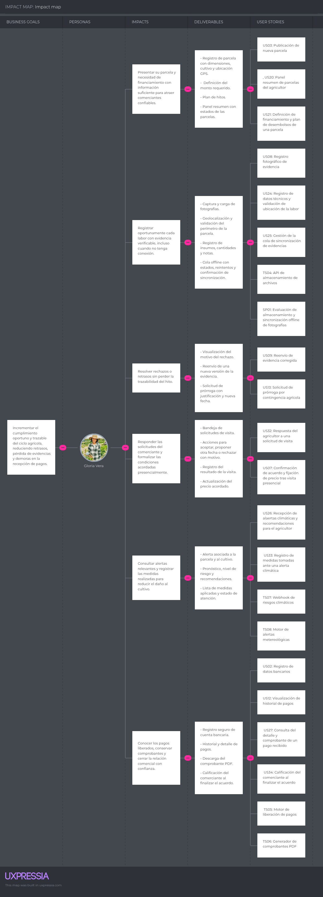

<strong>Figura 16.</strong> Impact Mapping agricultor

#### Impact Mapping - Comerciante

  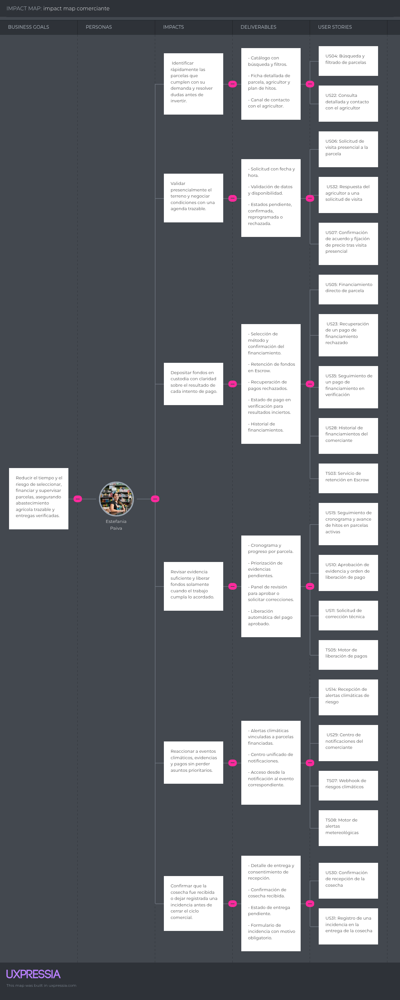

<strong>Figura 17.</strong> Impact map comerciante

### 2.4.3. Product Backlog

El Product Backlog de ALLPATEK reúne y prioriza todas las historias de usuario y tareas técnicas del proyecto. Siguiendo Scrum, los elementos se ordenan strictly por su valor de negocio para agricultores y comercializadores. Por ello, el Sprint 1 se enfoca en la Landing Page y en los módulos clave de búsqueda y negociación de parcelas, dejando la seguridad y autenticación para Sprints posteriores.

| Orden | User Story Id | Título | Story Points | Sprint |
| :---: | :--- | :--- | :---: | :---: |
| 1 | **US01** | Registro inicial de usuario | 3 | Sprint 1 |
| 2 | **US16** | Inicio de sesión y acceso según rol | 3 | Sprint 1 |
| 3 | **TS01** | API de Autenticación y JWT | 5 | Sprint 1 |
| 4 | **TS02** | Middleware de autorización (RBAC) | 5 | Sprint 1 |
| 5 | **US17** | Recuperación segura de contraseña | 3 | Sprint 1 |
| 6 | **US18** | Recorrido de bienvenida según el rol | 2 | Sprint 1 |
| 7 | **US19** | Consulta y actualización del perfil y preferencias | 3 | Sprint 1 |
| 8 | **US02** | Registro de datos bancarios | 3 | Sprint 1 |
| 9 | **US03** | Publicación de nueva parcela | 5 | Sprint 2 |
| 10 | **US21** | Definición de financiamiento y plan de desembolsos de una parcela | 5 | Sprint 2 |
| 11 | **US20** | Panel resumen de parcelas del agricultor | 3 | Sprint 2 |
| 12 | **US04** | Búsqueda y filtrado de parcelas | 5 | Sprint 2 |
| 13 | **US22** | Consulta detallada y contacto con el agricultor | 3 | Sprint 2 |
| 14 | **TS03** | Servicio de retención en Escrow | 5 | Sprint 3 |
| 15 | **US05** | Financiamiento directo de parcela | 5 | Sprint 3 |
| 16 | **US23** | Recuperación de un pago de financiamiento rechazado | 5 | Sprint 3 |
| 17 | **US35** | Seguimiento de un pago de financiamiento en verificación | 5 | Sprint 3 |
| 18 | **US28** | Historial de financiamientos del comerciante | 3 | Sprint 3 |
| 19 | **US06** | Solicitud de visita presencial a la parcela | 5 | Sprint 4 |
| 20 | **US32** | Respuesta del agricultor a una solicitud de visita | 5 | Sprint 4 |
| 21 | **US07** | Confirmación de acuerdo y fijación de precio tras visita presencial | 5 | Sprint 4 |
| 22 | **US15** | Seguimiento de cronograma y avance de hitos en parcelas activas | 5 | Sprint 4 |
| 23 | **US13** | Solicitud de prórroga por contingencia agrícola | 3 | Sprint 4 |
| 24 | **SP01** | Evaluación de almacenamiento y sincronización offline de fotografías | 5 | Sprint 5 |
| 25 | **TS04** | API de almacenamiento de archivos | 5 | Sprint 5 |
| 26 | **US08** | Registro fotográfico de evidencia | 5 | Sprint 5 |
| 27 | **US24** | Registro de datos técnicos y validación de ubicación de la labor | 5 | Sprint 5 |
| 28 | **US09** | Reenvío de evidencia corregida | 3 | Sprint 5 |
| 29 | **US25** | Gestión de la cola de sincronización de evidencias | 5 | Sprint 5 |
| 30 | **US10** | Aprobación de evidencia y orden de liberación de pago | 5 | Sprint 6 |
| 31 | **US11** | Solicitud de corrección técnica | 5 | Sprint 6 |
| 32 | **TS05** | Motor de liberación de pagos | 5 | Sprint 6 |
| 33 | **US12** | Visualización de historial de pagos | 3 | Sprint 6 |
| 34 | **US27** | Consulta del detalle y comprobante de un pago recibido | 3 | Sprint 6 |
| 35 | **TS06** | Generador de comprobantes PDF | 3 | Sprint 6 |
| 36 | **US29** | Centro de notificaciones del comerciante | 3 | Sprint 6 |
| 37 | **TS07** | Webhook de riesgos climáticos | 5 | Sprint 7 |
| 38 | **TS08** | Motor de alertas meteorológicas | 5 | Sprint 7 |
| 39 | **US14** | Recepción de alertas climáticas de riesgo | 3 | Sprint 7 |
| 40 | **US26** | Recepción de alertas climáticas y recomendaciones para el agricultor | 5 | Sprint 7 |
| 41 | **US33** | Registro de medidas tomadas ante una alerta climática | 3 | Sprint 7 |
| 42 | **US30** | Confirmación de recepción de la cosecha | 5 | Sprint 7 |
| 43 | **US31** | Registro de una incidencia en la entrega de cosecha | 5 | Sprint 7 |
| 44 | **US34** | Calificación del comerciante al finalizar el acuerdo | 2 | Sprint 7 |

<strong>Tabla 62.</strong> Product Backlog — Orden, User Story Id, Título

  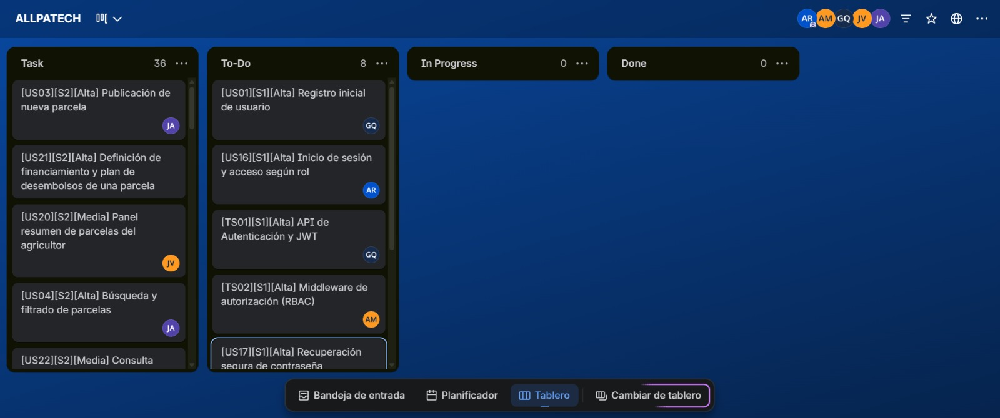

[Tablero de Trello - Allpatech](https://trello.com/b/dijipklh/allpatech)

## 2.5. Strategic-Level Domain-Driven Design

### 2.5.1. EventStorming

En esta sección se documenta el EventStorming realizado por el equipo de Allpatech para modelar el dominio de la plataforma Muyu. Esta dinámica permitió mapear los eventos clave del dominio, los comandos accionados por los actores (Productor Agrícola y Comerciante, los puntos de dolor operacionales y las integraciones con sistemas externos como la Bóveda Escrow, el motor n8n y la API de OpenWeather.

#### 2.5.1.1. Candidate Context Discovery

A partir del modelo general de dominio obtenido en la sesión de EventStorming, el equipo realizó la actividad de **Candidate Context Discovery** con una duración aproximada de 2 horas. Para delimitar los *Bounded Contexts* del sistema, se aplicaron de manera combinada las técnicas de **Look-for-Pivotal-Events** (identificación de eventos clave que marcan transiciones de estado) y **Start-with-Value** (agrupación de conceptos centrada en las capacidades *core* del negocio).

A continuación, se detalla la evolución progresiva del dominio a través de las evidencias del tablero:

#### Paso 1: Mapeo y Descomposición del Timeline de Procesos

En la primera etapa se organizó la línea de tiempo del proceso de negocio, dividiendo las acciones, comandos, agregados y sistemas externos en 7 bloques secuenciales:

  

<strong>Figura 21.</strong> Mapeo y Descomposición del Timeline de Procesos

1. **Financiación de parcelas:** Negociación y acuerdo inicial entre el agricultor y el comerciante.
2. **Custodia de capital en depósito en garantía:** Proceso de retención de fondos en la pasarela Escrow.
3. **Liberación de pago en depósito en garantía:** Reglas financieras para la transferencia parcial de capital.
4. **Ejecución de labores agrícolas:** Seguimiento de las actividades operativas en el campo.
5. **Presentación de pruebas:** Captura, almacenamiento y adjunto de evidencias fotográficas.
6. **Revisión y corrección de hitos:** Evaluación de la calidad del trabajo y gestión de correcciones por parte del comerciante.
7. **Monitoreo de riesgos climáticos:** Captura de datos meteorológicos y evaluación de alertas de riesgo.

---

#### Paso 2: Delimitación Preliminar e Identificación de Eventos Pivote

En esta fase se trazaron los primeros límites candidateando agrupaciones de subprocesos donde se detectaron eventos pivote (cambios significativos de estado o de responsabilidad operativa).

  

<strong>Figura 22.</strong> Delimitación Preliminar e Identificación de Eventos Pivote

Se identificó de manera temprana la frontera que separa la administración y validación previa del terreno (**Registro y Aprobación de la Parcela**) de los flujos transaccionales y de ejecución que suceden con posterioridad.

---

#### Paso 3: Consolidación e Interconexión de Bounded Contexts

En la etapa final, el equipo refinó las agrupaciones hasta definir los **5 Bounded Contexts principales** de la plataforma, modelando los flujos de comunicación e intercambio de eventos de dominio entre ellos:

  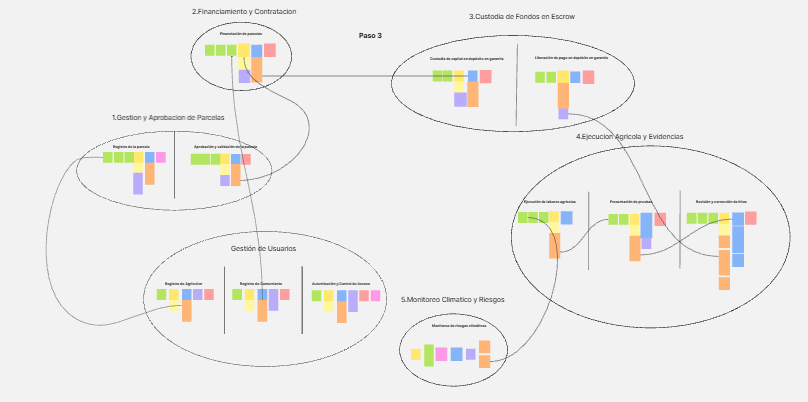

<strong>Figura 23.</strong> Consolidación e Interconexión de Bounded Contexts

1. **Gestión y Aprobación de Parcelas (*Parcel Management Service*):** Bounded Context enfocado en el catálogo de terrenos, geolocalización por coordenadas GPS, tipo de suelo y estado de disponibilidad de la parcela.
2. **Financiamiento y Contratación (*Agreements / Contract Service*):** Bounded Context responsable de gestionar las ofertas de abastecimiento, la negociación de volúmenes y la formalización de contratos agrícolas digitales.
3. **Custodia de Fondos en Escrow (*Escrow & Payments Service*):** Bounded Context encargado de la integración con pasarelas financieras para la retención en garantía de capital y las órdenes de desembolso parcial por hito.
4. **Ejecución Agrícola y Evidencias (*Tracking & Evidence Service*):** Bounded Context dedicado a la captura/sincronización offline de fotos georreferenciadas, revisión de entregables y aprobación o rechazo de hitos agrícolas.
5. **Monitoreo Climático y Riesgos (*Alerts Management Service*):** Bounded Context encargado de la ingesta de datos desde APIs externas (OpenWeather) para la emisión y distribución de alertas climáticas preventivas.

   
#### 2.5.1.2. Domain Message Flows Modeling

Para representar cómo interactúan los *Bounded Contexts* con los actores del sistema frente a escenarios reales de negocio, el equipo aplicó **Domain Storytelling**. Esta metodología conecta visualmente a los **Actores** (Agricultor, Comerciante, OpenWeather API), **Comandos** (cajas azules), **Datos de Trabajo** (notas amarillas), **Bounded Contexts** (nubes) y **Estados Resultantes** (cajas naranjas).

A continuación, se documenta la colaboración distribuida en tres vistas clave del proceso:

#### Vista 1: Registro, Catálogo y Contratación

Modela el proceso desde el alta del terreno hasta la solicitud del contrato comercial:

  

<strong>Figura 24.</strong> Vista 1: Registro, Catálogo y Contratación — flows 01

1. **Registrar Parcela:** El agricultor ingresa datos del terreno (área, ubicación GPS, fotos) desde la App Móvil.
2. **Validar Parcela:** La App envía la información al Bounded Context de *Gestión de Parcelas*.
3. **Parcela Publicada:** Tras validarse, se activa el estado para mostrar el lote en el catálogo público.
4. **Consultar Catálogo:** El comerciante busca parcelas aplicando filtros de búsqueda en la app.
5. **Solicitar Financiamiento:** El comerciante elige una parcela e inicia una propuesta de abastecimiento.
6. **Solicitar Contrato:** La App remite la oferta formal al contexto de *Financiamiento y Contratación*.
7. **Parcela Reservada:** Se bloquea la oferta en el catálogo y se notifica a *Custodia Escrow* para habilitar el depósito.

---

#### Vista 2: Custodia Escrow y Trabajo de Campo

Modela la retención del capital en garantía y el registro de evidencias en el campo:

  

<strong>Figura 25.</strong> Vista 2: Custodia Escrow y Trabajo de Campo — flows 02

1. **Depositar Capital:** El comerciante transfiere los fondos requeridos hacia el Bounded Context de *Custodia Escrow*.
2. **Contrato Activado:** Confirmado el depósito, se emite el estado de activación del acuerdo agrícola.
3. **Capturar Evidencias:** El agricultor toma fotos con metadatos GPS/fecha (soporta modo offline en la app).
4. **Enviar Evidencias:** La App Móvil sincroniza los datos al Bounded Context de *Ejecución y Evidencias*.
5. **Evidencias Presentadas:** Se notifica al comerciante la existencia de entregables pendientes de auditoría.

---

#### Vista 3: Auditoría, Desembolso y Clima

Modela la aprobación de entregables, la liberación de pagos y la notificación preventiva de alertas meteorológicas:

  

<strong>Figura 26.</strong> Vista 3: Auditoría, Desembolso y Clima — flows 03

1. **Aprobar Hito:** El comerciante evalúa las pruebas recibidas desde la App Móvil y emite su conformidad.
2. **Procesar Aprobación:** La App comunica la decisión al Bounded Context de *Ejecución y Evidencias*.
3. **Hito Aprobado:** El sistema consolida la validación técnica de la etapa de cultivo.
4. **Liberar Pago:** Se dispara la orden hacia *Custodia Escrow* para transferir el porcentaje parcial correspondiente al agricultor.
5. **Anomalía Detectada:** *OpenWeather API* transmite métricas climáticas críticas al Bounded Context de *Monitoreo Climático*.
6. **Notificar Alerta:** El contexto calcula las parcelas afectadas dentro del radio de riesgo y envía el aviso a la app.
7. **Mostrar Alerta:** La App Móvil despliega alertas preventivas con recomendaciones operativas en tiempo real.

#### 2.5.1.3. Bounded Context Canvases

En esta sección, el equipo diseña sus *candidate bounded contexts*, detallando sus criterios de diseño clave. A continuación, se presentan los Bounded Context Canvases elaborados para la solución, ordenados por su importancia estratégica dentro del sistema:

#### 1. Custodia de Fondos en Escrow (*Core Domain*)

  

<strong>Figura .</strong> Custodia de Fondos en Escrow (*Core Domain*) — bounded 03

* **Descripción:** Administrar la retención de capital en garantía y la ejecución de desembolsos parciales irreversibles tras la aprobación de cada hito.
* **Clasificación Estratégica:** Domain: *Core* | Business Model: *Revenue / Cost Reduction* | Evolution: *Product*.
* **Entradas y Salidas:** Recibe peticiones de depósito y liberación de fondos; emite notificaciones de fondos retenidos, contrato activado y pagos liberados hacia la App Móvil y el Agricultor.

---

#### 2. Ejecución Agrícola y Evidencias (*Core Domain*)

  

<strong>Figura .</strong> Ejecución Agrícola y Evidencias (*Core Domain*) — bounded 04

* **Descripción:** Gestionar el calendario de actividades en campo, la captura offline de evidencias fotográficas georreferenciadas y la revisión/aprobación de hitos.
* **Clasificación Estratégica:** Domain: *Core* | Business Model: *Engagement* | Evolution: *Custom Built*.
* **Entradas y Salidas:** Recibe datos de capturas de pruebas en campo y solicitudes de revisión de hitos; emite estados de evidencia registrada, hito aprobado y correcciones solicitadas.

---

#### 3. Financiamiento y Contratación (*Supporting Domain*)

  

<strong>Figura .</strong> Financiamiento y Contratación (*Supporting Domain*) — bounded 02

* **Descripción:** Permitir explorar el catálogo de parcelas aprobadas, simular rendimientos, negociar condiciones comerciales y formalizar contratos digitales.
* **Clasificación Estratégica:** Domain: *Supporting* | Business Model: *Engagement* | Evolution: *Custom Built*.
* **Entradas y Salidas:** Recibe solicitudes de financiamiento y emisión de contratos desde la App Móvil; emite avisos de parcela reservada y propuesta aceptada hacia la custodia Escrow.

---

#### 4. Gestión y Aprobación de Parcelas (*Supporting Domain*)

  

<strong>Figura .</strong> Gestión y Aprobación de Parcelas (*Supporting Domain*) — bounded 01

* **Descripción:** Registrar parcelas agrícolas mediante georreferenciación GPS, validar la documentación de propiedad y publicar terrenos aptos en el catálogo público.
* **Clasificación Estratégica:** Domain: *Supporting* | Business Model: *Engagement* | Evolution: *Custom Built*.
* **Entradas y Salidas:** Recibe solicitudes de registro, delimitación geográfica y validación de terrenos; emite notificaciones de parcela aprobada y publicada.

---

#### 5. Monitoreo Climático y Riesgos (*Generic Domain*)

  

<strong>Figura .</strong> Monitoreo Climático y Riesgos (*Generic Domain*) — bounded 05

* **Descripción:** Recopilar datos meteorológicos externos en tiempo real, evaluar patrones de riesgo climático y emitir alertas preventivas automáticas hacia los usuarios.
* **Clasificación Estratégica:** Domain: *Generic* | Business Model: *Cost Reduction* | Evolution: *Commodity*.
* **Entradas y Salidas:** Ingiere datos climáticos de la API externa (OpenWeather) y consultas de pronóstico; emite alertas automáticas de riesgo detectado hacia la App Móvil y los usuarios.

---

#### 6. Gestión de Usuarios (Generic Domain)

  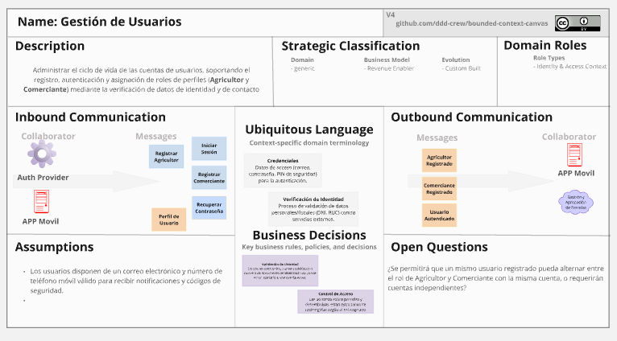

<strong>Figura .</strong> Gestión de Usuarios (*Generic Domain*) — bounded 06

- **Descripción:** Administrar el ciclo de vida de cuentas, registro, autenticación y asignación de roles (Agricultor y Comerciante) mediante la verificación de identidad.
- **Clasificación Estratégica:** Domain: *Generic* | Business Model: *Revenue Enabler* | Evolution: *Custom Built*.
- **Entradas y Salidas:** Recibe peticiones de registro, inicio de sesión y recuperación de clave desde Auth Provider y la App Móvil; emite notificaciones de usuario registrado y autenticado hacia la App Móvil y Gestión de Parcelas.

### 2.5.2. Context Mapping

En esta sección se documenta el proceso de elaboración del mapa de contextos (*Context Map*), evaluando cómo se relacionan y comunican los diferentes *Bounded Contexts* de la aplicación **MUYU**. Para ello, el equipo revisó la información obtenida durante las sesiones de *EventStorming* y exploró activamente diferentes alternativas de diseño mediante preguntas de arquitectura, considerando los patrones de integración establecidos por Domain-Driven Design (DDD).

## 1. Contextos Acotados Identificados (Bounded Contexts)

A partir de los grupos de capacidades identificados en la fase de exploración del negocio, se establecieron los siguientes *Bounded Contexts*:

1. **Gestión de Usuarios y Acceso:** Registro de agricultores y comerciantes, gestión de credenciales, roles y autenticación.
2. **Gestión y Aprobación de Parcelas:** Geolocalización, catastro, validación documental y verificación del estado registral de los terrenos.
3. **Financiamiento y Contratación:** Catálogo de parcelas disponibles, propuestas de inversión,
4. **Custodia de Fondos en Escrow:** Retención de capital en depósito en garantía y liberación condicionada al cumplimiento de hitos.
5. **Ejecución Agrícola y Evidencias:** Monitoreo del ciclo de cultivo, sincronización *offline-first* de labores en campo, alertas meteorológicas y registro fotográfico de pruebas.
6. **Revisión y Aprobación de Hitos:** Evaluación de evidencias presentadas por el agricultor, atención de observaciones y aprobación de hitos para desembolso.

## 2. Proceso de Elaboración y Evaluación de Candidatos

El equipo analizó múltiples alternativas de diseño respondiendo a preguntas clave sobre cómo organizar y aislar las capacidades (*capabilities*) del sistema:

### Candidato A: Unificación de Parcelas y Financiamiento

* **Pregunta evaluada:** *¿Qué pasaría si tomamos las capacidades de gestión de parcelas y financiamiento y las agrupamos en un único Bounded Context?*
* **Análisis:** Aunque el financiamiento se realiza sobre una parcela específica, agrupar la validación legal/registral del terreno con el cálculo de rendimientos y contratos financieros generaba un contexto muy grande e inestable. La validación registral de la tierra cambia con menor frecuencia y bajo reglas legales distintas a los acuerdos comerciales de inversión.
* **Decisión:** **Descartado.** Se mantuvieron como contextos independientes (*Gestión y Aprobación de Parcelas* y *Financiamiento y Contratación*).

### Candidato B: Descomposición de la Ejecución Agrícola y la Revisión de Hitos
* **Pregunta evaluada:** *¿Qué pasaría si descomponemos el capability de ejecución agrícola y movemos la revisión de evidencias a un Bounded Context independiente?*
* **Análisis:** La ejecución agrícola opera principalmente *offline-first* en dispositivos móviles en campo, mientras que la revisión de hitos es una tarea de evaluación ejecutada por el comerciante o inversor. Descomponer esta capacidad evita que la indisponibilidad de la red en la revisión afecte el trabajo diario del agricultor en el campo.
* **Decisión:** **Aprobado.** Se separaron en *Ejecución Agrícola y Evidencias* (captura en campo) y *Revisión y Aprobación de Hitos* (gestión administrativa de cumplimiento).

### Candidato C: Aislamiento del Core Capability de Custodia de Fondos (Escrow)
* **Pregunta evaluada:** *¿Qué pasaría si aislamos los core capabilities financieros y creamos un Bounded Context dedicado para el Escrow en lugar de un shared service genérico de pagos?*
* **Análisis:** La retención de capital y el desembolso condicionado por hito requieren reglas de inmutabilidad y auditoría estrictas. Un servicio compartido de pagos diluiría estas reglas y expondría lógica financiera crítica a otros contextos.
* **Decisión:** **Aprobado.** Se definió el *Bounded Context de Custodia de Fondos en Escrow*, aislado de la lógica de contratación e integrado exclusivamente mediante eventos de dominio asíncronos (`HitoAprobado`).

### Candidato D: Integración de Datos Meteorológicos con Capa Anticorrupción (ACL)
* **Pregunta evaluada:** *¿Qué pasaría si integramos un proveedor externo para las capacidades de clima y alertas meteorológicas en lugar de implementarlo internamente?*
* **Análisis:** La plataforma requiere alertas meteorológicas en tiempo real para alertar al agricultor. Se decidió consumir una API externa de clima (como OpenWeather API). Para evitar que los esquemas JSON de terceros contaminen nuestro dominio, se implementa una capa de traducción.

  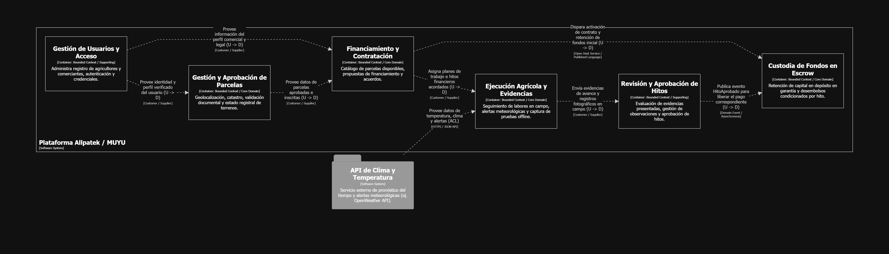

### 2.5.3. Software Architecture

Para entender cómo se relaciona la aplicación móvil MUYU con su entorno, el diagrama de contexto (Nivel 1 C4) ubica la app en el centro del flujo operacional. A su alrededor se muestran los usuarios principales el Productor Agrícola en campo y el Comercializador junto con los servicios externos que respaldan la operación: el pronóstico del clima en tiempo real, la automatización de notificaciones y la pasarela de custodia financiera.

#### 2.5.3.1. Software Architecture Context Level Diagrams

Este diagrama de contexto ilustra cómo la aplicación móvil MUYU interactúa de forma general con los usuarios en campo y los servicios externos del sistema.

  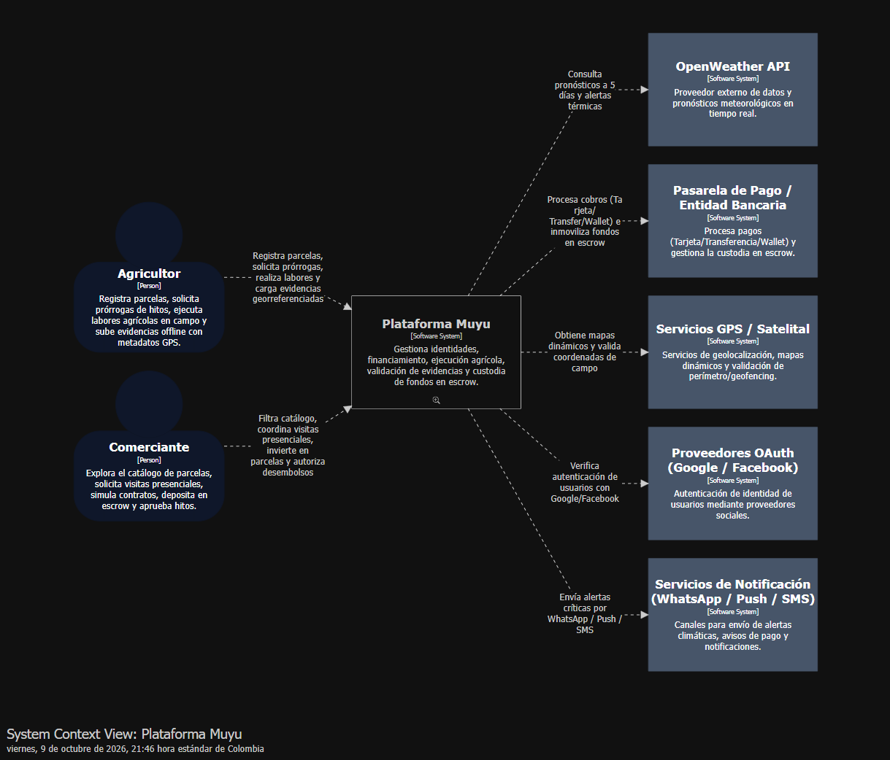

<strong>Figura 33.</strong> Software Architecture Context Level Diagrams — context level

#### 2.5.3.2. Software Architecture Container Level Diagrams

Este diagrama de contenedores muestra los bloques tecnológicos internos de MUYU, destacando la aplicación cliente, su base de datos local para modo offline y los microservicios backend.

 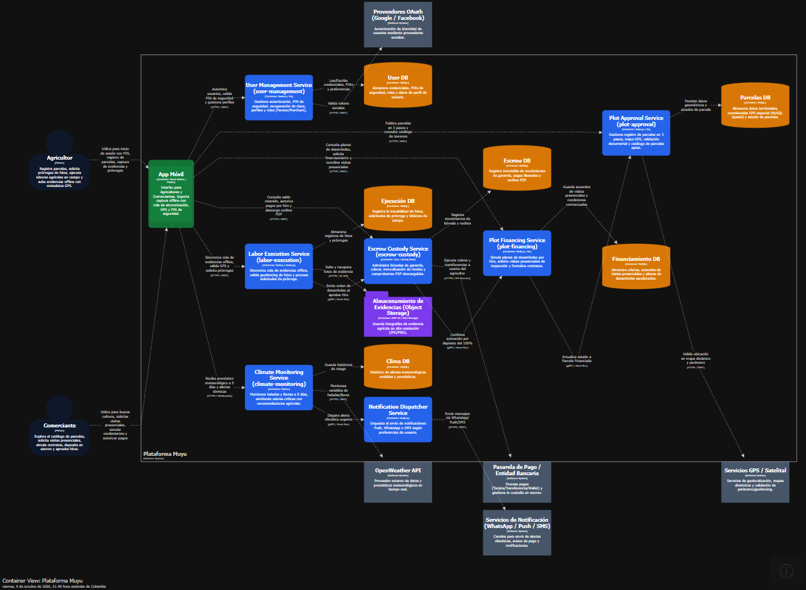

<strong>Figura 34.</strong> Software Architecture Container Level Diagrams — container level

#### 2.5.3.3. Software Architecture Deployment Diagrams

Este diagrama de despliegue representa la infraestructura física y en la nube donde se ejecuta la aplicación móvil y se conectan sus servidores.

 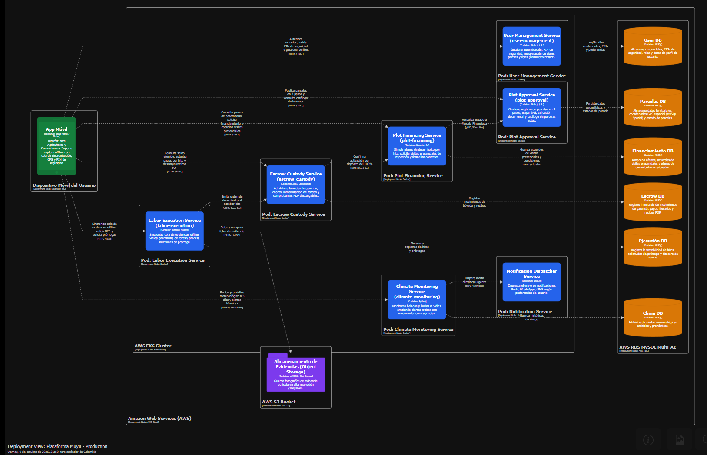

<strong>Figura 35.</strong> Software Architecture Deployment Diagrams — deployment level

## 2.6. Tactical-Level Domain-Driven Design
### 2.6.1. Bounded Context: Gestión y Aprobación de Parcelas Service
Representa la capacidad del sistema encargada de registrar, validar espacialmente y catalogar las parcelas agrícolas. Su propósito es asegurar que los terrenos cuenten con georreferenciación GPS válida antes de ser publicados en el catálogo público para su financiamiento. La entidad principal es `Parcel`, la cual concentra las reglas de negocio del terreno y sus límites geográficos.
#### 2.6.1.1. Domain Layer

La capa de dominio contiene el núcleo de las reglas espaciales y de disponibilidad de terrenos.

* **Aggregate Root:** `Parcel` (Atributos: id, farmerId, name, area, soilType, status, createdAt).
* **Entities:** `GPSBoundary` (Polígono delimitador del terreno).
* **Value Objects:** `Hectare` (Extensión numérica), `GPSCoordinate` (Latitud y longitud), `ParcelStatus` (Enum: DRAFT, PENDING_APPROVAL, AVAILABLE, RESERVED), `SoilType` (Enum: CLAY, SANDY, LOAMY, SILTY).
* **Commands:** `RegisterParcelCommand`, `ApproveParcelCommand`, `PublishParcelCommand`.
* **Queries:** `GetAvailableParcelsQuery`, `GetParcelByIdQuery`.
* **Domain Events:** `ParcelRegisteredEvent`, `ParcelApprovedEvent`, `ParcelPublishedEvent`.
* **Reglas de negocio:** Una parcela no puede ser publicada si no cuenta con al menos 3 coordenadas GPS que formen un polígono cerrado. No puede cambiar a estado disponible si sus coordenadas se superponen con otra parcela existente.

#### 2.6.1.2. Interface Layer

Contiene los controladores que exponen los servicios de catálogo y registro al frontend móvil de Muyu.

* **REST Controllers:** `ParcelsController`, `CatalogController`.
* **Endpoints:** `POST /api/v1/parcels`, `PUT /api/v1/parcels/{id}/approve`, `GET /api/v1/catalog/parcels`.
* **DTOs:** `RegisterParcelResource`, `ParcelSummaryResource`, `BoundaryPointResource`.
* **Assemblers:** Transforma recursos HTTP en comandos del dominio (ej. `RegisterParcelCommandFromResourceAssembler`).

#### 2.6.1.3. Application Layer

Coordina los flujos de alta de terrenos y consultas de catálogo.

* **Command Services:** `ParcelCommandServiceImpl` (Valida geometría, estructura los límites y guarda la parcela).
* **Query Services:** `CatalogQueryServiceImpl`.
* **Flujo principal:** El agricultor envía los datos desde la app móvil; el `ParcelCommandService` valida el polígono con el servicio GPS externo. Si es correcto, guarda la entidad `Parcel`, cambia el estado a "PENDING_APPROVAL" y dispara un evento para su revisión final.

#### 2.6.1.4. Infrastructure Layer

Gestiona la persistencia espacial y la integración con validadores de mapas.

* **Repositories:** `ParcelRepository` (extiende JpaRepository o similar con soporte espacial), `GPSBoundaryRepository`.
* **Adapters:** `GeospatialValidationAdapter` (comunicación REST con servicios de mapas satelitales).
* **Persistencia:** Tablas `parcels` y `parcel_boundaries` con llaves foráneas y restricciones de integridad.

#### 2.6.1.5. Bounded Context Software Architecture Component Level Diagrams

Este diagrama detalla la arquitectura interna a nivel de componentes para el contexto **Gestión y Aprobación de Parcelas**, aplicando el patrón CQRS (separación de operaciones de lectura y escritura) y la inyección de dependencias a través de las capas de Interfaz, Aplicación, Dominio e Infraestructura.

  

<strong>Figura 36.</strong> Bounded Context Software Architecture Component Level Diagrams — level diagrams contract parcel

#### 2.6.1.6. Bounded Context Software Architecture Code Level Diagrams
##### 2.6.1.6.1. Bounded Context Domain Layer Class Diagrams
Este diagrama muestra el modelo de clases de la capa de dominio, destacando el Aggregate Root principal (`Parcel`) y cómo interactúa con los servicios de comando y consulta (CQRS).

  

<strong>Figura 37.</strong> Bounded Context Domain Layer Class Diagrams — class diagram contract parcel

##### 2.6.1.6.2. Bounded Context Database Design Diagram
Este diagrama relacional conectando `parcels` y `parcel_boundaries`, donde cada límite geográfico pertenece a una parcela, garantizando la trazabilidad espacial del terreno.

  

<strong>Figura 38.</strong> Bounded Context Database Design Diagram — db diagram contract parcel

### 2.6.2. Bounded Context: Financiamiento y Contratación Service
Representa la capacidad del sistema encargada de gestionar la exploración del catálogo de parcelas, la generación de propuestas de financiamiento, la negociación de condiciones y la formalización de contratos digitales de abastecimiento. La entidad principal es `Agreement`, la cual concentra las reglas de negocio del acuerdo entre el agricultor y el comerciante.

#### 2.6.2.1. Domain Layer

La capa de dominio contiene las reglas de estructuración de los acuerdos y la validación de los planes de desembolso.

* **Aggregate Root:** `Agreement` (Atributos: id, parcelId, merchantId, totalAmount, status, signatureDate).
* **Entities:** `DisbursementPlan` (Etapas o hitos del plan de pagos).
* **Value Objects:** `Money` (Monto y moneda), `AgreementStatus` (Enum: DRAFT, PENDING_SIGNATURE, SIGNED, ACTIVE, CANCELLED).
* **Commands:** `CreateAgreementCommand`, `SignAgreementCommand`, `CancelAgreementCommand`.
* **Queries:** `GetAgreementDetailsQuery`, `GetMerchantAgreementsQuery`.
* **Domain Events:** `AgreementSignedEvent`, `AgreementActivatedEvent`.
* **Reglas de negocio:** El plan de desembolsos (`DisbursementPlan`) asociado al contrato debe sumar exactamente el 100% del `totalAmount` para que el acuerdo sea válido. La firma del contrato requiere un token de validación de identidad.

#### 2.6.2.2. Interface Layer
Contiene los controladores que exponen los servicios de negociación y contratos al frontend móvil.

* **REST Controllers:** `AgreementsController`.
* **Endpoints:** `POST /api/v1/agreements`, `PUT /api/v1/agreements/{id}/sign`, `GET /api/v1/merchants/{id}/agreements`.
* **DTOs:** `CreateAgreementResource`, `SignatureResource`, `AgreementSummaryResource`.
* **Assemblers:** Transforma recursos HTTP en comandos del dominio (ej. `CreateAgreementCommandFromResourceAssembler`).

#### 2.6.2.3. Application Layer
Coordina los flujos de creación, negociación y firma digital de los acuerdos comerciales.

* **Command Services:** `AgreementCommandServiceImpl` (Estructura los hitos del acuerdo, valida los porcentajes de desembolso y gestiona el estado de firma).
* **Query Services:** `AgreementQueryServiceImpl`.
* **Flujo principal:** El comerciante selecciona una parcela y genera un acuerdo. Una vez que ambas partes lo firman digitalmente, el servicio cambia el estado a "SIGNED" y emite un `AgreementSignedEvent` para que el servicio de Escrow inicie la creación de la bóveda de retención.

#### 2.6.2.4. Infrastructure Layer
Gestiona la persistencia de los contratos y la publicación de eventos al bus de mensajes.

* **Repositories:** `AgreementRepository` (extiende JpaRepository), `DisbursementPlanRepository`.
* **Adapters:** `SignatureValidationAdapter` (Validación de tokens), `EventBusPublisherAdapter` (gRPC / RabbitMQ para notificar a otros Bounded Contexts).
* **Persistencia:** Tablas `agreements` y `disbursement_plans` con llaves foráneas y restricciones de integridad.

#### 2.6.2.5. Bounded Context Software Architecture Component Level Diagrams
Este diagrama detalla la arquitectura interna a nivel de componentes para el contexto **Financiamiento y Contratación**, aplicando el patrón CQRS (separación de operaciones de lectura y escritura) y la inyección de dependencias a través de las capas de Interfaz, Aplicación, Dominio e Infraestructura.

  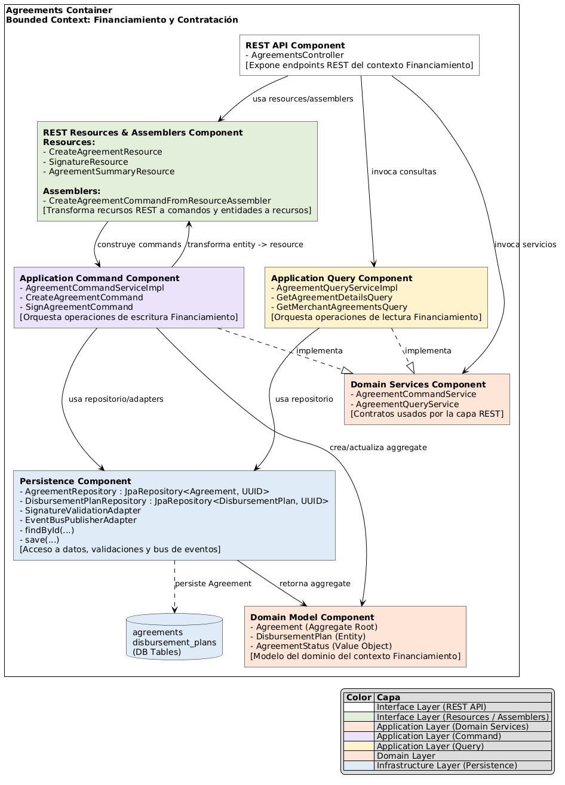

<strong>Figura 39.</strong> Bounded Context Software Architecture Component Level Diagrams — level diagrams contract financiamiento

#### 2.6.2.6. Bounded Context Software Architecture Code Level Diagrams
##### 2.6.2.6.1. Bounded Context Domain Layer Class Diagrams
Este diagrama muestra el modelo de clases de la capa de dominio, destacando el Aggregate Root principal (`Agreement`) y cómo interactúa con los servicios de comando y consulta (CQRS).

  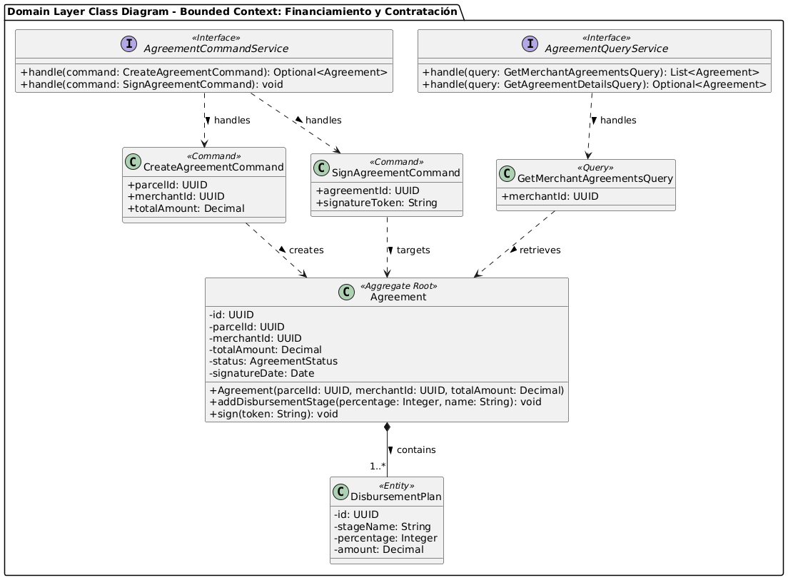

<strong>Figura 40.</strong> Bounded Context Domain Layer Class Diagrams — class diagram contract financiamiento

##### 2.6.2.6.2. Bounded Context Database Design Diagram

Este diagrama relacional conectando `agreements` y `disbursement_plans`, donde cada plan de pago por hito pertenece a un contrato comercial establecido.

  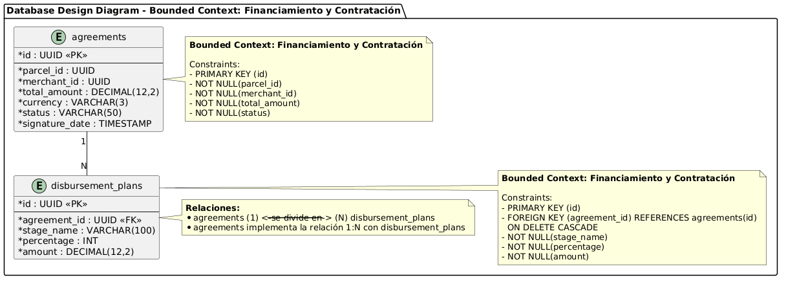

<strong>Figura 41.</strong> Bounded Context Database Design Diagram — db diagram contract financiamiento

### 2.6.3. Bounded Context: Custodia de Fondos en Escrow Service
Representa la capacidad del sistema encargada de administrar la retención de capital en bóvedas seguras de garantía y ejecutar desembolsos parciales irreversibles hacia el productor, únicamente tras la aprobación técnica de cada hito. Su propósito es garantizar la seguridad financiera del acuerdo. La entidad principal es `EscrowAccount`, la cual concentra el saldo retenido y el estado de la bóveda.

#### 2.6.3.1. Domain Layer
La capa de dominio contiene las reglas comerciales de retención y la lógica inmutable de la custodia de fondos.

* **Aggregate Root:** `EscrowAccount` (Atributos: id, agreementId, retainedBalance, totalFunded, status, createdAt).
* **Entities:** `PayoutRecord` (Registro de salida financiera o desembolso).
* **Value Objects:** `Money` (Monto y moneda), `EscrowStatus` (Enum: AWAITING_FUNDS, FUNDED, PARTIALLY_DISBURSED, FULLY_DISBURSED, DISPUTED).
* **Commands:** `FundEscrowCommand`, `ReleaseFundsCommand`.
* **Queries:** `GetEscrowBalanceQuery`.
* **Domain Events:** `EscrowFundedEvent`, `FundsReleasedEvent`.
* **Reglas de negocio:** Los fondos permanecen congelados e inmutables hasta recibir la señal explícita de aprobación de hito. El saldo retenido nunca puede ser negativo. El monto a liberar no puede exceder el balance actual de la bóveda.

#### 2.6.3.2. Interface Layer
Contiene los controladores que exponen los servicios de pagos y custodia al frontend móvil de Muyu.

* **REST Controllers:** `EscrowController`, `PayoutsController`.
* **Endpoints:** `POST /api/v1/escrow/fund`, `POST /api/v1/escrow/{id}/release`, `GET /api/v1/escrow/{id}/balance`.
* **DTOs:** `FundingRequestResource`, `PayoutSummaryResource`, `EscrowBalanceResource`.
* **Assemblers:** Transforma recursos HTTP en comandos del dominio (ej. `FundEscrowCommandFromResourceAssembler`).

#### 2.6.3.3. Application Layer
Coordina los flujos de ingreso de capital y las órdenes de desembolso progresivo.

* **Command Services:** `EscrowCommandServiceImpl` (Interactúa con la pasarela para inmovilizar o transferir fondos y actualiza la bóveda).
* **Query Services:** `EscrowQueryServiceImpl`.
* **Flujo principal:** Al recibir confirmación del depósito inicial desde la pasarela externa, se actualiza el estado a "FUNDED". Posteriormente, al recibir el evento de un hito aprobado desde el bus de mensajes, el servicio invoca a la pasarela bancaria para realizar la transferencia al agricultor y registra un `PayoutRecord`.

#### 2.6.3.4. Infrastructure Layer
Gestiona la persistencia de los registros financieros y la integración con entidades bancarias externas.

* **Repositories:** `EscrowAccountRepository` (extiende JpaRepository o similar), `PayoutRecordRepository`.
* **Adapters:** `EscrowPaymentGatewayAdapter` (comunicación REST con la pasarela de pagos), `EventBusSubscriberAdapter` (escucha eventos de otros contextos).
* **Persistencia:** Tablas `escrow_accounts` y `payout_records` con llaves foráneas y restricciones de integridad.

#### 2.6.3.5. Bounded Context Software Architecture Component Level Diagrams
Este diagrama detalla la arquitectura interna a nivel de componentes para el contexto **Custodia de Fondos en Escrow**, aplicando el patrón CQRS (separación de operaciones de lectura y escritura) y la inyección de dependencias a través de las capas de Interfaz, Aplicación, Dominio e Infraestructura.

  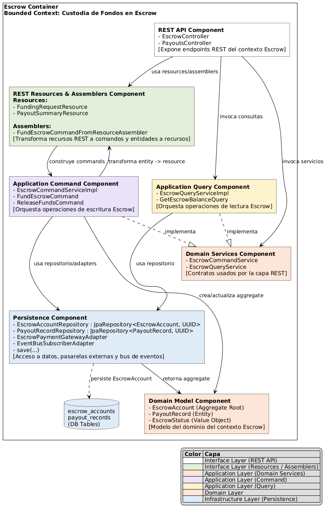

<strong>Figura 42.</strong> Bounded Context Software Architecture Component Level Diagrams — level diagrams contract escrow

#### 2.6.3.6. Bounded Context Software Architecture Code Level Diagrams
##### 2.6.3.6.1. Bounded Context Domain Layer Class Diagrams
Este diagrama muestra el modelo de clases de la capa de dominio, destacando el Aggregate Root principal (`EscrowAccount`) y cómo interactúa con los servicios de comando y consulta (CQRS).

  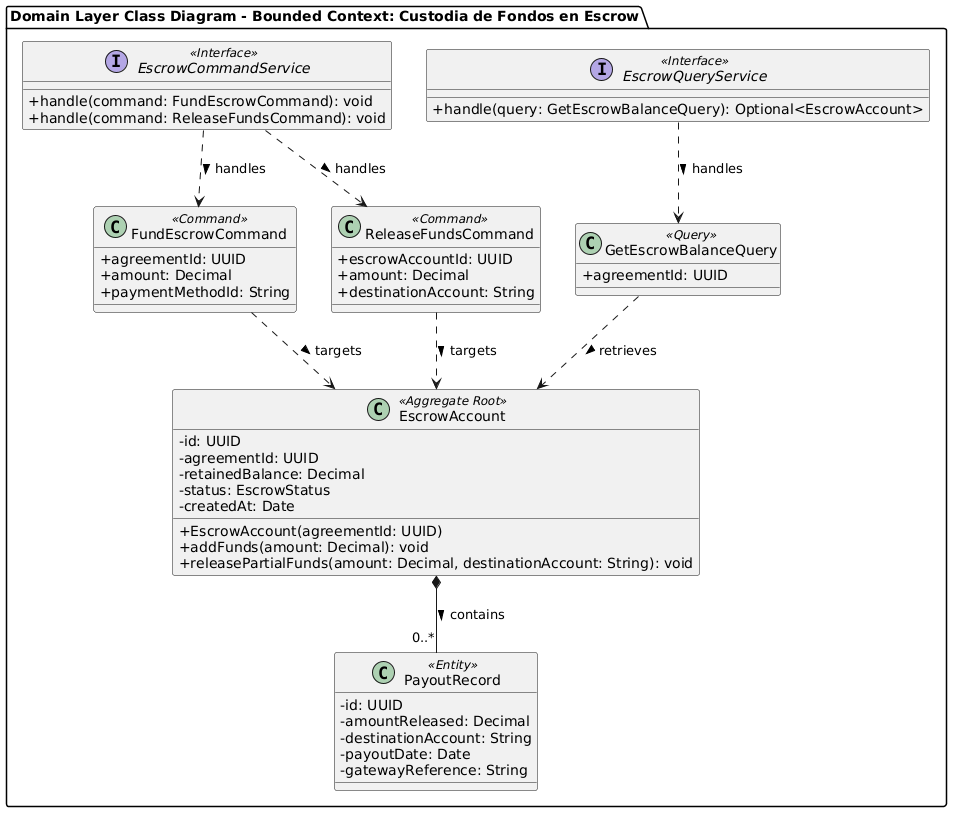

<strong>Figura 43.</strong> Bounded Context Domain Layer Class Diagrams — class diagram contract escrow

##### 2.6.3.6.2. Bounded Context Database Design Diagram
Este diagrama relacional conectando `escrow_accounts` y `payout_records`, donde cada registro de desembolso pertenece a una bóveda de retención, garantizando la trazabilidad de la custodia.

  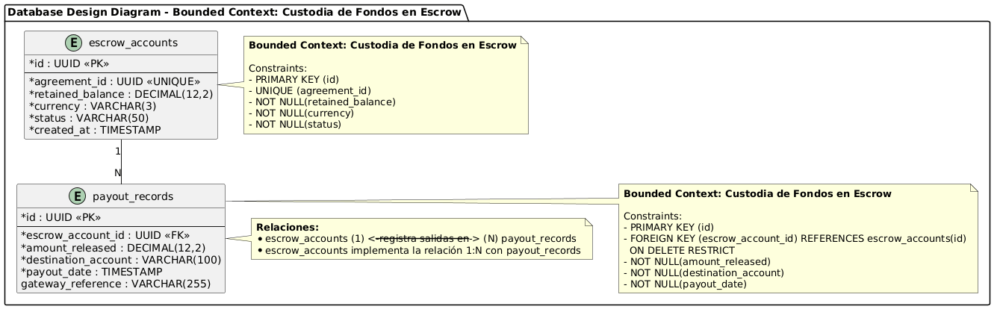

<strong>Figura 44.</strong> Bounded Context Database Design Diagram — db diagram contract escrow

### 2.6.4. Bounded Context: Ejecución Agrícola y Evidencias Service
Representa la capacidad del sistema encargada de gestionar el calendario de actividades en campo, la captura offline de fotografías georreferenciadas por parte del productor y la auditoría técnica de los hitos por parte del comerciante[cite: 26]. Su propósito es garantizar la trazabilidad visual y espacial del avance del cultivo. La entidad principal es `Milestone` (Hito), la cual concentra el progreso de cada etapa productiva.

#### 2.6.4.1. Domain Layer
La capa de dominio contiene el núcleo de las reglas de validación de evidencias y el control de estados del cultivo.

* **Aggregate Root:** `Milestone` (Atributos: id, agreementId, stageName, status, deadline, createdAt).
* **Entities:** `Evidence` (Fotografía de campo validada).
* **Value Objects:** `GPSMetadata` (Latitud y longitud de la captura), `Timestamp`, `MilestoneStatus` (Enum: PENDING, IN_REVIEW, APPROVED, REJECTED, CORRECTION_REQUESTED).
* **Commands:** `SubmitEvidenceCommand`, `ApproveMilestoneCommand`, `RejectMilestoneCommand`.
* **Queries:** `GetPendingMilestonesQuery`, `GetMilestoneEvidenceQuery`.
* **Domain Events:** `EvidenceSubmittedEvent`, `MilestoneApprovedEvent`, `MilestoneRejectedEvent`.
* **Reglas de negocio:** Toda evidencia fotográfica debe poseer metadatos GPS que coincidan, dentro de un margen de tolerancia espacial, con el perímetro de la parcela financiada. Un hito en estado "APPROVED" se vuelve inmutable y no acepta nuevas sumisiones de evidencia.

#### 2.6.4.2. Interface Layer
Contiene los controladores que exponen los servicios de carga de pruebas y auditoría al frontend móvil.

* **REST Controllers:** `MilestonesController`, `EvidencesController`.
* **Endpoints:** `POST /api/v1/milestones/{id}/evidences`, `PUT /api/v1/milestones/{id}/approve`, `PUT /api/v1/milestones/{id}/reject`.
* **DTOs:** `EvidenceUploadResource`, `MilestoneAuditResource`, `MilestoneSummaryResource`.
* **Assemblers:** Transforma recursos HTTP en comandos del dominio (ej. `SubmitEvidenceCommandFromResourceAssembler`).

#### 2.6.4.3. Application Layer
Coordina los flujos de recepción de imágenes y el proceso de revisión por parte del comprador.

* **Command Services:** `MilestoneCommandServiceImpl`, `EvidenceCommandServiceImpl` (Valida los metadatos espaciales y orquesta la subida del archivo al almacenamiento en la nube).
* **Query Services:** `MilestoneQueryServiceImpl`.
* **Flujo principal:** El agricultor captura y sincroniza la evidencia. El servicio valida los metadatos GPS, almacena la imagen en el cloud y cambia el estado del hito a "IN_REVIEW". Tras la revisión del comerciante, si este aprueba, se emite el evento `MilestoneApprovedEvent` que instruye al servicio de Escrow a liberar los fondos.

#### 2.6.4.4. Infrastructure Layer
Gestiona la persistencia de las etapas, el almacenamiento de objetos binarios (imágenes) y la validación cruzada.

* **Repositories:** `MilestoneRepository` (extiende JpaRepository o similar), `EvidenceRepository`.
* **Adapters:** `CloudStorageAdapter` (comunicación con AWS S3 / Firebase Storage para guardar imágenes en alta resolución), `SpatialValidationAdapter`.
* **Persistencia:** Tablas `milestones` y `evidences` con llaves foráneas y restricciones de integridad.

#### 2.6.4.5. Bounded Context Software Architecture Component Level Diagrams
Este diagrama detalla la arquitectura interna a nivel de componentes para el contexto **Ejecución Agrícola y Evidencias**, aplicando el patrón CQRS y la inyección de dependencias a través de las capas de Interfaz, Aplicación, Dominio e Infraestructura.

  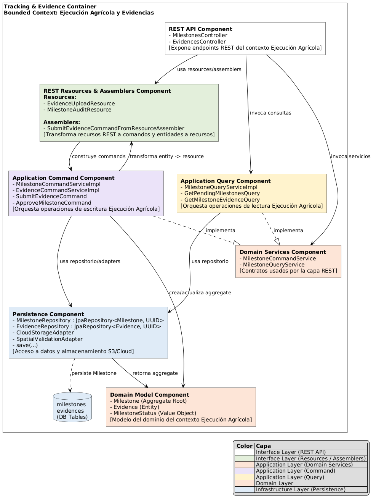

<strong>Figura 45.</strong> Bounded Context Software Architecture Component Level Diagrams — level diagrams contract milestones

#### 2.6.4.6. Bounded Context Software Architecture Code Level Diagrams
##### 2.6.4.6.1. Bounded Context Domain Layer Class Diagrams
Este diagrama muestra el modelo de clases de la capa de dominio, destacando el Aggregate Root principal (`Milestone`) y cómo interactúa con los servicios de comando y consulta (CQRS).

  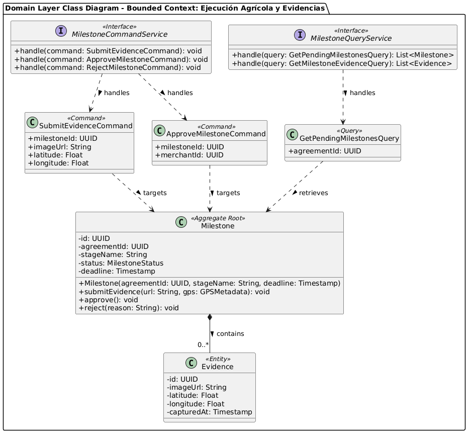

<strong>Figura 46.</strong> Bounded Context Domain Layer Class Diagrams

##### 2.6.4.6.2. Bounded Context Database Design Diagram
Este diagrama relacional conecta `milestones` y `evidences`, donde cada evidencia fotográfica pertenece a un hito productivo, garantizando la trazabilidad visual del cultivo.

  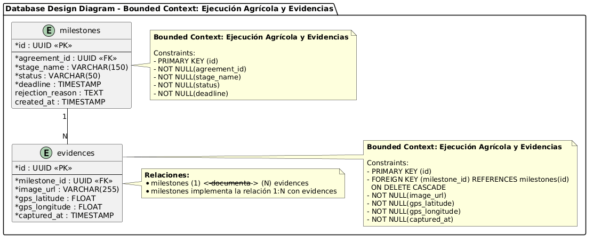

<strong>Figura 47.</strong> Bounded Context Database Design Diagram

### 2.6.5. Bounded Context: Monitoreo Climático y Riesgos Service
Representa la capacidad del sistema encargada de recopilar datos meteorológicos externos en tiempo real (OpenWeather API), evaluar patrones de riesgo climático y emitir alertas preventivas automáticas hacia los agricultores y comerciantes. Su propósito es mitigar el impacto de fenómenos adversos en el ciclo de cultivo. La entidad principal es `ClimateAlert`, la cual consolida las métricas de riesgo y el nivel de severidad.

#### 2.6.5.1. Domain Layer
La capa de dominio contiene el núcleo de las reglas de evaluación de umbrales climáticos y severidad.

* **Aggregate Root:** `ClimateAlert` (Atributos: id, parcelId, alertType, severity, issuedAt).
* **Value Objects:** `WeatherMetrics` (Temperatura, lluvia acumulada, humedad), `SeverityLevel` (Enum: LOW, MODERATE, HIGH, CRITICAL).
* **Commands:** `EvaluateWeatherCommand`.
* **Queries:** `GetAlertsByParcelQuery`.
* **Domain Events:** `RiskDetectedEvent`, `AlertDispatchedEvent`.
* **Reglas de negocio:** Una alerta de nivel `CRITICAL` solo se dispara si la muestra climática recibida (ej. precipitación o temperatura límite) sobrepasa el umbral crítico configurado para el tipo de cultivo activo en esa parcela. Las alertas de nivel `LOW` se registran pero no detonan notificaciones urgentes.

#### 2.6.5.2. Interface Layer
Contiene los controladores que exponen los webhooks para recibir actualizaciones meteorológicas y las consultas para el frontend.

* **REST Controllers:** `AlertsController` (Webhooks y consultas).
* **Endpoints:** `POST /api/v1/webhooks/weather-update`, `GET /api/v1/alerts/{parcelId}`.
* **DTOs:** `WeatherPayloadResource`, `AlertSummaryResource`.
* **Assemblers:** Transforma recursos HTTP en comandos del dominio (ej. `EvaluateWeatherCommandFromResourceAssembler`).

#### 2.6.5.3. Application Layer
Coordina el flujo asíncrono de evaluación de datos meteorológicos masivos.

* **Command Services:** `WeatherMonitoringServiceImpl` (Orquesta la evaluación cruzando las coordenadas de la parcela con el pronóstico/reporte recibido).
* **Query Services:** `AlertQueryServiceImpl`.
* **Flujo principal:** OpenWeather empuja datos climáticos mediante un webhook (o un cron job los solicita). El servicio mapea las coordenadas con las parcelas financiadas. Si detecta un umbral excedido, instancia una `ClimateAlert`, la persiste y genera el evento `RiskDetectedEvent` para que el dispatcher de notificaciones envíe un SMS/WhatsApp preventivo.

#### 2.6.5.4. Infrastructure Layer
Gestiona la persistencia del historial de alertas y la integración con proveedores de clima y mensajería.

* **Repositories:** `AlertHistoryRepository` (extiende JpaRepository o similar).
* **Adapters:** `OpenWeatherApiAdapter` (comunicación HTTP con el proveedor externo), `NotificationDispatcherAdapter` (integración con Twilio/WhatsApp API).
* **Persistencia:** Tabla `climate_alerts_history`.

#### 2.6.5.5. Bounded Context Software Architecture Component Level Diagrams
Este diagrama detalla la arquitectura interna a nivel de componentes para el contexto **Monitoreo Climático y Riesgos**, aplicando el patrón CQRS (separación de operaciones de lectura y escritura) y la inyección de dependencias a través de las capas de Interfaz, Aplicación, Dominio e Infraestructura.

  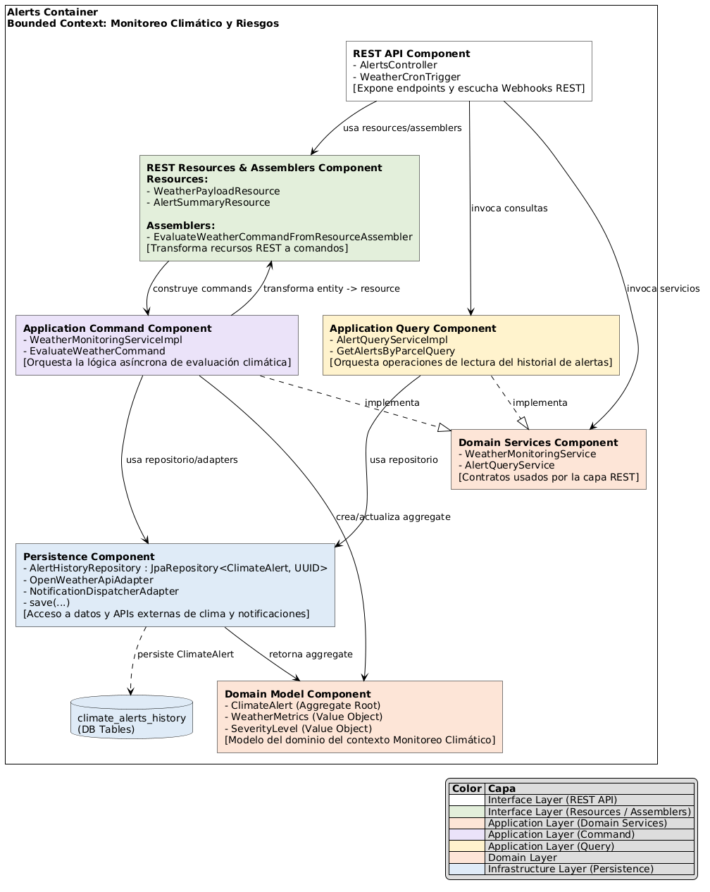

<strong>Figura 48.</strong> Bounded Context Software Architecture Component Level Diagrams — level diagrams contract climate

#### 2.6.5.6. Bounded Context Software Architecture Code Level Diagrams
##### 2.6.5.6.1. Bounded Context Domain Layer Class Diagrams
Este diagrama muestra el modelo de clases de la capa de dominio, destacando el Aggregate Root principal (`ClimateAlert`) y cómo interactúa con los servicios de comando y consulta (CQRS).

  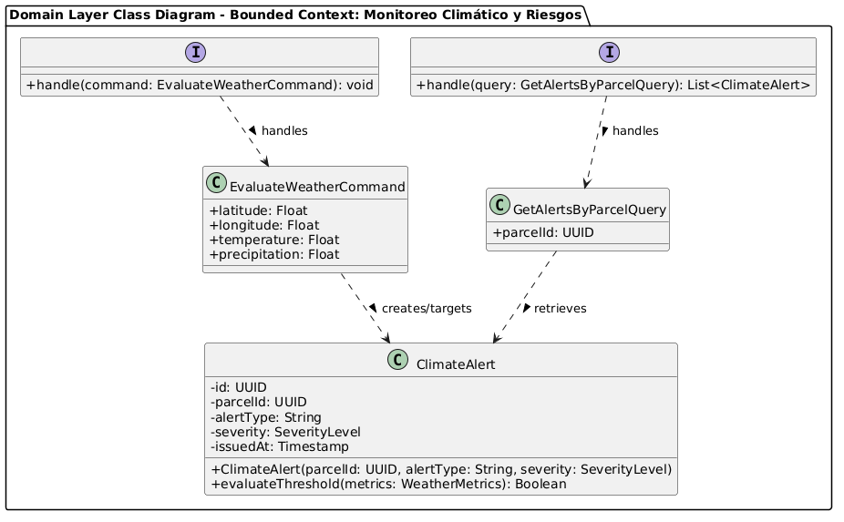

<strong>Figura 49.</strong> Bounded Context Domain Layer Class Diagrams

##### 2.6.5.6.2. Bounded Context Database Design Diagram
Este diagrama detalla la tabla que soporta el historial de alertas detectadas para las parcelas financiadas, permitiendo la trazabilidad de los eventos meteorológicos críticos notificados a los usuarios.

  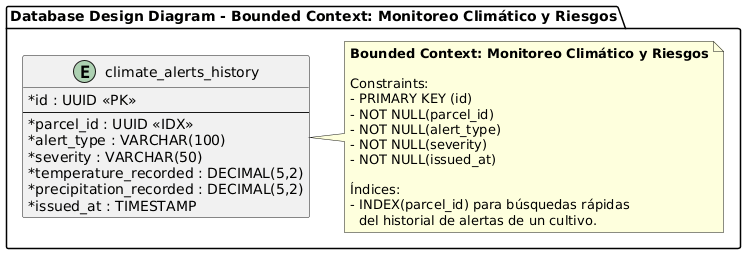

<strong>Figura 50.</strong> Bounded Context Database Design Diagram — db diagram contract climate

### 2.6.6. Bounded Context: Gestión de Usuarios (IAM) Service

Representa la capacidad del sistema encargada de administrar el ciclo de vida de las cuentas de usuarios, soportando el registro, autenticación y asignación de roles de perfiles (Agricultor y Comerciante) mediante la verificación de datos de identidad y de contacto. Su propósito es centralizar la seguridad y el control de acceso a la plataforma. La entidad principal es `User`, la cual concentra las credenciales y el estado de autorización.

#### 2.6.6.1. Domain Layer
La capa de dominio contiene el núcleo de las reglas de autenticación, unicidad de cuentas y asignación de permisos.

- **Aggregate Root:** `User` (Atributos: id, email, passwordHash, status, createdAt).
- **Entities:** `Role` (Agricultor, Comerciante, Administrador).
- **Value Objects:** `IdentityDocument` (DNI o RUC), `UserStatus` (Enum: ACTIVE, INACTIVE, SUSPENDED), `EmailAddress`.
- **Commands:** `RegisterAgricultorCommand`, `RegisterComercianteCommand`, `AuthenticateUserCommand`.
- **Queries:** `GetUserProfileQuery`, `ValidateTokenQuery`.
- **Domain Events:** `UserRegisteredEvent`, `UserAuthenticatedEvent`.
- **Reglas de negocio:** El correo electrónico ingresado debe ser único en todo el sistema y no puede estar asociado a otra cuenta activa. Las contraseñas nunca deben almacenarse en texto plano. Las acciones sobre parcelas y desembolsos están estrictamente restringidas según el rol asignado a la cuenta.

#### 2.6.6.2. Interface Layer
Contiene los controladores que exponen los servicios de registro e inicio de sesión al frontend móvil de Muyu.

- **REST Controllers:** `AuthController`, `UsersController`.
- **Endpoints:** `POST /api/v1/auth/register/agricultor`, `POST /api/v1/auth/register/comerciante`, `POST /api/v1/auth/login`.
- **DTOs:** `AgricultorRegistrationResource`, `ComercianteRegistrationResource`, `LoginResource`, `AuthTokenResource`.
- **Assemblers:** Transforma recursos HTTP en comandos del dominio (ej. `AuthenticateUserCommandFromResourceAssembler`).

#### 2.6.6.3. Application Layer
Coordina los flujos de creación de cuentas, validación externa y generación de tokens de sesión.

- **Command Services:** `AuthCommandServiceImpl` (Orquesta el registro, valida la unicidad del correo, encripta la contraseña y guarda el usuario).
- **Query Services:** `UserQueryServiceImpl`.
- **Flujo principal:** El usuario envía sus datos de registro desde la APP Móvil. El servicio verifica la validez del DNI o RUC contra un proveedor de autenticación externo. Si es válido, utiliza un contrato de infraestructura para hashear la contraseña, guarda el `User` en la base de datos con su rol correspondiente y emite un `UserRegisteredEvent`. Durante el login, verifica las credenciales y genera un JSON Web Token (JWT).

#### 2.6.6.4. Infrastructure Layer
Gestiona la persistencia segura de las credenciales y las integraciones con servicios de seguridad.

- **Repositories:** `UserRepository` (extiende JpaRepository o similar con soporte para búsquedas exactas por email), `RoleRepository`.
- **Adapters:** `JwtProviderAdapter` (Generación y firma de tokens JWT), `PasswordHasherAdapter` (Implementación de encriptación con BCrypt/Argon2), `IdentityProviderAdapter` (Conexión con servicios de RENIEC/SUNAT).
- **Persistencia:** Tablas `users`, `roles` y la tabla intermedia `user_roles` con restricciones de unicidad en la columna de correo.

#### 2.6.6.5. Bounded Context Software Architecture Component Level Diagrams
Este diagrama detalla la arquitectura interna a nivel de componentes para el contexto **Gestión de Usuarios (IAM)**, aplicando el patrón CQRS (separación de operaciones de lectura y escritura) y la inyección de dependencias a través de las capas de Interfaz, Aplicación, Dominio e Infraestructura.

  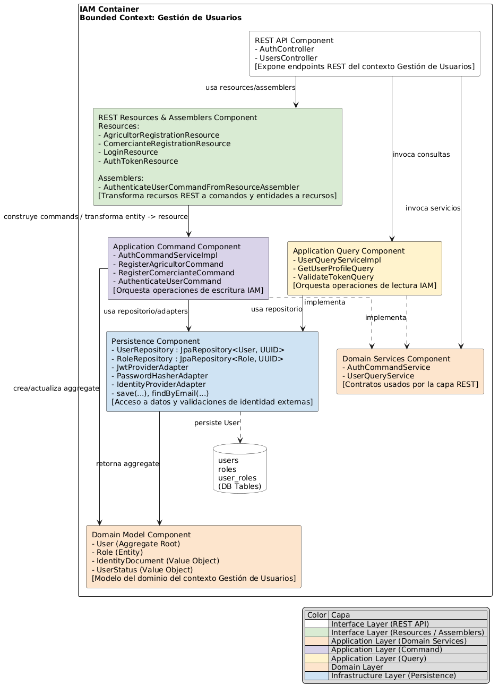

<strong>Figura 51.</strong> Bounded Context Software Architecture Component Level Diagrams — level diagrams iam

#### 2.6.6.6. Bounded Context Software Architecture Code Level Diagrams
##### 2.6.6.6.1. Bounded Context Domain Layer Class Diagrams
Este diagrama muestra el modelo de clases de la capa de dominio, destacando el Aggregate Root principal (`User`) y cómo interactúa con los servicios de comando, consulta y los roles asignados.

  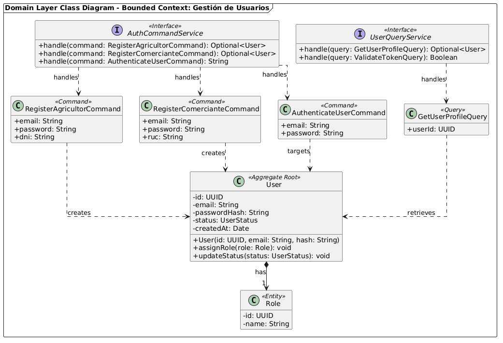

<strong>Figura 52.</strong> Bounded Context Domain Layer Class Diagrams

##### 2.6.6.6.2. Bounded Context Database Design Diagram
Este diagrama relacional conecta `users` y `roles`, estructurando el almacenamiento seguro de credenciales y garantizando la correcta autorización mediante la relación de perfiles en el ecosistema.

  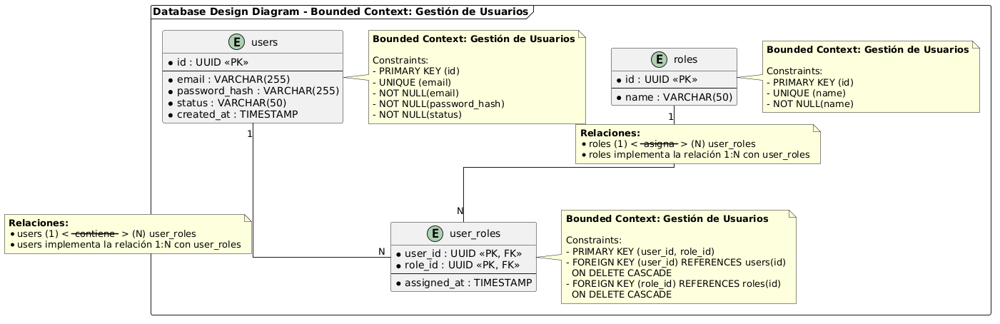

<strong>Figura 53.</strong> Bounded Context Database Design Diagram

# Capítulo III: Solution UI/UX Design

## 3.1. Product design
### 3.1.1. Style Guidelines

En esta sección se presentan los lineamientos visuales y de comunicación
adoptados para Muyu, con el objetivo de mantener una experiencia consistente
entre el Landing Page y la aplicación móvil.

#### 3.1.1.1. General Style Guidelines
Las decisiones visuales y de comunicación de Muyu parten de tres necesidades que surgieron en las entrevistas: la app se usa en el campo, a pleno sol y con las manos ocupadas, el usuario decide sobre dinero y necesita confianza, y la conectividad es limitada. Como referencia de sistema de diseño se adopta Material Design 3 con adaptaciones propias de color, tipografía y componentes.

**Branding**

La identidad visual de Muyu se compone de un isotipo inspirado en el crecimiento agrícola y del logotipo tipográfico **MUYU**. El isotipo se emplea de manera independiente como ícono de la aplicación, mientras que la composición horizontal se reserva para espacios donde se requiere mostrar la identidad completa de la marca.

#### Logo e isotipo

  

El logotipo horizontal combina el isotipo y el nombre **MUYU**. Para el ícono de la aplicación se emplea únicamente el isotipo, permitiendo mantener su reconocimiento y legibilidad en tamaños reducidos.

#### Asistente visual de la aplicación

  

El asistente visual se utiliza dentro de la aplicación para acompañar al usuario en mensajes, estados y acciones específicas. Sus distintas expresiones permiten comunicar confirmación, atención, ayuda, error o información sin depender únicamente de texto.

#### Asistente de autenticación y orientación

  

El segundo recurso ilustrativo cumple una función explicativa en procesos como inicio de sesión, registro, recuperación de cuenta y confirmaciones. El personaje acompaña visualmente los formularios y facilita la identificación de cada paso del proceso.

**Colors**

  

La paleta se organiza en tres grupos: marca (verdes), estados y neutros. Cada color se define como token con nombre por función, por ejemplo `color/primary` o `color/warning`, de modo que un cambio de verde de marca se propaga a todas las pantallas.
 
| Token | Valor | Uso |
|---|---|---|
| color/primary | #4A7C1E | Acciones y elemento seleccionado de la navegación |
| color/primary-dark | #213D09 | Texto fuerte y encabezados |
| color/brand-deep | #0F3F0D | Barra de navegación inferior |
| color/success | #B8DF98 con texto #213D09 | Estado Aprobado |
| color/warning | #FED2BD con texto #85490D | Estado Pendiente |
| color/danger | #B84444 | Rechazo y error de ubicación |
| color/financed | #C8DBFF con texto #2F4FB8 | Estado Financiada |
| Neutros | #FFFFFF, #F2F2F2, #D9D9D9, #757575, #000000 | Superficies, bordes, texto secundario y texto |
 
Sustento: los nombres semánticos separan el propósito de la apariencia. El estado nunca se comunica solo con color, cada badge incluye texto, lo que además ayuda a usuarios con dificultad para distinguir colores.

**Iconographies**

  

**Typography**

  

Urbanist es la familia de trabajo. Es geométrica, abierta y legible en tamaños pequeños a la intemperie. Fredoka SemiBold se reserva para el logotipo y las pantallas de autenticación, donde la mascota marca el tono. La escala tipográfica se limita a los tamaños 12, 16, 20, 24 y 32 px.
 
| Estilo | Especificación |
|---|---|
| Display / autenticación | Fredoka 600, 32/40 |
| Title | Urbanist 700, 24/32 |
| Subtitle | Urbanist 600, 20/28 |
| Body | Urbanist 400, 16/24 |
| Button | Urbanist 600, 16/20 |
| Label | Urbanist 500, 12/16 |
 
Sustento: una jerarquía corta facilita la exploración y la comprensión, y los estilos reutilizables evitan diferencias accidentales entre pantallas. El tamaño de 12 px se usa solo en etiquetas secundarias y requiere pruebas de legibilidad en campo.

**Spacing and shape**

  

El espaciado sigue una escala basada en 4 px: 4, 8, 12, 16, 20 y 24. Los radios de borde se limitan a 8, 12, 16 y 24 px. Las tarjetas usan 16 px de relleno interno.
 
Sustento: los principios de proximidad y región común de Gestalt agrupan la información relacionada. Una escala regular da ritmo visual y facilita que el equipo construya pantallas consistentes.

**Core components**

  

Los componentes base son los badges de estado, los botones (primario, secundario, de peligro y deshabilitado), la tarjeta de parcela y la navegación inferior. Se construyen una sola vez con variantes. Las etiquetas son cortas y orientadas a la tarea: "Approve & release payment" nombra la consecuencia de la acción mejor que un "Confirm" genérico, y "Correction requested" indica al agricultor qué debe hacer a continuación. La navegación del Agricultor usa Home, My plots, Sync, Payments y Profile. La del Comerciante usa Catalog, My plots, Alerts, Payments y Profile. Las diferencias responden a los objetivos de cada rol.

**Tone of Communication**

  

Muyu se ubica así en las cuatro dimensiones: serio con una envoltura amistosa, casual profesional, respetuoso y predominantemente sereno. Habla como un técnico de campo de confianza. La cercanía viene de la mascota y de palabras sencillas, y las instrucciones sobre evidencia y pagos se mantienen exactas. Se evitan las promesas absolutas, por ejemplo "Zero risk, maximum confidence", porque Escrow reduce el riesgo pero no lo elimina. El idioma por defecto de la interfaz es inglés, con español latinoamericano (es_419) como alternativa, y no se mezclan ambos en una misma pantalla.

**Accessibility: contrast**

  

El contraste se verifica contra WCAG AA: 4,5:1 para texto normal y 3:1 para texto grande. En los primeros borradores cinco combinaciones no cumplían y se corrigieron conservando el aspecto original:
 
| Elemento | Antes | Después |
|---|---|---|
| Badge Pendiente | #A65E12 sobre #FED2BD (3,58:1) | #85490D (5,13:1) |
| Badge Financiada | #3A5DD2 sobre #C8DBFF (4,09:1) | #2F4FB8 (5,13:1) |
| Texto de error de ubicación | #E05252 sobre blanco (3,82:1) | #B84444 (5,32:1) |
| Texto secundario | Negro al 50 % (3,95:1) | #757575 (4,61:1) |
| Elemento seleccionado de la navegación | Blanco sobre #618840 (4,11:1) | Blanco sobre #4A7C1E (5,01:1) |
 
El análisis no certifica el texto sobre fotografías ni sobre fondos variables, que requiere un velo oscuro o una revisión manual.
 
Sustento: la app se lee en exteriores y se usa para decisiones económicas, por lo que el contraste insuficiente es un riesgo real de error.

**Layout Grid**

Muyu emplea una cuadrícula responsive para mantener la alineación y la jerarquía visual entre la Landing Page y la aplicación móvil. La grilla permite distribuir títulos, imágenes, componentes y espacios de forma consistente, evitando posiciones arbitrarias entre pantallas.

Landing Page

La versión desktop utiliza una estructura de columnas que organiza el contenido principal, la navegación y las secciones informativas. Los textos e imágenes se alinean con estas columnas para mantener una lectura clara y una separación uniforme entre bloques.

  

Mobile Application

La aplicación móvil utiliza una grilla adaptada al ancho del dispositivo. Los componentes principales respetan los márgenes laterales y las columnas definidas, mientras que elementos como tarjetas, formularios y botones se expanden dentro del área disponible.

  

### 3.1.2. Information Architecture

La arquitectura de información de la aplicación móvil Muyu define cómo se organiza, etiqueta, busca y navega el contenido para que los dos tipos de usuario, Agricultor y Comerciante, puedan acceder de forma directa a las tareas relacionadas con sus objetivos.

Las decisiones responden a los hallazgos obtenidos durante las entrevistas. El Agricultor trabaja directamente en campo, en ocasiones con conectividad limitada y mientras realiza otras actividades, por lo que necesita una navegación con pocas opciones y acciones directas. El Comerciante toma decisiones relacionadas con financiamiento, revisión de evidencias y aprobación de hitos, por lo que necesita identificar rápidamente qué parcelas o actividades requieren su atención.

#### 3.1.2.1. Organization Systems

**Sistemas de organización visual**

| Sistema | Aplicación | Justificación |
|---|---|---|
| Jerárquico | La navegación parte de Inicio o Catálogo, continúa hacia una parcela y posteriormente hacia sus hitos, evidencias, financiamiento o información asociada. Las pantallas de detalle presentan primero el nombre y estado de la parcela, seguido de la información relacionada con su ciclo productivo. | Permite que el usuario comprenda en qué nivel se encuentra y cuál es el contexto de la información que está revisando. |
| Secuencial | Se aplica en procesos que requieren un orden definido, como publicación de parcelas, financiamiento, registro de evidencias, recuperación de contraseña y confirmaciones. | Divide tareas extensas en pasos breves y reduce errores en procesos que requieren ingresar información o confirmar operaciones. |
| Por estado | Las parcelas, evidencias, hitos, solicitudes y pagos se organizan mediante estados visibles como Available, Funded, Pending, Awaiting review, Approved y Correction needed. | Permite reconocer rápidamente qué elementos requieren atención o qué etapa del proceso se encuentra activa. |

**Esquemas de categorización del contenido**

| Esquema | Aplicación |
|---|---|
| Por audiencia o rol | Cada rol cuenta con navegación inferior, pantalla inicial y acciones principales diferentes. El Agricultor publica parcelas, registra evidencias y gestiona la sincronización. El Comerciante explora parcelas, financia planes de producción y revisa hitos. |
| Por estado | Las parcelas y los hitos se identifican mediante badges como Available, Funded, Pending, Awaiting review, Approved y Correction needed. |
| Cronológico | Se emplea en el historial de pagos, notificaciones, evidencias registradas y fechas asociadas a hitos o solicitudes de visita. |
| Por tema | El Perfil agrupa información de contacto, preferencias de notificaciones, pagos, seguridad, ayuda y documentos legales. |
| Geográfico | Se emplea en la ubicación de parcelas, verificación mediante GPS y búsqueda relacionada con ubicación. |
| Alfabético | No se utiliza como criterio principal, ya que las parcelas se consultan principalmente por cultivo, ubicación, estado o relación con el usuario. |

#### 3.1.2.2. Labeling Systems

El sistema de etiquetado utiliza términos breves, orientados a la tarea y consistentes entre pantallas. El idioma predeterminado de la interfaz es inglés y se considera español latinoamericano (`es_419`) como alternativa.

Las etiquetas buscan anticipar claramente el contenido o la acción asociada. Por ejemplo, Payments dirige al historial y estado de pagos, mientras que Sync identifica la sección donde el Agricultor puede revisar las evidencias pendientes de sincronización.

**Navegación inferior**

| Rol | Labels (en_US) | Equivalente es_419 |
|---|---|---|
| Agricultor | Home, Plots, Sync, Payments, Profile | Inicio, Parcelas, Sincronización, Pagos, Perfil |
| Comerciante | Catalog, My plots, Alerts, Payments, Profile | Catálogo, Mis parcelas, Alertas, Pagos, Perfil |

**Farmer**

  

**Merchant**

  

Las diferencias entre ambas barras de navegación responden a los objetivos de cada segmento. El Agricultor dispone de Sync para gestionar evidencias registradas con conectividad limitada. El Comerciante dispone de Catalog para explorar oportunidades de producción y Alerts` para revisar eventos relevantes relacionados con sus parcelas financiadas.

**Acciones principales**

| Label | Ubicación | Asociación esperada |
|---|---|---|
| Publish | Agricultor, Inicio o Parcelas | Inicia el registro de una nueva parcela. |
| Record evidence | Agricultor, detalle de parcela | Inicia el registro de evidencia para un hito. |
| Take photo | Agricultor, registro de evidencia | Abre la cámara para capturar una fotografía. |
| Open gallery | Agricultor, registro de evidencia | Permite seleccionar una fotografía existente. |
| Submit evidence | Agricultor, revisión de evidencia | Envía la evidencia registrada. Si no existe conexión, permanece pendiente de sincronización. |
| Fund plot | Comerciante, detalle de parcela | Inicia el proceso de financiamiento del plan de producción. |
| Approve and release payment | Comerciante, revisión de evidencia | Aprueba el hito y autoriza la liberación del pago correspondiente. |
| Reject and explain reason | Comerciante, revisión de evidencia | Rechaza la evidencia y solicita una corrección indicando el motivo. |
| Request visit | Comerciante, parcela | Inicia la coordinación de una visita presencial. |

El uso de etiquetas como Approve and release payment comunica directamente la consecuencia de la acción. Esto resulta más claro que utilizar términos genéricos como Confirm en operaciones relacionadas con dinero.

**Estados**

| Badge | Significado | Equivalencia funcional |
|---|---|---|
| Available | Parcela publicada y disponible para financiamiento. | Parcela disponible |
| Funded | Parcela con un acuerdo de financiamiento activo. | Parcela financiada |
| Pending | Hito que aún requiere completar una actividad o presentar evidencia. | Pendiente |
| Awaiting review | Evidencia enviada y pendiente de revisión por el Comerciante. | Evidencia presentada para revisión |
| Approved | Hito revisado y aprobado. | Hito aprobado |
| Correction needed | La evidencia requiere una nueva versión o corrección. | Corrección solicitada |
| Submitted | Evidencia enviada correctamente al servidor. | Evidencia presentada |

Los nombres extensos utilizados en la documentación se reducen en los badges para facilitar su lectura en una pantalla móvil. Las equivalencias se mantienen relacionadas con el Ubiquitous Language del proyecto para conservar consistencia entre diseño, documentación y desarrollo.

#### 3.1.2.3. SEO Tags and Meta Tags

Debido a que Muyu corresponde a una aplicación móvil, se consideran elementos de App Store Optimization (ASO) para describir y facilitar la identificación de la aplicación en una tienda de aplicaciones. Los elementos SEO correspondientes al sitio web público se documentan dentro de la Landing Page.

| Elemento | en_US (predeterminado) | es_419 |
|---|---|---|
| App Title | Muyu: Fund and Track Crops | Muyu: Financia tus Cultivos |
| App Subtitle | Escrow-protected farm funding | Financiamiento agrícola con Escrow |
| Short Description | Fund farm plots, verify progress with GPS photos and pay by milestone. | Financia parcelas, verifica avances con fotos GPS y gestiona pagos por hitos. |
| Keywords | farming, crops, agriculture, escrow, harvest, farmer, plots, weather alerts, offline, evidence, gps, peru | agricultura, cultivos, parcelas, escrow, cosecha, agricultor, alertas, sin conexion, evidencia, gps, peru |

**App description (en_US)**

Muyu connects farmers and merchants through agricultural production plans organized by milestones. Farmers publish their plots and register field progress using GPS and timestamped evidence, including situations with limited connectivity. Merchants can explore available plots, fund production plans, follow progress and review evidence before approving each milestone. Funds remain in Escrow and are released according to the approval of the corresponding milestone. Muyu also provides weather alerts related to conditions that may affect agricultural activities.

**App description (es_419)**

Muyu conecta a agricultores y comerciantes mediante planes de producción agrícola organizados por hitos. Los agricultores publican sus parcelas y registran el avance del trabajo mediante evidencias con GPS, fecha y hora, incluso en situaciones con conectividad limitada. Los comerciantes pueden explorar parcelas disponibles, financiar planes de producción, seguir su progreso y revisar las evidencias antes de aprobar cada hito. Los fondos permanecen en Escrow y se liberan de acuerdo con la aprobación del hito correspondiente. Muyu también proporciona alertas sobre condiciones climáticas que pueden afectar las actividades agrícolas.

#### 3.1.2.4. Searching Systems

Los sistemas de búsqueda de Muyu se adaptan al contexto de cada sección y evitan presentar una cantidad excesiva de filtros en pantallas móviles.

| Contexto | Opciones de búsqueda y filtros | Presentación de resultados |
|---|---|---|
| Catálogo, Comerciante | Búsqueda por cultivo o ubicación, opciones rápidas como All, Near me y Recommended, junto con filtros relacionados con las características de la parcela. | Tarjetas con fotografía, nombre de parcela, agricultor, monto solicitado, cultivo, área, ubicación e información relevante del productor. |
| Parcelas, Agricultor | Búsqueda por nombre de parcela o ubicación y filtrado por estado. | Tarjetas con nombre, cultivo, estado, hito actual, progreso y acceso al detalle de la parcela. |
| My plots, Comerciante | Visualización de parcelas financiadas y opción para priorizar aquellas que requieren revisión. | Tarjetas con estado, progreso, hito actual y acciones pendientes. |
| Payments, ambos roles | Organización cronológica y filtros relacionados con el estado del pago. | Lista de transacciones con parcela, hito, monto, fecha y estado. |
| Alerts, Comerciante | Consulta de alertas relacionadas con clima, evidencias, solicitudes y próximos eventos. | Lista de notificaciones que dirige directamente al contexto relacionado. |

Cuando una búsqueda no obtiene resultados, el sistema muestra un estado vacío e indica al usuario que puede modificar la búsqueda o los filtros. La cantidad de filtros se mantiene reducida para facilitar su uso en pantallas pequeñas.

#### 3.1.2.5. Navigation Systems

Muyu combina distintos sistemas de navegación para mantener disponibles las secciones principales y, al mismo tiempo, permitir acciones relacionadas con el contexto actual.

| Sistema | Elementos | Función |
|---|---|---|
| Global | Barra de navegación inferior con cinco opciones según el rol. | Mantiene acceso permanente a las principales áreas de la aplicación. Cada opción combina icono y texto. |
| Local | Flecha de regreso, título de pantalla y datos contextuales como parcela, cultivo o ciclo. | Permite identificar la ubicación actual dentro del flujo y regresar al nivel anterior. |
| Contextual | Botones como Record evidence, Fund plot, Approve and release payment, Request visit o Correct evidence. | Permiten iniciar acciones directamente desde el contenido que el usuario está revisando. |
| Secuencial | Indicadores de pasos y botones para continuar o regresar en procesos como publicación de parcelas y financiamiento. | Orientan al usuario en tareas que requieren un orden definido. |
| Basado en notificaciones | Alertas climáticas, solicitudes de extensión, evidencias pendientes de revisión, pagos y eventos relacionados con la cosecha. | Permiten acceder directamente al detalle relacionado con un evento. |

**Rutas principales**

- **Agricultor, registrar evidencia:**  
  

  
  

- **Agricultor, publicar una parcela:**  
  

  
  

- **Comerciante, financiar una parcela:**  
  

  
  

- **Comerciante, revisar un hito:**  
  

  
  

- **Comerciante, solicitar una visita:**  
  

  
  

**Criterios de diseño**

La navegación inferior se limita a cinco opciones por rol y combina iconos con etiquetas para reducir ambigüedad. Los controles táctiles principales mantienen un área mínima de interacción de 48 px. Las acciones relacionadas con una parcela se presentan dentro de su contexto, evitando que el usuario tenga que regresar al menú principal para continuar una tarea.

### 3.1.3. Landing Page UI Design
#### 3.1.3.1. Landing Page Wireframe

##### Hero
  
  

  
  

##### About Muyu

  

  
  

##### Core Features
 
  

  
  

##### Production Plans

  

  
  

##### How It Works

  

  
  

##### Payments

  

  
  

##### For Farmers and Merchants

  

  
  

##### Frequently Asked Questions

  

  
  

##### Testimonials

  

  
  

##### Call to Action

  

  
  

##### Contact

  

  
  

##### Footer

  

  
  

- Mobile Web Browser

  

  
  

    

  
  

    

  
  

    

  
  

    

  
  

    

  
  

    

  
  

    

  
  

    

  
  

  

  
  

  

  
  

#### 3.1.3.2. Landing Page Mock-up

El mock-up de la Landing Page de Muyu desarrolla visualmente la propuesta planteada durante el wireframing y aplica los lineamientos definidos en el sistema de diseño. La interfaz utiliza la identidad gráfica de Muyu, la tipografía Urbanist, la paleta de verdes de la marca, componentes con bordes redondeados y una estructura basada en una cuadrícula de columnas.

La página está orientada a los dos segmentos del producto: Agricultor y Comerciante / Comprador. Su contenido presenta primero la propuesta de valor de Muyu, luego muestra las funciones principales, los planes de producción y el funcionamiento del proceso por hitos. Finalmente, diferencia las capacidades disponibles para cada segmento, resuelve preguntas frecuentes y ofrece canales de contacto.

La navegación mantiene una estructura de desplazamiento vertical entre secciones, permitiendo al visitante comprender el producto de forma progresiva sin requerir autenticación.

##### Desktop Web Browser

La versión desktop distribuye el contenido mediante una cuadrícula de 12 columnas. Esta estructura permite mantener alineados títulos, textos, imágenes, tarjetas y llamadas a la acción a lo largo de la página.

  

##### Hero

El Hero constituye el primer punto de contacto con Muyu. Presenta el logotipo, la navegación principal y una propuesta de valor centrada en conectar el trabajo agrícola con un progreso verificable.

El mensaje introduce tres elementos del producto: acuerdos de producción organizados por hitos, fondos administrados mediante Escrow y evidencias de campo con ubicación y fecha. La llamada a la acción **See how it works** dirige al visitante hacia la explicación del funcionamiento de la plataforma.

Los términos Escrow, GPS Evidence, Offline Mode, Milestones, Climate Alerts y Field Progress funcionan como una síntesis visual de las capacidades principales.

  

##### About Muyu

Esta sección introduce el modelo de funcionamiento de Muyu antes de presentar sus funciones específicas. Se comunica la relación entre agricultores y comerciantes mediante hitos de producción, evidencias de campo y pagos asociados al progreso agrícola.

Las imágenes muestran el contexto de uso del producto y refuerzan su relación con actividades realizadas directamente en campo.

  

##### Core Features

La sección Core Features presenta las capacidades principales de la plataforma mediante un componente de tipo acordeón. Cada elemento permite concentrar la información y mantener una baja carga visual.

Las funciones consideradas son Escrow por hitos, evidencia con GPS y fecha, funcionamiento sin conexión, alertas climáticas y seguimiento de hitos. Al desplegar una función se muestra una descripción y un recurso visual asociado al contexto de uso.

  

##### Product Principles

La franja de atributos resume cuatro conceptos centrales del producto: protección de fondos mediante Escrow, evidencia contextual con GPS y fecha, registro de información con conectividad limitada y organización de la producción mediante hitos.

Este bloque funciona como transición entre las capacidades generales y los planes de producción.

  

##### Production Plans

La sección Production Plans muestra ejemplos de ciclos productivos disponibles en Muyu. Cada tarjeta presenta el cultivo, la duración estimada del ciclo y la cantidad de hitos que organizan su producción.

Los ejemplos representados corresponden a papa Huayro, maíz amarillo y quinua. La información permite comunicar que los planes se adaptan a diferentes cultivos y que cada uno puede contener una estructura distinta de actividades y evidencias.

  

##### How It Works

Esta sección representa de forma resumida el flujo principal de Muyu desde la publicación de una parcela hasta la revisión de un hito.

El proceso se presenta mediante cinco etapas:

1. El agricultor publica una parcela.
2. El comerciante financia el plan de producción.
3. El agricultor desarrolla las actividades correspondientes al hito.
4. Se registra y revisa la evidencia del trabajo.
5. El comerciante aprueba el hito o solicita una corrección.

La disposición numerada facilita comprender la relación entre ambos segmentos y el flujo general del producto antes de ingresar a la aplicación.

  

##### Payments

La sección Payments explica la relación entre el avance de la producción y la liberación de fondos. El proceso se resume en tres estados: fondos asegurados, evidencia aprobada y pago liberado.

Esta representación busca aclarar que el financiamiento no se entrega en una única operación, sino que se encuentra asociado al cumplimiento y revisión de los hitos definidos en el plan de producción.

  

##### For Farmers and Merchants

Esta sección diferencia las capacidades de Muyu según el segmento del usuario.

Para el Agricultor se destacan el registro de actividades de campo, captura de evidencias con GPS y fecha, almacenamiento temporal sin conexión, seguimiento de hitos y pagos, y recepción de alertas climáticas.

Para el Comerciante / Comprador se muestran la exploración de parcelas y planes de producción, consulta de información agrícola, seguimiento del avance financiado, revisión de evidencias y aprobación o solicitud de correcciones sobre los hitos.

La presentación en dos columnas permite comparar las responsabilidades y beneficios de ambos perfiles sin separarlos del mismo proceso productivo.

  

##### Frequently Asked Questions

La sección FAQ concentra preguntas relacionadas con el funcionamiento de Muyu, Escrow, evidencias, conectividad, planes de producción, liberación de pagos y alertas climáticas.

Las preguntas utilizan un componente de acordeón para mostrar una respuesta a la vez, reduciendo la cantidad de información visible y facilitando la exploración del contenido.

  

**FAQ**

  

##### Testimonials

La sección Testimonials plantea el espacio visual destinado a incorporar experiencias de usuarios durante etapas posteriores de validación. El componente utiliza una estructura de carrusel para alternar entre testimonios de los segmentos Agricultor y Comerciante / Comprador.

En esta etapa, el contenido presentado funciona como referencia visual del componente y no representa testimonios validados del producto.

  

##### Call to Action

La llamada a la acción final busca dirigir al visitante hacia la aplicación móvil después de haber presentado el funcionamiento y las capacidades principales de Muyu.

El bloque utiliza una imagen agrícola de fondo y un mensaje breve que conecta la aplicación con el trabajo realizado en campo.

  

##### Contact

La sección Contact ofrece un canal directo de comunicación con el equipo de AllpaTech. El formulario solicita información básica del visitante y permite enviar una consulta relacionada con Muyu.

El bloque complementa el formulario con una descripción breve y los datos de contacto del equipo.

  

##### Footer

El Footer cierra la experiencia mediante una síntesis de la propuesta de Muyu y enlaces hacia las principales secciones de la Landing Page.

También reúne los accesos legales a Terms and Conditions y Privacy Policy, junto con el selector de idioma EN / ES. La identidad de AllpaTech se mantiene como organización responsable del desarrollo de Muyu.

  

##### Mobile Web Browser

##### Hero
  
  

  
  

##### About Muyu

  

  
  

##### Core Features
 
  

  
  

##### Production Plans

  

  
  

##### How It Works

  

  
  

##### Payments

  

  
  

##### For Farmers and Merchants

  

  
  

##### Frequently Asked Questions

  

  
  

##### Testimonials

  

  
  

##### Call to Action

  

  
  

##### Contact

  

  
  

##### Footer

  

  
  

### 3.1.4. Mobile Applications UX/UI Design
#### 3.1.4.1. Mobile Applications Wireframes

En esta sección se presentan los wireframes diseñados para la aplicación móvil de Muyu. Estos esquemas definen la estructura visual, la distribución de los componentes y la jerarquía de la información antes de aplicar el diseño visual final (UI). Se han categorizado según los dos actores principales del sistema: **Agricultor** y **Comerciante**.

##### Perfil: Agricultor

**Pantalla Principal (Home)**
Vista central (Dashboard) donde el agricultor puede ver un resumen rápido de sus actividades, tareas pendientes y accesos directos a sus cultivos.

  

**Gestión de Parcelas (Plot)**
Interfaz para visualizar, registrar y administrar los detalles específicos de las parcelas agrícolas.

  

**Sincronización Offline (Sync)**
Pantalla fundamental para zonas rurales con baja conectividad, permitiendo al agricultor sincronizar sus datos de campo cuando recupere la conexión a internet.

  

**Gestión de Pagos (Payment)**
Vista de la billetera o sección financiera para solicitar, recibir y gestionar los desembolsos por parte de los comerciantes.

  

**Perfil de Usuario (Profile)**
Configuración de la cuenta del agricultor, datos personales y preferencias de la aplicación.

  

**Estado y Seguimiento (Estado)**
Pantalla dedicada al seguimiento del estado de los cultivos, avance de los hitos y condiciones actuales.

  

---

##### Perfil: Comerciante

**Exploración de Catálogo (Catálogo)**
Interfaz que permite al comerciante buscar, filtrar y explorar las diferentes parcelas y cultivos disponibles para financiamiento o compra.

  

**Detalle de Parcela (Plot)**
Vista detallada de una parcela seleccionada desde el catálogo, mostrando información técnica y métricas para la toma de decisiones.

  

**Pagos y Financiamiento (Payment)**
Pasarela y gestión de transacciones para que el comerciante pueda realizar los pagos de las cuotas o desembolsos de los contratos de escrow.

  

**Notificaciones (Notifications)**
Centro de alertas sobre actualizaciones de hitos, cambios climáticos severos o confirmaciones de transacciones.

  

**Perfil de Usuario (Profile)**
Gestión del perfil del comerciante, historial de inversiones, reputación y ajustes de la cuenta.

  

**Estado de Inversión (Estado)**
Pantalla para el monitoreo de los contratos activos, permitiendo ver el progreso de las parcelas financiadas y la validación de sus hitos.

  

#### 3.1.4.2. Mobile Applications Wireflow Diagrams

- Perfil - Agricultor:

##### Publicar una parcela

<table>
  <tr>
    <td><strong>User Persona</strong></td>
    <td>Agricultor</td>
    <td><strong>Número</strong></td>
    <td>1</td>
  </tr>

  <tr>
    <td><strong>User Goal</strong></td>
    <td colspan="3">
      Como Agricultor, quiero registrar las dimensiones y ubicación de mi
      parcela, para hacer visible mi oferta a los compradores.
    </td>
  </tr>

  <tr>
    <td><strong>Happy path</strong></td>
    <td colspan="3">
      El agricultor accede a la sección de parcelas y selecciona la opción
      para publicar una nueva parcela. El sistema muestra el primer paso del
      formulario, donde se registran las fotografías, el nombre de la parcela,
      el tipo de cultivo, el área y la fecha estimada de cosecha.
        
      Después de completar los campos obligatorios, el agricultor continúa
      con el registro de la ubicación. En esta etapa puede utilizar su
      ubicación actual y completar la región, provincia, distrito y dirección
      de referencia. El sistema valida la información y las coordenadas GPS
      antes de habilitar el siguiente paso.
        
      A continuación, se presenta el plan de financiamiento con el monto
      solicitado, la duración del ciclo, la cantidad de hitos y la distribución
      de los desembolsos. El agricultor revisa la información y acepta las
      condiciones para habilitar la confirmación.
        
      Finalmente, el agricultor confirma la publicación. El sistema guarda la
      información, asigna a la parcela el estado “Publicada” y muestra una
      confirmación. La parcela aparece en la sección “My Plots” como disponible
      para ser consultada por los comerciantes.
    </td>
  </tr>
</table>

<strong>Wireflow Diagram - 1</strong>

##### Registrar evidencia de un hito

<table>
  <tr>
    <td><strong>User Persona</strong></td>
    <td>Agricultor</td>
    <td><strong>Número</strong></td>
    <td>2</td>
  </tr>

  <tr>
    <td><strong>User Goal</strong></td>
    <td colspan="3">
      Como Agricultor, quiero subir evidencias fotográficas con geolocalización
      de mi cultivo, para demostrar el avance de la tarea en el hito actual.
    </td>
  </tr>

  <tr>
    <td><strong>Happy path</strong></td>
    <td colspan="3">
      El agricultor abre una parcela financiada y selecciona el hito pendiente
      de Fertilización. Luego, elige la opción “Record evidence” para iniciar
      el registro.
        
      El sistema muestra la pantalla de registro de evidencia, donde el
      agricultor toma una fotografía o la selecciona desde la galería. La
      aplicación registra la fecha, la hora y la ubicación GPS. Además, el
      agricultor indica el insumo utilizado y la cantidad aplicada.
        
      Después de completar la información, el agricultor continúa a la
      revisión. El sistema presenta la fotografía y los datos capturados para
      comprobar que la ubicación se encuentre dentro de la parcela y que la
      información esté completa.
        
      Finalmente, el agricultor selecciona “Submit evidence”. El servidor
      recibe la evidencia y cambia su estado a “Submitted” o “Pendiente de
      revisión”. El desembolso de S/ 2 000 permanece retenido hasta que el
      comerciante revise y apruebe la evidencia.
    </td>
  </tr>
</table>

<strong>
 Wireflow Diagram - 2
</strong>

##### Corregir un hito rechazado

<table>
  <tr>
    <td><strong>User Persona</strong></td>
    <td>Agricultor</td>
    <td><strong>Número</strong></td>
    <td>3</td>
  </tr>

  <tr>
    <td><strong>User Goal</strong></td>
    <td colspan="3">
      Como Agricultor, quiero reenviar evidencias corregidas, para que el
      comerciante pueda aprobarlas.
    </td>
  </tr>

  <tr>
    <td><strong>Happy path</strong></td>
    <td colspan="3">
      El agricultor abre el detalle del hito rechazado. El sistema muestra el
      motivo del rechazo, la evidencia original y el monto que continúa
      retenido. Después de revisar la observación del comerciante, el
      agricultor selecciona “Correct evidence”.
        
      El sistema abre una nueva versión de la evidencia y conserva el registro
      original. El agricultor adjunta una fotografía corregida, indica el
      insumo utilizado y la cantidad aplicada, y escribe una nota explicando
      la corrección realizada.
        
      Antes del reenvío, el sistema valida la fotografía, la fecha, la
      ubicación GPS y los datos registrados. El agricultor comprueba que la
      nueva evidencia atienda el motivo del rechazo y selecciona “Resubmit
      evidence”.
        
      Finalmente, el sistema registra la corrección como una nueva versión,
      conserva la evidencia original en el historial y cambia su estado a
      “Submitted” o “Pendiente de revisión”. El desembolso de S/ 2 000
      permanece retenido hasta que el comerciante revise nuevamente la
      evidencia.
    </td>
  </tr>
</table>

<strong>
Wireflow Diagram - 3
</strong>

##### Consultar una alerta climática

<table>
  <tr>
    <td><strong>User Persona</strong></td>
    <td>Agricultor</td>
    <td><strong>Número</strong></td>
    <td>4</td>
  </tr>

  <tr>
    <td><strong>User Goal</strong></td>
    <td colspan="3">
      Como Agricultor, quiero consultar el riesgo climático y registrar las
      medidas preventivas realizadas, para proteger mi cultivo ante condiciones
      meteorológicas adversas.
    </td>
  </tr>

  <tr>
    <td><strong>Happy path</strong></td>
    <td colspan="3">
      El agricultor accede a la sección “My Plots”. El sistema muestra las
      parcelas registradas y señala que Esperanza Plot presenta un riesgo de
      lluvia intensa. El agricultor selecciona el indicador “Heavy rain risk”
      para consultar la alerta.
        
      El sistema presenta la información meteorológica correspondiente:
      precipitación estimada de 42 mm, duración de 24 horas y nivel de riesgo
      alto. También muestra las recomendaciones preventivas para proteger el
      cultivo.
        
      Después de realizar las medidas fuera de la aplicación, el agricultor
      registra que revisó el drenaje, protegió los insumos y postergó la
      fertilización durante la lluvia.
        
      Finalmente, el sistema guarda las medidas registradas y muestra la alerta
      con el estado “Addressed” o “Atendida”. El riesgo meteorológico permanece
      activo, debido a que registrar la atención no detiene la lluvia ni
      garantiza la protección del cultivo.
    </td>
  </tr>
</table>

 
 <strong>Wireflow Diagram - 4 
</strong>

##### Sincronizar evidencias sin conexión

<table>
  <tr>
    <td><strong>User Persona</strong></td>
    <td>Agricultor</td>
    <td><strong>Número</strong></td>
    <td>5</td>
  </tr>

  <tr>
    <td><strong>User Goal</strong></td>
    <td colspan="3">
      Como Agricultor, quiero enviar las evidencias guardadas al recuperar la
      conexión, para no perderlas ni duplicarlas.
    </td>
  </tr>

  <tr>
    <td><strong>Happy path</strong></td>
    <td colspan="3">
      El agricultor accede a la sección “Sync”. El sistema muestra tres
      evidencias pendientes, almacenadas localmente junto con sus fotografías,
      coordenadas GPS, fechas y demás metadatos.
        
      Cuando se recupera una conexión permitida, el sistema inicia la
      sincronización de la cola y muestra el progreso individual de cada
      evidencia. Cada registro se envía una sola vez para evitar duplicados.
        
      Dos evidencias se envían correctamente y cambian su estado a
      “Submitted”. Si una evidencia presenta un error, los registros enviados
      permanecen en el historial y únicamente la evidencia fallida continúa
      pendiente.
        
      El agricultor selecciona “Retry Molinos”. El sistema reintenta solamente
      el registro fallido y completa su envío sin volver a procesar las otras
      evidencias.
        
      Finalmente, el sistema muestra cero evidencias pendientes, tres nuevos
      registros enviados y un historial total de quince evidencias. Los
      registros sincronizados se conservan sin pérdidas ni duplicados.
    </td>
  </tr>
</table>

 
 <strong>Wireflow Diagram - 5 
</strong>

- Perfil - Comerciante:

##### Financiar una parcela

<table>
  <tr>
    <td><strong>User Persona</strong></td>
    <td>Comerciante</td>
    <td><strong>Número</strong></td>
    <td>6</td>
  </tr>

  <tr>
    <td><strong>User Goal</strong></td>
    <td colspan="3">
      Como Comerciante, quiero financiar de forma directa una parcela
      eligiendo entre los métodos de pago habilitados, para transferir los
      fondos a custodia y asegurar el ciclo productivo.
    </td>
  </tr>

  <tr>
    <td><strong>Happy path</strong></td>
    <td colspan="3">
      La comerciante accede al catálogo de parcelas disponibles y selecciona
      Esperanza Plot. El sistema muestra los detalles del cultivo, el área, la
      ubicación y la información del agricultor.
        
      Después de revisar la parcela, la comerciante selecciona la opción para
      financiarla. El sistema presenta el monto total de S/ 8 500 y el plan de
      desembolsos correspondiente a los hitos de Planting, Irrigation,
      Fertilization y Harvest.
        
      La comerciante selecciona un método de pago, revisa el funcionamiento de
      Escrow y acepta los términos y condiciones. El sistema habilita la
      continuación y muestra la revisión final del contrato con el monto,
      destinatario, parcela y distribución de las cuotas.
        
      La comerciante confirma el financiamiento y realiza el pago de S/ 8 500.
      El sistema procesa la transacción, cambia el estado de la parcela a
      “Financiada” y transfiere el monto a retención en Escrow.
        
      Finalmente, el sistema muestra la confirmación del financiamiento,
      notifica al agricultor y permite consultar la parcela financiada o
      descargar el comprobante. Los fondos permanecen retenidos hasta la
      aprobación de los hitos correspondientes.
    </td>
  </tr>
</table>

 
 <strong>Wireflow Diagram - 6 
</strong>

##### Revisar, aprobar o rechazar un hito

<table>
  <tr>
    <td><strong>User Persona</strong></td>
    <td>Comerciante</td>
    <td><strong>Número</strong></td>
    <td>7</td>
  </tr>

  <tr>
    <td><strong>User Goal</strong></td>
    <td colspan="3">
      Como Comerciante, quiero validar la evidencia de un hito y aprobarla o
      rechazarla con una justificación, para liberar únicamente la cuota
      correspondiente cuando el trabajo cumpla los criterios establecidos.
    </td>
  </tr>

  <tr>
    <td><strong>Happy path</strong></td>
    <td colspan="3">
      La comerciante accede a la sección “My Plots” y filtra las parcelas que
      tienen evidencias pendientes de revisión. Luego, selecciona Esperanza
      Plot y abre la evidencia correspondiente al hito de Fertilización.
        
      El sistema presenta la fotografía enviada, la fecha, la ubicación GPS,
      el insumo utilizado, la cantidad aplicada y la nota del agricultor. La
      comerciante revisa la información y comprueba que la evidencia se
      encuentre dentro de la parcela y cumpla los criterios del hito.
        
      La comerciante selecciona “Approve and release payment”. El sistema
      muestra una revisión final con la evidencia y la cuota de S/ 2 000 que
      será liberada. También informa que la aprobación no puede deshacerse y
      que únicamente se procesará el pago correspondiente a Fertilización.
        
      Después de verificar las consecuencias, la comerciante confirma la
      aprobación. El sistema cambia el estado del hito a “Aprobado” y procesa
      la liberación de S/ 2 000 al medio de cobro del agricultor.
        
      Finalmente, el sistema muestra tres de cuatro hitos aprobados, un total
      liberado de S/ 6 000 y un saldo de S/ 2 500 retenido en Escrow. También
      notifica al agricultor y permite consultar la parcela o el comprobante.
    </td>
  </tr>
</table>

 
 <strong>Wireflow Diagram - 7 
</strong>

##### Solicitar una visita presencial

<table>
  <tr>
    <td><strong>User Persona</strong></td>
    <td>Comerciante</td>
    <td><strong>Número</strong></td>
    <td>8</td>
  </tr>

  <tr>
    <td><strong>User Goal</strong></td>
    <td colspan="3">
      Como Comerciante, quiero agendar una fecha para visitar la parcela de
      forma presencial, para inspeccionar el estado del terreno y conversar
      con el agricultor antes de formalizar el financiamiento.
    </td>
  </tr>

  <tr>
    <td><strong>Happy path</strong></td>
    <td colspan="3">
      La comerciante accede al detalle de Esperanza Plot antes de iniciar el
      financiamiento y selecciona la opción para solicitar una visita
      presencial.
        
      El sistema muestra el formulario de coordinación. La comerciante
      selecciona una fecha disponible, establece la hora de preferencia y
      escribe un mensaje opcional indicando el aspecto de la parcela que desea
      inspeccionar.
        
      Después de completar la información, la comerciante selecciona “Send
      request”. El sistema registra la solicitud con el estado “Pendiente”,
      muestra la fecha y hora propuestas y notifica al agricultor.
        
      Cuando el agricultor acepta la solicitud, el sistema cambia su estado a
      “Confirmada”. La pantalla muestra la fecha y hora realmente acordadas,
      el punto de encuentro, las coordenadas y los datos de contacto del
      agricultor.
        
      Finalmente, la comerciante puede consultar nuevamente la parcela o
      regresar a sus alertas. La coordinación de la visita no reserva ni
      financia la parcela y tampoco genera cargos o depósitos en Escrow.
    </td>
  </tr>
</table>

 
 <strong>Wireflow Diagram - 8 
</strong>

##### Confirmar la recepción de la cosecha

<table>
  <tr>
    <td><strong>User Persona</strong></td>
    <td>Comerciante</td>
    <td><strong>Número</strong></td>
    <td>9</td>
  </tr>

  <tr>
    <td><strong>User Goal</strong></td>
    <td colspan="3">
      Como Comerciante, quiero confirmar una entrega conforme y autorizar el
      último desembolso, para cerrar el ciclo productivo después de recibir la
      cosecha acordada.
    </td>
  </tr>

  <tr>
    <td><strong>Happy path</strong></td>
    <td colspan="3">
      La comerciante accede al detalle de la entrega correspondiente al hito
      final de Harvest. El sistema muestra la fotografía de respaldo, la
      fecha, las coordenadas GPS y los datos registrados por el agricultor.
        
      La comerciante compara la cantidad acordada de 4 000 kg con la cantidad
      recibida y comprueba que la calidad de la cosecha sea aceptable. Después
      de verificar que la entrega esté completa y conforme, selecciona
      “Confirm receipt”.
        
      El sistema presenta la revisión final de la recepción, incluyendo la
      cantidad acordada, la cantidad recibida, la calidad, el agricultor y el
      pago contractual pendiente de S/ 2 500.
        
      La comerciante confirma expresamente la recepción física de los 4 000 kg
      y autoriza la liberación del último desembolso. El sistema habilita el
      botón de confirmación y procesa el pago final al agricultor.
        
      Finalmente, el sistema cambia el estado del hito Harvest a “Aprobado”,
      completa los cuatro hitos del contrato y muestra un total liberado de
      S/ 8 500. El saldo de Escrow queda en S/ 0 y se habilita la descarga del
      comprobante y la consulta del contrato finalizado.
    </td>
  </tr>
</table>

 
 <strong>Wireflow Diagram - 9 
</strong>

#### 3.1.4.3. Mobile Applications Mock-ups

#### AGRICULTOR 
###### AGRICULTOR / Gestión de parcelas, visitas, prórrogas y alertas

El agricultor comienza en el panel principal, donde consulta cuántas parcelas posee, los hitos aprobados y los cultivos activos. Desde allí puede ingresar al detalle de una parcela para revisar su estado de financiamiento, progreso e hitos.
También puede:
- Registrar el resultado de una visita presencial, indicando si se alcanzó o no un acuerdo.
- Consultar visitas anteriores o coordinar una nueva visita.
- Aceptar, rechazar o proponer otra fecha cuando recibe una solicitud del comerciante.
- Solicitar una prórroga para un hito, indicando una nueva fecha y el motivo del retraso.
- Consultar alertas climáticas, el nivel de riesgo, recomendaciones preventivas y el pronóstico.
El flujo termina dejando registrada la decisión correspondiente y notificando a la otra parte. Las visitas solo coordinan el encuentro: no reservan la parcela ni generan movimientos de dinero.

  

  

  

  

###### AGRICULTOR / Publicación de parcelas y registro de evidencias

El agricultor accede a “Mis parcelas”, donde puede buscar, filtrar, consultar alertas y crear una nueva publicación.
La publicación se realiza en tres pasos:
- Ingresa fotografías, nombre, cultivo, área y fecha estimada de cosecha.
- Registra la ubicación mediante GPS o selección manual, incluyendo región, provincia, distrito y referencias.
- Define el monto solicitado, duración del ciclo, cantidad de hitos y distribución de los desembolsos.
Antes de publicar, debe aceptar el acuerdo de financiamiento mediante Escrow. La aplicación valida campos obligatorios, ubicación y que la suma de los hitos coincida con el financiamiento solicitado.
Una vez financiada la parcela, el agricultor selecciona un hito, toma o carga fotografías, registra los insumos y cantidades utilizadas y valida el GPS. La evidencia puede guardarse sin conexión, corregirse si la ubicación es incorrecta y enviarse cuando haya Internet. Después del envío queda “en espera de revisión”; esto todavía no significa que el pago haya sido aprobado.

  

  

  

  

  

  

###### AGRICULTOR / Sincronización de evidencias sin conexión

El agricultor consulta una cola con todas las evidencias guardadas localmente. Cada elemento muestra parcela, hito, fotografía, fecha, ubicación y estado de sincronización.
El flujo contempla:
- Esperar una conexión disponible.
- Respetar la preferencia de “solo Wi-Fi”.
- Cargar varias evidencias cuando vuelve la conexión.
- Mostrar el porcentaje de avance.
- Distinguir entre elementos enviados y fallidos.
- Reintentar únicamente los elementos que presentaron error.
Al finalizar, la pantalla informa cuántas evidencias se enviaron y cuántas continúan pendientes. La sincronización no equivale a la aprobación del hito.

  

###### AGRICULTOR / Historial y detalle de pagos

El agricultor ingresa al módulo de pagos para consultar el total recibido y los desembolsos completados o pendientes. Puede filtrar el historial según su estado y abrir una transacción específica.
El detalle presenta:
- Importe recibido.
- Parcela e hito correspondiente.
- Fecha del desembolso.
- Cuenta bancaria de destino.
- Identificador de la transacción.
- Secuencia del proceso Escrow: evidencia aprobada, fondos liberados y pago recibido.
También puede descargar el comprobante en PDF. Si aún no tiene pagos, se muestra un estado vacío que explica que primero debe existir un financiamiento y una evidencia aprobada.

  

###### AGRICULTOR / Perfil, soporte, seguridad y cierre del contrato

Desde su perfil, el agricultor puede consultar y actualizar sus datos de contacto, canal de alertas climáticas, preferencia de sincronización y cuenta bancaria para recibir desembolsos.
Además, puede:
- Llamar al soporte.
- Reportar un problema, incluso sin conexión, para enviarlo posteriormente desde la cola.
- Cambiar la contraseña o el PIN.
- Recuperar la contraseña por correo.
- Confirmar su PIN de seguridad.
- Registrar una nueva contraseña cumpliendo sus reglas.
- Calificar al comerciante cuando termina el contrato.
El flujo de calificación permite seleccionar estrellas, escribir un comentario opcional y consultar la confirmación junto con el contrato finalizado.

  

  

  

#### COMERCIANTE 
###### COMERCIANTE / Búsqueda, financiamiento y visita a parcelas

El comerciante comienza en el catálogo, donde busca cultivos o ubicaciones y utiliza filtros como cercanía o recomendaciones. Cada resultado presenta cultivo, superficie, ubicación, monto solicitado y datos del agricultor.
Al abrir una parcela puede revisar:
- Información del cultivo.
- Experiencia y reputación del agricultor.
- Ubicación verificada por GPS.
- Plan de hitos y desembolsos.
- Estado financiero cuando ya está financiada.
Para financiarla, revisa el monto, acepta las condiciones de Escrow, selecciona un medio de pago y confirma la operación. El sistema contempla financiamiento exitoso, pago no confirmado y parcela financiada previamente por otra persona, evitando duplicidades.
También puede solicitar una visita antes del financiamiento, indicando fecha, hora y mensaje. La solicitud queda pendiente hasta que el agricultor la acepte, rechace o proponga otra fecha. Cuando se confirma, aparecen el punto de encuentro y los datos de contacto.

  

  

  

  

###### COMERCIANTE / Riesgo climático y revisión de evidencias

El comerciante consulta sus parcelas financiadas y las alertas meteorológicas asociadas. Cuando existe un riesgo elevado puede revisar el pronóstico, posible impacto en el cultivo, contactar al agricultor o evaluar una solicitud de prórroga.
Al recibir una evidencia de un hito, revisa:
- Fotografías.
- Fecha y hora.
- Ubicación GPS.
- Condiciones climáticas.
- Insumo y cantidad aplicada.
- Observaciones del agricultor.
- Historial de correcciones.
Después decide entre:
- Aprobar: libera exclusivamente el pago correspondiente al hito.
- Rechazar: mantiene el dinero retenido y exige seleccionar y explicar el motivo.
Si la evidencia es rechazada, el agricultor conserva el registro original, adjunta una nueva fotografía o corrige los datos y vuelve a enviarla. El comerciante recibe la nueva versión para repetir la evaluación.

  

  

  

  

  

###### COMERCIANTE / Notificaciones, entrega de cosecha e incidencias

El centro de notificaciones reúne solicitudes de revisión, prórrogas, alertas climáticas y avisos de cosecha programada.
Cuando llega la fecha de entrega, el comerciante consulta:
- Producto y parcela.
- Cantidad acordada.
- Cantidad entregada.
- Calidad.
- Fecha, hora y ubicación.
- Pago final retenido en Escrow.
Si todo es correcto, confirma la recepción, aprueba el hito de cosecha y autoriza la liberación del último desembolso. Con ello se completan todos los hitos y se cierra el ciclo.
Si la cosecha no llegó o la cantidad es incompleta, puede contactar al agricultor o registrar una incidencia con tipo, descripción y fotografías. Mientras el problema no se resuelva, la aprobación final y el dinero permanecen bloqueados.

  

  

###### COMERCIANTE / Historial de desembolsos y solicitudes de prórroga

El comerciante consulta el total liberado durante el año y el historial de pagos realizados por parcela e hito. Cada registro muestra al agricultor, importe, fecha, método de transferencia y estado.
Desde una solicitud de prórroga puede comparar:
- Fecha original.
- Nueva fecha propuesta.
- Motivo indicado por el agricultor.
- Hito afectado.
El comerciante decide si aprueba o rechaza la nueva fecha. Aprobar modifica únicamente el plazo del hito: no libera dinero ni cambia el monto total del contrato.

  

###### COMERCIANTE / Perfil, preferencias y recuperación de contraseña

Desde el perfil, el comerciante administra los datos de su empresa, contacto, preferencias de alertas meteorológicas y avisos sobre nuevas parcelas. También consulta sus métodos de pago guardados, términos legales y opciones de seguridad.
El flujo de recuperación de contraseña funciona así:
- El sistema informa que enviará instrucciones si el correo está registrado.
- El comerciante puede reenviar las instrucciones.
- Verifica su PIN de seguridad.
- Registra y confirma una nueva contraseña.
- Recibe la confirmación del cambio.
- Regresa al inicio de sesión con sus nuevas credenciales.

  

  

#### 3.1.4.4. Mobile Applications User Flow Diagrams

##### Publicar una parcela

<table>
  <tr>
    <td><strong>User Persona</strong></td>
    <td>Agricultor</td>
    <td><strong>Número</strong></td>
    <td>1</td>
  </tr>

  <tr>
    <td><strong>User Goal</strong></td>
    <td colspan="3">
      Como Agricultor, quiero registrar las dimensiones y ubicación de mi
      parcela, para hacer visible mi oferta a los compradores.
    </td>
  </tr>

  <tr>
    <td><strong>Happy path</strong></td>
    <td colspan="3">
      El agricultor inicia el proceso desde la opción “Publish”. En la primera
      pantalla, registra las fotografías y los datos principales de la parcela;
      luego, presiona “Next: location”.
        
      En la pantalla de ubicación, registra o confirma las coordenadas y
      completa la región, provincia, distrito y dirección de referencia.
      Después, selecciona “Next: financing”.
        
      El sistema muestra el plan de financiamiento. El agricultor revisa el
      monto solicitado, la duración del ciclo, los hitos y la distribución de
      las cuotas. Luego, acepta el acuerdo y confirma la publicación.
        
      Finalmente, el sistema muestra la confirmación y permite acceder a “My
      Plots”, donde la nueva parcela aparece con el estado “Available”.
    </td>
  </tr>

  <tr>
    <td><strong>Unhappy Paths</strong></td>
    <td colspan="3">
      Si el agricultor omite el nombre, el área, las fotografías u otro dato
      obligatorio, el sistema resalta los campos incompletos y deshabilita el
      botón para continuar al paso de ubicación.
        
      Si la ubicación no fue registrada o la región, provincia o distrito son
      inválidos, el sistema muestra los mensajes de validación correspondientes
      e impide continuar al plan de financiamiento.
        
      Si la suma de las cuotas no coincide con el monto total solicitado de
      S/ 8 500, el sistema muestra la diferencia, deshabilita la publicación y
      solicita ajustar los importes del plan.
        
      Si el agricultor no acepta los términos del acuerdo de financiamiento, el
      sistema mantiene deshabilitado el botón “Publish plot”.
        
      Si el agricultor decide abandonar el proceso, puede guardar la
      información como borrador y continuar posteriormente.
        
      Consideraciones:
      <ul>
        <li>
          Los campos obligatorios deben completarse antes de avanzar.
        </li>
        <li>
          La ubicación debe corresponder a una región, provincia y distrito
          válidos.
        </li>
        <li>
          La suma de los desembolsos debe coincidir con el monto total
          solicitado.
        </li>
        <li>
          La publicación deja la parcela disponible, pero no deposita fondos ni
          confirma un financiamiento.
        </li>
      </ul>
    </td>
  </tr>
</table>

<strong>User Flow - 1</strong>

##### Registrar evidencia de un hito

<table>
  <tr>
    <td><strong>User Persona</strong></td>
    <td>Agricultor</td>
    <td><strong>Número</strong></td>
    <td>2</td>
  </tr>

  <tr>
    <td><strong>User Goal</strong></td>
    <td colspan="3">
      Como Agricultor, quiero subir evidencias fotográficas con geolocalización
      de mi cultivo, para demostrar el avance de la tarea en el hito actual.
    </td>
  </tr>

  <tr>
    <td><strong>Happy path</strong></td>
    <td colspan="3">
      El agricultor abre Esperanza Plot y selecciona “Record evidence” en el
      hito pendiente de Fertilización.
        
      En la pantalla de registro, toma una fotografía o selecciona una imagen
      desde la galería. La aplicación registra automáticamente la fecha, la
      hora y las coordenadas GPS. Luego, el agricultor indica el insumo
      utilizado, la cantidad aplicada y presiona “Continue”.
        
      El sistema muestra la pantalla de revisión con la fotografía, la
      ubicación registrada y los datos de la actividad. El agricultor verifica
      la información y selecciona “Submit evidence”.
        
      Finalmente, el sistema recibe la evidencia y muestra la confirmación del
      envío. El registro cambia al estado “Submitted” o “Pendiente de revisión”
      y queda disponible para la evaluación del comerciante.
    </td>
  </tr>

  <tr>
    <td><strong>Unhappy Paths</strong></td>
    <td colspan="3">
      Si la aplicación no tiene permiso para utilizar la cámara, el sistema
      informa que no puede capturar la fotografía y permite abrir la
      configuración del dispositivo o seleccionar una imagen desde la
      galería.
        
      Si la fotografía tiene un formato no admitido o supera el tamaño máximo
      permitido, el sistema rechaza el archivo y solicita seleccionar o
      capturar otra imagen.
        
      Si el agricultor omite el insumo utilizado, la cantidad aplicada u otro
      dato obligatorio, el sistema resalta los campos incompletos e impide
      continuar a la revisión.
        
      Si las coordenadas GPS no coinciden con la ubicación de la parcela, el
      sistema bloquea el envío, conserva el borrador y solicita corregir o
      capturar nuevamente la ubicación.
        
      Si no existe una conexión permitida al momento del envío, la aplicación
      guarda la fotografía y sus metadatos en la cola local. Cuando se recupera
      la conexión, el sistema sincroniza los registros pendientes.
        
      Si una evidencia falla durante la sincronización, el sistema conserva los
      registros enviados correctamente y permite reintentar únicamente el
      registro fallido, sin eliminar ni duplicar información.
        
      Consideraciones:
      <ul>
        <li>
          La fotografía debe cumplir el formato y tamaño máximo permitido.
        </li>
        <li>
          La evidencia debe incluir fecha, hora, GPS, insumo y cantidad
          aplicada.
        </li>
        <li>
          La ubicación registrada debe encontrarse dentro de la parcela.
        </li>
        <li>
          Las evidencias guardadas sin conexión deben conservar sus fotografías
          y metadatos hasta completar la sincronización.
        </li>
        <li>
          El estado “Submitted” o “Pendiente de revisión” no significa que la
          evidencia haya sido aprobada ni que el pago haya sido liberado.
        </li>
      </ul>
    </td>
  </tr>
</table>

<strong>User Flow - 2</strong>

##### Corregir un hito rechazado

<table>
  <tr>
    <td><strong>User Persona</strong></td>
    <td>Agricultor</td>
    <td><strong>Número</strong></td>
    <td>3</td>
  </tr>

  <tr>
    <td><strong>User Goal</strong></td>
    <td colspan="3">
      Como Agricultor, quiero reenviar evidencias corregidas, para que el
      comerciante pueda aprobarlas.
    </td>
  </tr>

  <tr>
    <td><strong>Happy path</strong></td>
    <td colspan="3">
      El agricultor abre el detalle del hito de Fertilización y consulta el
      motivo por el cual la evidencia fue rechazada. La pantalla también
      muestra la evidencia original y el monto que permanece retenido.
        
      El agricultor selecciona “Correct evidence”. El sistema abre una nueva
      versión de la evidencia y conserva la fotografía y los datos del envío
      anterior en el historial.
        
      En la pantalla de corrección, el agricultor adjunta una fotografía más
      clara, verifica el insumo utilizado, registra la cantidad aplicada y
      escribe una nota explicando la corrección. Luego, comprueba que la
      ubicación GPS sea válida.
        
      Después de revisar la nueva información, selecciona “Resubmit evidence”.
      El sistema registra la evidencia como una nueva versión y muestra la
      confirmación del reenvío.
        
      Finalmente, la corrección queda en estado “Submitted” o “Pendiente de
      revisión”. La evidencia original y el motivo del rechazo permanecen
      disponibles en el historial.
    </td>
  </tr>

  <tr>
    <td><strong>Unhappy Paths</strong></td>
    <td colspan="3">
      Si la nueva fotografía o los datos registrados no corrigen el motivo del
      rechazo, el sistema conserva la evidencia como borrador e impide
      reenviarla hasta que la observación sea atendida.
        
      Si el agricultor omite la fotografía, el insumo utilizado, la cantidad
      aplicada u otro dato obligatorio, el sistema resalta los campos
      incompletos y mantiene deshabilitado el reenvío.
        
      Si la fotografía tiene un formato no admitido o supera el tamaño
      permitido, el sistema rechaza el archivo y solicita seleccionar una nueva
      imagen.
        
      Si las coordenadas GPS no coinciden con la parcela, el sistema bloquea el
      reenvío, conserva el borrador y solicita corregir la ubicación.
        
      Si no existe una conexión permitida, la aplicación guarda la nueva
      versión en la cola local. Cuando se recupera la conexión, el sistema
      sincroniza únicamente el registro pendiente.
        
      Si la evidencia ya fue aprobada, el sistema bloquea cualquier intento de
      reemplazarla o crear una nueva corrección sobre la misma versión.
        
      Consideraciones:
      <ul>
        <li>
          La evidencia original y el motivo del rechazo deben conservarse en
          el historial.
        </li>
        <li>
          La corrección debe registrarse como una nueva versión y no debe
          sobrescribir la evidencia anterior.
        </li>
        <li>
          El agricultor puede guardar la corrección como borrador y continuar
          posteriormente.
        </li>
        <li>
          El estado “Pendiente de revisión” no significa que la evidencia haya
          sido aprobada.
        </li>
        <li>
          El reenvío de la corrección no libera automáticamente los S/ 2 000
          retenidos.
        </li>
      </ul>
    </td>
  </tr>
</table>

<strong>User Flow - 3</strong>

##### Consultar una alerta climática

<table>
  <tr>
    <td><strong>User Persona</strong></td>
    <td>Agricultor</td>
    <td><strong>Número</strong></td>
    <td>4</td>
  </tr>

  <tr>
    <td><strong>User Goal</strong></td>
    <td colspan="3">
      Como Agricultor, quiero consultar el riesgo climático y registrar las
      medidas preventivas realizadas, para proteger mi cultivo ante
      condiciones meteorológicas adversas.
    </td>
  </tr>

  <tr>
    <td><strong>Happy path</strong></td>
    <td colspan="3">
      El agricultor accede a “My Plots” y revisa el estado de sus parcelas. En
      Esperanza Plot identifica el indicador “Heavy rain risk”.
        
      El agricultor selecciona la alerta para consultar su información. El
      sistema muestra una precipitación estimada de 42 mm, una duración de
      24 horas y un nivel de riesgo alto.
        
      La pantalla también presenta las medidas preventivas registradas por el
      agricultor: revisión del drenaje, protección de los insumos y
      postergación de la fertilización durante la lluvia.
        
      Finalmente, el sistema muestra la alerta con el estado “Addressed” o
      “Atendida” y conserva visible la advertencia de que el riesgo
      meteorológico continúa activo.
    </td>
  </tr>

  <tr>
    <td><strong>Unhappy Paths</strong></td>
    <td colspan="3">
      Si el agricultor todavía no ha realizado o registrado las medidas
      preventivas, el sistema no cambia la alerta al estado “Addressed”. La
      alerta permanece pendiente y el usuario regresa a “My Plots” para
      continuar monitoreando el riesgo.
        
      Si una parcela no presenta riesgos meteorológicos activos, el sistema
      muestra el estado “No active alerts” y no habilita el acceso al detalle
      de una alerta.
        
      Si el agricultor solamente consulta la alerta, pero no registra las
      medidas realizadas, el sistema conserva el estado pendiente y no
      considera la alerta como atendida.
        
      Aunque las medidas preventivas hayan sido registradas, el sistema no
      elimina ni desactiva el riesgo meteorológico. La lluvia y el nivel de
      riesgo permanecen visibles mientras continúe la condición climática.
        
      Consideraciones:
      <ul>
        <li>
          Las medidas preventivas se realizan fuera de la aplicación.
        </li>
        <li>
          Consultar las recomendaciones no equivale a registrar su ejecución.
        </li>
        <li>
          El estado “Addressed” confirma el registro de la atención, pero no
          garantiza la protección del cultivo.
        </li>
        <li>
          Una alerta atendida puede continuar mostrando un nivel de riesgo
          alto.
        </li>
      </ul>
    </td>
  </tr>
</table>

<strong>User Flow - 4</strong>

##### Sincronizar evidencias sin conexión

<table>
  <tr>
    <td><strong>User Persona</strong></td>
    <td>Agricultor</td>
    <td><strong>Número</strong></td>
    <td>5</td>
  </tr>

  <tr>
    <td><strong>User Goal</strong></td>
    <td colspan="3">
      Como Agricultor, quiero sincronizar las evidencias guardadas al recuperar
      la conexión, para enviarlas sin perderlas ni duplicarlas.
    </td>
  </tr>

  <tr>
    <td><strong>Happy path</strong></td>
    <td colspan="3">
      El agricultor accede a la sección “Synchronization”. El sistema muestra
      tres evidencias pendientes almacenadas localmente, junto con sus
      fotografías, fechas y ubicaciones registradas.
        
      Cuando se recupera una conexión permitida, el sistema inicia la
      sincronización y muestra el progreso individual de cada evidencia. Dos
      registros se envían correctamente y uno presenta un error.
        
      El agricultor selecciona “Retry Molinos”. El sistema reintenta únicamente
      la evidencia que falló, sin volver a enviar los registros que ya fueron
      procesados.
        
      Finalmente, la sincronización termina correctamente. El sistema muestra
      cero evidencias pendientes, tres registros enviados y un historial total
      de quince evidencias.
    </td>
  </tr>

  <tr>
    <td><strong>Unhappy Paths</strong></td>
    <td colspan="3">
      Si existe conexión mediante datos móviles, pero la preferencia del
      agricultor permite sincronizar únicamente por Wi-Fi, el sistema no inicia
      la carga automáticamente. El agricultor puede esperar una conexión Wi-Fi
      o autorizar expresamente el uso de datos móviles.
        
      Si la señal todavía no se ha recuperado, el sistema mantiene las tres
      evidencias en la cola local con el estado “Waiting for connection” y
      conserva sus fotografías, fechas, coordenadas GPS y demás metadatos.
        
      Si la conexión se interrumpe durante la sincronización, el sistema
      conserva como enviados los registros que finalizaron correctamente y
      mantiene en la cola únicamente la evidencia incompleta.
        
      Si una evidencia falla durante el envío, el sistema muestra el estado
      “Error: Retry” y permite reintentar solamente ese registro. Las demás
      evidencias no se eliminan ni se vuelven a enviar.
        
      Si el nuevo intento vuelve a fallar, la evidencia permanece en la cola
      local y el agricultor puede seleccionar “Try again later” para continuar
      posteriormente.
        
      Consideraciones:
      <ul>
        <li>
          La aplicación debe comprobar la preferencia de conexión antes de
          iniciar o reanudar una carga.
        </li>
        <li>
          Los registros pendientes deben conservar sus fotografías y
          metadatos mientras no exista una conexión permitida.
        </li>
        <li>
          Una carga parcial no debe borrar las evidencias pendientes ni
          duplicar las que ya fueron enviadas.
        </li>
        <li>
          El historial debe aumentar únicamente cuando cada evidencia complete
          su envío.
        </li>
        <li>
          El estado “Sent” confirma la sincronización, pero no significa que la
          evidencia haya sido aprobada.
        </li>
      </ul>
    </td>
  </tr>
</table>

<strong>User Flow - 5</strong>

##### Financiar una parcela

<table>
  <tr>
    <td><strong>User Persona</strong></td>
    <td>Comerciante</td>
    <td><strong>Número</strong></td>
    <td>6</td>
  </tr>

  <tr>
    <td><strong>User Goal</strong></td>
    <td colspan="3">
      Como Comerciante, quiero financiar de forma directa una parcela eligiendo
      entre los métodos de pago habilitados, para transferir los fondos a
      custodia y asegurar el ciclo productivo.
    </td>
  </tr>

  <tr>
    <td><strong>Happy path</strong></td>
    <td colspan="3">
      La comerciante accede al catálogo de parcelas disponibles y selecciona la
      parcela “Esperanza Plot”. El sistema muestra sus características,
      ubicación exacta y la información del agricultor.
        
      La comerciante selecciona “Finance plot”. El sistema muestra el monto
      total de S/ 8 500 y el plan de desembolso dividido entre los hitos de
      Planting, Irrigation, Fertilization y Harvest.
        
      La comerciante revisa el funcionamiento de Escrow, acepta los términos del
      financiamiento y continúa a la revisión final.
        
      El sistema presenta el monto total, el destinatario, la parcela, el
      financista, el método de pago y el plan de desembolso. La comerciante
      verifica la información y selecciona “Confirm and pay S/ 8 500”.
        
      Finalmente, el sistema confirma el financiamiento y muestra que los
      S/ 8 500 permanecen retenidos en Escrow. Los fondos serán liberados al
      agricultor conforme se apruebe cada hito.
    </td>
  </tr>

  <tr>
    <td><strong>Unhappy Paths</strong></td>
    <td colspan="3">
      Si la parcela deja de estar disponible después de ser seleccionada, el
      sistema interrumpe el financiamiento e informa que otro comerciante inició
      el proceso. La comerciante puede consultar otras parcelas o regresar al
      catálogo.
        
      Si la comerciante no acepta los términos del financiamiento, el sistema
      mantiene deshabilitada la opción “Continue”. La información permanece en
      la pantalla para que pueda revisar las condiciones y aceptarlas.
        
      Si el pago no puede confirmarse, el sistema muestra el estado “Payment was
      not confirmed” y conserva la operación como no confirmada.
        
      Antes de realizar un nuevo intento, la comerciante debe revisar sus
      transacciones para comprobar que no exista un cargo confirmado. Después
      puede cambiar el método de pago o seleccionar “Retry after reviewing”.
        
      Consideraciones:
      <ul>
        <li>
          La aplicación debe comprobar que la parcela continúe disponible antes
          de avanzar con el financiamiento.
        </li>
        <li>
          La confirmación debe permanecer deshabilitada mientras la comerciante
          no acepte expresamente los términos.
        </li>
        <li>
          Una respuesta de pago inconclusa no debe considerarse un
          financiamiento confirmado.
        </li>
        <li>
          El sistema debe verificar la operación anterior antes de permitir un
          nuevo intento, para evitar pagos duplicados.
        </li>
        <li>
          Los fondos confirmados deben permanecer retenidos en Escrow y
          liberarse únicamente cuando se aprueben los hitos correspondientes.
        </li>
      </ul>
    </td>
  </tr>
</table>

<strong>User Flow - 6</strong>

##### Revisar y aprobar o rechazar un hito

<table>
  <tr>
    <td><strong>User Persona</strong></td>
    <td>Comerciante</td>
    <td><strong>Número</strong></td>
    <td>7</td>
  </tr>

  <tr>
    <td><strong>User Goal</strong></td>
    <td colspan="3">
      Como Comerciante, quiero revisar la evidencia de un hito y aprobarla o
      rechazarla con un motivo, para liberar únicamente la cuota correspondiente
      cuando el avance sea conforme.
    </td>
  </tr>

  <tr>
    <td><strong>Happy path</strong></td>
    <td colspan="3">
      La comerciante accede a “My plots” y selecciona la parcela Esperanza, que
      tiene una evidencia de Fertilización pendiente de revisión.
        
      El sistema muestra la evidencia enviada por el agricultor, incluyendo las
      fotografías, la fecha, las coordenadas GPS, la ubicación verificada, el
      insumo utilizado, la cantidad aplicada y la nota registrada.
        
      La comerciante selecciona “Approve”. El sistema informa que la aprobación
      liberará únicamente la cuota de S/ 2 000 correspondiente al hito de
      Fertilización y muestra el saldo que permanecerá retenido en Escrow.
        
      La comerciante continúa a “Confirm approval”, revisa nuevamente la
      evidencia y las consecuencias financieras, y selecciona “Approve and
      release S/ 2 000”.
        
      Finalmente, el sistema confirma la aprobación del hito, libera S/ 2 000 al
      agricultor y muestra tres de cuatro hitos aprobados, S/ 6 000 liberados y
      S/ 2 500 todavía retenidos en Escrow.
    </td>
  </tr>

  <tr>
    <td><strong>Unhappy Paths</strong></td>
    <td colspan="3">
      Si la evidencia no demuestra correctamente el cumplimiento del hito, la
      comerciante selecciona “Reject and explain why”. El sistema muestra un
      formulario para indicar el motivo y la corrección requerida.
        
      Si la comerciante intenta confirmar el rechazo sin escribir un motivo, el
      sistema muestra el mensaje “A rejection reason is required”, mantiene la
      evidencia pendiente de revisión y no libera ningún fondo.
        
      Si la comerciante registra un motivo válido, el sistema confirma el
      rechazo, notifica al agricultor y conserva retenidos los S/ 2 000 del hito.
      El estado financiero permanece con dos de cuatro hitos aprobados,
      S/ 4 000 liberados y S/ 4 500 retenidos en Escrow.
        
      Si el agricultor envía una versión corregida, la comerciante debe revisar
      la nueva evidencia junto con el motivo anterior y el historial de
      versiones. La evidencia inicial no debe utilizarse para tomar la nueva
      decisión.
        
      Si la comerciante cancela la confirmación de aprobación, el sistema vuelve
      a la revisión de la evidencia sin liberar la cuota ni modificar su estado.
        
      Consideraciones:
      <ul>
        <li>
          La aplicación debe mostrar la fotografía, fecha, GPS, insumo, cantidad
          y notas antes de permitir una decisión.
        </li>
        <li>
          El rechazo debe exigir un motivo escrito y una indicación clara de la
          corrección necesaria.
        </li>
        <li>
          Una evidencia rechazada debe permanecer en el historial y conservar
          los fondos correspondientes en Escrow.
        </li>
        <li>
          Una evidencia corregida debe revisarse como una nueva versión sin
          eliminar el registro original ni el motivo del rechazo.
        </li>
        <li>
          La aprobación debe liberar solamente la cuota del hito revisado y no
          el saldo completo del contrato.
        </li>
        <li>
          El sistema debe impedir la liberación duplicada de una cuota que ya
          fue aprobada.
        </li>
      </ul>
    </td>
  </tr>
</table>

<strong>User Flow - 7</strong>

##### Solicitar una visita presencial

<table>
  <tr>
    <td><strong>User Persona</strong></td>
    <td>Comerciante</td>
    <td><strong>Número</strong></td>
    <td>8</td>
  </tr>

  <tr>
    <td><strong>User Goal</strong></td>
    <td colspan="3">
      Como Comerciante, quiero agendar una fecha para visitar la parcela de
      forma presencial, para inspeccionar el estado del terreno y conversar con
      el agricultor antes de formalizar el financiamiento.
    </td>
  </tr>

  <tr>
    <td><strong>Happy path</strong></td>
    <td colspan="3">
      La comerciante accede a la parcela Esperanza y selecciona la opción
      “Request a visit”. El sistema muestra el formulario para coordinar la
      visita con el agricultor.
        
      La comerciante selecciona el 28 de agosto de 2026, elige las 10:00 como
      hora preferida y añade un mensaje indicando que desea revisar el sistema
      de irrigación.
        
      La comerciante selecciona “Send request”. El sistema registra la solicitud
      y muestra el estado “Awaiting confirmation” mientras espera la respuesta
      del agricultor.
        
      El agricultor revisa la fecha, la hora y el motivo de la visita. Luego
      acepta la solicitud y envía su respuesta.
        
      Finalmente, el sistema notifica a la comerciante y muestra la visita como
      confirmada para el 28 de agosto de 2026 a las 10:00, junto con el punto de
      encuentro y la información de contacto del agricultor.
    </td>
  </tr>

  <tr>
    <td><strong>Unhappy Paths</strong></td>
    <td colspan="3">
      Si la comerciante no completa la fecha o la hora, el sistema señala el
      campo faltante, conserva los datos ingresados y mantiene deshabilitada la
      opción “Send request” hasta que complete la información obligatoria.
        
      Si el agricultor no puede recibir a la comerciante en la fecha solicitada,
      puede rechazar la visita e indicar un motivo. El sistema notifica el
      rechazo y permite a la comerciante proponer otra fecha o regresar a la
      parcela.
        
      Si el agricultor propone una fecha alternativa, el sistema muestra la
      solicitud original y la nueva propuesta. La visita permanece sin confirmar
      hasta que la comerciante acepte expresamente la nueva fecha.
        
      Si la comerciante acepta la nueva propuesta, el sistema confirma la visita
      con la fecha y hora acordadas. Si la rechaza, la solicitud permanece sin
      confirmar y puede revisarse nuevamente o sustituirse por otra propuesta.
        
      Si el agricultor todavía no responde, el sistema mantiene la solicitud con
      el estado “Awaiting confirmation”. La fecha propuesta no debe mostrarse
      como una visita confirmada.
        
      Consideraciones:
      <ul>
        <li>
          La fecha y la hora son obligatorias para enviar una solicitud de
          visita.
        </li>
        <li>
          El mensaje para el agricultor es opcional y no debe bloquear el envío.
        </li>
        <li>
          El agricultor puede aceptar la solicitud, rechazarla con un motivo o
          proponer otra fecha.
        </li>
        <li>
          Una fecha alternativa debe ser aceptada por la comerciante antes de
          mostrarse como confirmada.
        </li>
        <li>
          El estado final debe conservar la fecha y la hora realmente acordadas
          por ambas partes.
        </li>
        <li>
          Solicitar o confirmar una visita no reserva ni financia la parcela y
          tampoco genera cargos o movimientos en Escrow.
        </li>
      </ul>
    </td>
  </tr>
</table>

<strong>User Flow - 8</strong>

##### Confirmar la recepción de la cosecha

<table>
  <tr>
    <td><strong>User Persona</strong></td>
    <td>Comerciante</td>
    <td><strong>Número</strong></td>
    <td>9</td>
  </tr>

  <tr>
    <td><strong>User Goal</strong></td>
    <td colspan="3">
      Como Comerciante, quiero confirmar la recepción conforme de la cosecha y
      autorizar el último desembolso, para cerrar el ciclo productivo únicamente
      después de verificar la entrega.
    </td>
  </tr>

  <tr>
    <td><strong>Happy path</strong></td>
    <td colspan="3">
      La comerciante accede al detalle de la entrega de la parcela Esperanza. El
      sistema muestra la fotografía, la ubicación GPS, la fecha de entrega, la
      cantidad acordada de 4 000 kg y la cantidad recibida de 4 000 kg.
        
      La comerciante verifica que la cosecha fue recibida, que la cantidad
      coincide con lo acordado y que la calidad cumple con los requisitos. Luego
      selecciona “Confirm receipt”.
        
      El sistema muestra la revisión final de la entrega y detalla que la última
      cuota corresponde a S/ 2 500. También informa que el saldo de Escrow
      pasará de S/ 2 500 a S/ 0.
        
      La comerciante confirma que recibió físicamente los 4 000 kg de papa
      Huayro y acepta expresamente la liberación de S/ 2 500 al agricultor.
      Después selecciona “Confirm receipt and release S/ 2 500”.
        
      Finalmente, el sistema registra la cosecha como recibida, libera la cuota
      final de S/ 2 500, muestra cuatro de cuatro hitos aprobados y deja el saldo
      de Escrow en S/ 0.
    </td>
  </tr>

  <tr>
    <td><strong>Unhappy Paths</strong></td>
    <td colspan="3">
      Si la cosecha todavía no fue recibida físicamente, el sistema muestra el
      estado “Harvest not yet received” y mantiene la cuota final de S/ 2 500
      retenida en Escrow. La comerciante puede contactar al agricultor, reportar
      un retraso o regresar a la parcela.
        
      Si la cantidad recibida no coincide con la cantidad acordada, la
      comerciante debe registrar una incidencia. Por ejemplo, si recibe
      3 600 kg de los 4 000 kg acordados, el sistema muestra una diferencia de
      400 kg y solicita una descripción del problema.
        
      Si la calidad de la cosecha no cumple con los requisitos, la comerciante
      puede seleccionar el tipo de incidencia, describir el problema y adjuntar
      fotografías como evidencia. El sistema conserva la entrega sin aprobar y
      mantiene retenida la cuota final.
        
      Si la comerciante confirma la recepción física, pero no autoriza
      expresamente la liberación del pago, el sistema mantiene deshabilitada la
      opción “Confirm receipt and release S/ 2 500”. La comerciante puede aceptar
      el consentimiento o cancelar y revisar nuevamente la entrega.
        
      Si se registra una incidencia, el hito de Cosecha permanece sin aprobar,
      el ciclo continúa con tres de cuatro hitos completados y los S/ 2 500
      permanecen en Escrow hasta que el problema sea resuelto.
        
      Consideraciones:
      <ul>
        <li>
          La recepción solo puede confirmarse después de verificar que la
          entrega ocurrió físicamente.
        </li>
        <li>
          La cantidad y la calidad recibidas deben compararse con las
          condiciones acordadas antes de aprobar la cosecha.
        </li>
        <li>
          Una entrega ausente, parcial o no conforme debe conservar la cuota
          final retenida en Escrow.
        </li>
        <li>
          La recepción física y la autorización para liberar fondos requieren
          confirmaciones explícitas.
        </li>
        <li>
          El sistema no debe cerrar el cuarto hito ni liberar S/ 2 500 sin el
          consentimiento de la comerciante.
        </li>
        <li>
          La liberación final debe dejar cuatro de cuatro hitos aprobados,
          S/ 8 500 liberados en total y un saldo de Escrow de S/ 0.
        </li>
      </ul>
    </td>
  </tr>
</table>

<strong>User Flow - 9</strong>

##### CIERRES COMPLEMENTARIOS / FORMULARIO → RESULTADO

#### 3.1.4.5. Mobile Applications Prototyping

# Capítulo IV: Product Implementation & Validation

## 4.1. Software Configuration Management
### 4.1.1. Software Development Environment Configuration
### 4.1.2. Source Code Management
### 4.1.3. Source Code Style Guide & Conventions
### 4.1.4. Software Deployment Configuration

## 4.2. Landing Page & Mobile Application Implementation
### 4.2.1. Sprint 1
#### 4.2.1.1. Sprint Planning 1
#### 4.2.1.2. Aspect Leaders and Collaborators
#### 4.2.1.3. Sprint Backlog 1
#### 4.2.1.4. Development Evidence for Sprint Review
#### 4.2.1.5. Testing Suite Evidence for Sprint Review
#### 4.2.1.6. Execution Evidence for Sprint Review
#### 4.2.1.7. Services Documentation Evidence for Sprint Review
#### 4.2.1.8. Software Deployment Evidence for Sprint Review
#### 4.2.1.9. Team Collaboration Insights during Sprint
### 4.2.2. Sprint 2
#### 4.2.2.1. Sprint Planning 2
#### 4.2.2.2. Aspect Leaders and Collaborators
#### 4.2.2.3. Sprint Backlog 2
#### 4.2.2.4. Development Evidence for Sprint Review
#### 4.2.2.5. Testing Suite Evidence for Sprint Review
#### 4.2.2.6. Execution Evidence for Sprint Review
#### 4.2.2.7. Services Documentation Evidence for Sprint Review
#### 4.2.2.8. Software Deployment Evidence for Sprint Review
#### 4.2.2.9. Team Collaboration Insights during Sprint
### 4.2.3. Sprint 3
#### 4.2.3.1. Sprint Planning 3
#### 4.2.3.2. Aspect Leaders and Collaborators
#### 4.2.3.3. Sprint Backlog 3
#### 4.2.3.4. Development Evidence for Sprint Review
#### 4.2.3.5. Testing Suite Evidence for Sprint Review
#### 4.2.3.6. Execution Evidence for Sprint Review
#### 4.2.3.7. Services Documentation Evidence for Sprint Review
#### 4.2.3.8. Software Deployment Evidence for Sprint Review
#### 4.2.3.9. Team Collaboration Insights during Sprint

## 4.3. Validation Interviews
### 4.3.1. Diseño de Entrevistas
### 4.3.2. Registro de Entrevistas
### 4.3.3. Evaluaciones según heurísticas

# Conclusiones y Recomendaciones

# Video App Validation

# Video About the product

# Video About the team

# Glosario

# Bibliografía

# Anexos

El material complementario se organiza en el [Anexo A](#anexo-a-reporte-de-análisis-de-entrevistas-en-power-bi), con el reporte de entrevistas, y el [Anexo B](#anexo-b-needfinding), con los materiales de Needfinding.

El Anexo A complementa el análisis principal y presenta el reporte completo de entrevistas desarrollado en Power BI, así como los materiales relacionados que respaldan la validación de hallazgos.

## Anexo A. Reporte de análisis de entrevistas en Power BI

Se incluye el reporte elaborado en Power BI y los archivos relacionados con el procesamiento de los resultados.
[Acceder al material del análisis de entrevistas](https://drive.google.com/drive/folders/1oKjyxYU3_nnoHlnLRSSLgNb32xE3QeD8?usp=sharing)

## Anexo B. Needfinding

[Acceder a las imagenes del Needfinding](https://drive.google.com/drive/folders/1duMlYLnnMw7aKBI8piZhUOFh11Hg-Plf?usp=sharing)
