

     

<h3 align="center"> Universidad Peruana de Ciencias Aplicadas </h3>

<h3 align="center">Carrera de [Nombre de la Carrera] </h3>

<h3 align="center">[Código del Curso] </h3>
<h3 align="center">[Nombre del Curso] </h3>
<h3 align="center"> NRC </h3>
<h3 align="center"> [Número de NRC] </h3>

<h3 align="center"> [Título del Informe / Trabajo]</h3>

<h3 align="center"> Docente</h3>
<h3 align="center"> [Nombre del Docente] </h3>

<h3 align="center"> Equipo </h3>
<h3 align="center"> [Nombre del Equipo] </h3>

<h3 align="center"> Proyecto</h3>
<h3 align="center"> [Nombre del Proyecto] </h3>

<h3 align="center"> Integrantes </h3>

| Code | Member |
| :---: | :--- |
| [Código 1] | [Nombre del Integrante 1] |
| [Código 2] | [Nombre del Integrante 2] |
| [Código 3] | [Nombre del Integrante 3] |
| [Código 4] | [Nombre del Integrante 4] |
| [Código 5] | [Nombre del Integrante 5] |

<h3 align="center">Periodo [Año-Ciclo]</h3>
<h3 align="center">[Mes Año]</h3>

## Registro de Versiones del Informe

| Versión |   Fecha    |                Autor                |                                                  Descripción de modificación                                                   |
|:-------:|:----------:|:-----------------------------------:|:------------------------------------------------------------------------------------------------------------------------------:|
| [Versión] | [DD-MM-AAAA] | [Apellidos, Nombres] | [Descripción del cambio o aporte] |

## Project Report Collaboration Insights

| Integrante | Tareas Asignadas |
|---|---|
| [Nombre Completo 1] | [Lista de tareas realizadas] |
| Jennifer Yamilet Riveros Vera | Diseño y registro de entrevistas, análisis de entrevistas en Power BI, análisis de dispositivos móviles y sistemas operativos, elaboración y actualización de User Personas, User Task Matrix, User Journey Maps, Empathy Maps, Big Picture Event Storming y Ubiquitous Language  |
| [Nombre Completo 3] | [Lista de tareas realizadas] |
| [Nombre Completo 4] | [Lista de tareas realizadas] |
| [Nombre Completo 5] | [Lista de tareas realizadas] |

El proceso de colaboración en el informe se realizó mediante commits constantes al repositorio de la organización.

# Student Outcome

  <table style="width:100%; border-collapse: collapse; font-family: Arial, sans-serif; font-size: 14px;">
    <thead>
      <tr style="background-color: #f2f2f2; text-align: center;">
        <th style="border: 1px solid #dddddd; padding: 12px; width: 25%;">Criterio específico</th>
        <th style="border: 1px solid #dddddd; padding: 12px; width: 45%;">Acciones realizadas</th>
        <th style="border: 1px solid #dddddd; padding: 12px; width: 30%;">Conclusiones</th>
      </tr>
    </thead>
    <tbody>
      <tr>
        <td style="border: 1px solid #dddddd; padding: 10px; font-weight: bold; vertical-align: top;">
          Trabaja en equipo para proporcionar liderazgo en forma conjunta.
        </td>
        <td style="border: 1px solid #dddddd; padding: 10px; vertical-align: top;">
          <ul>
            <li><b>[Entrega] - [Nombre del Integrante]:</b> [Descripción de la acción realizada]</li>
            <li><b>AV1- Jennifer Yamilet Riveros Vera:</b> [Descripción de la acción realizada]</li>
          </ul>
        </td>
        <td style="border: 1px solid #dddddd; padding: 10px; vertical-align: top;">
          [Conclusión sobre el criterio]
        </td>
      </tr>
      <tr>
        <td style="border: 1px solid #dddddd; padding: 10px; font-weight: bold; vertical-align: top;">
          Crea un entorno colaborativo e inclusivo, establece metas, planifica tareas y cumple objetivos.
        </td>
        <td style="border: 1px solid #dddddd; padding: 10px; vertical-align: top;">
          <ul>
            <li><b>[Entrega] - [Nombre del Integrante]:</b> [Descripción de la acción realizada]</li>
          </ul>
        </td>
        <td style="border: 1px solid #dddddd; padding: 10px; vertical-align: top;">
          [Conclusión sobre el criterio]
        </td>
      </tr>
    </tbody>
  </table>

## Objetivos SMART

## Tabla de Contenidos

* [Capítulo I: Presentación](#capítulo-i-presentación)
  * [1.1. Startup Profile](#11-startup-profile)
    * [1.1.1. Descripción de la Startup](#111-descripción-de-la-startup)
    * [1.1.2. Perfiles de integrantes del equipo](#112-perfiles-de-integrantes-del-equipo)
  * [1.2. Solution Profile](#12-solution-profile)
    * [1.2.1. Antecedentes y problemática](#121-antecedentes-y-problemática)
    * [1.2.2. Lean UX Process](#122-lean-ux-process)
      * [1.2.2.1. Lean UX Problem Statements](#1221-lean-ux-problem-statements)
      * [1.2.2.2. Lean UX Assumptions](#1222-lean-ux-assumptions)
      * [1.2.2.3. Lean UX Hypothesis Statements](#1223-lean-ux-hypothesis-statements)
      * [1.2.2.4. Lean UX Canvas](#1224-lean-ux-canvas)
  * [1.3. Segmentos objetivo](#13-segmentos-objetivo)
* [Capítulo II: Requirements Development and Software Solution Design](#capítulo-ii-requirements-development-and-software-solution-design)
  * [2.1. Competidores](#21-competidores)
    * [2.1.1. Análisis competitivo](#211-análisis-competitivo)
    * [2.1.2. Estrategias y tácticas frente a competidores](#212-estrategias-y-tácticas-frente-a-competidores)
  * [2.2. Entrevistas](#22-entrevistas)
    * [2.2.1. Diseño de entrevistas](#221-diseño-de-entrevistas)
    * [2.2.2. Registro de entrevistas](#222-registro-de-entrevistas)
    * [2.2.3. Análisis de entrevistas](#223-análisis-de-entrevistas)
  * [2.3. Needfinding](#23-needfinding)
    * [2.3.1. User Personas](#231-user-personas)
    * [2.3.2. User Task Matrix](#232-user-task-matrix)
    * [2.3.3. User Journey Mapping](#233-user-journey-mapping)
    * [2.3.4. Empathy Mapping](#234-empathy-mapping)
    * [2.3.5. Big Picture EventStorming](#235-big-picture-eventstorming)
    * [2.3.6. Ubiquitous Language](#236-ubiquitous-language)
  * [2.4. Requirements specification](#24-requirements-specification)
    * [2.4.1. User Stories](#241-user-stories)
    * [2.4.2. Impact Mapping](#242-impact-mapping)
    * [2.4.3. Product Backlog](#243-product-backlog)
  * [2.5. Strategic-Level Domain-Driven Design](#25-strategic-level-domain-driven-design)
    * [2.5.1. EventStorming](#251-eventstorming)
      * [2.5.1.1. Candidate Context Discovery](#2511-candidate-context-discovery)
      * [2.5.1.2. Domain Message Flows Modeling](#2512-domain-message-flows-modeling)
      * [2.5.1.3. Bounded Context Canvases](#2513-bounded-context-canvases)
    * [2.5.2. Context Mapping](#252-context-mapping)
    * [2.5.3. Software Architecture](#253-software-architecture)
      * [2.5.3.1. Software Architecture Context Level Diagrams](#2531-software-architecture-context-level-diagrams)
      * [2.5.3.2. Software Architecture Container Level Diagrams](#2532-software-architecture-container-level-diagrams)
      * [2.5.3.3. Software Architecture Deployment Diagrams](#2533-software-architecture-deployment-diagrams)
  * [2.6. Tactical-Level Domain-Driven Design](#26-tactical-level-domain-driven-design)
    * [2.6.x. Bounded Context: <Bounded Context Name>](#26x-bounded-context-bounded-context-name)
      * [2.6.x.1. Domain Layer](#26x1-domain-layer)
      * [2.6.x.2. Interface Layer](#26x2-interface-layer)
      * [2.6.x.3. Application Layer](#26x3-application-layer)
      * [2.6.x.4. Infrastructure Layer](#26x4-infrastructure-layer)
      * [2.6.x.5. Bounded Context Software Architecture Component Level Diagrams](#26x5-bounded-context-software-architecture-component-level-diagrams)
      * [2.6.x.6. Bounded Context Software Architecture Code Level Diagrams](#26x6-bounded-context-software-architecture-code-level-diagrams)
        * [2.6.x.6.1. Bounded Context Domain Layer Class Diagrams](#26x61-bounded-context-domain-layer-class-diagrams)
        * [2.6.x.6.2. Bounded Context Database Design Diagram](#26x62-bounded-context-database-design-diagram)
* [Capítulo III: Solution UI/UX Design](#capítulo-iii-solution-uiux-design)
  * [3.1. Product design](#31-product-design)
    * [3.1.1. Style Guidelines](#311-style-guidelines)
      * [3.1.1.1. General Style Guidelines](#3111-general-style-guidelines)
    * [3.1.2. Information Architecture](#312-information-architecture)
      * [3.1.2.1. Organization Systems](#3121-organization-systems)
      * [3.1.2.2. Labelling Systems](#3122-labelling-systems)
      * [3.1.2.3. SEO Tags and Meta Tags](#3123-seo-tags-and-meta-tags)
      * [3.1.2.4. Searching Systems](#3124-searching-systems)
      * [3.1.2.5. Navigation Systems](#3125-navigation-systems)
    * [3.1.3. Landing Page UI Design](#313-landing-page-ui-design)
      * [3.1.3.1. Landing Page Wireframe](#3131-landing-page-wireframe)
      * [3.1.3.2. Landing Page Mock-up](#3132-landing-page-mock-up)
    * [3.1.4. Mobile Applications UX/UI Design](#314-mobile-applications-uxui-design)
      * [3.1.4.1. Mobile Applications Wireframes](#3141-mobile-applications-wireframes)
      * [3.1.4.2. Mobile Applications Wireflow Diagrams](#3142-mobile-applications-wireflow-diagrams)
      * [3.1.4.3. Mobile Applications Mock-ups](#3143-mobile-applications-mock-ups)
      * [3.1.4.4. Mobile Applications User Flow Diagrams](#3144-mobile-applications-user-flow-diagrams)
      * [3.1.4.5. Mobile Applications Prototyping](#3145-mobile-applications-prototyping)
* [Capítulo IV: Product Implementation & Validation](#capítulo-iv-product-implementation--validation)
  * [4.1. Software Configuration Management](#41-software-configuration-management)
    * [4.1.1. Software Development Environment Configuration](#411-software-development-environment-configuration)
    * [4.1.2. Source Code Management](#412-source-code-management)
    * [4.1.3. Source Code Style Guide & Conventions](#413-source-code-style-guide--conventions)
    * [4.1.4. Software Deployment Configuration](#414-software-deployment-configuration)
  * [4.2. Landing Page & Mobile Application Implementation](#42-landing-page--mobile-application-implementation)
    * [4.2.1. Sprint 1](#421-sprint-1)
      * [4.2.1.1. Sprint Planning 1](#4211-sprint-planning-1)
      * [4.2.1.2. Aspect Leaders and Collaborators](#4212-aspect-leaders-and-collaborators)
      * [4.2.1.3. Sprint Backlog 1](#4213-sprint-backlog-1)
      * [4.2.1.4. Development Evidence for Sprint Review](#4214-development-evidence-for-sprint-review)
      * [4.2.1.5. Testing Suite Evidence for Sprint Review](#4215-testing-suite-evidence-for-sprint-review)
      * [4.2.1.6. Execution Evidence for Sprint Review](#4216-execution-evidence-for-sprint-review)
      * [4.2.1.7. Services Documentation Evidence for Sprint Review](#4217-services-documentation-evidence-for-sprint-review)
      * [4.2.1.8. Software Deployment Evidence for Sprint Review](#4218-software-deployment-evidence-for-sprint-review)
      * [4.2.1.9. Team Collaboration Insights during Sprint](#4219-team-collaboration-insights-during-sprint)
    * [4.2.2. Sprint 2](#422-sprint-2)
      * [4.2.2.1. Sprint Planning 2](#4221-sprint-planning-2)
      * [4.2.2.2. Aspect Leaders and Collaborators](#4222-aspect-leaders-and-collaborators)
      * [4.2.2.3. Sprint Backlog 2](#4223-sprint-backlog-2)
      * [4.2.2.4. Development Evidence for Sprint Review](#4224-development-evidence-for-sprint-review)
      * [4.2.2.5. Testing Suite Evidence for Sprint Review](#4225-testing-suite-evidence-for-sprint-review)
      * [4.2.2.6. Execution Evidence for Sprint Review](#4226-execution-evidence-for-sprint-review)
      * [4.2.2.7. Services Documentation Evidence for Sprint Review](#4227-services-documentation-evidence-for-sprint-review)
      * [4.2.2.8. Software Deployment Evidence for Sprint Review](#4228-software-deployment-evidence-for-sprint-review)
      * [4.2.2.9. Team Collaboration Insights during Sprint](#4229-team-collaboration-insights-during-sprint)
    * [4.2.3. Sprint 3](#423-sprint-3)
      * [4.2.3.1. Sprint Planning 3](#4231-sprint-planning-3)
      * [4.2.3.2. Aspect Leaders and Collaborators](#4232-aspect-leaders-and-collaborators)
      * [4.2.3.3. Sprint Backlog 3](#4233-sprint-backlog-3)
      * [4.2.3.4. Development Evidence for Sprint Review](#4234-development-evidence-for-sprint-review)
      * [4.2.3.5. Testing Suite Evidence for Sprint Review](#4235-testing-suite-evidence-for-sprint-review)
      * [4.2.3.6. Execution Evidence for Sprint Review](#4236-execution-evidence-for-sprint-review)
      * [4.2.3.7. Services Documentation Evidence for Sprint Review](#4237-services-documentation-evidence-for-sprint-review)
      * [4.2.3.8. Software Deployment Evidence for Sprint Review](#4238-software-deployment-evidence-for-sprint-review)
      * [4.2.3.9. Team Collaboration Insights during Sprint](#4239-team-collaboration-insights-during-sprint)
  * [4.3. Validation Interviews](#43-validation-interviews)
    * [4.3.1. Diseño de Entrevistas](#431-diseño-de-entrevistas)
    * [4.3.2. Registro de Entrevistas](#432-registro-de-entrevistas)
    * [4.3.3. Evaluaciones según heurísticas](#433-evaluaciones-según-heurísticas)
* [Conclusiones y Recomendaciones](#conclusiones-y-recomendaciones)
* [Video App Validation](#video-app-validation)
* [Video About the product](#video-about-the-product)
* [Video About the team](#video-about-the-team)
* [Glosario](#glosario)
* [Bibliografía](#bibliografía)
* [Anexos](#anexos)

# Capítulo I: Presentación

## 1.1. Startup Profile
### 1.1.1. Descripción de la Startup
### 1.1.2. Perfiles de integrantes del equipo

## 1.2. Solution Profile
### 1.2.1. Antecedentes y problemática
### 1.2.2. Lean UX Process
#### 1.2.2.1. Lean UX Problem Statements
#### 1.2.2.2. Lean UX Assumptions
#### 1.2.2.3. Lean UX Hypothesis Statements
#### 1.2.2.4. Lean UX Canvas

## 1.3. Segmentos objetivo

# Capítulo II: Requirements Development and Software Solution Design

## 2.1. Competidores

| Tipo | Competidor | Descripción | Características | Website |
|---|---|---|---|---|
| Directo |    (India) | Permite alquilar una mini-parcela de 600 pies² dentro de una granja real por una cuota mensual; el agricultor cultiva el terreno y el usuario recibe la cosecha semanalmente o la recoge en visitas programadas. | App móvil de seguimiento de parcela (Android/iOS); hasta 6 visitas de campo al mes; entrega semanal a domicilio; sin verificación georreferenciada automática de evidencias. | [farmizen.com](https://www.farmizen.com) |
| Directo |   (Filipinas) | Plataforma de crowdfunding que conecta inversionistas con pequeños agricultores filipinos identificados individualmente; el inversionista financia el costo de siembra de una granja específica y recibe entre 3% y 30% de retorno tras la cosecha. | Selección de granja específica y nombrada; seguro agrícola incluido; verificación de campo mediante entrevista y visita presencial; retorno en 3 a 6 meses; sin app móvil. | [cropital.com](https://www.cropital.com) |
| Directo | 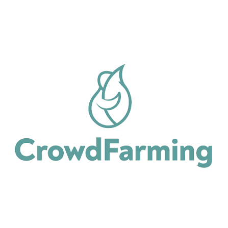 (España) | Marketplace B2C donde el consumidor "adopta" un árbol, animal o parcela de un agricultor aliado, pagando por adelantado la producción que recibirá directamente en su domicilio al momento de la cosecha. | Sin intermediarios de distribución; comunicación directa con el agricultor vía fotos/historias; logística propia de envío en Europa; orientado a consumidor final, no a comerciantes. | [crowdfarming.com](https://www.crowdfarming.com) |
| Indirecto |   (EE. UU.) | Plataforma fintech que fracciona la propiedad de terrenos agrícolas para que inversionistas financien tierra de cultivo a cambio de una renta anual pagada por el operador agrícola arrendatario. | Due diligence documental de tierras; retorno de renta anual fija; sin seguimiento operativo del cultivo ni app móvil; el retorno no depende de la cosecha. | [acretrader.com](https://www.acretrader.com) |
| Indirecto |  **Traive** (Brasil / EE. UU.) | Plataforma agrofintech B2B2C que usa inteligencia artificial para generar scoring crediticio y conectar a prestamistas/distribuidores de insumos con agricultores, agilizando la aprobación de crédito agrícola. | Modelo B2B2C (cliente es el prestamista, no el agricultor ni el comerciante); evaluación de riesgo con datos alternativos; sin evidencia de campo ni app móvil. | [traivefinance.com](https://traivefinance.com) |
| Indirecto |  **Kilimo** (Argentina, con presencia en Perú) | Plataforma SaaS climática que usa IA, satélites y datos meteorológicos para optimizar el riego y monetizar el ahorro de agua como créditos ambientales vendidos a empresas. | Recomendaciones diarias de riego sin hardware; alianzas corporativas de sostenibilidad; no financia parcelas ni conecta al agricultor con un comprador. | [kilimo.com](https://www.kilimo.com) |

### 2.1.1. Análisis competitivo

**Análisis para competidores directos**
 
**Competitive Analysis Landscape**
 
**¿Por qué llevar a cabo este análisis?**
¿Cómo debe posicionarse Muyu frente a plataformas de alquiler de parcela y crowdfunding agrícola ya validadas (Farmizen, Cropital, CrowdFarming) para maximizar la confianza del comerciante comprador, y qué brechas de transparencia y trazabilidad debemos priorizar frente a ellas?
 
| | |   |   |   |   |
|---|---|---|---|---|---|
| **Perfil** | Overview | Marketplace Agro-as-a-Service que conecta agricultores con comerciantes/compradores mediante financiamiento de una parcela específica por ciclo de cultivo, con Escrow y evidencia georreferenciada. | App que permite alquilar una mini-parcela dentro de una granja real por una cuota mensual, con seguimiento del cultivo desde el celular. | Plataforma de crowdfunding que financia granjas específicas de pequeños agricultores filipinos a cambio de un porcentaje de la cosecha/ganancia. | Marketplace de "adopción" de árboles, animales o parcelas, con entrega directa de la cosecha al consumidor final. |
| | Ventaja competitiva / ¿Qué valor ofrece al cliente? | Escrow con liberación de fondos por hitos verificables (foto + GPS + fecha/hora) y alertas climáticas preventivas, únicos en este grupo de competidores. | Experiencia "gamificada" tipo Farmville; visitas físicas a la parcela alquilada. | Respaldo institucional internacional (EE. UU., Países Bajos, Malasia) y acceso a seguro agrícola para el productor financiado. | Comunidad de adopción consolidada y logística propia de distribución en Europa. |
| **Perfil de Marketing** | Mercado objetivo | Comerciantes, restaurantes y distribuidores que requieren abastecimiento estable de insumos agrícolas; agricultores con conectividad limitada. | Familias urbanas de clase media en India con interés en alimentos orgánicos "farm-to-table". | Inversionistas retail interesados en impacto social, desde montos bajos (~US$ 100). | Consumidores finales urbanos con interés en alimentación orgánica y sostenibilidad. |
| | Estrategias de marketing | Alianzas con cooperativas agrarias, acceso gratuito a alertas climáticas como gancho de entrada, y Landing Page de alta conversión enfocada en el ahorro de costos. | Marketing emocional ("cultiva tu propia comida"), referidos y comunidad de "Tribus" de granja. | Marketing de impacto social, cobertura de prensa (Forbes, BBC) y alianzas con incubadoras internacionales. | Storytelling del agricultor, marketing de sostenibilidad y economía circular. |
| **Perfil de Producto** | Productos & Servicios | Financiamiento/alquiler de parcela por ciclo, Escrow, evidencia georreferenciada, alertas climáticas push. | Alquiler de mini-parcela, entrega semanal de cosecha, visitas a la granja. | Financiamiento de granja específica, seguro agrícola, matching de mercado para la cosecha. | Cajas de producto por temporada, suscripción de "adopción". |
| | Precios & Costos | Pago por hitos (25% por etapa) retenido en Escrow hasta aprobación de evidencia. | Cuota mensual por mini-parcela alquilada. | Inversión desde ~US$ 100, retorno de 3%-30% en menos de 6 meses. | Pago único por adopción/temporada. |
| | Canales de distribución (Web y/o Móvil) | App móvil + Landing Page web. | App móvil (Android/iOS). | Plataforma web, sin app móvil dedicada. | Web + logística propia de envío. |
| | Tecnologías usadas | App nativa/multiplataforma offline-first, cámara y GPS nativos con georreferenciación automática, Escrow con motor de reglas por hitos, integración de OpenWeather vía n8n, notificaciones push (Firebase) y WhatsApp. | App móvil de seguimiento de parcela y pedidos; sin automatización de evidencia georreferenciada ni custodia de fondos por hitos. | Plataforma web de crowdfunding; verificación de campo mediante red de agentes y entrevistas presenciales, sin evidencia fotográfica automatizada. | Plataforma web + logística de última milla; actualizaciones del agricultor vía fotos e historias publicadas manualmente. |
| **Análisis SWOT** | Fortalezas | Escrow por hitos verificables (GPS + timestamp) y funcionamiento offline-first, exclusivos frente a este grupo. | App ya probada, con más de 10 000 descargas y comunidad activa de consumidores. | Modelo de crowdfunding validado con respaldo institucional internacional y seguro agrícola incluido. | Comunidad de adopción consolidada y logística propia de distribución en Europa. |
| | Debilidades | Marca nueva sin comunidad ni historial de transacciones que genere confianza inicial. | No ofrece custodia de fondos por hitos ni verificación georreferenciada automática; reseñas de usuarios señalan quejas de calidad del producto entregado. | Verificación de campo manual (visitas/entrevistas) sin evidencia fotográfica automatizada ni app móvil, lo que limita su velocidad de aprobación y escala geográfica. | No ofrece custodia de fondos por hitos ni verificación automatizada; modelo orientado al consumidor final, no al comerciante B2B. |
| | Oportunidades | Mercado local (Perú) sin un competidor directo consolidado; alianzas con cooperativas agrarias. | Incorporar verificación de evidencia tipo Escrow para recuperar confianza. | Digitalizar su proceso de verificación de campo con evidencia fotográfica automatizada. | Expansión a mercados latinoamericanos. |
| | Amenazas | Ingreso de un competidor internacional (como Cropital o CrowdFarming) al mercado local; resistencia tecnológica de agricultores de mayor edad. | Plataformas con mayor transparencia erosionando su ventaja de confianza. | Plataformas con verificación automatizada y app móvil nativa que ofrecen mayor trazabilidad al mismo costo operativo. | Plataformas locales con menor costo operativo y mejor conocimiento del mercado regional, como Muyu. |
 
**Análisis para competidores indirectos**
 
**Competitive Analysis Landscape**
 
**¿Por qué llevar a cabo este análisis?**

¿Qué alternativas de financiamiento agrícola indirectas? ¿Como la inversión fraccionada en tierra? ¿Podrían captar al mismo comerciante/inversionista objetivo de Muyu?, y ¿Cómo debemos diferenciarnos para no ser percibidos como un simple vehículo financiero pasivo?
 
| | |   |   |   |   |
|---|---|---|---|---|---|
| **Perfil** | Overview | Marketplace Agro-as-a-Service que conecta agricultores con comerciantes mediante financiamiento de una parcela específica por ciclo de cultivo. | Plataforma fintech que fracciona la propiedad de terrenos agrícolas para que inversionistas financien tierra a cambio de una renta anual. | Plataforma agrofintech B2B2C que usa IA para generar scoring crediticio y conectar prestamistas/distribuidores de insumos con agricultores. | Plataforma SaaS climática que usa IA, satélites y datos meteorológicos para optimizar el riego y monetizar el ahorro de agua como créditos ambientales. |
| | Ventaja competitiva / ¿Qué valor ofrece al cliente? | Trazabilidad operativa diaria del cultivo financiado, con evidencia verificable antes de liberar cada pago. | Solidez financiera y diversificación de portafolio para inversionistas institucionales. | Evaluación de riesgo crediticio en tiempo real con datos alternativos, acelerando la aprobación de crédito para insumos. | Recomendaciones diarias de riego sin instalar hardware, con ingreso adicional por ahorro de agua verificado. |
| **Perfil de Marketing** | Mercado objetivo | Comerciantes, restaurantes y distribuidores que requieren abastecimiento estable de insumos agrícolas. | Inversionistas individuales de alto patrimonio y family offices. | Prestamistas, distribuidores de insumos y cooperativas que otorgan crédito a agricultores. | Agricultores medianos/grandes y empresas con metas de sostenibilidad hídrica en Latinoamérica. |
| | Estrategias de marketing | Alianzas con cooperativas agrarias, acceso gratuito a alertas climáticas y Landing Page de alta conversión. | Marketing financiero educativo (webinars de inversión alternativa). | Alianzas con bancos y distribuidores de insumos; cobertura de prensa agtech especializada. | Alianzas corporativas (venta de créditos de agua) y Academia de Riego con webinars gratuitos. |
| **Perfil de Producto** | Productos & Servicios | Financiamiento de parcela por ciclo, Escrow, evidencia georreferenciada, alertas climáticas push. | Compra fraccionada de tierra, renta anual, reventa de participación. | Scoring crediticio con IA, gestión digital del ciclo de crédito, alertas de riesgo financiero. | Recomendaciones de riego basadas en IA/satélite, verificación y venta de créditos de agua. |
| | Precios & Costos | Pago por hitos (25% por etapa) retenido en Escrow. | Inversión mínima desde ~US$ 15 000 por participación. | Modelo B2B2C: cobra al prestamista/distribuidor, no directamente al agricultor. | Acceso gratuito o de bajo costo al agricultor; monetización principal por venta de créditos de agua a empresas. |
| | Canales de distribución (Web y/o Móvil) | App móvil + Landing Page web. | Web responsive, sin app móvil dedicada. | Plataforma web integrada a sistemas de prestamistas, sin app móvil para agricultores. | Plataforma web/SaaS, sin app móvil dedicada para el agricultor. |
| | Tecnologías usadas | App offline-first, GPS + cámara nativos, Escrow por reglas de hitos, alertas climáticas vía n8n/OpenWeather. | Plataforma web de inversión con due diligence documental de tierras; sin seguimiento operativo del cultivo. | Modelos de IA/machine learning para scoring de riesgo con datos alternativos; sin evidencia georreferenciada ni Escrow. | IA, big data, imágenes satelitales y datos meteorológicos; sin evidencia fotográfica georreferenciada ni Escrow. |
| **Análisis SWOT** | Fortalezas | Trazabilidad verificable y funcionamiento offline-first orientados a la operación diaria. | Respaldo financiero sólido y modelo probado de inversión fraccionada en tierra. | Modelo de riesgo crediticio validado con fondeo internacional (Serie A) y adopción por bancos/distribuidores. | Presencia validada en 7 países, +220 000 hectáreas monitoreadas y alianzas corporativas de sostenibilidad de alto perfil. |
| | Debilidades | Marca nueva sin comunidad ni historial de transacciones. | Enfocado en el inversionista de tierra; no resuelve la necesidad operativa diaria del agricultor ni el abastecimiento del comerciante. | No brinda visibilidad operativa del cultivo ni evidencia verificable; el agricultor no es su cliente directo. | No resuelve el financiamiento del ciclo de cultivo ni conecta al agricultor con un comprador; su alcance se limita al riego. |
| | Oportunidades | Mercado local sin competidor directo consolidado. | Integrar servicios de seguimiento de cultivo a su oferta actual. | Integrar evidencia de campo geolocalizada a su scoring de riesgo. | Integrar un módulo de financiamiento o marketplace de cosecha a su base ya instalada de agricultores. |
| | Amenazas | Ingreso de un competidor internacional al mercado local. | Modelos operativos como Muyu, orientados a la operación diaria y no solo al financiamiento de tierra, pueden captar al segmento de comerciantes que AcreTrader no atiende. | Plataformas como Muyu, que ofrecen visibilidad operativa y pago estructurado por hitos, podrían atraer comerciantes que buscan control directo sin depender de un prestamista intermediario. | Plataformas como Muyu podrían incorporar alertas de riego similares aprovechando su misma integración de datos climáticos, reduciendo la necesidad de un servicio separado. |

### 2.1.2. Estrategias y tácticas frente a competidores

| Competidor | Táctica diferenciadora | Fortaleza del rival que enfrentamos | Debilidad del rival que aprovechamos |
|---|---|---|---|
|   | Ofrecer evidencia georreferenciada automática (GPS + timestamp) y funcionamiento offline-first como estándar desde el primer lanzamiento, en vez de depender de fotos y reportes manuales dentro de la app. | App ya probada, con más de 10 000 descargas y comunidad activa de consumidores. | No custodia fondos por hitos ni verifica automáticamente el origen de las evidencias; usuarios han reportado quejas de calidad del producto entregado. |
|   | Digitalizar por completo el ciclo de verificación: reemplazar las visitas y entrevistas presenciales por evidencia fotográfica georreferenciada y aprobación remota desde el celular del comerciante. | Respaldo institucional internacional y acceso a seguro agrícola para los productores financiados. | Proceso de verificación de campo manual y sin app móvil, lo que limita la velocidad de aprobación de hitos y la escala geográfica. |
|   | Posicionar a Muyu como proveedor de insumo estable para negocios (restaurantes, distribuidores), en vez de competir por el consumidor final urbano orientado a sostenibilidad. | Comunidad de adopción consolidada y logística de distribución propia en Europa. | No ofrece custodia de fondos por hitos ni verificación automatizada; su logística de última milla no está adaptada a la operación de un comerciante comprador. |
|   | Diferenciarse de un vehículo de inversión pasiva incorporando herramientas de seguimiento diario del cultivo (evidencia, alertas climáticas) que ningún inversionista de tierra necesita, pero todo comerciante comprador sí. | Solidez financiera y modelo de inversión fraccionada ya validado en Estados Unidos. | No atiende la necesidad operativa de abastecimiento del comerciante ni brinda visibilidad del avance del cultivo; solo ofrece retorno financiero pasivo. |
|   | Ofrecer al comerciante control directo del pago y visibilidad del cultivo, sin depender de un tercero prestamista que evalúa el riesgo del agricultor a distancia y sin visibilidad de campo. | Modelo de riesgo crediticio con IA validado, con fondeo internacional (Serie A) y adopción por bancos y distribuidores de insumos. | No brinda visibilidad operativa del cultivo ni evidencia verificable del avance; el agricultor no es su cliente directo, sino el prestamista. |
|   | Posicionar las alertas climáticas de Muyu como parte de un servicio integral de financiamiento y trazabilidad, cubriendo la necesidad de pago y evidencia que Kilimo no atiende, en vez de competir solo en optimización de riego. | Presencia validada en 7 países y alianzas corporativas de sostenibilidad de alto perfil (Coca-Cola, Microsoft, Google). | No conecta al agricultor con un comprador ni resuelve el financiamiento del ciclo de cultivo; su alcance se limita a la gestión del riego. |

A partir del análisis competitivo desarrollado, se consolidan las Fortalezas, Oportunidades, Debilidades y Amenazas (FODA) propias de Muyu, y se cruzan para derivar cuatro grupos de estrategias (Corregir, Afrontar, Mantener, Explotar).

| | **Oportunidades (O)** | **Amenazas (A)** |
|---|---|---|
| Matriz F.O.D.A. y C.A.M.E.  | O1. Mercado peruano/LatAm sin un competidor directo consolidado que combine Escrow + evidencia georreferenciada. O2. Alianzas con cooperativas y asociaciones agrarias ya constituidas (AGRO RURAL, municipios). O3. Vacío dejado por competidores indirectos: Kilimo no financia, Traive no da visibilidad de campo. O4. Penetración creciente de celulares en zonas rurales. | A1. Ingreso de un competidor internacional directo (Cropital, CrowdFarming o Farmizen) al mercado peruano. A2. Resistencia a la adopción tecnológica de agricultores de mayor edad. A3. Que un competidor indirecto (Kilimo o Traive) integre las funciones que hoy diferencian a Muyu. A4. Variabilidad de conectividad y dispositivos antiguos en zonas rurales. |
| **Fortalezas (F)** F1. Escrow con liberación de fondos por hitos verificables (foto + GPS + timestamp), único frente a los 6 competidores analizados. F2. Funcionamiento offline-first adaptado a la conectividad limitada del campo. F3. Resuelve simultáneamente financiamiento y trazabilidad operativa; ningún competidor lo hace a la vez. | **Estrategia Ofensiva (FO)** FO1. Usar el Escrow verificable (F1) como argumento central en alianzas con cooperativas (O2), ofreciendo garantía de pago transparente como gancho de adopción. FO2. Aprovechar el offline-first (F2) para posicionarse en zonas rurales de conectividad limitada (O4) antes que competidores internacionales dependientes de conexión constante. FO3. Capitalizar la propuesta única de financiamiento + trazabilidad (F3) para captar al comerciante que hoy usa soluciones parciales como Kilimo o Traive (O3). | **Estrategia Defensiva (FA)** FA1. Comunicar el Escrow verificable (F1) como sello de confianza ante la eventual llegada de un competidor internacional (A1), acelerando el efecto de red local antes de que aterricen. FA2. Diseñar la app para dispositivos de gama baja y modo offline robusto (F2), mitigando el riesgo de exclusión por conectividad o hardware antiguo (A4). FA3. Mantener el foco en un problema resuelto de punta a punta (F3) para que, si un competidor indirecto agrega una función aislada (A3), no logre igualar la propuesta integral de Muyu. |
| **Debilidades (D)** D1. Marca nueva sin comunidad de usuarios ni historial de transacciones. D2. Dependencia de un solo canal de captación inicial (alianzas con cooperativas) mientras se consolida un flujo propio de adquisición. D3. Sin integraciones con actores financieros externos (a diferencia de Traive) que amplíen el acceso a crédito de los agricultores. | **Estrategia de Reorientación (DO)** DO1. Usar las alianzas con cooperativas (O2) como fuente de validación social que compense la falta de historial de transacciones (D1). DO2. Explorar en una fase posterior una integración ligera con actores de crédito agrícola (O3) para cerrar la brecha de D3 sin construir un motor de scoring propio desde cero. DO3. Diversificar canales de adquisición más allá de cooperativas (mitigando D2), replicando el gancho de alertas climáticas gratuitas con promotores locales y municipios. | **Estrategia de Supervivencia (DA)** DA1. Priorizar el lanzamiento en un solo valle agrícola (foco de nicho) antes de expandirse, para no exponer la debilidad de marca nueva (D1) frente a un competidor internacional en múltiples frentes (A1). DA2. Mantener llamada telefónica como respaldo de las notificaciones push, para que la dependencia de un solo canal (D2) no se agrave si falla la conectividad (A4). DA3. Documentar y resguardar internamente el motor de reglas del Escrow para reducir el riesgo de réplica por un competidor indirecto (A3) mientras la marca aún no tiene defensa reputacional (D1). |

## 2.2. Entrevistas
### 2.2.1. Diseño de entrevistas

**Comerciante**
 
Se busca comprender los desafíos actuales del comerciante o comprador al abastecerse de productos agrícolas de forma confiable y con precios estables y validar la propuesta de valor 
 
- Contexto:
    - ¿Me podría contar un poco sobre usted y el negocio al que se dedica?
- Comportamiento de compra actual:
    - ¿Qué productos agrícolas compra normalmente para su negocio?
    - ¿Cada cuánto tiempo necesita comprar estos productos?
    - ¿A quién le compra actualmente sus productos agrícolas?
    - Cuando necesita comprar, ¿cómo decide a qué proveedor comprarle?
    - ¿Los precios que paga por los productos agrícolas suelen variar mucho?
    - ¿Alguna vez ha tenido problemas para conseguir la cantidad de producto que necesitaba?
    - ¿Alguna vez ha comprado o separado productos directamente con un agricultor antes de la cosecha?
- Percepción de riesgo y confianza:
    - Si tuviera que pagar una parte del dinero antes de que el producto esté cosechado, ¿qué le preocuparía?
    - ¿Qué necesitaría para confiar en que el agricultor está realizando correctamente el trabajo del cultivo?
    - Cuando recibe una fotografía de un cultivo, ¿cómo comprobaría que fue tomada en ese terreno y en esa fecha?
    - ¿Qué medio de comunicación revisa primero cuando un proveedor necesita contactarlo?
- Validación de la propuesta, financiamiento de parcela y Escrow:
    - Si hubiera pagado por adelantado una parte de una producción, ¿cada cuánto tiempo le gustaría conocer su avance?
    - ¿Cómo preferiría recibir información sobre el avance del cultivo?
    - Imagine que tiene la opción de elegir una parcela y acordar desde el inicio cuánto producto recibirá al finalizar la cosecha. ¿Le interesaría una forma de compra como esta? ¿Por qué?
    - ¿Qué información necesitaría conocer sobre una parcela antes de aceptar trabajar con el agricultor?
    - Imagine que el dinero entregado no llega de inmediato al agricultor. El dinero queda retenido y se libera por partes conforme termina cada etapa del cultivo. ¿Esto le daría mayor seguridad? ¿Qué necesitaría comprobar antes de aprobar cada pago?
    - Si recibe fotografías y videos que demuestran que una etapa del cultivo terminó, ¿le gustaría aprobarla o rechazarla desde su celular?
    - ¿Qué información tendría que aparecer junto con esas fotografías o videos para confiar en ellas?
    - Si revisara desde su celular el avance completo del cultivo que está financiando, ¿qué información consideraría más importante?
    - ¿Le gustaría recibir avisos sobre situaciones importantes relacionadas con el cultivo? ¿Qué avisos?
    - ¿qué aspecto le daría mayor confianza para trabajar directamente con un agricultor?
    - ¿Qué aspecto le generaría mayor preocupación en una forma de compra como esta?
    - Si pudiera cambiar una sola cosa de la forma en que actualmente compra productos agrícolas, ¿qué cambiaría?
 
**Agricultor**
 
Se busca comprender los desafíos actuales del agricultor en el campo relacionados con la conectividad, el registro de evidencias del cultivo , los riesgos climáticos y validar la propuesta de valor 
 
- Contexto:
    - ¿Me podría contar un poco sobre usted y su trabajo en la agricultura?
    - ¿Cómo es normalmente un día de trabajo suyo en el campo?
    - ¿Cómo sabe qué trabajos debe realizar cada día o durante la semana?
    - ¿Suele usar su celular mientras trabaja en el campo?
    - ¿Qué cosas le resultan fáciles y cuáles le resultan difíciles cuando usa el celular durante su trabajo?
    - ¿Cómo es la señal de internet o celular en el lugar donde trabaja?
    - Cuando no tiene señal, ¿qué hace si necesita enviar un mensaje, una fotografía o algún tipo de información?
    - ¿Alguna vez ha tenido que tomar fotografías del cultivo para mostrárselas a otra persona?
    - Cuando envía una fotografía del cultivo, ¿cómo demuestra cuándo y dónde fue tomada?
- Clima:
    - ¿Cómo se informa normalmente sobre lluvias, cuando hace mucho frío u otros cambios del clima?
    - ¿Alguna vez recibió demasiado tarde información sobre una lluvia fuerte, helada u otro cambio climático que afectara su cultivo?
- Comunicación de avance:
    - Cuando otra persona necesita conocer cómo está avanzando su cultivo, ¿cómo se comunica con ella?
- Validación de la propuesta, offline-first, georreferenciación y alertas:
    - Imagine que toma una fotografía en el campo cuando no tiene internet. ¿Le serviría que el celular guarde esa fotografía y la envíe automáticamente cuando regrese la señal? ¿Por qué?
    - ¿Le serviría que, al tomar una fotografía, el celular registre automáticamente el lugar, la fecha y la hora?
    - ¿Le gustaría recibir un aviso en su celular cuando exista riesgo de lluvia fuerte, helada u otro evento climático que afecte su cultivo? ¿Cómo preferiría recibir ese aviso?
    - ¿Qué tipo de aviso revisaría con mayor rapidez?
    - Si existiera una aplicación para ayudarlo con estas tareas, ¿qué sería lo más importante para que le resulte fácil de usar?
    - ¿Hay alguna tarea de su trabajo que le gustaría realizar de forma más rápida o sencilla desde su celular?

### 2.2.2. Registro de entrevistas

### Segmento: Comerciante / Comprador

<table>

<tr><th colspan="4">Entrevista #1</th></tr>

<tr>
  <td><strong>Nombre completo</strong></td>
  <td colspan="3">Estefanía </td>
</tr>

<tr>
  <td><strong>Edad</strong></td>
  <td>25 años</td>
  <td><strong>Distrito</strong></td>
  <td>San Juan de Lurigancho</td>
</tr>

<tr>
  <td><strong>Ocupación</strong></td>
  <td>Comerciante mayorista de productos agrícolas</td>
  <td><strong>Inicio y duración</strong></td>
  <td>00:00 - 11:50</td>
</tr>

<tr>
  <td><strong>Enlace</strong></td>
  <td colspan="3">
    <a href="https://upcedupe-my.sharepoint.com/:v:/g/personal/u202114701_upc_edu_pe/IQAqMqcQjia8RqBywags0-u8AUjZ33x0Dn8me5iLn0ckPPE">
      upc-pre-202620-1acc0238-13981-allpatech-needfinding-av1.mp4
    </a>
  </td>
</tr>

<tr>
  <td colspan="2" valign="top">
    <strong>Resumen</strong> 
    Estefanía tiene 25 años y hace cinco años que se dedica a la venta al por mayor de productos agrícolas. Empezó ayudando en el negocio de su padre, y hoy a minoristas, bodegas y restaurantes.Todos los días, entre compras, compra tomate, limón, palta, cebolla, porque necesita que la mercadería esté fresca. Sus proveedores principales son acopiadores, otros mayoristas y, en algunos casos, agricultores con los que tiene contacto directo. Busca un proveedor que ofrezca buena calidad, precios transparentes y una respuesta ágil por WhatsApp. Entre sus principales problemas menciona la fluctuación de los precios, los bloqueos en las carreteras, los eventos climáticos y el riesgo de adelantar dinero sin tener la certeza de que el agricultor va a pagar. Para tener seguridad de una compra anticipada necesita ver el progreso del cultivo a través de fotos, videos e informes breves. Es importante que las evidencias porten GPS, fecha, hora y etapa productiva. También admite un sistema donde el dinero sea retenido y entregado por partes una vez comprobado el trabajo realizado. Le gusta que le avisen directamente al celular cuando hay que pagar, el clima, las plagas o cuando está cerca la cosecha.
  </td>

  <td colspan="2" valign="top">
    <strong>Foto</strong> 
    
  </td>
</tr>

</table>

<table>

<tr><th colspan="4">Entrevista #2</th></tr>

<tr>
  <td><strong>Nombre completo</strong></td>
  <td colspan="3">Sebastian Velgara Arturo Chavez</td>
</tr>

<tr>
  <td><strong>Edad</strong></td>
  <td>22 años</td>
  <td><strong>Distrito</strong></td>
  <td>San Juan de Lurigancho</td>
</tr>

<tr>
  <td><strong>Ocupación</strong></td>
  <td>Trabaja en el rubro de gastronomia y ayuda en produccion</td>
  <td><strong>Inicio y duración</strong></td>
  <td>00:00 - 16:42</td>
</tr>

<tr>
  <td><strong>Enlace</strong></td>
  <td colspan="3">
    <a href="https://1drv.ms/v/c/edf8af4855503e79/IQCw8y4bkdRSSpB8bc3-p4GKAQmIVxfnMViD72ykSOST93o?e=7qphgm">
      upc-pre-202620-1acc0238-13981-allpatech-needfinding-av1.mp4
    </a>
  </td>
</tr>

<tr>
  <td colspan="2" valign="top">
    <strong>Resumen</strong> 
    el entrevistado trabaja en un restaurante en Larcomar y se encarga del abastecimiento de productos agrícolas como tomate, limón y ajíes. Por el alto volumen de ventas, realizan pedidos grandes cada semana, aunque algunos productos se reponen cada tres o cuatro días según el consumo. Para elegir un proveedor, valora que pueda cumplir con las cantidades y pesos y que el producto llegue a tiempo, ya que no puede quedarse sin insumos que ya están en la carta. Quiere trazabilidad del proceso, información sobre el suelo, insumos usados y etapas del cultivo, todo con evidencia visual confiable. También le preocupa la inocuidad, los químicos utilizados y su impacto en el suelo

  <td colspan="2" valign="top">
    <strong>Foto</strong> 
    
  </td>
</tr>

</table>

---

### Segmento: Agricultor

<table>

<tr><th colspan="4">Entrevista #3</th></tr>

<tr>
  <td><strong>Nombre completo</strong></td>
  <td colspan="3">Lili Vera Vela</td>
</tr>

<tr>
  <td><strong>Edad</strong></td>
  <td>52 años</td>
  <td><strong>Distrito</strong></td>
  <td>Chachapoyas</td>
</tr>

<tr>
  <td><strong>Ocupación</strong></td>
  <td>Agricultora de café</td>
  <td><strong>Inicio y duración</strong></td>
  <td>00:04-10:28</td>
</tr>

<tr>
  <td><strong>Enlace</strong></td>
  <td colspan="3">
    <a href="https://1drv.ms/v/c/083af2ec73c53b69/IQBkx-apSHa6R6Vm-K3aQe9DAYW7JrU9WlRYV9jap_T4aQE?e=b94ZJw">
      upc-pre-202620-1acc0238-13981-allpatech-needfinding-av1.mp4
    </a>
  </td>
</tr>
<tr>
  <td colspan="2" valign="top">
    <strong>Resumen</strong> 
    Lili Vera Vela tiene 52 años y se dedica a la producción de café desde hace cerca de veinte años . Su trabajo diario consiste en revisar las plantas, aplicarles abono y agua, y vigilar el estado del cultivo. Si se encuentra con algún problema que no pueda resolver, busque el apoyo de los técnicos o de las personas de su entorno. El móvil le sirve sobre todo para llamar, porque mientras trabaja le resulta incómodo escribir mensajes, ya que sus manos suelen estar ocupadas o sucias. La conexión a Internet varía según la zona de la parcela, en algunos lugares debe buscar señal o pedirle a otra persona que envíe información. Envíe fotos, videos o audios cuando requiera asesoría para mostrar el estado del cultivo. Creo que es bueno sacar fotos aunque no pueda compartirlas y mandárlas cuando tenga señal. También aprecia que las fotos registren de forma automática la fecha, hora y lugar en el que fueron tomadas. En la entrevista contó que en una ocasión llovió sobre café que estaba secándose y por esto cree que es importante recibir avisos sobre los cambios climáticos. Para ella, las funciones principales deben seguir estando disponibles cuando se encuentra trabajando en áreas con conexión limitada.
  </td>

  <td colspan="2" valign="top">
    <strong>Foto</strong> 
    
  </td>
</tr>

</table>

<table>

<tr><th colspan="4">Entrevista #4</th></tr>

<tr>
  <td><strong>Nombre completo</strong></td>
  <td colspan="3">Jorge Manuel Nitales Negro</td>
</tr>

<tr>
  <td><strong>Edad</strong></td>
  <td>22 años</td>
  <td><strong>Distrito</strong></td>
  <td>Huaral</td>
</tr>

<tr>
  <td><strong>Ocupación</strong></td>
  <td>Trabajador agrícola</td>
  <td><strong>Inicio y duración</strong></td>
  <td>00:00 - 10:30</td>
</tr>

<tr>
  <td><strong>Enlace</strong></td>
  <td colspan="3">
    <a href="https://1drv.ms/v/c/edf8af4855503e79/IQCefFPQgLWIQKkhU0grteUiAdIKof5Ox_TjYF4enJms1-E?e=LqwgCu">
      upc-pre-202620-1acc0238-13981-allpatech-needfinding-av1.mp4
    </a>
  </td>
</tr>

<tr>
  <td colspan="2" valign="top">
    <strong>Resumen</strong> 
    Jorge Manuel Nitales Negro tiene 22 años y realiza labores agrícolas en zonas rurales de Huaral. Entre sus principales actividades se encuentran gestionar el riego de los cultivos, revisar su crecimiento y determinar cuándo necesitan más fertilizantes. Su trabajo exige desplazarse dentro de las zonas de cultivo y revisar de forma constante el estado de las plantas.

  <td colspan="2" valign="top">
    <strong>Foto</strong> 
    
  </td>
</tr>

</table>

<table>

### 2.2.3. Análisis de entrevistas

A continuación les mostraremos detalles de las entrevistas:

#### Distribución de entrevistas por segmento

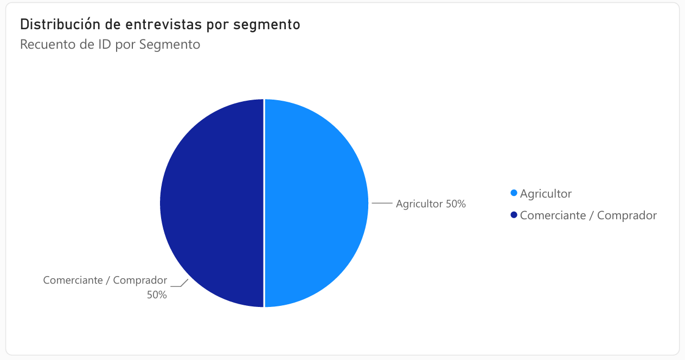

*Nota: El 50% de los entrevistados pertenece al segmento Agricultor y el otro 50% al segmento Comerciante / Comprador. Esta distribución permite analizar las necesidades de quienes trabajan directamente con los cultivos y de quienes dependen del abastecimiento agrícola para desarrollar sus actividades comerciales.*

*Elaboración propia.*

#### Distribución de entrevistados por entorno de trabajo

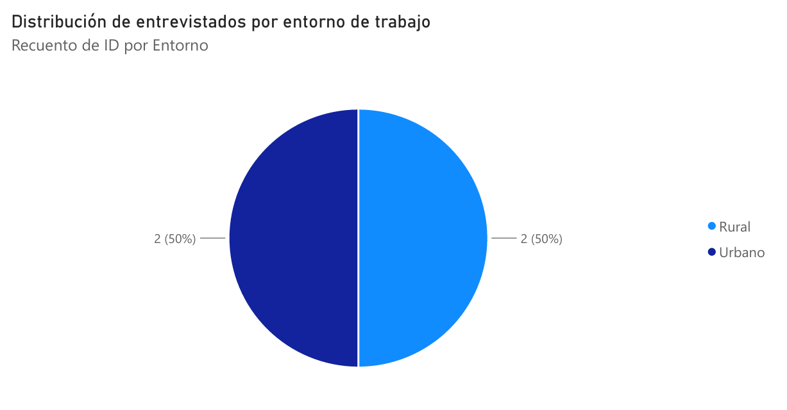

*Nota: El 50% de los entrevistados desarrolla sus actividades principalmente en un entorno rural, mientras que el otro 50% trabaja en un entorno urbano y comercial.*

*Elaboración propia.*

#### Hallazgos del segmento Comerciante / Comprador

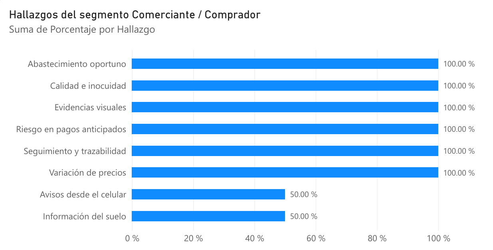

*Nota: El abastecimiento oportuno, la calidad e inocuidad, las evidencias visuales, el riesgo en pagos anticipados, el seguimiento y trazabilidad, y la variación de precios estuvieron presentes en el 100% de las entrevistas del segmento. Los avisos desde el celular y la información del suelo aparecieron en el 50%.*
*Elaboración propia.*

El riesgo asociado a los pagos anticipados también estuvo presente en ambas entrevistas expresó preocupación por entregar dinero sin tener certeza de que el agricultor cumplirá con el acuerdo, tambien se consideró interesante realizar pagos progresivos según el avance del cultivo, aunque reconoce el riesgo de trabajar bajo un esquema distinto al pago tradicional. Estos resultados muestran que el segmento necesita información clara y verificable antes de tomar decisiones relacionadas con compras y pagos.

#### Hallazgos del segmento Agricultor

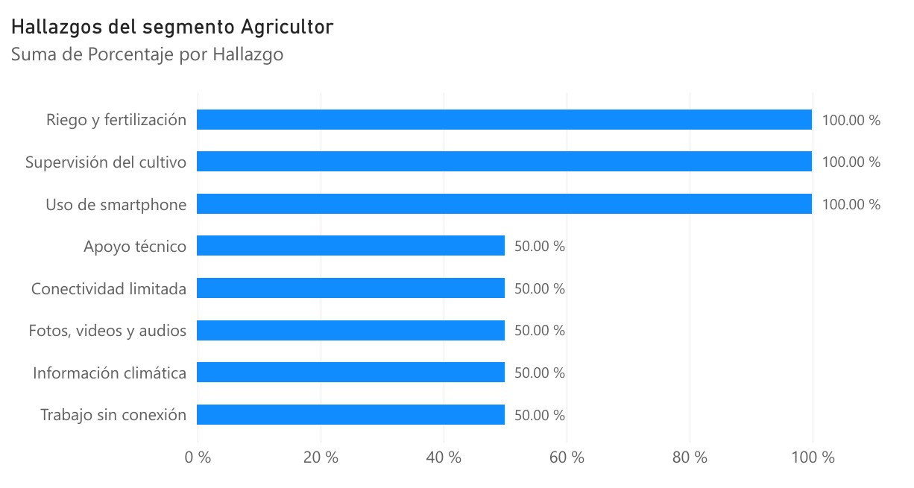

*Nota: La supervisión del cultivo, el riego y fertilización, y el uso del celular estuvieron presentes en el 100% de las entrevistas del segmento Agricultor. El apoyo técnico, la conectividad limitada, el uso de fotografías, videos y audios, la información climática y el trabajo sin conexión aparecieron en el 50%.*
*Elaboración propia.*

Asimismo, es vital tomar en consideración que para todos los entrevistados sería muy importante contar con una aplicación que les brinde recomendaciones personalizadas tomando en cuenta los diversos factores que albergan la realidad de cada usuario, siempre y cuando estas recomendaciones cuenten con información precisa, detallada en los puntos importantes, verificada y adaptada al contexto de la persona que la está usando; en este sentido, se identificó que todos los entrevistados valoran mucho un enfoque visual de la información (ej, fotos, gráficos y videos); aquello nos brinda la oportunidad de conocer nuestro punto de partida hacia cómo nos presentaremos a las personas 

[Ver archivos del análisis de entrevistas](https://drive.google.com/drive/folders/1oKjyxYU3_nnoHlnLRSSLgNb32xE3QeD8?usp=sharing)

### Análisis de Dispositivos Móviles y Sistemas Operativos

A partir de las entrevistas realizadas se identificaron los dispositivos móviles empleados por los participantes de ambos segmentos.

| Entrevista #1 |  |  |  |
| :--- | :--- | :--- | :--- |
| **Nombre completo** | Lili Vera Vela | **Segmento** | Agricultor |
| **Entorno** | Rural | **Modelo de celular** | **iPhone 17** |
| **Sistema operativo** | iOS | **Dispositivo** |  |

---

| Entrevista #2 |  |  |  |
| :--- | :--- | :--- | :--- |
| **Nombre completo** | Estefanía | **Segmento** | Comerciante / Comprador |
| **Entorno** | Urbano | **Modelo de celular** | **iPhone 15** |
| **Sistema operativo** | iOS | **Dispositivo** |  |

---

| Entrevista #3 |  |  |  |
| :--- | :--- | :--- | :--- |
| **Nombre completo** | Jorge Manuel Nitales Negro | **Segmento** | Agricultor |
| **Entorno** | Rural | **Modelo de celular** | **Motorola Fusion H50** |
| **Sistema operativo** | Android | **Dispositivo** |  |

---

| Entrevista #4 |  |  |  |
| :--- | :--- | :--- | :--- |
| **Nombre completo** | Sebastian Velgara Arturo Chavez | **Segmento** | Comerciante / Comprador |
| **Entorno** | Urbano | **Modelo de celular** | **iPhone 17** |
| **Sistema operativo** | iOS | **Imagen** |   |

**Estadística de Sistemas Operativos:**

El análisis realizado en Power BI muestra la distribución de los sistemas operativos y dispositivos identificados durante las entrevistas.

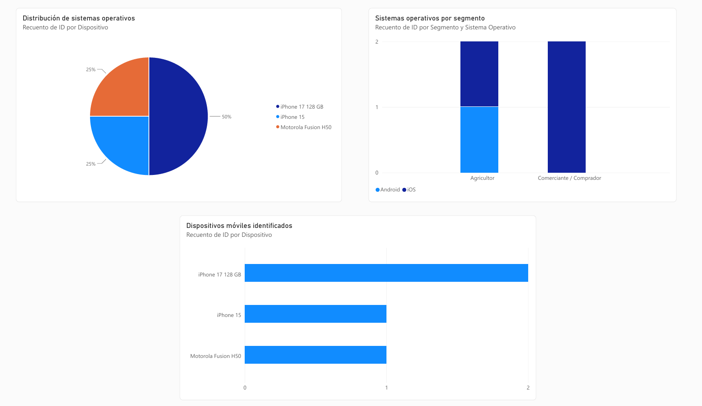

## 2.3. Needfinding
### 2.3.1. User Personas

A partir de la información obtenida durante las entrevistas y del análisis de los segmentos objetivo, se elaboraron dos User Personas.

#### User Persona: Segmento Agricultor

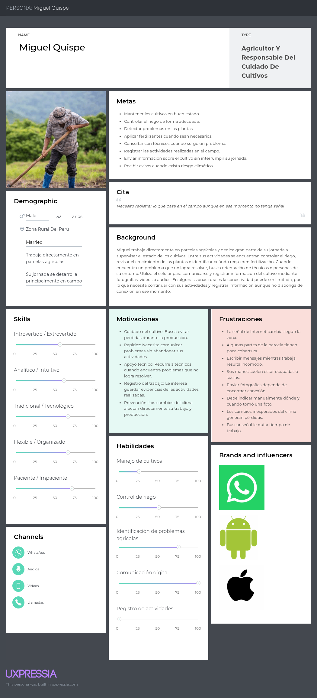

#### User Persona: Segmento Comerciante / Comprador

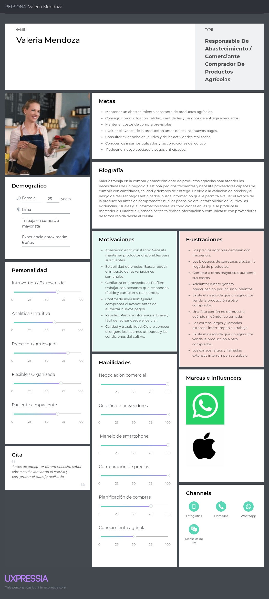

### 2.3.2. User Task Matrix

Para la elaboración de la User Task Matrix se consideran las tareas relacionadas a los usuarios y que fueron planteadas durante el proceso de entrevista de los dos segmentos (Comerciante/Comprador y Agricultor).
 
<table>
<tr>
  <th rowspan="2">Tarea de usuario</th>
  <th colspan="2">Valeria Mendoza (Comerciante mayorista)</th>
  <th colspan="2">Miguel Quispe (Agricultor y responsable del cuidado de cultivos)</th>
</tr>
<tr>
  <th>Importancia</th>
  <th>Frecuencia</th>
  <th>Importancia</th>
  <th>Frecuencia</th>
</tr>
<tr>
  <td><strong>Verificar el estado o avance del cultivo</strong></td>
  <td>Alta</td>
  <td>A menudo</td>
  <td>Alta</td>
  <td>A menudo</td>
</tr>
<tr>
  <td><strong>Comunicarse sobre el avance del cultivo</strong></td>
  <td>Alta</td>
  <td>A menudo</td>
  <td>Alta</td>
  <td>A menudo</td>
</tr>
<tr>
  <td><strong>Tomar o revisar evidencia fotográfica del cultivo</strong></td>
  <td>Alta</td>
  <td>A menudo</td>
  <td>Alta</td>
  <td>A veces</td>
</tr>
<tr>
  <td><strong>Gestionar el pago o dinero del ciclo de cultivo</strong></td>
  <td>Alta</td>
  <td>A veces</td>
  <td>Baja</td>
  <td>Rara vez</td>
</tr>
<tr>
  <td><strong>Buscar información para resolver un problema</strong></td>
  <td>Media</td>
  <td>A veces</td>
  <td>Alta</td>
  <td>A veces</td>
</tr>
<tr>
  <td><strong>Informarse sobre el clima</strong></td>
  <td>Media</td>
  <td>Rara vez</td>
  <td>Alta</td>
  <td>A menudo</td>
</tr>
<tr>
  <td><strong>Registrar o consultar el historial de actividades</strong></td>
  <td>Alta</td>
  <td>A veces</td>
  <td>Media</td>
  <td>A veces</td>
</tr>
<tr>
  <td><strong>Elegir con quién trabajar (proveedor / parcela)</strong></td>
  <td>Alta</td>
  <td>A veces</td>
  <td>Baja</td>
  <td>Rara vez</td>
</tr>
</table>

### 2.3.3. User Journey Mapping
El recorrido que se describe es un viaje de cinco fases que generalmente va de la esperanza a la frustración: inicia con el descubrimiento (Aware), pasa por una implementación incierta (Join) y alcanza un punto crítico de confusión al enfrentar un problema (Use). Este ciclo de aprendizaje por prueba y error (Develop) y que al final desemboca en (Leave).
#### User Journey Map: Segmento Agricultor

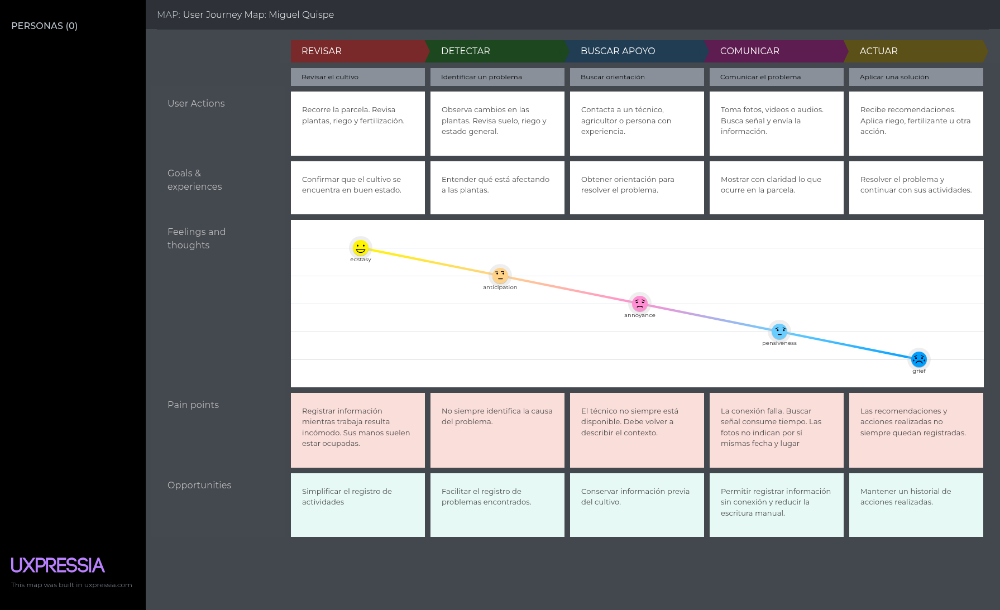

#### User Journey Map: Segmento Comerciante / Comprador

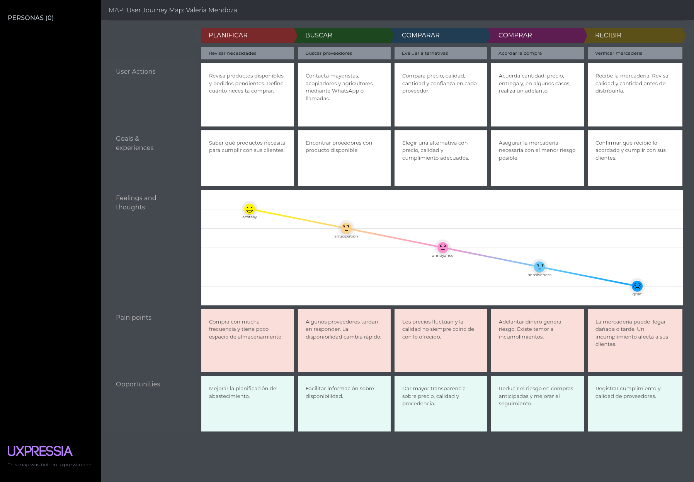

### 2.3.4. Empathy Mapping

#### Empathy Map: Segmento Agricultor

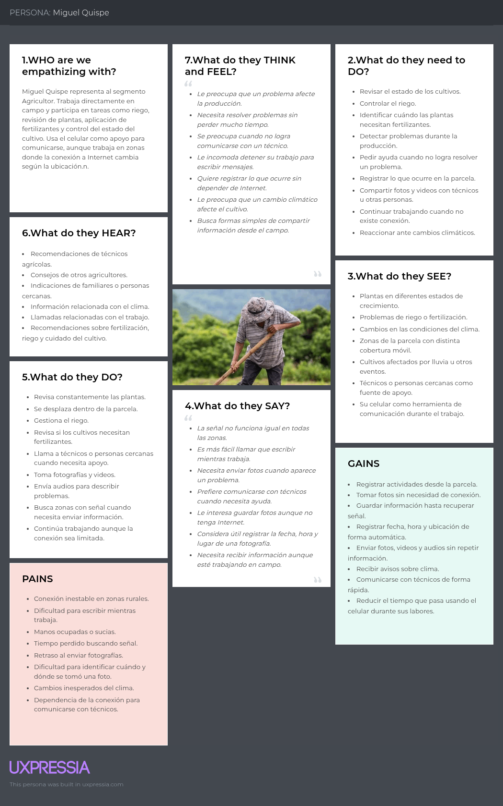

#### Empathy Map: Segmento Comerciante / Comprador

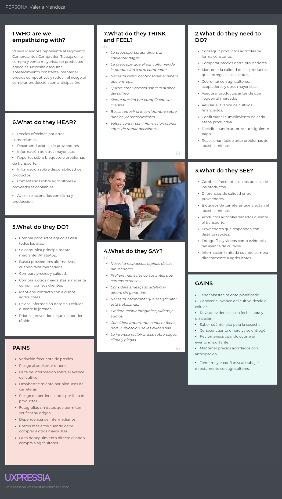

### 2.3.5. Big Picture EventStorming

El equipo realizó una sesión de Big Picture Event Storming con el objetivo de comprender el dominio general de AgroFlow e identificar los principales eventos del negocio, sus relaciones y los actores involucrados. Esta actividad permitió obtener una visión de alto nivel sobre el proceso de publicación de parcelas, financiamiento, ejecución de labores, registro de evidencias y validación de hitos.

#### Step 1: Collect Domain Events

En esta etapa se identificaron los eventos principales del dominio, expresados en pasado, sin enfocarse aún en su orden definitivo. El objetivo fue recopilar los hechos más relevantes que ocurren dentro del negocio.

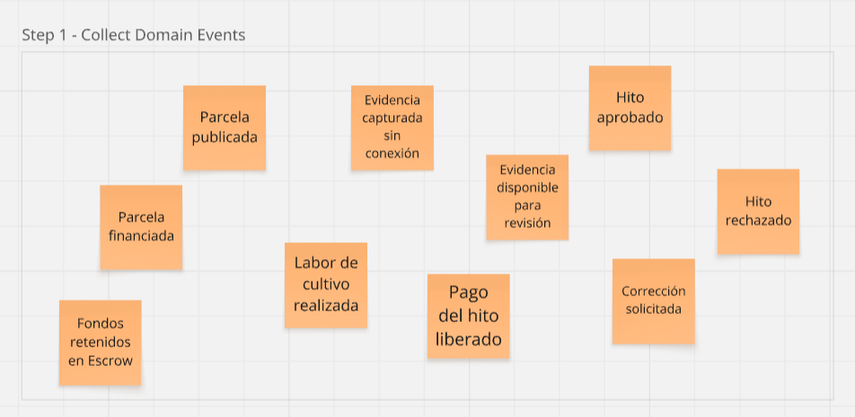

#### Step 2: Refine Domain Events

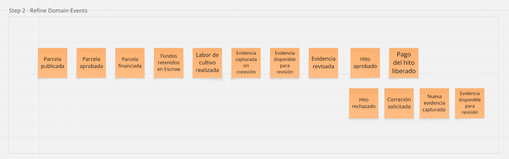

#### Step 3: Track Causes

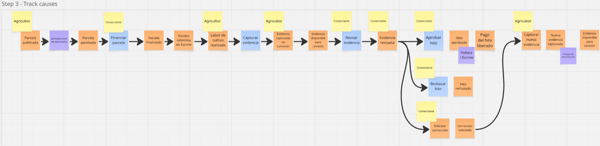

En conjunto, el Big Picture Event Storming permitió al equipo comprender de manera general el funcionamiento del negocio, identificar el flujo principal del proceso y reconocer escenarios alternativos que deben ser considerados en el diseño de la solución.

[Ver en Miro](https://miro.com/app/board/uXjVHl-6uS8=/?share_link_id=348732565706)

### 2.3.6. Ubiquitous Language

El Ubiquitous Language de AgroFlow establece un vocabulario común para los conceptos principales del dominio agrícola y de financiamiento manejados por agricultores, comerciantes y el equipo de desarrollo.

El lenguaje se mantendrá actualizado conforme el equipo obtenga un mayor conocimiento del dominio y valide los conceptos con los stakeholders.

| Term | Spanish equivalent | Definition |
|---|---|---|
| **Farmer** | Agricultor | Persona responsable de gestionar una parcela agrícola, realizar labores de cultivo y registrar evidencias relacionadas con el avance de los hitos. |
| **Merchant** | Comerciante | Persona interesada en financiar la producción agrícola y realizar seguimiento al cumplimiento de los hitos asociados a la parcela financiada. |
| **Parcel** | Parcela | Unidad de terreno agrícola registrada dentro del proceso de producción y financiamiento. |
| **Parcel Approval** | Aprobación de parcela | Validación mediante la cual se determina que una parcela cumple las condiciones necesarias para continuar con el proceso de financiamiento. |
| **Financing** | Financiamiento | Acuerdo mediante el cual un comerciante asigna fondos para apoyar la producción correspondiente a una parcela. |
| **Funded Parcel** | Parcela financiada | Parcela que cuenta con un financiamiento aceptado por un comerciante. |
| **Escrow** | Escrow / depósito en garantía | Mecanismo mediante el cual los fondos asociados al financiamiento permanecen retenidos hasta que se cumplen las condiciones establecidas para su liberación. |
| **Crop Work** | Labor de cultivo | Actividad agrícola realizada sobre la parcela como parte del proceso productivo. |
| **Milestone** | Hito | Etapa verificable del proceso agrícola utilizada para evaluar el avance del trabajo realizado en una parcela financiada. |
| **Evidence** | Evidencia | Registro que permite demostrar la realización o avance de una labor agrícola asociada a un hito. |
| **Milestone Evidence** | Evidencia de hito | Evidencia presentada por el agricultor para sustentar el cumplimiento de un hito específico. |
| **Evidence Review** | Revisión de evidencia | Evaluación realizada sobre la evidencia presentada para determinar si el hito cumple con las condiciones acordadas. |
| **Milestone Approval** | Aprobación de hito | Decisión mediante la cual el comerciante acepta la evidencia presentada y reconoce el cumplimiento del hito. |
| **Milestone Rejection** | Rechazo de hito | Decisión mediante la cual la evidencia presentada no es aceptada y el hito permanece pendiente de cumplimiento. |
| **Correction Request** | Solicitud de corrección | Solicitud realizada después del rechazo de un hito para que el agricultor corrija o complete la evidencia requerida. |
| **Payment Release** | Liberación de pago | Liberación de los fondos correspondientes después de que un hito cumple las condiciones establecidas. |
| **Climate Alert** | Alerta climática | Aviso relacionado con una condición climática que puede afectar las labores agrícolas o el estado del cultivo. |

## 2.4. Requirements specification
### 2.4.1. User Stories

| Epic ID | Título de la Epic | Descripción |
| :--- | :--- | :--- |
| **EPIC-01** | Identity and Access Management (IAM) | Gestión de registro, autenticación, perfiles y seguridad basada en roles (Agricultor/Comerciante) para la plataforma. |
| **EPIC-02** | Gestión de Parcelas y Financiamiento | Ciclo de negocio desde la publicación y búsqueda de parcelas, hasta la negociación y retención de fondos en Escrow. |
| **EPIC-03** | Ejecución Agrícola y Evidencias | Registro de las labores de cultivo en el campo, presentación de reportes y almacenamiento de evidencias fotográficas. |
| **EPIC-04** | Revisión y Flujo de Pagos | Motor de decisiones del comerciante para aprobar hitos o solicitar correcciones, y la consecuente liberación de pagos. |
| **EPIC-05** | Proceso Climático | Recepción de datos meteorológicos externos y emisión de alertas de riesgo para proteger las labores agrícolas. |

<table width="100%">
  <thead>
    <tr align="center">
      <th width="20%">Story ID</th>
      <th width="30%">User</th>
      <th width="25%">Priority</th>
      <th width="25%">Epic</th>
    </tr>
  </thead>
  <tbody>
    <tr align="center">
      <td>US01</td>
      <td>Agricultor / Comerciante</td>
      <td>Alta</td>
      <td>EPIC-01</td>
    </tr>
    <tr>
      <th align="center">Title</th>
      <td colspan="3">Registro inicial de usuario</td>
    </tr>
    <tr>
      <th colspan="4" align="center">Description</th>
    </tr>
    <tr>
      <td colspan="4">
        <b>Como</b> Agricultor o Comerciante, 
        <b>quiero</b> registrarme en el sistema definiendo mi rol, 
        <b>para</b> acceder a un entorno personalizado.
      </td>
    </tr>
    <tr>
      <th colspan="4" align="center">Acceptance Criteria</th>
    </tr>
    <tr>
      <td colspan="4">
        <b>Escenario 1: Creación de cuenta exitosa</b> 
        - <b>Given</b> que un usuario no registrado proporciona datos válidos y selecciona un rol. 
        - <b>When</b> se procesa la solicitud de creación de cuenta. 
        - <b>Then</b> el sistema almacena el usuario y asigna el rol correspondiente.  
        <b>Escenario 2: Correo electrónico duplicado</b> 
        - <b>Given</b> que un usuario intenta registrarse con un correo electrónico existente. 
        - <b>When</b> se procesa la solicitud de registro. 
        - <b>Then</b> el sistema detiene la creación y notifica la duplicidad del correo.
      </td>
    </tr>
  </tbody>
</table>

 

<table width="100%">
  <thead>
    <tr align="center">
      <th width="20%">Story ID</th>
      <th width="30%">User</th>
      <th width="25%">Priority</th>
      <th width="25%">Epic</th>
    </tr>
  </thead>
  <tbody>
    <tr align="center">
      <td>US02</td>
      <td>Agricultor</td>
      <td>Media</td>
      <td>EPIC-01</td>
    </tr>
    <tr>
      <th align="center">Title</th>
      <td colspan="3">Registro de datos bancarios</td>
    </tr>
    <tr>
      <th colspan="4" align="center">Description</th>
    </tr>
    <tr>
      <td colspan="4">
        <b>Como</b> Agricultor, 
        <b>quiero</b> registrar mi información de cuenta bancaria, 
        <b>para</b> poder recibir los pagos liberados por el sistema.
      </td>
    </tr>
    <tr>
      <th colspan="4" align="center">Acceptance Criteria</th>
    </tr>
    <tr>
      <td colspan="4">
        <b>Escenario 1: Actualización de datos bancarios exitosa</b> 
        - <b>Given</b> que el agricultor envía una cuenta interbancaria válida. 
        - <b>When</b> el sistema recibe la solicitud de actualización de perfil. 
        - <b>Then</b> los datos financieros se asocian a la cuenta del usuario de forma cifrada.  
        <b>Escenario 2: Formato de cuenta inválido</b> 
        - <b>Given</b> que el agricultor envía un número de cuenta con formato incorrecto. 
        - <b>When</b> el sistema valida la entrada del formulario. 
        - <b>Then</b> se rechaza la actualización y se requiere ingresar un formato bancario válido.
      </td>
    </tr>
  </tbody>
</table>

 

<table width="100%">
  <thead>
    <tr align="center">
      <th width="20%">Story ID</th>
      <th width="30%">User</th>
      <th width="25%">Priority</th>
      <th width="25%">Epic</th>
    </tr>
  </thead>
  <tbody>
    <tr align="center">
      <td>US03</td>
      <td>Agricultor</td>
      <td>Alta</td>
      <td>EPIC-02</td>
    </tr>
    <tr>
      <th align="center">Title</th>
      <td colspan="3">Publicación de nueva parcela</td>
    </tr>
    <tr>
      <th colspan="4" align="center">Description</th>
    </tr>
    <tr>
      <td colspan="4">
        <b>Como</b> Agricultor, 
        <b>quiero</b> registrar las dimensiones y ubicación de mi parcela, 
        <b>para</b> hacer visible mi oferta a los compradores.
      </td>
    </tr>
    <tr>
      <th colspan="4" align="center">Acceptance Criteria</th>
    </tr>
    <tr>
      <td colspan="4">
        <b>Escenario 1: Publicación de parcela exitosa</b> 
        - <b>Given</b> que los datos de la parcela cumplen con los campos obligatorios y coordenadas GPS. 
        - <b>When</b> se envía la solicitud de publicación. 
        - <b>Then</b> el sistema guarda la parcela asignando el estado "Publicada".  
        <b>Escenario 2: Datos incompletos en el registro</b> 
        - <b>Given</b> que la solicitud carece del área total de la parcela. 
        - <b>When</b> se intenta procesar el registro. 
        - <b>Then</b> el sistema rechaza la acción por información obligatoria incompleta.
      </td>
    </tr>
  </tbody>
</table>

 

<table width="100%">
  <thead>
    <tr align="center">
      <th width="20%">Story ID</th>
      <th width="30%">User</th>
      <th width="25%">Priority</th>
      <th width="25%">Epic</th>
    </tr>
  </thead>
  <tbody>
    <tr align="center">
      <td>US04</td>
      <td>Comerciante</td>
      <td>Alta</td>
      <td>EPIC-02</td>
    </tr>
    <tr>
      <th align="center">Title</th>
      <td colspan="3">Búsqueda y filtrado de parcelas</td>
    </tr>
    <tr>
      <th colspan="4" align="center">Description</th>
    </tr>
    <tr>
      <td colspan="4">
        <b>Como</b> Comerciante, 
        <b>quiero</b> filtrar parcelas agrícolas por tipo de cultivo y extensión, 
        <b>para</b> seleccionar la que mejor se ajuste a mi demanda.
      </td>
    </tr>
    <tr>
      <th colspan="4" align="center">Acceptance Criteria</th>
    </tr>
    <tr>
      <td colspan="4">
        <b>Escenario 1: Filtrado con coincidencias exactas</b> 
        - <b>Given</b> que el comerciante aplica filtros de tipo de cultivo específicos. 
        - <b>When</b> el sistema procesa la consulta de búsqueda. 
        - <b>Then</b> retorna una lista de parcelas que coinciden exactamente con el cultivo requerido.  
        <b>Escenario 2: Búsqueda sin resultados</b> 
        - <b>Given</b> que el comerciante aplica filtros restrictivos que ninguna parcela cumple. 
        - <b>When</b> el sistema procesa la consulta de búsqueda. 
        - <b>Then</b> el sistema retorna una lista vacía y un mensaje de no coincidencia.
      </td>
    </tr>
  </tbody>
</table>

 

<table width="100%">
  <thead>
    <tr align="center">
      <th width="20%">Story ID</th>
      <th width="30%">User</th>
      <th width="25%">Priority</th>
      <th width="25%">Epic</th>
    </tr>
  </thead>
  <tbody>
    <tr align="center">
      <td>US05</td>
      <td>Comerciante</td>
      <td>Alta</td>
      <td>EPIC-02</td>
    </tr>
    <tr>
      <th align="center">Title</th>
      <td colspan="3">Financiamiento directo de parcela</td>
    </tr>
    <tr>
      <th colspan="4" align="center">Description</th>
    </tr>
    <tr>
      <td colspan="4">
        <b>Como</b> Comerciante, 
        <b>quiero</b> financiar de forma directa una parcela eligiendo entre los métodos de pago habilitados, 
        <b>para</b> transferir los fondos a custodia y asegurar el ciclo productivo.
      </td>
    </tr>
    <tr>
      <th colspan="4" align="center">Acceptance Criteria</th>
    </tr>
    <tr>
      <td colspan="4">
        <b>Escenario 1: Financiamiento exitoso y retención en Escrow</b> 
        - <b>Given</b> que la parcela se encuentra disponible para financiamiento. 
        - <b>When</b> el comerciante genera la orden de pago y confirma la transacción. 
        - <b>Then</b> el sistema cambia el estado de la parcela a "Financiada", transfiere el monto a retención en Escrow y envía una notificación de confirmación al agricultor.  
        <b>Escenario 2: Intento de financiamiento sobre parcela activa</b> 
        - <b>Given</b> que la parcela ya cuenta con un financiamiento activo en proceso. 
        - <b>When</b> un comerciante intenta iniciar o registrar una orden de financiamiento. 
        - <b>Then</b> el sistema bloquea la operación e informa que la parcela ya no admite nuevas ofertas.
      </td>
    </tr>
  </tbody>
</table>

 

<table width="100%">
  <thead>
    <tr align="center">
      <th width="20%">Story ID</th>
      <th width="30%">User</th>
      <th width="25%">Priority</th>
      <th width="25%">Epic</th>
    </tr>
  </thead>
  <tbody>
    <tr align="center">
      <td>US06</td>
      <td>Comerciante</td>
      <td>Alta</td>
      <td>EPIC-02</td>
    </tr>
    <tr>
      <th align="center">Title</th>
      <td colspan="3">Solicitud de visita presencial a la parcela</td>
    </tr>
    <tr>
      <th colspan="4" align="center">Description</th>
    </tr>
    <tr>
      <td colspan="4">
        <b>Como</b> Comerciante, 
        <b>quiero</b> agendar una fecha para visitar la parcela de forma presencial, 
        <b>para</b> inspeccionar el estado del terreno y conversar con el agricultor antes de formalizar el financiamiento.
      </td>
    </tr>
    <tr>
      <th colspan="4" align="center">Acceptance Criteria</th>
    </tr>
    <tr>
      <td colspan="4">
        <b>Escenario 1: Agendamiento de visita confirmado</b> 
        - <b>Given</b> que el comerciante selecciona una parcela disponible y una fecha hábil. 
        - <b>When</b> envía la solicitud de visita presencial. 
        - <b>Then</b> el sistema agenda la inspección en estado pendiente y notifica al agricultor con los detalles de fecha y hora.  
        <b>Escenario 2: Fecha no disponible</b> 
        - <b>Given</b> que la fecha seleccionada coincide con un día no habilitado por el agricultor. 
        - <b>When</b> el comerciante intenta registrar la solicitud. 
        - <b>Then</b> el sistema rechaza la solicitud e indica el rango de fechas disponibles.
      </td>
    </tr>
  </tbody>
</table>

 

<table width="100%">
  <thead>
    <tr align="center">
      <th width="20%">Story ID</th>
      <th width="30%">User</th>
      <th width="25%">Priority</th>
      <th width="25%">Epic</th>
    </tr>
  </thead>
  <tbody>
    <tr align="center">
      <td>US07</td>
      <td>Agricultor</td>
      <td>Alta</td>
      <td>EPIC-02</td>
    </tr>
    <tr>
      <th align="center">Title</th>
      <td colspan="3">Confirmación de acuerdo y fijación de precio tras visita presencial</td>
    </tr>
    <tr>
      <th colspan="4" align="center">Description</th>
    </tr>
    <tr>
      <td colspan="4">
        <b>Como</b> Agricultor, 
        <b>quiero</b> confirmar el acuerdo comercial e ingresar el nuevo monto pactado tras la visita presencial, 
        <b>para</b> actualizar el precio oficial de la parcela y evitar que el comerciante registre un valor distinto al coordinado.
      </td>
    </tr>
    <tr>
      <th colspan="4" align="center">Acceptance Criteria</th>
    </tr>
    <tr>
      <td colspan="4">
        <b>Escenario 1: Actualización de precio tras visita con acuerdo</b> 
        - <b>Given</b> que la visita presencial figura concluida y registrada con su fecha de ejecución. 
        - <b>When</b> el agricultor confirma el acuerdo e ingresa el nuevo precio coordinado de palabra. 
        - <b>Then</b> el sistema actualiza el precio de la parcela con dicho monto y la deja disponible para que el comerciante complete la financiación con el valor pactado.  
        <b>Escenario 2: Registro de visita sin acuerdo comercial</b> 
        - <b>Given</b> que la visita presencial concluyó y se encuentra registrada con su fecha. 
        - <b>When</b> el agricultor registra que no se llegó a un acuerdo en la negociación. 
        - <b>Then</b> el sistema finaliza el trámite de la visita conservando las condiciones originales de la parcela.
      </td>
    </tr>
  </tbody>
</table>

 

<table width="100%">
  <thead>
    <tr align="center">
      <th width="20%">Story ID</th>
      <th width="30%">User</th>
      <th width="25%">Priority</th>
      <th width="25%">Epic</th>
    </tr>
  </thead>
  <tbody>
    <tr align="center">
      <td>US08</td>
      <td>Agricultor</td>
      <td>Alta</td>
      <td>EPIC-03</td>
    </tr>
    <tr>
      <th align="center">Title</th>
      <td colspan="3">Registro fotográfico de evidencia</td>
    </tr>
    <tr>
      <th colspan="4" align="center">Description</th>
    </tr>
    <tr>
      <td colspan="4">
        <b>Como</b> Agricultor, 
        <b>quiero</b> subir evidencias fotográficas con geolocalización de mi cultivo, 
        <b>para</b> demostrar el avance de la tarea en el hito actual.
      </td>
    </tr>
    <tr>
      <th colspan="4" align="center">Acceptance Criteria</th>
    </tr>
    <tr>
      <td colspan="4">
        <b>Escenario 1: Carga de imagen con metadatos validada</b> 
        - <b>Given</b> que el agricultor adjunta un archivo de imagen válido con metadata GPS. 
        - <b>When</b> confirma el envío de la evidencia al sistema. 
        - <b>Then</b> el estado del hito cambia a "Evidencia presentada para revisión".  
        <b>Escenario 2: Restricción por tamaño de archivo</b> 
        - <b>Given</b> que el archivo adjunto excede el límite de tamaño permitido por el sistema. 
        - <b>When</b> el agricultor intenta procesar la subida. 
        - <b>Then</b> el sistema detiene la carga solicitando un archivo comprimido más ligero.
      </td>
    </tr>
  </tbody>
</table>

 

<table width="100%">
  <thead>
    <tr align="center">
      <th width="20%">Story ID</th>
      <th width="30%">User</th>
      <th width="25%">Priority</th>
      <th width="25%">Epic</th>
    </tr>
  </thead>
  <tbody>
    <tr align="center">
      <td>US09</td>
      <td>Agricultor</td>
      <td>Media</td>
      <td>EPIC-03</td>
    </tr>
    <tr>
      <th align="center">Title</th>
      <td colspan="3">Reenvío de evidencia corregida</td>
    </tr>
    <tr>
      <th colspan="4" align="center">Description</th>
    </tr>
    <tr>
      <td colspan="4">
        <b>Como</b> Agricultor, 
        <b>quiero</b> enviar nueva evidencia fotográfica tras un rechazo, 
        <b>para</b> cumplir con las exigencias del comerciante evaluador.
      </td>
    </tr>
    <tr>
      <th colspan="4" align="center">Acceptance Criteria</th>
    </tr>
    <tr>
      <td colspan="4">
        <b>Escenario 1: Sustitución de evidencia de hito rechazado</b> 
        - <b>Given</b> que el hito se encuentra en estado "Corrección solicitada". 
        - <b>When</b> el agricultor sube y envía un reemplazo fotográfico válido. 
        - <b>Then</b> el sistema actualiza el estado del hito a "Evidencia presentada para revisión".  
        <b>Escenario 2: Bloqueo de reemplazo en hito aprobado</b> 
        - <b>Given</b> que el hito ya se encuentra en estado "Aprobado". 
        - <b>When</b> el agricultor intenta reemplazar o subir evidencia adicional. 
        - <b>Then</b> el sistema deniega la acción ya que la etapa de validación cerró.
      </td>
    </tr>
  </tbody>
</table>

 

<table width="100%">
  <thead>
    <tr align="center">
      <th width="20%">Story ID</th>
      <th width="30%">User</th>
      <th width="25%">Priority</th>
      <th width="25%">Epic</th>
    </tr>
  </thead>
  <tbody>
    <tr align="center">
      <td>US10</td>
      <td>Comerciante</td>
      <td>Alta</td>
      <td>EPIC-04</td>
    </tr>
    <tr>
      <th align="center">Title</th>
      <td colspan="3">Aprobación de evidencia y orden de liberación de pago</td>
    </tr>
    <tr>
      <th colspan="4" align="center">Description</th>
    </tr>
    <tr>
      <td colspan="4">
        <b>Como</b> Comerciante, 
        <b>quiero</b> validar la evidencia del hito y autorizar la liberación del pago, 
        <b>para</b> que el agricultor reciba sus fondos a través de la modalidad acordada sin importar el método utilizado.
      </td>
    </tr>
    <tr>
      <th colspan="4" align="center">Acceptance Criteria</th>
    </tr>
    <tr>
      <td colspan="4">
        <b>Escenario 1: Aprobación y orden de liberación de pago</b> 
        - <b>Given</b> que un hito cuenta con evidencias presentadas y pendientes de revisión. 
        - <b>When</b> el comerciante emite la aprobación de la evidencia. 
        - <b>Then</b> el hito cambia al estado "Aprobado" y el sistema procesa la liberación del monto pactado al medio de cobro del agricultor.  
        <b>Escenario 2: Prevención de doble liberación de pago</b> 
        - <b>Given</b> que un hito ya cuenta con estado "Aprobado" y pago en proceso o completado. 
        - <b>When</b> se intenta emitir una nueva aprobación sobre el mismo registro. 
        - <b>Then</b> el sistema rechaza la instrucción evitando transacciones duplicadas.
      </td>
    </tr>
  </tbody>
</table>

 

<table width="100%">
  <thead>
    <tr align="center">
      <th width="20%">Story ID</th>
      <th width="30%">User</th>
      <th width="25%">Priority</th>
      <th width="25%">Epic</th>
    </tr>
  </thead>
  <tbody>
    <tr align="center">
      <td>US11</td>
      <td>Comerciante</td>
      <td>Alta</td>
      <td>EPIC-04</td>
    </tr>
    <tr>
      <th align="center">Title</th>
      <td colspan="3">Solicitud de corrección técnica</td>
    </tr>
    <tr>
      <th colspan="4" align="center">Description</th>
    </tr>
    <tr>
      <td colspan="4">
        <b>Como</b> Comerciante, 
        <b>quiero</b> rechazar una evidencia que no cumple los estándares, 
        <b>para</b> que el agricultor subsane la labor antes del pago.
      </td>
    </tr>
    <tr>
      <th colspan="4" align="center">Acceptance Criteria</th>
    </tr>
    <tr>
      <td colspan="4">
        <b>Escenario 1: Rechazo con justificación obligatoria</b> 
        - <b>Given</b> que el comerciante rechaza la evidencia adjuntando un motivo escrito válido. 
        - <b>When</b> se procesa la decisión de rechazo. 
        - <b>Then</b> el sistema cambia el estado del hito a "Corrección solicitada".  
        <b>Escenario 2: Omisión del motivo de rechazo</b> 
        - <b>Given</b> que el comerciante intenta rechazar la evidencia pero deja el motivo en blanco. 
        - <b>When</b> procesa la decisión enviando la solicitud al sistema. 
        - <b>Then</b> el sistema interrumpe el flujo y exige la redacción del motivo para continuar.
      </td>
    </tr>
  </tbody>
</table>

 

<table width="100%">
  <thead>
    <tr align="center">
      <th width="20%">Story ID</th>
      <th width="30%">User</th>
      <th width="25%">Priority</th>
      <th width="25%">Epic</th>
    </tr>
  </thead>
  <tbody>
    <tr align="center">
      <td>US12</td>
      <td>Agricultor</td>
      <td>Baja</td>
      <td>EPIC-04</td>
    </tr>
    <tr>
      <th align="center">Title</th>
      <td colspan="3">Visualización de historial de pagos</td>
    </tr>
    <tr>
      <th colspan="4" align="center">Description</th>
    </tr>
    <tr>
      <td colspan="4">
        <b>Como</b> Agricultor, 
        <b>quiero</b> consultar el historial de fondos liberados, 
        <b>para</b> llevar un control financiero preciso de mis ingresos.
      </td>
    </tr>
    <tr>
      <th colspan="4" align="center">Acceptance Criteria</th>
    </tr>
    <tr>
      <td colspan="4">
        <b>Escenario 1: Carga de registro de transacciones</b> 
        - <b>Given</b> que el usuario posee transferencias completadas de diferentes hitos. 
        - <b>When</b> solicita ingresar a su reporte financiero. 
        - <b>Then</b> el sistema retorna un arreglo listando cronológicamente los abonos, montos y fechas.  
        <b>Escenario 2: Consulta sin historial previo</b> 
        - <b>Given</b> que el agricultor es un usuario reciente sin aprobaciones previas. 
        - <b>When</b> solicita su reporte de historial de pagos. 
        - <b>Then</b> el sistema muestra el balance en cero acompañado de un registro vacío.
      </td>
    </tr>
  </tbody>
</table>

 

<table width="100%">
  <thead>
    <tr align="center">
      <th width="20%">Story ID</th>
      <th width="30%">User</th>
      <th width="25%">Priority</th>
      <th width="25%">Epic</th>
    </tr>
  </thead>
  <tbody>
    <tr align="center">
      <td>US13</td>
      <td>Agricultor</td>
      <td>Media</td>
      <td>EPIC-03</td>
    </tr>
    <tr>
      <th align="center">Title</th>
      <td colspan="3">Solicitud de prórroga por contingencia agrícola</td>
    </tr>
    <tr>
      <th colspan="4" align="center">Description</th>
    </tr>
    <tr>
      <td colspan="4">
        <b>Como</b> Agricultor, 
        <b>quiero</b> solicitar una prórroga para un hito indicando los motivos del retraso y proponiendo una nueva fecha límite, 
        <b>para</b> evitar penalizaciones cuando imprevistos climáticos, plagas u otros problemas retrasen la cosecha.
      </td>
    </tr>
    <tr>
      <th colspan="4" align="center">Acceptance Criteria</th>
    </tr>
    <tr>
      <td colspan="4">
        <b>Escenario 1: Envío oportuno de solicitud de prórroga</b> 
        - <b>Given</b> que un hito se encuentra en progreso antes de alcanzar su fecha límite de entrega. 
        - <b>When</b> el agricultor registra una justificación del imprevisto y define una nueva fecha propuesta posterior a la actual. 
        - <b>Then</b> el sistema cambia el estado del hito a "Prórroga solicitada" y notifica al comerciante para su evaluación.  
        <b>Escenario 2: Solicitud extemporánea de prórroga</b> 
        - <b>Given</b> que la fecha límite de cumplimiento del hito ya venció sin justificación previa. 
        - <b>When</b> el agricultor intenta registrar la prórroga. 
        - <b>Then</b> el sistema deniega el registro e indica que el plazo establecido ha caducado.
      </td>
    </tr>
  </tbody>
</table>

 

<table width="100%">
  <thead>
    <tr align="center">
      <th width="20%">Story ID</th>
      <th width="30%">User</th>
      <th width="25%">Priority</th>
      <th width="25%">Epic</th>
    </tr>
  </thead>
  <tbody>
    <tr align="center">
      <td>US14</td>
      <td>Comerciante</td>
      <td>Media</td>
      <td>EPIC-05</td>
    </tr>
    <tr>
      <th align="center">Title</th>
      <td colspan="3">Recepción de alertas climáticas de riesgo</td>
    </tr>
    <tr>
      <th colspan="4" align="center">Description</th>
    </tr>
    <tr>
      <td colspan="4">
        <b>Como</b> Comerciante, 
        <b>quiero</b> recibir notificaciones automáticas ante eventos meteorológicos de riesgo en las parcelas que financio, 
        <b>para</b> estar prevenido ante posibles demoras o afectaciones en la producción.
      </td>
    </tr>
    <tr>
      <th colspan="4" align="center">Acceptance Criteria</th>
    </tr>
    <tr>
      <td colspan="4">
        <b>Escenario 1: Alerta meteorológica crítica emitida</b> 
        - <b>Given</b> que una estación o servicio meteorológico registra un fenómeno adverso en la zona de una parcela contratada. 
        - <b>When</b> el nivel de severidad supera el umbral de advertencia configurado. 
        - <b>Then</b> el sistema emite una notificación al comerciante vinculada a la parcela comprometida.  
        <b>Escenario 2: Anomalía de bajo impacto</b> 
        - <b>Given</b> que el evento climático detectado no representa una amenaza para el tipo de cultivo financiado. 
        - <b>When</b> el sistema procesa los datos del clima. 
        - <b>Then</b> se omite la emisión de alertas prioritarias para no generar falsos avisos.
      </td>
    </tr>
  </tbody>
</table>

 

<table width="100%">
  <thead>
    <tr align="center">
      <th width="20%">Story ID</th>
      <th width="30%">User</th>
      <th width="25%">Priority</th>
      <th width="25%">Epic</th>
    </tr>
  </thead>
  <tbody>
    <tr align="center">
      <td>US15</td>
      <td>Comerciante</td>
      <td>Alta</td>
      <td>EPIC-03</td>
    </tr>
    <tr>
      <th align="center">Title</th>
      <td colspan="3">Seguimiento de cronograma y avance de hitos en parcelas activas</td>
    </tr>
    <tr>
      <th colspan="4" align="center">Description</th>
    </tr>
    <tr>
      <td colspan="4">
        <b>Como</b> Comerciante, 
        <b>quiero</b> consultar el cronograma de hitos, el porcentaje de avance y las fechas de las próximas labores de mis parcelas financiadas, 
        <b>para</b> monitorear el cumplimiento del ciclo productivo e identificar oportunamente las etapas que requieren mi revisión.
      </td>
    </tr>
    <tr>
      <th colspan="4" align="center">Acceptance Criteria</th>
    </tr>
    <tr>
      <td colspan="4">
        <b>Escenario 1: Visualización del estado del cronograma y avance</b> 
        - <b>Given</b> que el comerciante mantiene acuerdos de financiamiento activos con parcelas en producción. 
        - <b>When</b> consulta el listado de sus parcelas financiadas. 
        - <b>Then</b> el sistema presenta el progreso porcentual del cultivo, el número de hitos completados sobre el total y la fecha programada para la siguiente labor.  
        <b>Escenario 2: Filtrado por hitos con revisión pendiente</b> 
        - <b>Given</b> que existen parcelas donde el agricultor ya cargó evidencias para un hito en curso. 
        - <b>When</b> el comerciante activa el filtro de priorización de revisiones. 
        - <b>Then</b> el sistema reorganiza la lista mostrando primero las parcelas cuyo hito actual se encuentra en estado pendiente de evaluación.
      </td>
    </tr>
  </tbody>
</table>

 

<table width="100%">
  <thead>
    <tr align="center">
      <th width="20%">Story ID</th>
      <th width="30%">User</th>
      <th width="25%">Priority</th>
      <th width="25%">Epic</th>
    </tr>
  </thead>
  <tbody>
    <tr align="center">
      <td>TS01</td>
      <td>Developer</td>
      <td>Alta</td>
      <td>EPIC-01</td>
    </tr>
    <tr>
      <th align="center">Title</th>
      <td colspan="3">API de Autenticación y JWT</td>
    </tr>
    <tr>
      <th colspan="4" align="center">Description</th>
    </tr>
    <tr>
      <td colspan="4">
        <b>Como</b> Developer, 
        <b>quiero</b> implementar el servicio de login, 
        <b>para</b> generar un token JWT que proteja las transacciones del usuario.
      </td>
    </tr>
    <tr>
      <th colspan="4" align="center">Acceptance Criteria</th>
    </tr>
    <tr>
      <td colspan="4">
        <b>Escenario 1: Autenticación correcta</b> 
        - <b>Given</b> que el cliente envía credenciales correctas al endpoint de autenticación. 
        - <b>When</b> el servicio evalúa los datos recibidos. 
        - <b>Then</b> el sistema genera un token JWT firmado y retorna código HTTP 200.  
        <b>Escenario 2: Credenciales incorrectas</b> 
        - <b>Given</b> que el cliente envía una contraseña incorrecta para un correo existente. 
        - <b>When</b> el servicio evalúa los datos de acceso. 
        - <b>Then</b> el sistema deniega el acceso y retorna código HTTP 401.
      </td>
    </tr>
  </tbody>
</table>

 

<table width="100%">
  <thead>
    <tr align="center">
      <th width="20%">Story ID</th>
      <th width="30%">User</th>
      <th width="25%">Priority</th>
      <th width="25%">Epic</th>
    </tr>
  </thead>
  <tbody>
    <tr align="center">
      <td>TS02</td>
      <td>Developer</td>
      <td>Alta</td>
      <td>EPIC-01</td>
    </tr>
    <tr>
      <th align="center">Title</th>
      <td colspan="3">Middleware de autorización (RBAC)</td>
    </tr>
    <tr>
      <th colspan="4" align="center">Description</th>
    </tr>
    <tr>
      <td colspan="4">
        <b>Como</b> Developer, 
        <b>quiero</b> implementar un middleware de control de acceso, 
        <b>para</b> restringir los endpoints según el rol del usuario.
      </td>
    </tr>
    <tr>
      <th colspan="4" align="center">Acceptance Criteria</th>
    </tr>
    <tr>
      <td colspan="4">
        <b>Escenario 1: Acceso permitido al recurso</b> 
        - <b>Given</b> que un usuario autenticado intenta acceder a un recurso permitido para su rol. 
        - <b>When</b> el middleware evalúa los claims del token. 
        - <b>Then</b> el sistema permite la ejecución del endpoint.  
        <b>Escenario 2: Acceso bloqueado por falta de permisos</b> 
        - <b>Given</b> que un usuario autenticado intenta acceder a un recurso restringido para su rol. 
        - <b>When</b> el middleware evalúa los claims del token. 
        - <b>Then</b> el sistema bloquea la petición y devuelve código HTTP 403.
      </td>
    </tr>
  </tbody>
</table>

 

<table width="100%">
  <thead>
    <tr align="center">
      <th width="20%">Story ID</th>
      <th width="30%">User</th>
      <th width="25%">Priority</th>
      <th width="25%">Epic</th>
    </tr>
  </thead>
  <tbody>
    <tr align="center">
      <td>TS03</td>
      <td>Developer</td>
      <td>Alta</td>
      <td>EPIC-02</td>
    </tr>
    <tr>
      <th align="center">Title</th>
      <td colspan="3">Servicio de retención en Escrow</td>
    </tr>
    <tr>
      <th colspan="4" align="center">Description</th>
    </tr>
    <tr>
      <td colspan="4">
        <b>Como</b> Developer, 
        <b>quiero</b> implementar un servicio que procese y retenga los fondos del financiamiento en custodia (Escrow), 
        <b>para</b> asegurar el capital acordado independientemente del método de pago utilizado.
      </td>
    </tr>
    <tr>
      <th colspan="4" align="center">Acceptance Criteria</th>
    </tr>
    <tr>
      <td colspan="4">
        <b>Escenario 1: Retención de fondos exitosa en Escrow</b> 
        - <b>Given</b> que se recibe una orden de financiamiento confirmada por el medio de pago seleccionado. 
        - <b>When</b> el servicio procesa la transacción de ingreso. 
        - <b>Then</b> el sistema bloquea los fondos en la cuenta de custodia, actualiza el estado a "Fondos retenidos en Escrow" y retorna código HTTP 200.  
        <b>Escenario 2: Falla o rechazo en la transacción de financiamiento</b> 
        - <b>Given</b> que el procesador del método de pago elegido rechaza la operación o reporta error en la transacción. 
        - <b>When</b> el servicio detecta la respuesta de rechazo. 
        - <b>Then</b> el sistema marca la orden como "Transacción fallida", no afecta el saldo de custodia y retorna código HTTP 400.
      </td>
    </tr>
  </tbody>
</table>

 

<table width="100%">
  <thead>
    <tr align="center">
      <th width="20%">Story ID</th>
      <th width="30%">User</th>
      <th width="25%">Priority</th>
      <th width="25%">Epic</th>
    </tr>
  </thead>
  <tbody>
    <tr align="center">
      <td>TS04</td>
      <td>Developer</td>
      <td>Alta</td>
      <td>EPIC-03</td>
    </tr>
    <tr>
      <th align="center">Title</th>
      <td colspan="3">API de almacenamiento de archivos</td>
    </tr>
    <tr>
      <th colspan="4" align="center">Description</th>
    </tr>
    <tr>
      <td colspan="4">
        <b>Como</b> Developer, 
        <b>quiero</b> implementar un servicio de carga de imágenes en storage, 
        <b>para</b> almacenar de forma persistente y segura las evidencias del cultivo.
      </td>
    </tr>
    <tr>
      <th colspan="4" align="center">Acceptance Criteria</th>
    </tr>
    <tr>
      <td colspan="4">
        <b>Escenario 1: Almacenamiento exitoso</b> 
        - <b>Given</b> que se recibe un payload multipart con formato de imagen admitido (JPG, PNG). 
        - <b>When</b> el servicio procesa y traslada el archivo al proveedor externo. 
        - <b>Then</b> la imagen se guarda y el sistema persiste la URL generada en la base de datos.  
        <b>Escenario 2: Archivo no soportado</b> 
        - <b>Given</b> que el payload contiene un archivo ejecutable u otro formato no admitido. 
        - <b>When</b> el servicio evalúa la extensión y firma del archivo. 
        - <b>Then</b> la carga es abortada retornando un error HTTP 415.
      </td>
    </tr>
  </tbody>
</table>

 

<table width="100%">
  <thead>
    <tr align="center">
      <th width="20%">Story ID</th>
      <th width="30%">User</th>
      <th width="25%">Priority</th>
      <th width="25%">Epic</th>
    </tr>
  </thead>
  <tbody>
    <tr align="center">
      <td>TS05</td>
      <td>Developer</td>
      <td>Alta</td>
      <td>EPIC-04</td>
    </tr>
    <tr>
      <th align="center">Title</th>
      <td colspan="3">Motor de liberación de pagos</td>
    </tr>
    <tr>
      <th colspan="4" align="center">Description</th>
    </tr>
    <tr>
      <td colspan="4">
        <b>Como</b> Developer, 
        <b>quiero</b> implementar la lógica que transfiera el dinero del Escrow al agricultor, 
        <b>para</b> completar de forma automática el ciclo financiero tras el hito.
      </td>
    </tr>
    <tr>
      <th colspan="4" align="center">Acceptance Criteria</th>
    </tr>
    <tr>
      <td colspan="4">
        <b>Escenario 1: Ejecución de transferencia desde Escrow</b> 
        - <b>Given</b> que un hito de cultivo transita a estado "Hito aprobado". 
        - <b>When</b> el proceso de pagos detecta la actualización de estado. 
        - <b>Then</b> el sistema emite la orden bancaria de transferencia y retorna código HTTP 200.  
        <b>Escenario 2: Caída del servicio bancario externo</b> 
        - <b>Given</b> que la solicitud de transferencia falla por desconexión en el banco. 
        - <b>When</b> el motor de pagos identifica el timeout en la conexión. 
        - <b>Then</b> el sistema encola la orden transaccional y agenda un reintento automático.
      </td>
    </tr>
  </tbody>
</table>

 

<table width="100%">
  <thead>
    <tr align="center">
      <th width="20%">Story ID</th>
      <th width="30%">User</th>
      <th width="25%">Priority</th>
      <th width="25%">Epic</th>
    </tr>
  </thead>
  <tbody>
    <tr align="center">
      <td>TS06</td>
      <td>Developer</td>
      <td>Baja</td>
      <td>EPIC-04</td>
    </tr>
    <tr>
      <th align="center">Title</th>
      <td colspan="3">Generador de comprobantes PDF</td>
    </tr>
    <tr>
      <th colspan="4" align="center">Description</th>
    </tr>
    <tr>
      <td colspan="4">
        <b>Como</b> Developer, 
        <b>quiero</b> construir un servicio que exporte comprobantes transaccionales, 
        <b>para</b> documentar y certificar cada liberación de pago al agricultor.
      </td>
    </tr>
    <tr>
      <th colspan="4" align="center">Acceptance Criteria</th>
    </tr>
    <tr>
      <td colspan="4">
        <b>Escenario 1: Generación exitosa de documento fiscal</b> 
        - <b>Given</b> que se completa de forma satisfactoria la transferencia desde el Escrow. 
        - <b>When</b> el módulo de finanzas dispara el evento correspondiente. 
        - <b>Then</b> el servicio compila un archivo PDF detallando emisor, receptor y monto de la operación.  
        <b>Escenario 2: Ausencia de metadatos fiscales</b> 
        - <b>Given</b> que la transacción adolece de datos clave como el número de documento del usuario. 
        - <b>When</b> el servicio se acciona para compilar el comprobante. 
        - <b>Then</b> registra una excepción crítica en el log y el PDF no se genera.
      </td>
    </tr>
  </tbody>
</table>

 

<table width="100%">
  <thead>
    <tr align="center">
      <th width="20%">Story ID</th>
      <th width="30%">User</th>
      <th width="25%">Priority</th>
      <th width="25%">Epic</th>
    </tr>
  </thead>
  <tbody>
    <tr align="center">
      <td>TS07</td>
      <td>Developer</td>
      <td>Media</td>
      <td>EPIC-05</td>
    </tr>
    <tr>
      <th align="center">Title</th>
      <td colspan="3">Webhook de riesgos climáticos</td>
    </tr>
    <tr>
      <th colspan="4" align="center">Description</th>
    </tr>
    <tr>
      <td colspan="4">
        <b>Como</b> Developer, 
        <b>quiero</b> exponer un endpoint que reciba datos de sistemas meteorológicos externos, 
        <b>para</b> registrar anomalías climáticas que pongan en peligro la siembra.
      </td>
    </tr>
    <tr>
      <th colspan="4" align="center">Acceptance Criteria</th>
    </tr>
    <tr>
      <td colspan="4">
        <b>Escenario 1: Ingestión correcta de alerta meteorológica</b> 
        - <b>Given</b> que la agencia meteorológica externa emite un payload de riesgo válido. 
        - <b>When</b> el webhook local intercepta y decodifica la solicitud POST. 
        - <b>Then</b> el sistema registra la anomalía en base de datos y responde HTTP 201.  
        <b>Escenario 2: Payload incompleto o malformado</b> 
        - <b>Given</b> que el servicio ajeno emite un payload JSON sin el campo obligatorio de coordenadas. 
        - <b>When</b> el webhook evalúa las propiedades de la solicitud. 
        - <b>Then</b> rechaza el registro devolviendo un error HTTP 400.
      </td>
    </tr>
  </tbody>
</table>

 

<table width="100%">
  <thead>
    <tr align="center">
      <th width="20%">Story ID</th>
      <th width="30%">User</th>
      <th width="25%">Priority</th>
      <th width="25%">Epic</th>
    </tr>
  </thead>
  <tbody>
    <tr align="center">
      <td>TS08</td>
      <td>Developer</td>
      <td>Media</td>
      <td>EPIC-05</td>
    </tr>
    <tr>
      <th align="center">Title</th>
      <td colspan="3">Motor de alertas meteorológicas</td>
    </tr>
    <tr>
      <th colspan="4" align="center">Description</th>
    </tr>
    <tr>
      <td colspan="4">
        <b>Como</b> Developer, 
        <b>quiero</b> implementar un algoritmo asíncrono que cruce ubicaciones meteorológicas con las parcelas, 
        <b>para</b> notificar oportunamente el riesgo climático a los agricultores implicados.
      </td>
    </tr>
    <tr>
      <th colspan="4" align="center">Acceptance Criteria</th>
    </tr>
    <tr>
      <td colspan="4">
        <b>Escenario 1: Parcelas vulnerables localizadas</b> 
        - <b>Given</b> que se documenta una advertencia climática con coordenadas definidas. 
        - <b>When</b> el servicio detecta parcelas geolocalizadas dentro del margen de alcance del riesgo. 
        - <b>Then</b> el sistema consolida el evento "Alerta climática emitida" de cara a los usuarios afectados.  
        <b>Escenario 2: Evento fuera del radio agrícola</b> 
        - <b>Given</b> que el riesgo climático ocurre en una región desprovista de cultivos registrados en el sistema. 
        - <b>When</b> el cruce espacial evalúa las intersecciones del mapa. 
        - <b>Then</b> se detiene la secuencia del job sin generar ni enviar notificaciones de alerta.
      </td>
    </tr>
  </tbody>
</table>

 

<table width="100%">
  <thead>
    <tr align="center">
      <th width="20%">Story ID</th>
      <th width="30%">User</th>
      <th width="25%">Priority</th>
      <th width="25%">Epic</th>
    </tr>
  </thead>
  <tbody>
    <tr align="center">
      <td>SP01</td>
      <td>Developer</td>
      <td>Media</td>
      <td>EPIC-03</td>
    </tr>
    <tr>
      <th align="center">Title</th>
      <td colspan="3">Evaluación de almacenamiento y sincronización offline de fotografías</td>
    </tr>
    <tr>
      <th colspan="4" align="center">Description</th>
    </tr>
    <tr>
      <td colspan="4">
        <b>Como</b> Developer, 
        <b>quiero</b> investigar y prototipar mecanismos de almacenamiento local y sincronización de fotografías sin conexión, 
        <b>para</b> garantizar la persistencia de evidencias en campo cuando la conectividad móvil sea intermitente o inexistente.
      </td>
    </tr>
    <tr>
      <th colspan="4" align="center">Acceptance Criteria</th>
    </tr>
    <tr>
      <td colspan="4">
        <b>Escenario 1: Persistencia local sin red</b> 
        - <b>Given</b> que el dispositivo móvil no cuenta con conexión de red activa. 
        - <b>When</b> se registra la captura fotográfica de una labor agrícola. 
        - <b>Then</b> los archivos y metadatos se retienen en el almacenamiento local sin pérdida de información.  
        <b>Escenario 2: Sincronización exitosa al restablecer conexión</b> 
        - <b>Given</b> que existen evidencias almacenadas localmente pendientes de subida. 
        - <b>When</b> se detecta la reanudación del enlace a Internet. 
        - <b>Then</b> el servicio sincroniza automáticamente los archivos con el servidor backend y confirma la entrega.
      </td>
    </tr>
  </tbody>
</table>

### 2.4.2. Impact Mapping

#### Impact Mapping - Agricultor

    

#### Impact Mapping - Comerciante

    

### 2.4.3. Product Backlog

El Product Backlog de ALLPATEK reúne y prioriza todas las historias de usuario y tareas técnicas del proyecto. Siguiendo Scrum, los elementos se ordenan strictly por su valor de negocio para agricultores y comercializadores. Por ello, el Sprint 1 se enfoca en la Landing Page y en los módulos clave de búsqueda y negociación de parcelas, dejando la seguridad y autenticación para Sprints posteriores.

| Orden | User Story Id | Título | Story Points | Sprint |
| :---: | :--- | :--- | :---: | :---: |
| 1 | **US-LP01** | Landing Page estática e informativa de ALLPATEK | 5 | Sprint 1 |
| 2 | **US02** | Búsqueda y filtrado de parcelas disponibles | 5 | Sprint 1 |
| 3 | **US06** | Publicación y geolocalización de lote agrícola | 5 | Sprint 1 |
| 4 | **US07** | Solicitud de cotización y negociación de volumen | 3 | Sprint 1 |
| 5 | **US21** | Envío de contraofertas durante la negociación | 3 | Sprint 1 |
| 6 | **US08** | Aceptación y firma de contrato digital Escrow | 5 | Sprint 2 |
| 7 | **US09** | Depósito de fondos iniciales en custodia | 5 | Sprint 2 |
| 8 | **US04** | Registro y carga de evidencias fotográficas por hito | 5 | Sprint 2 |
| 9 | **US03** | Aprobación de hito y orden de liberación de fondos | 5 | Sprint 2 |
| 10 | **US14** | Revisión técnica de evidencias de hito | 3 | Sprint 2 |
| 12 | **US01** | Registro de perfil y verificación de identidad | 3 | Sprint 3 |
| 13 | **US16** | Registro de perfil corporativo y validación fiscal | 3 | Sprint 3 |
| 14 | **TS01** | API RESTful para autenticación y tokens JWT | 5 | Sprint 3 |
| 15 | **US13** | Configuración de cuenta bancaria para desembolsos | 3 | Sprint 3 |
| 16 | **TS02** | API RESTful para integración del estado Escrow | 5 | Sprint 3 |
| 18 | **US05** | Recepción de alertas climáticas de riesgo | 3 | Sprint 4 |
| 19 | **US10** | Solicitud de prórroga por imprevisto técnico/ambiental | 3 | Sprint 4 |
| 20 | **US17** | Canal de mensajería para coordinación técnica | 3 | Sprint 4 |
| 21 | **US23** | Registro de insumos agrícolas y trazabilidad | 3 | Sprint 4 |
| 22 | **SP01** | Evaluación de sincronización offline de fotografías | 5 | Sprint 4 |
| 23 | **US11** | Programación de visita presencial a la parcela | 2 | Sprint 4 |
| 24 | **US20** | Suscripción a alertas de cosechas futuras | 2 | Sprint 4 |
| 25 | **US15** | Calificación al comprador al finalizar contrato | 2 | Sprint 4 |
| 26 | **US18** | Evaluación de calidad del productor agrícola | 2 | Sprint 4 |
| 27 | **US19** | Reporte de incidencias y soporte técnico | 2 | Sprint 4 |

## 2.5. Strategic-Level Domain-Driven Design
### 2.5.1. EventStorming

En esta sección se documenta el EventStorming realizado por el equipo de TerraNova para modelar el dominio de la plataforma ALLPATEK. Esta dinámica permitió mapear los eventos clave del dominio, los comandos accionados por los actores (Productor Agrícola y Comerciante, los puntos de dolor operacionales y las integraciones con sistemas externos como la Bóveda Escrow, el motor n8n y la API de OpenWeather.

A continuación se presenta la evidencia gráfica dividida en la vista general del tablero y las secciones detalladas del flujo de negocio:

* **Vista General del Tablero:** Muestra la vista panorámica completa de la línea de tiempo del dominio, abarcando desde la fase de alta de parcelas hasta la conclusión de los contratos agrícolas.

  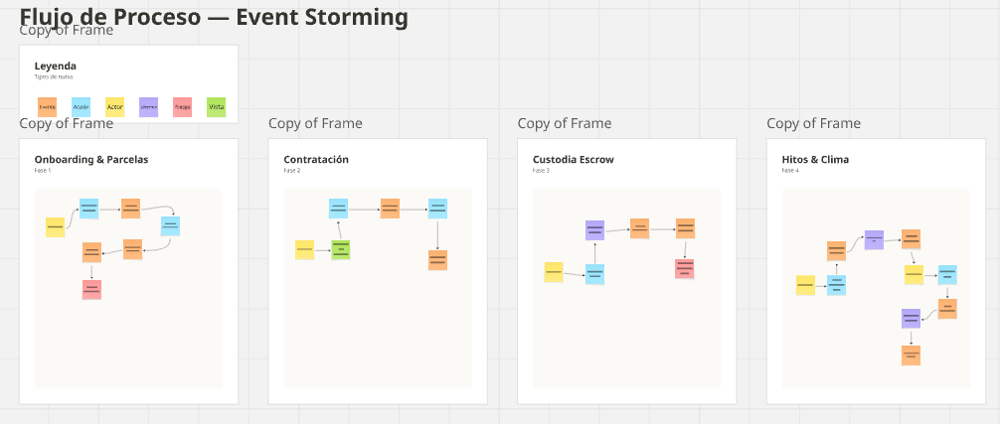

* **Fase de Onboarding, Registro y Negociación:** Detalla el flujo inicial de captura de coordenadas GPS, publicación de hectáreas en el catálogo y la generación y firma del contrato digital respaldado en PDF.

  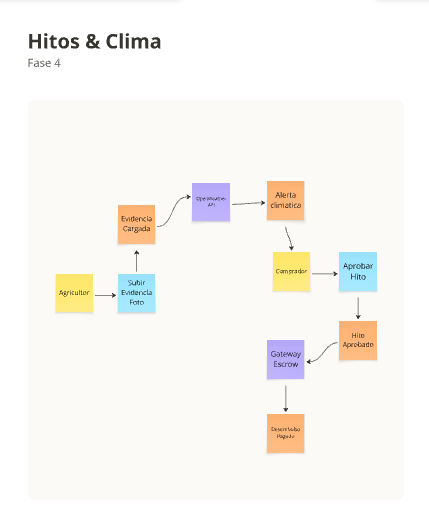

* **Fase de Custodia Escrow, Monitoreo Climático y Liberación de Pagos:** Modela la secuencia financiera de bloqueo de fondos en la bóveda, el envío de alertas meteorológicas y la validación de evidencias fotográficas para los desembolsos parciales por hitos cumplidos.

  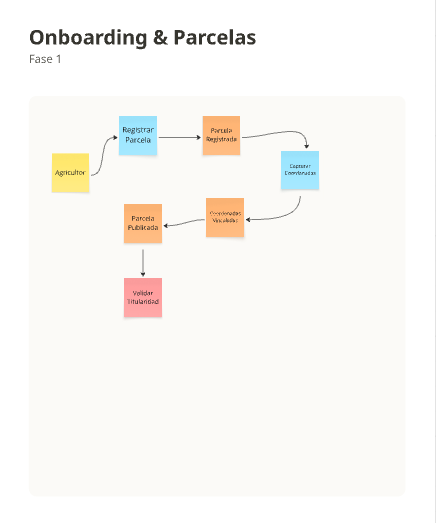

#### 2.5.1.1. Candidate Context Discovery

A partir del modelo general de dominio obtenido en la sesión de EventStorming, el equipo realizó la actividad de **Candidate Context Discovery** con una duración aproximada de 2 horas. Para delimitar los *Bounded Contexts* del sistema, se aplicaron de manera combinada las técnicas de **Look-for-Pivotal-Events** (identificación de eventos clave que marcan transiciones de estado) y **Start-with-Value** (agrupación de conceptos centrada en las capacidades *core* del negocio).

A continuación, se detalla la evolución progresiva del dominio a través de las evidencias del tablero:

#### Paso 1: Mapeo y Descomposición del Timeline de Procesos

En la primera etapa se organizó la línea de tiempo del proceso de negocio, dividiendo las acciones, comandos, agregados y sistemas externos en 7 bloques secuenciales:

  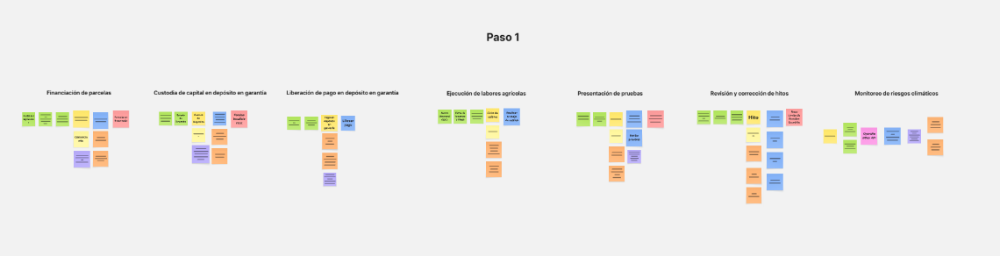

1. **Financiación de parcelas:** Negociación y acuerdo inicial entre el agricultor y el comerciante.
2. **Custodia de capital en depósito en garantía:** Proceso de retención de fondos en la pasarela Escrow.
3. **Liberación de pago en depósito en garantía:** Reglas financieras para la transferencia parcial de capital.
4. **Ejecución de labores agrícolas:** Seguimiento de las actividades operativas en el campo.
5. **Presentación de pruebas:** Captura, almacenamiento y adjunto de evidencias fotográficas.
6. **Revisión y corrección de hitos:** Evaluación de la calidad del trabajo y gestión de correcciones por parte del comerciante.
7. **Monitoreo de riesgos climáticos:** Captura de datos meteorológicos y evaluación de alertas de riesgo.

---

#### Paso 2: Delimitación Preliminar e Identificación de Eventos Pivote

En esta fase se trazaron los primeros límites candidateando agrupaciones de subprocesos donde se detectaron eventos pivote (cambios significativos de estado o de responsabilidad operativa).

  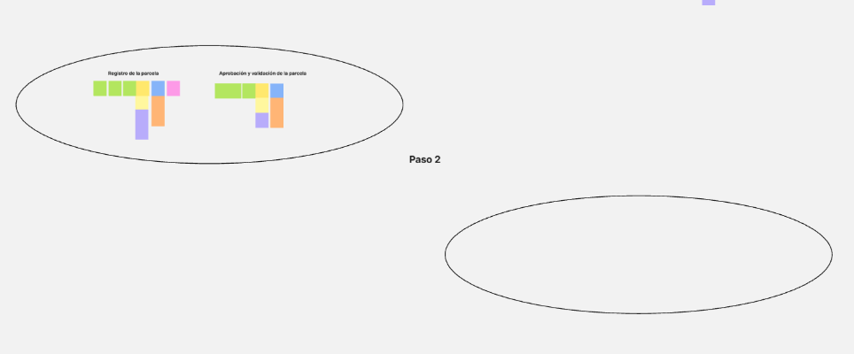

Se identificó de manera temprana la frontera que separa la administración y validación previa del terreno (**Registro y Aprobación de la Parcela**) de los flujos transaccionales y de ejecución que suceden con posterioridad.

---

#### Paso 3: Consolidación e Interconexión de Bounded Contexts

En la etapa final, el equipo refinó las agrupaciones hasta definir los **5 Bounded Contexts principales** de la plataforma, modelando los flujos de comunicación e intercambio de eventos de dominio entre ellos:

  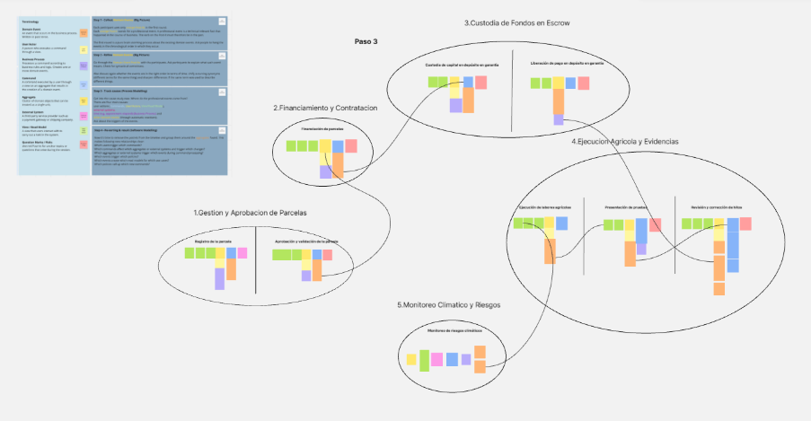

1. **Gestión y Aprobación de Parcelas (*Parcel Management Service*):** Bounded Context enfocado en el catálogo de terrenos, geolocalización por coordenadas GPS, tipo de suelo y estado de disponibilidad de la parcela.
2. **Financiamiento y Contratación (*Agreements / Contract Service*):** Bounded Context responsable de gestionar las ofertas de abastecimiento, la negociación de volúmenes y la formalización de contratos agrícolas digitales.
3. **Custodia de Fondos en Escrow (*Escrow & Payments Service*):** Bounded Context encargado de la integración con pasarelas financieras para la retención en garantía de capital y las órdenes de desembolso parcial por hito.
4. **Ejecución Agrícola y Evidencias (*Tracking & Evidence Service*):** Bounded Context dedicado a la captura/sincronización offline de fotos georreferenciadas, revisión de entregables y aprobación o rechazo de hitos agrícolas.
5. **Monitoreo Climático y Riesgos (*Alerts Management Service*):** Bounded Context encargado de la ingesta de datos desde APIs externas (OpenWeather) para la emisión y distribución de alertas climáticas preventivas.

   
#### 2.5.1.2. Domain Message Flows Modeling

Para representar cómo interactúan los *Bounded Contexts* con los actores del sistema frente a escenarios reales de negocio, el equipo aplicó **Domain Storytelling**. Esta metodología conecta visualmente a los **Actores** (Agricultor, Comerciante, OpenWeather API), **Comandos** (cajas azules), **Datos de Trabajo** (notas amarillas), **Bounded Contexts** (nubes) y **Estados Resultantes** (cajas naranjas).

A continuación, se documenta la colaboración distribuida en tres vistas clave del proceso:

#### Vista 1: Registro, Catálogo y Contratación

Modela el proceso desde el alta del terreno hasta la solicitud del contrato comercial:

  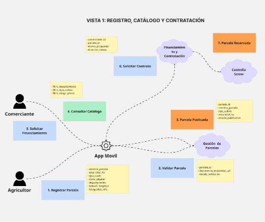

1. **Registrar Parcela:** El agricultor ingresa datos del terreno (área, ubicación GPS, fotos) desde la App Móvil.
2. **Validar Parcela:** La App envía la información al Bounded Context de *Gestión de Parcelas*.
3. **Parcela Publicada:** Tras validarse, se activa el estado para mostrar el lote en el catálogo público.
4. **Consultar Catálogo:** El comerciante busca parcelas aplicando filtros de búsqueda en la app.
5. **Solicitar Financiamiento:** El comerciante elige una parcela e inicia una propuesta de abastecimiento.
6. **Solicitar Contrato:** La App remite la oferta formal al contexto de *Financiamiento y Contratación*.
7. **Parcela Reservada:** Se bloquea la oferta en el catálogo y se notifica a *Custodia Escrow* para habilitar el depósito.

---

#### Vista 2: Custodia Escrow y Trabajo de Campo

Modela la retención del capital en garantía y el registro de evidencias en el campo:

  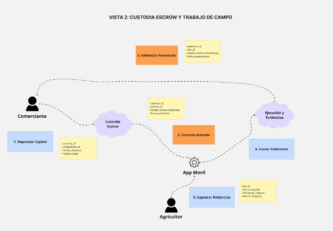

1. **Depositar Capital:** El comerciante transfiere los fondos requeridos hacia el Bounded Context de *Custodia Escrow*.
2. **Contrato Activado:** Confirmado el depósito, se emite el estado de activación del acuerdo agrícola.
3. **Capturar Evidencias:** El agricultor toma fotos con metadatos GPS/fecha (soporta modo offline en la app).
4. **Enviar Evidencias:** La App Móvil sincroniza los datos al Bounded Context de *Ejecución y Evidencias*.
5. **Evidencias Presentadas:** Se notifica al comerciante la existencia de entregables pendientes de auditoría.

---

#### Vista 3: Auditoría, Desembolso y Clima

Modela la aprobación de entregables, la liberación de pagos y la notificación preventiva de alertas meteorológicas:

  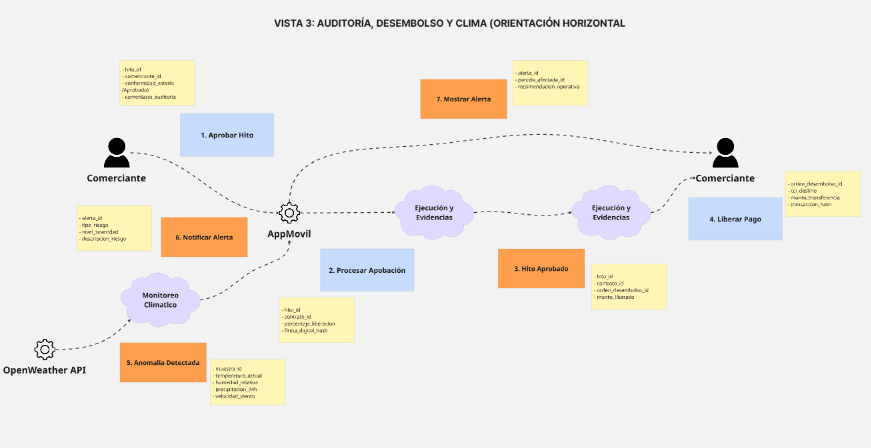

1. **Aprobar Hito:** El comerciante evalúa las pruebas recibidas desde la App Móvil y emite su conformidad.
2. **Procesar Aprobación:** La App comunica la decisión al Bounded Context de *Ejecución y Evidencias*.
3. **Hito Aprobado:** El sistema consolida la validación técnica de la etapa de cultivo.
4. **Liberar Pago:** Se dispara la orden hacia *Custodia Escrow* para transferir el porcentaje parcial correspondiente al agricultor.
5. **Anomalía Detectada:** *OpenWeather API* transmite métricas climáticas críticas al Bounded Context de *Monitoreo Climático*.
6. **Notificar Alerta:** El contexto calcula las parcelas afectadas dentro del radio de riesgo y envía el aviso a la app.
7. **Mostrar Alerta:** La App Móvil despliega alertas preventivas con recomendaciones operativas en tiempo real.

#### 2.5.1.3. Bounded Context Canvases

En esta sección, el equipo diseña sus *candidate bounded contexts*, detallando sus criterios de diseño clave. A continuación, se presentan los Bounded Context Canvases elaborados para la solución, ordenados por su importancia estratégica dentro del sistema:

#### 1. Custodia de Fondos en Escrow (*Core Domain*)

  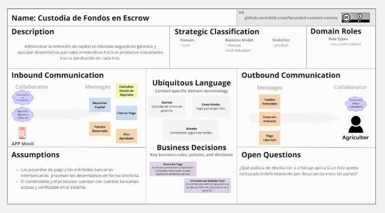

* **Descripción:** Administrar la retención de capital en garantía y la ejecución de desembolsos parciales irreversibles tras la aprobación de cada hito.
* **Clasificación Estratégica:** Domain: *Core* | Business Model: *Revenue / Cost Reduction* | Evolution: *Product*.
* **Entradas y Salidas:** Recibe peticiones de depósito y liberación de fondos; emite notificaciones de fondos retenidos, contrato activado y pagos liberados hacia la App Móvil y el Agricultor.

---

#### 2. Ejecución Agrícola y Evidencias (*Core Domain*)

  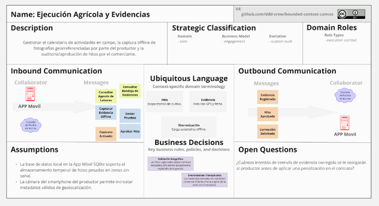

* **Descripción:** Gestionar el calendario de actividades en campo, la captura offline de evidencias fotográficas georreferenciadas y la revisión/aprobación de hitos.
* **Clasificación Estratégica:** Domain: *Core* | Business Model: *Engagement* | Evolution: *Custom Built*.
* **Entradas y Salidas:** Recibe datos de capturas de pruebas en campo y solicitudes de revisión de hitos; emite estados de evidencia registrada, hito aprobado y correcciones solicitadas.

---

#### 3. Financiamiento y Contratación (*Supporting Domain*)

  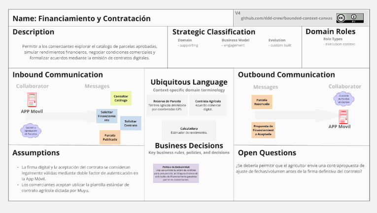

* **Descripción:** Permitir explorar el catálogo de parcelas aprobadas, simular rendimientos, negociar condiciones comerciales y formalizar contratos digitales.
* **Clasificación Estratégica:** Domain: *Supporting* | Business Model: *Engagement* | Evolution: *Custom Built*.
* **Entradas y Salidas:** Recibe solicitudes de financiamiento y emisión de contratos desde la App Móvil; emite avisos de parcela reservada y propuesta aceptada hacia la custodia Escrow.

---

#### 4. Gestión y Aprobación de Parcelas (*Supporting Domain*)

  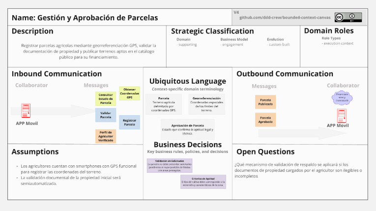

* **Descripción:** Registrar parcelas agrícolas mediante georreferenciación GPS, validar la documentación de propiedad y publicar terrenos aptos en el catálogo público.
* **Clasificación Estratégica:** Domain: *Supporting* | Business Model: *Engagement* | Evolution: *Custom Built*.
* **Entradas y Salidas:** Recibe solicitudes de registro, delimitación geográfica y validación de terrenos; emite notificaciones de parcela aprobada y publicada.

---

#### 5. Monitoreo Climático y Riesgos (*Generic Domain*)

  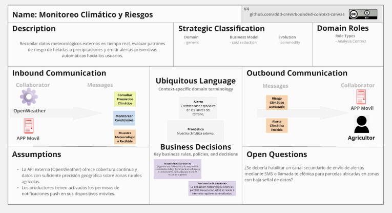

* **Descripción:** Recopilar datos meteorológicos externos en tiempo real, evaluar patrones de riesgo climático y emitir alertas preventivas automáticas hacia los usuarios.
* **Clasificación Estratégica:** Domain: *Generic* | Business Model: *Cost Reduction* | Evolution: *Commodity*.
* **Entradas y Salidas:** Ingiere datos climáticos de la API externa (OpenWeather) y consultas de pronóstico; emite alertas automáticas de riesgo detectado hacia la App Móvil y los usuarios.

### 2.5.2. Context Mapping

A continuación, se presenta el diagrama de Context Mapping (Mapa de Contexto) del proyecto Muyu. Este diagrama ilustra de manera clara la estructura estratégica de la solución, definiendo los límites explícitos entre los distintos Bounded Contexts (Contextos Delimitados) identificados en el sistema y estableciendo las relaciones de integración, flujo de datos y patrones de comunicación (como Customer-Supplier, Shared Kernel, o Upstream/Downstream) que gobiernan la interacción entre cada uno de los microservicios y módulos de la plataforma.

  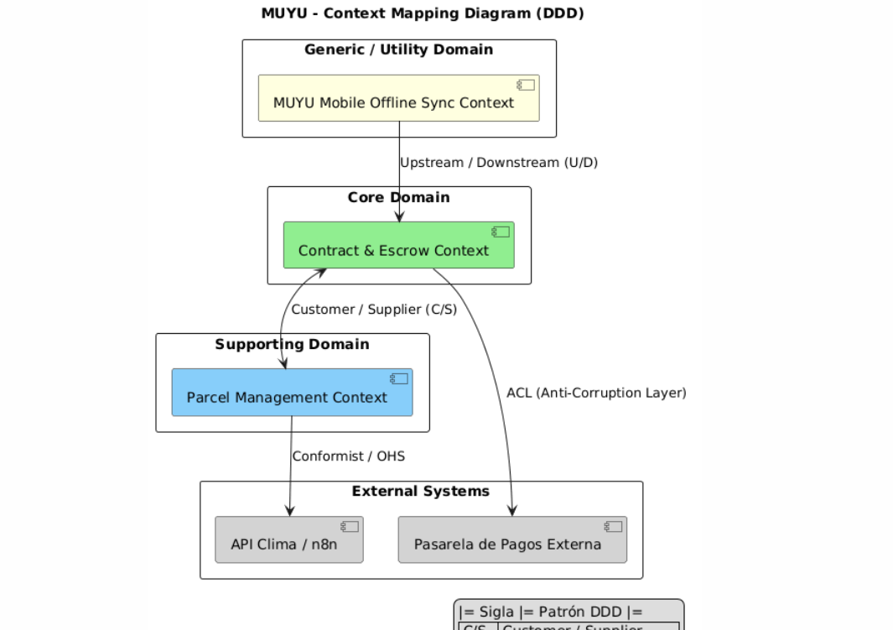

### 2.5.3. Software Architecture

Para entender cómo se relaciona la aplicación móvil MUYU con su entorno, el diagrama de contexto (Nivel 1 C4) ubica la app en el centro del flujo operacional. A su alrededor se muestran los usuarios principales el Productor Agrícola en campo y el Comercializador junto con los servicios externos que respaldan la operación: el pronóstico del clima en tiempo real, la automatización de notificaciones y la pasarela de custodia financiera.

#### 2.5.3.1. Software Architecture Context Level Diagrams

Este diagrama de contexto ilustra cómo la aplicación móvil MUYU interactúa de forma general con los usuarios en campo y los servicios externos del sistema.

  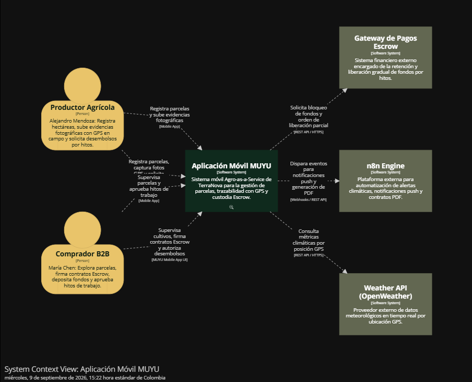  

#### 2.5.3.2. Software Architecture Container Level Diagrams

Este diagrama de contenedores muestra los bloques tecnológicos internos de MUYU, destacando la aplicación cliente, su base de datos local para modo offline y los microservicios backend.

 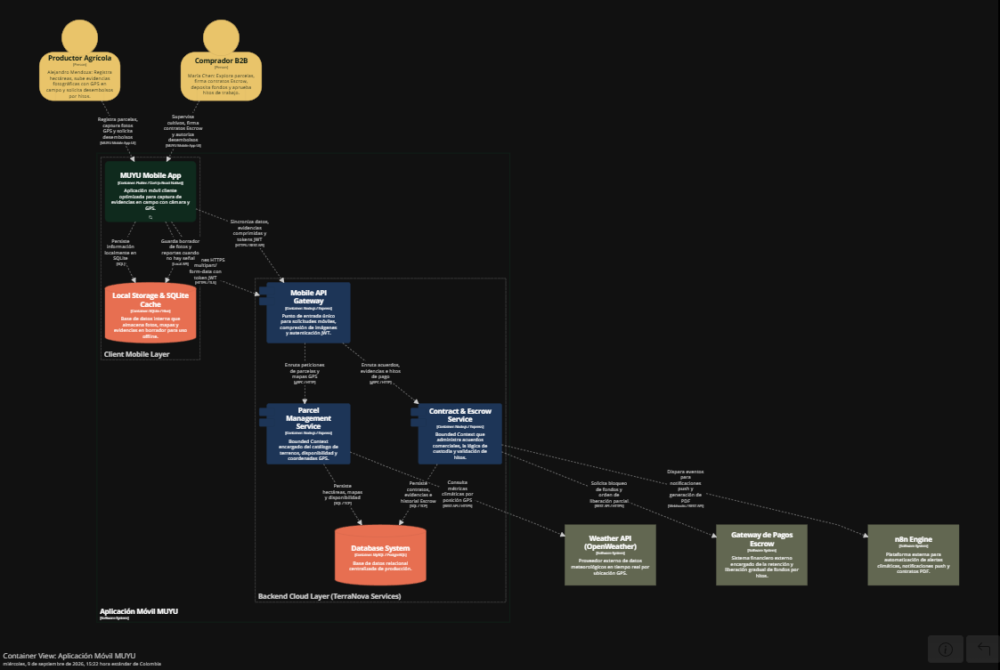  

#### 2.5.3.3. Software Architecture Deployment Diagrams

Este diagrama de despliegue representa la infraestructura física y en la nube donde se ejecuta la aplicación móvil y se conectan sus servidores.

 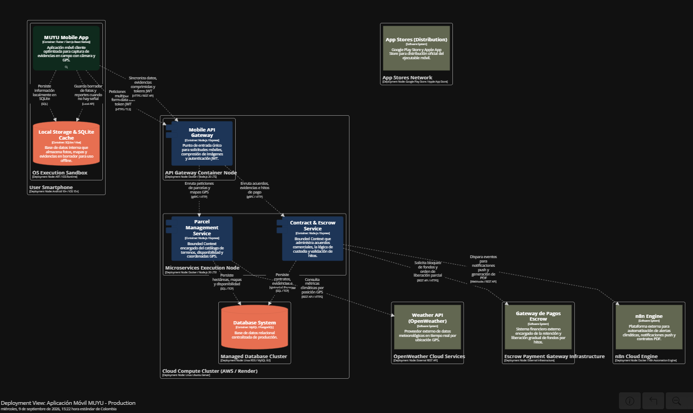  

## 2.6. Tactical-Level Domain-Driven Design
### 2.6.1. Bounded Context: Gestión y Aprobación de Parcelas Service
Representa la capacidad del sistema encargada de registrar, validar espacialmente y catalogar las parcelas agrícolas. Su propósito es asegurar que los terrenos cuenten con georreferenciación GPS válida antes de ser publicados en el catálogo público para su financiamiento. La entidad principal es `Parcel`, la cual concentra las reglas de negocio del terreno y sus límites geográficos.
#### 2.6.1.1. Domain Layer

La capa de dominio contiene el núcleo de las reglas espaciales y de disponibilidad de terrenos.

* **Aggregate Root:** `Parcel` (Atributos: id, farmerId, name, area, soilType, status, createdAt).
* **Entities:** `GPSBoundary` (Polígono delimitador del terreno).
* **Value Objects:** `Hectare` (Extensión numérica), `GPSCoordinate` (Latitud y longitud), `ParcelStatus` (Enum: DRAFT, PENDING_APPROVAL, AVAILABLE, RESERVED), `SoilType` (Enum: CLAY, SANDY, LOAMY, SILTY).
* **Commands:** `RegisterParcelCommand`, `ApproveParcelCommand`, `PublishParcelCommand`.
* **Queries:** `GetAvailableParcelsQuery`, `GetParcelByIdQuery`.
* **Domain Events:** `ParcelRegisteredEvent`, `ParcelApprovedEvent`, `ParcelPublishedEvent`.
* **Reglas de negocio:** Una parcela no puede ser publicada si no cuenta con al menos 3 coordenadas GPS que formen un polígono cerrado. No puede cambiar a estado disponible si sus coordenadas se superponen con otra parcela existente.

#### 2.6.1.2. Interface Layer

Contiene los controladores que exponen los servicios de catálogo y registro al frontend móvil de Muyu.

* **REST Controllers:** `ParcelsController`, `CatalogController`.
* **Endpoints:** `POST /api/v1/parcels`, `PUT /api/v1/parcels/{id}/approve`, `GET /api/v1/catalog/parcels`.
* **DTOs:** `RegisterParcelResource`, `ParcelSummaryResource`, `BoundaryPointResource`.
* **Assemblers:** Transforma recursos HTTP en comandos del dominio (ej. `RegisterParcelCommandFromResourceAssembler`).

#### 2.6.1.3. Application Layer

Coordina los flujos de alta de terrenos y consultas de catálogo.

* **Command Services:** `ParcelCommandServiceImpl` (Valida geometría, estructura los límites y guarda la parcela).
* **Query Services:** `CatalogQueryServiceImpl`.
* **Flujo principal:** El agricultor envía los datos desde la app móvil; el `ParcelCommandService` valida el polígono con el servicio GPS externo. Si es correcto, guarda la entidad `Parcel`, cambia el estado a "PENDING_APPROVAL" y dispara un evento para su revisión final.

#### 2.6.1.4. Infrastructure Layer

Gestiona la persistencia espacial y la integración con validadores de mapas.

* **Repositories:** `ParcelRepository` (extiende JpaRepository o similar con soporte espacial), `GPSBoundaryRepository`.
* **Adapters:** `GeospatialValidationAdapter` (comunicación REST con servicios de mapas satelitales).
* **Persistencia:** Tablas `parcels` y `parcel_boundaries` con llaves foráneas y restricciones de integridad.

#### 2.6.1.5. Bounded Context Software Architecture Component Level Diagrams

Este diagrama detalla la arquitectura interna a nivel de componentes para el contexto **Gestión y Aprobación de Parcelas**, aplicando el patrón CQRS (separación de operaciones de lectura y escritura) y la inyección de dependencias a través de las capas de Interfaz, Aplicación, Dominio e Infraestructura.

  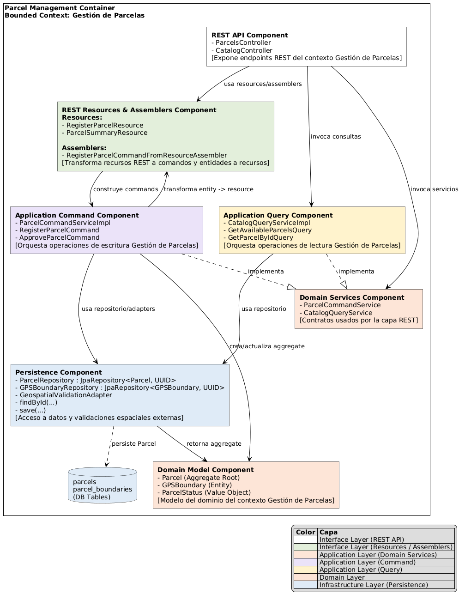

#### 2.6.1.6. Bounded Context Software Architecture Code Level Diagrams
##### 2.6.1.6.1. Bounded Context Domain Layer Class Diagrams
Este diagrama muestra el modelo de clases de la capa de dominio, destacando el Aggregate Root principal (`Parcel`) y cómo interactúa con los servicios de comando y consulta (CQRS).

  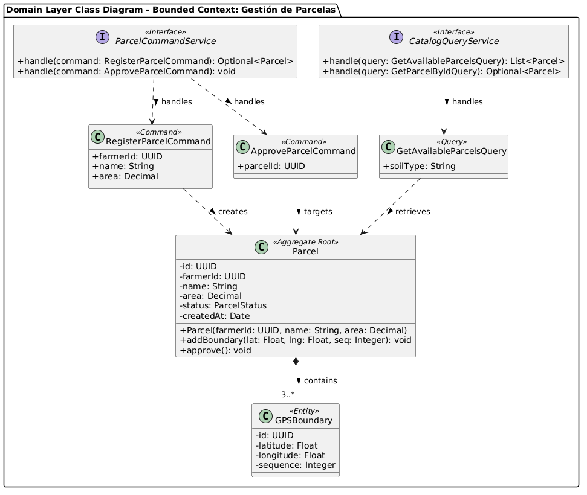

##### 2.6.1.6.2. Bounded Context Database Design Diagram
Este diagrama relacional conectando `parcels` y `parcel_boundaries`, donde cada límite geográfico pertenece a una parcela, garantizando la trazabilidad espacial del terreno.

  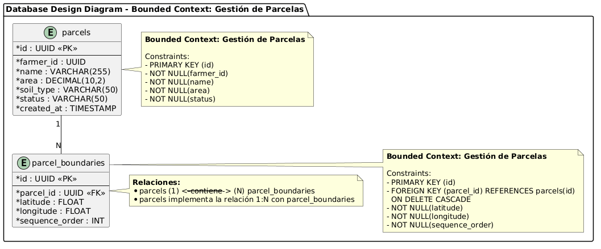

### 2.6.x. Bounded Context: <Bounded Context Name>
#### 2.6.x.1. Domain Layer
#### 2.6.x.2. Interface Layer
#### 2.6.x.3. Application Layer
#### 2.6.x.4. Infrastructure Layer
#### 2.6.x.5. Bounded Context Software Architecture Component Level Diagrams
#### 2.6.x.6. Bounded Context Software Architecture Code Level Diagrams
##### 2.6.x.6.1. Bounded Context Domain Layer Class Diagrams
##### 2.6.x.6.2. Bounded Context Database Design Diagram

### 2.6.x. Bounded Context: <Bounded Context Name>
#### 2.6.x.1. Domain Layer
#### 2.6.x.2. Interface Layer
#### 2.6.x.3. Application Layer
#### 2.6.x.4. Infrastructure Layer
#### 2.6.x.5. Bounded Context Software Architecture Component Level Diagrams
#### 2.6.x.6. Bounded Context Software Architecture Code Level Diagrams
##### 2.6.x.6.1. Bounded Context Domain Layer Class Diagrams
##### 2.6.x.6.2. Bounded Context Database Design Diagram

### 2.6.x. Bounded Context: <Bounded Context Name>
#### 2.6.x.1. Domain Layer
#### 2.6.x.2. Interface Layer
#### 2.6.x.3. Application Layer
#### 2.6.x.4. Infrastructure Layer
#### 2.6.x.5. Bounded Context Software Architecture Component Level Diagrams
#### 2.6.x.6. Bounded Context Software Architecture Code Level Diagrams
##### 2.6.x.6.1. Bounded Context Domain Layer Class Diagrams
##### 2.6.x.6.2. Bounded Context Database Design Diagram

### 2.6.x. Bounded Context: <Bounded Context Name>
#### 2.6.x.1. Domain Layer
#### 2.6.x.2. Interface Layer
#### 2.6.x.3. Application Layer
#### 2.6.x.4. Infrastructure Layer
#### 2.6.x.5. Bounded Context Software Architecture Component Level Diagrams
#### 2.6.x.6. Bounded Context Software Architecture Code Level Diagrams
##### 2.6.x.6.1. Bounded Context Domain Layer Class Diagrams
##### 2.6.x.6.2. Bounded Context Database Design Diagram

# Capítulo III: Solution UI/UX Design

## 3.1. Product design
### 3.1.1. Style Guidelines
#### 3.1.1.1. General Style Guidelines
### 3.1.2. Information Architecture
#### 3.1.2.1. Organization Systems
#### 3.1.2.2. Labelling Systems
#### 3.1.2.3. SEO Tags and Meta Tags
#### 3.1.2.4. Searching Systems
#### 3.1.2.5. Navigation Systems
### 3.1.3. Landing Page UI Design
#### 3.1.3.1. Landing Page Wireframe
#### 3.1.3.2. Landing Page Mock-up
### 3.1.4. Mobile Applications UX/UI Design
#### 3.1.4.1. Mobile Applications Wireframes
#### 3.1.4.2. Mobile Applications Wireflow Diagrams
#### 3.1.4.3. Mobile Applications Mock-ups
#### 3.1.4.4. Mobile Applications User Flow Diagrams
#### 3.1.4.5. Mobile Applications Prototyping

# Capítulo IV: Product Implementation & Validation

## 4.1. Software Configuration Management
### 4.1.1. Software Development Environment Configuration
### 4.1.2. Source Code Management
### 4.1.3. Source Code Style Guide & Conventions
### 4.1.4. Software Deployment Configuration

## 4.2. Landing Page & Mobile Application Implementation
### 4.2.1. Sprint 1
#### 4.2.1.1. Sprint Planning 1
#### 4.2.1.2. Aspect Leaders and Collaborators
#### 4.2.1.3. Sprint Backlog 1
#### 4.2.1.4. Development Evidence for Sprint Review
#### 4.2.1.5. Testing Suite Evidence for Sprint Review
#### 4.2.1.6. Execution Evidence for Sprint Review
#### 4.2.1.7. Services Documentation Evidence for Sprint Review
#### 4.2.1.8. Software Deployment Evidence for Sprint Review
#### 4.2.1.9. Team Collaboration Insights during Sprint
### 4.2.2. Sprint 2
#### 4.2.2.1. Sprint Planning 2
#### 4.2.2.2. Aspect Leaders and Collaborators
#### 4.2.2.3. Sprint Backlog 2
#### 4.2.2.4. Development Evidence for Sprint Review
#### 4.2.2.5. Testing Suite Evidence for Sprint Review
#### 4.2.2.6. Execution Evidence for Sprint Review
#### 4.2.2.7. Services Documentation Evidence for Sprint Review
#### 4.2.2.8. Software Deployment Evidence for Sprint Review
#### 4.2.2.9. Team Collaboration Insights during Sprint
### 4.2.3. Sprint 3
#### 4.2.3.1. Sprint Planning 3
#### 4.2.3.2. Aspect Leaders and Collaborators
#### 4.2.3.3. Sprint Backlog 3
#### 4.2.3.4. Development Evidence for Sprint Review
#### 4.2.3.5. Testing Suite Evidence for Sprint Review
#### 4.2.3.6. Execution Evidence for Sprint Review
#### 4.2.3.7. Services Documentation Evidence for Sprint Review
#### 4.2.3.8. Software Deployment Evidence for Sprint Review
#### 4.2.3.9. Team Collaboration Insights during Sprint

## 4.3. Validation Interviews
### 4.3.1. Diseño de Entrevistas
### 4.3.2. Registro de Entrevistas
### 4.3.3. Evaluaciones según heurísticas

# Conclusiones y Recomendaciones

# Video App Validation

# Video About the product

# Video About the team

# Glosario

# Bibliografía

# Anexos

## Anexo A. Reporte de análisis de entrevistas en Power BI

Se incluye el reporte elaborado en Power BI y los archivos relacionados con el procesamiento de los resultados.
[Acceder al material del análisis de entrevistas](https://drive.google.com/drive/folders/1oKjyxYU3_nnoHlnLRSSLgNb32xE3QeD8?usp=sharing)

